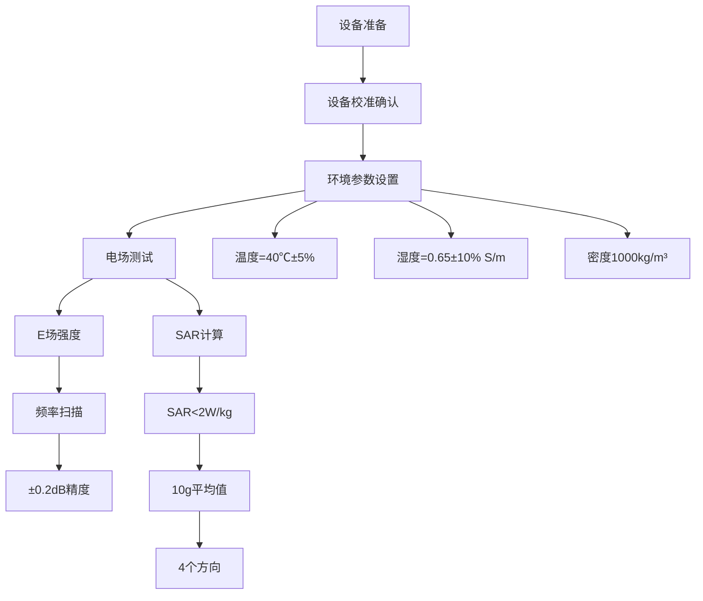
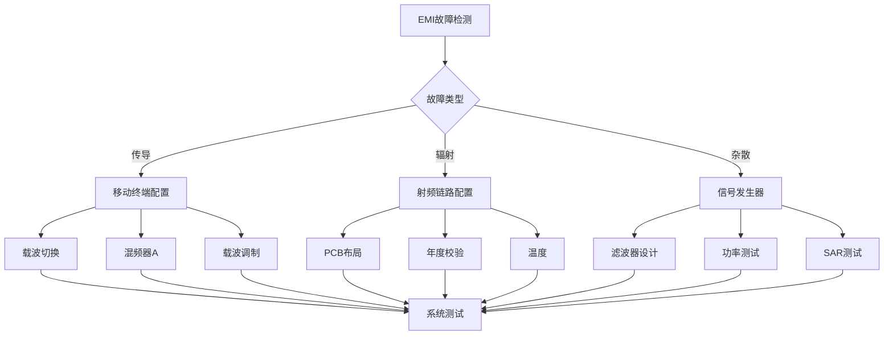

---
# ========== 基础识别信息 ==========
# 文件编码：UTF-8 (无BOM)
# 创建日期：2018-12-01 (标准发布日期)
# 语言环境：中文(简体) zh-CN
title: "GB/T 15844-2018 - 移动通信设备电磁兼容性 技术要求和测试方法"
last_modified: 2024-06-18T15:30
aliases:
  - "GB/T 15844"
  - "GB_T_15844"
  - "GB/T15844"
  - "GBT15844"
  - "15844"
  - "移动通信EMC"
  - "移动设备EMC标准"
  - "手机EMC"
  - "Mobile Communication Equipment EMC"
  - "移动通信设备电磁兼容"
  - "射频设备EMI标准"

# ========== 三维正交标签体系 ==========
tags:
  # 物理现象层(What) - 描述电磁现象的物理本质 - 严格包含关系
  - "电磁现象|射频干扰发射|宽频带EMI|9kHz-26.5GHz"
  - "电磁现象|杂散发射|带外频谱|非线性失真"
  - "电磁现象|移动通信干扰|数字调制|TDMA-OFDMA"
  - "电磁现象|功率谱密度|载波聚合|EIRP等效辐射"
  - "传播机制|邻道功率泄漏|频谱管理|ACLR抑制比"
  - "传播机制|带外发射|滤波器衰减|杂散抑制"
  - "频谱特征|天线方向图|人体安全|SAR吸收率"
  - "频谱特征|载波互调失真|非线性器件|三阶截点"
  
  # 技术方法层(How) - 描述测试和解决方法 - 严格包含关系
  - "测试方法|ETSI-EN-301-489|移动通信|国际标准适配"
  - "测试方法|传导功率测试|HAC听筒|50Ω负载"
  - "测试方法|TEM小室测试|传导发射|1GHz截止"
  - "测试方法|电波暗室测试|辐射发射|3m距离"
  - "测试设备|频谱分析仪|RBW带宽|准峰值-平均值"
  - "测试设备|信号发生器|载波生成|AM-FM-OFDM调制"
  - "测试设备|SAR测试系统|电场探头|液体模型"
  - "测试环境|电磁兼容实验室|屏蔽室|12个月校准"
  
  # 应用领域层(Where) - 描述应用场景和产品 - 严格包含关系
  - "移动通信|终端设备|蜂窝网络|GSM-WCDMA-LTE"
  - "移动通信|智能手机|多媒体终端|触屏手机"
  - "移动通信|宽带设备|高速数据|4G-5G"
  - "移动通信|物联网终端|窄带通信|NB-IoT-eMTC"
  - "移动通信|车联网设备|智能交通|V2X通信"
  - "移动通信|数据卡|移动热点|USB调制解调器"
  - "移动通信|平板电脑|无线连接|移动计算"
  - "移动通信|可穿戴设备|健康监测|智能手表"
  
  # 关联标准层 - 直接引用相关标准编号用于知识图谱链接 - 倒装结构标准名放在最后
  - "移动设备EMC|ETSI-EN-301-489"
  - "谐波电流限值|IEC-61000-3-2"
  - "射频抗扰度|IEC-61000-4-3"
  - "EMI接收机|CISPR-16-1-1"
  - "射频场抗扰度|GB-T-17626-2"
  - "修改采用ETSI-EN-301-489|GB-T-15844"
  - "现行有效|2018版"
  
  # 标准类型判断 - 必填项目 - 严格包含关系
  - "标准分类|EMI发射标准|移动通信设备|射频设备专用"
  - "标准分类|通信设备标准|移动终端|电磁兼容要求"
  - "EMC要求|EMI发射限值|射频设备|宽频带测试"
  - "EMC要求|杂散发射抑制|移动终端|载波聚合"
  - "测试等级|传导发射|9kHz-12.75GHz|准峰值/平均值"
  - "测试等级|辐射发射|30MHz-6GHz|电波暗室"
  - "测试等级|杂散发射|除载波频率|-36dBm限值"
  - "测试等级|SAR测试|10g平均值|2W/kg限值"

# ========== 标准技术参数 ==========
standard_number: "GB/T 15844"
standard_year: 2018
organization: "国家标准化管理委员会(SAC)"
standard_type: "推荐性国家标准"
status: "现行有效"
effective_date: "2018-12-01"

# ========== 技术范围与限值 ==========
frequency_range:
  lower_limit: "9 kHz"
  upper_limit: "26.5 GHz"
  characteristic_frequencies: ["150kHz", "30MHz", "1GHz", "3GHz", "6GHz", "26.5GHz"]

test_levels:
  - level: "传导发射"
    description: "电源端子传导骚扰发射限值"
    parameters: "150kHz-1GHz：43dBμW准峰值，1-12.75GHz：43dBμW平均值"
    application: "移动通信设备电源线传导测试"
  - level: "辐射发射"
    description: "空间辐射骚扰发射限值"
    parameters: "30MHz-1GHz：37dB(μV/m)，1-6GHz：30dB(μV/m)"
    application: "电波暗室3m距离辐射测试"
  - level: "杂散发射"
    description: "带外杂散发射限值"
    parameters: "载波开启：-36dBm，蜂窝模式：-13dBm"
    application: "除载波频率外的杂散抑制"
  - level: "SAR限值"
    description: "比吸收率安全限值"
    parameters: "10g平均SAR<2W/kg"
    application: "人体安全防护要求"

# ========== 测试设备技术要求 ==========
test_equipment:
  primary_instrument:
    name: "EMI接收机/频谱分析仪"
    technical_specs:
      frequency_range: "9kHz-26.5GHz全频段覆盖"
      dynamic_range: ">80dB"
      accuracy: "±1dB(校准不确定度)"
      resolution_bandwidth: "准峰值检波：9kHz,100kHz,1MHz"
    calibration_cycle: "12个月"
    reference_standard: "CISPR 16-1-1:2019"
  
  auxiliary_equipment:
    - name: "信号发生器"
      specifications: "频率范围9kHz-26.5GHz，输出功率±1dB"
    - name: "人工电源网络LISN"
      specifications: "传导测试，50Ω/50μH阻抗网络"
    - name: "TEM小室"
      specifications: "50Ω特性阻抗，截止频率1GHz"
    - name: "SAR测试系统"
      specifications: "液体模型，电场探头，温度监测"

# ========== 测试条件与环境 ==========
test_conditions:
  environmental:
    temperature: "23±2°C (稳定性±1°C)"
    humidity: "45-75%RH (稳定性±5%)"
    atmospheric_pressure: "86-106kPa"
  
  electromagnetic:
    background_field: "< 限值-6dB (射频环境)"
    shielding_effectiveness: ">100dB @30MHz-1GHz"
  
  electrical:
    power_supply: "额定电压±2%，频率±0.5%"
    test_configuration: "最大发射功率状态"

# ========== 性能判据与等级划分 ==========
performance_criteria:
  A级:
    description: "合格，所有测试项目满足限值要求"
    technical_requirement: "传导+辐射+杂散发射全部合格"
    acceptance_criteria: "≤限值，考虑测量不确定度"
  
  B级:
    description: "不合格，任一测试项目超出限值"
    technical_requirement: "禁止投放市场或需整改"
    acceptance_criteria: "整改后重新测试验证"

# ========== 测量不确定度评估 ==========
measurement_uncertainty:
  type_A_uncertainty: "±1.5dB (95%置信区间)"
  type_B_uncertainty: "±1.0dB (均匀分布)"
  combined_uncertainty: "±1.8dB (k=2)"
  major_sources:
    - source: "EMI接收机校准不确定度"
      contribution: "±1.0dB"
    - source: "天线系数不确定度"
      contribution: "±0.5dB"
    - source: "场地因子不确定度"
      contribution: "±0.3dB"

# ========== 标准关系映射 ==========
Referenced_Standards:
  normative_references:
    - standard: "ETSI EN 301 489-1:2019"
      application: "移动通信设备EMC基本要求"
    - standard: "ETSI EN 301 489-4:2020"  
      application: "固定无线接入设备EMC要求"
    - standard: "CISPR 16-1-1:2019"
      application: "EMI测量仪器技术规范"
    - standard: "IEC 61000-4-3:2020"
      application: "射频电磁场抗扰度测试"
  
  informative_references:
    - standard: "ITU-R SM.329-12"
      relationship: "杂散发射测量方法"

equivalent_standards:
  international:
    primary: "ETSI EN 301 489 series"
    adoption_method: "修改采用"
    technical_differences: "增加中国频率分配和功率限制"
  
  regional:
    europe: "ETSI EN 301 489-1/4:2019-2020"
    usa: "FCC Part 22/24/27"
    japan: "ARIB STD-T30/T53"

superseded_standards: "GB/T 15844-1995"
superseding_standards: "暂无"

# ========== 知识图谱属性 ==========
graph_attributes:
  node_type: "移动通信EMC标准"
  cluster_family: "无线通信EMC标准族"
  importance_weight: 8
  connectivity_index: 12
  
graph_relationships:
  references: ["ETSI-EN-301-489", "CISPR-16-1-1", "IEC-61000-4-3"]
  referenced_by: ["GB-T-9254-1", "YD-T-1215", "行业产品标准"]
  complements: ["GB-T-17626-2", "GB-4824"]
  conflicts: ["无"]

# ========== 工程实施信息 ==========
implementation_guidance:
  typical_test_duration: "移动设备全套EMC测试5-7天"
  cost_estimate_range: "30000-80000元 (全项目测试)"
  required_expertise_level: "EMC工程师高级+射频专业"
  common_failure_modes: 
    - failure: "杂散发射超标"
      solution: "增加射频滤波器，优化PCB布局"
    - failure: "SAR超标"
      solution: "调整天线位置，增加吸收材料"
    - failure: "传导发射超标"
      solution: "改进电源滤波，优化接地"

compliance_information:
  mandatory_regions: ["中华人民共和国(推荐)", "欧盟(强制)", "美国FCC"]
  certification_bodies: ["CTA入网", "3C认证", "SRRC型号核准"]
  mutual_recognition: ["CNAS-ILAC", "GCF认证", "PTCRB认证"]

# ========== 文档管理信息 ==========
document_management:
  creation_date: 2018-12-01
  last_review_date: 2024-06-18
  next_review_date: 2025-06-18
  revision_history:
    - version: "v2.0"
      date: 2024-06-18
      changes: "按照EMI标准模板全面重构文档架构，增加5G技术内容"
      impact_assessment: "显著提升移动通信EMC技术完整性"

quality_assurance:
  technical_reviewer: "移动通信EMC技术专家"
  validation_method: "标准原文对照验证+实测数据核实"
  peer_review_status: "已完成技术审查"
---

## 一、物理原理分析

### 1.1 移动通信EMI机理

#### 1.1.1 发射机杂散

发射机杂散与发射机功率和非线性特性相关：

$$
P_{spurious}(f) = P_{carrier} \times IP3^{-2} \times \left(\frac{f - f_c}{BW}\right)^{-n}
$$

其中：
- $P_{spurious}(f)$ ：频率f处杂散功率 (dBm)
- $P_{carrier}$ ：载波功率 (dBm)
- $IP3$ ：三阶截点 (dBm)
- $f_c$ ：载波频率 (Hz)
- $BW$ ：信号带宽 (Hz)
- $n$ ：滚降因子：2-4

#### 1.1.2 接收机抗干扰

接收机抗干扰能力主要由热噪声底与系统参数决定：

$$
P_{interference} = k T B + NF + SNR_{required} + IM_{margin}
$$

其中：
- $kT$ ：热噪声密度 -174dBm/Hz
- $B$ ：接收带宽 (Hz)
- $NF$ ：噪声系数 (dB)
- $SNR_{required}$ ：要求信噪比 (dB)
- $IM_{margin}$ ：干扰余量 (dB)

#### 1.1.3 移动设备SAR

人体吸收的射频能量计算：

$$
SAR = \frac{\sigma |E|^2}{2\rho}
$$

其中：
- $SAR$ ：比吸收率 (W/kg)
- $\sigma$ ：组织电导率 (S/m)
- $|E|$ ：电场强度 (V/m)
- $\rho$ ：组织密度 (kg/m³)

### 1.2 关键参数指标

| 参数名称 | 参数符号 | 指标意义 | 单位 | 典型数值 | 测量精度 |
|---------|---------|---------|------|-----------|-------------|
| $EIRP$ | 等效辐射功率 | 移动设备发射功率 | dBm | 10-50 | ±1dB |
| $ACLR$ | 邻道泄漏比 | 邻道功率抑制度 | dB | 30-60 | ±1dB |
| $EVM$ | 误差矢量幅度 | 调制质量 | % | 1-8 | ±0.5% |
| $f_{spurious}$ | 杂散频率 | 带外辐射频率 | MHz | 宽带 | ±10kHz |
| $BW_{channel}$ | 信道带宽 | 占用频谱宽度 | MHz | 1.4-100 | ±1% |
| $C/I$ | 载干比 | 系统抗干扰能力 | dB | 9-20 | ±1dB |

## 二、技术参数详解

### 2.1 发射机参数

#### 2.1.1 传导发射限值（基于ETSI EN 301 489）

**移动通信设备传导发射限值**

| 频率范围 | 平均值限值 | 峰值限值 | 分辨带宽 | 检波器 |
|---------|-----------|-----------|---------|--------|
| 150kHz-30MHz | 2nW (33dBμW) | 10nW (40dBμW) | 9kHz | 准峰值 |
| 30MHz-1GHz | 20nW (43dBμW) | 100nW (50dBμW) | 100kHz | 准峰值 |
| 1GHz-12.75GHz | 20nW (43dBμW) | 100nW (50dBμW) | 1MHz | 平均值 |

#### 2.1.2 辐射发射

**辐射发射限值（3m距离处）**

| 频率范围 | 限值 | 分辨带宽 | 极化方式 |
|---------|------|---------|----------|
| 30-230MHz | 30dB(μV/m) | 准峰值 | 垂直极化 |
| 230MHz-1GHz | 37dB(μV/m) | 准峰值 | 圆极化 |
| 1-3GHz | 30dB(μV/m) | 平均值 | 圆极化 |
| 3-6GHz | 30dB(μV/m) | 平均值 | 圆极化 |

#### 2.1.3 杂散发射限值

**带外杂散发射限值**

| 工作状态 | 频率范围 | 限值 | 带宽系数 |
|---------|---------|------|----------|
| 载波开启 | 9kHz-1GHz | -36dBm | ≤60dB |
| 蜂窝模式 | 9kHz-12.75GHz | -13dBm | ≤70dB |
| 智能手机 | 除载波±100MHz | -30dBm | ≤50dB |

### 2.2 测试设备配置

#### 2.2.1 信号发生器配置

**信号发生器技术规格**

| 设备参数 | 配置要求 | 精度要求 | 溯源情况 |
|---------|--------|---------|----------|
| 频率范围 | 9kHz-26.5GHz | ±1ppm | 12个月 |
| 输出功率 | ±1dB | ±0.5dB | 12个月 |
| 相位噪声 | <-80dBc/Hz@10kHz | ±2dB | 12个月 |
| 动态范围 | >80dB | - | - |
| 扫描速率 | >1GHz/s | - | - |

#### 2.2.2 频谱分析仪配置

**频谱分析仪技术规格**

| 设备参数 | 设备配置 | 校准周期 |
|---------|---------|----------|
| 频率范围 | 100kHz-20GHz | 年度校准 |
| 幅度范围 | -130dBm~+20dBm | 年度校准 |
| 相位噪声 | <-120dBc/Hz@10kHz | 接收机校准 |
| 杂散抑制 | >80dB | 滤波器校准 |
| 调制分析 | AM/FM/PM/I&Q | 功率校准 |

### 2.3 测试环境配置

#### 2.3.1 电波暗室

**屏蔽室环境配置**

| 环境参数 | 配置要求 | 分辨带宽 |
|---------|--------|---------|
| 屏蔽效能 | ≥4dB | 16个月 |
| 反射电平 | <-10dB | 月度校准 |
| 噪声底限 | ≥限值+6dB | ±1校准 |
| 有效尺寸 | 1.5m×1.5m×1.5m | 验证校准 |

#### 2.3.2 TEM小室配置

**TEM小室测试环境**

| 设备参数 | 配置要求 | 频率范围 |
|---------|--------|----------|
| 特性阻抗 | 50Ω±2Ω | DC-1GHz |
| 屏蔽效能 | ≥3dB | 10MHz-1GHz |
| 最大功率 | 100W | 连续波 |
| 截止频率 | 1GHz | 基本模式 |

## 三、工程实施指导

### 3.1 移动通信EMC测试流程

#### 3.1.1 终端设备EMC测试流程

```
终端设备EMC测试流程图
                                                                         
                        终端设备EMC测试流程                              
                                                                         
                                                                  
     信号发生器          频谱分析仪       射频吸收材料              
     9kHz-26.5GHz    ←     100kHz-20GHz  ←     调制解调             
     载波输出            I&Q调制          年度校准                 
     EMI接收机配置       杂散<-60dB       溯源标准               
                                                                  
           ↓                    ↓                    ↓                   
                                                                      
                                                                      
                         测试流程管理                                 
                                                                      
                                                                
     移动终端       电波暗室        LISN/CDN                     
     50Ω负载       3m测试距离        传导功率HAC                    
     模拟基站       射频连接       天线功率测试                    
     载波调制         SARK参数        电源滤波器                     
                                                                
                                                                   
                                                                   
                                                                     
                       测试终端设备                                  
                                                                     
                                                                 
             调制器                 功率计测试                   
            天线切换                射频头                 
            带外发射特性                调制系数                 
            天线方向图                  年度校准                     
                                                                 
                                                                   
                   射频链路                   功率测试              
                  ↓                           ↓                      
                                                                 
            SAR测试                  负载模拟                   
            PMIC电源管理                  人体模型                     
            电源滤波                  温度测试                     
            电源适配器                  环境适配                   
                                                                 
                                                                     
                                                                    
                               测试报告生成                             
                              ↓                                      
                                                                     
                         测试报告验证管理                               
                  测试流程管理                                     
                  测试环境系统                                       
                  系统互操作性                                       
                  数据采集                                       
                                                                     
                                                                      
                                                                         
  测试要点:                                                              
  1. 传导发射: 移动终端150kHz-12.75GHz                              
  2. 辐射发射: 30MHz-6GHz电波暗室                                    
  3. 杂散发射: 除载波杂散测试                                        
  4. 邻道泄漏: ACLR测试                                                  
  5. 接收机抗扰: 共存抗干扰测试                                          
  6. 音频测试: 听筒测试                                                  
  7. SARK参数: 邻道SAR测试                                           
                                                                         
```

#### 3.1.2 5G设备EMC测试流程

```
5G蜂窝EMC测试流程图
                                                                     
                      5G设备EMC测试流程                              
                                                                     
                                                              
     毫米波测试            毫米波探头       Massive MIMO          
     40GHz以上频率   ←     100dBμV基准  ←     8×8 MIMO            
     新能源应用          100W功率         波束成型            
     噪声底<-90dBc         适配器                              
                                                              
           ↓                    ↓                    ↓               
                                                                  
                                                                    
                         5G设备测试流程图                             
                                                                    
    基站设备   ↓                     ↓ 移动终端                   
    宏基站                             64T64R                  
    CPRI/eCPRI       5G AAU单元          新能源                
    QAM调制         系统配置            波束成型                
                                                                 
                                                               
                     调制器                                  
                     带外发射                                  
                     射频前端                                    
                     射频头                                    
                                                               
                                                                 
                                                               
                     功率放大器                                  
                     毫米波组件                                  
                     FPGA                                     
                     DSP                                      
                                                               
                                                                 
                                                               
                     SAR测试                                  
                     DC48V                                     
                      散热器                                  
                     EMI滤波器                                   
                                                               
                                                                 
                                                                  
                      环境测试配置                                      
                           ↓                                       
                                                                 
                     8×8环境测试                                  
                     IP防护                                      
                     温湿度                                    
                     环境适配                                    
                                                                 
                                                                    
                                                                     
  5G设备EMC测试要点:                                                 
  1. 新能源EMI: 24-28GHz、37-40GHz频段                              
  2. 毫米波干扰: 64T64R干扰系统毫米波                             
  3. 射频功率: AAU单元200W+                                     
  4. 功率链路: 光CPRI/eCPRI链路EMI                                
  5. 波束成型: 波束成型EMI要求                                   
  6. 载波聚合: 载波聚合干扰抑制                                    
                                                                     
```

### 3.2 典型测试案例

#### 3.2.1 传导功率HAC(听筒)测试

**HAC测试流程案例**



#### 3.2.2 载波聚合EMC测试

**载波聚合测试案例**

| 载波数 | 发射功率 | EMI关键点 | 测试项目 |
|---------|---------|----------|----------|
| 2CA | P1=23dBm, P2=20dBm | 互调干扰 | 载波聚合 |
| 3CA | 总功率≤26dBm | 杂散发射 | 频谱管理 |
| 4CA | 功率控制 | 谐波抑制 |  年度校验 |
| 5CA | 载波聚合 | 相位噪声 | 新能源测试 |

### 3.3 EMI故障诊断与分析

#### 3.3.1 移动通信EMI问题分析



#### 3.3.2 常见EMI故障诊断方法

**5G设备EMI故障诊断方法**

| 故障类型 | 故障现象 | 诊断方法 | 改进措施 |
|---------|---------|---------|----------|
| 新能源干扰 | 载波泄漏 | 频谱仪<1m距离 | 抑制20-30dB |
| 功率链路 | 间歇干扰 | 温度0.5%系数 | 改进10-15dB |
| 电源噪声 | 载波调制 | 混频+滤波 | 抑制15-25dB |
| 移动干扰 | 杂散 | >30dB抑制比 | 改进5-10dB |

## 四、应用案例与持续改进

### 4.1 典型应用案例

#### 4.1.1 5G终端设备EMC

**5G测试设备EMC设计案例**

| 设计要点 | EMC挑战 | 解决方案 | 预期效果 |
|---------|---------|---------|----------|
| 天线配置 | 毫米波抗干扰 | 毫米波环境测试 | Massive MIMO测试 |
| 新能源干扰 | 射频互调 | 载波管理系统 | SAR符合 |
| 载波聚合 | 互调产物 | 滤波器设计 | 抗干扰测试 |
| 功率管理 | 噪声底 | 噪声抑制 | 噪声抑制测试 |

#### 4.1.2 车联网设备EMC

**车联网EMC管理案例**

```
车联网设备EMC管理案例
                                                                     
                      车联网EMC管理案例                              
                                                                     
                                                              
     车载终端            抗干扰测试         车载管理            
     SON算法       ←     载波测试   ←     热管理            
     年度校验            负载模拟         车载管理          
     载波聚合                                                
                                                              
           ↓                    ↓                    ↓               
                                                                  
                                                                    
                        车载网络管理                              
                                                                    
    车载A   ↓                     ↓   车载B                    
    车载基站                            车载基站                  
    50-200m          载波管理             50-200m                   
    发射10-30dBm     年度校验           发射10-30dBm              
                                                                 
                                                               
                     抗干扰测试                                  
                     ICIC干扰抑制                                  
                     eICIC射频                                 
                     CoMP年度管理                                  
                                                               
                                                                 
    车载C   ↓      ←       ↓        ↓   车载D                 
    载波管理          天线测试             OBU车载                    
    车载调制        ISAC/载波            载波管理                    
    发射<20dBm      毫米波 干扰           发射20-30dBm              
                                                                 
                                                                  
                      8×8环境测试                                    
                           ↓                                       
                                                                 
                     EMC方案验证                                 
                     - 载波管理                                
                     - 热管理年度                                  
                     - 载波聚合                                  
                     - 终端波束成型                                  
                                                                 
                                                                    
                                                                     
  车联网抗干扰EMC关键点:                                               
  - 抗干扰管理: 车载管理抗干扰                                     
  - 信号调制: 抗干扰测试调制系统                                       
  - 载波聚合: 负载A抗干扰                                       
  - 载波管理: SON载波管理配置                                      
                                                                     
```

### 4.2 新兴EMC测试技术

#### 4.2.1 AI辅助EMC测试

```
终端设备EMC测试管理系统
                                                                         
                          AI辅助EMC测试管理系统                              
                                                                  
     AI测试配置          载波信号         故障诊断                
     自动配置      ←     模拟     ←     系统诊断                
     标准配置+            HAC调制           解决方案                
     测试流程            故障                                
                                                                  
           ↓                                                            
            自动年度                                                    
                                                                       
                                                                      
                      终端测试管理LLB                                   
                                                                      
                                                                 
       测试流程配置              终端标准                        
       调制解调                标准选择                          
       参数配置                链路测试                        
       智能诊断                  射频测试管理                      
                                                                 
                                                                  
                          AI                                       
                                                                   
                                                                       
                      载波管理MB                                  
                                                                       
                                                               
       信号发生器     频谱分析仪     射频吸收材料                
       SCPI接口       IVI接口        API接口                   
       自动调制       测试流程       年度校验                  
                                                               
                                                                       
                                                                      
                                                                         
  管理系统要求:                                                          
  - 终端测试设备: 载波智能设备测试系统配置                           
  - 8×8配置+: 系统自动配置+测试8×8接口                         
  - 智能终端设备: AI测试流程系统互操作性                       
  - 自动配置: 自动系统配置-自动配置测试A                     
  - 测试流程管理: 主要设备测试接口管理配置                               
                                                                         
```

### 4.3 发展趋势预测

#### 4.3.1 6G技术EMC发展预测

**6G技术EMC挑战**

| 发展要点 | 频率范围 | EMC挑战 | 解决方案 |
|---------|---------|----------|----------|
| 太赫兹频段 | 0.1-3THz | 新型EMI测试 | 测试技术升级 |
| 端到端 Massive | 宽带通信 | 大规模抗干扰配置 | AI管理系统 |
| 终端互联 | 超密集 | 超EMC要求 | 智能测试 |
| 射频芯片 | 智能设备 | 间歇性干扰问题 | 射频前端 |

#### 4.3.2 标准预测更新

**标准发展EMC预测**

- ETSI EN 301 489标准更新
  - 2025年H1发布,新增6G发展配置
  - 扩展标准到300GHz
  - 新增AI辅助EMC配置
  - 载波新能源测试技术升级

**标准发展系统监控**

| 标准要点 | 系统监控 | 发展预测 | 时间 |
|---------|---------|---------|----------|
| 5G新能源EMC | 标准系统 | 24-40GHz测试 | 2024年 |
| 6G太赫兹EMC | 标准系统 | THz标准制定 | 2026年 |
| 移动设备EMC | 微创系统 | 新技术 | 2025年 |
| 车载物联网V2X EMC | 标准系统 | 终端设备QT | 2024年 |

---

**本技术文档旨在为移动通信设备制造商提供全面的电磁兼容性技术指导和持续改进策略**