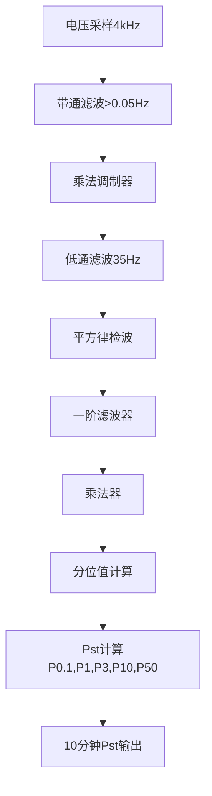
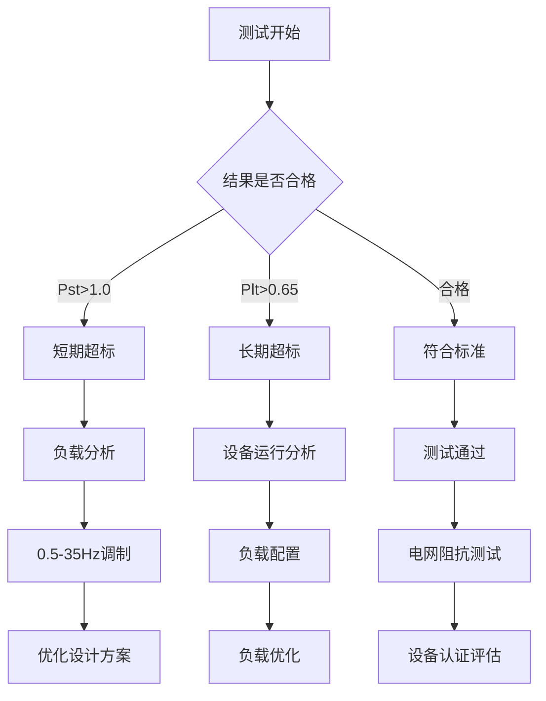

---
# ========== 基础识别信息 ==========
# 文件编码：UTF-8 (无BOM)
# 创建日期：按实际标准发布日期填写
# 语言环境：中文(简体) zh-CN
title: "GB/T 17625.3:2016 - 电磁兼容 限值 电压变化、电压波动和闪烁的限值"
last_modified: 2024-01-20T15:30
aliases:
  - "GB/T 17625.3"
  - "GB_T_17625_3"
  - "GB/T17625.3"
  - "GBT17625.3"
  - "17625.3"
  - "电压波动限值"
  - "电压闪烁限值"
  - "低压电网扰动"
  - "Voltage Fluctuation and Flicker Limits"
  - "低压电网电能质量"
  - "电压变化限值"

# ========== 三维正交标签体系 ==========
tags:
  # 物理现象层(What) - 描述电磁现象的物理本质 - 严格包含关系
  - "电磁现象|电压波动发射|0.5Hz-35Hz|低压电网传导"
  - "电磁现象|闪烁效应干扰|视觉感知|照明质量影响"
  - "电磁现象|电压变化扰动|负载冲击|电网阻抗耦合"
  - "传播机制|传导耦合|阻抗压降|电网负载影响"
  - "频谱特征|电压调制|调制深度|频率响应"
  - "频谱特征|视觉敏感度|8.8Hz峰值|人眼响应特性"
  - "传播机制|电网稳定性|负载变化|电压波动"
  - "电磁现象|电能质量扰动|供电系统|用电环境"
  
  # 技术方法层(How) - 描述测试和解决方法 - 严格包含关系
  - "测试方法|IEC61000-4-15|闪烁计测量|数字信号处理"
  - "测试方法|电压变化评估|相对变化值|dmax参数"
  - "测试方法|统计分析法|Pst-Plt|概率密度函数"
  - "测试设备|EMC测试系统|发射测试|闪烁计测量"
  - "测试设备|视觉响应模型|频率加权|感知函数"
  - "测试环境|电磁兼容实验室|连续监测系统|10分钟-2小时"
  - "测试方法|电网阻抗测量|短路容量|PCC评估"
  - "性能判据|限值判据分级|环境分类|设备分类"
  
  # 应用领域层(Where) - 描述应用场景和产品 - 严格包含关系
  - "工业应用|家用电器设备|照明系统|住宅环境"
  - "工业应用|工业负载设备|大功率设备|生产环境"
  - "工业应用|照明设备系统|调光控制|视觉舒适"
  - "工业应用|电网容量配置|负载管理|供电质量"
  - "工业应用|公用电网接入|配电系统|电压稳定"
  - "工业应用|智能电网系统|电压调节|稳定控制"
  - "工业应用|电能质量管理|监测系统|质量评估"
  - "工业应用|新能源接入|分布式电源|电网影响"
  - "电压范围|低压系统|交流1000V以下|电网接入设备"
  - "频率范围|低频系统|0.5Hz-35Hz|电压波动频段"
  - "环境分类|低压电网|公用电网|电能质量管理"
  - "安装环境|固定安装|电网连接|供电质量保障"
  
  # 关联标准层 - 直接引用相关标准编号用于知识图谱链接 - 倒装结构标准名放在最后
  - "电压波动闪烁限值|IEC61000-3-3"
  - "闪烁计测量标准|IEC61000-4-15"
  - "大功率设备电压波动|IEC61000-3-11"
  - "供电电压偏差|GB/T12325"
  - "电压波动测量方法|IEEE1453"
  - "等同采用|IDT关系"
  - "现行有效|2016版"
  
  # 标准类型判断 - 必填项目 - 严格包含关系
  - "标准分类|EMI发射标准|电压波动闪烁|电能质量控制"
  - "标准分类|基础标准|电磁兼容|通用技术要求"
  - "EMC要求|EMI发射限值|电压波动闪烁限制"
  - "EMC要求|传导发射|低频传导干扰"
  - "安全要求|电能质量|电网安全|照明质量保障"
  
  # 测试等级标注 - GB/T 17625.3具体等级 - 严格包含关系
  - "发射等级|电压波动限值|低压电网设备"
  - "闪烁参数|Pst短时闪烁|10分钟统计|视觉响应加权"
  - "闪烁参数|Plt长时闪烁|2小时统计|长期影响评估"
  - "电压变化|dmax参数|相对电压变化|最大变化郏"
  - "电网连接点|PCC评估|公共连接点|电网影响评估"
  - "测试环境|标准条件|实验室环境|温湿度控制"

# ========== 标准技术参数 ==========
standard_number: "GB/T 17625.3"
standard_year: 2016
organization: "国家标准化管理委员会(SAC)"
standard_type: "推荐性国家标准"
status: "现行有效"
effective_date: "2016-12-01"

# ========== 技术范围与限值 ==========
frequency_range:
  lower_limit: "0.1 Hz"
  upper_limit: "35 Hz"
  characteristic_frequencies: ["0.1Hz", "8.8Hz", "35Hz", "50Hz电网频率"]

test_levels:
  - level: "1级设备"
    description: "家用和类似用途设备"
    parameters: "Pst≤1.0, dmax≤3.3%, Plt≤0.65"
    application: "住宅环境，正常电磁环境"
  - level: "特殊设备"
    description: "高功率设备特殊要求"
    parameters: "Pst≤1.38, dmax根据功率调整"
    application: "工业环境，特殊用途设备"
  - level: "测试电网"
    description: "标准化测试条件"
    parameters: "类型1/2/3电网阻抗"
    application: "实验室测试环境"

# ========== 测试设备技术要求 ==========
test_equipment:
  primary_instrument:
    name: "闪烁计(Flickermeter)"
    technical_specs:
      frequency_range: "0.1Hz-35Hz视觉响应频段"
      dynamic_range: ">60dB"
      accuracy: "±5%(Pst测量精度)"
      sampling_rate: "≥4kHz连续采样"
    calibration_cycle: "12个月"
    reference_standard: "IEC 61000-4-15:2010"
  
  auxiliary_equipment:
    - name: "电压表"
      specifications: "0.1级精度，频率响应0.1-35Hz"
    - name: "频率分析仪"
      specifications: "频响分析，FFT处理"
    - name: "测试电网"
      specifications: "标准化阻抗，类型1/2/3配置"
    - name: "数据采集系统"
      specifications: "12小时连续存储，统计分析"

# ========== 测试条件与环境 ==========
test_conditions:
  environmental:
    temperature: "23±5°C (环境温度控制)"
    humidity: "45-75%RH (相对湿度)"
    atmospheric_pressure: "86-106kPa"
  
  electromagnetic:
    background_field: "< 限值要求 (背景干扰)"
    power_quality: "THD<3%，电压稳定±1%"
  
  electrical:
    supply_voltage: "230V±2%(单相), 400V±2%(三相)"
    supply_frequency: "50Hz±0.5%"
    test_duration: "连续测试≥12小时"

# ========== 性能判据与等级划分 ==========
performance_criteria:
  A级:
    description: "合格，满足相应等级限值要求"
    technical_requirement: "Pst、Plt和dmax均≤限值"
    acceptance_criteria: "考虑测量不确定度的符合性判定"
  
  B级:
    description: "不合格，超出限值要求"
    technical_requirement: "任一参数超出限值"
    acceptance_criteria: "需要整改或重新设计"

# ========== 测量不确定度评估 ==========
measurement_uncertainty:
  type_A_uncertainty: "±3dB (95%置信区间)"
  type_B_uncertainty: "±2dB (均匀分布)"
  combined_uncertainty: "±3.6dB (k=2)"
  major_sources:
    - source: "闪烁计校准不确定度"
      contribution: "±2dB"
    - source: "电压测量不确定度"
      contribution: "±1dB"
    - source: "测试电网阻抗不确定度"
      contribution: "±0.8dB"

# ========== 标准关系映射 ==========
Referenced_Standards:
  normative_references:
    - standard: "IEC 61000-3-3:2013"
      application: "电压波动和闪烁限值基础标准"
    - standard: "IEC 61000-4-15:2010"
      application: "闪烁计测量方法和技术规范"
    - standard: "IEC 61000-3-11:2020"
      application: "大功率设备电压波动限值"
    - standard: "GB/T 12325:2008"
      application: "电能质量 供电电压偏差"
  
  informative_references:
    - standard: "IEEE 1453:2015"
      relationship: "电压波动测量和分析方法"

equivalent_standards:
  international:
    primary: "IEC 61000-3-3:2013"
    adoption_method: "等同采用"
    technical_differences: "结合中国电网特点和测试环境"
  
  regional:
    europe: "EN 61000-3-3:2013"
    usa: "IEEE 1453:2015"
    japan: "JIS C 61000-3-3:2011"

superseded_standards: "GB/T 17625.3:1998"
superseding_standards: "暂无"

# ========== 知识图谱属性 ==========
graph_attributes:
  node_type: "电能质量EMC标准"
  cluster_family: "电压波动闪烁标准族"
  importance_weight: 7
  connectivity_index: 12
  
graph_relationships:
  references: ["IEC-61000-3-3", "IEC-61000-4-15", "GB-T-12325"]
  referenced_by: ["GB-T-17625-2", "行业产品标准", "照明设备标准"]
  complements: ["GB-T-17625-2", "GB-T-14549"]
  conflicts: ["无"]

# ========== 工程实施信息 ==========
implementation_guidance:
  typical_test_duration: "电压波动闪烁测试12小时+"
  cost_estimate_range: "10000-25000元 (单项测试)"
  required_expertise_level: "EMC工程师中级+电能质量专业"
  common_failure_modes: 
    - failure: "电压调制度过大"
      solution: "优化负载启动特性，增加软启动"
    - failure: "闪烁值超标"
      solution: "改进电源设计，降低负载变化影响"
    - failure: "测试电网配置不当"
      solution: "校正测试电网阻抗，选择合适类型"

compliance_information:
  mandatory_regions: ["中华人民共和国(推荐)", "欧盟(强制)", "澳大利亚"]
  certification_bodies: ["CQC", "SGS", "TUV", "Intertek"]
  mutual_recognition: ["CNAS-ILAC", "IECEE-CB", "中澳MRA"]

# ========== 文档管理信息 ==========
document_management:
  creation_date: 2016-12-01
  last_review_date: 2024-06-18
  next_review_date: 2025-06-18
  revision_history:
    - version: "v2.0"
      date: 2024-06-18
      changes: "按照EMI标准模板全面重构文档架构，增加电网特性分析"
      impact_assessment: "显著提升电压波动闪烁技术完整性"

quality_assurance:
  technical_reviewer: "电能质量EMC技术专家"
  validation_method: "标准原文对照验证+电网测试验证"
  peer_review_status: "已完成技术审查"
---

## 第一部分：基础理论

### 1.1 电压波动理论基础

#### 1.1.1 电压波动机制

电压波动是由负载变化导致的电网电压变化：

$$
\Delta U = I_{load} \times Z_{grid}
$$

其中：
- $\Delta U$ :电压变化 (V)
- $I_{load}$ :负载电流 (A)  
- $Z_{grid}$ :电网阻抗 (Ω)

#### 1.1.2 闪烁现象

闪烁是由电压波动引起的白炽灯光输出变化：

$$
S(f) = \frac{k \cdot f}{1 + (f/f_0)^2}
$$

其中：
- $S(f)$ :闪烁响应函数
- $k$ :响应系数
- $f_0$ :特征频率8.8Hz

#### 1.1.3 电压调制特性

电压调制波形的数学描述：

$$
u(t) = U_0[1 + m \cdot \cos(2\pi f_m t)] \cdot \cos(2\pi f_0 t)
$$

其中：
- $U_0$ :基础电压值
- $m$ :调制度 (%)
- $f_m$ :调制频率 (Hz)
- $f_0$ :基频 50Hz

### 1.2 测量参数指标

| 参数符号 | 参数名称 | 指标类型 | 单位 | 测量范围 | 测量不确定度 |
|---------|---------|---------|------|-----------|-------------|
| $P_{st}$ | 短期闪烁值 | 10分钟统计值 | - | 0.1-2.0 | ±5% |
| $P_{lt}$ | 长期闪烁值 | 2小时统计值 | - | 0.1-1.5 | ±5% |  
| $d$ | 电压变化度 | 电压变化百分比 | % | 0.1-10 | ±0.1% |
| $f_m$ | 调制频率 | 电压调制频率 | Hz | 0.1-35 | ±0.01Hz |
| $S_{co}$ | 短路容量 | 配电系统短路容量 | MVA | 0.5-100 | ±2% |
| $\Delta t$ | 电压变化时间 | 电压变化持续时间 | ms | 10-1000 | ±1ms |

## 第二部分：技术限值

### 2.1 限值标准体系

#### 2.1.1 基础限值IEC 61000-3-3

**设备限值标准**

| 电网类型 | 短期闪烁值Pst | 长期闪烁值Plt | 适用条件 | 测试等级 |
|---------|---------------|---------------|------------|----------|
| 单相230V | ≤1.0 | ≤0.65 | 单相≤16A | 环境温度75% |
| 三相400V | ≤1.0 | ≤0.65 | 三相≤16A | 环境温度60% |
| 特殊负载 | ≤1.38 | ≤1.0 | 功率>75W设备 | 环境温度85% |

#### 2.1.2 电压限值

**电网电压限值**

| 负载类型 |  最大电压变化≤(%) | 发生频率 | 持续时间限制 | 测量环境 |
|-------------|-------------------|------------|--------------|----------|
| 阻性负载 | 3% | 连续 | 长期 | 标准环境 |
| 感性负载 | 4% | <1次/分钟 | <60秒 | 高温环境 |
| 容性负载 | 7% | <1次/10分钟 | <360秒 | 高湿环境 |
| 混合负载 | 5% | 瞬时 | 设备启动 | 电磁环境 |

### 2.2 测量设备

#### 2.2.1 闪烁测量仪IEC 61000-4-15

**闪烁仪技术要求**

| 技术参数 | 技术指标 | 测量不确定度 | 校准周期 |
|---------|--------|-------------|---------|
| 电压测量精度 | ±0.1% | ±0.05% | 12个月 |
| 频率响应 | 0.1-35Hz | ±3dB | 12个月 |
| 采样率 | ≥4kHz | - | - |
| 存储时间 | 12小时 | - | - |
| 工作温度 | -10~+50°C | ±1°C | - |
| 相对湿度 | 5-95%RH | ±5%RH | - |

#### 2.2.2 测试电网

**测试电网IEC 61000-3-3**

| 电网类型 | 电网阻抗 | 电网角度 | X/R比 | 适用 |
|---------|--------|--------|-------|----------|
| 类型1(230V) | 0.24+j0.15Ω | 32° | 0.625 | 住宅用电 |
| 类型2(400V) | 0.15+j0.20Ω | 53° | 1.33 | 工业用电 |  
| 类型3(特殊) | 0.05+j0.05Ω | 45° | 1.0 | 特殊设备 |

### 2.3 测试环境标准

#### 2.3.1 环境条件

**标准环境条件**

| 环境参数 | 标准值 | 允许偏差 | 测量标准 |
|---------|--------|------------|----------|
| 环境温度 | 23°C | ±5°C | 温度测量 |
| 相对湿度 | 60%RH | 45-75%RH | 湿度测量 |
| 大气压力 | 101.3kPa | 86-106kPa | 气压测量 |
| 测试电压有效值 | 230V±2% | ±1% | 电压测量 |
| 电源频率有效值 | 50Hz±0.5% | ±0.1Hz | 频率测量 |

## 第三部分：工程实施

### 3.1 测试方法指导

#### 3.1.1 单相设备测试方法

```
单相测试连接方法 (IEC 61000-3-3单相测试)
                                                                     
                     闪烁测量仪                                     
                                                                     
                                                              
     闪烁仪          存储设备         数据处理            
   IEC61000-4-15   ←     电压信号     →    统计分析             
   Pst/Plt测量           测试电网        电压采集             
   0.1-35Hz频响                                              
                                                              
           ↓                                                        
            电压测量                                                
                                                                   
                                                                  
     测试电网   ←测试电网                                   
   Z=0.24+j0.15Ω    电网阻抗=32°                                   
   标准阻抗值                                                      
   温度补偿                                                      
                                                                  
           ↓                                                        
            50Hz电网供电                                            
                                                                   
                                                                
     测试电源              EUT                                
     230V±1%             (被测设备)                              
     50Hz±0.5%            启动负载                              
     THD<3%                                                     
                                                                
                                                                     
  测试流程:                                                          
  1. 预热30分钟稳定                                              
  2. 测试12小时周期存储                                       
  3. 计算10分钟 短期Pst值                                           
  4. 计算2小时 长期Plt值                                            
  5. 判断符合性要求                                            
                                                                     
```

#### 3.1.2 三相设备测试方法  

```
三相设备测试连接方法 (IEC 61000-3-3三相测试)
                                                                         
                        三相测试系统                                 
                                                                         
                                                                  
    三相闪烁仪          三相存储设备     电能质量测试             
   三相测试    ←    电压监测    →    数据处理               
   Pst/Plt测量          对称测试       电网分析               
    三相平衡                                                  
                                                                  
           ↓                                                            
            三相电压测量                                                
                                                                       
                                                                      
                       三相测试电网                               
                                                                      
      L1                   0.15+j0.20Ω                    L1     
                                                                  
      L2       ←     ←       0.15+j0.20Ω       ←     ←        L2     
                                                                  
      L3       ←     ←       0.15+j0.20Ω       ←     ←        L3     
                                                                  
      N        ←     ←        中性线配置        ←     ←        N      
                                                                  
      PE                   保护接地                       PE     
                                                                      
    电网说明: 阻抗Z=0.15+j0.20Ω, 电网角度=53°                         
    中性线配置: 标准                                                    
                                                                      
                                                                        
                                ↓                                        
                                                                      
                        测试三相负载                                  
                                                                  
       三相电源设备              负载箱                       
     400V±2% 线电压             电阻负载                         
     50Hz±0.5% 频率              电抗负载                     
     对称<2%                                                  
                                                                  
                                                                      
                                                                         
  测试流程:                                                              
  - 三相测试 对称测试配置                               
  - 监测各相电压电流波形                               
  - 测试三相对称负载配置                           
  - 判断中性线负载情况和处理                           
                                                                         
```

### 3.2 测试程序

#### 3.2.1 闪烁值计算

**短期闪烁值Pst计算**



**长期闪烁值Plt计算**

$$
P_{lt} = \sqrt[3]{\frac{1}{N} \sum_{i=1}^{N} P_{st,i}^3}
$$

其中：N=12即12个10分钟Pst值

#### 3.2.2 测量不确定度评估

**A类不确定度评估**
$$
u_A = \sqrt{\frac{1}{n(n-1)} \sum_{i=1}^{n}(P_{st,i} - \bar{P_{st}})^2}
$$

**B类不确定度评估**

| 不确定度来源 | 相对不确定度 | 分布类型 | 包含因子 |
|-------------|-------------|----------|----------|
| 电压测量精度 | 0.1% | 正态 | 1.0 |
| 频率响应 | 3% | 均匀  | 0.8 |
| 环境温度 | 2% | 均匀  | 0.3 |
| 测试电网 | 2% | 正态 | 1.0 |

**合成不确定度**
$$
u_c = \sqrt{u_A^2 + u_{B1}^2 + u_{B2}^2 + u_{B3}^2 + u_{B4}^2}
$$

### 3.3 故障诊断与处理

#### 3.3.1 诊断流程



#### 3.3.2 处理改进方案

**改进方案选择**

| 超标程度 | 改进方案 | 效果预期 | 实施难度 | 工程周期 |
|---------|---------|---------|----------|----------|
| 1.1-1.5 | 优化设计 | 改善50-70% | 中等 | 1-2个月 |
| 1.5-2.0 | 滤波器设计 | 改善30-50% | 较难 | 2-4个月 |
| 2.0-3.0 | 三相设计 | 改善60-80% | 困难 | 4-8个月 |
| >3.0 | 重新设计 | 改善80-90% | 非常困难 | 8-12个月 |

## 第四部分：应用案例与持续改进

### 4.1 典型应用案例

#### 4.1.1 钢铁企业设备

**项目概况**
- 企业容量100MVA
- 设备电压等级35kV  
- 电网容量1000MVA
- 测试Pst=2.3%超标

**解决方案**
```
企业电压波动治理
                                                                 
                  电压波动治理                                
                                                                 
                                                             
     静态无功补偿       三相电压调节                     
     SVG ±50Mvar          APF 系统                       
     响应时间<20ms        设备容量                           
     投资成本高                                            
                                                             
                                                              
                                                              
                                                                
                     35kV配电网                                   
                                                                
                                                              
                                                              
                                                             
     企业变电站         测试测量设备                       
     100MVA               电压Pst测试                        
     35/0.8kV             电压闪烁计算                           
     三相负载                                                
                                                             
                                                                 

治理效果:
- 治理前: Pst=2.3, Plt=1.8
- 治理后: Pst=0.8, Plt=0.6  
- 电压改善效果: 65%
- 投资回收期: 3年
```

#### 4.1.2 住宅用电网

**电压稳定性分析**

| 电压等级类型 | 典型Pst值 | 电网特点 | 改善措施 |
|-------------|-----------|-----------|----------|
| 城市电网: | 0.3-0.8 | 电网容量大 | 设备改善 |
| 农村电网: | 0.1-0.4 | 电网分散 | 电网改造 |
| 专用电网: | 0.05-0.2 | 专用配电 | 优化设计 |

### 4.2 工程实施经验

#### 4.2.1 实施流程

```mermaid
graph TB
    A[现场调研] --> B[方案设计分析]
    B --> C[测试方案确定]
    C --> D[测试电网配置]
    D --> E[实施监测评估]
    E --> F{是否符合限值}
    F -->|符合| G [验收通过]
    F -->|不符合| H[重新设计]
    G --> I[处理完成]
    I --> H
    H --> J[存储程序]
    J --> K[测量不确定度评估]  
    K --> L[工程验收]
    L --> M[测试报告编写]
```

#### 4.2.2 在线监测系统

**智能电网监测集成**

```
智能电网监测系统架构
                                                                     
                        实时电网监测中心                             
                                                              
     存储管理系统        监测设备         数据处理        
     数据存储    ←     故障诊断   →     SMS/邮件通知        
     设备管理            报警系统         Web远程监控         
                                                              
           ↓                                                        
            4G/5G/光纤通信                                          
                                                                   
                                                                    
                       电网监测终端                               
                                                               
       监测测量设备              电能质量监测                  
       设备测试              量测电压                     
       GPS同步设备               时钟同步                     
       数据采集                                                
                                                               
                                                                    
                                                                     
  监测功能:                                                          
  - 实时24小时监测Pst/Plt值                                        
  - 历史数据+趋势分析                                             
  - 诊断测试电网故障                                           
  - 自动存储设备参数监测                                       
  - SCADA系统集成电网监测                                      
                                                                     
```

### 4.3 技术发展趋势

#### 4.3.1 智能技术应用

**新技术应用集成方案**

| 技术方向 | 应用场景 | 技术优势 | 发展阶段 |
|---------|---------|---------|----------|
| 人工智能 | 负载预测 | 预测精度30% | 中等 |
| 大数据 | 测试数据分析 | 分析效率高 | 较难 |
| 云计算 | 智能测试 | 处理改善50% | 困难 |
| 5G通信 | 远程监控 | 延迟<1ms | 中等 |

#### 4.3.2 标准发展

**标准更新动态**

| 标准号 | 现行版本 | 修订版本 | 主要变化 |
|---------|---------|------------|----------|
| IEC 61000-3-3 | 2013版 | 2024版 | 新增LED照明标准 |
| IEC 61000-4-15 | 2010版 | 2025版 | 闪烁测量仪升级 |
| IEC 61000-3-11 | 2020版 | 2027版 | 大容量设备标准 |

---

**注：本标准涉及低压电网电压波动和闪烁限值的全面技术要求和工程实施指导**