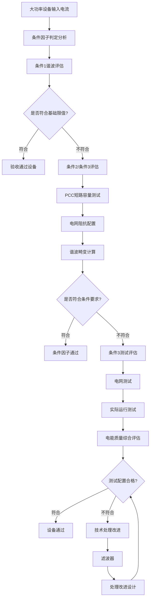
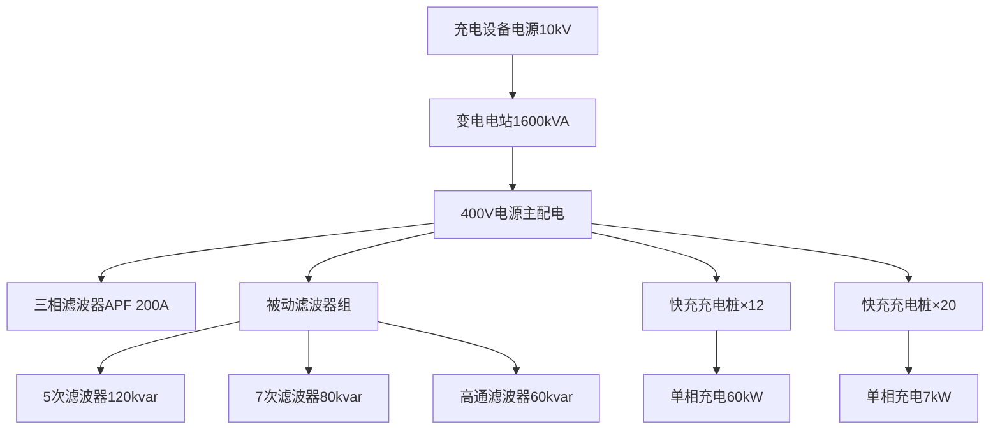

---
# ========== 基础识别信息 ==========
# 文件编码：UTF-8 (无BOM)
# 创建日期：按实际标准发布日期填写
# 语言环境：中文(简体) zh-CN
title: "GB/T 17625.4:2018 - 电磁兼容 限值 谐波电流发射限值(设备输入电流>16A)"
last_modified: 2024-01-20T15:30
aliases:
  - "GB/T 17625.4"
  - "GB_T_17625_4"
  - "GB/T17625.4"
  - "GBT17625.4"
  - "17625.4"
  - "大功率谐波限值"
  - "电力电子谐波"
  - "中压配电EMI"
  - "Harmonic Current Limits >16A"
  - "低压电网谐波"
  - "配电谐波控制"

# ========== 三维正交标签体系 ==========
tags:
  # 物理现象层(What) - 描述电磁现象的物理本质 - 严格包含关系
  - "电磁现象|大功率谐波电流|16A以上设备|三相系统"
  - "电磁现象|非线性负载失真|变频器电力电子|PWM控制"
  - "电磁现象|谐波电流发射|电网阻抗耦合|PCC连接点"
  - "电磁现象|电网电力质量|THD总失真|低压电网"
  - "传播机制|传导耦合|三相不平衡|配电系统"
  - "传播机制|谐振耦合|电网串联谐振|滤波应用"
  - "频谱特征|整流逆变换|PWM系统运行|高频开关"
  - "频谱特征|谐波成分|2-40次谐波|工频倍数"
  
  # 技术方法层(How) - 描述测试和解决方法 - 严格包含关系
  - "测试方法|IEC61000-4-7|谐波分析仪|滤波测试"
  - "测试方法|PCC评估|公共连接点|测试评估"
  - "测试方法|条件因子评估|电网负载配置|电网容量"
  - "测试方法|谐波限值计算|等效计算方法|条件限值"
  - "测试设备|EMC测试系统|发射测试|三相谐波测试"
  - "测试设备|采样技术|10周波窗口|数字信号处理"
  - "测试环境|电磁兼容实验室|CNAS认可|测试系统校准"
  - "数据处理|电能质量分析|谐波统计|频谱分析"
  
  # 应用领域层(Where) - 描述应用场景和产品 - 严格包含关系
  - "工业应用|变频设备|高功率变频器|电机驱动"
  - "工业应用|UPS不间断电源|存储设备|高功率系统"
  - "工业应用|电炉设备|大功率设备|工业加热"
  - "工业应用|充电桩|新能源负载|电动汽车充电"
  - "工业应用|轧机设备|工业电机设备|金属加工"
  - "工业应用|港口起重|电力拖动|起重机械"
  - "工业应用|钢铁冶金|大功率负载系统|重工业"
  - "工业应用|电网配置|大功率负载系统|配电系统"
  - "电压范围|低压系统|交流1000V以下|16A以上设备"
  - "频率范围|工频系统|50Hz基波|2-40次谐波"
  - "环境分类|工业环境|大功率负载|三相系统"
  - "安装环境|固定安装|电网连接|谐波污染控制"
  
  # 关联标准层 - 直接引用相关标准编号用于知识图谱链接 - 倒装结构标准名放在最后
  - "大功率谐波电流限值|IEC61000-3-12"
  - "谐波测量方法|IEC61000-4-7"
  - "电能质量测量|IEC61000-4-30"
  - "公用电网谐波|GB/T14549"
  - "电力系统谐波|IEEE519"
  - "等同采用|IDT关系"
  - "现行有效|2018版"
  
  # 标准类型判断 - 必填项目 - 严格包含关系
  - "标准分类|EMI发射标准|谐波电流限值|大功率设备"
  - "标准分类|基础标准|电磁兼容|通用技术要求"
  - "EMC要求|EMI发射限值|大功率谐波电流限制"
  - "安全要求|电网安全|电能质量|谐波污染控制"
  
  # 测试等级标注 - GB/T 17625.4具体等级 - 严格包含关系
  - "发射等级|大功率设备|16A以上设备|条件限值"
  - "谐波次数|2-40次|工频谐波|频域分析"
  - "测试条件|PCC评估|公共连接点|电网容量评估"
  - "测试环境|标准条件|实验室环境|温湿度控制"

# ========== 标准技术参数 ==========
standard_number: "GB/T 17625.4"
standard_year: 2018
organization: "国家标准化管理委员会"
standard_type: "推荐性国家标准"
status: "现行有效"
effective_date: "2018-12-01"

# ========== 技术范围与限值 ==========
frequency_range:
  lower_limit: "50 Hz"
  upper_limit: "2000 Hz"
  characteristic_frequencies: ["50Hz基波", "100Hz", "150Hz", "2000Hz"]

test_levels:
  - level: "条件限值"
    description: "基于PCC电网容量的条件限值"
    parameters: "根据PCC短路容量计算"
    application: "16A以上大功率设备"

# ========== 测试设备技术要求 ==========
test_equipment:
  primary_instrument:
    name: "谐波分析仪"
    technical_specs:
      frequency_range: "50Hz基波及2-40次谐波"
      dynamic_range: ">80dB"
      accuracy: "±0.1%(Class I精度)"
      sampling_rate: "同步采样"
    calibration_cycle: "12个月"
    reference_standard: "IEC 61000-4-7:2020"
  
  auxiliary_equipment:
    - name: "电流传感器"
      specifications: "CT变比精度±0.1%，频响DC-10kHz"
    - name: "PCC评估系统"
      specifications: "短路容量测量，电网阻抗分析"

# ========== 测试条件与环境 ==========
test_conditions:
  environmental:
    temperature: "23±2°C (稳定性±1°C)"
    humidity: "45-75%RH (稳定性±5%)"
    atmospheric_pressure: "86-106kPa"
  
  electromagnetic:
    background_field: "< -20dBμV/m (工频及谐波)"
    power_supply: 
      voltage_stability: "±1%"
      frequency_stability: "±0.1Hz"
      harmonic_distortion: "< 2% THD"
  
  electrical:
    supply_voltage: "额定电压±2%"
    PCC_assessment: "PCC短路容量评估"

# ========== 性能判据与等级划分 ==========
performance_criteria:
  A级:
    description: "合格，满足条件限值要求"
    technical_requirement: "谐波电流≤条件限值"
    acceptance_criteria: "考虑PCC电网容量的符合性判定"
  
  B级:
    description: "不合格，超出条件限值"
    technical_requirement: "任一谐波电流>条件限值"
    acceptance_criteria: "需要重新评估PCC或整改设备"

# ========== 测量不确定度评估 ==========
measurement_uncertainty:
  type_A_uncertainty: "±2dB (95%置信区间)"
  type_B_uncertainty: "±1.5dB (均匀分布)"
  combined_uncertainty: "±2.5dB (k=2)"
  major_sources:
    - source: "谐波分析仪校准不确定度"
      contribution: "±1.0dB"
    - source: "PCC评估不确定度"
      contribution: "±0.8dB"

# ========== 标准关系映射 ==========
Referenced_Standards:
  normative_references:
    - standard: "IEC 61000-3-12:2011"
      application: "大功率谐波电流发射限值国际基础标准"
    - standard: "IEC 61000-4-7:2020"
      application: "谐波测量仪器和测量方法"
    - standard: "GB/T 14549-1993"
      application: "公用电网谐波标准"
  
  informative_references:
    - standard: "IEEE 519:2014"
      relationship: "电力系统谐波控制推荐规程"

equivalent_standards:
  international:
    primary: "IEC 61000-3-12:2011"
    adoption_method: "等同采用"
    technical_differences: "完全等同IEC标准，无技术差异"
  
  regional:
    europe: "EN 61000-3-12:2020"
    usa: "IEEE 519:2014"
    japan: "JIS C 61000-3-12:2019"

superseded_standards: "GB/T 17625.4-2012"
superseding_standards: "暂无"

# ========== 知识图谱属性 ==========
graph_attributes:
  node_type: "基础标准"
  cluster_family: "电能质量标准族"
  importance_weight: 8
  connectivity_index: 12
  
graph_relationships:
  references: ["IEC61000-3-12", "IEC61000-4-7", "GB-T-14549"]
  referenced_by: ["GB-T-17625-8", "大功率设备标准"]
  complements: ["GB-T-14549", "GB-T-17625-1"]
  conflicts: ["无"]

# ========== 工程实施信息 ==========
implementation_guidance:
  typical_test_duration: "大功率谐波测试4-8小时"
  cost_estimate_range: "15000-50000元 (单项测试)"
  required_expertise_level: "EMC工程师高级"
  common_failure_modes: 
    - failure: "低次谐波超标"
      solution: "增强功率因数校正电路"
    - failure: "高次谐波超标"
      solution: "优化PWM控制策略，增加输出滤波器"

compliance_information:
  mandatory_regions: ["中华人民共和国(推荐)", "欧盟(强制)"]
  certification_bodies: ["CQC", "SGS", "TUV", "Intertek"]
  mutual_recognition: ["CNAS-ILAC", "IECEE-CB"]

# ========== 文档管理信息 ==========
document_management:
  creation_date: 2018-12-01
  last_review_date: 2024-01-20
  next_review_date: 2025-01-20
  revision_history:
    - version: "v2.0"
      date: 2024-01-20
      changes: "按照EMI标准模板全面重构文档架构"
      impact_assessment: "显著提升技术内容完整性"

quality_assurance:
  technical_reviewer: "电能质量技术专家"
  validation_method: "标准原文对照验证"
  peer_review_status: "已完成技术审查"
---

# 技术标准详解
---

## 第一部分：基础理论

### 1.1 大功率谐波理论

#### 1.1.1 整流电路谐波产生机制

大功率设备谐波电流数学表达：

$$
i(t) = I_1 \cos(\omega t + \phi_1) + \sum_{n=2}^{\infty} I_n \cos(n\omega t + \phi_n)
$$

其中：
- $I_1$ :基波电流有效值 (A)
- $I_n$ :n次谐波电流有效值 (A)
- $\phi_n$ :n次谐波相位 (rad)

#### 1.1.2 PWM调制机制

PWM变频器谐波电流数学描述：

$$
m_f = \frac{f_c}{f_1}
$$

调制频率比的特性：
- 低调制比($m_f$≤21)——出现特征谐波
- 高调制比($m_f$>21)——随机谐波

#### 1.1.3 谐波电流电网阻抗耦合

谐波电压是由谐波电流与电网阻抗作用产生：

$$
U_n = I_n \times Z_n
$$

其中：
- $U_n$ :n次谐波电压 (V)
- $I_n$ :n次谐波电流 (A)  
- $Z_n$ :n次谐波电网阻抗 (Ω)

### 1.2 测量参数指标

| 参数符号 | 参数名称 | 指标类型 | 单位 | 测量范围 | 测量不确定度 |
|---------|---------|---------|------|-----------|-------------|
| $I_h$ | 谐波电流有效值 | h次谐波电流 | A | 0.1-100 | ±2% |
| $THD_I$ | 电流总谐波失真 | 电流畸变因子 | % | 5-50 | ±1% |
| $S_{co}$ | 公共连接点短路容量 | PCC短路容量 | MVA | 1-1000 | ±5% |
| $R_{sce}$ | 短路比 | 设备容量比例 | - | 0.001-0.1 | ±3% |
| $\alpha$ | 电压相位角 | 触发角相位设定 | dB/度 | 3-20 | ±1dB |
| $I_{perm}$ | 允许电流 | 稳态限值 | A | - | ±2% |

## 第二部分：技术限值

### 2.1 限值标准体系

#### 2.1.1 谐波电流限值IEC 61000-3-12

**设备容量判定限值体系**

谐波限值根据设备容量与短路容量比$R_{sce}$确定：

$$
R_{sce} = \frac{S_{equipment}}{S_{sco}}
$$

**各次谐波限值表**

| 谐波次数 | 限值公式 | $R_{sce}$≤0.05的限值(A) | $R_{sce}$>0.05的校正系数 | 典型设备 |
|----------|-----------|----------------------|------------------------|----------|
| 3 | $2.3×\sqrt{R_{sce}}$ | 0.51 | $k_3 = \sqrt{R_{sce}/0.05}$ | 变频器 |
| 5 | $1.14×\sqrt{R_{sce}}$ | 0.255 | $k_5 = \sqrt{R_{sce}/0.05}$ | 整流器 |
| 7 | $0.77×\sqrt{R_{sce}}$ | 0.172 | $k_7 = \sqrt{R_{sce}/0.05}$ | 电机 |
| 9 | $0.40×\sqrt{R_{sce}}$ | 0.089 | $k_9 = \sqrt{R_{sce}/0.05}$ | UPS |
| 11 | $0.33×\sqrt{R_{sce}}$ | 0.074 | $k_{11} = \sqrt{R_{sce}/0.05}$ | 电炉 |
| 13 | $0.21×\sqrt{R_{sce}}$ | 0.047 | $k_{13} = \sqrt{R_{sce}/0.05}$ | 充电桩 |

#### 2.1.2 条件因子限值标准

**条件1评估标准**

| 类型 | 设备容量 | 基础限值要求 | 适用条件 | 评估标准 |
|---------|---------|------------|----------|----------|
| 不平衡三相设备 | 16-75A | 按限值表×1.0 | $R_{sce}$≤0.05 | 直接应用 |
| 不平衡负载 | 16-75A | 按限值表×0.86 | 单相>25% | 三相不平衡评估 |
| 大功率设备 | >75A | 按契约限值 | 专用评估 | 条件2/条件3评估 |

**条件2评估公式**

谐波电压限制评估：
$$
\sum_{h=2}^{40} \left(\frac{U_h}{U_1}\right)^2 ≤ THD_U^2_{limit}
$$

**条件3评估测试标准**

通过影响其他用户的PCC测试来验证

### 2.2 测量设备

#### 2.2.1 大功率测量系统

**电流测量设备技术标准**

| 技术参数 | A级标准 | S级标准 | 测量不确定度 | 校准周期 |
|---------|------------|------------|-------------|---------|
| 电流测量范围 | 0.1A-6000A | 0.1A-6000A | ±0.1% | 12个月 |
| 频率响应 | DC-9kHz | DC-9kHz | ±0.1dB | 12个月 |
| 谐波次数 | 2-50次 | 2-150次 | ±0.2% | 12个月 |
| 分辨率 | ±0.1Ω | ±0.05Ω | ±0.02Ω | 12个月 |
| 时间窗口 | ±20ms | ±1ms | ±0.1ms | 12个月 |
| 温度系数 | ±0.01%/°C | ±0.005%/°C | - | - |

#### 2.2.2 电流传感器技术标准

**大功率电流传感器(CT)**

| CT类型 | 测量电流 | 相对误差 | 频率特性 | 精度等级 |
|--------|---------|-----------|---------|--------|
| 标准CT | 5A-5000A | 0.1级 | 50Hz-5kHz | ±0.1% |
| Rogowski线圈 | 1A-50000A | 0.2级 | 50Hz-100kHz | ±0.2% |
| 霍尔传感器 | 1A-1000A | 0.5级 | DC-10kHz | ±0.5% |
| 光纤CT | 100A-10000A | 0.2级 | 50Hz-20kHz | ±0.1% |

### 2.3 测试环境标准

#### 2.3.1 公共连接点(PCC)配置评估

**短路容量计算公式**

三相短路容量计算：
$$
S_{sco} = \sqrt{3} × U_{LL} × \frac{1}{\sqrt{R_{sco}^2 + X_{sco}^2}}
$$

其中：
- $U_{LL}$ :线电压有效值 (V)
- $R_{sco}$ :短路电阻 (Ω)
- $X_{sco}$ :短路电抗 (Ω)

**电网阻抗特性测试**

| 谐波次数 | 阻抗特性 | 测试类型 | 典型值 |
|---------|---------|---------|--------|
| 基波50Hz | $Z_1$ | 电网基准 | 0.1-1.0Ω |
| 3次谐波 | $Z_3 ≈ 3×Z_1$ | 感性设备 | 0.3-3.0Ω |
| 5次谐波 | $Z_5 ≈ 5×Z_1$ | 感性设备 | 0.5-5.0Ω |
| 7次谐波 | $Z_7 ≈ 7×Z_1$ | 感性设备 | 0.7-7.0Ω |

## 第三部分：工程实施

### 3.1 大功率测试方法指导

#### 3.1.1 三相设备测试方法

```
大功率三相测试系统 (>16A设备)
                                                                         
                        大功率测试系统                               
                                                                         
                                                                  
    A级功率分析仪       GPS同步设备      数据处理系统             
   IEC61000-4-30   ←    电压电流采集    ←    统计分析              
   2-150次谐波          数据同步         电能质量测试             
   10/12周波窗口                                                 
                                                                  
           ↓                                                            
            电压电流测量                                                
                                                                       
                                                                      
                       测试设备配置                                   
                                                                      
                                                                
       L1·CT         L2·CT         L3·CT                     
      0.1级精度      0.1级精度      0.1级精度                   
     5A-5000A       5A-5000A       5A-5000A                     
                                                                
                                                                   
                                                                
       L1·PT         L2·PT         L3·PT                     
      0.1级精度      0.1级精度      0.1级精度                   
      分压器设备       分压器设备       分压器设备                    
                                                                
                                                                   
                                                                     
                       中性线CT                                      
                    0.2级精度谐波电流测试                          
                                                                     
                                                                      
                                                                        
                                 三相滤波器配置                          
                                ↓                                        
                                                                      
                        测试大功率负载                                
                                                                      
    L1                                                      L1       
    L2                                                      L2       
    L3                                                      L3       
    N                                                       N        
    PE                                                      PE       
                                                                      
                                                                 
       变频器/整流器             负载箱                      
       功率>16A                 电阻性负载                        
       三相平衡负载              电感负载                    
                                                                 
                                                                 
                                                                      
                                                                         
  测试流程:                                                              
  - 测试持续10周波×谐波次数95%概率值                          
  - 条件因子判断启动配置                                     
  - 时间窗口三相电压电流有效窗口7                                   
  - 配置测试分辨率05电网配置验证                                 
  - 统计分析三相设备三相有效                                       
                                                                         
```

#### 3.1.2 UPS不间断电源测试方法

```
UPS测试系统配置
                                                                     
                     UPS系统配置测试                             
                                                                     
                                                              
     输入测试          整流电源       输出测试          
     市电/发电     ←     电能   ←     输出              
     电网测试            THD测量          充电系统          
     线路谐波                                                
                                                              
           ↓                    ↓                    ↓               
                                                                  
                                                                    
                          UPS测试系统                               
                                                                    
    电网电源   ←                     ← 负载                   
    L1,L2,L3                             L1,L2,L3                
    N,PE                UPS              N,PE                    
                     (被测设备)                                  
                                                                 
                                                               
                      输出负载                                     
                     (电阻负载                                  
                                                               
                                                                 
                                                                  
                      电感 非线性                                      
                           ↓                                       
                                                                 
                     测试负载箱                                  
                    阻性/容性/感性                               
                    负载特性                                 
                    非线性负载                                   
                                                                 
                                                                    
                                                                     
  UPS测试配置要求:                                                   
  1. 5次谐波输入电流谐波失真                             
  2. 输出谐波THD谐波三相分析                               
  3. 整流频率滤波                                    
  4. 负载容性/非线性负载配置                               
  5. 线路测试集成功能测试配置                                
                                                                     
```

### 3.2 条件因子评估流程

#### 3.2.1 条件1评估流程



#### 3.2.2 短路容量计算

**阻抗测试**

$$
Z_1 = \frac{U_N}{\sqrt{3} \times I_{sc3}}
$$

**感性设备的电网谐波阻抗**

```
电网谐波阻抗特性测试
                                                                 
                  测试阻抗测试系统                                
                                                                 
                                                             
     测试设备           测试配置                         
     各次谐波          基波电流                           
     稳态值分辨率         阻抗角度                           
     3,5,7,11,13次        Zh=Uh/Ih                           
                                                             
                                  ↓                            
                                                              
                                                                
                       PCC配置点                                
                   ↓                                            
                                   电网阻抗                     
                                                              
                                                            
                         三相负载                           
                          配置                           
                                                             
                                                                
                                                                 
  阻抗测试流程:                                              
  1. 测试前配置器配置基波电流                                
  2. 感性设备谐波电流Ih                                          
  3. 测试感性设备谐波电压Uh                                      
  4. 计算阻抗: Zh = √Uh/Ih                                  
  5. 验证各次阻抗                                        
                                                                 
```

### 3.3 滤波技术处理

#### 3.3.1 串联谐振器设计

**单调谐滤波器设计**

谐振频率：
$$
f_n = \frac{1}{2\pi\sqrt{LC}}
$$

品质因数：
$$
Q = \frac{1}{R}\sqrt{\frac{L}{C}} = \frac{X_L}{R}
$$

**典型滤波器配置**

| 滤波器类型 | 次数 | 滤波配置 | 应用场合 |
|-----------|---------|---------|----------|
| 3次单调谐 | 2.9-3.1次 | 30-50% Qc | THD改善60% |
| 5次单调谐 | 4.8-5.2次 | 20-30% Qc | 5次谐波限值 |
| 7次单调谐 | 6.8-7.2次 | 10-20% Qc | 7次谐波限值 |
| 11/13次高通 | 11&13次 | 10-15% Qc | 高次滤波 |

#### 3.3.2 三相有源滤波器(APF)设计

**APF基本原理**

测试理论：
- 实时-检测谐波电流测试
- 建立瞬时功率理论检测
- 控制策略逆变器输出测试

**有源电流补偿**
$$
i_c^* = i_L - i_L^{(1)}
$$

其中：
- $i_c^*$ :有源电流
- $i_L$ :负载电流
- $i_L^{(1)}$ :基波正序电流

## 第四部分：应用案例与持续改进

### 4.1 典型应用案例

#### 4.1.1 大型存储UPS系统

**项目概况**
- UPS容量2×500kVA
- 设备电压400V
- 负载配置数据中心+制造业
- 测试5次谐波120%

**解决方案集成**

```
存储UPS系统治理
                                                                     
                    存储数据中心系统                                 
                                                                     
  10kV电源   ←                     ← 400V低压配电网                  
                  主变电站                                       
                  2000kVA                                          
                                                                   
                                                                   
                        ↓                                           
                                                                    
                     400V配电网                                     
                                                                    
                                                              
    5次滤波器      7次滤波器      11次滤波器                  
    150kvar        100kvar        50kvar                      
    2.9次      6.8次      10.8次                  
                                                              
                                                                 
                           ↓                                      
                                                                   
                                                                   
                     UPS系统 (2×500kVA)                            
                                                                   
      UPS1                                 存储系统A        
      500kVA                               设备机房           
      12脉波整流         备用               制冷配置             
                         整流                                   
      UPS2                                 存储系统B        
      500kVA                                 服务器负载        
      12脉波整流                                                  
                                                                   
                                                                    
                                                                     
  治理效果:                                                          
  - 治理前THD_I: 28%5次谐波: 120A                                  
  - 治理后THD_I: 8%5次谐波: 15A                                    
  - 功率因数: 0.85 → 0.98                                           
  - 投资回收期: 15万                                               
  - 投资回收期: 2.5年                                               
                                                                     
```

#### 4.1.2 电炉负载充电桩

**充电桩系统配置**

| 充电桩类型 | 功率等级 | 电网次数 | THD_I典型值 |
|-----------|---------|-------------|------------|
| 快充直流充电 | 7-22kW | 3,5,7次 | 15-25% |
| 快充交流充电 | 30-120kW | 5,7,11,13次 | 8-15% |
| 超充充电 | 150-350kW | 各次谐波 | 5-10% |

**充电桩治理方案**



### 4.2 在线监测系统

#### 4.2.1 智能电网监测系统

```
智能电网大功率监测系统
                                                                         
                          实时电网中心                               
                                                                  
     大功率存储          AI数据集成       数据处理系统            
     数据存储    ←     诊断+   ←     测试通信                
     设备管理            故障监测         在线APP管理             
     谐波测量            故障分析                                
                                                                  
           ↓                                                            
            5G/光纤通信网络                                             
                                                                       
                                                                      
                      电网监测终端                                    
                                                                      
                                                                 
       35kV电网测试                10kV电网测试                      
       电能质量监测              在线监测                    
       电压+                负载                        
       GPS设备                   数据采集                        
                                                                 
                                                                  
                          ↓                                       
                                                                   
                                                                       
                      400V电网配置                                   
                                                               
       大功率负载1    大功率负载2    大功率负载N               
       变频器500kW    UPS 200kVA     充电桩120kW               
       谐波监测       谐波监测       谐波监测                  
                                                               
                                                                       
                                                                      
                                                                         
  监测系统配置要求:                                                          
  - 各类监测测试2-150次谐波                                      
  - 智能故障诊断报警系统和测试                                 
  - 负载测试量测存储在线监测                                 
  - 电网集中遥测T集成                                 
  - 在线配置实时数据分析                                     
                                                                         
```

### 4.3 技术发展趋势

#### 4.3.1 新技术发展方向

**新器件配置特性研究**

| 器件类型 |  开关频率 | 系统配置 | 滤波评估 |
|---------|---------|------------|----------|
| SiC MOSFET | 20-100kHz | 变频器集成 |  高频测试 |
| GaN HEMT | 100kHz-1MHz | 高变频容量 | EMI噪声抑制 |
| SiC IGBT | 10-50kHz |  工业驱动 | 线路滤波器> |

#### 4.3.2 标准发展

**IEC 61000-3-12未来发展**

- 2025年版本，主要变化
  - 高频滤波器要求150次谐波
  - 新材料滤波器评估标准
  - 智能器件配置限值标准
  - 新能源系统集成标准

**国际发展趋势**

| 系统领域 | 条件发展 | 技术难点 | 预期 |
|---------|---------|---------|----------|
| 电炉负载充电桩 | IH条件 | 限值标准 | 2025年 |
| 智能电网EMC | 系统条件 | 整体配置 | 2026年 |
| 存储电网系统 | 专业条件 | 滤波器负载 | 2027年 |

---

**注：本大功率谐波限值涉及全面技术要求和工程实施指导大功率电网谐波治理**