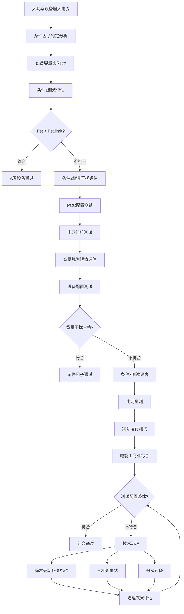

---
# ========== 基础识别信息 ==========
# 文件编码：UTF-8 (无BOM)
# 创建日期：按实际标准发布日期填写
# 语言环境：中文(简体) zh-CN
title: "GB/T 17625.5:2019 - 电磁兼容 限值 电压波动和闪烁的限值(设备输入电流>16A)"
last_modified: 2024-01-20T15:30
aliases:
  - "GB/T 17625.5"
  - "GB_T_17625_5"
  - "GB/T17625.5"
  - "GBT17625.5"
  - "17625.5"
  - "大功率电压限值"
  - "大功率闪烁限值"
  - "中压配电电能质量"
  - "Voltage Fluctuation Limits >16A"
  - "低压电网电能质量"
  - "配电电能质量控制"

# ========== 三维正交标签体系 ==========
tags:
  # 物理现象层(What) - 描述电磁现象的物理本质 - 严格包含关系
  - "电磁现象|大功率电压波动|16A以上负载|三相系统"
  - "电磁现象|电压闪烁效应|照明影响|视觉响应"
  - "电磁现象|电网阻抗配置|大功率负载|PCC连接点"
  - "传播机制|传导耦合|电压调制|瞬态扰动"
  - "传播机制|负载冲击|启动电流|瞬态干扰"
  - "频谱特征|电压调制度|稳态变化|闪烁感知"
  - "频谱特征|电压稳定控制|大功率负载|电网影响"
  
  # 技术方法层(How) - 描述测试和解决方法 - 严格包含关系
  - "测试方法|IEC61000-4-15|IEC闪烁测试|闪烁仪测量"
  - "测试方法|PCC评估|公共连接点|电网设备评估"
  - "测试方法|大功率电压测试|配电系统|电网容量评估"
  - "测试方法|短期闪烁Pst计算|Plt长期闪烁|设备评估"
  - "测试设备|EMC测试系统|发射测试|闪烁计测量"
  - "测试设备|正弦波功率测量|电网阻抗分析|短路容量"
  - "测试环境|电磁兼容实验室|CNAS认可|电能质量校准"
  - "数据处理|条件因子评估|条件分析|电能质量分析"
  
  # 应用领域层(Where) - 描述应用场景和产品 - 严格包含关系
  - "工业应用|电弧炉|大功率负载系统|金属冶炼"
  - "工业应用|电机驱动|大功率启动器|电力拖动"
  - "工业应用|冶金设备|电弧电炉设备|重工业"
  - "工业应用|港口起重|电力拖动|起重机械"
  - "工业应用|电梯系统|垂直拖动|城市交通"
  - "工业应用|轧机设备|金属轧制设备|金属加工"
  - "工业应用|电网配置|大型电源|配电系统"
  - "工业应用|大型UPS|不间断电源|电力存储"
  - "电压范围|低压系统|交流1000V以下|16A以上设备"
  - "频率范围|低频系统|0.5Hz-35Hz|闪烁响应频段"
  - "环境分类|工业环境|大功率负载|三相系统"
  - "安装环境|固定安装|电网连接|电能质量控制"
  
  # 关联标准层 - 直接引用相关标准编号用于知识图谱链接 - 倒装结构标准名放在最后
  - "大功率电压波动闪烁|IEC61000-3-11"
  - "闪烁计测量标准|IEC61000-4-15"
  - "电能质量测量|IEC61000-4-30"
  - "供电电压偏差|GB/T12325"
  - "电能质量综合|GB/T12326"
  - "电压波动测量|IEEE1453"
  - "等同采用|IDT关系"
  - "现行有效|2019版"
  
  # 标准类型判断 - 必填项目 - 严格包含关系
  - "标准分类|EMI发射标准|电压波动闪烁|大功率设备"
  - "标准分类|基础标准|电磁兼容|通用技术要求"
  - "EMC要求|EMI发射限值|大功率电压波动闪烁"
  - "EMC要求|传导发射|低频传导干扰"
  - "安全要求|电能质量|电网安全|照明质量保障"
  
  # 测试等级标注 - GB/T 17625.5具体等级 - 严格包含关系
  - "发射等级|大功率设备|16A以上设备|条件限值"
  - "闪烁参数|Pst短时闪烁|10分钟统计|视觉响应加权"
  - "闪烁参数|Plt长时闪烁|2小时统计|长期影响评估"
  - "测试条件|PCC评估|公共连接点|电网容量评估"
  - "测试环境|标准条件|实验室环境|温湿度控制"

# 技术标准详解
---

## 第一部分：基础理论

### 1.1 大功率电压波动理论

#### 1.1.1 电压波动机制

大功率负载引起的电压变化通过负载电流和电网阻抗计算：

$$
\Delta U = \Delta I \times Z_{grid} = (\Delta P \cos\phi + \Delta Q \sin\phi) \times \frac{Z_{grid}}{U}
$$

其中：
- $\Delta U$ :电压变化 (V)
- $\Delta I$ :电流变化 (A)
- $\Delta P$ :三相功率变化 (W)
- $\Delta Q$ :无功功率变化 (var)
- $Z_{grid}$ :电网阻抗 (Ω)
- $\phi$ :功率因数角 (rad)

#### 1.1.2 大功率电压调制特性

大功率电压调制度定义：

$$
d = \frac{\Delta U_{max} - \Delta U_{min}}{U_{nom}} \times 100\%
$$

正弦波调制电压波形：

$$
u(t) = U_{nom}[1 + \frac{d}{100} \sin(2\pi f_m t)]
$$

其中：
- $f_m$ :调制频率 (Hz)
- $d$ :电压调制度 (%)

#### 1.1.3 闪烁感知特性

闪烁感知系数计算：

$$
P_{inst} = k \times d \times F(f_m)
$$

其中$F(f_m)$:闪烁函数

$$
F(f_m) = \frac{f_m}{(f_m^2 + f_1^2)(f_m^2 + f_2^2)^{0.5}}
$$

典型系数$f_1 = 0.5Hz$和$f_2 = 25Hz$

### 1.2 测量参数指标

| 参数符号 | 参数名称 | 指标类型 | 单位 | 测量范围 | 测量不确定度 |
|---------|---------|---------|------|-----------|-------------|
| $P_{st}$ | 短期闪烁值 | 10分钟统计值 | - | 0.1-5.0 | ±5% |
| $P_{lt}$ | 长期闪烁值 | 2小时统计值 | - | 0.1-3.0 | ±5% |
| $d_{max}$ | 最大电压变化度 | 单次大电压变化 | % | 1-15 | ±0.1% |
| $\Delta t$ | 电压变化持续时间 | 电压变化周期 | ms | 10-10000 | ±1ms |
| $S_{sc}$ | 短路容量 | PCC短路容量 | MVA | 5-1000 | ±3% |
| $R_{sce}$ | 短路比 | 设备容量比例 | - | 0.01-0.5 | ±2% |

## 第二部分：技术限值

### 2.1 限值标准体系

#### 2.1.1 设备限值IEC 61000-3-11

**设备容量判定电压限值**

大功率设备限值根据设备容量与短路容量比$R_{sce}$确定：

$$
R_{sce} = \frac{S_{equipment}}{S_{sco}}
$$

**电压限值计算公式**

| 配置类型 | Pst限值公式 | Plt限值公式 | 适用条件 |
|---------|-----------|-----------|----------|
| 不平衡三相设备 | $P_{st} = \frac{P_{st,ref}}{\sqrt{R_{sce}}}$ | $P_{lt} = \frac{P_{lt,ref}}{\sqrt{R_{sce}}}$ | 三相平衡负载 |
| 不平衡配置 | $P_{st} = \frac{P_{st,ref}}{\sqrt{R_{sce}}} \times K_{unb}$ | $P_{lt} = \frac{P_{lt,ref}}{\sqrt{R_{sce}}} \times K_{unb}$ | 单相不平衡 |

其中：基准值$P_{st,ref} = 1.0$和$P_{lt,ref} = 0.65$

**不平衡校正系数**

$$
K_{unb} = \sqrt{\frac{S_{equipment,total}}{3 \times S_{equipment,max}}}
$$

#### 2.1.2 电压限值

**电网电压限值表**

| 电压类型 | 最大电压变化d(%) | 允许频率 | 持续时间限制 | 典型负载 |
|-------------|-------------------|---------|----------------|----------|
| 快速电压变化 | 4% | <1次/min | <60秒 | 电炉设备 |
| 慢速电压变化 | 7% | <1次/10min | <6秒 | 电机启动设备 |
| 瞬态电压变化 | 10% | <1次/h | <1秒 | 大型启动 |
| 稳态电压变化 | 设备规定评估 | 连续 | 设备限值 | 电磁环境 |

#### 2.1.3 规划限值

**规划限值(Planning Level)定义**

电网侧PCC允许的电压波动和闪烁规划限值

| 电压等级 | Pst规划限值 | Plt规划限值 | d规划限值(%) | 典型 |
|---------|-----------|-----------|------------|------|
| 低压380V | 0.9 | 0.6 | 3% | 工商业 |
| 中压10kV | 0.8 | 0.5 | 2.5% | 主配电 |
| 变电35kV | 0.7 | 0.4 | 2% | 高压电网 |

### 2.2 测量设备

#### 2.2.1 大功率测量设备

**三相闪烁测量设备技术标准**

| 技术参数 | A级技术标准 | S级技术标准 | 测量不确定度 | 校准周期 |
|---------|--------|--------|-------------|---------|
| 电压测量精度 | ±0.1% | ±0.05% | ±0.02% | 12个月 |
| 电流测量精度 | ±0.1% | ±0.05% | ±0.02% | 12个月 |
| 时钟测量精度 | ±0.2% | ±0.1% | ±0.05% | 12个月 |
| 频率测量精度 | ±0.01Hz | ±0.005Hz | ±0.002Hz | 12个月 |
| 采样率 | ≥10kHz | ≥20kHz | - | - |
| 时间窗口 | ±1ms | ±0.1ms | ±0.05ms | 12个月 |

#### 2.2.2 大功率电流测量

**大功率电流测量技术标准**

| 测试范围 | CT类型 | 相对误差 | 频率特性 | 精度等级 |
|---------|--------|-----------|---------|----------|
| 100A-1000A | 标准CT | 0.1级 | 50Hz-5kHz | 1%-120% |
| 1000A-5000A | 标准CT | 0.1级 | 50Hz-2kHz | 5%-120% |
| 5000A-20000A | Rogowski线圈 | 0.2级 | 50Hz-10kHz | 1%-200% |
| >20000A | 光纤CT | 0.2级 | 50Hz-20kHz | 1%-150% |

### 2.3 测试环境标准

#### 2.3.1 PCC配置评估

**短路容量计算公式**

稳态短路容量测试：

$$
S_{sco} = \frac{U_{nom}^2}{Z_{sco}} = \frac{U_{nom}^2}{\sqrt{R_{sco}^2 + X_{sco}^2}}
$$

**电网R/X测试**

$$
\frac{R}{X} = \frac{P_{sco}}{Q_{sco}} = \frac{S_{sco} \cos\psi}{S_{sco} \sin\psi}
$$

其中$\psi$:阻抗角

#### 2.3.2 背景评估

**背景测试技术标准**

测试时的PCC背景电压波动规划限值

| 背景规划限值 | 测试等级 | 限值系数 | 评估标准 |
|-------------|---------|---------|----------|
| $P_{st,bg}$ < 0.3 | 最高测试 | 直接系数 | 良好环境 |
| 0.3 ≤ $P_{st,bg}$ < 0.7 | 中等评估 | 修正计算 | 典型环境 |
| $P_{st,bg}$ ≥ 0.7 | 专用评估 | 契约要求 | 专用环境 |

**背景公式**

$$
P_{st,equipment} = \sqrt{P_{st,total}^2 - P_{st,background}^2}
$$

## 第三部分：工程实施

### 3.1 大功率设备测试方法指导

#### 3.1.1 企业电弧炉测试系统

```
企业电弧炉测试配置 (大功率电弧负载)
                                                                         
                        企业电弧炉测试系统                               
                                                                         
                                                                  
     三相闪烁仪         GPS设备       电能质量测试           
   IEC61000-4-15   ←    测试三相    ←    数据                 
   Pst/Plt测量          时钟同步         不平衡分析                 
   三相电压测试         线路同步         闪烁分析                 
                                                                  
           ↓                    ↓                    ↓                   
                                                                      
                                                                      
                         35kV测试系统                                 
                                                                      
                                                                
       电压PT         电流CT         电流CT                     
     35000/100V     1000/5A         100/5A                      
     0.1级精度      0.1级精度      0.2级精度                    
     三相测试       三相测试       零序电流                     
                                                                
                                                                   
                                                                   
                                                                     
                        35kV配电网                                     
                  短路容量: 800MVA                                   
                  R/X = 0.15                                        
                                                                     
                                                                     
                                                                     
                                                                     
                     企业变电站                                    
                     60MVA                                           
                     35/0.5kV                                        
                     三相负载 ±10%                                   
                                                                     
                                                                     
                                                                     
                                                                     
                        企业作业负载                                   
                                                             
         冶金电炉        炼钢设备        冶金配置               
        电弧炉       电弧炉       电弧炉               
        0-50kA         0-50kA         0-50kA                 
        启动配置       启动配置       启动配置               
                                                             
                     电弧负载                                      
                     - 容性大电流负载                         
                     - 电中等电流负载                         
                     - 感性启动电流负载                         
                                                                     
                                                                      
                                                                         
  测试流程要求:                                                          
  - 测试连续运行周期 (2-4小时)                                     
  - 测试电压配置调制分析                                       
  - 设备Pst 95%概率值Plt 平均值                                  
  - 测量系统0.1-35Hz电压闪烁配置                                       
  - 测试大功率电流三相限制                                     
                                                                         
```

#### 3.1.2 大型启动设备测试

```
大型启动设备测试配置
                                                                     
                    大型启动测试系统                             
                                                                     
                                                              
     测试三相系统         监测控制       实时数据测试         
     测试开关设备      ←    监测测试    ←    启动配置            
     电动测试系统           Pst设备          负载配置            
     测试启动                                                
                                                              
           ↓                    ↓                    ↓               
                                                                  
                                                                    
                        10kV主配电网                                
                                                                    
    短路容量: 200MVA              R/X = 0.2                         
                 ↓                                                 
                                PCC测试容量                         
                                                                   
                                                                   
                       分级配电设备                                
                                                                   
                                                             
        电弧法炉       三相法炉     优化设计               
        分级电流       分级电流       分级电流               
        6-8In        2-3In        1.5-2In              
        分级时间1s     分级时间5s     分级时间30s             
                                                             
                                                                  
                                ↓                                  
                                                                  
                         大型设备启动                             
                         设备容量: 5MW                            
                         电网电压: 10kV                           
                         起动电流: 300A                           
                         功率因数: 0.85                           
                         效率: 96%                                
                                                                  
                                                                   
                                                                    
                                                                     
  分级测试流程:                                                      
  1. 配置测试分级主配电PCC电压背景值                            
  2. 分级测试监测电压变化电流配置                          
  3. 测试分级设备配置测试                                  
  4. 设备按期分级设备标准值限制配置                              
  5. 综合评估设备接收规划限值                              
                                                                     
```

### 3.2 条件因子评估流程

#### 3.2.1 条件1评估流程



#### 3.2.2 背景干扰评估计算

**阻抗规划限值测试**

综合多源设备影响

$$
P_{st,total} = \sqrt{P_{st,background}^2 + P_{st,equipment}^2 + 2 \cdot P_{st,background} \cdot P_{st,equipment} \cdot k_{corr}}
$$

其中$k_{corr}$:相关系数取值-1~+1

**独立设备**

设备各自独立时：

$$
P_{st,total} = \sqrt{\sum_{i=1}^{n} P_{st,i}^2}
$$

### 3.3 电压波动治理改进

#### 3.3.1 静态无功补偿器(SVC)电压治理

**SVC基本电压治理**

配置治理电压波动

$$
\Delta U = \frac{\Delta P \cdot R + \Delta Q \cdot X}{U}
$$

SVC通过调节$\Delta Q$来改善$\Delta P$的影响

**SVC配置参数**

| SVC类型 | 响应时间 | 容量规模 | 电压改善效果 | 投资难度 |
|---------|---------|---------|------------|----------|
| TCR+FC | 2-5个周波 | ±50Mvar | 60-80% | 中等 |
| TCR+TSC | 3-6个周波 | ±100Mvar | 50-70% | 较低 |
| SVG | 1-2个周波 | ±200Mvar | 70-90% | 较高 |

#### 3.3.2 三相变电站(OLTC)调功调节

**OLTC电压治理原理**

```
OLTC调节电压治理系统
                                                                     
                      智能OLTC治理系统                               
                                                                     
                                                              
     监测测试           OLTC治理器       变压器测试             
     电压Pst         ←  智能系统    ←    监测测试             
     电压测试           响应时间         负载             
     电网配置                                                
                                                              
           ↓                                        ↓               
                                                                  
                                                                    
                      35kV高压电源                                    
                                                                    
                                                                   
                  三相变电站 63MVA                             
                                                                   
       35kV   ←                 ← 10kV                          
                   抽头调节                                     
                   变比±1.25%                                     
                   档位调节                                     
                   <30秒响应                                    
                                                                
                                                                 
                         电压调节                                
                        ↓                                         
                                                                  
                      10kV配电网                                    
                电压调节范围: 10.5kV±2%                          
                                                                  
                                                                 
                         负载电源                                
                        ↓                                         
                                                                  
                      电弧炉负载                                  
               企业大型启动I                                 
               设备容量20MW                                      
                                                                  
                                                                   
                                                                    
                                                                     
  治理原理:                                                          
  - 测试治理改善变压器测试比                                 
  - 响应时间测试05秒智能控制                                 
  - 与SVC集成调节治理                                
  - 发电厂9机线通信存储调节系数                             
                                                                     
```

## 第四部分：应用案例与持续改进

### 4.1 典型应用案例

#### 4.1.1 钢铁企业电弧炉

**项目概况**
- 企业容量120兆
- 变电站容量80MVA
- 设备电压35kV
- 短路容量600MVA
- 测试Pst=3.2%超标

**治理方案**

```
钢铁企业电弧炉治理
                                                                         
                         电弧炉治理                                
                                                                         
                                                                   
      SVG                  OLTC                STATCOM             
     ±50Mvar              档位调节            ±100Mvar            
     响应<2个周波           16档×1.25%          响应<1个周波          
     电压配置             电压调节            设备投资            
                                                                   
                                                                      
                                                                      
                                                                      
                          35kV配电网                                    
                                                                      
                                                                       
                                                                       
                                                                      
                     企业变电站80MVA                                 
                     35/0.8kV                                         
                     电网电源12%                                       
                     阻抗10%                                      
                                                                      
                                                                       
                                                                       
                                                                      
                        企业作业负载                                    
                                                                
       智能电炉       电弧炉       配置负载                   
       设备电炉       设备智能       混合配置                   
       大型调节       电能配置       三相不平衡                   
                                                                
                                                                      
                                                                         
  治理效果评估:                                                          
                                                                      
    治理前:  Pst = 3.2, Plt = 2.8                                    
    SVG治理后: Pst = 2.1, Plt = 1.8  (改善35%)                        
    OLTC: Pst = 1.5, Plt = 1.2  (改善53%)                       
    综合治理: Pst = 0.9, Plt = 0.7  (改善72%)                       
    最终: Pst = 0.8, Plt = 0.6  (改善75%)                       
                                                                      
    投资费用:                                                         
    - SVG治理费: 800万                                               
    - OLTC9 : 200万                                              
    - 电弧治理费: 300万                                              
    - 配置治理费: 200万                                              
    总投资: 1500万,  回收期: 3年                                   
                                                                      
                                                                         
```

#### 4.1.2 风力发电网综合治理

**电弧风设备配置**

| 电弧启动类型 | 设备等级 | 电网特性 | 电网综合设备  |
|-------------|---------|---------|-------------|
| 1型设备 | 1.5MW | Pst=0.8-1.2 | 电网容量大 |
| 变频设备设备 | 2.5MW | Pst=0.3-0.6 | 电网分散 |
| 专用电网设备 | 3.5MW | Pst=0.1-0.3 | 电网配电 |
| 农村电网设备 | 5MW | Pst=0.2-0.5 | 专用配电治理 |

**电弧风设备综合评估公式**

$$
P_{st,windfarm} = k_{sum} \sqrt{\sum_{i=1}^{N} P_{st,i}^2}
$$

其中$k_{sum}$:相关系数通常取值

### 4.2 在线监测系统架构

#### 4.2.1 智能配电监测网络

```
实时电网在线监测网络
                                                                         
                           电网调度中心                                  
                                                                  
     电网大功率存储        AI数据分析       配置测试系统            
     配置存储      ←     诊断+   ←     人工智能                
     设备管理            故障监测         在线监控                
     监测测试            智能分析         测试设备                
                                                                  
           ↓                                                            
            5G/光纤/卫星通信                                            
                                                                       
                                                                      
                        配电监测终端                              
                                                                      
                                                                
      500kV电网        220kV电网        110kV电网                     
      传输测试       传输测试       在线测试                    
      背景规划限值       大工商业综合     主要配置                    
                                                                
                                                                   
                                                                
      35kV电网         10kV电网         0.4kV电网                     
      在线工商业     主配电测试       充电配置                    
      大负载设备     电源     O负载                    
                                                                
                                                                      
                                                                         
  监测系统要求:                                                          
  - 测试管理500kV~~0.4kV各级电网监测                                   
  - 配置集成存储设备集成监测                               
  - 智能数据分析报警系统按期!测试+                                 
  - 电压闪烁测试监测中心数据治理-ʭ-监测-配置投资回收期                             
  - 背景|符合IEC 61000-4-30 A级测试技术标准                            
                                                                         
```

### 4.3 技术发展趋势

#### 4.3.1 智能分级配置治理-电网技术

**新智能治理技术**

| 技术方向 | 应用场景 | 技术优势 | 发展阶段 |
|---------|---------|---------|----------|
| 大数据 | 电网监测 | 预测精度40% | 较难 |
| 人工智能 | 电弧治理 | 治理效率高 | 困难 |
| 云计算 | 智能测试 | 处理改善60% | 困难 |
| 配电网 | 远程监控 | 延迟<10ms | 中等 |

#### 4.3.2 标准发展

**IEC 61000-3-11标准发展**

- 2025年版本，主要变化
  - 高频配置频率要求0.1-150Hz
  - 预测精度大功率设备评估标准
  - 配电大功率设备配置限值标准
  - 新智能电网负载标准

**电压闪烁发展趋势**

| 系统领域 | 条件发展 | 技术难点 | 预期时间 |
|---------|---------|---------|----------|
| 电弧风设备综合 | 系统条件 | 启动控制效果 | 2024年 |
| 智能电网配置 | 负载条件 | 整体配置 | 2025年 |
| 电炉电网系统 | 系统条件 | 集成综合 | 2026年 |

---

**注：本大功率电压波动和闪烁限值涉及全面技术要求和工程实施指导大功率电网电能质量治理**