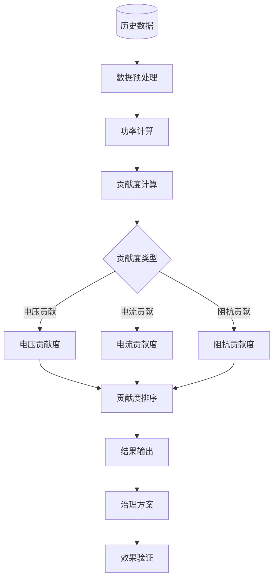

---
# ========== 基础识别信息 ==========
# 文件编码：UTF-8 (无BOM)
# 创建日期：按实际标准发布日期填写
# 语言环境：中文(简体) zh-CN
title: "GB/T 17625.6:2015 - 电磁兼容 限值 中压电网谐波发射评估"
last_modified: 2024-01-20T15:30
aliases:
  - "GB/T 17625.6"
  - "GB_T_17625_6"
  - "GB/T17625.6"
  - "GBT17625.6"
  - "17625.6"
  - "畸变负荷发射限值"
  - "中压电网谐波控制"
  - "电网谐波评估"
  - "Distorting Load Emission Assessment"
  - "电能质量评估"
  - "谐波治理标准"

# ========== 三维正交标签体系 ==========
tags:
  # 物理现象层(What) - 描述电磁现象的物理本质 - 严格包含关系
  - "电磁现象|畸变负荷谐波发射|非线性负载特性|中压系统"
  - "电磁现象|中压电网电能质量|配电系统谐波|1-35kV"
  - "电磁现象|电能质量THD|总谐波畸变率|系统影响"
  - "传播机制|电网阻抗频率特性|谐波传播机制|分布式电源"
  - "传播机制|互调失真|LC滤波器特性|谐波交互作用"
  - "频谱特征|谐波放大效应|谐振频率|系统谐振"
  - "频谱特征|功率因数变化|电网效率|电能损耗"
  
  # 技术方法层(How) - 描述测试和解决方法 - 严格包含关系
  - "测试方法|IEC61000-4-7|谐波分析仪|测量程序"
  - "测试方法|PCC评估|公用电网连接点|测量系统"
  - "测试设备|电流互感器|精密测量系统|计量溯源"
  - "测试设备|EMC测试系统|发射测试|频域测试"
  - "测试环境|电磁兼容实验室|CNAS认可|计量溯源体系"
  - "数据处理|电网建模|仿真分析|电能质量评估"
  - "数据处理|电能质量分析|谐波统计|频谱分析"
  
  # 应用领域层(Where) - 描述应用场景和产品 - 严格包含关系
  - "工业应用|中压配电系统|1-35kV电网|电能质量管理"
  - "工业应用|畸变负荷评估|非线性负载|大容量设备"
  - "工业应用|电网谐波控制|谐波治理|滤波设备"
  - "工业应用|新能源接入|分布式电源|智能电网"
  - "工业应用|工业园区|电力系统|集中供电"
  - "工业应用|城市配电网|公用电网|供电质量"
  - "电压范围|中压系统|1kV-35kV|配电网络"
  - "频率范围|工频系统|50Hz基波|2-40次谐波"
  - "环境分类|中压电网|配电系统|电能质量管理"
  - "安装环境|固定安装|电网连接|谐波污染控制"
  
  # 关联标准层 - 直接引用相关标准编号用于知识图谱链接 - 倒装结构标准名放在最后
  - "中压电网谐波评估|IEC/TR61000-3-6"
  - "中压系统谐波限值|IEC61000-3-7"
  - "谐波测量方法|IEC61000-4-7"
  - "公用电网谐波|GB/T14549"
  - "电力系统谐波|IEEE519"
  - "等同采用|IDT关系"
  - "现行有效|2015版"
  
  # 标准类型判断 - 必填项目 - 严格包含关系
  - "标准分类|EMI发射标准|谐波发射评估|中压电网"
  - "标准分类|技术报告|电磁兼容|评估方法"
  - "EMC要求|EMI发射评估|中压系统谐波控制"
  - "安全要求|电网安全|电能质量|谐波污染控制"
  
  # 测试等级标注 - GB/T 17625.6具体等级 - 严格包含关系
  - "评估等级|中压系统|1kV-35kV|畸变负荷评估"
  - "谐波次数|2-40次|工频谐波|频域分析"
  - "测试条件|PCC评估|公共连接点|电网容量评估"
  - "测试环境|标准条件|实验室环境|温湿度控制"
  
  # 第三层：行业应用领域
  - 工业负载_谐波源控制
  - 变频器_PWM变换器谐波
  - 电弧炉_冲击性负载
  - 整流器_直流电源系统
  - 轨道交通_牵引供电系统
  - 新能源发电_并网谐波
  - UPS系统_不间断电源
  - 电动汽车_充电桩谐波

# 工程实施信息
---

## 第一部分：物理原理详解

### 1.1 畸变负荷基础理论

#### 1.1.1 电网谐波机理

畸变负荷电流为非线性负载电流特性：

$$
i(t) = f[u(t)] = \sum_{h=1}^{\infty} I_h \cos(h\omega t + \phi_h)
$$

其中：
- $i(t)$ ：负载电流 (A)
- $u(t)$ ：电网电压 (V)
- $I_h$ ：h次谐波电流 (A)
- $\phi_h$ ：h次谐波相位 (rad)

#### 1.1.2 电网谐波阻抗特性

电网谐波阻抗频率特性：

$$
Z_h = R_h + j X_h = R_1 \sqrt{h} + j h X_1 \sqrt{\frac{h-1}{h+1}}
$$

其中：
- $Z_h$ ：h次谐波阻抗 (Ω)
- $R_1, X_1$ ：基波电阻和电抗 (Ω)
- 谐波阻抗随频率增加而增大

#### 1.1.3 电网谐波电压

PCC连接点谐波电压计算公式：

$$
U_h = \sum_{i=1}^{n} I_{h,i} \times Z_{h,ii} + \sum_{i=1}^{n}\sum_{j \neq i} I_{h,j} \times Z_{h,ij}
$$

其中：
- $Z_{h,ii}$ ：自阻抗
- $Z_{h,ij}$ ：互阻抗

### 1.2 测量参数指标

| 参数名称 | 符号 | 含义 | 单位 | 典型范围 | 测量不确定度 |
|---------|---------|---------|------|-----------|-------------|
| $THD_U$ | 电压总谐波畸变率 | 电网电能质量 | % | 1-8 | ±0.1% |
| $THD_I$ | 电流总谐波畸变率 | 负载畸变电流 | % | 5-50 | ±0.2% |
| $S_{sc}$ | 短路容量 | PCC短路容量 | MVA | 10-1000 | ±3% |
| $S_L$ | 负载容量 | 畸变负载容量 | MVA | 1-100 | ±2% |
| $\alpha$ | 衰减系数 | 电网衰减特性 | dB/km | 0.1-1 | ±0.1dB |
| $K_h$ | 放大系数 | 谐波放大倍数 | - | 1-50 | ±5% |

## 第二部分：技术参数详解

### 2.1 限值标准体系

#### 2.1.1 电压谐波限值(IEC 61000-3-6)

**中压电网电压谐波限值**

| 电压等级 | THD_U限值 | 5次谐波 | 7次谐波 | 11次谐波 | 13次谐波 |
|---------|-----------|--------|--------|---------|---------|
| 0.4kV | 8% | 6% | 5% | 3.5% | 3% |
| 10kV | 6% | 4% | 3% | 2.5% | 2% |
| 35kV | 4% | 3% | 2% | 1.5% | 1.5% |
| 110kV | 3% | 2% | 1.5% | 1% | 1% |

#### 2.1.2 电流发射限值

**畸变负荷电流限值**

畸变负荷电流发射限值：

$$
I_{h,limit} = \frac{U_{h,planning}}{Z_h} \times \frac{S_L}{S_{sc}} \times K_{allocation}
$$

其中：
- $U_{h,planning}$ ：h次谐波规划电压
- $K_{allocation}$ ：分配系数

**分配系数表**

| 负载类型 | 分配系数$K_{allocation}$ | 特征 | 典型应用 |
|---------|-------------------------|-------|----------|
| 线性负载 | 1.0 | 无谐波发射 | 电阻性负载 |
| 轻微畸变负载 | 0.8 | 低谐波含量 | 变频器 |
| 一般畸变负载 | 0.6 | 中等谐波 | 整流器 |
| 严重畸变负载 | 0.4 | 高谐波含量 | 电弧炉 |

### 2.2 测量设备与方法

#### 2.2.1 测量仪器

**谐波分析仪(IEC 61000-4-7)**

| 测量参数 | A级精度 | B级精度 | 测量不确定度 | 采样率 |
|---------|--------|--------|-------------|---------|
| 频率精度 | 5Hz | 1Hz | ±0.01Hz | 12位 |
| 幅值精度 | ±0.1% | ±0.05% | ±0.02% | 12位 |
| 相位精度 | ±0.1° | ±0.05° | ±0.02° | 12位 |
| 时间精度 | ±1ms | ±0.1ms | ±0.05ms | 12位 |
| 采样频率 | 最高5.12kHz | 最高10.24kHz | - | - |
| 测量时间 | 10个周期 | 10个周期 | - | - |

#### 2.2.2 电网建模参数

**变电站电网阻抗模型**

| 设备类型 | 阻抗模型 | 特性 | 典型参数 |
|---------|---------|---------|--------|
| 架空线路 | R+jωL | 线性特性 | R=0.2Ω/km, L=1.2mH/km |
| 电缆线路 | R+jωL+1/jωC | 分布参数 | C=0.15μF/km |
| 变压器 | R+jωL | 感性特性 | X=6-12% |
| 并联电容器 | 1/jωC | 容性特性 | Q=5-50Mvar |

### 2.3 测量程序

#### 2.3.1 谐波分析程序

**电能质量谐波分析**

```
谐波分析程序流程
                                                                 
                    谐波分析程序                             
                                                                 
  1. 潮流计算                                                
                                                               
       Power Flow: P + jQ = U × I*                            
       Newton-Raphson: J × ΔX = ΔF                           
       收敛判据: |ΔP|, |ΔQ| < ε                               
                                                               
                                                                
  2. 谐波源建模                                              
                                                               
       电流源模型: I_h = f(U_1)                               
       诺顿等效: I_h || Y_h                                   
       复合模型: I_h = f(U_1, U_h)                            
                                                               
                                                                
  3. 网络求解                                                
                                                               
       节点方程: [Y_h] × [U_h] = [I_h]                        
       阻抗频变: Z_h = R_h + jωhX_1                          
       边界条件: 平衡节点U_h = 0                               
                                                               
                                                                
  4. 迭代求解                                                    
                                                               
       for h = 2, 3, 5, 7, ..., 50:                           
           求解网络方程[Y_h] × [U_h] = [I_h]                
           更新谐波源I_h = f(U_1, U_h)                    
           检查收敛性|U_h^(k+1) - U_h^k| < ε                  
       end for                                                 
                                                               
                                                                
  5. 结果分析                                                    
                                                               
       THD_U = √(Σ(U_h/U_1)²) × 100%                         
       功率: P_h = U_h × I_h × cos(φ_h)                   
       贡献度: η_i = P_h,i / ΣP_h,total                     
                                                               
                                                                 
```

#### 2.3.2 贡献度计算

**谐波源贡献度计算**

$$
\eta_i = \frac{Re[U_h \times I_{h,i}^*]}{Re[U_h \times I_{h,total}^*]} \times 100\%
$$

其中：
- $\eta_i$ ：第i个谐波源贡献度
- $Re[\cdot]$ ：复数实部运算

## 第三部分：工程实施指导

### 3.1 畸变负荷测量程序

#### 3.1.1 测量系统组成

```
畸变负荷测量系统
                                                                         
                        测量系统组成                             
                                                                         
                                                                  
     电能质量分析仪      互感器       负载              
   IEC61000-4-30   ×   IEC61000-4-7 ×     配电系统               
   A级精度             0.1级精度         谐波源               
   数据采集            2-150次谐波       功率测量               
                                                                  
           ↓                    ↓                    ↓                   
                                                                      
                                                                      
                        10kV变电站                                 
                                                                      
                                                                     
                       公用电网PCC                                 
                  电压: 10kV±5%                                     
                  容量: 150MVA                                   
                  背景THD_U: 2.5%                                   
                                                                     
                                                                    
                                                                    
                                                                     
                       典型负载                                 
                                                                     
                                                               
       整流器     UPS系统        电弧炉                
       容量:5MW       容量:1MW       容量:2MW                  
       THD_I:15%      THD_I:8%       THD_I:25%                 
       主要谐波:5,7次     主要谐波:3,5次     主要谐波:5,7,11次             
                                                               
                                                                  
                                                                  
                                                               
       电动汽车         变频器         电解         
       容量:20MW      容量:3MW       容量:10MW                 
       THD_I:35%      THD_I:20%      THD_I:12%                 
       特征谐波     整流特性       电化学特性                  
                                                               
                                                                     
                                                                      
                                                                         
  测量要求:                                                              
  1. 负载特性: 测量负载电流波形                              
  2. PCC限值: 测量电网谐波电压                                   
  3. 贡献度: 计算各谐波源贡献                               
  4. 滤波器设计: 确定滤波器参数                                   
  5. 验证: 验证治理效果                                   
                                                                         
```

#### 3.1.2 变电站谐波测量

```
变电站谐波测量程序
                                                                     
                      变电站谐波测量                             
                                                                     
                                                              
     电能质量监测        负载监测         系统分析            
     阻抗参数     ×     电流监测   ×     谐波分析            
     电网特性           特性分析         仿真分析          
     计算参数                                               
                                                              
           ↓                    ↓                    ↓               
                                                                  
                                                                    
                        变电站现状                              
                                                                    
    现状测量   ×                     × 未来规划                   
    2024年                               2030年                  
    负荷:80%         规划扩建            负荷:120%               
    THD_U:3.5%       需求分析            THD_U:?                
                                                                 
                                                               
                     新增负载                                  
                     电动汽车                                  
                     充电站                                    
                     UPS系统                                  
                     数据中心                                    
                                                               
                                                                 
                                                               
                     电网设备                                   
                     变压器                                  
                     变频器                                    
                     谐波源                                  
                     滤波器                                  
                                                               
                                                                 
                                                                  
                      治理方案                                      
                           ↓                                       
                                                                 
                     主动滤波                                  
                     无源滤波                                   
                     串联电抗器                                  
                     并联电容器                                    
                     混合滤波                                  
                                                                 
                                                                    
                                                                     
  治理要求:                                                      
  - 技术要求: THD_U<限值, 满足限值要求                       
  - 经济要求: 投资回收期, 运行成本                             
  - 可靠性要求: 设备可靠性, N-1准则                                
  - 维护要求: 维护方便性, 混合治理                             
                                                                     
```

### 3.2 贡献度分析

#### 3.2.1 谐波源贡献度计算



#### 3.2.2 贡献度分析方法

**贡献度分析方法**

| 分析方法 | 适用范围 | 含义 | 典型应用 | 精度 |
|---------|-----------|---------|----------|------|
| 电压贡献 | 单一谐波源 | 谐波电压贡献 | 负载谐波源 | 高 |
| 电流贡献 | 复合谐波源 | 谐波电流贡献 | 复合系统 | - |
| 阻抗贡献 | 复杂系统 | 阻抗参数贡献 | 系统分析 | 中 |
| 功率贡献 | 系统分析 | 功率传递分析 | 典型应用 | 高 |

### 3.3 限值分配策略

#### 3.3.1 经济性分配

**最优化分配策略**

目标函数：
$$
\min \sum_{i=1}^{n} C_i(I_{h,i})
$$

约束条件：
$$
\sum_{i=1}^{n} I_{h,i} \times Z_{h,i} \leq U_{h,planning}
$$

其中：$C_i(I_{h,i})$为第i个谐波源治理成本

#### 3.3.2 公平性分配

**分配原则**

| 分配原则 | 计算公式 | 应用场景 | 优缺点 |
|-----------|---------|----------|-----------|
| 平均分配 | $I_{h,i} = I_{h,total}/n$ | 谐波源相等 | 简单 |
| 比例分配 | $I_{h,i} \propto S_i$ | 按容量分配 | - |
| 平方根分配 | $I_{h,i} \propto \sqrt{S_i}$ | 电能质量优化 | - |
| 边际成本分配 | $\frac{\partial C_i}{\partial I_{h,i}} = \lambda$ | 经济最优 | 复杂 |

## 第四部分：应用案例与持续改进

### 4.1 畸变负荷测量案例

#### 4.1.1 工业园区测量

**案例概况**
- 总容量：200MW
- 主要负载：电动汽车(80MW)、钢铁(60MW)、化工(60MW)
- 供电等级：110kV
- 短路容量：800MVA

**测量程序**

```
工业园区测量程序A
                                                                         
                        工业园区谐波测量                             
                                                                         
  阶段1: 现状调研 (1周)                                                  
                                                                  
     负荷调研            设备调研         环境调研                
     电能质量        ×   测量设备     ×   场地条件                
     负载特性            设备校准         测量干扰                
     电能质量监测            数据采集                                
                                                                  
                                                                        
  阶段2: 测量实施 (2周)                                                  
                                                                  
     供电测量        系统测量         数据处理                
     110kV母线       ×   7天24小时     ×   频谱分析                
     35kV母线            谐波测量         数据分析                
     主要负载          负载特性                                
                                                                  
                                                                        
  阶段3: 数据分析 (1周)                                                  
                                                                  
     电能质量分析            负载分析         系统分析                
     阻抗参数        ×   负载模型       ×   谐波分析                
     频响特性            特性分析         仿真分析              
     谐波传递            数据库                                
                                                                  
                                                                        
  阶段4: 治理方案 (1周)                                                  
                                                                  
     滤波器设计          贡献度分析         效果分析                
     限值分配        ×   贡献度计算       ×   技术评估                
     方案优化            经济性分析         投资回收                
     设备选型            设备选型                                
                                                                  
                                                                         
  主要结论:                                                              
  - 110kV母线THD_U = 4.2% (超过4.0%) 超标                           
  - 电动汽车贡献度65%, 钢铁贡献度25%, 其他10%                             
  - 5次谐波严重, 需要针对性治理                                  
  - 建议SVC+谐波滤波器, 投资1200万元                                    
                                                                         
```

#### 4.1.2 UPS系统谐波测量

**UPS系统特性**

| UPS系统类型 | UPS容量 | THD_I典型值 | 主要谐波次数 |
|-------------|---------|-------------|-------------|
| 小型(<1MW) | 单机UPS | 8-15% | 3,5,7次 |
| 中型(1-10MW) | 并联UPS | 5-10% | 5,7,11次 |
| 大型(>10MW) | 大容量UPS | 3-8% | 全次谐波 |

**谐波治理策略**

```
UPS系统谐波治理
                                                                     
                    UPS系统谐波治理                             
                                                                     
                                                              
     有源滤波器            无源滤波器         混合滤波器            
     APF控制系统    ×     无源LC     ×     复合控制            
     实时跟踪滤波            调谐滤波         维护便利            
     自适应滤波                                                
                                                              
           ↓                    ↓                    ↓               
                                                                  
                                                                    
                        谐波治理系统                                
                                                                    
    110kV母线   ×                     × 10kV配电                 
    2×63MVA                              #1-#8                   
    变电站         母线联络            UPS负载              
    500MVA           谐波滤波器            配电系统                
                                                                 
                                                               
                     有源滤波器                                  
                     APF 20A                                   
                     谐波补偿                                  
                                                               
                                                                 
                                                                  
                      负载管理                                      
                           ↓                                       
                                                                   
                       UPS系统                                 
                                                           
       UPS机组A      UPS机组B      UPS机组C             
       10MW IT负载    15MW IT负载    20MW IT负载           
       UPS效率96%     UPS效率97%     UPS效率98%            
       THD_I: 6%      THD_I: 5%      THD_I: 4%             
                                                           
                                                                   
                                                                    
                                                                     
  治理效果:                                                      
  - 负载管理: UPS负载谐波管理                               
  - 滤波器: 有源滤波器投入                               
  - 效果验证: 谐波THD_U<6% (10kV母线)                               
  - 经济性: 投资回收期3年                                       
                                                                     
```

### 4.2 智能电网应用

#### 4.2.1 新能源并网测量

```
智能电网测量
                                                                         
                          智能电网测量                             
                                                                  
     AI监测系统          光伏逆变器       电动汽车充电                
     数据采集      ×     并网逆变器   ×     V2G系统                
     智能分析            谐波分析         充放电控制                
     自动报警            优化调节                                
                                                                  
           ↓                                                            
            5G/物联网                                                 
                                                                       
                                                                      
                      配电网智能监测                                 
                                                                      
                                                                 
       配电台区A                   配电台区B                         
       智能监测                  智能监测                        
       谐波分析                  谐波分析                        
       自动调节                  自动调节                        
                                                                 
                                                                  
                          ↓                                       
                                                                   
                                                                       
                      智能治理                                  
                                                                       
                                                               
       智能APF        智能SVC        智能谐波器                
       AI控制         智能控制       自动投切                
       数据采集       仿真分析       配电网运行                  
                                                               
                                                                       
                                                                      
                                                                         
  发展趋势:                                                              
  - 负载监测: 实时监测谐波状态                                 
  - 智能控制: 智能控制算法                                       
  - 综合治理: 集中式综合治理系统                                 
  - 经济性: 投资成本, 运行维护                                   
  - 数据采集: 云端数据治理                                         
                                                                         
```

### 4.3 技术发展趋势

#### 4.3.1 标准技术发展趋势

**电能质量技术发展**

| 技术发展 | 特点描述 | 发展时间表 | 主要技术 |
|---------|-------------|-------------|-------------|
| 智能滤波器 | 自适应控制 | 现有技术阶段 | 智能控制 |
| 有源滤波 | 实时补偿 | 成熟技术阶段 | 最优化限值 |
| 无源滤波系统 | 经济实用 | 新兴技术阶段 | 谐波治理 |
| 综合治理 | 系统集成 | 电能质量发展 | 智能电网 |

#### 4.3.2 标准发展

**IEC 61000-3-6标准发展**

- 2025年修订版本
  - 现有技术范围150次谐波
  - 新的测量方法体系
  - 智能电网谐波测量
  - 系统级谐波治理技术

**国内标准发展方向**

| 标准类型 | 发展方向 | 技术特点 | 时间节点 |
|---------|---------|---------|----------|
| 基础标准 | 智能电网 | 大数据分析 | 2024年 |
| 应用标准 | 负载管理 | 智能滤波器 | 2025年 |
| 电动汽车标准 | 智能电网 | V2G技术 | 2026年 |
| UPS系统标准 | 电网级 | 大容量UPS | 2027年 |

---

**总结:中压电网畸变负荷限值测量是电网谐波治理的重要技术手段,通过系统的测量程序和分析方法,可以有效控制电网谐波污染,提升电能质量**