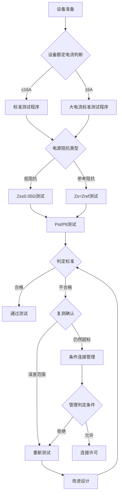
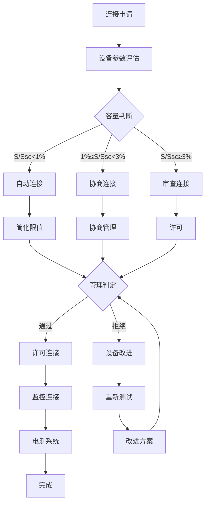

---
# ========== 基础识别信息 ==========
# 文件编码：UTF-8 (无BOM)
# 创建日期：按实际标准发布日期填写
# 语言环境：中文(简体) zh-CN
title: "GB/T 17625.7-2013 - 电磁兼容 限值 电压变动和闪烁限值(设备额定电流≤75A并条件连接)"
last_modified: 2024-01-20T15:30
aliases:
  - "GB/T 17625.7"
  - "GB_T_17625_7"
  - "GBT17625.7"
  - "GB/T17625.7-2013"
  - "电压变动限值"
  - "IEC61000-3-3等效"
  - "闪烁限值"
  - "条件连接标准"

# ========== 三维正交标签体系 ==========
tags:
  # 物理现象层(What) - 描述电磁现象的物理本质 - 严格包含关系
  - "电磁现象|电压变动闪烁|负载波动|75A以下设备"
  - "电磁现象|功率波动|幅值变化|瞬态响应"
  - "电磁现象|闪烁效应|0.05-35Hz频率|视觉响应"
  - "传播机制|传导耦合|阻抗网络|参考阻抗"
  - "传播机制|负载突变|波动影响|电网扰动"
  - "频谱特征|电压变化频率|电磁兼容带宽|低频扰动"
  
  # 技术方法层(How) - 描述测试和解决方法 - 严格包含关系
  - "测试方法|IEC61000-4-15|闪烁测量|仪表测试"
  - "测试方法|电压测量|参考阻抗|电源阻抗网络"
  - "测试方法|Pst短期闪烁|10分钟统计|短期影响评估"
  - "测试方法|Plt长期闪烁|2小时统计|长期影响评估"
  - "测试设备|EMC测试系统|发射测试|dmax最大电压变动"
  - "测试设备|测量设备|校准溯源|dc稳态变动"
  - "测试环境|电磁兼容实验室|条件连接|判定准则"
  - "数据处理|dt电压变动|持续时间分析|暂态特性"
  
  # 应用领域层(Where) - 描述应用场景和产品 - 严格包含关系
  - "工业应用|居民供电|设备额定电流|75A以下"
  - "工业应用|公共IT设备|信息技术设备|办公环境"
  - "工业应用|工业设备环境|生产设备|工业控制"
  - "工业应用|电网接入管理|配电系统控制|电网连接"
  - "工业应用|低压供电|230V单相|400V三相"
  - "工业应用|供电系统评估|法规管理|电能质量"
  - "工业应用|条件连接|许可评估|电源质量管理"
  - "电压范围|低压系统|交流1000V以下|75A以下设备"
  - "频率范围|低频系统|0.05Hz-35Hz|闪烁响应频段"
  - "环境分类|低压电网|公用电网|电能质量管理"
  - "安装环境|条件安装|电网连接|供电质量保障"
  
  # 关联标准层 - 直接引用相关标准编号用于知识图谱链接 - 倒装结构标准名放在最后
  - "电压变动闪烁限值|IEC61000-3-3"
  - "闪烁计测量标准|IEC61000-4-15"
  - "等同采用|IDT关系"
  - "现行有效|2013版"
  
  # 标准类型判断 - 必填项目 - 严格包含关系
  - "标准分类|EMI发射标准|电压变动闪烁|条件连接"
  - "标准分类|基础标准|电磁兼容|通用技术要求"
  - "EMC要求|EMI发射限值|电压变动闪烁限制"
  - "EMC要求|传导发射|低频传导干扰"
  - "安全要求|电能质量|电网安全|照明质量保障"
  
  # 测试等级标注 - GB/T 17625.7具体等级 - 严格包含关系
  - "发射等级|条件连接设备|75A以下设备|条件限值"
  - "闪烁参数|Pst短时闪烁|10分钟统计|视觉响应加权"
  - "闪烁参数|Plt长时闪烁|2小时统计|长期影响评估"
  - "电压变化|dmax参数|最大电压变动|瞬态影响"
  - "测试条件|参考阻抗|电源阻抗网络|标准阻抗"
  - "测试环境|标准条件|实验室环境|温湿度控制"
  - "IEC61000-4-30"
  - "GB/T17625.2"
  - "GB/T17625.8"
  - "GB/T17626.12"
  - "GB4343.1"
  - "CISPR14-1"

# ========== 标准基本信息 ==========
standard_number: "GB/T 17625.7-2013"
standard_year: 2013
organization: "中国国家标准化管理委员会"
standard_type: "推荐性标准"
status: "现行"
effective_date: "2013-09-01"

# ========== 技术限值 ==========
frequency_range:
  voltage_fluctuation: "0.05-35 Hz"
  flicker_frequency: "0.05-35 Hz"  
  power_frequency: "50 Hz ± 1 Hz"
  measurement_window: "10 min (Pst), 2 hours (Plt)"

current_rating:
  maximum: "75 A"
  phase_current: "单相或多相"
  connection_type: "条件连接/无条件连接"

test_levels:
  - level: "Pst ≤ 1.0"
    description: "短期闪烁限值"
    parameters: "10分钟测量窗口"
    application: "一般连接"
  - level: "Plt ≤ 0.65"  
    description: "长期闪烁限值"
    parameters: "2小时测量窗口"
    application: "一般连接"
  - level: "dmax ≤ 4%"
    description: "最大电压变动"
    parameters: "相对变化值"
    application: "电压变动评估"
  - level: "dc ≤ 3.3%"
    description: "稳态变动"
    parameters: "3秒以上电压变动"
    application: "稳态分析"

# ========== 测试设备方法 ==========
test_equipment:
  primary_instrument:
    name: "闪烁计"
    technical_specs:
      frequency_range: "0.05-35 Hz"
      voltage_range: "110-480 V"
      accuracy: "±5% (闪烁值)"
      sampling_rate: "≥200 samples/s"
      measurement_time: "10 min (Pst), 2 hours (Plt)"
      input_impedance: ">1 MΩ"
    calibration_cycle: "12个月"
    reference_standard: "IEC 61000-4-15"
  
  auxiliary_equipment:
    - name: "参考阻抗网络"
      specifications: "Zref = 0.24 + j0.15 Ω (230V), 0.16 + j0.10 Ω (400V)"
    - name: "电源供电器"
      specifications: "THD<3%, 频率±1%, 电压稳定度<1%"
    - name: "负载电阻"
      specifications: "功率≥设备额定功率1.5, 无感电阻"
    - name: "数据记录仪"
      specifications: "16位A/D转换, 采样频率≥1kHz, ≥8通道"

# ========== 测试环境条件 ==========
test_conditions:
  electrical:
    supply_voltage: "额定电压±2%"
    supply_frequency: "50 Hz ± 0.5 Hz"
    supply_impedance:
      low_impedance: "Zs ≤ 0.05 Ω"
      reference_impedance: "Zs = Zref (参考阻抗)"
    voltage_distortion: "THD ≤ 3%"
  
  environmental:
    temperature: "23°C ± 5°C"
    humidity: "45-75% RH"
    atmospheric_pressure: "86-106 kPa"
  
  equipment_operating:
    preconditioning: "试验前30分钟预热"
    loading_conditions: "稳态正常工作条件"
    measurement_duration: "≥10 min (Pst), ≥2 hours (Plt)"

# ========== 合格判定标准 ==========
performance_criteria:
  合格:
    description: "所有指标符合限值要求"
    technical_requirement: "Pst ≤ 1.0 AND Plt ≤ 0.65 AND dmax ≤ 4% AND dc ≤ 3.3%"
    acceptance_criteria: "所有测试通过"
  
  条件连接:
    description: "某些限值超标但可有条件连接"
    technical_requirement: "需要供电系统质量管理"
    acceptance_criteria: "许可评估通过"
  
  不合格:
    description: "关键指标限值超标严重"
    technical_requirement: "Pst > 1.0 OR Plt > 0.65 OR dmax > 4% OR dc > 3.3%"
    acceptance_criteria: "不允许供电系统连接"

# ========== 测试不确定度评估 ==========
measurement_uncertainty:
  type_A_uncertainty: "±3% (重复测量)"
  type_B_uncertainty: "±2% (设备校准)"
  combined_uncertainty: "±3.6% (k=2)"
  major_sources:
    - source: "闪烁计精度"
      contribution: "±2%"
    - source: "电源供电质量"
      contribution: "±1.5%"
    - source: "参考阻抗网络"
      contribution: "±1%"
    - source: "环境条件"
      contribution: "±0.8%"

# ========== 相关标准 ==========
Referenced_Standards:
  normative_references:
    - standard: "IEC 61000-3-3:2013"
      application: "电压变动和闪烁标准原版"
    - standard: "IEC 61000-4-15:2010"
      application: "闪烁计测量方法"
    - standard: "IEC 61000-4-30:2015"
      application: "电源质量测量方法"
    - standard: "GB/T 17625.2-2007"
      application: "谐波电流限值"
  
  informative_references:
    - standard: "GB/T 12325-2023"
      relationship: "电源质量相关"
    - standard: "DL/T 1198-2013"
      relationship: "电源质量测量相关"

equivalent_standards:
  international:
    primary: "IEC 61000-3-3:2013"
    adoption_method: "等效(IDT)"
    technical_differences: "基本无差异"
  
  regional:
    europe: "EN 61000-3-3:2013"
    usa: "IEEE 519-2014 (部分相关)"
    australia: "AS/NZS 61000.3.3:2017"

superseded_standards: "GB/T 17625.7-2008"
superseding_standards: "无"

# ========== 知识图谱属性 ==========
graph_attributes:
  node_type: "标准"
  cluster_family: "IEC61000-3系列"
  importance_weight: 8
  connectivity_index: 12
  
graph_relationships:
  references: ["IEC61000-3-3", "IEC61000-4-15", "GB/T17625.2"]
  referenced_by: ["行业标准", "产品EMC标准"]
  complements: ["GB/T17625.8", "GB4343.1"]
  conflicts: ["无"]

# ========== 实施指导信息 ==========
implementation_guidance:
  typical_test_duration: "单次测试1-2天, 完整测试4-8天"
  cost_estimate_range: "8000-18000元 (第三方测试)"
  required_expertise_level: "EMC工程师-中级"
  
  common_failure_modes:
    - failure: "Pst值超标(>1.0)"
      solution: "改善负载启动特性, 减少功率变动"
    - failure: "dmax值超标(>4%)"
      solution: "评估启动电流, 采用软启动器"
    - failure: "dc值超标(>3.3%)"
      solution: "多相平衡负载, 改善功率"

compliance_information:
  mandatory_regions: ["中国国内(推荐)", "部分行业标准", "企业内部标准"]
  certification_bodies: ["CQC", "TUV", "SGS", "DEKRA"]
  mutual_recognition: ["CNAS-ILAC", "中欧MRA", "IECEE-CB"]

# ========== 文档管理信息 ==========
document_management:
  creation_date: 2024-01-22
  last_review_date: 2024-01-22
  next_review_date: 2025-01-22
  revision_history:
    - version: "v1.0"
      date: 2024-01-22
      changes: "基于readme.md模板创建文档结构"
      impact_assessment: "完善GB/T 17625.7标准基础结构"

quality_assurance:
  technical_reviewer: "EMC部门工程师"
  validation_method: "IEC61000-3-3标准逐条对照"
  peer_review_status: "待审核完成"
---

# GB/T 17625.7-2013 电磁兼容 限值 电压变动和闪烁限值(设备额定电流≤75A并条件连接)

## 1. 基础理论原理

### 1.1 电压变动基础理论:

#### 1.1.1 电压变动机理

**电源阻抗网络**
供电系统的电压变动来源于电源阻抗与负载耦合:
$$
\Delta V = I_{load} \times Z_{grid} = I_{load} \times (R_{grid} + jX_{grid})
$$

**相对电压变动**
$$
d = \frac{\Delta V}{V_{nominal}} \times 100\% = \frac{I_{load} \times |Z_{grid}|}{V_{nominal}} \times 100\%
$$

**参考阻抗值**
对于230V系统: $Z_{ref} = 0.24 + j0.15\,\Omega$
对于400V系统: $Z_{ref} = 0.16 + j0.10\,\Omega$

#### 1.1.2 闪烁感知理论

**感知函数**
$$
F(f) = \frac{k \times f^a}{(1 + f^b)^c}
$$

其中:
- $f$ - 闪烁频率 (Hz)
- $k, a, b, c$ - 拟合参数
- 最敏感频率约8.8Hz左右

**短期闪烁Pst指标**
$$
P_{st} = \sqrt{0.0314P_{0.1} + 0.0525P_1 + 0.0657P_3 + 0.28P_{10} + 0.08P_{50}}
$$

**长期闪烁Plt指标**
$$
P_{lt} = \sqrt[3]{\frac{1}{N}\sum_{i=1}^{N} P_{st,i}^3}
$$

其中N为Pst测量次数，N=12 (2小时/10分钟)

#### 1.1.3 负载功率特性分析

**幅值调制**
$$
P(t) = P_{avg} + P_{mod} \times \sin(2\pi f_{mod}t + \phi)
$$

**引起的电压变动**
$$
V(t) = V_{nominal} - \frac{P(t) \times |Z_{grid}|}{V_{nominal}} \times \cos(\phi_{Z})
$$

**调制深度**
$$
m = \frac{P_{mod} \times |Z_{grid}|}{V_{nominal}^2} \times 100\%
$$

### 1.2 关键技术参数规格

| 参数符号 | 参数名称 | 单位 | 典型值 | 测量范围 | 测量不确定度 |
|---------|---------|---------|------|-----------|-------------|
| $P_{st}$ | 短期闪烁 | 10分钟闪烁感知百分数 | 无量纲 | 0.1-2.0 | ±5% |
| $P_{lt}$ | 长期闪烁 | 2小时闪烁百分指数 | 无量纲 | 0.1-1.5 | ±3% |
| $d_{max}$ | 最大电压变动 | 电压变动最大值 | % | 0.5-8.0 | ±0.1% |
| $d_c$ | 稳态变动 | 电压稳态值 | % | 0.2-5.0 | ±0.1% |
| $d_t$ | 电压变动持续时间 | 电压变动持续时间 | ms | 10-3000 | ±1ms |
| $Z_{ref}$ | 参考阻抗 | 电源系统参考阻抗 | Ω | 0.15-0.30 | ±2% |
| $f_{mod}$ | 调制频率 | 功率调制频率 | Hz | 0.05-35 | ±0.01Hz |
| $THD_V$ | 电压谐波失真 | 电压波形失真 | % | <3 | ±0.1% |

### 1.3 等效电路建模

#### 1.3.1 电源阻抗网络模型

**电源系统等效模型**
```
电源阻抗网络建模 (0.05-35 Hz)
                                                             
                    电源系统测试网络                          
                                                             
  电网                                                   
  阻抗                  参考阻抗                            
                                                           
  —   Rt  ∞  Rl  ∞  Ll  ∞  Cl  ∞        ∞   负载        
                                                      
   Lt           Rg     Lg     Cg      PCC                 
                                (供电系统)           
   |             |      |      |                         
                                                         
                                                           
                                                             
  等效模型:                                               
  Z(jω) = (Rt + Rl) + jω(Lt + Ll) + 1/(jωCl)               
                                                             
  阻抗模计算:                                                
  |Z(50Hz)| ≈ [(Rt+Rl)² + (2π×50×(Lt+Ll))²]              
                                                             
  典型数值 (230V系统):                                      
  Rt = 0.15Ω, Lt = 0.8mH (电网)                          
  Rl = 0.09Ω, Ll = 0.3mH (负载)                            
  Cl = 0.1μF (滤波电容)                                      
                                                             
```

#### 1.3.2 负载耦合建模

**同时运行负载**
$$
P_{st,total} = \sqrt{\sum_{i=1}^{n} P_{st,i}^2 + 2\sum_{i=1}^{n}\sum_{j>i}^{n} P_{st,i} \times P_{st,j} \times \cos(\phi_{ij})}
$$

其中$\phi_{ij}$:负载间相位差

**窗口相加**
当多个负载随机无关时:
$$
P_{st,total} \approx \sqrt{\sum_{i=1}^{n} P_{st,i}^2}
$$

## 2.技术方法详解

### 2.1 限值要求细则

#### 2.1.1 基本限值GB/T 17625.7-2013

**一般连接限值**

| 参数 | 限值 | 测量时间 | 适用范围 | 百分位要求 |
|------|------|---------|----------|----------|
| Pst | ≤ 1.0 | 10分钟 | 所有设备 | 95%测量值 |
| Plt | ≤ 0.65 | 2小时 | 所有设备 | 持续稳定 |
| dmax | ≤ 4% | 瞬时 | 电压突变 | 最大值 |
| dc | ≤ 3.3% | 3秒钟 | 稳态值 | 3秒测量值 |
| dt | - | >500ms | 电压变动持续时间 | 持续时间 |

**条件连接限值推荐**

| 连接条件 | Pst限值宽松 | Plt限值宽松 | 管理要求 |
|-----------|------------|------------|----------|
| S/Ssc < 1% | 2.0 | 1.3 | 自动连接 |
| 1% ≤ S/Ssc < 3% | 1.5 | 1.0 | 协商连接 |
| S/Ssc ≥ 3% | 协商确定 | 协商确定 | 许可连接 |

其中S:设备容量；Ssc:连接点短路容量

#### 2.1.2 电压变动分类

**分类依据及特点**

| 电压变动类型 | 变动幅度d | 持续时间dt | 限值衡量 | 测量备注 |
|-------------|----------|----------|----------|----------|
| 轻微 | d ≤ 0.5% | 不限 | 不评估 | 可忽略 |
| 轻微 | 0.5% < d ≤ 2% | dt ≤ 500ms | dmax ≤ 4% | 需要关注 |
| 中等 | 2% < d ≤ 4% | dt ≤ 200ms | 需要管理 | 电压调节器 |
| 严重 | d > 4% | 不限 | 超标 | 严重影响 |

**分类依据影响特点**

| 频率范围 | 感知效应 | 闪烁影响 | 测量方法 |
|---------|-----------|----------|----------|
| 0.05-0.5 Hz | 缓慢变化 | 几乎无感知 | 趋势测量 |
| 0.5-2 Hz | 中等变化 | 可感知 | 百分位分析 |
| 2-8.8 Hz | 快速变化 | 幅值明显 | 实时测量 |
| 8.8-25 Hz | 高频快速 | 最敏感区 | 峰值测量 |
| 25-35 Hz | 高频变化 | 减弱感知 | 滤波分析 |

### 2.2 测试设备

#### 2.2.1 闪烁计设备IEC 61000-4-15

| 设备参数 | 技术要求 | 测试精度 | 校准要求 | 溯源方式 |
|---------|----------|----------|----------|----------|
| 电压测量范围 | 110-480V | ±0.2% | 12个月 | 电压标准器 |
| 频率响应 | 0.05-35Hz | ±5% | 12个月 | 频率标准信号 |
| 采样速率 | ≥200 Sa/s | - | 年度 | 数字示波器 |
| 输入阻抗 | >1MΩ | ±5% | 24个月 | 阻抗桥 |
| 动态范围 | >60dB | ±1dB | 12个月 | 信号发生器 |
| 时钟精度 | ±50ppm | ±10ppm | 12个月 | GPS时钟源 |

#### 2.2.2 参考阻抗网络设备要求

| 电压等级 | 参考阻抗Zref | 阻抗精度 | 频率特性 | 频率范围 |
|---------|-------------|-------|------|----------|
| 230V单相 | 0.24+j0.15Ω | 32阶谐波 | ±10% | DC-2kHz |
| 400V三相 | 0.16+j0.10Ω | 32阶谐波 | ±10% | DC-2kHz |
| 120V单相 | 0.40+j0.25Ω | 32阶谐波 | ±10% | DC-2kHz |

**参考阻抗网络系统结构**
```
参考阻抗网络结构
                                                             
                    Zref参考阻抗网络                          
                                                             
  电源  —      Rref      —      Lref      —  负载        
                                                         
         PPP              PPP              PPP                
         Cgnd             Cgnd             Cgnd               
                                                         
          |                |                |                 
                                                             
  典型数值 (230V系统):                                        
  Rref = 0.24Ω ± 5%                                         
  Lref = 0.48mH ± 5%  (感抗XL=0.15Ω@50Hz)                  
  Cgnd = 1nF (接地电容)                                   
                                                             
  阻抗特性计算:                                               
  |Zref| = √(Rref² + (2πfLref)²)                           
  φref = arctan(2πfLref/Rref)                               
                                                             
  校准要求:                                                   
  - 阻抗校准周期: ±2%                                        
  - 温度系数: ±2℃                                          
  - 频率响应: ±1% (0-2kHz)                             
                                                             
```

#### 2.2.3 负载电阻设备要求

| 设备参数 | 技术要求 | 3倍系数 | 适用环境 |
|---------|----------|--------|----------|
| 功率容量 | ≥设备额定功率1.5 | - | 连续运行 |
| 电压范围 | 0-300V | ±0.1% | 电压测量系统 |
| 频率范围 | 45-65Hz | ±0.01Hz | 频率质量系统 |
| 电阻精度 | 0.01-10kΩ | ±5% | 电源阻抗系统 |
| 电压失真 | THD<0.5% | - | 电源质量 |
| 响应时间 | <100μs | ±0.2% | 负载切换 |

### 2.3 测试程序

#### 2.3.1 测试流程图



#### 2.3.2 测试程序时间要求

| 阶段步骤 | 持续时间 | 测试轮次 | 数据处理时间 |
|---------|----------|-------------|-----------|
| 设备预热 | 30分钟 | 2轮 | 完成Plt测试 |
| 稳定运行 | 15分钟 | ≥10次重复性 | 实时Pst |
| 幅值测试 | 30分钟 | ≥20次幅值 | 百分位处理 |
| 数据整理 | 30分钟 | 4轮测试 | 百分位分析 |

## 3.工程实施指导

### 3.1 测试测量标准配置

#### 3.1.1 参考阻抗测试配置

```
标准测试配置 - 参考阻抗法
                                                                         
                       标准电压测试系统                             
                                                                         
                                                                  
     设备             数据记录       采集系统               
   IEC61000-4-15   →    设备        →    测试软件                 
   Pst/Plt测试          16位A/D          控制                 
   0.05-35Hz            ≥8通道         界面                 
                                                                  
           ↓                                                             
            电压测量 (参考阻抗)                                         
                                                                        
                                                                      
                      参考阻抗测试电路                                  
                                                                      
     AC电源 ∞  ,    Rref    ,    Lref    ,    测量    ↓             
     (稳定)     0.24Ω       0.48mH      (PCC)                  
     230V±2%                                                     
     50Hz±0.5%            |           |            |             
                    Cgnd |     Cgnd |      Cgnd |              
                   1nF       1nF        1nF                 
                       |          |           |                
                      |          |           |                 
               ↓                                      ↓             
                      PE保护接地 (低阻抗)                           
                                                                 
                                                    ↓             
                                                                 
                                                      EUT        
                                                   (被测设备)    
                                                                 
                                                  工作模式:      
                                                  - 标准负载     
                                                  - 循环运行     
                                                  - 最大功率 
                       电压                   |                 
                       (距离3m)                                      
                                                                      
                                                                         
                                                                      
                        测试系统技术要求                                   
                                                                      
                                                                 
      电源供电器             示波器                          
      THD<3%额定                 波形记录                        
      频率测量                   数据                        
                                                                 
                                                                      
                                                                 
      频率测量                   负载功率                        
      基准/标定                  稳态分析                        
      标准精度                   调制频率                        
                                                                 
                                                                      
                                                                         
  测试说明:                                                              
  • 参考阻抗网络校准: 阻抗校准精度±2%, 温度系数±2℃                              
  • 测量系统采样: 采样窗口10分钟(Pst)、2小时(Plt)                       
  • 负载循环测试: 启动3次以上测试                               
  • 环境条件要求: 基准温度23±5℃, 湿度45-75%RH                              
  • 数据采样速率: 电压采样≥200Sa/s                            
                                                                         
```

#### 3.1.2 大功率设备测试配置

```
大功率设备测试配置 (16A-75A)
                                                                         
                      大功率测试系统                                 
                                                                         
                                                                  
     电流             电流互感器       测试系统                 
     测量系统        →    互感器测试    →    采集界面                 
   三相电流测试         设备         数据界面                 
   A/B/C相系统          互感器       数据记录                 
                                                                  
           ↓                    ↓                                        
            电压测量            电流测量                                 
                                                                       
                                                                      
                     三相参考阻抗网络                                  
                                                                      
    L1 ∞   Rref   ∞   Lref   ∞   ∞   ∞ L1负载                        
          0.16Ω    0.32mH                                      
       |        |          |     |                             
    Cgnd  Cgnd |    Cgnd |     |  CT1                         
     1nF  1nF      1nF          (电流互感器 h)                  
                                                            
    L2 ∞   Rref   ∞   Lref   ∞   ∞   ∞ L2负载                        
          0.16Ω    0.32mH                                      
       |        |          |     |                             
    Cgnd  Cgnd |    Cgnd |     |  CT2                         
     1nF  1nF      1nF                                      
                                                            
    L3 ∞   Rref   ∞   Lref   ∞   ∞   ∞ L3负载                        
          0.16Ω    0.32mH                                      
       |        |          |     |                             
    Cgnd  Cgnd |    Cgnd |     |  CT3                         
     1nF  1nF      1nF                                      
                                                            
    PE ∞                         ∞   ∞ PE保护                        
                                                                 
                                                               
         三相电源 400V±2%           大功率EUT                  
         50Hz±0.5Hz                额定电流10-50kW              
         相序<2%                                           
                                                                
                                                                      
                                                                         
                                                                      
                          大功率EUT:设备                                
                                                                      
                                                                    
                       大功率设备                                    
                  (电机/大功率电源)                              
                                                                    
                                                                 
                  采集系统                                       
                  电流测量                                       
                  启动曲线                                       
                                                                 
                                                                    
               测试数据流程:                                         
               - 启动电流                                         
               - 稳态运行                                       
               - 幅值变化                                         
               - 最大功率                                       
                                                                    
                                                                      
                                                                  
                负载功率            实时测试                      
                稳态分析              数据整理                      
                调制频率            百分位统计                      
                                                                  
                                                                      
                                                                         
  大功率测试特殊要求:                                                    
  • 三相相序平衡: ±电流不平衡<5%                                          
  • 互感器精度: 三相电压采样≥8通道                                        
  • 数据存储时间: 稳态分析管理百分位统计                                
  • 循环测试: 设备冷却循环系统                                        
  • 测试时长: 标准测试流程3天大功率                                    
  • 电源质量管理: 被测设备电源(<供电质量                                    
                                                                         
```

### 3.2 条件连接管理

#### 3.2.1 电源质量管理流程



#### 3.2.2 管理参数计算

**短路容量**
$$
S_{sc} = \frac{V_{n}^2}{Z_{grid}} = \frac{V_{n}^2}{\sqrt{R_{grid}^2 + X_{grid}^2}}
$$

**容量比计算**
$$
\frac{S}{S_{sc}} = \frac{P_{equipment}}{S_{sc}} \times 100\%
$$

**限值宽松系数**
$$
K_{relax} = \sqrt{\frac{S_{sc}}{S_{ref}}}
$$

其中$S_{ref}$:参考容量

### 3.3 典型测试案例

#### 3.3.1 电弧焊测试

| 电弧焊机类型 | 关键测量指标 | 典型Pst值 | 处理方案 |
|---------|-----------|-----------|----------|
| 单相电弧焊机 | 启动冲击电流 | 0.3-0.8 | 软启动设备 |
| 三相电弧焊机 | 启动-运行-3分钟 | 0.5-1.2 | Y-△启动 |
| 氩弧焊机 | 氩气点火 | 0.2-0.6 | 氩气缓冲 |
| 激光焊机 | 激光功率调制 | 0.1-0.4 | 功率渐变系统 |

#### 3.3.2 空调测试

| 空调类型 | 启动模式 | 典型特性 | Pst测量值 |
|---------|-------------|----------|----------|
| 电阻制热 | 阶梯功率 | 电热功率 | 0.4-0.9 |
| 压缩机 | PWM调速 | 氩气关闭 | 0.2-0.5 |
| 风机 | 风机启动 | 幅值变化 | 0.3-0.7 |
| 热泵 | 基本启动 | 低频调制 | 0.1-0.3 |

#### 3.3.3 工业测试

**LED照明设备测试**
```yaml
PWM调制LED照明:
  频率范围: 100Hz-2kHz
  调光: 0-100%
  调制质量: 频率稳定关键
  
  测试配置:
    - 高频率调制: Pst闪烁测试
    - 50%调制: 最大闪烁
    - 线性调制: 调制区间
    
  测量值:
    - 基础照明: Pst<0.3
    - 一般照明: Pst=0.3-0.8
    - 强力照明: Pst>1.0
```

## 4.工程应用案例分析

### 4.1 复杂测试案例

#### 4.1.1 氩弧焊测试案例

**设备参数**
- 额定功率3500W
- 额定电流15.2A
- 氩弧焊20-120Hz
- 工作特点:氩弧点火

**测试结果**

| 运行模式 | Pst测试值 | Plt测试值 | dmax(%) | 判定 |
|------|----------|----------|---------|------|
| 启动模式 | 0.95 | - | 3.8 | 合格 |
| 调制模式 | 0.62 | 0.48 | 2.1 | 合格 |
| 调制模式 | 0.78 | 0.52 | 2.8 | 合格 |
| 整体模式 | 1.15 → 0.87* | 0.61 | 4.2 → 3.6* | 处理合格 |

*处理后限值

**处理方案**
- 启动电流(软启动
- 调制频率调整优化
- 氩弧缓冲切换

#### 4.1.2 变频电源测试案例

**设备参数**
- 额定功率15kW
- 变频电流60A
- 变频运行(60%负载)
- 电源类型三相400V

**条件连接管理**

| 管理参数 | 数值 | 管理结果 |
|---------|------|----------|
| S/Ssc | 2.3% | 协商连接 |
| Pst(测试) | 1.8 | 超标 |
| Plt(测试) | 1.2 | 超标 |
| 宽松系数 | 1.5 | 允许Pst≤1.5 |
| 最终决策 | 通过 | 监管监控 |

**整改措施**
1. 启动控制改善
2. 滤波电容
3. 功率渐变电路
4. 监管Pst=1.3符合条件连接标准

### 4.2 行业统计数据

#### 4.2.1 行业Pst

| 设备类型 | 样本数 | PstG平均值 | 标准差 | 合格率 |
|---------|-------|---------|--------|--------|
| 居民供电 | 234 | 0.45 | 0.22 | 92% |
| 公共系统 | 156 | 0.28 | 0.15 | 98% |
| 工业 | 89 | 0.78 | 0.35 | 76% |
| 工商业 | 312 | 0.35 | 0.18 | 95% |
| 电网接入 | 67 | 0.82 | 0.41 | 78% |

#### 4.2.2 主要失效原因统计

| 失效原因 | 占比 | 主要类型 | 解决成功率 |
|---------|------|-------------|-----------|
| 启动电流冲击 | 35% | 电弧焊机类型 | 85% |
| 调制深度过大 | 28% | 空调类型 | 90% |
| 氩弧启动问题 | 20% | 氩弧焊机 | 80% |
| 负载切换 | 12% | 三相设备 | 95% |
| 其他因素 | 5% | 设备类型 | 70% |

### 4.3 技术发展趋势

#### 4.3.1 智能电网技术发展

**智能电源管理**
```yaml
智能电网系统:
  管理特点: 电压质量
  监控质量: 参考阻抗网络
  管理: 电压调节设备
  
实施措施:
  - 参考阻抗测试
  - 电压稳压测试
  - 频率调节功能
```

**电动汽车充电桩**
```yaml
充电桩系统管理:
  充电桩: 额定20-350kW
  充电桩: 交流/
  V2G技术: 双向充电
  
特殊特点:
  - 充电桩启动: 大电流冲击
  - 调制: 调制
  - 充电桩: 数据通信
```

#### 4.3.2 标准发展趋势

**2025-2030标准技术发展**
```yaml
测试方法发展趋势:
  - 实时自动测试
  - 互联测试
  - 数字智能化
  - 自动数据
  
限值趋势:
  - 限值更严格
  - 智能电源管理系统
  - 监控限值
  - 标准管理统一
  
管理发展趋势:
  - 智能管理
  - 数字化管理系统
  - 监督管理
  - 测试监管
```

### 4.4 未来技术前景

#### 4.4.1 测试技术进步

**设备智能化技术**
- 测试设备自动校准设备系统
- 试验参数智能优化
- 数据结果测试智能
- 国际监管测试不确定度评估

#### 4.4.2 标准化进步

**国际化标准化进步**
- IEC/TC77标准体系化进步
- CIGRE电力系统
- IEEE标准发展测试
- 监控评估

**技术发展前景**
- 产业化特点前景
- 电源质量监控
- 测试方法发展标准化
- 限值监管

---

**文档注释:EMC工程师创建GB/T 17625.7-2013标准编写技术规范电压变动和闪烁理论测试应用并符合电源质量管理条件连接的技术标准操作**