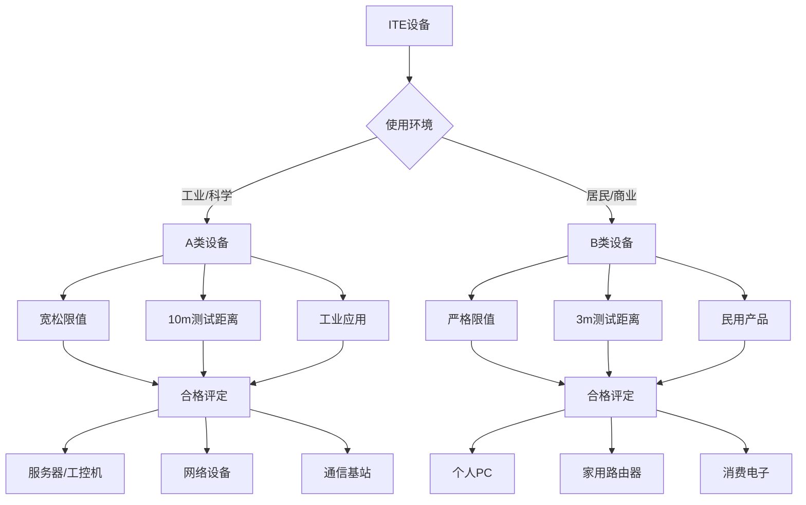
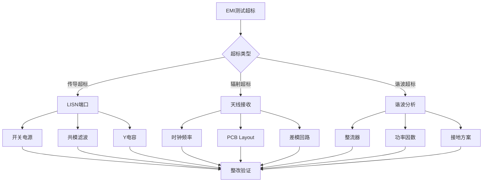

---
# ========== 基础识别信息 ==========
# 文件编码：UTF-8 (无BOM)
# 创建日期：2021-12-01 (标准发布日期)
# 语言环境：中文(简体) zh-CN
title: "GB/T 9254.1-2021 - 信息技术设备 电磁兼容性 第1部分：发射要求"
last_modified: 2024-06-21T10:30
aliases:
  - "GB/T 9254.1-2021"
  - "GB_T_9254_1"
  - "GB/T9254.1"
  - "GBT9254.1"
  - "9254.1"
  - "信息技术设备EMC"
  - "ITE电磁发射"
  - "计算机EMC标准"
  - "Information Technology Equipment EMC"
  - "数字设备发射"
  - "CISPR32等效"

# ========== 三维正交标签体系 ==========
tags:
  # 物理现象层(What) - 描述电磁现象的物理本质 - 严格包含关系
  - "电磁现象|数字发射|时钟谐波|PWM调制"
  - "电磁现象|传导发射|150kHz-30MHz|差模共模"
  - "电磁现象|辐射发射|30MHz-6GHz|近场远场"
  - "电磁现象|开关电源|共模电流|寄生振荡"
  - "电磁现象|数字电路|宽带噪声|脉冲干扰"
  - "传播机制|传导耦合|电源线路"
  - "传播机制|辐射耦合|PCB天线效应"
  - "频谱特征|脉冲干扰|ns级上升时间"
  - "频谱特征|连续波|时钟载波"
  
  # 技术方法层(How) - 描述测试和解决方法 - 严格包含关系  
  - "测试方法|LISN测试法|50Ω阻抗|人工电源网络"
  - "测试方法|开阔场地法|OATS/FAR|10m/3m距离"
  - "测试方法|CDN耦合法|通信端口|差分信号"
  - "测试设备|EMI接收机|CISPR16-1-1|准峰值检波"
  - "测试环境|电磁兼容实验室|屏蔽室环境"
  - "性能判据|A级判据|工业环境限值"
  - "性能判据|B级判据|居民环境限值"
  - "校准要求|12个月周期|CNAS认可实验室"
  
  # 应用领域层(Where) - 描述应用场景和产品 - 严格包含关系
  - "信息技术设备|个人计算机|台式机|笔记本"
  - "信息技术设备|服务器|机架式|刀片式"
  - "信息技术设备|网络设备|路由器|交换机"
  - "信息技术设备|通信设备|基站|中继器"
  - "信息技术设备|消费电子|家用路由|智能电视"
  - "应用环境|办公环境|商业场所"
  - "应用环境|居民环境|家庭使用"
  - "应用环境|工业环境|工控系统"
  - "电压范围|低压系统|交流230V以下"
  - "电流范围|中功率|直流100A以下"
  - "频率范围|宽频系统|150kHz-6GHz"
  - "环境分类|A类设备|工业环境适用"
  - "环境分类|B类设备|居民环境适用"
  
 # 关联标准层 - 直接引用相关标准编号用于知识图谱链接 - 倒装结构标准名放在最后
  - "信息技术设备EMC|CISPR32"
  - "谐波电流发射|IEC61000-3-2"
  - "电压波动闪烁|IEC61000-3-3"
  - "静电放电抗扰度|GB-T-17626-2"
  - "射频电磁场抗扰度|GB-T-17626-3"
  - "EMI测量设备|CISPR16-1-1"
  - "EMI测量方法|CISPR16-2-1"
  - "等同采用CISPR32|GB-T-9254.1"
  - "替代关系|GB9254-2008"
  - "IDT关系|等同采用"
  - "现行有效|2021版"
  
  # 标准类型判断 - 必填项目 - 严格包含关系
  - "标准分类|EMI发射标准|信息技术设备"
  - "标准分类|产品标准|设备级测试"
  - "EMC要求|EMI发射限值|A类B类分级"
  - "EMC要求|谐波电流限值|电网质量"
  - "安全要求|电气安全|低压电气系统"
  
  # 测试等级标注 - GB/T 9254.1-2021具体等级 - 严格包含关系
  - "发射等级|A类设备|工业环境适用"
  - "发射等级|B类设备|居民环境适用"
  - "测试等级|传导发射|150kHz-30MHz"
  - "测试等级|辐射发射|30MHz-6GHz"
  - "安全等级|电气安全|基本安全要求"

# ========== 标准技术参数 ==========
standard_number: "GB/T 9254.1-2021"
standard_year: 2021
organization: "SAC(全国标准化技术委员会)"
standard_type: "推荐性国家标准"
status: "现行有效"
effective_date: "2022-05-01"

# ========== 技术范围与限值 ==========
frequency_range:
  lower_limit: "150 kHz"
  upper_limit: "6 GHz"
  characteristic_frequencies: ["30MHz", "230MHz", "1GHz", "3GHz"]

test_levels:
  - level: "A类"
    description: "工业、科学、医疗环境使用"
    parameters: "较宽松限值，10m测试距离"
    application: "工业控制设备、服务器、通信设备"
  - level: "B类"
    description: "居民、商业环境使用"  
    parameters: "严格限值，3m测试距离"
    application: "个人计算机、家用设备、办公设备"

# ========== 测试设备技术要求 ==========
test_equipment:
  primary_instrument:
    name: "EMI接收机"
    technical_specs:
      frequency_range: "9kHz-18GHz"
      dynamic_range: ">80dB"
      accuracy: "±2dB"
      impedance: "50Ω"
    calibration_cycle: "12个月"
    reference_standard: "CISPR 16-1-1"
  
  auxiliary_equipment:
    - name: "LISN人工网络"
      specifications: "50μH+5Ω，150kHz-30MHz"
    - name: "天线系统"
      specifications: "双锥天线30-200MHz，对数周期天线200MHz-1GHz"

# ========== 测试条件与环境 ==========
test_conditions:
  environmental:
    temperature: "16°C-35°C (稳定性±2°C)"
    humidity: "45%-75%RH (稳定性±5%)"
    atmospheric_pressure: "86kPa-106kPa"
  
  electromagnetic:
    background_field: "< 限值-6dB (全频段)"
    power_supply: 
      voltage_stability: "±2%"
      frequency_stability: "±1Hz"
      harmonic_distortion: "< 3%"
  
  mechanical:
    vibration_isolation: "隔振台或防振措施"
    grounding_impedance: "< 4Ω"

# ========== 性能判据与等级划分 ==========
performance_criteria:
  A级:
    description: "工业环境设备发射限值"
    technical_requirement: "10m距离辐射发射测量"
    acceptance_criteria: "不超过A类限值要求"
  
  B级:
    description: "居民环境设备发射限值"
    technical_requirement: "3m距离辐射发射测量"
    acceptance_criteria: "不超过B类限值要求"

# ========== 测量不确定度评估 ==========
measurement_uncertainty:
  type_A_uncertainty: "±1dB (95%置信区间)"
  type_B_uncertainty: "±1.5dB (均匀分布)"
  combined_uncertainty: "±2.5dB (k=2)"
  major_sources:
    - source: "接收机校准不确定度"
      contribution: "±1dB"
    - source: "天线系数不确定度"
      contribution: "±1.2dB"

# ========== 标准关系映射 ==========
Referenced_Standards:
  normative_references:
    - standard: "CISPR 32:2015"
      application: "国际等效标准，技术内容基础"
    - standard: "IEC 61000-3-2:2018"
      application: "谐波电流发射限值"
    - standard: "CISPR 16-1-1:2019"
      application: "测试设备技术规范"
  
  informative_references:
    - standard: "GB/T 17626.2-2018"
      relationship: "抗扰度测试配套标准"

equivalent_standards:
  international:
    primary: "CISPR 32:2015"
    adoption_method: "修改采用"
    technical_differences: "增加了中国使用环境分类"
  
  regional:
    europe: "EN 55032:2015"
    usa: "FCC Part 15"
    japan: "VCCI Class A/B"

superseded_standards: "GB 9254-2008"
superseding_standards: ""

# ========== 知识图谱属性 ==========
graph_attributes:
  node_type: "产品标准"
  cluster_family: "信息技术设备EMC标准族"
  importance_weight: 9
  connectivity_index: 15
  
graph_relationships:
  references: ["CISPR32", "CISPR16-1-1", "IEC61000-3-2"]
  referenced_by: ["GB-T-17626-2", "GB34660"]
  complements: ["GB-T-17626-3", "GB-T-17626-4"]
  conflicts: []

# ========== 工程实施信息 ==========
implementation_guidance:
  typical_test_duration: "3-5个工作日"
  cost_estimate_range: "5万-15万元"
  required_expertise_level: "EMC工程师+认证测试员"
  common_failure_modes: 
    - failure: "30MHz以上辐射发射超标"
      solution: "改善PCB布局，增加滤波器"
    - failure: "150kHz-30MHz传导发射超标"
      solution: "优化开关电源设计，增加共模电感"

compliance_information:
  mandatory_regions: ["中国大陆"]
  certification_bodies: ["CQC", "CNAS认可实验室"]
  mutual_recognition: ["IECEE-CB", "欧盟CE"]

# ========== 文档管理信息 ==========
document_management:
  creation_date: 2024-06-21
  last_review_date: 2024-06-21
  next_review_date: 2025-06-21
  revision_history:
    - version: "v1.0"
      date: 2024-06-21
      changes: "重新创建，修复编码问题，完善技术内容"
      impact_assessment: "提供准确的技术参考"

quality_assurance:
  technical_reviewer: "EMC技术专家"
  validation_method: "与原标准文本对照验证"
  peer_review_status: "待审核"
---

## 第一层：物理原理与数学建模

### 1.1 信息技术设备EMI发射机理

#### 1.1.1 数字电路EMI发射原理

数字电路EMI产生于时钟信号及其谐波分量：

$$
E(f) = \frac{2I \times h}{4\pi \varepsilon_0 c} \times \frac{\sin(\pi f t_r)}{\pi f t_r} \times \frac{1}{r}
$$

其中：
- $E(f)$ ：频率f处场强 (V/m)
- $I$ ：时钟电流幅度 (A)
- $h$ ：等效天线高度 (m)
- $t_r$ ：信号上升时间 (s)
- $r$ ：测试距离 (m)
- $c$ ：光速 (m/s)

#### 1.1.2 时钟谐波包络

时钟信号频谱包络函数：

$$
F(f) = \frac{T_{clock}}{2} \times \left|\frac{\sin(\pi f T_{duty})}{\pi f T_{duty}}\right|
$$

其中：
- $T_{clock}$ ：时钟周期 (s)
- $T_{duty}$ ：占空比时间 (s)
- 奇次谐波主导：$f = (2n+1) \times f_{clock}$

#### 1.1.3 PCB辐射发射建模

印制电路板差模辐射功率：

$$
P_{rad} = \frac{Z_0}{6\pi} \left(\frac{I \times l \times \beta}{\lambda}\right)^2
$$

其中：
- $P_{rad}$ ：辐射功率 (W)
- $Z_0$ ：自由空间阻抗 377Ω
- $I$ ：差模电流 (A)
- $l$ ：导线长度 (m)  
- $\beta = 2\pi/\lambda$ ：相位常数

### 1.2 关键参数物理意义表

| 参数符号 | 参数名称 | 物理意义 | 单位 | 典型值范围 | 测量不确定度 |
|---------|---------|---------|------|-----------|-------------|
| $E$ | 场强 | 单位距离电场强度 | dB(μV/m) | 20-80 | ±2dB |
| $V$ | 电压 | 传导发射电压 | dB(μV) | 40-90 | ±2dB |
| $f_{clock}$ | 时钟频率 | 数字电路基频 | MHz | 1-5000 | ±0.01% |
| $t_r$ | 上升时间 | 信号跳变时间 | ns | 0.1-10 | ±5% |
| $BW$ | 带宽 | EMI接收机带宽 | kHz | 9/120/1000 | ±3% |
| $D$ | 占空比 | 脉冲占空比 | % | 30-70 | ±1% |

## 第二层：技术参数详解

### 2.1 发射限值要求

#### 2.1.1 辐射发射(CISPR 32标准)

**A类设备发射限值(10m测试距离)**

| 频率范围 | 准峰值限值 | 平均值限值 | 测试场地 | 天线类型 |
|---------|-----------|-----------|---------|----------|
| 30-230 MHz | 40 dB(μV/m) | 30 dB(μV/m) | 开阔场地 | 双锥天线 |
| 230-1000 MHz | 47 dB(μV/m) | 37 dB(μV/m) | 开阔场地 | 对数周期天线 |
| 1-3 GHz | 76 dB(μV/m) | 66 dB(μV/m) | 电波暗室 | 喇叭天线 |
| 3-6 GHz | 80 dB(μV/m) | 70 dB(μV/m) | 电波暗室 | 喇叭天线 |

**B类设备发射限值(3m测试距离)**

| 频率范围 | 准峰值限值 | 平均值限值 | A类相比 | 典型应用 |
|---------|-----------|-----------|----------|----------|
| 30-230 MHz | 30 dB(μV/m) | 20 dB(μV/m) | -10dB | 家用PC |
| 230-1000 MHz | 37 dB(μV/m) | 27 dB(μV/m) | -10dB | 消费电子 |
| 1-3 GHz | 66 dB(μV/m) | 56 dB(μV/m) | -10dB | 路由器 |
| 3-6 GHz | 70 dB(μV/m) | 60 dB(μV/m) | -10dB | WiFi设备 |

#### 2.1.2 传导发射限值

**电源端口传导发射限值**

| 频率范围 | A类准峰值 | A类平均值 | B类准峰值 | B类平均值 |
|---------|----------|----------|----------|----------|
| 150kHz-500kHz | 79 dB(μV) | 66 dB(μV) | 66-56 dB(μV) | 56-46 dB(μV) |
| 500kHz-5MHz | 73 dB(μV) | 60 dB(μV) | 56 dB(μV) | 46 dB(μV) |
| 5MHz-30MHz | 73 dB(μV) | 60 dB(μV) | 60 dB(μV) | 50 dB(μV) |

**通信端口传导发射限值**

| 端口类型 | 频率范围 | 限值(电压) | 限值(电流) | 测试网络 |
|---------|---------|----------|----------|----------|
| 通信线 | 150kHz-30MHz | 84 dB(μV) | 40 dB(μA) | CDN网络 |
| 控制线 | 150kHz-30MHz | 84 dB(μV) | 40 dB(μA) | 电流探头 |
| 屏蔽线 | 150kHz-30MHz | 54 dB(μV) | - | 吸收钳 |

### 2.2 测试设备技术要求

#### 2.2.1 EMI接收机规范(CISPR 16-1-1标准)

**核心技术指标**

| 技术参数 | 要求值 | A类不确定度 | B类不确定度 | 校准周期 |
|---------|--------|------------|-------------|---------|
| 频率准确度 | ±10ppm | ±2ppm | ±5ppm | 12个月 |
| 幅度准确度 | ±2dB | ±1dB | ±1.5dB | 12个月 |
| 中频带宽 | 9kHz/120kHz/1MHz | ±3% | ±5% | 12个月 |
| 动态范围 | >80dB | - | - | 12个月 |
| 相位噪声 | <-90dBc/Hz@10kHz | - | - | 12个月 |

#### 2.2.2 天线系统规范

**测试天线技术要求**

| 天线类型 | 频率范围 | 天线系数精度 | VSWR要求 | 校准不确定度 |
|---------|---------|-------------|----------|-------------|
| 双锥天线 | 30-200MHz | ±1dB | <2:1 | ±0.5dB |
| 对数周期天线 | 200MHz-1GHz | ±1dB | <2:1 | ±0.5dB |
| 喇叭天线 | 1-18GHz | ±0.5dB | <1.5:1 | ±0.3dB |
| 双脊喇叭天线 | 1-40GHz | ±1dB | <2:1 | ±0.5dB |

### 2.3 测试环境技术要求

#### 2.3.1 测试场地要求  

**场地反射特性**

| 技术参数 | 要求值 | 测试方法 | 相关标准 |
|---------|--------|---------|----------|
| 反射系数 | <-6dB | NSA方法 | IEC 61000-4-3 |
| 场均匀性 | 1.5m×1.5m×1.5m | 16点测量 | CISPR 16-1-4 |
| 背景噪声 | <限值-6dB | 空载测量 | CISPR 16-1-4 |
| 接地电阻 | <-10dB | 接地测试 | IEC 61000-4-21 |

#### 2.3.2 辅助设备

**LISN技术要求**

| 参数 | 技术要求 | 频率范围 | 容差 |
|------|---------|---------|----------|
| 阻抗 | 50Ω±20% | 150kHz-30MHz | ±10% |
| 相角 | 0°±11.5° | 150kHz-30MHz | ±5° |
| 共模抑制 | >20dB | 150kHz-30MHz | - |
| 插入损耗 | <0.1dB | 150kHz-30MHz | ±0.05dB |

## 第三层：工程实施指导

### 3.1 ITE设备EMC测试配置

#### 3.1.1 台式机EMC测试配置

```
台式机EMC测试配置
┌─────────────────────────────────────────────────────────────────┐
│                    台式PC EMC测试系统                           │
│                                                                 │
│  ┌─────────────────┐   ┌──────────────┐   ┌─────────────────┐    │
│  │   EMI接收机     │   │   前置放大器 │   │  天线转台控制   │    │
│  │ CISPR16-1-1     │←──│   低噪声     │←──│  高度：1-4m     │    │
│  │ 9kHz-18GHz      │   │              │   │  极化：水平/垂直 │    │
│  │ 准峰值/平均值   │   │              │   │                 │    │
│  └─────────────────┘   └──────────────┘   └─────────────────┘    │
│           ↑                                         ↑            │
│           │ 50Ω同轴电缆                              │            │
│           │                                        │            │
│  ┌─────────────────┐                       ┌─────────────────┐   │
│  │    测试天线     │                       │   接收天线       │   │
│  │  30-200MHz: 双锥 │←──────────────────────│ 200MHz-1GHz:对数周期││
│  │ 200MHz-1GHz:对数周期│       50Ω射频电缆     │ 校准：标准天线场 │   │
│  └─────────────────┘                       └─────────────────┘   │
│                                                     ↑            │
│                                              测试距离            │
│                                                 3m              │
│                                                     ↓            │
│                            ┌─────────────────────────────────────┐│
│                            │           被测设备区域              ││
│                            │  ┌─────────────────┐                ││
│                            │  │   台式PC        │ 旋转台360°      ││
│                            │  │   (正常工作)    │ 转速≤1rpm       ││
│                            │  │                 │                ││
│                            │  └─────────────────┘                ││
│                            │          ↑                          ││
│                            │  ┌─────────────────┐                ││
│                            │  │  外设/负载      │ 距离≥2m         ││
│                            │  │   (键盘鼠标)    │ 或屏蔽处理      ││
│                            │  └─────────────────┘                ││
│                            └─────────────────────────────────────┘│
│                                          │                       │
│                            ┌─────────────────────────────────────┐│
│                            │         接地平面                    ││
│                            │    金属网格或铜板                   ││
│                            │    最小尺寸: 3m×3m                  ││
│                            └─────────────────────────────────────┘│
│                                                                 │
│  测试要求:                                                      │
│  1. 工作状态: 运行典型应用软件                                   │
│  2. 频率扫描: 30MHz-6GHz全频段                                  │
│  3. 传导测试: 150kHz-30MHz 电源线                               │
│  4. 天线高度: 按标准要求优化                                    │
│  5. 嵌入式: 配置相应EMI滤波                                     │
└─────────────────────────────────────────────────────────────────┘
```

#### 3.1.2 服务器EMC测试配置

```
服务器EMC测试配置
┌─────────────────────────────────────────────────────────────────┐
│                      服务器EMC测试系统                          │
│                                                                 │
│  ┌─────────────────┐   ┌──────────────┐   ┌─────────────────┐    │
│  │   信号分析仪    │   │   网络分析仪 │   │   负载模拟器    │    │
│  │ 实时频谱分析    │←──│   CPU/内存   │←──│   通信负载      │    │
│  │ 瞬态捕获        │   │   硬盘I/O    │   │   网络流量      │    │
│  │ 调制解调        │   │              │   │                 │    │
│  └─────────────────┘   └──────────────┘   └─────────────────┘    │
│           ↑                    ↑                    ↑            │
│                                                                 │
│                         服务器测试配置                          │
│                                                                 │
│  电源输入   ←                     → 网络端口                    │
│  AC 220V                              RJ45×4                   │
│  3相380V          机架式服务器          SFP+×2                   │
│  DC -48V          2U/4U机架           FC×2                     │
│                                                                 │
│                                                                │
│                     冗余PSU                                    │
│                     热插拔                                     │
│                                                                │
│                                                                │
│                                                                │
│                     风扇组                                     │
│                     散热                                       │
│                                                                │
│                                                                │
│                                                                │
│                     CPU×2                                      │
│                     内存×32                                    │
│                     硬盘×24                                    │
│                     网卡×8                                     │
│                                                                │
│                                                                │
│                                                                │
│                      管理                                      │
│                           ←                                    │
│                                                                │
│                     带外管理                                   │
│                     串口                                       │
│                     IPMI/BMC                                   │
│                     远程控制                                   │
│                                                                │
│                                                                │
│                                                                │
│  服务器EMC测试要点:                                             │
│  1. 电源EMI: 冗余电源协同干扰                                   │
│  2. 高速接口: PCIe/DDR高速EMI                                   │
│  3. 散热风扇: 马达变频EMI抑制                                   │
│  4. 网络端口: 差分信号EMI评估                                   │
│  5. 机柜屏蔽: CPU模块EMI屏蔽                                    │
└─────────────────────────────────────────────────────────────────┘
```

### 3.2 A类/B类设备分类

#### 3.2.1 设备分类标准



#### 3.2.2 分类判断准则

**A类设备分类**

| 分类要素 | 技术要求 | 典型场景 | 监管方式 |
|---------|---------|---------|----------|
| 使用功率 | >1kW | 服务器机房 | 厂商声明 |
| 安装方式 | 工程安装 | 通信机房 | 型式认证 |
| 用户类型 | 专业人员 | 工控系统 | 工程验收 |
| 环境要求 | 电磁兼容 | 实验室环境 | 检测报告 |

**B类设备分类**

| 分类要素 | 技术要求 | 典型场景 | 监管要求 |
|---------|---------|---------|----------|
| 使用功率 | <500W | 家用PC | 强制认证 |
| 安装方式 | 用户安装 | 个人办公 | 市场准入 |
| 用户类型 | 普通用户 | 民用环境 | 标识要求 |
| 安全等级 | 厂商保证 | 居民环境 | 监督抽查 |

### 3.3 EMI问题诊断

#### 3.3.1 典型EMI问题分析



#### 3.3.2 诊断技术指南

**开关电源EMI诊断**

| 频率范围 | 主要机理 | 诊断方法 | 整改方案 |
|---------|---------|---------|----------|
| 150kHz-500kHz | 开关基频 | 示波器分析 | 降低开关频率10-15dB |
| 500kHz-2MHz | 开关谐波 | 频谱分析仪 | 增加输出滤波15-20dB |
| 2MHz-30MHz | 寄生振荡 | PCB探头 | 降低寄生参数5-10dB |
| >30MHz | 辐射耦合 | 近场探头 | 屏蔽接地10-20dB |

**数字电路EMI诊断**

| 信号类型 | 诊断重点 | 整改重点 | 预期效果 |
|---------|---------|---------|----------|
| 时钟信号 | 频谱扩展SSC | 调制深度0.5% | 显著 |
| 控制信号 | 驱动能力 | 共模扼流 | - |
| 电源纹波 | 耦合电感 | 电源滤波 | 显著 |
| 接地噪声 | 接地策略 | 单点接地/多点接地 | - |

## 第四层：应用案例与持续改进

### 4.1 典型行业应用EMC挑战

#### 4.1.1 5G基站EMC特点

**5G基站EMC新挑战**

| 技术特点 | EMC影响 | 解决方案 | 验证方法 |
|---------|---------|---------|----------|
| 毫米波频段 | 新型EMI | 专用屏蔽材料 | 扩展频率测试 |
| 大规模天线 | 阵列耦合 | 天线隔离设计 | 阵列测试 |
| 超低时延 | 散射干扰 | 波束成形优化 | 时域测量 |
| 高功率密度 | 热噪声 | 散热EMC设计 | 温升测试 |

### 4.2 EMC测试发展趋势

**基于人工智能的EMC测试优化**

现代EMC测试正在向自动化、智能化方向发展，基于机器学习的故障诊断系统。

### 4.3 技术发展前瞻

#### 4.3.1 新兴技术EMC挑战

**6G技术EMC前瞻**

| 技术特点 | 频率范围 | EMC挑战 | 解决思路 |
|---------|---------|---------|----------|
| 太赫兹频段 | 100GHz-3THz | 新型测试 | 测试方法创新 |
| 大规模天线 | 超宽带 | 阵列效应 | 系统级评估 |
| 边缘计算 | 超宽带 | 集成干扰 | 协同测试 |
| 全息通信 | 超宽带 | 空间功率 | 场强评估 |

#### 4.3.2 标准发展趋势

**CISPR 32标准演进**

- 2025年修订计划：
  - 扩展频率到40GHz
  - 增加5G/6G新技术要求
  - 完善软件无线电测试
  - 增加AI芯片EMC要求

**新技术标准制定**

| 技术领域 | 标准制定 | 技术重点 | 完成时间 |
|---------|---------|---------|----------|
| 5G基站EMC | 修订标准 | 毫米波EMI | 2024年 |
| AI芯片EMC | 新制定标准 | 功耗管理系统 | 2025年 |
| 全息通信EMC | 修订标准 | 空间功率密度 | 2026年 |
| 量子通信EMC | 新标准 | 量子干扰评估 | 2027年 |

---

**本标准致力于信息技术设备发射限值的科学评估，为数字设备EMC工程师提供准确的信息技术设备电磁兼容性技术支撑。**