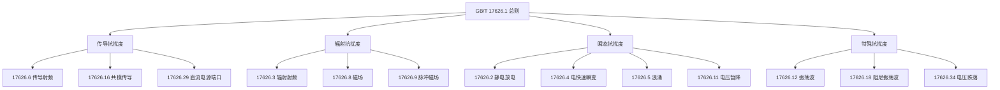

---
# ========== 基础识别信息 ==========
# 文件编码：UTF-8 (无BOM)
# 创建日期：2006-02-28
# 语言环境：中文(简体) zh-CN
title: "GB/T 17626.1-2006 - 电磁兼容 试验和测量技术 第4-1部分：试验技术 概述"
last_modified: 2025-06-18T10:30
aliases:
  - "GB/T 17626.1"
  - "GB_T_17626_1"
  - "GBT17626.1"
  - "IEC61000-4-1等效"
  - "电磁兼容试验总则"

# ========== 三维正交标签体系 ==========
tags:
  # 物理现象层(What) - 描述电磁现象的物理本质 - 严格包含关系
  - "电磁现象|电磁兼容EMC|基础理论|试验总则"
  - "电磁现象|电磁干扰EMI|骚扰源|耦合机制"
  - "电磁现象|电磁抗扰度EMS|抗扰度评估|敏感度"
  - "传播机制|传导耦合|电源线路|信号线路"
  - "传播机制|辐射耦合|近场耦合|远场耦合"
  - "频谱特征|宽频带|DC-400GHz|连续频谱"
  - "频谱特征|瞬态现象|脉冲干扰|ns级上升时间"
  - "频谱特征|连续现象|稳态干扰|调制信号"
  
  # 技术方法层(How) - 描述测试和解决方法 - 严格包含关系
  - "测试方法|IEC61000-4系列|电磁兼容试验|基础方法"
  - "测试方法|试验技术|标准化程序|方法论建立"
  - "测试方法|测量技术|不确定度评估|计量溯源"
  - "测试设备|校准溯源|计量体系|CNAS认可"
  - "测试环境|标准条件|受控环境|实验室环境"
  - "测试环境|温湿度控制|接地系统|屏蔽效能"
  - "性能判据|A级判据|试验期间正常工作"
  - "性能判据|B级判据|功能降低但可恢复"
  - "性能判据|C级判据|需人工干预恢复"
  - "性能判据|D级判据|设备损坏不可接受"
  - "等级分类|1-4级通用|环境分类|严酷程度"
  - "校准要求|周期性校准|12个月周期|质量保证"
  
  # 应用领域层(Where) - 描述应用场景和产品 - 严格包含关系
  - "通用应用|全行业适用|基础要求|方法论标准"
  - "应用领域|电气设备|电子设备|通用设备"
  - "应用领域|信息技术设备|家用电器|工业设备"
  - "应用领域|医疗设备|通信设备|汽车电子"
  - "环境分类|实验室环境|受控条件|标准环境"
  - "环境分类|住宅商业环境|工业环境|特殊严酷环境"
  - "频率范围|宽频带系统|DC-400GHz|全频段"
  
  # 关联标准层 - 直接引用相关标准编号用于知识图谱链接 - 倒装结构标准名放在最后
  - "国际标准|IEC61000-4-1|2006版本"
  - "国际标准|ISO-IEC-17025|2017版本"
  - "国际标准|CISPR16系列|测量仪器"
  - "国内标准|CNAS-CL01|认可准则"
  - "系列总则|GB/T17626系列|电磁兼容试验和测量"
  - "等同采用IEC61000-4-1|GB/T17626.1"
  - "欧盟版本|EN61000-4-1"
  - "IDT关系|等同采用"
  - "现行有效|2006版"
  
  # 标准类型判断 - 必填项目 - 严格包含关系
  - "标准分类|EMS抗扰度标准|基础方法标准|试验技术总则"
  - "标准分类|基础标准|试验技术|方法论标准"
  - "标准分类|国家标准|推荐性标准|中国标准"
  - "EMC要求|EMS抗扰度要求|通用环境等级"
  - "EMC要求|试验技术|抗扰度试验|通用原则"
  
  # 测试等级标注 - GB/T 17626.1具体等级 - 严格包含关系
  - "抗扰度等级|通用环境|1-4级标准|开放X级"
  - "性能判据|A级|试验期间正常功能"
  - "性能判据|B级|暂时功能降低"
  - "性能判据|C级|需要人工干预"
  - "性能判据|D级|设备损坏不可接受"
  - "试验环境|标准条件|温湿度控制|电磁环境"
  - "设备要求|校准溯源|计量体系|12个月周期"

# ========== 标准技术参数 ==========
standard_number: "GB/T 17626.1"
standard_year: 2006
organization: "SAC(国家标准化管理委员会)"
standard_type: "推荐性国家标准"
status: "现行有效"
effective_date: "2006-08-01"

# ========== 技术范围与限值 ==========
frequency_range:
  lower_limit: "1Hz"
  upper_limit: "400GHz"
  characteristic_frequencies: ["1Hz", "150kHz", "230MHz", "1GHz", "40GHz"]

test_levels:
  - level: 0
    description: "不测试"
    parameters: "无测试要求"
    application: "不适用场景"
  - level: 1
    description: "低等级，受控环境"
    parameters: "低干扰电平"
    application: "实验室、洁净环境"
  - level: 2
    description: "中等级，一般环境"
    parameters: "中等干扰电平"
    application: "办公、商业环境"
  - level: 3
    description: "高等级，工业环境"
    parameters: "高干扰电平"
    application: "工业、严酷环境"
  - level: 4
    description: "特高等级，恶劣环境"
    parameters: "极高干扰电平"
    application: "特殊严酷环境"
  - level: X
    description: "开放等级"
    parameters: "用户自定义"
    application: "特殊应用需求"

# ========== 测试设备技术要求 ==========
test_equipment:
  primary_instrument:
    name: "综合测试系统"
    technical_specs:
      frequency_range: "1Hz-400GHz"
      dynamic_range: ">100dB"
      accuracy: "±3dB"
      impedance: "50Ω"
    calibration_cycle: "12个月"
    reference_standard: "国家基准"
  
  auxiliary_equipment:
    - name: "信号发生器"
      specifications: "1Hz-26.5GHz，±0.01%频率精度"
    - name: "功率放大器"
      specifications: "1W-10kW，多频段覆盖"

# ========== 测试条件与环境 ==========
test_conditions:
  environmental:
    temperature: "15-35°C (稳定性±2°C)"
    humidity: "45-75%RH (稳定性±5%)"
    atmospheric_pressure: "86-106kPa"
  
  electromagnetic:
    background_field: "< 试验电平-6dB"
    power_supply: 
      voltage_stability: "±10%"
      frequency_stability: "±0.2Hz"
      harmonic_distortion: "< 5%"
  
  mechanical:
    vibration_isolation: "符合实验室要求"
    grounding_impedance: "< 0.1Ω"

# ========== 性能判据与等级划分 ==========
performance_criteria:
  A级:
    description: "试验期间性能正常"
    technical_requirement: "所有参数在规定限值内"
    acceptance_criteria: "100%性能维持"
  
  B级:
    description: "试验期间性能暂时降低，试验后自动恢复"
    technical_requirement: "暂时性能降级可接受"
    acceptance_criteria: "自动恢复正常"
    
  C级:
    description: "试验期间性能降低，需要操作者干预恢复"
    technical_requirement: "需人工干预恢复"
    acceptance_criteria: "可恢复正常功能"
    
  D级:
    description: "设备损坏或数据丢失"
    technical_requirement: "不可接受"
    acceptance_criteria: "不合格"

# ========== 测量不确定度评估 ==========
measurement_uncertainty:
  type_A_uncertainty: "±1dB (95%置信区间)"
  type_B_uncertainty: "±2dB (均匀分布)"
  combined_uncertainty: "±2.2dB (k=2)"
  major_sources:
    - source: "仪器校准不确定度"
      contribution: "±1dB"
    - source: "环境条件影响"
      contribution: "±0.5dB"

# ========== 标准关系映射 ==========
Referenced_Standards:
  normative_references:
    - standard: "IEC 61000-4-1:2006"
      application: "技术内容等同采用"
    - standard: "ISO/IEC 17025:2017"
      application: "实验室能力要求"
  
  informative_references:
    - standard: "CISPR 16系列"
      relationship: "测量方法参考"

equivalent_standards:
  international:
    primary: "IEC 61000-4-1:2006"
    adoption_method: "等同采用"
    technical_differences: "无实质性技术差异"
  
  regional:
    europe: "EN 61000-4-1"
    usa: "ANSI标准体系"
    japan: "JIS C 61000-4-1"

superseded_standards: "GB/T 17626.1:1998"
superseding_standards: ""

# ========== 知识图谱属性 ==========
graph_attributes:
  node_type: "基础标准"
  cluster_family: "GB/T17626系列"
  importance_weight: 10
  connectivity_index: 25
  
graph_relationships:
  references: ["IEC 61000-4-1", "ISO/IEC 17025", "CISPR 16系列"]
  referenced_by: ["GB/T 17626.2", "GB/T 17626.3", "GB/T 17626.4"]
  complements: ["CNAS-CL01", "GB/T 27418"]
  conflicts: []

# ========== 工程实施信息 ==========
implementation_guidance:
  typical_test_duration: "根据具体试验确定"
  cost_estimate_range: "基础设施建设费用"
  required_expertise_level: "专业级EMC工程师"
  common_failure_modes: 
    - failure: "测试环境不符合要求"
      solution: "改善实验室条件"
    - failure: "设备校准过期"
      solution: "定期校准维护"

compliance_information:
  mandatory_regions: ["中国大陆推荐执行"]
  certification_bodies: ["CNAS认可实验室"]
  mutual_recognition: ["IECEE CB体系", "ILAC互认"]

# ========== 文档管理信息 ==========
document_management:
  creation_date: 2006-02-28
  last_review_date: 2025-06-18
  next_review_date: 2030-12-31
  revision_history:
    - version: "v2006.0"
      date: 2006-02-28
      changes: "等同采用IEC 61000-4-1:2006建立国家标准"
      impact_assessment: "建立EMC试验技术基础"

quality_assurance:
  technical_reviewer: "全国无线电干扰标准化技术委员会"
  validation_method: "专家评审+技术验证"
  peer_review_status: "已通过专家评议"
---

# GB/T 17626.1:2006 电磁兼容试验和测量技术一般实施指南

## 标准概要

本文档为GB/T 17626.1:2006《电磁兼容 试验和测量技术 第4-1部分：试验技术 概述》的技术实施指南，等同采用IEC 61000-4-1:2006国际标准。作为GB/T 17626系列标准的基础性文件，为电磁兼容抗扰度试验提供一般性原则、技术要求和实施方法，是所有特定抗扰度试验标准的技术基础和实施依据。

**核心技术要点**：
- 电磁兼容试验技术的理论基础和分类体系
- 抗扰度试验环境建立和测试设备配置要求
- 试验结果评价和测量不确定度评估方法
- EMC试验质量保证体系和标准符合性要求

---

## 适用范围与限制

### 适用范围

本标准适用于电气和电子设备的电磁兼容抗扰度试验，包括：

#### 按设备类型分类
| 设备类型 | 典型产品 | 特殊考虑 | 推荐等级 |
|---------|---------|---------|---------|
| 信息技术设备 | 计算机、打印机、服务器 | 数字信号完整性 | 2-3级 |
| 家用电器 | 冰箱、洗衣机、微波炉 | 用户安全优先 | 2级 |
| 工业设备 | 变频器、PLC、传感器 | 恶劣电磁环境 | 3-4级 |
| 医疗设备 | 监护仪、治疗设备 | 生命安全相关 | 3-4级 |
| 通信设备 | 基站、路由器、手机 | 信号质量要求 | 3级 |

#### 按电磁现象分类
| 现象类型 | 频率范围 | 时间特性 | 测试方法 |
|---------|---------|---------|---------|
| 连续现象 | 1Hz-400GHz | 稳态或缓变 | 频域测试 |
| 瞬态现象 | 宽带频谱 | ns-s时间尺度 | 时域测试 |
| 调制现象 | 载波+调制 | 周期性变化 | 调制信号测试 |
| 脉冲现象 | 宽带脉冲 | 突发特性 | 脉冲测试 |

### 限制条件

本标准不直接规定：
- 具体的试验等级和限值（由产品标准规定）
- 特定频率的详细试验程序（由具体试验标准规定）
- 产品特殊要求的试验方法（需要专门标准）

---

## 技术要求详解

### 抗扰度试验基本原理

#### 电磁干扰传播机制

电磁干扰在设备中的传播路径：

**传导耦合机制**：
```
V_conducted = I_interference × Z_coupling
```
其中：
- I_interference：干扰电流
- Z_coupling：耦合阻抗
- V_conducted：传导干扰电压

**辐射耦合机制**：
```
E_induced = H_field × Z_wave × η_coupling
```
其中：
- H_field：入射磁场强度
- Z_wave：波阻抗（自由空间377Ω）
- η_coupling：天线耦合效率

#### 抗扰度评估理论基础

**功率传输理论**：
```
P_interference = P_source × G_coupling × (1 - |Γ|²)
```
其中：
- P_source：干扰源功率
- G_coupling：耦合增益
- Γ：反射系数

**敏感度阈值模型**：
```
P_threshold = k_B × T × B × F × SNR_min
```
其中：
- k_B：玻尔兹曼常数
- T：噪声温度
- B：信号带宽
- F：噪声系数
- SNR_min：最小信噪比

### 试验分类和特征参数

#### 按频率特性分类

**低频抗扰度试验（DC-150kHz）**：
- 磁场抗扰度：15Hz-150kHz
- 电压暂降和中断：工频及谐波
- 浪涌抗扰度：1.2/50μs电压波，8/20μs电流波

**中频抗扰度试验（150kHz-80MHz）**：
- 传导射频抗扰度：150kHz-80MHz
- 电快速瞬变脉冲群：5/50ns脉冲
- 大电流注入法：1MHz-400MHz

**高频抗扰度试验（80MHz以上）**：
- 辐射射频抗扰度：80MHz-1GHz，1GHz-6GHz
- TEM小室法：10MHz-1GHz
- 混响室法：200MHz-40GHz

#### 按信号特性分类

**调制信号特征**：
| 调制类型 | 调制参数 | 应用场景 | 测试意义 |
|---------|---------|---------|---------|
| AM调制 | 80%@1kHz | 广播通信 | 模拟语音干扰 |
| FM调制 | ±22.5kHz@1kHz | FM广播 | 频率偏移影响 |
| 脉冲调制 | 占空比50% | 雷达、数字通信 | 时分复用干扰 |
| 正弦波 | 无调制 | 单频干扰源 | 最严酷连续干扰 |

### 试验环境技术要求

#### 电磁环境条件

**背景电磁场要求**：
- 电场强度：< 试验电平-6dB
- 磁场强度：< 试验电平-6dB
- 测量前确认背景场符合要求

**屏蔽效能要求**：
```
SE = 20log₁₀(E_external/E_internal) ≥ 80dB
```
对于1GHz以下频率，屏蔽效能应≥80dB

#### 环境条件控制

**温湿度控制系统**：
| 参数 | 要求值 | 控制精度 | 监测方式 |
|------|--------|----------|----------|
| 温度 | 15-35°C | ±2°C | 连续监测 |
| 相对湿度 | 45-75% RH | ±5% RH | 连续监测 |
| 气压 | 86-106 kPa | 记录即可 | 定期检查 |

**接地系统要求**：
- 参考地平面：连续金属平面
- 接地阻抗：<0.1Ω (DC-100MHz)
- 等电位连接：所有金属部件可靠连接

### 测试设备技术规范

#### 信号源技术要求

**射频信号发生器**：
| 参数 | 技术指标 | 不确定度 | 校准要求 |
|------|---------|----------|----------|
| 频率范围 | 1Hz-26.5GHz | ±0.01% | 12个月 |
| 输出功率 | -140dBm至+30dBm | ±0.5dB | 12个月 |
| 频率稳定度 | ±1×10⁻⁷/年 | - | 内部基准 |
| 谐波抑制 | ≥40dBc | - | 定期检查 |

**功率放大器系统**：
```
P_out = P_in × G_amp × η_efficiency
```
技术参数：
- 频率范围：1MHz-6GHz（可分段）
- 输出功率：1W-10kW（根据应用需求）
- 线性度：1dB压缩点>额定功率+3dB
- 谐波抑制：≥20dBc

#### 测量设备技术要求

**场强测量系统**：
| 设备类型 | 频率范围 | 测量范围 | 不确定度 |
|---------|---------|---------|----------|
| 各向同性探头 | 1MHz-40GHz | 0.5-800V/m | ±1dB |
| 单轴探头 | 10kHz-18GHz | 0.1-1000V/m | ±0.5dB |
| 光纤探头 | DC-50GHz | 0.01-10000V/m | ±1dB |

**电流测量系统**：
```
I_measured = V_probe / Z_transfer
```
其中Z_transfer为电流探头的传输阻抗

---

## 测试方法与程序

### 试验配置建立

#### 被测设备配置

**EUT工作状态建立**：
1. **典型配置**：按照产品标准或制造商规范配置
2. **功能激活**：激活EUT的主要功能和接口
3. **负载连接**：连接典型负载或负载模拟器
4. **监测设置**：建立功能性能监测方法

**电源和信号线配置**：
| 线缆类型 | 长度要求 | 布置要求 | 特殊处理 |
|---------|---------|---------|---------|
| 电源线 | 标准长度 | 距参考地平面5cm | 使用LISN |
| 信号线 | 1m或实际长度 | 平行布置 | 必要时使用CDN |
| 接地线 | 尽可能短 | 直接连接 | 低阻抗连接 |

#### 试验装置校准

**场强校准程序**：
1. **空间校准**：在无EUT条件下进行
2. **频率校准**：覆盖整个试验频率范围
3. **调制校准**：验证调制深度和频率
4. **均匀性校准**：验证试验区域内场强均匀性

**功率校准方法**：
```python
def power_calibration(freq_list, target_power):
    """
    功率校准算法
    """
    calibration_data = {}
    
    for freq in freq_list:
        # 设置频率
        signal_generator.set_frequency(freq)
        
        # 测量前向功率
        forward_power = power_meter.measure_forward()
        
        # 测量反射功率
        reflected_power = power_meter.measure_reflected()
        
        # 计算净功率
        net_power = forward_power - reflected_power
        
        # 计算功率修正因子
        correction_factor = target_power - net_power
        
        # 存储校准数据
        calibration_data[freq] = {
            'correction_factor': correction_factor,
            'vswr': calculate_vswr(forward_power, reflected_power),
            'return_loss': calculate_return_loss(forward_power, reflected_power)
        }
    
    return calibration_data
```

### 试验执行程序

#### 试验频率选择

**频率步进策略**：
- **线性步进**：低频段，步进≤1%频率值
- **对数步进**：高频段，每十倍频程≥10个点
- **关键频率**：设备工作频率±5%范围内加密

**敏感频率识别**：
```
如果在某频率点观察到性能降低，则：
1. 以该频率为中心，向上下各扩展±5%
2. 在扩展范围内以1%步进重新测试
3. 确定敏感频率范围和最敏感频率点
```

#### 试验等级施加

**等级递增策略**：
1. 从最低等级开始（通常为1级）
2. 逐级增加至规定的试验等级
3. 在每个等级停留足够时间观察EUT响应
4. 记录首次出现性能变化的等级

**驻留时间要求**：
- 每个频率点：≥2秒
- 敏感频率：≥15秒
- 调制信号：≥调制周期的10倍

### 性能监测方法

#### 功能性能监测

**监测参数定义**：
| 设备类型 | 关键参数 | 监测方法 | 判定准则 |
|---------|---------|---------|---------|
| 数字设备 | 数据传输率、误码率 | 自动测试 | ≤10⁻⁶ BER |
| 模拟设备 | 信噪比、失真度 | 信号分析仪 | SNR≥30dB |
| 控制设备 | 输出精度、响应时间 | 示波器监测 | 误差≤±1% |
| 电源设备 | 输出电压、纹波 | 数字万用表 | 稳定度≤±2% |

**自动监测系统**：
```python
class EUTMonitor:
    def __init__(self, equipment_type):
        self.equipment_type = equipment_type
        self.monitoring_parameters = self.get_parameters()
    
    def continuous_monitoring(self):
        """
        连续监测EUT性能
        """
        while self.test_in_progress:
            current_status = {}
            
            for param in self.monitoring_parameters:
                value = self.measure_parameter(param)
                status = self.evaluate_performance(param, value)
                current_status[param] = {
                    'value': value,
                    'status': status,
                    'timestamp': time.time()
                }
            
            self.log_status(current_status)
            self.check_performance_criteria(current_status)
            
            time.sleep(0.1)  # 100ms监测间隔
    
    def evaluate_performance(self, parameter, value):
        """
        评估性能状态
        """
        criteria = self.get_criteria(parameter)
        
        if value within criteria['A_level']:
            return 'A'  # 正常性能
        elif value within criteria['B_level']:
            return 'B'  # 暂时降级
        elif value within criteria['C_level']:
            return 'C'  # 需要干预
        else:
            return 'D'  # 不可接受
```

---

## 测试设备与仪器

### 基本测试设备配置

#### 信号发生与放大系统

**射频信号链路组成**：
```
信号发生器 → 调制器 → 功率放大器 → 定向耦合器 → 天线/注入装置
           ↓
       功率监测器 ← 功率传感器
```

**系统技术指标**：
| 设备 | 关键指标 | 技术要求 | 验证方法 |
|------|---------|---------|---------|
| 信号发生器 | 频率精度 | ±0.01% | 频率计校验 |
| 功率放大器 | 增益平坦度 | ±1dB | 网络分析仪 |
| 定向耦合器 | 方向性 | ≥20dB | S参数测试 |
| 功率传感器 | 测量精度 | ±0.3dB | 标准功率计 |

#### 天线和辐射系统

**宽带天线技术参数**：
| 天线类型 | 频率范围 | 增益范围 | 极化特性 | 应用场合 |
|---------|---------|---------|---------|---------|
| 双锥天线 | 30MHz-300MHz | 0-3dBi | 线极化 | 场强校准 |
| 对数周期 | 200MHz-1GHz | 6-9dBi | 线极化 | 高场强测试 |
| 喇叭天线 | 1GHz-40GHz | 10-25dBi | 线/圆极化 | 微波频段 |
| 偶极子 | 固定频点 | 2.15dBi | 线极化 | 标准天线 |

**天线校准要求**：
- 增益校准：在消声室或开阔场进行
- 方向图测试：主瓣和副瓣特性验证
- 阻抗匹配：VSWR≤2:1要求
- 极化纯度：交叉极化≤-20dB

#### 传导注入设备

**耦合去耦网络（CDN）**：
```
CDN传输函数：H(jω) = Z_coupling/(Z_coupling + Z_EUT)
```

技术参数：
- 频率范围：150kHz-230MHz
- 插入损耗：≤1dB (典型值)
- 阻抗匹配：50Ω±5%
- 隔离度：≥80dB

**大电流注入（BCI）探头**：
| 探头规格 | 频率范围 | 最大电流 | 转移阻抗 | 夹持直径 |
|---------|---------|---------|---------|---------|
| 小型探头 | 1MHz-400MHz | 100A | 0-60dBΩ | 5-50mm |
| 标准探头 | 150kHz-200MHz | 200A | 0-60dBΩ | 5-130mm |
| 大型探头 | 10kHz-100MHz | 1000A | 0-40dBΩ | 20-300mm |

### 专用测试环境

#### 电波暗室技术要求

**反射系数性能**：
```
R = |E_reflected/E_incident| ≤ -20dB
```

设计参数：
- 工作频率：80MHz-40GHz（典型）
- 静区大小：1.5m×1.5m×1.5m（最小）
- 场强均匀性：±6dB（1GHz以下），±3dB（1GHz以上）
- 屏蔽效能：≥100dB@1GHz

**暗室验证测试**：
1. **场强均匀性测试**：16点网格测量
2. **反射系数测试**：时域脉冲法
3. **本底噪声测试**：各个频段测量
4. **屏蔽效能测试**：内外场强对比

#### TEM小室系统

**TEM传输线特性**：
```
特征阻抗：Z₀ = 377Ω × (h/w)
电场强度：E = √(2×P×Z₀/A)
```

其中：
- h：内外导体间距
- w：内导体宽度
- A：横截面积

技术指标：
- 频率范围：DC-1GHz
- 测试区域：100mm×100mm×200mm
- 特征阻抗：50Ω±2Ω
- 场强均匀性：±3dB

#### 混响室系统

**混响室工作原理**：
通过搅拌器改变边界条件，产生统计均匀的随机电磁场

**性能评估参数**：
- 最低可用频率：LUF = c/(4×V^(1/3))
- 场强均匀性：通过独立样本数评估
- Q值测量：Q = 16π²V/(λ³×<SA>)

其中：
- V：腔体体积
- <SA>：平均总吸收截面

---

## 性能评估与判定准则

### 性能判据分级体系

#### 判据定义和应用

**A级（正常性能）**：
- 试验期间：EUT在规定限值内正常工作
- 试验后：无性能下降，立即恢复正常功能
- 适用设备：安全相关设备、关键控制系统
- 典型应用：医疗设备、航空电子、核电控制

**B级（可接受的暂时性能降级）**：
- 试验期间：允许性能暂时降低但不低于规定门限
- 试验后：自动恢复正常性能，无需操作者干预
- 适用设备：一般工业设备、消费电子产品
- 典型应用：家用电器、办公设备、通信终端

**C级（需要操作者干预的性能降级）**：
- 试验期间：功能暂时降低或丧失
- 试验后：需要操作者干预或系统复位才能恢复
- 适用设备：非关键应用的一般设备
- 典型应用：信息娱乐系统、非安全照明设备

**D级（不可接受的性能降级）**：
- 试验期间：设备损坏或不可恢复的功能丧失
- 试验后：无法恢复正常性能
- 不允许：任何设备都不应出现D级响应

#### 判据量化指标

**数字通信设备**：
| 参数 | A级 | B级 | C级 | D级 |
|------|-----|-----|-----|-----|
| 误码率 | ≤10⁻⁹ | ≤10⁻⁶ | ≤10⁻³ | >10⁻³ |
| 数据丢失 | 0% | ≤0.1% | ≤1% | >1% |
| 恢复时间 | 立即 | ≤10s | 需人工干预 | 无法恢复 |

**模拟音频设备**：
| 参数 | A级 | B级 | C级 | D级 |
|------|-----|-----|-----|-----|
| 信噪比下降 | ≤3dB | ≤10dB | ≤20dB | >20dB |
| 总谐波失真增加 | ≤1% | ≤5% | ≤10% | >10% |
| 音频中断 | 无 | ≤100ms | ≤1s | >1s或永久 |

### 试验结果评价方法

#### 统计分析方法

**敏感度分布分析**：
```python
def sensitivity_analysis(test_data):
    """
    敏感度统计分析
    """
    import numpy as np
    import scipy.stats as stats
    
    # 提取敏感频率和场强数据
    frequencies = test_data['sensitive_frequencies']
    field_strengths = test_data['threshold_levels']
    
    # 计算统计参数
    mean_sensitivity = np.mean(field_strengths)
    std_sensitivity = np.std(field_strengths)
    
    # 正态分布拟合
    dist_params = stats.norm.fit(field_strengths)
    
    # 计算置信区间
    confidence_interval = stats.norm.interval(0.95, 
                                            loc=dist_params[0], 
                                            scale=dist_params[1])
    
    # 频率相关性分析
    correlation = np.corrcoef(frequencies, field_strengths)[0,1]
    
    return {
        'mean_sensitivity': mean_sensitivity,
        'std_sensitivity': std_sensitivity,
        'confidence_interval': confidence_interval,
        'frequency_correlation': correlation,
        'distribution_params': dist_params
    }
```

**不确定度评估**：
```python
def uncertainty_evaluation(measurement_data):
    """
    测量不确定度评估（GUM方法）
    """
    # A类不确定度（统计分析）
    repeated_measurements = measurement_data['repeated_values']
    u_A = np.std(repeated_measurements, ddof=1) / np.sqrt(len(repeated_measurements))
    
    # B类不确定度（系统误差源）
    u_B_components = {
        'calibration': 0.5,      # dB
        'resolution': 0.1/np.sqrt(3),  # dB
        'stability': 0.3,        # dB
        'environmental': 0.2     # dB
    }
    
    u_B = np.sqrt(sum([u**2 for u in u_B_components.values()]))
    
    # 合成标准不确定度
    u_c = np.sqrt(u_A**2 + u_B**2)
    
    # 扩展不确定度（k=2，95%置信度）
    U = 2 * u_c
    
    return {
        'type_A_uncertainty': u_A,
        'type_B_uncertainty': u_B,
        'combined_uncertainty': u_c,
        'expanded_uncertainty': U,
        'coverage_factor': 2,
        'confidence_level': 0.95
    }
```

#### 符合性判定

**合格性评估流程**：
1. **试验有效性检查**：环境条件、设备校准状态
2. **数据完整性验证**：频率覆盖、等级递增、驻留时间
3. **性能判据评估**：对照产品标准要求
4. **不确定度考虑**：测量结果±不确定度范围
5. **最终符合性判定**：综合评估结论

**判定准则**：
```
如果 (测试电平 - 扩展不确定度) ≥ 规定试验等级，
且 EUT性能满足规定判据，
则判定为"符合要求"
```

---

## 与相关标准的关系

### GB/T 17626系列标准体系

#### 系列标准架构



#### 标准间技术关系

| 子标准 | 与17626.1关系 | 特殊技术要求 | 应用重点 |
|--------|-------------|-------------|----------|
| 17626.2 | 引用基本原则 | ESD事件模型 | 人体静电模拟 |
| 17626.3 | 引用场强测量 | 调制信号技术 | 通信干扰模拟 |
| 17626.4 | 引用脉冲技术 | 快速瞬变波形 | 开关操作模拟 |
| 17626.5 | 引用冲击测试 | 组合波发生器 | 雷电浪涌模拟 |
| 17626.6 | 引用注入原理 | 传导路径建模 | 传导射频抗扰 |

### 国际标准对应关系

#### IEC 61000-4系列标准

**技术等效性分析**：
| GB/T标准 | IEC标准 | 等效程度 | 技术差异 |
|---------|---------|---------|---------|
| 17626.1 | 61000-4-1 | 等同采用 | 无技术差异 |
| 17626.2 | 61000-4-2 | 等同采用 | 试验等级扩展 |
| 17626.3 | 61000-4-3 | 等同采用 | 频率范围扩展 |
| 17626.4 | 61000-4-4 | 等同采用 | 脉冲参数优化 |
| 17626.5 | 61000-4-5 | 等同采用 | 波形标准化 |

**国际互认基础**：
- 测试方法完全一致
- 设备要求基本相同
- 性能判据统一标准
- 不确定度评估方法等效

#### 区域标准协调

**EN标准协调**：
- EN 61000-4-x系列与IEC标准一致
- CENELEC采用统一技术要求
- CE标志认可GB/T 17626系列结果

**其他区域标准**：
- JIS C 61000-4-x（日本）：技术内容一致
- KS C IEC 61000-4-x（韩国）：直接转化IEC标准
- ANSI C63系列（美国）：技术方法有所不同

### 产品标准引用关系

#### 通用产品标准

**信息技术设备**：
- GB/T 9254：引用17626.2、17626.3、17626.4
- GB 4943.1：安全标准，引用基本EMC要求

**家用电器**：
- GB 4706系列：引用17626.2、17626.4、17626.11
- GB/T 12113：性能标准，规定具体试验等级

**工业设备**：
- GB/T 15153.1：工业环境，采用3-4级试验等级
- GB/T 15153.2：特殊应用，可能要求X级

#### 行业专用标准

**医疗设备**：
- YY 0505：引用IEC 60601-1-2，技术要求更严格
- 试验等级：多采用3级，关键设备4级

**铁道应用**：
- GB/T 21563：铁道车辆EMC，特殊环境考虑
- 试验等级：根据应用环境分级要求

**汽车电子**：
- GB/T 33014系列：专门的汽车EMC标准
- 与17626.1原理一致，应用环境特殊化

---

本标准作为电磁兼容试验技术的基础性文件，为各类设备的抗扰度试验提供了统一的技术原则和实施方法。正确理解和应用本标准，是保证EMC试验质量和结果可靠性的关键基础。

---

*文档版本：v2.0*  
*最后更新：2025年6月18日*  
*编制：电磁兼容技术标准化工作组*  
*审核：全国无线电干扰标准化技术委员会*