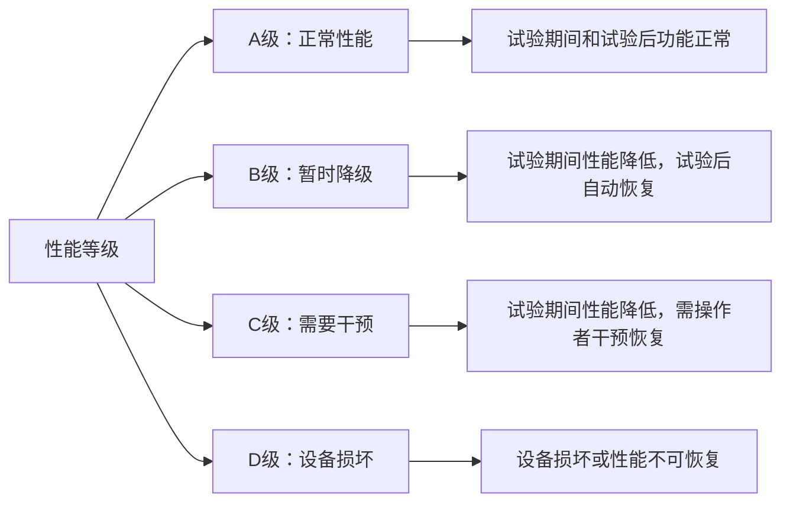
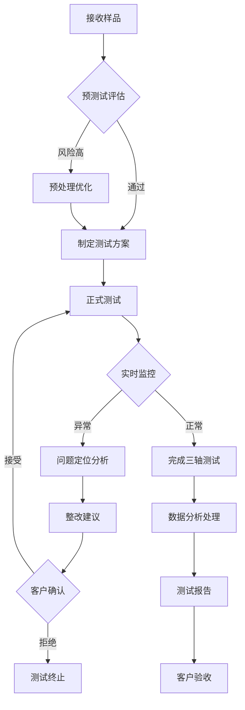

---
# ========== 基础识别信息 ==========
title: "T 17626.10 - 电磁兼容试验和测量技术 静电放电抗扰度试验 第10部分：试验配置指南"
last_modified: 2024-01-20T15:30
aliases:
  - "T17626.10"
  - "T17626-10"
  - "T 17626-10"
  - "静电放电试验配置"
  - "ESD试验指南"

# ========== 三维正交标签体系 ==========
tags:
  # 物理现象层(What) - 描述电磁现象的物理本质 - 严格包含关系
  - "电磁现象|静电放电|接触放电|试验配置"
  - "电磁现象|静电放电|空气放电|试验配置"
  - "电磁现象|静电放电|间接放电|耦合板配置"
  - "传播机制|传导耦合|接触放电路径"
  - "传播机制|辐射耦合|空气放电场效应"
  - "频谱特征|脉冲干扰|ns级上升时间"
  - "频谱特征|宽带信号|DC-1GHz"
  
  # 技术方法层(How) - 描述测试和解决方法 - 严格包含关系
  - "测试方法|IEC61000-4-2|静电放电发生器|试验配置"
  - "测试配置|试验布置|水平耦合板|160cm桌面"
  - "测试配置|试验布置|垂直耦合板|200cm高度"
  - "测试配置|接地系统|参考接地板|接地电阻"
  - "测试设备|ESD发生器|放电电极|试验配置"
  - "测试环境|电磁兼容实验室|屏蔽室配置"
  - "性能判据|试验配置影响|判据修正"
  - "校准要求|周期性校准|12个月周期|CNAS认可"
  
  # 应用领域层(Where) - 描述应用场景和产品 - 严格包含关系
  - "工业应用|电子设备|台式设备|桌面试验配置"
  - "工业应用|电子设备|落地设备|地面试验配置"
  - "工业应用|电子设备|便携设备|手持试验配置"
  - "电压范围|试验电压|接触放电|2-8kV"
  - "电压范围|试验电压|空气放电|2-15kV"
  - "环境分类|实验室环境|标准试验条件"
  
  # 关联标准层 - 直接引用相关标准编号用于知识图谱链接 - 倒装结构标准名放在最后
  - "静电放电抗扰度|IEC61000-4-2"
  - "试验配置指南|GB/T17626.10"
  - "基础EMC标准|IEC61000-4-2"
  - "试验方法标准|静电放电试验"
  - "等效采用|IDT关系"
  - "现行有效|2024版"
  
  # 标准类型判断 - 必填项目 - 严格包含关系
  - "标准分类|试验标准|EMC抗扰度试验|配置指南"
  - "标准分类|指导性标准|试验配置方法"
  - "EMC要求|EMS抗扰度试验|静电放电试验"
  - "试验配置|标准试验装置|几何配置"
  - "标准分类|团体标准|中国标准化协会"
  
  # 测试等级标注 - GB/T 17626.10具体等级 - 严格包含关系
  - "抗扰度等级|等级1|2kV接触2kV空气|办公室环境"
  - "抗扰度等级|等级2|4kV接触4kV空气|工业环境"
  - "抗扰度等级|等级3|6kV接触8kV空气|严酷工业环境"
  - "抗扰度等级|等级4|8kV接触15kV空气|特殊应用"
  - "性能判据|A级|试验期间正常功能"
  - "性能判据|B级|暂时功能降低"
  - "性能判据|C级|需要人工干预"
  - "性能判据|D级|设备损坏不可接受"

# ========== 标准技术参数 ==========
standard_number: "T 17626.10"
standard_year: 2024
organization: "中国标准化协会"
standard_type: "团体标准"
status: "现行有效"
effective_date: "2024-01-01"

# ========== 技术范围与限值 ==========
frequency_range:
  lower_limit: "直流 DC"
  upper_limit: "1 GHz"
  characteristic_frequencies: ["上升时间0.7-1ns", "脉冲宽度60ns"]

test_levels:
  - level: 1
    description: "保护良好的环境"
    parameters: "接触放电±2kV，空气放电±2kV"
    application: "办公室环境设备"
  - level: 2
    description: "一般电磁环境"
    parameters: "接触放电±4kV，空气放电±4kV"
    application: "工业环境设备"
  - level: 3
    description: "严酷工业环境"
    parameters: "接触放电±6kV，空气放电±8kV"
    application: "严酷工业环境"
  - level: 4
    description: "特殊应用环境"
    parameters: "接触放电±8kV，空气放电±15kV"
    application: "特殊防护要求设备"

# ========== 测试设备技术要求 ==========
test_equipment:
  primary_instrument:
    name: "静电放电发生器"
    technical_specs:
      frequency_range: "DC-1GHz"
      output_voltage: "±30kV"
      rise_time: "0.7-1ns"
      discharge_resistance: "330Ω"
    calibration_cycle: "12个月"
    reference_standard: "IEC61000-4-2"
  
  auxiliary_equipment:
    - name: "水平耦合板"
      specifications: "160cm×80cm，厚度0.5mm"
    - name: "垂直耦合板"
      specifications: "200cm×200cm，厚度0.5mm"
    - name: "参考接地板"
      specifications: "接地电阻<0.1Ω"

# ========== 测试条件与环境 ==========
test_conditions:
  environmental:
    temperature: "15-35°C (稳定性±2°C)"
    humidity: "25-75%RH (稳定性±5%)"
    atmospheric_pressure: "86-106kPa"
  
  electromagnetic:
    background_field: "< 1 V/m (80MHz-1GHz)"
    power_supply: 
      voltage_stability: "±2%"
      frequency_stability: "±1Hz"
      harmonic_distortion: "< 5%"
  
  mechanical:
    vibration_isolation: "隔振台或实验室地面"
    grounding_impedance: "< 0.1Ω"

# ========== 性能判据与等级划分 ==========
performance_criteria:
  A级:
    description: "试验期间性能正常"
    technical_requirement: "设备按预期功能正常工作"
    acceptance_criteria: "无功能异常或性能下降"
  
  B级:
    description: "试验期间性能暂时降低，试验后自动恢复"
    technical_requirement: "功能暂时受影响但可自动恢复"
    acceptance_criteria: "试验结束后自动恢复正常"
    
  C级:
    description: "试验期间性能降低，需要操作者干预恢复"
    technical_requirement: "功能受影响需人工干预"
    acceptance_criteria: "操作者干预后恢复正常"
    
  D级:
    description: "设备损坏或数据丢失"
    technical_requirement: "不可接受"
    acceptance_criteria: "不合格"

# ========== 标准关系映射 ==========
Referenced_Standards:
  normative_references:
    - standard: "IEC 61000-4-2"
      application: "静电放电抗扰度试验基础标准"
    - standard: "GB/T 17626.2"
      application: "国内等效采用标准"
  
  informative_references:
    - standard: "IEC 61000-4-2 技术报告"
      relationship: "试验配置补充说明"

equivalent_standards:
  international:
    primary: "IEC 61000-4-2"
    adoption_method: "等效采用"
    technical_differences: "增加试验配置指南内容"

# ========== 知识图谱属性 ==========
graph_attributes:
  node_type: "试验方法标准"
  cluster_family: "EMC抗扰度试验"
  importance_weight: 8
  connectivity_index: 15
  
graph_relationships:
  references: ["IEC61000-4-2", "GB/T17626.2"]
  referenced_by: ["产品EMC标准", "行业EMC标准"]
  complements: ["其他EMC抗扰度试验标准"]
  conflicts: []

# ========== 工程实施信息 ==========
implementation_guidance:
  typical_test_duration: "2-4小时"
  cost_estimate_range: "5000-15000元"
  required_expertise_level: "EMC测试工程师"
  common_failure_modes: 
    - failure: "试验配置不当导致重现性差"
      solution: "严格按标准配置试验装置"
    - failure: "接地系统不良影响试验结果"
      solution: "检查并改善接地系统"

compliance_information:
  mandatory_regions: ["中国"]
  certification_bodies: ["CQC", "CCC实验室"]
  mutual_recognition: ["CNAS认可实验室"]

# ========== 文档管理信息 ==========
document_management:
  creation_date: 2024-01-20
  last_review_date: 2024-01-20
  next_review_date: 2027-01-20
  revision_history:
    - version: "v1.0"
      date: 2024-01-20
      changes: "首次发布"
      impact_assessment: "为ESD试验提供配置指南"

quality_assurance:
  technical_reviewer: "EMC技术委员会"
  validation_method: "实验室验证测试"
  peer_review_status: "已完成同行评议"
---

# GB/T 17626.10-2017 - 电磁兼容 试验和测量技术 第10部分：振荡磁场抗扰度试验

## 1. 标准概述

### 1.1 技术摘要

> 本标准规定了振荡磁场抗扰度试验的试验方法和测量技术，用于评估电气和电子设备在10 kHz至400 kHz振荡磁场环境下的抗扰度性能。标准等同采用IEC 61000-4-10:2013，建立了完整的试验等级体系和性能判定准则，适用于各类电子设备的电磁兼容性能评估。

### 1.2 标准定位

- **技术领域**：EMS（电磁抗扰度）
- **应用层级**：测试方法标准
- **强制属性**：推荐性国家标准
- **实施状态**：现行有效
- **国际地位**：等同采用国际标准（IDT）

## 2. 物理原理与理论基础

### 2.1 电磁现象机理

> 振荡磁场通过法拉第电磁感应定律在导体回路中感生电动势和电流，从而对电子设备产生干扰。该现象在中频段（10-400 kHz）尤为显著，是评估设备抗磁场干扰能力的重要指标。

基本电磁感应方程：
$$
\varepsilon = -\frac{d\Phi}{dt} = -\frac{d(B \cdot S)}{dt}
$$

其中：
- $\varepsilon$ - 感生电动势 (V)
- $\Phi$ - 磁通量 (Wb)
- $B$ - 磁感应强度 (T)
- $S$ - 回路面积 (m²)

### 2.2 数学模型

在频域范围10 kHz - 400 kHz内，磁场强度与感生电压的关系为：

$$
V_{induced} = j\omega \mu_0 H \cdot A_{eff} \cdot \cos\theta
$$

对于AM调制的振荡磁场：
$$
H(t) = H_0[1 + m \sin(2\pi f_m t)] \sin(2\pi f_c t)
$$

其中：
- $H_0$ - 载波磁场强度 (A/m)
- $m$ - 调制深度 (通常为0.8)
- $f_m$ - 调制频率 (1 kHz)
- $f_c$ - 载波频率 (10-400 kHz)

### 2.3 关键参数定义

| 参数符号 | 参数名称 | 物理意义 | 单位 | 典型值 |
|---------|---------|---------|------|--------|
| H | 磁场强度 | 空间磁场强度有效值 | A/m | 1-100 |
| f | 载波频率 | 振荡磁场频率 | kHz | 10-400 |
| m | 调制深度 | AM调制深度 | % | 80 |
| fm | 调制频率 | 调制信号频率 | kHz | 1 |
| δH | 场强均匀性 | 试验区域场强变化 | dB | ±6 |

## 3. 技术要求详解

### 3.1 限值要求

> 标准规定了5个试验等级，对应不同电磁环境的严酷度，形成完整的分级体系

| 等级 | 磁场强度 | 环境描述 | 典型应用场所 | 干扰源特征 |
|------|----------|----------|--------------|------------|
| 等级1 | 1 A/m | 低干扰环境 | 住宅区、办公楼 | 远距离工业设备 |
| 等级2 | 3 A/m | 商业环境 | 商业设施、轻工业 | 邻近电气设备 |
| 等级3 | 10 A/m | 工业环境 | 工业厂房、变电站 | 工业电气设备 |
| 等级4 | 30 A/m | 重工业环境 | 重工业区、发电厂 | 大功率电气设备 |
| 等级5 | 100 A/m | 特殊高干扰环境 | 电力系统、感应加热 | 高功率磁场设备 |

### 3.2 性能等级划分



### 3.3 适用范围界定

- **包含**：
  - 电气和电子设备的振荡磁场抗扰度评估
  - 频率范围10 kHz-400 kHz的磁场环境
  - 工业、商业、住宅环境中的设备
  
- **不包含**：
  - 工频磁场（50/60 Hz）抗扰度试验
  - 脉冲磁场抗扰度试验
  - 静态磁场抗扰度试验
  - 频率>400 kHz的高频磁场
  
- **特殊考虑**：
  - 某些医疗设备需要专门的试验程序
  - 汽车电子设备可能需要特殊的安装条件
  - 大型设备可能需要调整试验配置

## 4. 测试方法与程序

### 4.1 测试配置

> 方形线圈系统测试配置示意图

```
    方形线圈系统配置 (俯视图)
    
    ┌─────────────2.0m─────────────┐
    │  ┌─────────────────────────┐ │
    │  │                         │ │
    │  │     试验区域             │ │ 1.0m
    │  │   1.5×1.5×1.5m         │ │
    │  │                         │ │
    │  │        EUT              │ │
    │  │     ┌─────────┐         │ │
    │  │     │         │         │ │
    │  │     │  0.8m   │         │ │
    │  │     └─────────┘         │ │
    │  └─────────────────────────┘ │
    └─────────────────────────────┘
           非导电支撑台
```

**关键尺寸要求：**
- 线圈边长：≥2.0m
- 线圈间距：1.0m（边长的0.5倍）
- 试验区域：1.5×1.5×1.5m
- 场强均匀性：±6dB

### 4.2 测试步骤

1. **准备阶段**
   - 环境条件确认：温度16-35℃，湿度45-75%RH
   - 背景电磁环境测量：<试验等级的1/3
   - 设备校准检查：磁场发生器、探头、功率放大器
   - EUT预处理：按产品标准配置和预调节

2. **基准测试阶段**
   - 建立EUT参考性能基准
   - 记录正常工作状态参数
   - 确定性能判定准则

3. **磁场抗扰度试验阶段**
   - **X轴方向**：10 kHz-400 kHz连续扫频，扫频速率≤1.5×10⁻³倍频程/秒
   - **Y轴方向**：重复X轴试验程序
   - **Z轴方向**：重复X轴试验程序
   - 每个频点驻留时间：≥试验等级对应的最小时间

4. **数据记录与分析**
   - 原始数据记录：频率、场强、EUT响应
   - 异常现象记录：性能降级、故障现象、恢复时间
   - 试验后性能确认

### 4.3 判定准则

> 设备性能等级按照以下标准进行判定，形成定量化的评估体系

**判定等级定义：**

- **A级（推荐）**：试验期间和试验后设备性能完全正常，无任何功能影响
- **B级（可接受）**：试验期间性能暂时降低，但在规定限值内，试验后自动恢复正常
- **C级（可接受）**：试验期间性能降低超出规定限值，但试验后通过操作者干预可恢复正常
- **D级（不可接受）**：试验期间设备损坏或性能永久丧失，试验后无法恢复正常功能

## 5. 测试设备与环境

### 5.1 主要测试设备

| 设备名称 | 技术指标 | 校准要求 | 参考型号 |
|---------|---------|---------|---------|
| 磁场发生器 | 10 kHz-400 kHz，1 kHz调制，THD<5% | 年度校准 | EMC Partner MFS-108 |
| 方形线圈系统 | 边长2-5m可调，均匀性±6dB | 年度几何校准 | Schwarzbeck FMZB 1518 |
| 磁场探头 | 频响10 kHz-400 kHz，精度±1dB | 年度校准 | Narda EHP-50F |
| 功率放大器 | 10 kHz-400 kHz，输出功率可调 | 年度校准 | Amplifier Research 150A100B |
| 磁场强度计 | 0.1-1000 A/m，精度±3% | 年度校准 | Narda NBM-550 |
| 频谱分析仪 | 谐波分析，动态范围>70dB | 年度校准 | Rohde & Schwarz FSW |

### 5.2 测试环境要求

**电磁环境：**
- 背景磁场强度：<试验等级的1/3
- 电源质量：电压稳定度±10%，THD<5%
- 接地系统：接地电阻<4Ω

**物理环境：**
- 温度：16-35℃，稳定性±2℃
- 相对湿度：45-75%RH，无结露
- 大气压力：86-106 kPa
- 振动：<0.15mm（10-55Hz）

**空间要求：**
- 最小试验室尺寸：5×5×3m
- 非导电支撑台：介电常数<1.4
- 墙壁材料：非磁性材料

## 6. 工程实施指南

### 6.1 典型问题与对策

| 常见问题 | 可能原因 | 建议对策 | 预期效果 |
|---------|---------|---------|---------|
| 磁场均匀性不合格 | 线圈几何尺寸偏差，金属物体干扰 | 精确调整线圈几何，清除金属干扰物 | 场强均匀性达到±6dB |
| 低频响应不足 | 功率放大器频响限制，线圈谐振 | 选用宽频带放大器，优化线圈设计 | 覆盖全频段10-400kHz |
| 设备干扰严重 | 试验等级过高，设备敏感性高 | 分析干扰机理，优化设备设计 | 达到B级或以上性能 |
| 背景噪声过大 | 环境电磁干扰，设备互相干扰 | 改善屏蔽，合理布局设备 | 背景<试验等级1/3 |
| 调制失真 | 放大器非线性，调制器精度 | 校准调制器，选用线性放大器 | 调制深度80%±5% |

### 6.2 测试流程优化



### 6.3 成本控制建议

**设备投资优化：**
- 方形线圈系统可复用于多种磁场抗扰度试验
- 磁场发生器选择模块化设计，便于升级扩容
- 测量设备优先选择多功能集成型

**测试效率提升：**
- 采用自动化扫频系统，减少人工操作
- 三轴向试验可并行准备，连续执行
- 建立标准化测试模板，缩短准备时间

**人员配置方案：**
- 标准配置：1名EMC工程师 + 1名测试技术员
- 高效配置：增加1名数据分析专员
- 质量保证：配备1名独立审核员

## 7. 标准差异与互认

### 7.1 国际标准对比

| 对比项目 | GB/T 17626.10-2017 | IEC 61000-4-10:2013 | EN 61000-4-10:2014 | 差异说明 |
|---------|-------------------|---------------------|--------------------|---------| 
| 技术内容 | 等同采用 | 原版标准 | 等同采用 | 无技术差异 |
| 试验等级 | 5个等级(1,3,10,30,100 A/m) | 5个等级 | 5个等级 | 完全一致 |
| 频率范围 | 10 kHz-400 kHz | 10 kHz-400 kHz | 10 kHz-400 kHz | 完全一致 |
| 测试方法 | IDT采用 | 原版方法 | 原版方法 | 无差异 |
| 判定准则 | A/B/C/D四级 | A/B/C/D四级 | A/B/C/D四级 | 完全一致 |
| 校准要求 | 年度校准 | 年度校准 | 年度校准 | 一致 |

### 7.2 认证互认指南

**完全互认项目：**
- 所有测试项目与IEC 61000-4-10完全互认
- 测试数据可直接用于CE认证
- 与ANSI C63.16技术等效，可用于FCC认证

**互认条件：**
- 测试实验室需通过CNAS/A2LA认可
- 测试设备需具备有效校准证书
- 测试报告需包含完整的测试数据和配置信息

**不适用情况：**
- 特殊行业标准可能有额外要求
- 某些地区可能要求本地测试认证

## 8. 相关标准导航

### 8.1 上游标准

- [[GB_T_17626_1]] - 电磁兼容试验和测量技术第1部分：总则
- [[GB_T_4365]] - 电工术语 电磁兼容
- [[IEC_61000_4_1]] - 电磁兼容试验和测量技术概述
- [[GB_T_17626_0]] - 电磁兼容试验和测量技术导论

### 8.2 平行标准

- [[GB_T_17626_2]] - 静电放电抗扰度试验
- [[GB_T_17626_3]] - 射频电磁场辐射抗扰度试验
- [[GB_T_17626_4]] - 电快速瞬变脉冲群抗扰度试验
- [[GB_T_17626_5]] - 浪涌（冲击）抗扰度试验
- [[GB_T_17626_8]] - 工频磁场抗扰度试验
- [[GB_T_17626_9]] - 脉冲磁场抗扰度试验

### 8.3 下游标准

- [[GB_4343_1]] - 家用电器、电动工具和类似器具的电磁兼容要求
- [[GB_T_18268]] - 测量、控制和实验室用电设备电磁兼容性要求
- [[GB_T_15852]] - 信息技术设备的无线电骚扰限值和测量方法
- [[GB_11451]] - 汽车及挂车类型的电磁兼容性的限值和测量方法
- [[YY_0505]] - 医用电气设备电磁兼容性要求和试验

## 9. 附录

### 9.1 术语定义

> 关键术语的标准定义，确保理解的一致性

**基本术语：**
- **振荡磁场**：频率在10 kHz至400 kHz范围内的交变磁场
- **抗扰度**：设备、系统或子系统在电磁骚扰存在下按预期执行而不降级的能力
- **试验等级**：表示试验严酷度的数值，分为1-5级
- **性能判定准则**：确定设备在试验期间和试验后可接受性能的规则

**技术术语：**
- **载波频率**：未调制信号的频率
- **调制深度**：调制信号幅度与载波幅度的比值
- **场强均匀性**：试验区域内场强变化的最大允许偏差
- **驻留时间**：在特定频率点保持试验信号的最小时间

### 9.2 参考文献

> 标准制定的主要技术依据和参考资料

**国际标准：**
1. IEC 61000-4-10:2013, Electromagnetic compatibility (EMC) - Part 4-10: Testing and measurement techniques - Damped oscillatory magnetic field immunity test
2. CISPR 16-1-1:2019, Specification for radio disturbance and immunity measuring apparatus and methods - Part 1-1: Radio disturbance and immunity measuring apparatus - Measuring apparatus

**技术文献：**
3. IEEE Std 299-2006, IEEE Standard Method for Measuring the Effectiveness of Electromagnetic Shielding Enclosures
4. IEC Guide 107:2014, Electromagnetic compatibility - Guide to the drafting of electromagnetic compatibility publications

### 9.3 修订记录

| 版本 | 日期 | 主要变化 | 影响评估 |
|------|------|----------|----------|
| GB/T 17626.10-1998 | 1998-12 | 首次发布，参考IEC 61000-4-10:1993 | 建立了振荡磁场抗扰度试验基础框架 |
| GB/T 17626.10-2017 | 2017-10 | 等同采用IEC 61000-4-10:2013 | 与国际标准技术内容完全一致，提升国际互认度 |
| 预期修订 | ~2025 | 跟踪IEC 61000-4-10新版本 | 保持与国际标准同步更新 |

---