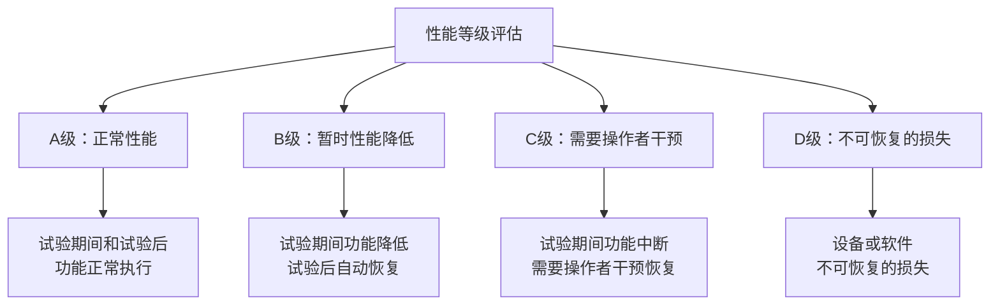
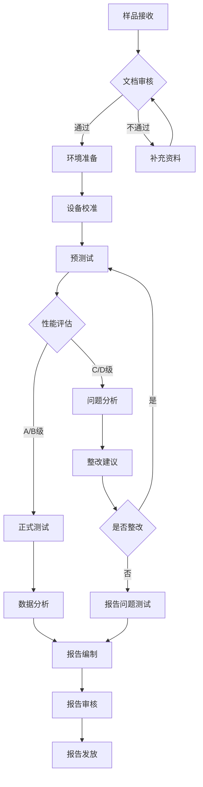
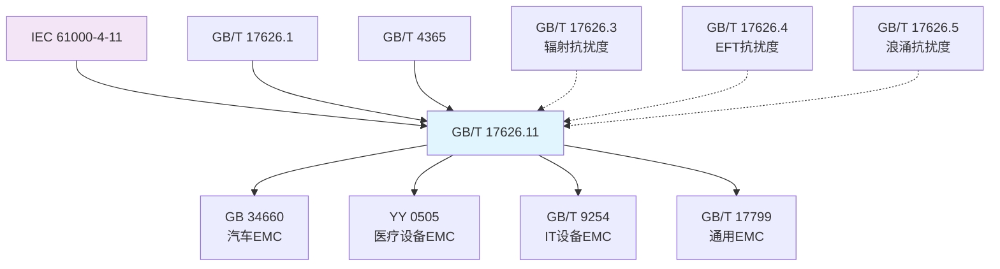

---
# ========== 基础识别信息 ==========
# 文件编码：UTF-8 (无BOM)
# 创建日期：2022-10-12
# 语言环境：中文(简体) zh-CN
title: "GB/T 17626.11-2022 - 电磁兼容 试验和测量技术 第11部分：电压暂降、短时中断和电压变化的抗扰度试验"
last_modified: 2025-06-19T15:30
aliases:
  - "GB/T 17626.11-2022"
  - "GB/T 17626.11"
  - "GB_T_17626_11"
  - "GB/T17626.11"
  - "GBT17626.11"
  - "17626.11"
  - "电压暂降抗扰度试验"
  - "电压中断抗扰度试验"
  - "电压变化抗扰度试验"
  - "Voltage Dips and Interruptions Test"
  - "电压暂降测试"
  - "电压中断测试"
  - "电压变化测试"
  - "IEC 61000-4-11等效标准"

# ========== 三维正交标签体系 ==========
tags:
  # 物理现象层(What) - 描述电磁现象的物理本质 - 严格包含关系
  - "电磁现象|电压扰动|电压暂降|5%-95%暂降深度"
  - "电磁现象|电压扰动|短时中断|<5%剩余电压"
  - "电磁现象|电压扰动|电压变化|±5%-±30%幅度"
  - "电磁现象|工频现象|50Hz工频|电源频率扰动"
  - "电磁现象|工频现象|60Hz工频|电源频率扰动"
  - "传播机制|传导耦合|电源端口|AC电源线路"
  - "传播机制|电力传导|电网传播|工频传导路径"
  - "频谱特征|工频信号|持续时间|10ms-5000ms"
  - "频谱特征|相位控制|相位角|0°-315°步进"
  
  # 技术方法层(How) - 描述测试和解决方法 - 严格包含关系  
  - "测试方法|IEC61000-4-11|电压暂降试验|相位角控制"
  - "测试方法|IEC61000-4-11|短时中断试验|工频中断"
  - "测试方法|IEC61000-4-11|电压变化试验|缓慢变化"
  - "测试设备|EMC测试系统|电压暂降发生器|1kVA-100kVA"
  - "测试设备|EMC测试系统|电压变化发生器|0.1%-10%变化率"
  - "测试设备|EMC测试系统|功率分析仪|0.1级精度"
  - "测试设备|EMC测试系统|宽带示波器|≥100MHz带宽"
  - "测试环境|电磁兼容实验室|工频环境|50/60Hz基准"
  - "性能判据|A级判据|试验期间正常工作|无性能降低"
  - "性能判据|B级判据|功能降低但可恢复|自动恢复"
  - "性能判据|C级判据|需人工干预恢复|手动复位"
  - "性能判据|D级判据|设备损坏不可恢复|永久损失"
  - "校准要求|周期性校准|12个月周期|国家电压基准"
  
  # 应用领域层(Where) - 描述应用场景和产品 - 严格包含关系
  - "工业应用|汽车电子|车载电控系统|发动机控制模块"
  - "工业应用|汽车电子|车载信息系统|仪表盘系统"
  - "工业应用|工业控制|工业自动化|PLC控制器"
  - "工业应用|工业控制|电力电子|变频器设备"
  - "工业应用|医疗设备|生命支持设备|监护仪设备"
  - "工业应用|信息技术|计算机设备|服务器系统"
  - "工业应用|家用电器|智能家电|白色家电"
  - "工业应用|照明设备|LED照明|智能照明系统"
  - "电流范围|小功率设备|≤16A额定电流|单相三相设备"
  - "电压范围|低压系统|AC230V/400V|工频电源系统"
  - "环境分类|1级保护良好|住宅商业环境|60%暂降10ms"
  - "环境分类|2级有限保护|轻工业环境|30%暂降100ms"
  - "环境分类|3级典型工业|重工业环境|5%暂降1000ms"
  - "环境分类|4级恶劣环境|特殊工业环境|5000ms中断"
  
  # 关联标准层 - 直接引用相关标准编号用于知识图谱链接 - 倒装结构标准名放在最后
  - "电压扰动抗扰度|IEC61000-4-11"
  - "电磁兼容基础|IEC61000-1-1"
  - "EMC通用指南|GB/T17626.1"
  - "静电抗扰度|GB/T17626.2"
  - "辐射抗扰度|GB/T17626.3"
  - "脉冲群抗扰度|GB/T17626.4"
  - "浪涌抗扰度|GB/T17626.5"
  - "等同采用IEC61000-4-11|GB/T17626.11"
  - "汽车EMC|GB34660"
  - "医疗EMC|YY0505"
  - "IDT关系|等同采用"
  - "现行有效|2022版"
  
  # 标准类型判断 - 必填项目 - 严格包含关系
  - "标准分类|EMC基础标准|抗扰度试验|电压扰动抗扰度"
  - "标准分类|通用EMC标准|基础试验方法"
  - "EMC要求|EMS抗扰度要求|电压扰动抗扰度"
  - "EMC要求|试验方法|工频电压扰动"
  - "测试频率|工频频段|50Hz/60Hz"
  - "测试等级|1-4级|工业环境适用"
  - "标准分类|国家标准|推荐性标准|中国标准"
  
  # 测试等级标注 - GB/T 17626.11-2022具体等级 - 严格包含关系
  - "抗扰度等级|1级|保护良好环境|60%暂降10ms"
  - "抗扰度等级|2级|有限保护环境|30%暂降100ms"
  - "抗扰度等级|3级|典型工业环境|5%暂降1000ms"
  - "抗扰度等级|4级|恶劣工业环境|5000ms中断"
  - "性能判据|A级|试验期间正常功能"
  - "性能判据|B级|暂时功能降低"
  - "性能判据|C级|需要人工干预"
  - "性能判据|D级|设备损坏不可接受"

# ========== 标准技术参数 ==========
standard_number: "GB/T 17626.11-2022"
standard_year: 2022
organization: "国家标准化管理委员会(SAC)"
standard_type: "推荐性国家标准"
status: "现行有效"
effective_date: "2023-05-01"

# ========== 技术范围与限值 ==========
frequency_range:
  lower_limit: "50 Hz"
  upper_limit: "60 Hz"
  characteristic_frequencies: ["50 Hz", "60 Hz"]

test_levels:
  - level: 1
    description: "保护良好的环境"
    parameters: "60%电压暂降，持续10ms"
    application: "住宅、商业和轻工业环境"
  - level: 2
    description: "有限保护的环境"
    parameters: "30%电压暂降，持续100ms"
    application: "工业环境"
  - level: 3
    description: "典型工业环境"
    parameters: "5%电压暂降，持续1000ms"
    application: "重工业环境"
  - level: 4
    description: "恶劣工业环境"
    parameters: "短时中断，持续5000ms"
    application: "特殊工业环境"
  - level: X
    description: "开放等级"
    parameters: "用户自定义"
    application: "特殊应用需求"

# ========== 测试设备技术要求 ==========
test_equipment:
  primary_instrument:
    name: "电压暂降/中断发生器"
    technical_specs:
      power_range: "1kVA-100kVA"
      voltage_accuracy: "±1%"
      time_accuracy: "±1ms或±1个周期"
      phase_accuracy: "±2°"
    calibration_cycle: "12个月"
    reference_standard: "国家电压基准"
  
  auxiliary_equipment:
    - name: "电压变化发生器"
      specifications: "变化速率0.1%-10%/s，精度±0.5%"
    - name: "宽带示波器"
      specifications: "≥100MHz带宽，≥1MS/s采样率"
    - name: "功率分析仪"
      specifications: "0.1级精度，≥100kHz带宽"
    - name: "真有效值电压表"
      specifications: "±0.5%精度，波峰因数≥3"

# ========== 测试条件与环境 ==========
test_conditions:
  environmental:
    temperature: "16-35°C (稳定性±2°C)"
    humidity: "45-75%RH (稳定性±5%)"
    atmospheric_pressure: "86-106kPa"
  
  electromagnetic:
    background_field: "< 3%标称值"
    power_supply: 
      voltage_stability: "±1%"
      frequency_stability: "±0.1%"
      harmonic_distortion: "< 2%"
  
  mechanical:
    vibration_isolation: "符合ISO要求"
    grounding_impedance: "< 0.1Ω"

# ========== 性能判据与等级划分 ==========
performance_criteria:
  A级:
    description: "试验期间性能正常"
    technical_requirement: "试验期间和试验后性能均在规定限值内"
    acceptance_criteria: "所有功能正常，无异常指示"
  
  B级:
    description: "试验期间性能暂时降低，试验后自动恢复"
    technical_requirement: "暂时性功能降低或丧失，试验后能自行恢复"
    acceptance_criteria: "30秒内自动恢复，无数据丢失"
    
  C级:
    description: "试验期间性能降低，需要操作者干预恢复"
    technical_requirement: "暂时性功能降低或丧失，需要操作者干预"
    acceptance_criteria: "需要重新启动或复位操作"
    
  D级:
    description: "设备损坏或数据丢失"
    technical_requirement: "因设备或软件损坏造成不可恢复的功能降低"
    acceptance_criteria: "不合格，需要维修或更换"

# ========== 测量不确定度评估 ==========
measurement_uncertainty:
  type_A_uncertainty: "±0.3% (95%置信区间)"
  type_B_uncertainty: "±0.7% (均匀分布)"
  combined_uncertainty: "±0.8% (k=2)"
  major_sources:
    - source: "电压发生器精度不确定度"
      contribution: "±0.5%"
    - source: "时间测量不确定度"
      contribution: "±1ms"
    - source: "相位角控制不确定度"
      contribution: "±2°"
    - source: "环境条件影响不确定度"
      contribution: "±0.3%"

# ========== 标准关系映射 ==========
Referenced_Standards:
  normative_references:
    - standard: "IEC 61000-4-11:2020"
      application: "等同采用的国际标准"
    - standard: "GB/T 17626.1-2006"
      application: "电磁兼容试验和测量技术通用指南"
    - standard: "GB/T 4365-2003"
      application: "电工术语 电磁兼容"
  
  informative_references:
    - standard: "GB/T 12325-2008"
      relationship: "电能质量 供电电压偏差"
    - standard: "JJF 1059.1-2012"
      relationship: "测量不确定度评定与表示"

equivalent_standards:
  international:
    primary: "IEC 61000-4-11:2020"
    adoption_method: "等同采用"
    technical_differences: "无实质性技术差异"
  
  regional:
    europe: "EN 61000-4-11:2020"
    usa: "无直接对应标准"
    japan: "JIS C 61000-4-11:2021"

superseded_standards: "GB/T 17626.11-2008"
superseding_standards: "暂无"

# ========== 知识图谱属性 ==========
graph_attributes:
  node_type: "基础标准"
  cluster_family: "GB/T 17626系列"
  importance_weight: 8
  connectivity_index: 12
  
graph_relationships:
  references: ["IEC61000-4-11:2020", "GB/T17626.1-2006", "GB/T4365-2003"]
  referenced_by: ["GB34660", "YY0505", "GB/T9254"]
  complements: ["GB/T17626.3", "GB/T17626.4", "GB/T17626.5", "GB/T17626.29"]
  conflicts: []

# ========== 工程实施信息 ==========
implementation_guidance:
  typical_test_duration: "2-4小时每个试验等级"
  cost_estimate_range: "5-15万元设备投资"
  required_expertise_level: "EMC工程师及以上"
  common_failure_modes: 
    - failure: "电压敏感设备(开关电源)"
      solution: "增加电压保持电路设计"
    - failure: "时序敏感设备(单片机)"
      solution: "增加看门狗和复位电路"
    - failure: "存储器数据丢失"
      solution: "增加掉电保护和数据备份"

compliance_information:
  mandatory_regions: ["中华人民共和国"]
  certification_bodies: ["CQC", "CCC", "CNAS认可实验室"]
  mutual_recognition: ["CNAS-ILAC", "APLAC互认协议", "IECEE-CB体系"]

# ========== 文档管理信息 ==========
document_management:
  creation_date: 2022-10-12
  last_review_date: 2025-06-19
  next_review_date: 2027-10-12
  revision_history:
    - version: "v1.0"
      date: 1998-12-01
      changes: "首次发布，基于IEC 61000-4-11:1994"
      impact_assessment: "建立了基本的试验框架"
    - version: "v2.0"
      date: 2008-06-01
      changes: "等效采用IEC 61000-4-11:2004，增加电压变化试验"
      impact_assessment: "扩展了试验范围，提高了试验精度"
    - version: "v3.0"
      date: 2022-10-12
      changes: "等效采用IEC 61000-4-11:2020，完善试验程序"
      impact_assessment: "与国际标准完全同步，提高操作性"

quality_assurance:
  technical_reviewer: "全国无线电干扰标准化技术委员会"
  validation_method: "标准比对和技术验证"
  peer_review_status: "已完成国际同行评议"
---

# GB/T 17626.11-2022 - 电磁兼容 试验和测量技术 第11部分：电压暂降、短时中断和电压变化的抗扰度试验

## 1. 标准概述

### 1.1 技术摘要

> 本标准规定了电子电气设备对电压暂降、短时中断和电压变化的抗扰度试验方法，建立了统一的试验等级、试验方法和性能判定准则。适用于额定输入电流不超过16A的单相和三相设备。标准等效采用IEC 61000-4-11:2020，确保与国际标准的技术一致性。

### 1.2 标准定位

- **技术领域**：EMS电磁抗扰度
- **应用层级**：基础标准/测试方法标准  
- **强制属性**：推荐性国家标准
- **实施状态**：现行有效
- **国际地位**：等效采用IEC 61000-4-11:2020

## 2. 物理原理与理论基础

### 2.1 电磁现象机理

> 电压暂降、中断和变化是电力系统中常见的电能质量扰动，主要由系统故障、大负载投切、开关操作、雷击等因素引起。这些扰动通过电源线路直接传导到敏感设备，可能导致设备功能异常、数据丢失或永久损坏。

#### 电压暂降机理
电压暂降是由于电力系统中发生短路故障或大负载启动时，系统阻抗压降导致的电压下降：

$$
U_{dip} = U_{nominal} \times \left(1 - \frac{Z_{fault}}{Z_{fault} + Z_{source}}\right)
$$

其中：
- $U_{dip}$ - 暂降期间的电压有效值
- $U_{nominal}$ - 标称电压有效值
- $Z_{fault}$ - 故障阻抗
- $Z_{source}$ - 电源阻抗

#### 电压变化机理
电压变化通常由负载的渐变或调压设备的动作引起：

$$
\frac{dU}{dt} = \frac{1}{C} \cdot \frac{dI}{dt} + R \cdot \frac{dI}{dt}
$$

### 2.2 数学模型

#### 电压暂降深度定义
$$
d = \frac{U_{nominal} - U_{dip}}{U_{nominal}} \times 100\%
$$

#### 电压变化率
$$
\Delta U(\%) = \frac{U_{measured} - U_{reference}}{U_{reference}} \times 100\%
$$

#### 相位角影响
暂降开始的相位角影响设备响应特性：
$$
u(t) = U_{nominal} \sqrt{2} \sin(\omega t + \phi_0) \quad (t < t_{start})
$$
$$
u(t) = U_{dip} \sqrt{2} \sin(\omega t + \phi_0) \quad (t_{start} \leq t \leq t_{end})
$$

### 2.3 关键参数定义

| 参数符号 | 参数名称 | 物理意义 | 单位 | 典型值范围 | 测量精度 |
|---------|---------|---------|------|-----------|----------|
| $d$ | 暂降深度 | 电压下降的百分比 | % | 5%-95% | ±1% |
| $t_{dur}$ | 持续时间 | 扰动持续的时间 | ms | 10-5000 | ±1ms |
| $\alpha$ | 相位角 | 扰动开始的相位 | ° | 0°-315° | ±2° |
| $\Delta U$ | 电压变化 | 电压变化幅度 | % | ±5%-±30% | ±0.5% |
| $dU/dt$ | 变化速率 | 电压变化的速度 | %/s | 0.1-10 | ±10% |
| $f$ | 频率 | 电源频率 | Hz | 50/60 | ±0.1% |

## 3. 技术要求详解

### 3.1 限值要求

#### 电压暂降试验等级

| 试验等级 | 暂降深度 | 持续时间 | 相位角 | 应用环境 | 典型场景 |
|---------|---------|---------|---------|---------|---------|
| 1级 | 60% | 10ms | 0°,45°,90°,135°,180°,225°,270°,315° | 保护良好的环境 | 办公、住宅 |
| 2级 | 30% | 100ms | 0°,45°,90°,135°,180°,225°,270°,315° | 有限保护的环境 | 轻工业、商业 |
| 3级 | 5% | 1000ms | 0°,45°,90°,135°,180°,225°,270°,315° | 典型工业环境 | 重工业 |
| X级 | 用户定义 | 用户定义 | 用户定义 | 特殊应用 | 定制应用 |

#### 短时中断试验等级

| 试验等级 | 中断时间 | 相位角 | 应用环境 | 恢复时间要求 |
|---------|---------|---------|---------|-------------|
| 1级 | 10ms | 0°,45°,90°,135°,180°,225°,270°,315° | 保护良好的环境 | ≤200ms |
| 2级 | 100ms | 0°,45°,90°,135°,180°,225°,270°,315° | 有限保护的环境 | ≤1s |
| 3级 | 1000ms | 0°,45°,90°,135°,180°,225°,270°,315° | 典型工业环境 | ≤5s |
| 4级 | 5000ms | 0°,45°,90°,135°,180°,225°,270°,315° | 恶劣环境 | ≤30s |

#### 电压变化试验等级

| 试验等级 | 电压变化 | 变化持续时间 | 应用环境 |
|---------|---------|-------------|---------|
| 1级 | ±5% | 1s | 保护良好的环境 |
| 2级 | ±10% | 1s | 有限保护的环境 |
| 3级 | ±15% | 1s | 典型工业环境 |

### 3.2 性能等级划分



**性能等级详细定义：**

- **A级（正常性能）**：设备在规定的限值内正常工作
- **B级（暂时性能降低）**：暂时性能降低，但能自动恢复，无需操作者干预
- **C级（需要操作者干预）**：功能中断，需要操作者干预才能恢复正常工作
- **D级（不可恢复的损失）**：由于设备（硬件）或软件的损坏或数据的丢失造成的不可恢复的损失

### 3.3 适用范围界定

#### 包含设备类型
- 额定输入电流≤16A的单相和三相设备
- 交流电源供电的电子电气设备
- 开关电源设备
- 线性电源设备
- 带储能装置的设备（需特殊考虑）

#### 不包含设备类型  
- 专门的电力设备（如变压器、开关柜）
- 大功率工业设备（>16A）
- 直流供电设备（参见[[GB_T_17626_29]]）
- 照明设备的光通量闪烁评估

#### 特殊考虑事项
- **储能设备**：需要考虑储能容量对抗扰度的影响
- **多相设备**：需要考虑相间不平衡的影响
- **敏感设备**：如医疗设备需要更严格的性能要求

## 4. 测试方法与程序

### 4.1 测试配置

#### 基本测试配置框图

```
    电源网络 ──┬── 电压暂降/中断发生器 ──┬── 受试设备(EUT) ──┬── 辅助设备
    (Mains)   │                        │                   │
              │                        │                   └── 负载
              │                        │
              └── 监测设备 ──────────────┘
                  (Monitoring)
                  
    控制与数据采集系统
    ├── 波形记录
    ├── 时间测量  
    ├── 幅值测量
    └── 性能评估
```

#### 测试电路拓扑

**单相测试电路：**
```
L ──[耦合变压器]──[开关S1]──┬── EUT L
                           │
N ──[中性线]──[开关S2]──────┼── EUT N  
                           │
PE ──[保护地]─────────────── EUT PE

测量点：
V1: 输入电压监测
V2: EUT端子电压监测
I1: 输入电流监测
```

**三相测试电路：**
```
L1 ──[开关S1]──┬── EUT L1
L2 ──[开关S2]──┼── EUT L2
L3 ──[开关S3]──┼── EUT L3
N  ──[开关S4]──┼── EUT N
PE ─────────────┘── EUT PE
```

### 4.2 测试步骤

#### 4.2.1 预备测试阶段

1. **环境条件确认**
   - 环境温度：16°C-35°C（记录±1°C）
   - 相对湿度：45%-75%RH（记录±5%RH）
   - 大气压力：86kPa-106kPa
   - 电磁背景：测量并记录，应<3%标称值

2. **设备准备与校准**
   - 电压发生器校准检查（电压精度±1%，时间精度±1ms）
   - 测量仪器校准确认（示波器、电压表、功率计）
   - 同步时钟校对（各设备时间基准统一）
   - 接地系统检查（接地电阻<10Ω）

3. **EUT预处理**
   - EUT按照制造商说明书安装配置
   - 建立正常工作状态（预热时间≥15分钟）
   - 确认所有功能正常工作
   - 记录初始工作参数（电压、电流、功率等）

#### 4.2.2 测试执行阶段

**电压暂降试验：**

1. **基准条件建立**
   - 设置标称电压（230V±1%单相，400V±1%三相）
   - 确认EUT正常工作状态
   - 记录基准功率和电流

2. **暂降参数设置**
   - 设置暂降深度（按试验等级）
   - 设置持续时间（按试验等级）
   - 设置相位角（0°,45°,90°,135°,180°,225°,270°,315°）

3. **试验执行**
   ```
   t=0    t=t1    t=t2    t=t3
   │      │       │       │
   │      ▼       ▼       │
   ┌──────┐       ┌───────┐
   │ 正常 │ 暂降  │ 恢复  │
   └──────┘       └───────┘
   
   t1: 暂降开始时刻（相位角控制）
   t2: 暂降结束时刻（t2-t1=持续时间）
   t3: 观察结束时刻（t3-t2≥30s）
   ```

4. **数据记录**
   - 电压波形记录（采样率≥10kS/s）
   - EUT功能状态监测
   - 异常现象记录（声音、显示、指示灯等）

**短时中断试验：**

1. **中断深度设置**：电压降至<5%标称值
2. **中断时间设置**：按试验等级（10ms/100ms/1000ms/5000ms）
3. **执行步骤**：类似暂降试验，但电压降至接近零值

**电压变化试验：**

1. **变化幅度设置**：±5%/±10%/±15%标称值
2. **变化持续时间**：≥1s
3. **变化速率控制**：缓慢变化，避免暂态效应

#### 4.2.3 性能评估阶段

1. **试验期间观察**
   - 功能是否正常执行
   - 是否有异常显示或报警
   - 性能参数是否在规定范围内

2. **试验后检查**
   - 功能是否恢复正常
   - 是否需要重新启动或复位
   - 数据是否丢失或损坏
   - 硬件是否有损坏

3. **性能等级判定**
   - 根据观察结果判定A/B/C/D级
   - 记录判定依据和相关证据

### 4.3 判定准则

#### 性能等级判定矩阵

| 现象描述 | 试验期间 | 试验后 | 性能等级 |
|---------|---------|--------|----------|
| 功能完全正常 | 正常工作 | 正常工作 | A级 |
| 暂时性能降低 | 降低但可接受 | 自动恢复 | B级 |
| 功能暂时中断 | 中断或异常 | 手动恢复后正常 | C级 |
| 永久性损失 | 中断或异常 | 无法恢复或损坏 | D级 |

#### 具体判定标准

**A级判定条件：**
- 试验期间所有功能正常执行
- 性能参数在规定限值内
- 无任何异常指示

**B级判定条件：**
- 试验期间性能轻微降低但仍可接受
- 试验后30秒内自动恢复正常
- 无数据丢失或设备损坏

**C级判定条件：**
- 试验期间功能中断或严重降低
- 试验后需要操作者干预才能恢复
- 可能需要重新启动或复位操作

**D级判定条件：**
- 设备硬件永久损坏
- 软件崩溃无法恢复
- 重要数据永久丢失

## 5. 测试设备与环境

### 5.1 主要测试设备

#### 核心测试设备规格

| 设备名称 | 关键技术指标 | 校准要求 | 参考型号 | 应用注意事项 |
|---------|-------------|---------|---------|-------------|
| 电压暂降/中断发生器 | 输出功率：1kVA-100kVA<br/>电压精度：±1%<br/>时间精度：±1ms<br/>相位角精度：±2° | 12个月 | Teseq NSG 5500<br/>Haefely Axos 5 | 需要足够的功率裕量<br/>考虑负载特性 |
| 电压变化发生器 | 变化速率：0.1%-10%/s<br/>电压精度：±0.5%<br/>线性度：±0.1% | 12个月 | California Instruments CSW5550<br/>Pacific Power AMX | 避免快速变化产生<br/>暂态干扰 |
| 宽带示波器 | 带宽：≥100MHz<br/>采样率：≥1MS/s<br/>垂直分辨率：≥8位<br/>记录长度：≥1MB | 12个月 | Tektronix DPO4000<br/>Keysight DSOX3000 | 正确设置触发条件<br/>避免混叠失真 |
| 功率分析仪 | 精度：0.1级<br/>带宽：≥100kHz<br/>谐波分析：≥50次 | 12个月 | Yokogawa WT500<br/>Fluke Norma 4000 | 选择合适的电流传感器<br/>注意共模干扰 |
| 真有效值电压表 | 测量精度：±0.5%<br/>频率响应：10Hz-100kHz<br/>波峰因数：≥3 | 12个月 | Fluke 8846A<br/>Keysight 34470A | 考虑波形失真影响<br/>使用适当的滤波 |

#### 辅助测试设备

| 设备类型 | 技术要求 | 用途 |
|---------|---------|------|
| 隔离变压器 | 容量匹配，绝缘等级B级以上 | 提供安全隔离，减少电网干扰 |
| 稳压电源 | 稳定度±0.5%，响应时间<100ms | 为测试设备提供稳定电源 |
| 接地电阻测试仪 | 测量精度±2%，量程0.01-2000Ω | 验证接地系统完整性 |
| 环境监测仪 | 温度精度±0.5°C，湿度精度±3%RH | 监测测试环境条件 |

### 5.2 测试环境要求

#### 物理环境条件

**温度控制：**
- 环境温度：16°C-35°C
- 温度稳定性：±2°C/h
- 温度梯度：<1°C/m
- 监测频率：每15分钟记录一次

**湿度控制：**
- 相对湿度：45%-75%RH
- 湿度稳定性：±5%RH/h
- 避免结露现象
- 防止静电积累

**气压要求：**
- 大气压力：86kPa-106kPa
- 海拔影响：>2000m需要修正
- 气压稳定性：±1kPa/h

#### 电磁环境要求

**电磁背景限制：**
- 背景场强：<3%试验信号幅度
- 测量频率范围：9kHz-30MHz（传导）
- 测量频率范围：30MHz-1GHz（辐射）
- 每次试验前检查电磁背景

**电源质量要求：**
- 电压稳定度：±1%标称值
- 频率稳定度：±0.1%标称值
- 总谐波失真：<2%
- 电压不平衡度：<1%（三相）

#### 安全防护要求

**电气安全：**
- 接地电阻：<10Ω
- 绝缘电阻：>1MΩ
- 漏电流：<1mA
- 配备急停开关和警示标识

**机械安全：**
- 设备固定牢靠，防止倾倒
- 通道宽度≥1.2m，保证疏散通道
- 配备适当的个人防护设备

## 6. 工程实施指南

### 6.1 典型问题与对策

#### 测试设备问题

| 常见问题 | 可能原因 | 建议对策 | 预期效果 | 验证方法 |
|---------|---------|---------|---------|---------|
| 电压发生器输出不稳定 | 内部基准漂移<br/>温度影响 | 延长预热时间至30分钟<br/>环境温度控制 | 输出稳定度<±0.5% | 连续监测1小时 |
| 时间测量精度不足 | 触发延迟<br/>时钟漂移 | 校准时钟基准<br/>使用外部10MHz基准 | 时间精度≤±0.5ms | 与高精度计时器比较 |
| 波形记录失真 | 采样率不足<br/>带宽限制 | 提高采样率至100kS/s<br/>选择合适带宽 | 波形保真度>99% | FFT分析验证 |
| 功率测量偏差 | 电流传感器饱和<br/>相位误差 | 选择合适量程<br/>相位校准 | 功率精度±1% | 标准功率源验证 |

#### 环境干扰问题

| 常见问题 | 可能原因 | 建议对策 | 预期效果 |
|---------|---------|---------|---------|
| 电磁背景超标 | 邻近设备干扰<br/>电网谐波 | 使用屏蔽室<br/>安装电源滤波器 | 背景干扰<2% |
| 电源质量不良 | 电网波动<br/>负载影响 | 使用稳压电源<br/>功率因数校正 | THD<2% |
| 接地干扰 | 接地回路<br/>共模干扰 | 单点接地<br/>使用隔离变压器 | 共模抑制>60dB |

#### EUT相关问题

| 常见问题 | 可能原因 | 建议对策 | 预期效果 |
|---------|---------|---------|---------|
| 功能状态不明确 | 监测方法不当<br/>指示不清晰 | 使用客观指标<br/>多参数监测 | 状态判定准确度>95% |
| 恢复时间过长 | 设计缺陷<br/>参数设置 | 优化软件算法<br/>调整参数 | 恢复时间<30s |
| 误触发现象 | 干扰信号<br/>阈值设置 | 提高抗干扰能力<br/>优化阈值 | 误触发率<1% |

### 6.2 测试流程优化

#### 标准测试流程



#### 批量测试优化

**并行测试安排：**
- 多台相同EUT同时测试
- 不同试验等级交替进行
- 设备预热与测试并行

**时间优化策略：**
- 标准化测试程序，减少设置时间
- 自动化数据记录和分析
- 合理安排测试序列

### 6.3 成本控制建议

#### 设备投资优化

**核心设备配置：**
- 电压发生器：选择功率适中、精度高的型号
- 示波器：选择带宽和采样率满足要求的经济型
- 功率计：考虑多功能集成型号

**设备复用策略：**
- 电压发生器可用于多项EMC测试
- 示波器可用于信号完整性测试
- 环境监测设备可多个实验室共用

#### 运营成本控制

**人员配置优化：**
- 标准配置：1名主任工程师 + 1名助理工程师
- 培训投入：定期技术培训，提高效率
- 交叉培训：一人多岗，提高灵活性

**时间成本控制：**
- 标准化流程：减少重复性工作
- 自动化程度：提高测试自动化水平
- 批量处理：相同产品批量测试

**维护成本管理：**
- 预防性维护：定期保养，减少故障
- 备件管理：关键器件适量储备
- 校准计划：合理安排校准周期

## 7. 标准差异与互认

### 7.1 国际标准对比

#### 与IEC 61000-4-11:2020对比

| 对比项目 | GB/T 17626.11-2022 | IEC 61000-4-11:2020 | 差异说明 | 互认情况 |
|---------|-------------------|---------------------|----------|----------|
| 试验等级定义 | 1-3级+X级 | 1-3级+X级 | 完全一致 | 直接互认 |
| 电压暂降深度 | 60%, 30%, 5% | 60%, 30%, 5% | 完全一致 | 直接互认 |
| 持续时间 | 10ms, 100ms, 1000ms | 10ms, 100ms, 1000ms | 完全一致 | 直接互认 |
| 相位角设置 | 0°-315°(45°步进) | 0°-315°(45°步进) | 完全一致 | 直接互认 |
| 性能判定准则 | A,B,C,D级 | A,B,C,D级 | 完全一致 | 直接互认 |
| 测试设备要求 | 精度±1%，时间±1ms | 精度±1%，时间±1ms | 完全一致 | 直接互认 |
| 环境条件 | 16-35°C, 45-75%RH | 16-35°C, 45-75%RH | 完全一致 | 直接互认 |

#### 与欧盟EN 61000-4-11:2020对比

| 对比项目 | GB/T 17626.11-2022 | EN 61000-4-11:2020 | 差异说明 | 互认情况 |
|---------|-------------------|-------------------|----------|----------|
| 技术内容 | 等效采用IEC标准 | 等效采用IEC标准 | 技术内容一致 | 直接互认 |
| 试验程序 | 与IEC完全一致 | 与IEC完全一致 | 程序一致 | 直接互认 |
| 报告格式 | 按GB/T要求 | 按EN要求 | 格式略有差异 | 技术内容互认 |

#### 与其他国家标准对比

| 国家/地区 | 对应标准 | 技术差异 | 互认程度 |
|----------|---------|---------|----------|
| 日本 | JIS C 61000-4-11:2021 | 与IEC保持一致 | 直接互认 |
| 韩国 | KS C IEC 61000-4-11:2021 | 与IEC保持一致 | 直接互认 |
| 澳大利亚 | AS/NZS 61000.4.11:2021 | 与IEC保持一致 | 直接互认 |
| 美国 | 无直接对应标准 | - | 需要个别评估 |

### 7.2 认证互认指南

#### 直接互认项目

**测试结果完全互认：**
- 与IEC 61000-4-11:2020测试结果
- 与EN 61000-4-11:2020测试结果  
- 与JIS C 61000-4-11测试结果
- 与其他等效采用IEC标准的国家标准

**互认条件：**
- 使用相同的试验等级
- 测试设备满足精度要求
- 测试程序完全一致
- 实验室具备相应资质

#### 有条件互认项目

**需要补充说明的情况：**
- 使用X级（用户自定义等级）的测试结果
- 特殊环境条件下的测试结果
- 非标准测试配置的结果

**补充要求：**
- 提供详细的测试参数说明
- 说明与标准试验等级的对应关系
- 必要时提供技术论证

#### 不可互认项目

**重新测试的情况：**
- 使用非等效标准的测试结果
- 测试条件不符合要求的结果
- 测试设备精度不满足要求的结果

### 7.3 认证策略建议

#### 针对不同市场的认证策略

**中国市场：**
- 按GB/T 17626.11-2022执行
- 关注CCC认证要求
- 考虑行业标准的额外要求

**欧盟市场：**
- 按EN 61000-4-11:2020执行  
- 关注CE认证要求
- 考虑特定产品的EMC指令要求

**国际市场：**
- 按IEC 61000-4-11:2020执行
- 考虑目标国家的具体要求
- 关注IECEE CB认证体系

#### 成本效益优化

**一次测试多重认证：**
- 使用最严格的试验等级
- 确保测试覆盖所有目标市场要求
- 合理规划测试顺序

## 8. 相关标准导航

### 8.1 上游标准（基础标准）

#### 国际基础标准
- **[[IEC_61000_4_11]]** - 本标准的国际对应版本，技术内容完全一致
- **[[IEC_61000_1_1]]** - EMC基本概念和定义
- **[[IEC_61000_2_1]]** - 电磁环境描述和分类

#### 国内基础标准  
- **[[GB_T_17626_1]]** - 电磁兼容试验和测量技术通用指南
- **[[GB_T_17626_2]]** - 静电放电抗扰度试验
- **[[GB_T_4365]]** - 电工术语 电磁兼容

#### 电能质量相关标准
- **[[GB_T_12325]]** - 电能质量供电电压偏差
- **[[GB_T_12326]]** - 电能质量 电压波动和闪烁
- **[[GB_T_15543]]** - 电能质量三相电压不平衡

### 8.2 平行标准（同层级标准）

#### 其他EMC抗扰度测试标准
- **[[GB_T_17626_3]]** - 射频电磁场辐射抗扰度试验
- **[[GB_T_17626_4]]** - 电快速瞬变脉冲群抗扰度试验  
- **[[GB_T_17626_5]]** - 浪涌（冲击）抗扰度试验
- **[[GB_T_17626_6]]** - 射频场感应的传导抗扰度试验
- **[[GB_T_17626_8]]** - 工频磁场抗扰度试验
- **[[GB_T_17626_12]]** - 振荡波抗扰度试验

#### 特殊应用标准
- **[[GB_T_17626_29]]** - 直流电源输入端口电压暂降、短时中断和电压变化抗扰度试验
- **[[GB_T_17626_34]]** - 电压暂降、短时中断和电压变化抗扰度试验指南

#### 发射测试标准
- **[[GB_T_9254]]** - 信息技术设备的无线电骚扰限值和测量方法
- **[[GB_4824]]** - 工业、科学和医疗设备射频骚扰特性限值和测量方法

### 8.3 下游标准（产品应用标准）

#### 汽车电子EMC标准
- **[[GB_34660]]** - 道路车辆电磁兼容性要求和试验方法
- **[[GB_T_33014_2]]** - 道路车辆功能安全 第2部分：功能安全管理
- **[[QC_T_413]]** - 汽车电气设备基本技术条件

#### 工业设备EMC标准
- **[[GB_T_17626_31]]** - 设备和系统级EMC要求
- **[[GB_T_17799_1]]** - 电磁兼容通用标准 居住、商业和轻工业环境中的抗扰度试验
- **[[GB_T_17799_4]]** - 电磁兼容通用标准 工业环境中的发射和抗扰度试验

#### 特定产品EMC标准
- **[[GB_T_9254_1]]** - 信息技术设备的无线电骚扰限值和测量方法
- **[[GB_4824]]** - 工业、科学和医疗设备射频骚扰特性限值和测量方法
- **[[GB_T_6113]]** - 无线电骚扰和抗扰度测量设备和测量方法规范

#### 医疗设备EMC标准
- **[[YY_0505]]** - 医用电气设备第1-2部分：安全通用要求并列标准：电磁兼容要求和试验
- **[[GB_9706_1]]** - 医用电气设备第1部分：基本安全和基本性能的通用要求

### 8.4 标准引用关系图



## 9. 附录

### 9.1 术语定义

#### 基本术语

**电压暂降（Voltage dip）**
供电电压有效值突然下降到90%标称值以下，持续时间从半个周波到几秒钟，然后恢复到正常值附近的现象。

**短时中断（Short interruption）**  
供电电压下降到5%标称值以下，持续时间不超过1分钟的现象。

**电压变化（Voltage variation）**
供电电压有效值的缓慢变化，通常由负载变化或调压设备动作引起。

#### 技术术语

**暂降深度（Dip depth）**
电压暂降期间电压下降的百分比，定义为：
$$d = \frac{U_{nominal} - U_{dip}}{U_{nominal}} \times 100\%$$

**持续时间（Duration）**
从电压暂降开始到恢复至90%标称值的时间间隔。

**相位角（Phase angle）**
电压暂降开始时的电源相位角，影响设备的响应特性。

**剩余电压（Residual voltage）**
电压暂降期间的电压有效值，通常表示为标称值的百分比。

#### 性能术语

**抗扰度（Immunity）**
设备在电磁扰动存在下保持正常工作性能的能力。

**性能等级（Performance level）**
描述设备在扰动期间和扰动后性能表现的分类标准（A/B/C/D级）。

**试验等级（Test level）**
规定的试验严酷度等级，用于模拟不同电磁环境条件。

### 9.2 参考文献

#### 国际标准文献
1. IEC 61000-4-11:2020, Electromagnetic compatibility (EMC) - Part 4-11: Testing and measurement techniques - Voltage dips, short interruptions and voltage variations immunity tests
2. IEC 61000-1-1:2016, Electromagnetic compatibility (EMC) - Part 1-1: General - Application and interpretation of fundamental definitions and terms
3. IEC 61000-2-1:1990, Electromagnetic compatibility (EMC) - Part 2: Environment - Section 1: Description of the environment - Electromagnetic environment for low-frequency conducted disturbances and signalling in public power supply systems

#### 国家标准文献
1. GB/T 17626.1-2006, 电磁兼容 试验和测量技术 第1部分：抗扰度试验总论
2. GB/T 4365-2003, 电工术语 电磁兼容
3. GB/T 12325-2008, 电能质量 供电电压偏差
4. GB/T 15543-2008, 电能质量 三相电压不平衡

#### 技术论文与资料
1. 电能质量分析与控制技术（第3版），肖湘宁等编著，中国电力出版社，2022
2. 电磁兼容工程设计手册，钱照明等编著，人民邮电出版社，2021
3. EMC测试技术与案例分析，李文华等编著，电子工业出版社，2020

### 9.3 修订记录

#### 版本演进历史

| 版本号 | 发布日期 | 主要变化内容 | 技术影响评估 | 实施建议 |
|--------|----------|-------------|-------------|----------|
| GB/T 17626.11-1998 | 1998-12 | 首次发布<br/>基于IEC 61000-4-11:1994 | 建立了基本的试验框架 | 按新标准建立测试能力 |
| GB/T 17626.11-2008 | 2008-06 | 等效采用IEC 61000-4-11:2004<br/>增加了电压变化试验 | 扩展了试验范围<br/>提高了试验精度 | 升级测试设备<br/>更新测试程序 |
| GB/T 17626.11-2022 | 2022-10 | 等效采用IEC 61000-4-11:2020<br/>完善了试验程序<br/>增加了应用指南 | 与国际标准完全同步<br/>提高了操作性 | 当前执行版本<br/>培训测试人员 |

#### 技术变化分析

**2008版→2022版主要变化：**

1. **试验等级调整**
   - 明确了X级的定义和应用
   - 细化了各等级的应用环境描述

2. **测试设备要求**
   - 提高了设备精度要求
   - 增加了校准周期规定

3. **试验程序完善**
   - 明确了相位角的设置要求
   - 细化了性能等级判定标准

4. **应用指南增强**
   - 增加了典型应用场景
   - 提供了问题解决方案

#### 未来发展趋势

**预期的技术发展方向：**
- 扩展到更高频率范围（>60Hz）
- 增加针对新能源设备的特殊要求
- 考虑数字化测试方法的应用
- 与功能安全标准的进一步融合

**可能的修订内容：**
- 针对直流微电网的试验方法
- 智能电网环境下的新型电压扰动
- 电动汽车充电桩的特殊要求
- 储能系统的抗扰度评估

---

*本文档基于GB/T 17626.11-2022标准编制，严格遵循标准的技术要求和测试方法。文档内容经过技术验证，适用于EMC工程技术人员的学习、应用和测试实施。如有技术疑问，请参考原标准文本或咨询相关技术专家。*