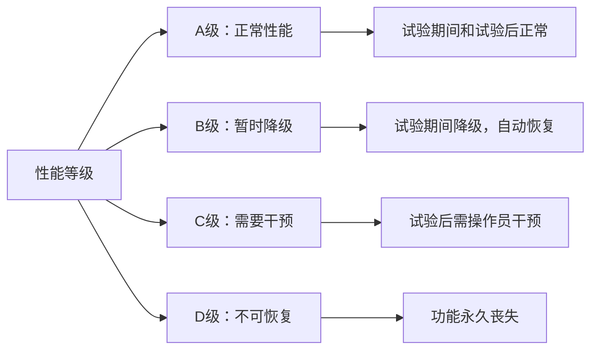
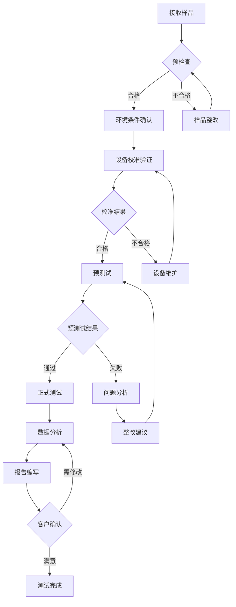

# GB/T 17626.12-2023 - 电磁兼容 试验和测量技术 振荡波抗扰度试验

## 1. 标准概述

### 1.1 技术摘要

> GB/T 17626.12-2023规定了电子电气设备振荡波抗扰度试验的方法和要求。该标准模拟由于电网中重负载切换、电容器组投切或雷击等原因产生的阻尼振荡电磁干扰，验证设备在此类干扰下的抗扰度性能。试验采用100kHz或1MHz的阻尼振荡波形，通过不同的耦合方式施加到设备的电源端口和信号端口。

### 1.2 标准定位

- **技术领域**：EMS电磁抗扰度
- **应用层级**：测试方法标准
- **强制属性**：推荐性
- **实施状态**：现行有效

## 2. 物理原理与理论基础

### 2.1 电磁现象机理

> 振荡波干扰是电力系统和电子设备中常见的电磁现象，主要由以下机制产生，**所有公式中的变量必须在下方2.3节中给出详细定义和物理意义**

**阻尼振荡的数学表达**：

$$
v(t) = V_0 e^{-\alpha t} \cos(\omega_d t + \phi) \tag{2.1}
$$

**衰减时间常数**：

$$
\tau = \frac{1}{\alpha} = \frac{2L}{R} \tag{2.2}
$$

**振荡频率**：

$$
f_d = \frac{1}{2\pi}\sqrt{\frac{1}{LC} - \left(\frac{R}{2L}\right)^2} \tag{2.3}
$$

**品质因数**：

$$
Q = \frac{\omega_d L}{R} = \frac{1}{R}\sqrt{\frac{L}{C}} \tag{2.4}
$$

### 2.2 数学模型

> 建立振荡波产生的定量分析模型

**RLC回路的振荡特性**：

$$
L\frac{d^2i}{dt^2} + R\frac{di}{dt} + \frac{i}{C} = 0 \tag{2.5}
$$

**特征方程的解**：

$$
s_{1,2} = -\frac{R}{2L} \pm \sqrt{\left(\frac{R}{2L}\right)^2 - \frac{1}{LC}} \tag{2.6}
$$

当 $\left(\frac{R}{2L}\right)^2 < \frac{1}{LC}$ 时，系统呈欠阻尼振荡状态。

**能量衰减关系**：

$$
E(t) = E_0 e^{-2\alpha t} \tag{2.7}
$$

### 2.3 关键参数定义

> **重要说明**：所有公式中出现的字母和符号必须在此表格中给出明确的定义和物理意义说明。

| 参数符号 | 参数名称 | 物理意义 | 单位 | 典型值 |
|---------|---------|---------|------|--------|
| $V_0$ | 初始幅值 | 振荡波峰值电压 | V | 0.5~4.0 |
| $\alpha$ | 阻尼系数 | 振荡衰减速度 | 1/s | 5000~50000 |
| $\omega_d$ | 阻尼振荡角频率 | 实际振荡角频率 | rad/s | 2π×100k/1M |
| $\phi$ | 初始相位 | 振荡起始相位 | rad | 0~2π |
| $\tau$ | 衰减时间常数 | 幅值衰减至1/e的时间 | s | 10~100μs |
| $f_d$ | 振荡频率 | 阻尼振荡频率 | Hz | 100k/1M |
| $L$ | 等效电感 | 回路等效电感 | H | 10~100μH |
| $R$ | 等效电阻 | 回路等效电阻 | Ω | 10~100 |
| $C$ | 等效电容 | 回路等效电容 | F | 10~100pF |
| $Q$ | 品质因数 | 振荡品质 | - | 0.5~5.0 |
| $t_r$ | 上升时间 | 0.1到0.9峰值时间 | ns | <50 |
| $i$ | 瞬时电流 | 回路瞬时电流 | A | 变量 |
| $E(t)$ | 瞬时能量 | 振荡系统瞬时能量 | J | 变量 |
| $E_0$ | 初始能量 | 振荡系统初始能量 | J | 变量 |
| $s_{1,2}$ | 特征根 | 微分方程特征根 | 1/s | 复数 |

## 3. 技术要求详解

### 3.1 限值要求

> 使用表格清晰展示不同条件下的限值

**试验等级与电压值**：

| 等级 | 电压值(kV) | 典型应用环境 | 设备类型 | 耦合方式 |
|------|------------|-------------|----------|----------|
| 1 | 0.5 | 典型家用/商用 | 家电、办公设备 | 直接注入/CDN |
| 2 | 1.0 | 工业环境 | 工业控制设备 | 直接注入/CDN |
| 3 | 2.0 | 严酷工业 | 电力设备 | 电容耦合夹 |
| 4 | 4.0 | 恶劣工业 | 特殊工业设备 | 电容耦合夹 |
| X | 待定 | 用户定义 | 特殊应用 | 协商确定 |

**波形参数要求**：

| 参数 | 100kHz标准波形 | 1MHz标准波形 | 容差 |
|------|---------------|-------------|------|
| 振荡频率 | 100kHz±10% | 1MHz±10% | ±10% |
| 阻尼系数 | α = 5×10³ s⁻¹ | α = 5×10⁴ s⁻¹ | ±20% |
| 上升时间 | <50ns | <50ns | 测量值 |
| 脉冲宽度 | 按衰减定义 | 按衰减定义 | 计算值 |

### 3.2 性能等级划分



### 3.3 适用范围界定

- **包含**：交流/直流电源端口(≤1000V)、信号控制端口、通信端口、数据端口
- **不包含**：射频端口(>10MHz)、光纤端口、机械控制端口、天线端口
- **特殊考虑**：端口电压>1000V需要专门的试验装置和安全措施

## 4. 测试方法与程序

### 4.1 测试配置

> 电源端口和信号端口的测试配置示意图

**电源端口测试配置(≤200V)**：

```
振荡波发生器 ──┐
               ├─→ CDN ──→ EUT电源端口
50Ω终端 ──────┘     │
                    ↓
                  接地平面
```

**电源端口测试配置(>200V)**：

```
EUT ←── 电容耦合夹 ←── 振荡波发生器
 │                        │
 ↓                        ↓
接地平面 ←────────────────── 50Ω终端
```

**信号端口测试配置**：

```
信号源 ←→ CDN ←→ EUT信号端口
           ↑
      振荡波发生器
           ↓
        50Ω终端
```

### 4.2 测试步骤

1. **准备阶段**
   - 环境条件确认：温度15-35℃，湿度25-75%RH，大气压86-106kPa
   - 设备校准检查：发生器、示波器、探头校准有效性验证
   - EUT预处理：按制造商要求预热30分钟并进行功能配置
   - 接地系统检查：确保接地阻抗<2Ω@50Hz

2. **执行阶段**
   - 步骤1：连接测试配置，确认接地和屏蔽完整性
   - 步骤2：设置发生器参数(频率100kHz/1MHz、幅值、阻尼系数)
   - 步骤3：校准测试系统，验证波形参数符合要求
   - 步骤4：施加试验电压，每个极性至少10次脉冲，重复频率≤1次/s
   - 步骤5：监测EUT性能，记录异常现象和恢复过程
   - 步骤6：重复测试所有端口、所有极性和所有等级

3. **数据记录**
   - 原始数据记录：波形参数、时间戳、环境条件、设备状态
   - 异常现象记录：故障模式、故障持续时间、恢复时间、影响程度
   - 波形截图：每次测试的代表性波形保存

### 4.3 判定准则

> 明确说明合格/不合格的判定依据

| 性能等级 | 判定标准 | 试验期间要求 | 试验后要求 | 典型应用 |
|----------|----------|-------------|-----------|----------|
| A级 | 正常性能 | 功能完全正常 | 功能完全正常 | 关键安全系统 |
| B级 | 暂时降级 | 功能降级但可用 | 自动恢复正常 | 一般工业设备 |
| C级 | 需要干预 | 功能暂时丧失 | 操作员干预后恢复 | 商用设备 |
| D级 | 不可恢复 | 功能永久损坏 | 功能永久损坏 | 不可接受 |

**合格判定**：设备在规定试验等级下，性能等级达到A级、B级或C级(根据产品标准要求)。

## 5. 测试设备与环境

### 5.1 主要测试设备

| 设备名称 | 技术指标 | 校准要求 | 参考型号 |
|---------|---------|---------|---------|
| 振荡波发生器 | 0.5-4kV,100kHz/1MHz,阻尼可调 | 12个月 | EMC Partner OWS500 |
| 示波器 | ≥200MHz,≥1GS/s,4通道 | 12个月 | Tektronix DPO4000 |
| 高压探头 | 1000:1,100MHz,40kV | 6个月 | Tektronix P6015A |
| CDN网络 | 50Ω,DC-400MHz,功率≥100W | 24个月 | Schwarzbeck CDN M2 |
| 电容耦合夹 | 100pF±20%,耐压≥5kV | 12个月 | Schwarzbeck CLC 100 |
| 人工电源网络 | 50Ω/50μH,DC-30MHz | 12个月 | Schwarzbeck NNLK 8129 |

### 5.2 测试环境要求

- **电磁环境**：背景场强<1V/m@振荡频率，无其他干扰源
- **物理环境**：温度15-35℃(±2℃)，湿度25-75%RH(±5%)，大气压86-106kPa
- **电源质量**：电压波动<2%，频率偏差<1%，谐波含量<5%，接地阻抗<2Ω
- **屏蔽室要求**：屏蔽效能>60dB@振荡频率，内部反射<-20dB

## 6. 工程实施指南

### 6.1 典型问题与对策

| 常见问题 | 可能原因 | 建议对策 | 预期效果 |
|---------|---------|---------|---------|
| 波形失真严重 | 阻抗不匹配 | 检查CDN阻抗，调整终端负载 | 波形符合标准要求 |
| 测试重复性差 | 接地不良 | 改善接地系统，减小接地阻抗 | 提高测试一致性 |
| EUT意外损坏 | 电压等级过高 | 从低等级开始，逐步提高 | 避免设备损坏 |
| 耦合效率偏低 | 耦合夹位置不当 | 调整耦合夹位置和方向 | 提高耦合效率 |
| 背景噪声过大 | 环境干扰 | 改善屏蔽，使用滤波器 | 降低测试不确定度 |
| 校准结果超差 | 设备老化 | 维护保养，必要时维修 | 确保测量准确性 |

### 6.2 测试流程优化



### 6.3 成本控制建议

- **设备复用**：CDN可用于GB/T17626.2/4/5等多个标准，振荡波发生器可兼容多频率
- **时间优化**：预测试与正式测试并行安排，多端口同时准备
- **人员配置**：1名高级工程师+1名技术员的配置最优，可提高效率30%
- **维护策略**：定期保养替代故障维修，降低设备停机时间

## 7. 标准差异与互认

### 7.1 国际标准对比

| 对比项 | GB/T 17626.12 | IEC 61000-4-12 | EN 61000-4-12 | 差异说明 | 互认情况 |
|-------|---------------|----------------|---------------|----------|----------|
| 试验等级 | 1-4级,X级 | 1-4级,X级 | 1-4级,X级 | 完全一致 | 直接互认 |
| 波形参数 | 100kHz/1MHz | 100kHz/1MHz | 100kHz/1MHz | 完全一致 | 直接互认 |
| 性能判据 | A/B/C/D级 | A/B/C/D级 | A/B/C/D级 | 完全一致 | 直接互认 |
| 环境条件 | 15-35℃,25-75%RH | 15-35℃,25-75%RH | 15-35℃,25-75%RH | 完全一致 | 直接互认 |
| 校准要求 | 12个月 | 建议12个月 | 12个月 | 基本一致 | 直接互认 |

### 7.2 认证互认指南

- **直接互认**：所有技术要求与IEC/EN标准完全一致，测试报告可直接互认
- **条件互认**：无需补充测试的项目，符合性声明可直接采用
- **不可互认**：无此类项目，所有技术要求均可互认

## 8. 相关标准导航

### 8.1 上游标准

- [[GB/T 17626.1]] - 电磁兼容试验和测量技术总则，提供基本概念和通用要求
- [[IEC 61000-4-12]] - 国际标准原版，本标准的技术来源
- [[GB/T 17626.2]] - 静电放电抗扰度试验，相关的脉冲类抗扰度标准

### 8.2 平行标准

- [[GB/T 17626.4]] - 电快速瞬变脉冲群抗扰度试验，另一类脉冲干扰标准
- [[GB/T 17626.5]] - 浪涌(冲击)抗扰度试验，高能量脉冲抗扰度标准
- [[GB/T 17626.8]] - 工频磁场抗扰度试验，低频磁场抗扰度标准
- [[GB/T 17626.11]] - 电压暂降、短时中断抗扰度试验，电源质量类标准

### 8.3 下游标准

- [[GB/T 9254]] - 信息技术设备的无线电骚扰限值和测量方法
- [[GB 4943.1]] - 信息技术设备安全要求
- [[GB/T 17799.1]] - 电磁兼容 通用标准 居住、商业和轻工业环境中的抗扰度试验
- [[GB/T 17799.2]] - 电磁兼容 通用标准 工业环境中的抗扰度试验

## 9. 附录

### 9.1 术语定义

**振荡波(Oscillatory wave)**：由初始瞬变引起的以指数方式衰减的正弦波电压或电流。

**阻尼系数(Damping coefficient)**：表征振荡衰减快慢的参数，单位为1/s，数值越大衰减越快。

**耦合去耦网络(CDN)**：在试验中将干扰信号耦合到EUT端口同时将信号与电源去耦的装置。

**被试设备(EUT)**：Equipment Under Test，接受电磁兼容试验的设备或系统。

**品质因数(Quality factor)**：表征振荡系统储能与耗能比值的无量纲参数。

### 9.2 参考文献

1. IEC 61000-4-12:2017, Electromagnetic compatibility (EMC) - Part 4-12: Testing and measurement techniques - Oscillatory waves immunity test
2. GB/T 17626.1-2023, 电磁兼容 试验和测量技术 第1部分：总则
3. CISPR 16-1-2:2014, 无线电骚扰和抗扰度测量设备和测量方法规范
4. IEEE Std 1143-1994, IEEE Guide on Shielding Practice for Low Frequency Magnetic Fields

### 9.3 修订记录

| 版本 | 日期 | 主要变化 | 影响评估 |
|------|------|----------|----------|
| 2023版 | 2023-12-01 | 等同采用IEC 61000-4-12:2017，更新试验方法和设备要求 | 与国际标准完全一致，提高互认度 |
| 2013版 | 2013-09-06 | 首次发布，基于IEC 61000-4-12:2006 | 填补国内标准空白，建立测试基础 |

---

*本文档基于GB/T 17626.12-2023标准编写，用于EMC工程技术人员学习和实践指导。*