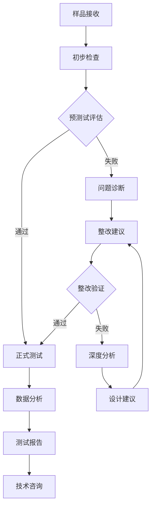

# GB/T 17626.13-2022 - 电磁兼容 试验和测量技术 第13部分：谐波和间谐波的抗扰度试验

## 1. 标准概述

### 1.1 技术摘要

本标准规定了对连接到交流电源的电气和电子设备进行谐波和间谐波抗扰度试验的方法。标准涵盖了频率范围为15Hz至2kHz（50Hz系统）或15Hz至2.4kHz（60Hz系统）的谐波和间谐波信号，以及载波信号的抗扰度测试。适用于额定电流不超过16A每相的设备。

### 1.2 标准定位

- **技术领域**：EMS电磁抗扰度
- **应用层级**：测试方法标准
- **强制属性**：推荐性标准
- **实施状态**：现行有效

## 2. 物理原理与理论基础

### 2.1 谐波和间谐波机理

谐波是基波频率整数倍的正弦波分量，间谐波是非整数倍频率分量。在电力系统中，这些分量由非线性负载产生，对电子设备可能造成干扰。

**谐波频率**：
$$f_h = n \cdot f_0$$

其中：
- $f_h$ = 谐波频率 (Hz)
- $n$ = 谐波次数 (整数)
- $f_0$ = 基波频率 (50Hz或60Hz)

**间谐波频率**：
$$f_{ih} = m \cdot f_0$$

其中：
- $f_{ih}$ = 间谐波频率 (Hz)
- $m$ = 非整数倍数
- $f_0$ = 基波频率

### 2.2 总谐波畸变率

总谐波畸变率(THD)定义为：

$$THD = \frac{\sqrt{\sum_{h=2}^{40} V_h^2}}{V_1} \times 100\%$$

其中：
- $V_h$ = 第h次谐波有效值
- $V_1$ = 基波有效值

### 2.3 关键参数定义

| 参数符号 | 参数名称 | 物理意义 | 单位 | 典型值 |
|---------|---------|---------|------|--------|
| $f_0$ | 基波频率 | 电网基准频率 | Hz | 50/60 |
| $f_h$ | 谐波频率 | 基波整数倍频率 | Hz | 100-2500 |
| $V_h$ | 谐波电压 | 谐波分量有效值 | V | 0.1-50 |
| $THD$ | 总谐波畸变率 | 谐波含量相对值 | % | 5-15 |
| $I_{rated}$ | 额定电流 | 设备额定工作电流 | A | ≤16 |

## 3. 技术要求详解

### 3.1 频率范围要求

- **50Hz系统**：15Hz - 2000Hz
- **60Hz系统**：15Hz - 2400Hz
- **谐波次数**：2次 - 50次
- **间谐波分辨率**：≤5Hz

### 3.2 试验等级划分

| 等级 | 环境描述 | THD要求 | 典型应用场景 |
|------|----------|---------|-------------|
| 1级 | 保护良好环境 | 6%THD | 办公环境、住宅区 |
| 2级 | 典型工业环境 | 10%THD | 一般工业区、商业区 |
| 3级 | 严酷工业环境 | 15%THD | 重工业区、高压开关站 |
| X级 | 用户定义 | 用户指定 | 特殊应用环境 |

### 3.3 适用范围界定

- **包含**：额定电流≤16A每相的电气电子设备、50/60Hz交流电源连接设备、工业和民用电子设备
- **不包含**：大功率工业设备（>16A）、直流供电设备、特殊频率系统设备
- **特殊考虑**：变频器驱动设备需要额外考虑中间电路谐波

## 4. 测试方法与程序

### 4.1 测试配置示意图

```
电网电源 → 谐波发生器 → 功率放大器 → 耦合变压器 → 被试设备EUT
              ↓                                    ↓
         控制系统                              去耦网络
              ↓                                    ↓
         谐波分析仪 ← ← ← ← ← ← ← ← ← ← ← ← ← 监测端口
```

### 4.2 测试步骤

#### 4.2.1 准备阶段
1. **环境条件确认**
   - 温度：15-35°C（±2°C稳定性）
   - 湿度：45-75%RH（±5%稳定性）
   - 大气压力：86-106kPa

2. **设备校准检查**
   - 谐波发生器校准有效期验证
   - 功率放大器线性度检查
   - 谐波分析仪准确度确认

3. **EUT预处理**
   - 按制造商要求进行设备预热
   - 设置正常工作状态和负载条件
   - 建立性能基准参数

#### 4.2.2 执行阶段
1. **基准测试**
   - 在纯净正弦波电源下运行EUT
   - 记录所有关键性能参数
   - 确认设备正常工作状态

2. **谐波注入测试**
   - 从2次谐波开始，逐次增加到50次
   - 每个谐波频率点测试时间≥30秒
   - 记录EUT在每个频率点的响应

3. **间谐波扫描测试**
   - 在15Hz-2kHz/2.4kHz范围内扫描
   - 频率步进≤5Hz
   - 重点关注敏感频率点

4. **复合信号测试**
   - 施加多次谐波复合信号
   - 模拟实际电网条件
   - 验证累积效应影响

#### 4.2.3 数据记录
- **原始数据**：电压、电流、频率、相位、波形
- **性能参数**：功能状态、输出精度、响应时间
- **异常现象**：保护动作、误操作、性能降级

### 4.3 判定准则

| 性能级别 | 判定标准 | 典型现象 | 可接受性 |
|----------|----------|----------|----------|
| **A级** | 试验期间和试验后设备正常工作 | 无可见影响，所有功能正常 | 完全可接受 |
| **B级** | 试验期间性能暂时降级，试验后自动恢复 | 暂时精度下降，自动恢复 | 可接受 |
| **C级** | 试验期间性能暂时降级，需要操作人员干预 | 需要重启或重新设置 | 条件可接受 |
| **D级** | 设备损坏或数据丢失 | 硬件损坏，数据永久丢失 | 不可接受 |

## 5. 测试设备与环境

### 5.1 主要测试设备规格

| 设备名称 | 关键技术指标 | 校准周期 | 推荐型号 |
|---------|-------------|----------|----------|
| **谐波发生器** | 频率准确度±0.1%<br/>幅度准确度±2%<br/>频率范围15Hz-3kHz | 12个月 | Fluke 6105A<br/>Chroma 61845 |
| **功率放大器** | 输出功率≥2kVA<br/>THD<0.5%<br/>频率响应DC-5kHz | 12个月 | Amplifier Research 75A250<br/>EMC Partner UPA2000 |
| **谐波分析仪** | 准确度等级0.1级<br/>频率范围DC-50kHz<br/>谐波分析到50次 | 12个月 | Fluke 435-II<br/>Yokogawa WT5000 |
| **耦合变压器** | 绝缘等级CAT III<br/>频率范围15Hz-3kHz<br/>变比可调 | 24个月 | 定制隔离变压器 |
| **去耦网络** | 阻抗特性标准化<br/>频率范围15Hz-30MHz | 24个月 | Rohde & Schwarz ENV216 |

### 5.2 测试环境要求

#### 5.2.1 电磁环境
- **背景谐波**：THD < 3%
- **间谐波含量**：< 1%
- **电磁场干扰**：< 3V/m（30MHz-1GHz）
- **传导干扰**：符合CISPR 16-1-2要求

#### 5.2.2 物理环境
- **温度**：15-35°C（±2°C稳定性，24小时内变化<5°C）
- **相对湿度**：45-75%RH（±5%稳定性）
- **大气压力**：86-106kPa
- **振动**：加速度<0.5m/s²（5-150Hz）

#### 5.2.3 电源质量要求
- **电压稳定度**：±2%（1分钟内）
- **频率偏差**：±1%
- **电压不平衡度**：<2%
- **供电中断**：<1ms，频率<1次/小时

## 6. 工程实施指南

### 6.1 典型问题与解决方案

| 常见问题 | 根本原因 | 解决方案 | 预期效果 |
|---------|----------|----------|----------|
| **谐波信号失真严重** | 功率放大器进入非线性区 | 降低驱动电平，选用线性放大器 | THD改善到<0.5% |
| **低频耦合效率差** | 耦合变压器设计不当 | 优化铁芯材料和匝数比 | 耦合效率提升至>90% |
| **测量结果重现性差** | 接地系统阻抗过高 | 建立专用RF接地网，阻抗<0.1Ω | 重现性提升至±3% |
| **背景干扰超标** | 电源质量差，谐波含量高 | 安装有源电力滤波器 | 背景THD降至<3% |
| **EUT工作不稳定** | 电源电压波动大 | 使用精密稳压电源 | 电压稳定度达到±1% |

### 6.2 测试流程优化



### 6.3 成本效益分析

#### 6.3.1 设备投资优化
- **核心设备复用**：谐波发生器可用于多个17626系列测试
- **模块化配置**：根据测试需求灵活配置功率等级
- **自动化程度**：提高测试效率，降低人工成本

#### 6.3.2 测试效率提升
- **批量测试**：相同类型产品集中测试
- **并行处理**：多台设备同时预处理
- **标准化程序**：减少重复性工作

#### 6.3.3 人员配置建议
- **标准配置**：1名高级EMC工程师 + 1名测试技术员
- **培训投入**：定期技术培训，提升专业水平
- **认证要求**：测试人员需具备相关资质认证

## 7. 标准对比与互认

### 7.1 国际标准详细对比

| 对比项目 | GB/T 17626.13-2022 | IEC 61000-4-13:2002 | EN 61000-4-13:2002 | 差异分析 |
|----------|-------------------|---------------------|-------------------|----------|
| **频率范围** | 15Hz-2kHz/2.4kHz | 15Hz-2kHz/2.4kHz | 15Hz-2kHz/2.4kHz | 完全一致 |
| **电流限制** | ≤16A每相 | ≤16A每相 | ≤16A每相 | 完全一致 |
| **试验等级** | 1,2,3,X级 | 1,2,3,X级 | 1,2,3,X级 | 完全一致 |
| **THD要求** | 6%,10%,15% | 6%,10%,15% | 6%,10%,15% | 完全一致 |
| **性能判据** | A,B,C,D级 | A,B,C,D级 | A,B,C,D级 | 完全一致 |
| **测试程序** | 标准化程序 | 标准化程序 | 标准化程序 | 技术等同 |

### 7.2 区域标准适应性

| 国家/地区 | 对应标准 | 互认状态 | 特殊要求 |
|-----------|----------|----------|----------|
| **欧盟** | EN 61000-4-13:2002 | 直接互认 | CE标志认证 |
| **美国** | 无直接对应 | 部分认可 | 需补充FCC Part 15测试 |
| **日本** | JIS C 61000-4-13:2007 | 条件互认 | 需要VCCI补充测试 |
| **韩国** | KS C IEC 61000-4-13:2009 | 直接互认 | KC认证要求 |
| **澳大利亚** | AS/NZS 61000.4.13:2006 | 直接互认 | ACMA认证 |

### 7.3 认证互认实施指南

#### 7.3.1 直接互认项目
- 欧盟CE认证（LVD+EMC指令）
- 韩国KC认证（EMC部分）
- 澳大利亚C-Tick认证

#### 7.3.2 条件互认项目
- 日本VCCI认证：需要补充特定频率点测试
- 加拿大IC认证：需要补充Class A/B限值测试
- 新加坡PSB认证：需要热带环境条件测试

#### 7.3.3 不可互认项目
- 美国FCC认证：测试方法和限值差异较大
- 印度BIS认证：需要完全按照印度标准重新测试

## 8. 相关标准体系导航

### 8.1 上游基础标准

- **[[GB_T_17626_1]]** - 电磁兼容试验总论
  - 关系：提供通用概念、术语定义和基本要求
  - 引用内容：试验环境条件、设备通用要求、性能判据基本原则

- **[[IEC_61000-4-7]]** - 谐波和间谐波测量通用指南
  - 关系：提供测量方法学理论基础
  - 引用内容：测量算法、窗函数选择、不确定度评估方法

### 8.2 平行系列标准

- **[[GB_T_17626_2]]** - 静电放电抗扰度试验
  - 关系：同属EMS抗扰度测试系列
  - 技术关联：都涉及电源端口抗扰度，可组合测试

- **[[GB_T_17626_4]]** - 电快速瞬变脉冲群抗扰度试验
  - 关系：互补的电源端口抗扰度测试
  - 技术关联：频率范围互补（高频vs低频）

- **[[GB_T_17626_11]]** - 电压暂降抗扰度试验
  - 关系：电源质量相关的抗扰度测试
  - 技术关联：都评估电源电压变化对设备的影响

### 8.3 下游应用标准

- **[[GB_4343_1]]** - 家用电器EMC要求
  - 关系：具体产品类别的EMC标准
  - 引用关系：引用本标准作为测试方法

- **[[GB_9254]]** - 信息技术设备EMC要求
  - 关系：IT设备专用EMC标准
  - 引用关系：部分产品需要进行谐波抗扰度测试

- **[[GB_T_18655]]** - 车辆EMC要求
  - 关系：汽车电子EMC标准
  - 技术关联：车载电子设备需要考虑车辆电源系统谐波

### 8.4 国际对应标准

- **[[IEC_61000-4-13]]** - 国际电工委员会对应标准
  - 关系：等同采用的国际标准
  - 技术内容：完全一致

- **[[CISPR_16-2-1]]** - 抗扰度测量方法
  - 关系：测量设备和方法的技术规范
  - 引用关系：测量设备技术要求参考

## 9. 附录

### 9.1 核心术语定义

**谐波(Harmonics)**
频率为基波频率整数倍的正弦波分量。对于50Hz系统，2次谐波为100Hz，3次谐波为150Hz，以此类推。

**间谐波(Interharmonics)**
频率为基波频率非整数倍的正弦波分量。这些分量通常由变频器、电弧炉等设备产生。

**总谐波畸变率(THD - Total Harmonic Distortion)**
所有谐波分量有效值的平方和的平方根与基波有效值的比值，以百分比表示。

**载波信号(Mains Signaling)**
叠加在电力线上用于信息传输的高频信号，频率通常在几百Hz到几kHz范围内。

**抗扰度(Immunity)**
设备在电磁环境中能够正常工作而不出现性能降级的能力。

### 9.2 重要参考文献

1. **IEC 61000-4-13:2002** - Electromagnetic compatibility (EMC) - Part 4-13: Testing and measurement techniques - Harmonics and interharmonics including mains signalling at a.c. power port, low frequency immunity tests

2. **IEEE 519-2014** - IEEE Recommended Practice and Requirements for Harmonic Control in Electric Power Systems

3. **IEC 61000-4-7:2002** - Electromagnetic compatibility (EMC) - Part 4-7: Testing and measurement techniques - General guide on harmonics and interharmonics measurements

4. **CISPR 16-2-1:2014** - Specification for radio disturbance and immunity measuring apparatus and methods - Part 2-1: Methods of measurement of disturbances and immunity - Conducted disturbance measurements

5. **GB/T 14549-1993** - 电能质量 公用电网谐波

### 9.3 标准演进历史

| 版本 | 发布日期 | 主要技术变化 | 影响评估 |
|------|----------|-------------|----------|
| **2022版** | 2022-03-01 | 等同采用IEC 61000-4-13:2002<br/>增加测量不确定度要求<br/>完善校准周期规定 | 提高与国际标准一致性<br/>增强测试结果可信度 |
| **2006版** | 2006-05-01 | 首次发布国家标准<br/>建立基本测试框架<br/>确定试验等级和判据 | 填补国内标准空白<br/>建立测试能力基础 |

### 9.4 未来发展方向

1. **频率范围扩展**：随着电力电子技术发展，可能需要扩展到更高频率范围

2. **新兴应用领域**：电动汽车充电、储能系统、智能电网等新兴领域的特殊要求

3. **测试自动化**：提高测试效率，减少人为误差

4. **不确定度评估**：建立完整的测量不确定度评估体系

5. **国际协调**：加强与国际标准的技术协调，推动标准国际化