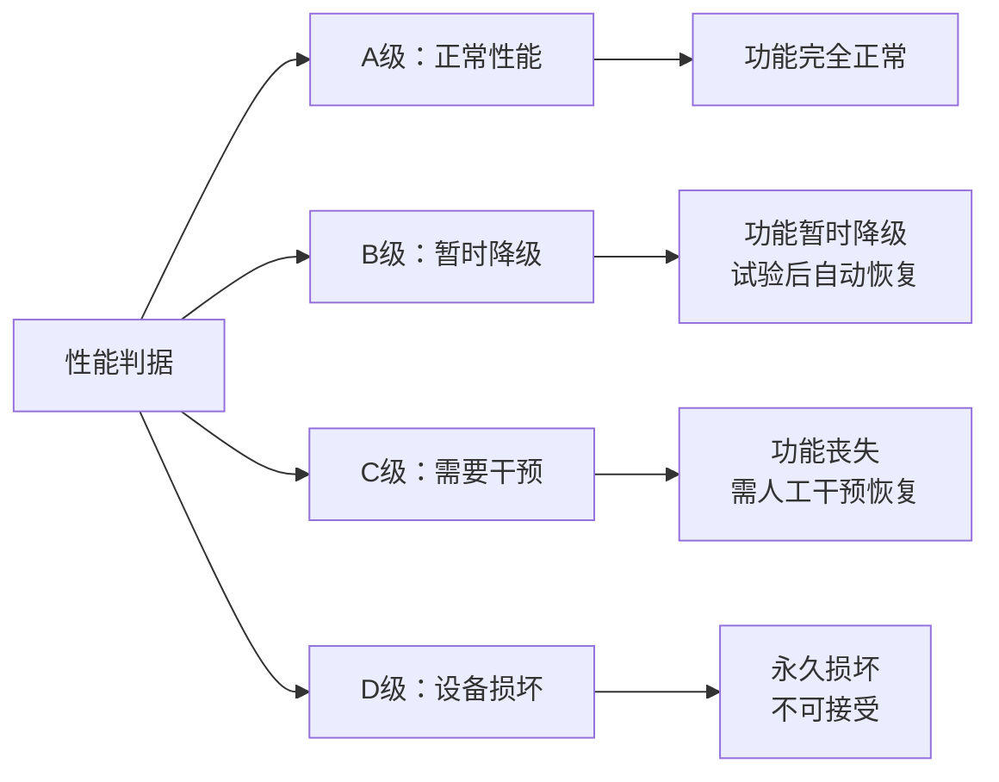
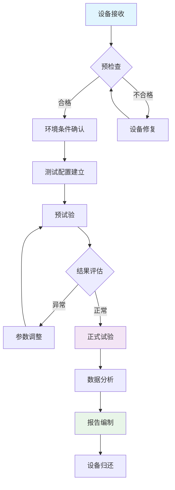

# GB/T17626.14-2005 - 电磁兼容 试验和测量技术 电压波动抗扰度试验

## 1. 标准概述

### 1.1 技术摘要

> 本标准规定了电气和电子设备对工频电压波动的抗扰度试验方法。电压波动是指交流电源电压幅值在0.1Hz至35Hz频率范围内发生周期性变化的现象，变化幅度为额定电压的1%至10%。标准等同采用IEC 61000-4-14:1999，适用于额定电流不大于16A且连接到50Hz交流电网的各类电气电子设备。

### 1.2 标准定位

- **技术领域**：EMS电磁抗扰度
- **应用层级**：基础测试方法标准
- **强制属性**：推荐性国家标准
- **实施状态**：现行有效

## 2. 物理原理与理论基础

### 2.1 电磁现象机理

电压波动是电力系统中常见的电能质量问题，主要由大功率设备的周期性负载变化引起。其物理本质是工频电压幅值的周期性变化：

$$
U(t) = U_0[1 + m \cdot \sin(2\pi f_m t + \phi)]
$$

电压波动对敏感设备的影响可通过传递函数描述：

$$
H(f_m) = \frac{Y(f_m)}{X(f_m)} = \frac{\Delta P/P_0}{\Delta U/U_0}
$$

### 2.2 数学模型

设备对电压波动的敏感度随频率变化，可用频域响应模型表示：

$$
S(f_m) = \left|\frac{G(j\omega_m)}{1 + G(j\omega_m)H(j\omega_m)}\right|
$$

其中 $\omega_m = 2\pi f_m$ 为角频率。

对于线性负载，功率变化与电压变化的关系为：

$$
\frac{\Delta P}{P_0} = n \cdot \frac{\Delta U}{U_0}
$$

其中n为负载特性指数（阻性负载n=2，恒功率负载n=0）。

### 2.3 关键参数定义

> **重要说明**：所有公式中出现的字母和符号必须在此表格中给出明确的定义和物理意义说明。

| 参数符号 | 参数名称 | 物理意义 | 单位 | 典型值 |
|---------|---------|---------|------|--------|
| $U(t)$ | 瞬时电压 | 包含波动的实际电压值 | V | 207-253V |
| $U_0$ | 额定电压 | 设备标称工作电压 | V | 230V |
| $m$ | 调制深度 | 电压波动的相对幅度 | % | 1-10% |
| $f_m$ | 调制频率 | 电压波动的重复频率 | Hz | 0.1-35Hz |
| $\phi$ | 初始相位 | 波动信号的起始相位角 | rad | 0-2π |
| $H(f_m)$ | 传递函数 | 设备对波动的频域响应 | - | 复数函数 |
| $S(f_m)$ | 敏感度函数 | 频率相关的敏感度系数 | - | 0.1-10 |
| $n$ | 负载指数 | 负载功率与电压的关系指数 | - | 0-2 |
| $\Delta P$ | 功率变化量 | 由电压波动引起的功率变化 | W | 测量值 |
| $P_0$ | 额定功率 | 设备标称功率消耗 | W | 设备参数 |

## 3. 技术要求详解

### 3.1 限值要求

电压波动试验等级按严酷度递增排列，各等级对应的技术参数如下：

| 试验等级 | 电压波动幅度 | 波动频率范围 | 试验持续时间 | 典型应用环境 |
|---------|-------------|------------|------------|-------------|
| 1级 | ±2% | 0.1-35Hz | ≥1分钟 | 保护良好的电磁环境 |
| 2级 | ±5% | 0.1-35Hz | ≥1分钟 | 工业环境，有一定干扰 |
| 3级 | ±10% | 0.1-35Hz | ≥1分钟 | 严酷工业环境 |
| X级 | 用户指定 | 0.1-35Hz | 用户指定 | 特殊应用要求 |

### 3.2 性能等级划分



### 3.3 适用范围界定

- **包含**：
  - 额定电流不大于16A的单相和三相设备
  - 连接到50Hz交流电网的各类电气电子设备
  - 工业控制设备、家用电器、医疗设备、IT设备
- **不包含**：
  - 内置不间断电源(UPS)的设备
  - 额定电流大于16A的大功率设备
  - 直流供电设备
- **特殊考虑**：
  - 三相设备需对每相分别进行试验
  - 多电源输入设备需对每个电源输入分别试验

## 4. 测试方法与程序

### 4.1 测试配置

试验配置采用直接注入法，通过电压波动发生器在交流电源与被试设备之间产生所需的电压波动：

```
┌─────────────┐    ┌────────────────────┐    ┌─────────────┐
│  交流电源   │────│  电压波动发生器    │────│  被试设备   │
│  AC Power   │    │  Voltage Fluctu-   │    │    EUT      │
│   Supply    │    │  ation Generator   │    │             │
└─────────────┘    └────────────────────┘    └─────────────┘
       │                      │                      │
       │            ┌─────────────────┐              │
       └────────────│   监测设备      │──────────────┘
                    │ Monitoring Equip │
                    └─────────────────┘
```

### 4.2 测试步骤

1. **准备阶段**
   - 环境条件确认：温度16-35℃，湿度45-75%RH，气压86-106kPa
   - 设备校准检查：所有测试设备应在有效校准期内
   - EUT预处理：被试设备预热30分钟，确保工作状态稳定
   - 背景测量：测量并记录背景电磁环境

2. **执行阶段**
   - 步骤1：设置电压波动发生器输出参数（幅度、频率）
   - 步骤2：按选定试验等级施加电压波动，监测EUT工作状态
   - 步骤3：在每个波动频率点持续试验不少于1分钟
   - 步骤4：记录EUT响应，包括功能状态、输出参数变化等
   - 步骤5：如发现异常，延长观察时间至3分钟

3. **数据记录**
   - 试验条件：温度、湿度、电源参数、波动参数
   - EUT响应：功能状态变化、输出参数偏移、异常现象
   - 时间记录：各阶段试验时间、异常发生时刻

### 4.3 判定准则

根据试验期间和试验后EUT的工作状态，按以下准则进行性能等级判定：

- **A级（优秀）**：试验期间设备功能完全正常，所有参数在规定范围内
- **B级（良好）**：试验期间功能暂时降级但仍可接受，试验后自动恢复正常
- **C级（合格）**：试验期间功能暂时丧失，试验后需操作人员干预才能恢复
- **D级（不合格）**：设备永久损坏或功能永久丧失，不可接受

## 5. 测试设备与环境

### 5.1 主要测试设备

| 设备名称 | 技术指标 | 校准要求 | 参考型号 |
|---------|---------|---------|---------|
| 电压波动发生器 | 输出精度±1%<br/>频率范围0.1-35Hz<br/>输出功率≥5kVA | 12个月校准周期<br/>溯源至国家基准 | Teseq NSG 5500<br/>EM Test VDS200 |
| 数字电压表 | 精度±0.5%<br/>响应时间<100ms<br/>分辨率0.1V | 12个月校准周期<br/>4½位以上精度 | Fluke 8846A<br/>Keysight 34461A |
| 电能质量分析仪 | THD测量精度<0.1%<br/>采样率≥10kHz<br/>频率精度±0.01Hz | 12个月校准周期<br/>IEC61000-4-30 A级 | Fluke 435-II<br/>Dranetz HDPQ Xplorer |
| 示波器 | 带宽≥200MHz<br/>采样率≥1GSa/s<br/>垂直精度±2% | 12个月校准周期<br/>探头单独校准 | Tektronix DPO4034<br/>Keysight DSOX3024T |

### 5.2 测试环境要求

- **电磁环境**：
  - 背景电磁场强度<3V/m（30MHz-1GHz）
  - 工频磁场<0.3mT
  - 射频传导骚扰<126dBμV（0.15-30MHz）
- **物理环境**：
  - 温度：16-35℃，变化率<1℃/h
  - 相对湿度：45-75%RH，变化率<5%/h
  - 大气压力：86-106kPa
- **电源质量**：
  - 电压稳定度：±1%
  - 频率稳定度：±0.1Hz
  - 总谐波畸变率：THD<5%
  - 电压不平衡度：<2%（三相系统）

## 6. 工程实施指南

### 6.1 典型问题与对策

| 常见问题 | 可能原因 | 建议对策 | 预期效果 |
|---------|---------|---------|---------|
| 设备频繁重启 | 电压跌落超过允许范围 | 1.增加输入稳压装置<br/>2.提高电源模块保持时间 | 提高抗扰度1-2个等级 |
| 数据存储异常 | 存储器对电压变化敏感 | 1.增加储能电容<br/>2.采用电池备份 | 消除数据丢失风险 |
| 通信中断 | 接口电路电压敏感 | 1.优化接口电路设计<br/>2.增加隔离变压器 | 提高通信可靠性 |
| 显示闪烁 | 背光电源不稳定 | 1.改进背光驱动电路<br/>2.增加滤波电容 | 改善用户体验 |
| 测量误差增大 | 参考电压源不稳定 | 1.使用精密稳压电源<br/>2.增加软件校正算法 | 维持测量精度 |

### 6.2 测试流程优化



### 6.3 成本控制建议

- **设备复用**：
  - 电压波动发生器可用于多项抗扰度试验
  - 监测设备与其他EMC试验共用
  - 屏蔽室可进行多种EMC试验
- **时间优化**：
  - 多台设备并行测试（如条件允许）
  - 预试验与正式试验合理安排
  - 批量设备统一安排测试计划
- **人员配置**：
  - 1名主试验员+1名助理的标准配置
  - 复杂设备需增加1名产品专家
  - 培训合格的技术人员降低外包成本

## 7. 标准差异与互认

### 7.1 国际标准对比

| 对比项 | GB/T17626.14 | IEC61000-4-14 | EN61000-4-14 | 差异说明 | 互认情况 |
|--------|--------------|---------------|--------------|----------|----------|
| 适用范围 | 额定电流≤16A | 额定电流≤16A | 额定电流≤16A | 完全一致 | 直接互认 |
| 电压等级 | 230V/400V | 通用 | 230V/400V | 本地化适配 | 直接互认 |
| 频率范围 | 0.1-35Hz | 0.1-35Hz | 0.1-35Hz | 完全一致 | 直接互认 |
| 试验等级 | 1,2,3,X | 1,2,3,X | 1,2,3,X | 完全一致 | 直接互认 |
| 性能判据 | A,B,C,D | A,B,C,D | A,B,C,D | 完全一致 | 直接互认 |
| 测试设备 | 精度±1% | 精度±1% | 精度±1% | 完全一致 | 直接互认 |

### 7.2 认证互认指南

- **直接互认**：
  - 欧盟CE认证中的EMC指令要求
  - 美国FCC认证的相关项目
  - 加拿大IC认证的对应要求
- **条件互认**：
  - 澳洲ACMA认证需补充本地电压等级测试
  - 日本VCCI认证需确认试验实验室资质
- **不可互认**：
  - 特殊行业标准（如航空、军用）需重新测试
  - 某些发展中国家要求本地实验室测试

## 8. 相关标准导航

### 8.1 上游标准

- [[GB_T_17626_1]] - 电磁兼容 试验和测量技术 总则
  > 提供EMC试验的基本原则、术语定义和通用要求
- [[IEC_61000_4_30]] - 电磁兼容 试验和测量技术 电能质量测量方法  
  > 规定电压波动等电能质量参数的标准测量方法

### 8.2 平行标准

- [[GB_T_17626_11]] - 电磁兼容 试验和测量技术 电压暂降、短时中断和电压变化抗扰度试验
  > 处理更严重的电压扰动现象，与本标准形成技术互补
- [[IEC_61000_3_3]] - 电磁兼容 第3-3部分：限值 低压供电系统中电压波动和闪烁的限制
  > 从发射限值角度规范电压波动，与抗扰度要求配套实施

### 8.3 下游标准

- [[GB_4343_1]] - 家用电器、电动工具和类似器具的电磁兼容要求 第1部分：发射
  > 引用本标准作为家用电器抗扰度要求的技术依据
- [[GB_T_18655]] - 车辆、船和内燃机 无线电骚扰特性 用于保护车外接收机的限值和测量方法
  > 汽车电子产品EMC认证中引用本标准的试验方法

## 9. 附录

### 9.1 术语定义

- **电压波动（Voltage fluctuation）**：工频电压幅值在0.1Hz至35Hz频率范围内发生的周期性或随机性变化
- **调制深度（Modulation depth）**：电压波动幅度与额定电压的百分比，用于量化波动强度
- **抗扰度（Immunity）**：设备、装置或系统在电磁干扰存在下仍能正常工作的能力
- **严酷度等级（Severity level）**：用数字表示的电磁干扰强度等级，等级越高干扰越强
- **性能判据（Performance criteria）**：评价设备在电磁干扰下工作状态的分级标准

### 9.2 参考文献

1. IEC 61000-4-14:1999, Electromagnetic compatibility - Testing and measurement techniques - Voltage fluctuation immunity test
2. GB/T 6113.1-2014, 无线电骚扰和抗扰度测量设备和测量方法规范 第1部分：无线电骚扰和抗扰度测量设备
3. IEC 61000-4-30:2015, Electromagnetic compatibility - Testing and measurement techniques - Power quality measurement methods
4. IEEE Std 1159-2019, IEEE Recommended Practice for Monitoring Electric Power Quality
5. CISPR 16-1-1:2019, Specification for radio disturbance and immunity measuring apparatus and methods - Part 1-1: Radio disturbance and immunity measuring apparatus - Measuring apparatus

### 9.3 修订记录

| 版本 | 日期 | 主要变化 | 影响评估 |
|------|------|----------|----------|
| 2005版 | 2005-02-06 | 等同采用IEC 61000-4-14:1999<br/>首次发布国家标准 | 填补国内空白<br/>与国际标准接轨 |
| - | - | 计划于2025年进行标准复审 | 跟踪国际标准最新版本 |

---

**文档状态**：现行有效  
**最后更新**：2025-06-19  
**下次复审**：根据国标委安排