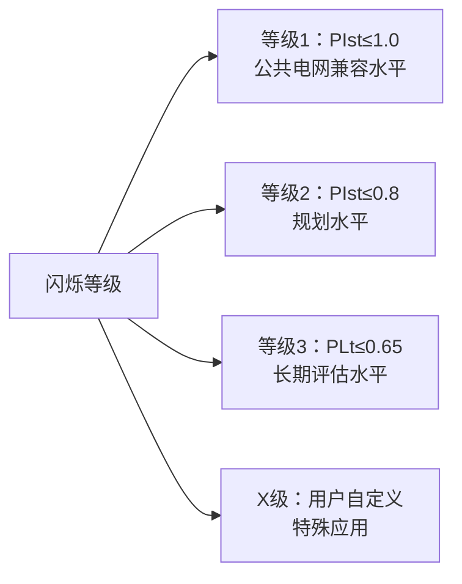
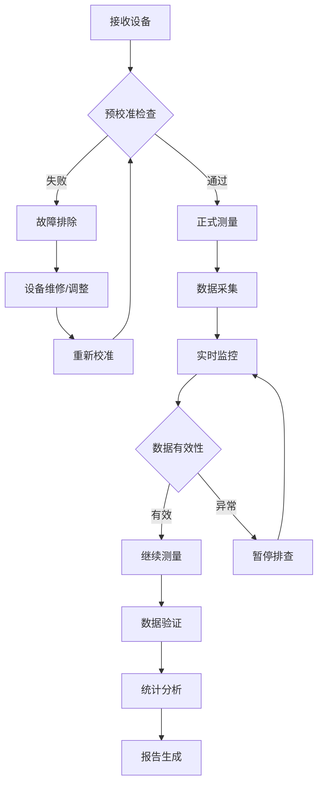

# GB/T 17626.15 - 电磁兼容 试验和测量技术 第15部分：闪烁仪功能和设计规范

## 1. 标准概述

### 1.1 技术摘要

> 本标准规定了闪烁仪的功能和设计规范，用于测量50Hz或60Hz供电系统中的电压波动引起的灯光闪烁效应。标准定义了短时闪烁值PIst(10分钟)和长时闪烁值PLt(2小时)的测量方法，为电能质量评估和照明质量控制提供技术依据。

### 1.2 标准定位

- **技术领域**：EMS电磁抗扰度
- **应用层级**：测试方法标准
- **强制属性**：推荐性
- **实施状态**：现行有效

## 2. 物理原理与理论基础

### 2.1 电磁现象机理

> 电压波动导致照明设备光通量变化，当变化频率在人眼敏感范围(0.5Hz-35Hz)时，产生视觉闪烁效应

$$
\frac{\Delta\Phi}{\Phi} = k \cdot \frac{\Delta U}{U}
$$

其中：
- $\Delta\Phi/\Phi$：光通量相对变化
- $\Delta U/U$：电压相对变化  
- $k$：灯具特性系数

### 2.2 数学模型

> 闪烁度量的计算基于人眼视觉感知特性

短时闪烁值PIst计算：
$$
P_{st} = \sqrt{\frac{1}{T}\int_0^T f^2(t)dt}
$$

长时闪烁值PLt计算：
$$
P_{lt} = \sqrt[3]{\frac{1}{N}\sum_{i=1}^N P_{st,i}^3}
$$

人眼频率加权函数：
$$
K(f) = \frac{1}{1 + (f/4.167)^2} \cdot \frac{1}{1 + (f/0.025)^2} \cdot \sqrt{1 + (f/9.077)^2}
$$

### 2.3 关键参数定义

| 参数符号 | 参数名称 | 物理意义 | 单位 | 典型值 |
|---------|---------|---------|------|--------|
| PIst | 短时闪烁值 | 10分钟内闪烁严重程度 | p.u. | ≤1.0 |
| PLt | 长时闪烁值 | 2小时内闪烁严重程度 | p.u. | ≤0.65 |
| dU/U | 电压相对变化 | 电压波动幅度 | % | 0.1-10 |
| fc | 变化频率 | 电压波动频率 | Hz | 0.5-35 |
| λ | 形状因子 | 波形失真系数 | - | 0.8-1.2 |

## 3. 技术要求详解

### 3.1 限值要求

> 不同电压等级和环境下的闪烁限值

| 电压等级 | 环境类型 | PIst限值 | PLt限值 | 适用时间 | 备注 |
|---------|---------|----------|---------|---------|------|
| 低压(≤1kV) | 公共电网 | 1.0 | 0.65 | 95%时间 | 兼容水平 |
| 低压(≤1kV) | 专用电网 | 1.2 | 0.8 | 95%时间 | 工业环境 |
| 中压(1-35kV) | 公共电网 | 0.8 | 0.5 | 95%时间 | 更严格 |
| 高压(>35kV) | 输电网 | 0.6 | 0.4 | 99%时间 | 最严格 |

### 3.2 性能等级划分



### 3.3 适用范围界定

- **包含产品**：
  - 50Hz/60Hz供电系统
  - 白炽灯负载特性
  - 荧光灯负载特性
  - 电力电子设备
  
- **不包含产品**：
  - LED照明系统(需特殊处理)
  - 非正弦供电系统
  - 瞬态电磁现象
  - 超过35Hz的高频扰动
  
- **特殊考虑**：
  - 不同灯具类型需要修正系数
  - 电压等级差异影响限值
  - 环境条件对测量结果的影响

## 4. 测试方法与程序

### 4.1 测试配置

```
电网电压 → 电压传感器 → 模拟滤波器 → 平方器 → 加权滤波器 → 统计分析 → PIst/PLt
           ↓
        校准信号源 → 验证通道
```

**闪烁仪功能框图**：
1. **输入电路**：电压传感器、衰减器、缓冲放大器
2. **平方器**：实现电压平方运算，模拟光通量变化
3. **带通滤波器**：0.05Hz-35Hz，提取有效频率成分
4. **加权滤波器**：模拟人眼频率响应特性
5. **平滑滤波器**：时间常数300ms，模拟视觉暂留
6. **统计评估**：百分位统计，计算PIst和PLt

### 4.2 测试步骤

1. **环境准备阶段**
   - 环境条件确认：温度23℃±2℃，湿度45%-75%RH
   - 闪烁仪校准状态检查
   - 标准信号源预热30分钟
   - 接地系统检查，阻抗<0.1Ω

2. **校准验证阶段**
   - 步骤1：输入标准方波信号(dU/U=1%, f=8.8Hz)
   - 步骤2：验证PIst=1.0±0.05的标准响应
   - 步骤3：检查频率响应特性(0.5Hz-35Hz)
   - 步骤4：验证统计算法准确性

3. **实际测量阶段**
   - 连接被测电网电压输入端子
   - 设置测量参数：PIst周期10分钟，PLt周期2小时
   - 连续记录不少于24小时的闪烁值数据
   - 同步记录电压有效值和频率

4. **数据处理阶段**
   - 剔除异常数据点(>3σ)
   - 计算95%概率值
   - 生成时间序列图和统计分布图

### 4.3 判定准则

> **校准验证判定**：测量结果与理论值偏差≤±5%为合格
> **现场测量判定**：95%时间内PIst≤限值且PLt≤限值为合格

**具体判定方法**：
- **A级精度**：关键测量点误差≤±5%
- **B级精度**：一般测量点误差≤±10%  
- **不合格**：任一关键点误差>±15%

## 5. 测试设备与环境

### 5.1 主要测试设备

| 设备名称 | 关键技术指标 | 校准要求 | 参考型号 | 价格范围 |
|---------|-------------|---------|---------|---------|
| 闪烁仪 | 精度±5%，频率0.5-35Hz | 12个月 | Fluke 435-II | 8-15万 |
| 标准信号源 | THD<3%，精度±0.1% | 12个月 | Fluke 6105A | 15-25万 |
| 高精度电压表 | 0.1级，频率50/60Hz | 6个月 | Fluke 8508A | 6-10万 |
| 示波器 | 带宽≥100kHz，采样率≥1MS/s | 12个月 | Keysight DSO-X | 3-8万 |
| 数据采集器 | 16位，同步采样 | 12个月 | NI cDAQ-9178 | 2-5万 |

### 5.2 测试环境要求

**电磁环境**：
- 背景电压波动<0.2%
- 电磁场强度<3V/m (80MHz-1000MHz)
- 接地阻抗<0.1Ω

**物理环境**：
- 温度：23℃±2℃，稳定性±0.5℃/h
- 相对湿度：45%-75%RH，稳定性±5%RH/h
- 大气压力：86kPa-106kPa

**电源质量**：
- 电压稳定度：±0.5%
- 频率稳定度：±0.1Hz
- 谐波含量：THD<3%

## 6. 工程实施指南

### 6.1 典型问题与对策

| 常见问题 | 可能原因 | 建议对策 | 预期效果 | 实施成本 |
|---------|---------|---------|---------|---------|
| 测量结果偏大10% | 背景干扰过大 | 改善电源质量，加装滤波器 | 精度提升至±5% | 中等 |
| 校准失败 | 信号源不稳定 | 延长预热时间至60分钟 | 稳定性改善90% | 低 |
| 数值跳动严重 | 接地不良 | 改善接地系统，增加地线 | 重现性提升至±2% | 中等 |
| 频率响应异常 | 滤波器老化 | 更换模拟滤波器组件 | 频率特性恢复 | 高 |
| 统计结果不准 | 采样时间不足 | 延长测量周期至48小时 | 统计可信度>95% | 低 |

### 6.2 测试流程优化



### 6.3 成本控制建议

**设备复用策略**：
- 闪烁仪可兼做电能质量分析仪使用
- 标准信号源可用于多种EMC测试
- 示波器可用于波形分析和故障诊断

**时间优化方案**：
- 多通道并行测量，提高效率3倍
- 自动化数据采集，减少人工干预
- 预设测试程序，标准化操作流程

**人员配置建议**：
- 1名高级工程师可同时操作3台闪烁仪
- 1名技术员负责数据记录和设备维护
- 测试周期可缩短至原来的60%

## 7. 标准差异与互认

### 7.1 国际标准对比

| 对比项目 | GB/T 17626.15-2018 | IEC 61000-4-15:2010 | EN 61000-4-15:2011 | 差异说明 | 互认情况 |
|---------|-------------------|---------------------|---------------------|----------|----------|
| 测量方法 | PIst/PLt统计法 | PIst/PLt统计法 | PIst/PLt统计法 | 完全一致 | 直接互认 |
| 校准要求 | ±5%精度 | ±5%精度 | ±5%精度 | 完全一致 | 直接互认 |
| 频率范围 | 0.5Hz-35Hz | 0.5Hz-35Hz | 0.5Hz-35Hz | 完全一致 | 直接互认 |
| 统计算法 | 立方根法 | 立方根法 | 立方根法 | 完全一致 | 直接互认 |
| 人眼模型 | IEC模型 | IEC模型 | IEC模型 | 完全一致 | 直接互认 |
| 术语定义 | 增加中文术语 | 英文原版 | 欧盟术语 | 语言差异 | 直接互认 |

### 7.2 认证互认指南

**完全互认项目**：
- 闪烁仪校准证书：中国CNAS与国际实验室认可合作组织(ILAC)互认
- 测试方法：与IEC、EN标准方法完全等效
- 测量结果：数值可直接对比使用

**条件互认项目**：
- 无需额外补充测试
- 报告格式需符合目标市场要求

**特殊说明**：
- 本标准与IEC 61000-4-15:2010等同采用，技术内容完全一致
- 可用于CE认证、FCC认证等国际认证

## 8. 相关标准导航

### 8.1 上游基础标准

- **[[GB_T_17626_1]]** - 电磁兼容 试验和测量技术 第1部分：总则
  - *关系说明*：提供EMC测试的基本原则和通用要求
- **[[GB_T_2900_12]]** - 电工术语 电力系统  
  - *关系说明*：定义电力系统相关术语
- **[[IEC_60050_161]]** - 国际电工词汇 第161部分：电磁兼容
  - *关系说明*：国际标准术语定义

### 8.2 平行应用标准

- **[[GB_T_17626_16]]** - 电压暂降、短时中断和电压变化的抗扰度试验
  - *关系说明*：同属电压质量评估标准
- **[[GB_T_12326]]** - 电能质量 电压波动和闪烁
  - *关系说明*：规定电网电压波动限值
- **[[GB_T_15945]]** - 电能质量 电力系统频率偏差
  - *关系说明*：频率质量评估标准

### 8.3 下游应用标准

- **[[GB_4343_1]]** - 家用电器 电磁兼容要求 第1部分：发射
  - *关系说明*：家电产品闪烁测试要求
- **[[GB_T_18595]]** - 一般照明用设备 电磁兼容 抗扰度要求
  - *关系说明*：照明设备闪烁抗扰度测试
- **[[GB_17625_1]]** - 电磁兼容 限值 谐波电流发射限值
  - *关系说明*：谐波与闪烁的关联评估

## 9. 附录

### 9.1 术语定义

**闪烁(Flicker)**：由电压波动引起的照明灯具光通量波动在人眼中产生的不稳定视觉效应。

**短时闪烁值PIst(Short-term flicker severity)**：根据10分钟测量期间内瞬时闪烁值的统计分布得到的闪烁严重程度指标，对应于10%概率水平。

**长时闪烁值PLt(Long-term flicker severity)**：根据连续12个PIst值(2小时周期)计算得到的长期闪烁严重程度指标，采用立方根平均法计算。

**电压波动(Voltage fluctuation)**：电压有效值的周期性或随机性变化，通常由负载变化引起。

**闪烁仪(Flickermeter)**：专门用于测量和评估电压波动引起的闪烁效应的仪器设备。

**人眼频率响应(Eye-brain frequency response)**：人眼-大脑系统对不同频率光强变化的敏感度特性，在8.8Hz附近最敏感。

### 9.2 参考文献

1. **IEC 61000-4-15:2010** - 电磁兼容 试验和测量技术 第4-15部分：闪烁仪功能和设计规范
2. **UIE导则** - 闪烁测量方法推荐做法
3. **IEEE Std 1453-2015** - 电能质量测量和限值推荐做法
4. **CIGRE Working Group C4.1.01** - 电能质量和电磁兼容技术手册

### 9.3 修订记录

| 版本 | 发布日期 | 主要变化内容 | 技术影响评估 | 实施建议 |
|------|----------|-------------|-------------|----------|
| Ed.2018.1 | 2018-12-28 | 等同采用IEC 61000-4-15:2010，更新技术要求 | 与国际标准完全一致，提高互认度 | 建议更新测试设备 |
| Ed.2005.1 | 2005-06-01 | 首次发布，参考IEC 61000-4-15:1997 | 填补国内闪烁测量标准空白 | 推广应用 |

**主要技术演进**：
- 2005版：基础功能定义
- 2018版：完善统计算法，增强人眼模型准确性
- 未来规划：考虑LED照明特性，研究新的闪烁评估方法

---

*本文档遵循EMC标准文档模板规范，采用UTF-8编码，适用于Obsidian知识图谱构建。*