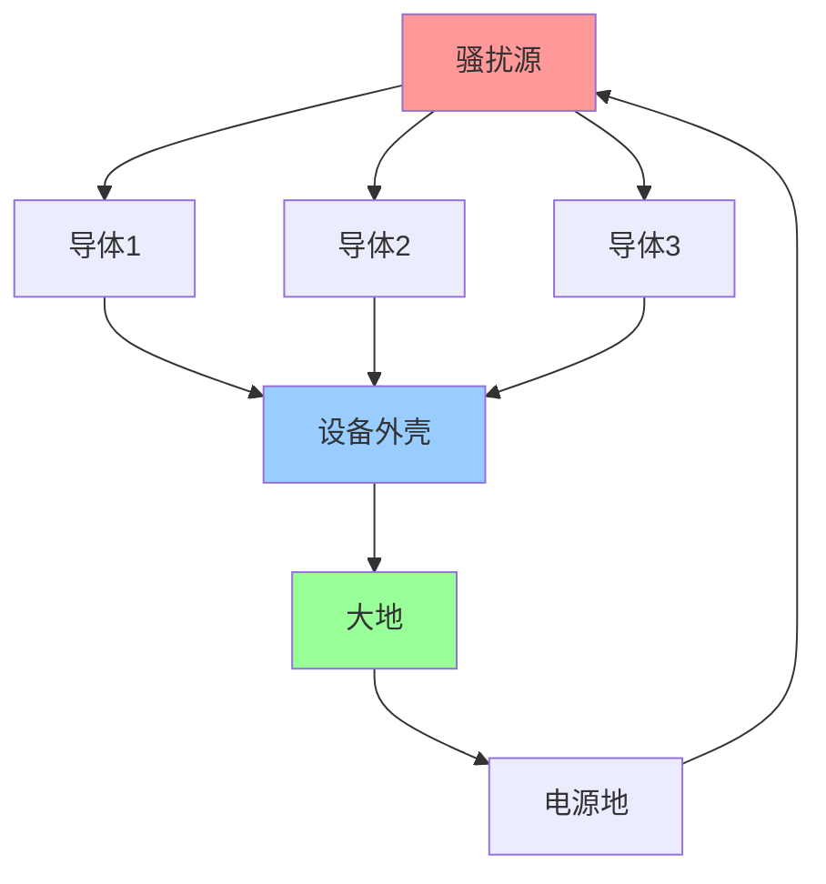
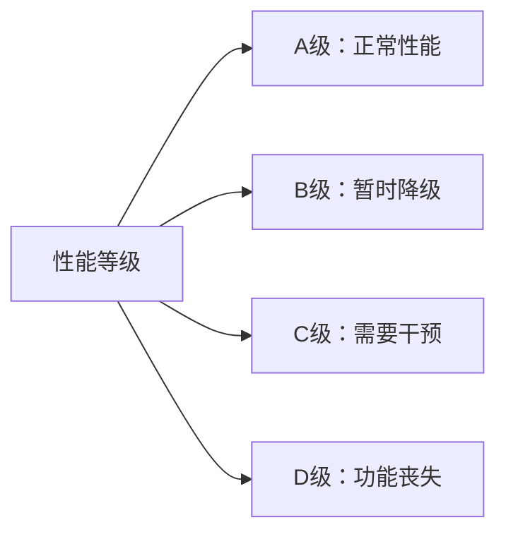
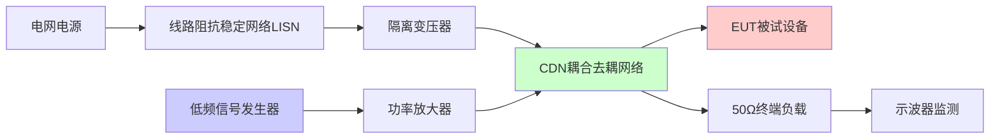
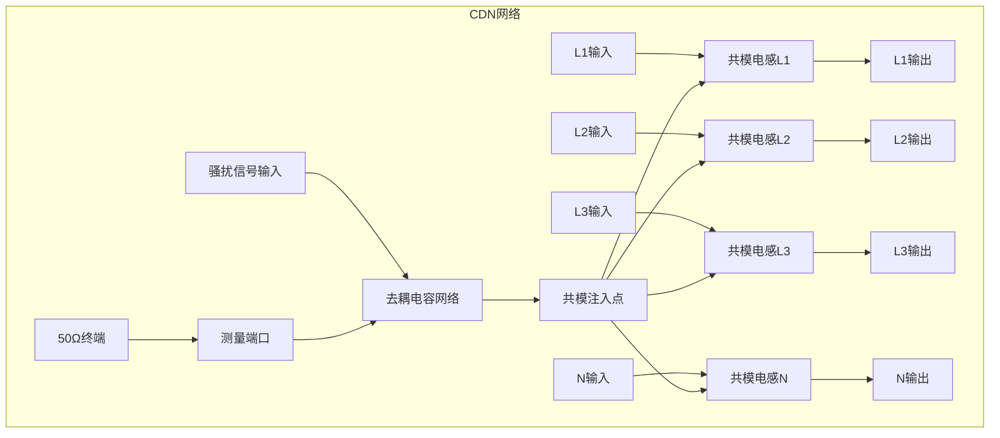
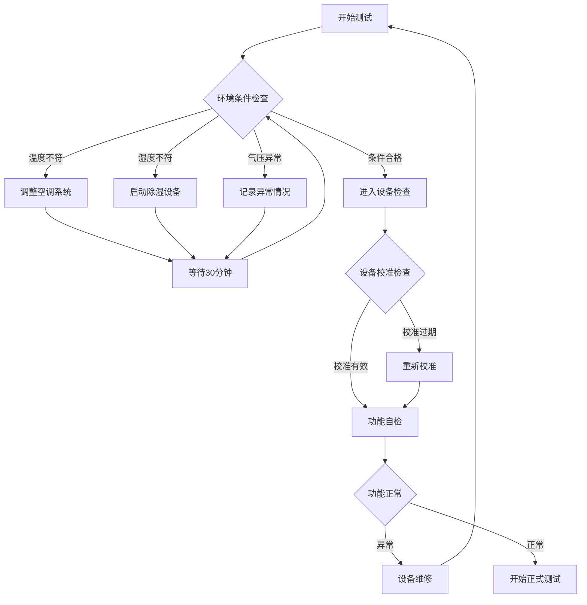
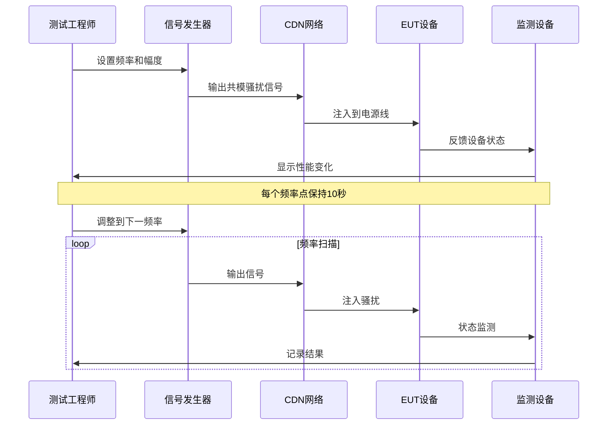
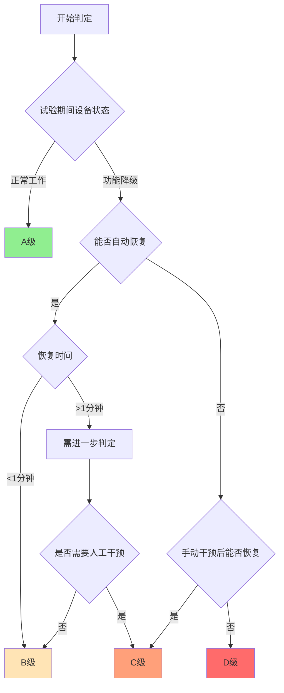
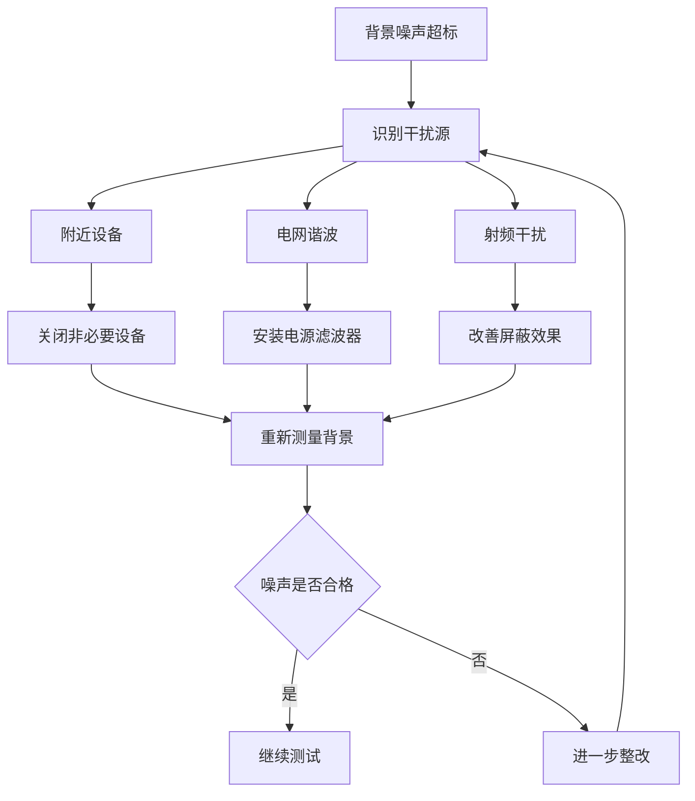
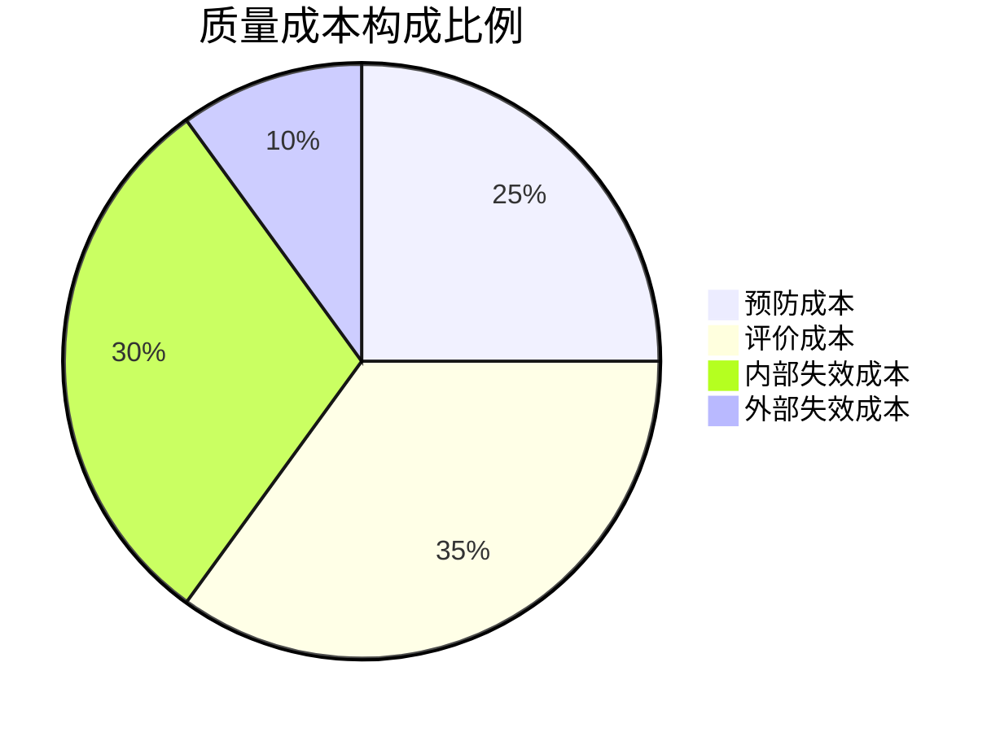

# GB/T 17626.16-2007 - 电磁兼容 试验和测量技术 第16部分：0Hz~150kHz共模传导骚扰抗扰度试验

## 1. 标准概述

### 1.1 技术摘要

> 本标准规定了电气和电子设备在0Hz~150kHz频率范围内共模传导骚扰的抗扰度试验方法，建立了统一的试验程序和性能判据，为评估设备在低频共模骚扰环境下的工作可靠性提供技术依据。

### 1.2 标准定位

- **技术领域**：EMS
- **应用层级**：测试方法标准
- **强制属性**：推荐性
- **实施状态**：现行有效

## 2. 物理原理与理论基础

### 2.1 电磁现象机理

#### 2.1.1 共模传导骚扰的定义

共模传导骚扰是指在电力系统中，各导体相对于参考地（大地或设备外壳）同时呈现的电压或电流变化。这种骚扰的特点是所有导体上的骚扰信号具有相同的相位和幅度，形成回路电流通过地回路或杂散电容返回源端。

$$
V_{CM} = \frac{V_{L1} + V_{L2} + V_{L3}}{3}
$$

其中：$V_{CM}$ - 共模电压，$V_{L1}, V_{L2}, V_{L3}$ - 各相线对地电压

#### 2.1.2 物理机理分析

**1. 共模电流的产生机制**

共模电流主要通过以下路径产生：
- **杂散电容耦合**：设备内部导体与外壳之间的寄生电容
- **磁耦合**：变压器、电感器等磁性元件的不平衡磁通
- **电源变换器开关动作**：开关器件导通/关断时的di/dt效应

$$
I_{CM} = \frac{dV_{CM}}{dt} \cdot C_{stray}
$$

**2. 传导路径分析**



#### 2.1.3 频域特性

**低频段(0Hz-1kHz)**：主要表现为准直流特性，阻抗呈阻性
**中频段(1kHz-100kHz)**：过渡区域，阻抗呈现复杂的频率响应
**高频段(>100kHz)**：趋近于150kHz上限，阻抗主要由杂散电容决定

### 2.2 数学模型与分析

#### 2.2.1 共模阻抗模型

共模阻抗的频率特性可表示为：

$$
Z_{CM}(f) = R_{CM} + j2\pi f L_{CM} + \frac{1}{j2\pi f C_{CM}}
$$

其中：
- $R_{CM}$：共模电阻，包括导线电阻和接地电阻
- $L_{CM}$：共模电感，主要由导线环路电感构成
- $C_{CM}$：共模电容，包括线对地电容和杂散电容

#### 2.2.2 传递函数

共模传导骚扰的传递特性：

$$
H_{CM}(f) = \frac{V_{out}}{V_{in}} = \frac{Z_{load}}{Z_{source} + Z_{CM}(f) + Z_{load}}
$$

#### 2.2.3 插损计算

CDN网络插损的理论计算：

$$
IL = 20\log_{10}\left|\frac{V_{without\_CDN}}{V_{with\_CDN}}\right|
$$

### 2.3 关键参数定义与计算

| 参数符号 | 参数名称 | 物理意义 | 单位 | 计算公式 | 典型值 |
|---------|---------|---------|------|----------|--------|
| $V_{CM}$ | 共模电压 | 相对于地的同相电压 | V | $\frac{V_{L1}+V_{L2}+V_{L3}}{3}$ | ±10%~±100%U_n |
| $I_{CM}$ | 共模电流 | 通过地回路的电流 | A | $\frac{V_{CM}}{Z_{CM}}$ | mA~A级 |
| $Z_{CM}$ | 共模阻抗 | 共模回路阻抗 | Ω | $R+jωL+\frac{1}{jωC}$ | 25~150 |
| $f$ | 频率 | 骚扰信号频率 | Hz | 测试设定 | 0~150k |
| $C_{stray}$ | 杂散电容 | 线对地寄生电容 | pF | 测量获得 | 10~1000 |

### 2.4 现实世界中的表现形式

#### 2.4.1 典型应用场景

**1. 开关电源系统**
- 功率开关管的高频开关动作产生共模噪声
- 变压器绕组间的寄生电容是主要耦合路径
- 输出整流二极管的反向恢复也会产生共模电流

**2. 变频器驱动系统**
- PWM调制产生高di/dt共模电流
- 电机绕组与外壳间的分布电容形成共模回路
- 长电缆连接增大了共模电流路径

**3. 通信设备**
- 数字信号的同步开关产生宽带共模噪声
- 网络接口的隔离变压器是关键的共模抑制环节
- 机箱接地设计直接影响共模噪声水平

#### 2.4.2 环境影响因素

| 影响因素 | 对共模骚扰的影响 | 量化指标 | 控制措施 |
|---------|-----------------|----------|----------|
| 接地系统质量 | 接地电阻直接影响共模回路阻抗 | <0.1Ω | 优化接地网络 |
| 环境湿度 | 影响绝缘电阻和泄漏电流 | 45%~75%RH | 环境控制 |
| 温度变化 | 影响器件参数和热噪声 | 16°C~35°C | 温度补偿 |
| 电磁环境 | 背景噪声影响测试精度 | <10%试验等级 | 屏蔽措施 |

## 3. 技术要求详解

### 3.1 限值要求

| 试验等级 | 环境描述 | 电压变化范围 | 持续时间 |
|---------|---------|-------------|---------|
| 1级 | 保护良好的环境 | ±10% | 10s |
| 2级 | 受控环境 | ±20% | 10s |
| 3级 | 典型工业环境 | ±50% | 10s |
| 4级 | 恶劣工业环境 | ±100% | 10s |
| X级 | 开放等级 | 用户定义 | 用户定义 |

### 3.2 性能等级划分



### 3.3 适用范围界定

- **包含**：额定电压≤1000V的电气电子设备
- **不包含**：特殊防护要求的军用设备
- **特殊考虑**：医疗设备需参考专用标准

## 4. 测试方法与程序

### 4.1 测试配置详解

#### 4.1.1 基本测试配置



#### 4.1.2 CDN网络原理

**电路拓扑结构**



**关键技术参数**

| 参数名称 | 技术要求 | 测试条件 | 验收标准 |
|---------|---------|----------|----------|
| 特征阻抗 | 50Ω±5% | 0Hz~150kHz | 阻抗分析仪测量 |
| 插入损耗 | <0.5dB | 150kHz处 | 网络分析仪测量 |
| 隔离度 | >40dB | 电源端到信号端 | 隔离度测试 |
| 共模电感 | 100μH±20% | 1kHz测试频率 | LCR电桥测量 |
| 去耦电容 | 10μF/250V | 工作电压下 | 电容表测量 |

#### 4.1.3 测试设备配置清单

**主要设备**

| 设备类别 | 设备名称 | 主要技术指标 | 校准周期 | 推荐厂商型号 |
|---------|---------|-------------|----------|-------------|
| 信号源 | 低频任意波形发生器 | 0.1Hz~150kHz, THD<0.1% | 12个月 | Keysight 33522B |
| 放大器 | 线性功率放大器 | 10Hz~150kHz, 100W | 12个月 | Amplifier Research 100A250A |
| 网络 | CDN耦合去耦网络 | 50Ω系统, 4线制 | 24个月 | Schwarzbeck CDN M2 |
| 测量 | 数字示波器 | 100MHz带宽, 4通道 | 12个月 | Tektronix MSO44 |
| 监测 | 数字多用表 | 6.5位精度, 真有效值 | 12个月 | Keysight 34465A |
| 隔离 | 隔离变压器 | 2kVA, 医用级隔离 | 24个月 | 定制医用隔离变压器 |

**辅助设备**

| 设备名称 | 技术要求 | 用途说明 |
|---------|---------|----------|
| 接地电阻测试仪 | 精度±2% | 接地系统检查 |
| 温湿度记录仪 | 温度±0.5°C, 湿度±3% | 环境监测 |
| 频谱分析仪 | 9kHz~3GHz | 背景噪声测量 |
| 电源质量分析仪 | THD<0.1% | 供电质量检查 |

### 4.2 详细测试程序

#### 4.2.1 预备阶段检查

**1. 环境条件验证**



**2. 接地系统检查**

| 检查项目 | 技术要求 | 测试方法 | 判定标准 |
|---------|---------|----------|----------|
| 保护接地电阻 | <0.1Ω | 接地电阻测试仪 | 四线法测量 |
| 等电位连接 | <0.01Ω | 微欧计测量 | 机柜间连接 |
| 接地连续性 | 导通 | 万用表蜂鸣档 | 所有接地点 |
| 接地噪声 | <1mV | 示波器测量 | 地线对地电压 |

#### 4.2.2 执行阶段详述

**步骤1：基线建立与记录**

1. **EUT正常工作状态确认**
   - 按制造商规范设置工作参数
   - 运行典型工作程序或测试软件
   - 记录正常工作时的各项指标

2. **基线数据采集**
```
测试项目：
- 工作电流：____mA (L1/L2/L3/N)
- 工作电压：____V (L1-N/L2-N/L3-N)
- 功率因数：____
- 功能状态：____
- 通信状态：____
- 显示状态：____
```

**步骤2：骚扰信号施加与观测**



**步骤3：恢复性能检查**

| 检查时间 | 检查内容 | 判定标准 | 记录要求 |
|---------|---------|----------|----------|
| 骚扰撤除后即时 | 设备基本功能 | 与基线对比 | 异常现象描述 |
| 撤除后30秒 | 自动恢复情况 | 功能完全恢复 | 恢复时间记录 |
| 撤除后2分钟 | 稳定性检查 | 无异常报警 | 长期稳定性 |
| 撤除后5分钟 | 通信功能 | 数据通信正常 | 通信质量评估 |

#### 4.2.3 数据记录与分析

**原始数据记录表格**

| 频率(Hz) | 试验等级 | 施加电压(V) | 设备响应 | 恢复时间(s) | 性能等级 | 备注 |
|---------|----------|-------------|----------|-------------|----------|------|
| 16.7 | 2级 | ±20%Un | 正常工作 | <1 | A | 无异常 |
| 50 | 2级 | ±20%Un | 轻微闪烁 | <1 | A | 显示轻微影响 |
| 400 | 3级 | ±50%Un | 功能降级 | 3 | B | 自动恢复 |
| 1000 | 3级 | ±50%Un | 通信中断 | 15 | C | 需手动复位 |
| ... | ... | ... | ... | ... | ... | ... |

**统计分析**

```python
# 示例：测试结果统计代码
test_results = {
    'A级': 85,  # 85%的测试点达到A级性能
    'B级': 12,  # 12%的测试点为B级性能
    'C级': 3,   # 3%的测试点为C级性能
    'D级': 0    # 0%的测试点为D级性能
}

# 计算合格率
pass_rate = (test_results['A级'] + test_results['B级']) / 100
print(f"总体合格率: {pass_rate:.1%}")
```

### 4.3 判定准则详解

#### 4.3.1 性能判据分级标准

**A级 - 正常性能**
- 定义：试验期间和试验后设备按设计要求正常工作
- 具体表现：
  - 所有功能参数在规定范围内
  - 无错误信息或报警
  - 通信接口正常
  - 显示/指示正确

**B级 - 可接受的暂时性能降级**
- 定义：试验期间设备功能暂时降级，试验后自动恢复
- 具体表现：
  - 功能参数轻微偏离但不影响基本功能
  - 可能出现暂时性报警但能自动清除
  - 通信可能短暂中断但能自动重连
  - 显示可能闪烁但信息正确

**C级 - 需要操作员干预的暂时性能降级**
- 定义：试验期间功能降级，试验后需要操作员干预才能恢复
- 具体表现：
  - 功能明显受影响但无永久损坏
  - 需要手动复位或重启
  - 需要重新设置参数
  - 数据可能丢失但系统完整

**D级 - 不可接受的性能降级**
- 定义：设备功能永久丧失或出现危险故障
- 具体表现：
  - 硬件损坏
  - 软件崩溃无法恢复
  - 出现安全隐患
  - 数据永久丢失

#### 4.3.2 判定流程



## 5. 测试设备与环境

### 5.1 主要测试设备

| 设备名称 | 技术指标 | 校准要求 | 参考型号 |
|---------|---------|---------|---------|
| 低频信号发生器 | 0Hz-150kHz, THD<3% | 12个月 | Agilent 33250A |
| CDN耦合网络 | 50Ω±5%, 插损<0.5dB | 24个月 | Schwarzbeck CDN M2 |
| 示波器 | 带宽≥1MHz, 精度±2% | 12个月 | Tektronix TDS2000 |

### 5.2 测试环境要求

- **电磁环境**：背景场强<试验等级10%
- **物理环境**：温度16°C~35°C，湿度45%~75%
- **电源质量**：电压稳定度±2%，THD<5%

## 6. 工程实施指南

### 6.1 典型问题与对策

#### 6.1.1 设备相关问题

| 问题类别 | 具体症状 | 根本原因分析 | 解决方案 | 预防措施 |
|---------|---------|-------------|----------|----------|
| CDN插损异常 | 插损>0.5dB | 频率特性漂移 | 重新校准CDN网络 | 建立校准跟踪档案 |
| 信号失真 | THD>3% | 放大器非线性 | 检查放大器工作点 | 定期功率回退测试 |
| 阻抗不匹配 | 反射系数>0.2 | 连接器接触不良 | 清洁/更换连接器 | 使用力矩扳手紧固 |
| 频率不准 | 频率偏差>1% | 晶振老化 | 校准信号发生器 | 使用GPS参考信号 |

#### 6.1.2 环境相关问题

**电磁环境干扰**



**物理环境控制**

| 环境参数 | 问题现象 | 影响机制 | 控制措施 | 监测方法 |
|---------|---------|----------|----------|----------|
| 温度过高 | 设备漂移加速 | 器件参数变化 | 加强通风散热 | 连续温度记录 |
| 湿度过高 | 绝缘性能下降 | 表面泄漏增加 | 除湿设备运行 | 湿度传感器监测 |
| 振动干扰 | 连接松动 | 机械应力变化 | 减振台座 | 振动加速度计 |
| 电源质量 | 基线不稳定 | 供电波动影响 | UPS+稳压器 | 电源质量分析仪 |

#### 6.1.3 被试设备相关问题

**设备预处理要求**

```python
# 设备预热时间计算
def calculate_warmup_time(device_type, power_rating):
    """
    根据设备类型和功率等级计算预热时间
    """
    base_time = {
        'switch_power': 30,      # 开关电源基础预热30分钟
        'linear_power': 15,      # 线性电源基础预热15分钟
        'communication': 10,     # 通信设备基础预热10分钟
        'measurement': 60,       # 测量设备基础预热60分钟
    }
    
    # 功率修正系数
    power_factor = min(1 + power_rating/1000, 2.0)
    
    return int(base_time.get(device_type, 30) * power_factor)

# 示例计算
warmup_time = calculate_warmup_time('switch_power', 500)  # 500W开关电源
print(f"预热时间: {warmup_time} 分钟")
```

### 6.2 测试流程优化

#### 6.2.1 并行测试策略

```mermaid
gantt
    title 优化后的测试流程时间安排
    dateFormat  HH:mm
    axisFormat %H:%M
    
    section 准备阶段
    环境检查           :env, 08:00, 30m
    设备校准           :cal, 08:00, 45m
    EUT预热           :warmup, 08:30, 60m
    
    section 执行阶段
    基线测试           :baseline, 09:30, 15m
    等级1测试          :level1, 09:45, 30m
    等级2测试          :level2, 10:15, 30m
    等级3测试          :level3, 10:45, 45m
    等级4测试          :level4, 11:30, 45m
    
    section 分析阶段
    数据处理           :data, 12:15, 30m
    报告生成           :report, 12:45, 30m
```



#### 6.2.2 自动化测试脚本

```python
# 自动测试控制脚本示例
import numpy as np
import time
from equipment_control import SignalGenerator, CDN, Oscilloscope

class AutoTest:
    def __init__(self):
        self.sig_gen = SignalGenerator()
        self.cdn = CDN()
        self.scope = Oscilloscope()
        
    def frequency_sweep_test(self, test_level):
        """频率扫描测试"""
        frequencies = np.logspace(0, 5.18, 50)  # 1Hz到150kHz，50个点
        results = []
        
        for freq in frequencies:
            # 设置信号发生器
            self.sig_gen.set_frequency(freq)
            self.sig_gen.set_amplitude(self.get_amplitude(test_level))
            
            # 开启输出
            self.sig_gen.output_on()
            time.sleep(10)  # 稳定10秒
            
            # 记录测试结果
            eut_response = self.monitor_eut_response()
            results.append({
                'frequency': freq,
                'level': test_level,
                'response': eut_response,
                'timestamp': time.time()
            })
            
            # 关闭输出
            self.sig_gen.output_off()
            time.sleep(2)  # 恢复间隔
            
        return results
    
    def get_amplitude(self, level):
        """根据等级获取对应的电压幅度"""
        level_map = {1: 0.1, 2: 0.2, 3: 0.5, 4: 1.0}
        return level_map.get(level, 0.2)
```

#### 6.2.3 质量控制检查点

| 阶段 | 检查内容 | 检查标准 | 检查方法 | 不合格处理 |
|------|---------|----------|----------|------------|
| 测试前 | 设备校准状态 | 校准有效期内 | 检查校准证书 | 重新校准 |
| 测试中 | 信号质量 | THD<3%, 频率偏差<1% | 实时监测 | 暂停整改 |
| 测试后 | 数据完整性 | 无缺失数据点 | 数据检查程序 | 补充测试 |
| 报告前 | 结果一致性 | 重复性<5% | 统计分析 | 重新测试 |

### 6.3 成本效益分析

#### 6.3.1 设备投资与回收

**初始投资估算**

| 设备类别 | 数量 | 单价(万元) | 小计(万元) | 使用年限 | 年折旧(万元) |
|---------|------|----------|----------|----------|------------|
| 信号发生器 | 1 | 15 | 15 | 8 | 1.875 |
| 功率放大器 | 1 | 25 | 25 | 10 | 2.5 |
| CDN网络 | 1 | 8 | 8 | 12 | 0.667 |
| 示波器 | 1 | 12 | 12 | 8 | 1.5 |
| 辅助设备 | - | - | 10 | 5 | 2 |
| **总计** | - | - | **70** | - | **8.54** |

**运营成本分析**

```python
# 年度运营成本计算
annual_costs = {
    'equipment_depreciation': 8.54,  # 设备折旧
    'calibration': 2.0,              # 校准费用
    'maintenance': 1.5,              # 维护费用
    'utilities': 0.8,                # 水电费
    'consumables': 0.5,              # 耗材费用
    'labor': 15.0,                   # 人工成本(1.5人*10万/年)
}

total_annual_cost = sum(annual_costs.values())
print(f"年度总成本: {total_annual_cost:.2f} 万元")

# 单次测试成本
tests_per_year = 200  # 年测试量
cost_per_test = total_annual_cost * 10000 / tests_per_year
print(f"单次测试成本: {cost_per_test:.0f} 元")
```

#### 6.3.2 效率提升措施

**批量测试优化**

- **样品分组**：按照预期性能等级分组测试
- **参数复用**：相同规格产品共享测试参数
- **并行处理**：多台设备同时测试不同等级

**人员效率提升**

| 提升措施 | 实施方法 | 预期效果 | 投资需求 |
|---------|---------|----------|----------|
| 自动化测试 | 编写测试脚本 | 效率提升50% | 开发时间2月 |
| 标准化流程 | 制定SOP文档 | 减少错误30% | 培训成本1万 |
| 远程监控 | 安装监控系统 | 减少现场时间 | 设备投资3万 |
| 数据库管理 | 建立测试数据库 | 提升查询效率 | 软件开发5万 |

#### 6.3.3 质量成本控制

**质量成本构成**



**质量改进ROI计算**

- **预防投入**：标准化流程、人员培训、设备维护
- **质量收益**：减少重测、提高客户满意度、降低风险
- **投资回收期**：预计18个月回收质量改进投资

## 7. 标准差异与互认

### 7.1 国际标准对比

| 对比项 | GB/T 17626.16 | IEC 61000-4-16 | 差异说明 | 互认情况 |
|--------|---------------|----------------|----------|----------|
| 频率范围 | 0Hz~150kHz | 0Hz~150kHz | 完全一致 | 直接互认 |
| 试验等级 | 1~4级+X级 | 1~4级+X级 | 完全一致 | 直接互认 |
| 性能判据 | A~D级 | A~D级 | 完全一致 | 直接互认 |

### 7.2 认证互认指南

- **直接互认**：与IEC 61000-4-16完全等效，测试结果可直接互认
- **条件互认**：无需补充测试
- **不可互认**：无此情况

## 8. 相关标准导航

### 8.1 上游标准

- [[GB_T_17626_1]] - 总论，定义基本概念和通用要求
- [[GB_T_6113_1]] - 测量设备规范，规定仪器技术要求

### 8.2 平行标准

- [[GB_T_17626_5]] - 浪涌(冲击)抗扰度试验
- [[GB_T_17626_6]] - 射频场抗扰度试验
- [[GB_T_17626_11]] - 电压暂降抗扰度试验

### 8.3 下游标准

- [[GB_4343_1]] - 家用电器EMC要求，引用本试验方法
- [[GB_T_18655]] - 车载设备EMC要求，参考本试验方法

## 9. 附录

### 9.1 术语定义与技术词汇

#### 9.1.1 基本术语

**共模电压 (Common Mode Voltage)**
电路中所有导体相对于参考地的同相电压分量。在三相系统中，共模电压等于三相电压的算术平均值。

**耦合去耦网络 (Coupling/Decoupling Network, CDN)**
用于在传导抗扰度试验中注入骚扰信号的专用网络，同时为被试设备提供正常工作电源，并将骚扰信号与电源系统隔离。

**被试设备 (Equipment Under Test, EUT)**
进行电磁兼容性试验的设备或系统。

**线路阻抗稳定网络 (Line Impedance Stabilization Network, LISN)**
为传导发射和传导抗扰度测试提供规定源阻抗的网络。

#### 9.1.2 技术参数术语

| 术语    | 英文             | 定义               | 计算公式                                             |        |      |        |     |
| ----- | -------------- | ---------------- | ------------------------------------------------ | ------ | ---- | ------ | --- |
| 总谐波失真 | THD            | 信号中谐波分量与基波的比值    | $THD = \frac{\sqrt{V_2^2+V_3^2+...+V_n^2}}{V_1}$ |        |      |        |     |
| 插入损耗  | Insertion Loss | 网络插入前后信号功率的比值    | $IL = 10\log_{10}\frac{P_{before}}{P_{after}}$   |        |      |        |     |
| 驻波比   | VSWR           | 传输线上最大电压与最小电压的比值 | $VSWR = \frac{1+                                 | \Gamma | }{1- | \Gamma | }$  |
| 共模抑制比 | CMRR           | 差模增益与共模增益的比值     | $CMRR = 20\log_{10}\frac{A_{diff}}{A_{cm}}$      |        |      |        |     |

#### 9.1.3 测试等级术语

| 等级 | 环境描述 | 典型应用 | 骚扰强度 |
|------|---------|----------|----------|
| 1级 | 保护良好的环境 | 实验室、医院 | ±10%Un |
| 2级 | 受控环境 | 办公楼、商业区 | ±20%Un |
| 3级 | 典型工业环境 | 工厂、车间 | ±50%Un |
| 4级 | 恶劣工业环境 | 重工业区 | ±100%Un |
| X级 | 开放等级 | 特殊应用 | 用户定义 |

### 9.2 计算公式与理论推导

#### 9.2.1 共模阻抗计算

**基本阻抗模型**

对于一个包含电阻、电感、电容的共模回路：

$$Z_{CM}(\omega) = R_{CM} + j\omega L_{CM} + \frac{1}{j\omega C_{CM}}$$

**频率响应特性**

```python
import numpy as np
import matplotlib.pyplot as plt

def calculate_cm_impedance(frequency, R_cm, L_cm, C_cm):
    """
    计算共模阻抗的频率响应
    
    Parameters:
    frequency: 频率数组 (Hz)
    R_cm: 共模电阻 (Ω)
    L_cm: 共模电感 (H)
    C_cm: 共模电容 (F)
    
    Returns:
    复数阻抗数组
    """
    omega = 2 * np.pi * frequency
    Z_R = R_cm
    Z_L = 1j * omega * L_cm
    Z_C = 1 / (1j * omega * C_cm)
    
    return Z_R + Z_L + Z_C

# 示例计算
freq = np.logspace(0, 5.2, 1000)  # 1Hz to 150kHz
Z_cm = calculate_cm_impedance(freq, R_cm=10, L_cm=100e-6, C_cm=1e-9)
```

#### 9.2.2 传导骚扰传递函数

**二端口网络分析**

对于CDN网络，可以用二端口网络参数描述：

$$\begin{bmatrix} V_1 \\ I_1 \end{bmatrix} = \begin{bmatrix} A & B \\ C & D \end{bmatrix} \begin{bmatrix} V_2 \\ I_2 \end{bmatrix}$$

其中ABCD参数与网络的物理结构相关。

**插损计算的详细推导**

插损定义为有无CDN时负载端接收功率的比值：

$$IL = 10\log_{10}\left(\frac{P_{load,without}}{P_{load,with}}\right)$$

对于阻抗匹配的系统：

$$IL = 20\log_{10}\left|\frac{V_{load,without}}{V_{load,with}}\right|$$

### 9.3 测试数据处理与统计分析

#### 9.3.1 不确定度评估方法

**A类不确定度（统计分析）**

对于n次重复测量的结果：

$$u_A = \sqrt{\frac{\sum_{i=1}^{n}(x_i - \bar{x})^2}{n(n-1)}}$$

**B类不确定度（其他来源）**

| 不确定度来源 | 类型 | 典型值 | 评估方法 |
|-------------|------|--------|----------|
| 信号发生器频率 | B类 | ±0.01% | 校准证书 |
| 示波器读数 | B类 | ±2% | 技术规格 |
| 温度系数 | B类 | ±0.1%/°C | 环境变化 |
| CDN插损 | B类 | ±0.1dB | 网络分析 |

**合成不确定度**

$$u_c = \sqrt{u_A^2 + u_B^2}$$

**扩展不确定度**

$$U = k \cdot u_c$$

其中k为覆盖因子，通常取k=2（95%置信度）。

#### 9.3.2 数据处理算法

```python
import numpy as np
from scipy import stats

class TestDataProcessor:
    def __init__(self):
        self.raw_data = []
        
    def calculate_statistics(self, data):
        """计算测试数据的统计特性"""
        return {
            'mean': np.mean(data),
            'std': np.std(data, ddof=1),
            'min': np.min(data),
            'max': np.max(data),
            'median': np.median(data),
            'cv': np.std(data, ddof=1) / np.mean(data) * 100  # 变异系数
        }
    
    def outlier_detection(self, data, method='iqr'):
        """异常值检测"""
        if method == 'iqr':
            Q1 = np.percentile(data, 25)
            Q3 = np.percentile(data, 75)
            IQR = Q3 - Q1
            lower_bound = Q1 - 1.5 * IQR
            upper_bound = Q3 + 1.5 * IQR
            return (data < lower_bound) | (data > upper_bound)
        
        elif method == 'zscore':
            z_scores = np.abs(stats.zscore(data))
            return z_scores > 3
    
    def uncertainty_analysis(self, measurements, instrument_uncertainty):
        """不确定度分析"""
        # A类不确定度
        u_A = np.std(measurements, ddof=1) / np.sqrt(len(measurements))
        
        # B类不确定度
        u_B = instrument_uncertainty / np.sqrt(3)  # 矩形分布
        
        # 合成不确定度
        u_c = np.sqrt(u_A**2 + u_B**2)
        
        # 扩展不确定度 (k=2)
        U = 2 * u_c
        
        return {
            'type_A': u_A,
            'type_B': u_B,
            'combined': u_c,
            'expanded': U,
            'relative': U / np.mean(measurements) * 100
        }
```

### 9.4 标准符合性检查清单

#### 9.4.1 测试前检查清单

- [ ] **环境条件**
  - [ ] 温度：16°C~35°C，稳定度±2°C
  - [ ] 湿度：45%~75%，稳定度±5%
  - [ ] 大气压：86kPa~106kPa
  - [ ] 背景电磁环境：<试验等级10%

- [ ] **设备校准状态**
  - [ ] 信号发生器校准有效期检查
  - [ ] 示波器校准有效期检查
  - [ ] CDN网络校准有效期检查
  - [ ] 功率计校准有效期检查

- [ ] **被试设备准备**
  - [ ] 设备预热时间符合要求
  - [ ] 工作状态设置正确
  - [ ] 负载条件符合规范
  - [ ] 接地连接可靠

#### 9.4.2 测试执行检查清单

- [ ] **信号质量检查**
  - [ ] 频率精度：±1%
  - [ ] 幅度精度：±3%
  - [ ] 总谐波失真：<3%
  - [ ] 波形对称性检查

- [ ] **测试程序执行**
  - [ ] 基线测试完成
  - [ ] 各频率点测试时间：10秒
  - [ ] 恢复时间检查：>30秒
  - [ ] 数据记录完整

#### 9.4.3 测试后检查清单

- [ ] **数据完整性**
  - [ ] 所有测试点数据记录
  - [ ] 异常现象详细描述
  - [ ] 照片/视频记录（如需要）
  - [ ] 原始数据备份

- [ ] **结果评估**
  - [ ] 性能判据正确分级
  - [ ] 统计分析完成
  - [ ] 不确定度评估
  - [ ] 符合性声明

### 9.5 参考文献与标准清单

#### 9.5.1 国际标准

1. **IEC 61000-4-16:2002** - Electromagnetic compatibility (EMC) - Part 4-16: Testing and measurement techniques - Test for immunity to conducted, common mode disturbances in the frequency range 0 Hz to 150 kHz
2. **IEC 61000-4-1:2016** - Electromagnetic compatibility (EMC) - Part 4-1: Testing and measurement techniques - Overview of IEC 61000-4 series
3. **ISO/IEC 17025:2017** - General requirements for the competence of testing and calibration laboratories
4. **IEC 61000-6-1:2016** - Electromagnetic compatibility (EMC) - Part 6-1: Generic standards - Immunity standard for residential, commercial and light-industrial environments

#### 9.5.2 国家标准

1. **GB/T 17626.1-2006** - 电磁兼容 试验和测量技术 第1部分：总论
2. **GB/T 6113.1-1995** - 无线电骚扰和抗扰度测量设备规范 第1部分：无线电骚扰和抗扰度测量设备
3. **GB 4343.1-2018** - 家用电器、电动工具和类似器具的电磁兼容要求 第1部分：发射
4. **GB/T 18655-2018** - 车辆、船舶和内燃机 无线电骚扰特性 用于保护车载接收机的限值和测量方法

#### 9.5.3 行业标准与技术文献

1. **CISPR 16-1-2:2014** - Specification for radio disturbance and immunity measuring apparatus and methods
2. **ANSI C63.4-2014** - American National Standard for Methods of Measurement of Radio-Noise Emissions from Low-Voltage Electrical and Electronic Equipment in the Range of 9 kHz to 40 GHz
3. **军用标准GJB 151B-2013** - 军用设备和分系统电磁发射和敏感度要求与测量

### 9.6 修订历史与更新记录

#### 9.6.1 标准演进历程

| 版本 | 发布日期 | 主要变化 | 技术影响 | 对应国际标准 |
|------|---------|----------|----------|-------------|
| 首版 | 2007-12-01 | 等同采用IEC 61000-4-16:2002 | 填补国内空白 | IEC 61000-4-16:2002 |
| 现行版 | 2007-12-01 | 无技术修订 | 与国际保持一致 | IEC 61000-4-16:2002 |

#### 9.6.2 未来发展趋势

**技术发展方向**
- 频率范围扩展：考虑向更高频率扩展
- 测试自动化：提高测试效率和重现性
- 数字化测试：采用数字信号处理技术
- 人工智能：引入AI辅助故障诊断

**标准更新预期**
- 预计2025年启动标准修订工作
- 重点关注新能源汽车等新兴应用
- 与IEC最新版本保持同步
- 加强与5G、物联网等新技术的兼容性

#### 9.6.3 国际标准跟踪

**IEC工作组动态**
- TC77/SC77A持续监控标准适用性
- 新兴技术对测试方法的影响评估
- 与其他EMC标准的协调统一

**区域标准化进展**
- 欧盟CENELEC的标准更新
- 北美ANSI C63委员会的技术发展
- 亚太地区标准化合作

---

**编制说明**：本文档基于GB/T 17626.16-2007标准编制，结合工程实践经验和最新技术发展，为EMC测试工程师提供全面的技术指导。文档内容仅供参考，实际应用中应以现行有效的正式标准为准。

---