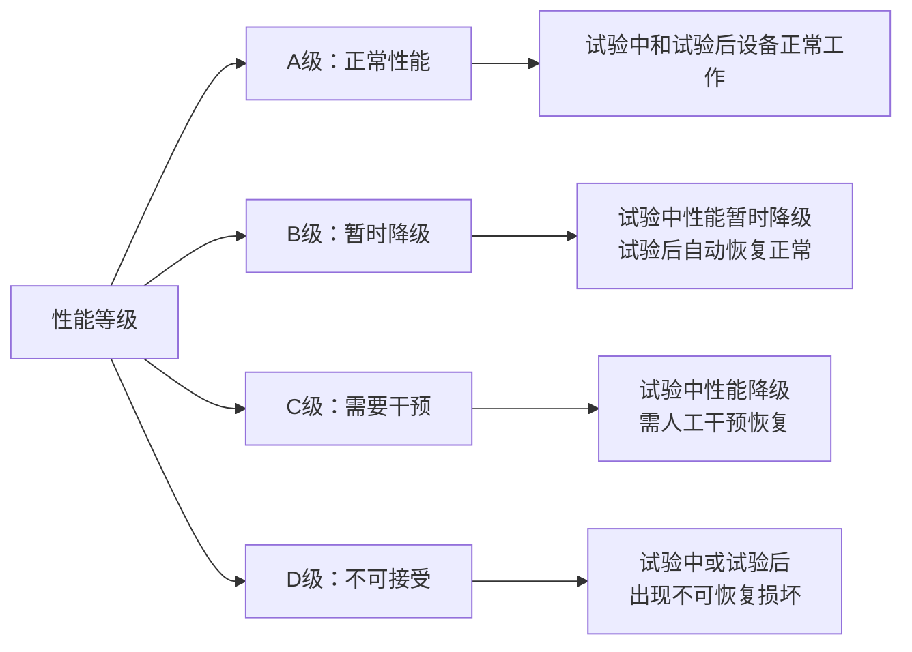
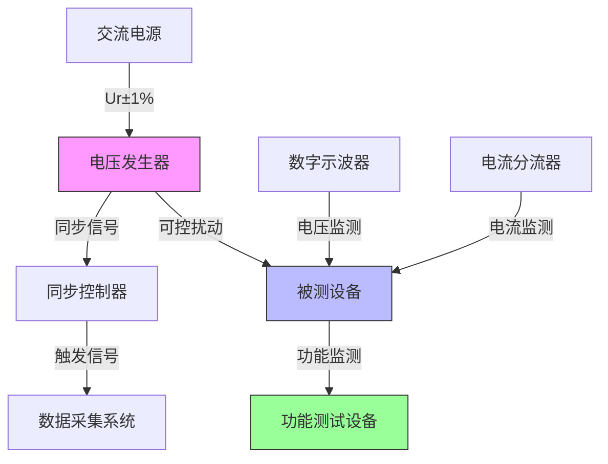
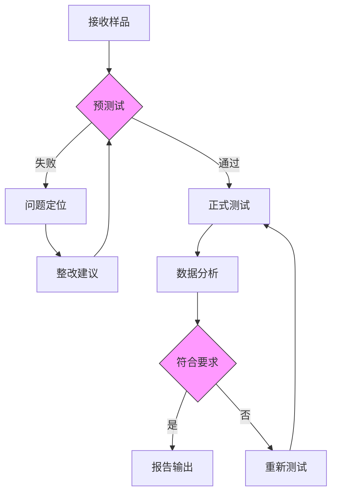

# GB/T 17626.17 - 电磁兼容 试验和测量技术-电源输入电压变化抗扰度试验

## 1. 标准概述

### 1.1 技术摘要

> 本标准规定了电气电子设备对电源输入端电压变化的抗扰度试验方法，包括：
> - 电压暂降试验
> - 短时中断试验  
> - 电压变化试验
> - 适用于直流和交流供电设备
> 
> 试验覆盖0Hz-1kHz频率范围内的电源质量扰动现象，包括电压暂降幅度30%-100%Ur、持续时间10ms-5s、电压变化率1-100V/s等关键参数。

### 1.2 标准定位

- **技术领域**：EMS（电磁抗扰度）
- **应用层级**：基础测试方法标准
- **强制属性**：推荐性标准
- **实施状态**：现行有效
- **发布日期**：2023-12-01
- **替代关系**：替代GB/T 17626.17-2005

## 2. 物理原理与理论基础

### 2.1 电磁现象机理

> 电源输入端电压变化抗扰度涉及以下物理现象机理：

电压暂降的瞬态响应方程：
$$
\frac{dV}{dt} = -\frac{1}{C} \int i_{dist}(t)dt
$$

其中：
- $dV/dt$ 为电压变化率
- $C$ 为设备输入电容
- $i_{dist}(t)$ 为扰动电流

> 电压变化对设备的影响机制：
> 1. **保护电路动作**：当$di/dt > 100A/\mu s$时触发过流保护
> 2. **电源调节失效**：输入电压暂降70%-90%时，100ms-1s内线性调节器失效
> 3. **储能耗尽**：电源滤波电容放电，100%Ur暂降时，10ms-200ms内储能耗尽

### 2.2 数学模型

#### 电压暂降模型

电压暂降的时域数学模型：
$$
V(t) = 
\begin{cases} 
V_0 & t < t_0 \\
V_0 \cdot [1 - d \cdot (1 - e^{-(t-t_0)/\tau_{fall}})] & t_0 \leq t < t_1 \\
V_0 \cdot (1-d) & t_1 \leq t < t_2 \\
V_0 \cdot [1 - d \cdot e^{-(t-t_2)/\tau_{rise}}] & t \geq t_2
\end{cases}
$$

#### 关键参数定义
- $\tau_{fall}$：电压跌落时间常数，典型值<1-10ms
- $\tau_{rise}$：电压恢复时间常数，典型值<10-100ms  
- $d$：电压暂降深度，%Ur
- $T = t_2 - t_1$：暂降持续时间

### 2.3 关键参数定义

> **重要说明**：所有公式中出现的字母和符号必须在此表格中给出明确的定义和物理意义说明。

| 参数符号 | 参数名称 | 物理意义 | 单位 | 典型值 | 测量要求 |
|---------|---------|---------|------|--------|----------|
| $U_r$ | 额定电压 | 设备正常工作电压 | V DC/AC | 24/48/400 | ±1%精度 |
| $t_d$ | 暂降持续时间 | 电压扰动持续时间 | ms | 10-5000 | ±5%精度 |
| $dV/dt$ | 电压变化率 | 电压随时间变化速率 | V/s | 1-100 | ±10%精度 |
| $\Delta V$ | 电压暂降幅度 | 暂降/上升幅度 | %Ur | 30-100 | ±2%精度 |
| $R_i$ | 内阻抗 | 测试发生器内阻 | Ω | <0.1 | 计算确定 |
| $Z_{load}$ | 负载阻抗 | EUT输入阻抗 | Ω | 变化 | 实测值 |
| $C_{in}$ | 输入电容 | EUT输入滤波电容 | μF | 10-1000 | ESR<0.1Ω |
| $f_{sw}$ | 开关频率 | 开关电源频率 | kHz | 20-1000 | 基波分量 |

## 3. 技术要求详解

### 3.1 限值要求

#### 试验等级与参数
| 测试等级 | 等级1 | 等级2 | 等级3 | 性能判据 |
|---------|-------|-------|-------|----------|
| 电压暂降 | 30%Ur × 100ms | 60%Ur × 200ms | 70%Ur × 500ms | B级或A级 |
| 短时中断 | 100%Ur × 10ms | 100%Ur × 20ms | 100%Ur × 50ms | A级或B级 |
| 电压变化 | ±10%Ur @ 10V/s | ±20%Ur @ 50V/s | ±30%Ur @ 100V/s | C级或A级 |

#### 试验波形参数要求
| 参数 | 上升时间 | 下降时间 | 平顶时间 | 精度要求 |
|------|----------|----------|----------|----------|
| 电压暂降 | <1ms | <1ms | ±5% | ±2%Ur |
| 短时中断 | <0.5ms | <0.5ms | ±2% | ±1%Ur |
| 电压变化 | 按设定值 | 按设定值 | 连续 | ±5% |

### 3.2 性能等级划分

### 3.3 适用范围界定

- **包含**：额定电压≤1500V DC或1000V AC的电气电子设备
- **包含**：工业控制设备、信息技术设备、医疗器械、家用电器
- **不包含**：专门的电源质量设备（UPS、稳压器等）
- **不包含**：高频开关电源的开关噪声（>1kHz）
- **特殊考虑**：新能源汽车高压系统需参考ISO 7637系列标准

## 4. 测试方法与程序

### 4.1 测试配置

### 4.2 测试步骤

1. **准备阶段**
   - 确认EUT正常工作状态（功能检查）
   - 校准电压发生器：输入电压精度±1%，输出精度±5%  
   - 设置数据采集：采样率≥100kS/s
   
2. **执行阶段**
   - 预设试验参数：电压暂降深度/持续时间/重复次数
   - 执行短时中断测试：间隔时间≥10/20/50ms
   - 进行电压变化试验：变化率1/10/100V/s
   - 实时数据记录：
     - 电压波形$V(t)$
     - 电流波形$I(t)$  
     - EUT功能状态
   
3. **数据分析**
   - 测量电压恢复时间$t_{recovery}$
   - 评估性能判据等级A/B/C/D
   - 统计分析：重复性试验数据统计

### 4.3 判定准则

#### 性能判据详细说明
| 等级 | 试验中表现 | 试验后表现 | 典型案例 |
|------|------------|------------|----------|
| A级 | 正常工作无影响 | 立即恢复正常 | 高质量开关电源 |
| B级 | 性能暂时降级 | 自动恢复正常 | 带软启动的设备 |
| C级 | 功能中断 | 需人工重启 | 无备用电源的设备 |
| D级 | 损坏或永久故障 | 无法恢复 | 保护电路失效 |

## 5. 测试设备与环境

### 5.1 主要测试设备

| 设备名称 | 技术指标 | 校准要求 | 参考型号 |
|---------|---------|---------|---------| 
| 可编程电压发生器 | 0-1500V DC ±1% di/dt > 100A/μs | 年度校准 | Pacific Power 345AMX |
| 数字存储示波器 | 带宽≥1GHz 采样率≥5GS/s | 年度校准 | Keysight DSOX4154A |
| 精密电流分流器 | 带宽≥100MHz 精度±2% | 年度校准 | Pearson 4100A |
| 数据采集系统 | 16bit ADC 采样率≥100kS/s | 季度校准 | NI PXIe-6361 |

### 5.2 测试环境要求

- **电磁环境**：背景场强<1V/m (30MHz-1GHz)
- **物理环境**：温度16°C-35°C (±2°C)，湿度45%-75%RH (±5%RH)
- **电源质量**：电压稳定度±1%，总谐波畸变<3%
- **接地系统**：接地阻抗<0.1Ω，等电位连接
- **屏蔽要求**：半电波暗室或全电波暗室

## 6. 工程实施指南

### 6.1 典型问题与对策

| 常见问题 | 可能原因 | 建议对策 | 预期效果 |
|---------|---------|---------|---------| 
| 电压过冲 | 发生器内阻过低 负载容性过强 | 1. 增加串联电阻 2. 调节上升时间 3. 优化驱动电路 | 减少$V_{in}$过冲 |
| 数据不重现 | 电压恢复时间离散 温度漂移 | 1. 延长稳定时间 2. 温度补偿 3. 增加数据样本 | 提高测试重现性 |
| 同步困难 | 触发电平不稳 ADC采样率低 | 1. 硬件触发优先 2. 提升带宽 3. 时钟同步方案 | 精确同步采集 |

### 6.2 测试流程优化

### 6.3 成本控制建议

- **设备复用**：示波器、电流分流器可用于多项EMC测试
- **时间优化**：批量测试安排，减少设备调试时间
- **人员配置**：1名主测工程师+1名辅助技术员的最优配置
- **校准策略**：关键设备年度校准，辅助设备可适当延长周期

## 7. 标准差异与互认

### 7.1 国际标准对比

| 对比项 | GB/T 17626.17 | IEC 61000-4-17 | 差异说明 | 互认情况 |
|--------|----------------|----------------|----------|----------|
| 测试等级 | 3个标准等级 | Class 1-3 | 完全等同 | 直接互认 |
| 电压变化 | ±30% @ 100V/s | ±30% @ 100V/s | 无差异 | 直接互认 |
| 测试程序 | 详细/标准化程序 | 简化3步程序 | 实施细节差异 | 条件互认 |
| 性能判据 | A/B/C/D四级 | A/B/C三级 | 增加D级(损坏级别) | 需要说明 |

### 7.2 认证互认指南

- **直接互认**：基本测试参数和等级要求
- **条件互认**：性能判据需要对照转换  
- **不可互认**：特定行业要求（如汽车、医疗）需补充专用标准测试

## 8. 相关标准导航

### 8.1 上游标准

- [[GB/T 17626.1]] - 电磁兼容 试验和测量技术 第1部分：总则
- [[IEC 61000-4-1]] - 电磁兼容 试验和测量技术 抗扰度试验总则
- [[GB/T 6113.101]] - 无线电骚扰和抗扰度测量设备和测量方法规范

### 8.2 平行标准

- [[GB/T 17626.29]] - 电磁兼容 试验和测量技术 直流电源输入端口的电压暂降抗扰度试验
- [[ISO 7637-2]] - 道路车辆 由传导和耦合引起的电骚扰 第2部分：沿电源线的电骚扰
- [[IEC 61000-4-11]] - 电磁兼容 试验和测量技术 电压暂降、短时中断和电压变化抗扰度试验

### 8.3 下游标准

- [[GB/T 36282]] - 电动汽车用电机控制器电磁兼容性要求及试验方法  
- [[YD/T 2323]] - 通信电源设备的电磁兼容性要求和测试方法
- [[GB 4343.1]] - 家用电器、电动工具和类似器具的电磁兼容要求

## 9. 附录

### 9.1 术语定义

> **电压暂降 (Voltage Dip)**：
> $$\Delta V \geq 10\%U_r \quad \text{且} \quad 10ms \leq \Delta t \leq 5s$$
> 指供电电压有效值的短时降低现象
> 
> **短时中断 (Short Interruption)**：
> $$\Delta V = 100\%U_r \quad \text{且} \quad 10ms \leq \Delta t \leq 1s$$
> 指供电电压短时完全中断现象
> 
> **电压变化 (Voltage Variation)**：
> $$\left| \frac{dV}{dt} \right| \geq 1V/s \quad \text{且} \Delta t \geq 100ms$$
> 指供电电压的缓慢变化现象

### 9.2 参考文献

> 标准制定的技术依据
> 1. IEC 61000-4-17:2021, Electromagnetic compatibility (EMC) - Part 4-17: Testing and measurement techniques - Ripple on d.c. input power port immunity test
> 2. IEEE Std 1159-2019, IEEE Recommended Practice for Monitoring Electric Power Quality  
> 3. CIGRE/CIRED/UIE Joint Working Group, Voltage dip immunity of equipment and installations

### 9.3 修订记录

| 版本 | 日期 | 主要变化 | 影响评估 |
|------|------|----------|----------|
| Ed.2023.1 | 2023-12-01 | 等同采用IEC 61000-4-17:2021 增加电压变化率试验 完善性能判据 | 扩大适用范围 提高测试精度 与国际接轨 |
| Ed.2005.1 | 2005-07-01 | 首次发布 等同采用IEC 61000-4-17:1999 | 填补国内标准空白 规范EMC测试 |

---

*本文档遵循GB/T 17626.17-2023标准要求，结合工程实践经验编写，为EMC测试工程师和产品设计人员提供实用的技术指导。*