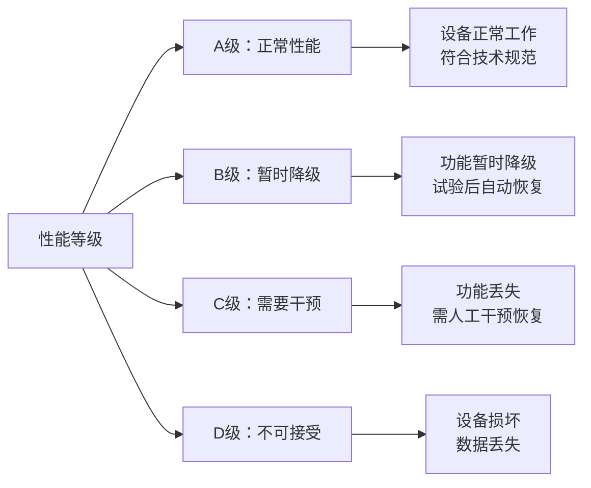
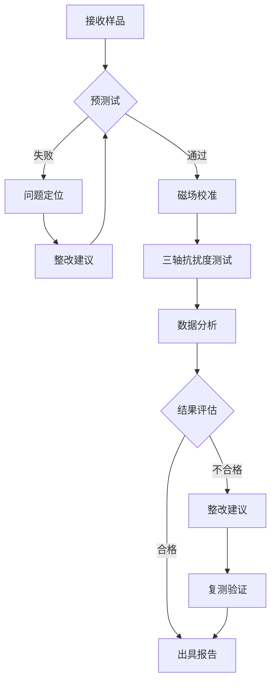

# GB/T 17626.18-2016 - 电磁兼容 试验和测量技术 第18部分：功率频率磁场抗扰度试验

## 1. 标准概述

### 1.1 技术摘要

> 本标准规定了电气和电子设备功率频率磁场抗扰度试验的试验方法、试验等级和试验设备要求。标准模拟了工频电力设备（如变压器、电动机、传输线路）产生的连续磁场环境，评估设备在工频磁场环境下的免疫性能。

### 1.2 标准定位

- **技术领域**：EMS电磁抗扰度
- **应用层级**：基础测试方法标准
- **强制属性**：推荐性国家标准
- **实施状态**：现行有效

## 2. 物理原理与理论基础

### 2.1 电磁现象机理

> 功率频率磁场是由50Hz交流电流在导体中流动时产生的磁场。磁场通过磁耦合方式影响电子设备，主要通过以下机理产生干扰

**磁场基本方程**：
$$
\mathbf{B} = \mu_0 \mathbf{H} = \mu_0 \frac{I}{2\pi r} \hat{\phi}
$$

**法拉第电磁感应定律**：
$$
\varepsilon = -\frac{d\Phi_B}{dt} = -\frac{d}{dt}\oint \mathbf{B} \cdot d\mathbf{A}
$$

**亥姆霍兹线圈磁场分布**：
$$
B_z = \frac{\mu_0 NIR^2}{2(R^2 + z^2)^{3/2}}
$$

### 2.2 数学模型

**磁通密度与磁场强度关系**：
$$
B = \mu_0 H = 4\pi \times 10^{-7} \times H \text{ (T)}
$$

**线圈电流与磁场强度关系**：
$$
H = \frac{NI}{l_{eff}}
$$

其中，对于亥姆霍兹线圈配置：
$$
l_{eff} = \frac{8}{\sqrt{125}} R = 0.716R
$$

### 2.3 关键参数定义

> **重要说明**：所有公式中出现的字母和符号必须在此表格中给出明确的定义和物理意义说明。

| 参数符号 | 参数名称 | 物理意义 | 单位 | 典型值 |
|---------|---------|---------|------|--------|
| B | 磁通密度 | 单位面积的磁通量 | μT | 1-100 |
| H | 磁场强度 | 磁场的基本强度 | A/m | 0.8-80 |
| μ₀ | 真空磁导率 | 真空中的磁导率常数 | H/m | 4π×10⁻⁷ |
| N | 线圈匝数 | 亥姆霍兹线圈的总匝数 | - | 50-200 |
| I | 励磁电流 | 产生磁场的电流 | A | 0.1-10 |
| R | 线圈半径 | 亥姆霍兹线圈半径 | m | 0.5-2.0 |
| f | 频率 | 磁场变化频率 | Hz | 50 |
| z | 轴向距离 | 距线圈中心的轴向距离 | m | 0-0.5 |
| Φ_B | 磁通量 | 通过闭合回路的磁通 | Wb | - |
| ε | 感应电动势 | 磁通变化产生的电压 | V | - |

## 3. 技术要求详解

### 3.1 限值要求

> 根据不同的电磁环境分类，规定相应的磁通密度测试等级

| 等级 | 环境描述 | 磁通密度 | 磁场强度 | 典型应用场所 |
|------|----------|----------|----------|-------------|
| 1级 | 住宅商业环境 | 1 μT | 0.8 A/m | 住宅、办公室、商店 |
| 2级 | 轻工业环境 | 3 μT | 2.4 A/m | 轻工业区、实验室 |
| 3级 | 重工业环境 | 10 μT | 8.0 A/m | 重工业区、配电站 |
| 4级 | 工业供电环境 | 30 μT | 24 A/m | 工业变电站、大功率设备 |
| 5级 | 发电厂环境 | 100 μT | 80 A/m | 发电厂、超高压变电站 |
| X级 | 开放等级 | 用户规定 | 用户规定 | 特殊应用场合 |

### 3.2 性能等级划分



### 3.3 适用范围界定

- **包含**：
  - 电气和电子设备的抗扰度评估
  - 工频磁场环境下的设备性能测试
  - 50Hz连续磁场暴露试验
  
- **不包含**：
  - 大于1kHz的高频磁场试验
  - 瞬态磁场或脉冲磁场试验
  - 安全相关的磁场暴露限值

- **特殊考虑**：
  - 医疗植入设备需按专门标准执行
  - 大尺寸设备可能需要特殊测试配置

## 4. 测试方法与程序

### 4.1 测试配置

> 亥姆霍兹线圈磁场发生器测试配置示意图

```
         磁场发生器系统
    ┌─────────────────────────┐
    │    亥姆霍兹线圈对       │
    │  ┌─────────────────┐    │
    │  │ ●●●●●●●●●●●●●●● │    │
    │  │ ●             ● │    │
    │  │ ●    EUT      ● │    │  磁场探头
    │  │ ●   ┌─────┐   ● │────┼─────●
    │  │ ●   │设备 │   ● │    │
    │  │ ●   └─────┘   ● │    │
    │  │ ●             ● │    │
    │  │ ●●●●●●●●●●●●●●● │    │
    │  └─────────────────┘    │
    └─────────────────────────┘
             │
         功率放大器
             │
         信号发生器
         (50Hz)
```

### 4.2 测试步骤

1. **准备阶段**
   - 环境条件确认：温度15-35°C，湿度25-75%
   - 磁场发生器校准检查：磁通密度测量精度±10%
   - EUT预处理：正常工作状态运行30分钟

2. **磁场校准阶段**
   - 步骤1：无EUT情况下校准磁场分布
   - 步骤2：测量均匀场区磁通密度分布
   - 步骤3：记录磁场方向和幅值参数

3. **抗扰度测试阶段**
   - 步骤1：EUT置于磁场中心，三个正交轴分别测试
   - 步骤2：每个轴向暴露时间不少于1分钟
   - 步骤3：连续监测EUT工作状态和性能参数

4. **数据记录**
   - 原始数据记录：磁通密度、频率、EUT响应
   - 异常现象记录：功能异常、性能降级情况

### 4.3 判定准则

> 根据测试期间和测试后EUT的工作状态确定性能等级

- **A级判定**：测试期间和测试后EUT均正常工作
- **B级判定**：测试期间性能轻微降级，测试后自动恢复
- **C级判定**：测试期间功能丢失，测试后需人工干预恢复
- **D级判定**：EUT发生损坏或数据永久丢失

## 5. 测试设备与环境

### 5.1 主要测试设备

| 设备名称 | 技术指标 | 校准要求 | 参考型号 |
|---------|---------|---------|---------|
| 磁场发生器 | 1μT-1000μT，50Hz±1% | 24个月 | Teseq MFS100 |
| 功率放大器 | 50Hz，100W-1kW | 12个月 | AR 25A250 |
| 磁场探头 | 三轴，0.1μT-10mT | 12个月 | Narda ELT-400 |
| 信号发生器 | 50Hz±0.1% | 12个月 | R&S SMW200A |
| 监测接收机 | 抗扰度监测 | 12个月 | Rohde & Schwarz |

### 5.2 测试环境要求

- **电磁环境**：背景磁场强度<测试等级的1/3
- **物理环境**：温度15-35°C（±2°C），湿度25-75%（±5%）
- **电源质量**：电压变化±2%，频率变化±1%，THD<3%
- **接地系统**：接地阻抗<10Ω，等电位连接

## 6. 工程实施指南

### 6.1 典型问题与对策

| 常见问题 | 可能原因 | 建议对策 | 预期效果 |
|---------|---------|---------|---------|
| 磁场分布不均匀 | 线圈配置不当 | 调整亥姆霍兹线圈间距 | 均匀度改善至±3dB |
| 背景磁场过强 | 环境干扰 | 磁屏蔽或更换测试场地 | 背景场降至要求以下 |
| EUT误报警 | 监测方法不当 | 改进性能监测方案 | 减少误判率>90% |
| 校准不稳定 | 温度漂移 | 环境温度控制 | 测量不确定度<±10% |

### 6.2 测试流程优化



### 6.3 成本控制建议

- **设备复用**：磁场探头可用于多种磁场测试项目
- **时间优化**：三轴测试可并行进行预处理和数据分析
- **人员配置**：1名测试工程师+1名技术员的标准配置

## 7. 标准差异与互认

### 7.1 国际标准对比

| 对比项 | GB/T 17626.18 | IEC 61000-4-8 | 差异说明 | 互认情况 |
|--------|---------------|---------------|----------|----------|
| 测试频率 | 50Hz | 50/60Hz | 适应中国电网频率 | 直接互认 |
| 测试等级 | 1-5级 | 1-5级 | 完全一致 | 直接互认 |
| 校准要求 | 12个月 | 12个月 | 完全一致 | 直接互认 |
| 均匀场要求 | ±3dB | ±3dB | 完全一致 | 直接互认 |

### 7.2 认证互认指南

- **直接互认**：测试结果、校准证书、测试报告
- **条件互认**：60Hz电网地区需补充50Hz测试
- **不可互认**：特殊频率要求的专用设备测试

## 8. 相关标准导航

### 8.1 上游标准

- [[GB_T_17626_1]] - 电磁兼容试验总则和基本概念
- [[IEC_61000-4-1]] - 电磁兼容基础标准

### 8.2 平行标准

- [[GB_T_17626_2]] - 静电放电抗扰度试验
- [[GB_T_17626_3]] - 射频电磁场辐射抗扰度试验
- [[GB_T_17626_4]] - 电快速瞬变脉冲群抗扰度试验
- [[GB_T_17626_5]] - 浪涌抗扰度试验

### 8.3 下游标准

- [[GB_4343_1]] - 家用电器电磁兼容要求
- [[GB_T_18655]] - 车辆电子电器组件电磁兼容要求
- [[YY_0505]] - 医用电气设备电磁兼容要求

## 9. 附录

### 9.1 术语定义

**功率频率磁场**：由50Hz或60Hz交流电源系统产生的磁场，通常由电力传输线路、变压器、电动机等设备产生。

**亥姆霍兹线圈**：由两个相同的圆形线圈组成，间距等于线圈半径，用于产生均匀磁场的装置。

**磁通密度**：单位面积通过的磁通量，用于定量描述磁场强度，单位为特斯拉(T)或微特斯拉(μT)。

### 9.2 参考文献

1. IEC 61000-4-8:2009, Electromagnetic compatibility (EMC) – Part 4-8: Testing and measurement techniques – Power frequency magnetic field immunity test
2. GB/T 6113.1-2014, 无线电干扰和抗扰度测量设备和测量方法规范
3. CNAS-CL01:2018, 检测和校准实验室能力认可准则

### 9.3 修订记录

| 版本 | 日期 | 主要变化 | 影响评估 |
|------|------|----------|----------|
| 2016版 | 2016-12-30 | 等同采用IEC 61000-4-8:2009 | 与国际标准完全一致 |
| 2006版 | 2006-03-01 | 首次发布国家标准 | 填补国内空白 |

---