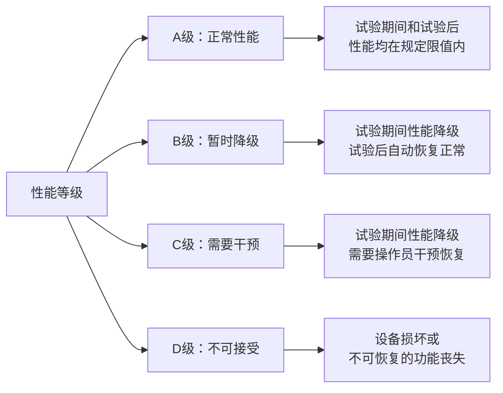
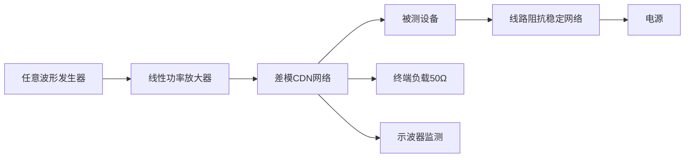
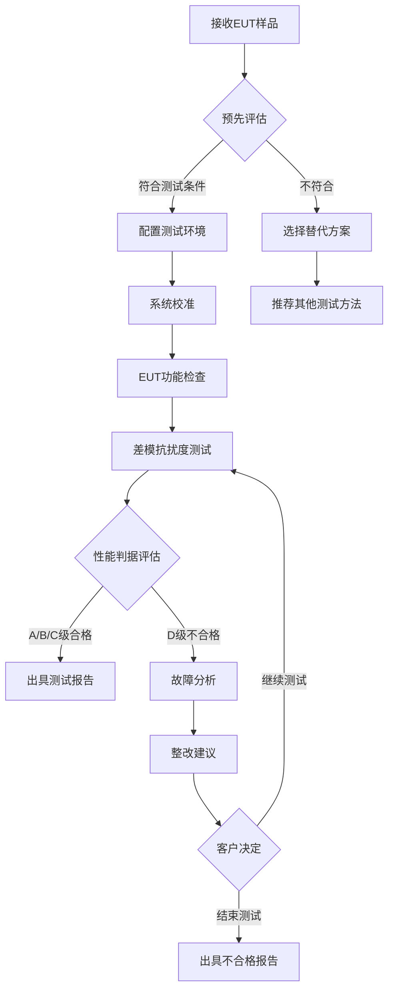

# GB/T 17626.19-2014 - 电磁兼容 试验和测量技术 第19部分：差模传导骚扰抗扰度试验

## 1. 标准概述

### 1.1 技术摘要

> 本标准规定了在频率范围2kHz-150kHz内，评估电气和电子设备对差模传导骚扰抗扰度的试验方法和技术要求。主要针对电力电子设备(如变频器、开关电源、智能电表)产生的低频差模骚扰对其他设备的影响进行测试评估。

### 1.2 标准定位

- **技术领域**：EMS抗扰度测试
- **应用层级**：测试方法标准
- **强制属性**：推荐性
- **实施状态**：现行有效

## 2. 物理原理与理论基础

### 2.1 电磁现象机理

差模传导骚扰是指在电源线路的火线和中性线之间传播的电磁干扰信号，主要由电力电子设备的非线性工作特性产生：

**差模骚扰产生机理**：
$$
i_{DM}(t) = I_{DC} + \sum_{n=1}^{\infty} I_n \cos(n\omega_s t + \phi_n)
$$

**差模阻抗特性**：
$$
Z_{DM}(f) = R_{line} + j2\pi f L_{line} + \frac{1}{j2\pi f C_{line}}
$$

**差模传播特性**：
$$
H_{DM}(f) = \frac{Z_{load}}{Z_{source} + Z_{line} + Z_{load}}
$$

### 2.2 数学模型

**CDN差模耦合特性**：
$$
V_{coupled} = V_{input} \cdot \frac{Z_{CDN}}{Z_{CDN} + Z_{source}} \cdot \frac{Z_{load}}{Z_{load} + Z_{line}}
$$

**电力电子开关频谱分析**：
$$
S_{switch}(f) = \frac{\sin^2(\pi f T_{on})}{\pi^2 f^2 T_{on}^2} \cdot \frac{V_{switch}^2}{f_s}
$$

**滤波器衰减计算**：
$$
A_{filter}(f) = 20\log_{10}\left|\frac{1}{1 + j2\pi f RC}\right|
$$

### 2.3 关键参数定义

> **重要说明**：所有公式中出现的字母和符号必须在此表格中给出明确的定义和物理意义说明。

| 参数符号 | 参数名称 | 物理意义 | 单位 | 典型值 |
|---------|---------|---------|------|--------|
| $i_{DM}$ | 差模电流 | 火线与中性线间的电流差 | A | 0.01-1 |
| $I_{DC}$ | 直流分量 | 差模电流的直流成分 | A | 0.1-10 |
| $I_n$ | 谐波分量 | 第n次谐波电流幅值 | A | 0.001-0.1 |
| $\omega_s$ | 开关角频率 | 电力电子开关频率 | rad/s | $10^4-10^6$ |
| $Z_{DM}$ | 差模阻抗 | 线路的差模阻抗特性 | Ω | 10-1000 |
| $R_{line}$ | 线路电阻 | 导线的电阻成分 | Ω | 0.1-10 |
| $L_{line}$ | 线路电感 | 导线的电感成分 | H | $10^{-6}-10^{-3}$ |
| $C_{line}$ | 线路电容 | 导线间的电容成分 | F | $10^{-12}-10^{-9}$ |
| $Z_{CDN}$ | CDN阻抗 | 耦合去耦网络的阻抗 | Ω | 50 |
| $V_{coupled}$ | 耦合电压 | 通过CDN耦合到EUT的电压 | V | 2-60 |
| $T_{on}$ | 导通时间 | 开关器件的导通时间 | s | $10^{-6}-10^{-3}$ |
| $f_s$ | 开关频率 | 电力电子设备开关频率 | Hz | $10^3-10^5$ |

## 3. 技术要求详解

### 3.1 限值要求

**试验等级与电压对应关系**：
| 等级 | 环境描述 | 试验电压(V) | 典型应用场景 |
|------|----------|-------------|-------------|
| 1 | 保护良好环境 | 2 | 实验室、数据中心 |
| 2 | 典型商业环境 | 6 | 办公楼、商场 |
| 3 | 典型工业环境 | 20 | 工厂、变电站 |
| 4 | 恶劣工业环境 | 60 | 钢铁厂、电弧炉 |
| X | 开放等级 | 用户定义 | 特殊应用环境 |

### 3.2 性能等级划分

### 3.3 适用范围界定

- **包含**：智能电表、家用电器、工业控制设备、通信设备、医疗器械
- **不包含**：额定电压超过280V的设备、射频发射设备、大功率工业装置
- **特殊考虑**：电力电子设备既可能是骚扰源也可能是受扰设备

## 4. 测试方法与程序

### 4.1 测试配置

**差模传导抗扰度测试配置示意图**：

**CDN网络特性要求**：
- 差模耦合阻抗：50Ω±5Ω
- 共模隔离度：>40dB
- 频率范围：2kHz-150kHz
- 插入损耗：<3dB

### 4.2 测试步骤

1. **准备阶段**
   - 环境条件确认：温度15-35°C，湿度30-60%RH
   - 设备校准检查：信号发生器、功率放大器、示波器
   - EUT预处理：按照产品说明书正常运行30分钟
   - 建立性能监测和数据记录系统

2. **系统校准阶段**
   - 在无EUT条件下校准CDN传输特性
   - 测量信号发生器到CDN输出端的传输函数
   - 验证差模耦合效率和共模抑制比
   - 记录校准数据建立修正表

3. **抗扰度测试阶段**
   - 将EUT连接到CDN输出端
   - 从最低试验等级开始逐级测试
   - 在每个试验等级下扫频测试(2kHz-150kHz)
   - 每个频率点持续测试至少30秒
   - 记录EUT在不同频率和电平下的响应

4. **数据记录阶段**
   - 记录试验条件：频率、电压、波形、持续时间
   - 记录EUT性能状态：正常、降级、故障
   - 记录异常现象和恢复时间
   - 拍照记录试验配置和异常现象

### 4.3 判定准则

**合格判定标准**：
- 在规定的试验等级下，EUT应满足产品标准规定的性能判据
- A级：试验期间和试验后设备均正常工作，所有功能完全可用
- B级：试验期间可以有暂时性能降级，但试验后必须自动恢复正常
- C级：允许需要操作员干预的暂时性能降级，但不能有数据丢失
- D级：不允许设备损坏、数据丢失或不可恢复的功能丧失

## 5. 测试设备与环境

### 5.1 主要测试设备

**差模传导抗扰度测试设备规范**：
| 设备名称 | 技术指标 | 校准要求 | 参考型号 |
|---------|---------|---------|---------|
| 任意波形发生器 | 2kHz-150kHz, 输出阻抗50Ω, THD<0.1% | 12个月校准 | Keysight 33622A |
| 线性功率放大器 | 100W输出, 2kHz-150kHz, 线性度±0.5dB | 12个月线性度检查 | AR 100A250 |
| 差模CDN网络 | 差模阻抗50Ω, 共模抑制>40dB | 24个月网络参数验证 | Teseq CDN M5 |
| 高精度示波器 | 带宽≥1MHz, 采样率≥10MSa/s | 12个月校准 | Keysight DSOX3024A |
| 失真度测量仪 | THD测量精度0.01%, 2kHz-150kHz | 12个月校准 | Audio Precision APx525 |

### 5.2 测试环境要求

**实验室环境条件**：
- **电磁环境**：背景干扰电平应小于试验信号20dB以上
- **物理环境**：温度15-35°C(±2°C)，湿度30%-60% RH(±5%)
- **电源质量**：电压稳定度±2%，频率稳定度±0.5%，THD<3%
- **接地系统**：测试台与参考地平面良好连接，接地阻抗<0.1Ω

**CDN网络性能验证**：
- 差模耦合阻抗：50Ω±5Ω (2kHz-150kHz)
- 共模抑制比：>40dB (全频段)
- 插入损耗：<3dB (差模路径)
- 隔离度：>60dB (端口间隔离)

## 6. 工程实施指南

### 6.1 典型问题与对策

| 常见问题 | 可能原因 | 建议对策 | 预期效果 |
|---------|---------|---------|---------|
| 低频段耦合效率低 | CDN低频特性不佳 | 使用专用低频CDN或变压器耦合 | 提高2-10kHz频段耦合效率 |
| 波形失真严重 | 功率放大器非线性 | 降低驱动电平或更换线性放大器 | THD<1% |
| EUT响应不稳定 | 电源纹波影响 | 增加电源滤波或使用线性电源 | 提高测试重现性 |
| 频率扫描时间长 | 手动逐点测试 | 采用自动测试系统 | 测试效率提升5倍 |

### 6.2 测试流程优化

### 6.3 成本控制建议

**设备投资优化策略**：
- **多功能集成**：选择能同时支持多个EMC测试项目的通用设备
- **频段优化配置**：根据主要测试产品类型配置相应频段的设备
- **校准成本控制**：建立内部校准能力，减少外送校准费用

**测试效率提升方案**：
- **自动化测试**：开发自动化测试软件，减少人工操作时间
- **批量测试安排**：同类产品集中测试，减少设备配置变更
- **预测试筛选**：使用简化预测试识别问题产品，避免完整测试浪费

## 7. 标准差异与互认

### 7.1 国际标准对比

| 对比项 | GB/T 17626.19 | IEC 61000-4-19 | 差异说明 | 互认情况 |
|--------|---------------|----------------|----------|----------|
| 频率范围 | 2kHz-150kHz | 2kHz-150kHz | 完全一致 | 直接互认 |
| 试验等级 | 1,2,3,4,X级 | 1,2,3,4,X级 | 完全一致 | 直接互认 |
| 电压范围 | 2V-60V | 2V-60V | 完全一致 | 直接互认 |
| 性能判据 | A,B,C,D级 | A,B,C,D级 | 完全一致 | 直接互认 |
| 测试方法 | CDN差模耦合 | CDN差模耦合 | 完全一致 | 直接互认 |

### 7.2 认证互认指南

**完全互认项目**：
- 所有技术参数和测试方法完全一致
- 测试设备技术要求相同
- 校准和溯源要求等效
- 测量不确定度评估方法一致

**互认注意事项**：
- 测试报告必须包含完整的试验参数和环境条件
- 校准证书必须溯源到国际标准或国家基准
- 测试人员资质必须满足相应认可机构要求
- 测试实验室需要通过相应的能力验证

## 8. 相关标准导航

### 8.1 上游标准

- [[GB_T_17626_1]] - 电磁兼容试验和测量技术一般实施指南
- [[IEC_61000-4-1]] - 国际基础标准，提供基本原理和通用要求
- [[IEC_61000-4-30]] - 电能质量测量方法，提供测量技术基础

### 8.2 平行标准

- [[GB_T_17626_6]] - 射频场感应的传导骚扰抗扰度试验(150kHz-80MHz)
- [[GB_T_17626_16]] - 0Hz-150kHz共模传导骚扰抗扰度试验
- [[IEC_61000-4-6]] - 国际射频传导骚扰抗扰度标准
- [[IEC_61000-4-16]] - 国际共模传导骚扰抗扰度标准

### 8.3 下游标准

- [[GB_4943_1]] - 信息技术设备安全标准(含EMC要求)
- [[GB_T_15153_1]] - 工业环境电磁兼容通用标准
- [[GB_17625_1]] - 电磁兼容限值谐波电流发射限值
- [[JJG_124]] - 电能表检定规程(含抗干扰要求)

### 8.4 应用相关标准

- [[DL_T_645]] - 多功能电能表通信协议(抗干扰要求)
- [[GB_T_17215_321]] - 交流电测量设备通用要求
- [[IEC_62052-11]] - 电能表设备通用要求

## 9. 附录

### 9.1 术语定义

**差模传导骚扰 (Differential mode conducted disturbance)**：在电力线路的火线和中性线之间传播的电磁骚扰信号。

**电力电子设备 (Power electronic equipment)**：使用电力电子器件(如IGBT、MOSFET)进行电能变换的设备。

**开关频率 (Switching frequency)**：电力电子开关器件的工作频率，通常在几kHz到几百kHz范围。

**差模阻抗 (Differential mode impedance)**：电力线路中火线和中性线之间呈现的阻抗特性。

**耦合去耦网络 (Coupling-Decoupling Network, CDN)**：用于将试验信号差模耦合到被试设备电源端口的专用网络。

### 9.2 参考文献

1. IEC 61000-4-19:2014, Electromagnetic compatibility (EMC) - Part 4-19: Testing and measurement techniques - Test for immunity to conducted, differential mode disturbances and signalling in the frequency range 2 kHz to 150 kHz at AC power ports
2. GB/T 17626.1-2006, 电磁兼容 试验和测量技术 第4-1部分：试验技术 概述
3. IEC 61000-4-30:2015, Electromagnetic compatibility (EMC) - Part 4-30: Testing and measurement techniques - Power quality measurement methods
4. CISPR 16-1-2:2014, 无线电骚扰和抗扰度测量设备和测量方法规范

### 9.3 修订记录

| 版本 | 日期 | 主要变化 | 影响评估 |
|------|------|----------|----------|
| Ed.2014.0 | 2014-12-05 | 等同采用IEC 61000-4-19:2014，建立差模传导抗扰度测试方法 | 填补了国内低频传导抗扰度测试标准空白，为电力电子设备EMC评估提供技术依据 |

---

**标准声明**：本文档为GB/T 17626.19-2014标准的技术解读，等同采用IEC 61000-4-19:2014国际标准。作为推荐性国家标准，为差模传导骚扰抗扰度试验提供了标准化的测试方法和技术要求，特别适用于评估电力电子设备产生的低频差模干扰影响。

---

*文档版本：v1.0*  
*最后更新：2025年6月19日*  
*编制：电磁兼容技术标准化工作组*  
*审核：全国无线电干扰标准化技术委员会*