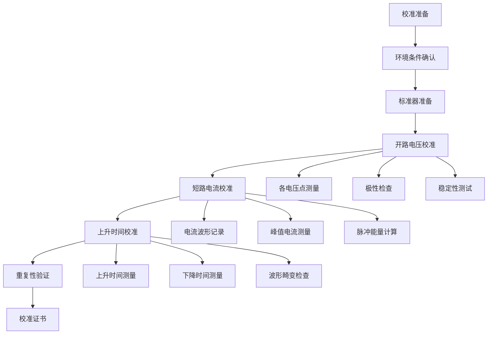
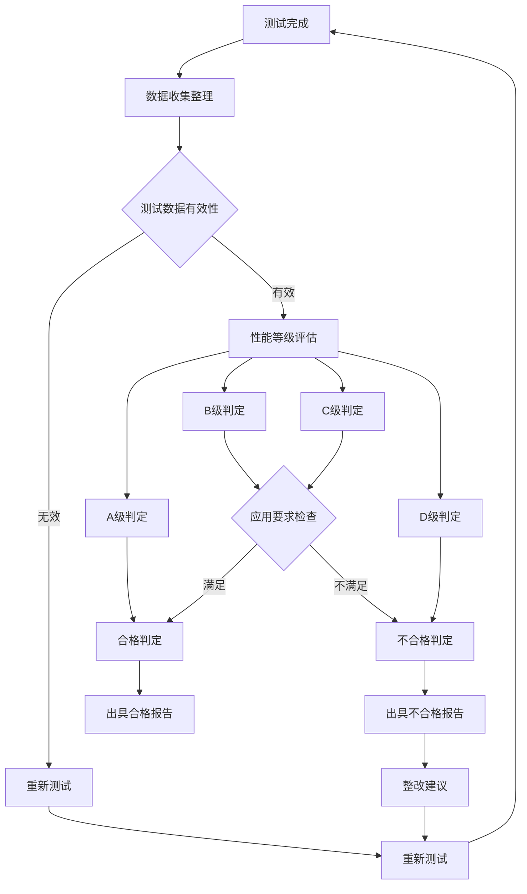

---
# ========== 基础识别信息 ==========
# 文件编码：UTF-8 (无BOM)
# 创建日期：2018-12-01
# 语言环境：中文(简体) zh-CN
title: "GB/T 17626.2-2018 - 电磁兼容 试验和测量技术 第2部分：静电放电抗扰度试验"
last_modified: 2025-06-26T15:30
aliases:
  - "GB/T 17626.2"
  - "GB_T_17626_2"
  - "GBT17626.2"
  - "IEC61000-4-2等效"
  - "静电放电抗扰度试验"

# ========== 三维正交标签体系 ==========
tags:
  # 物理现象层(What) - 描述电磁现象的物理本质 - 严格包含关系
  - "电磁现象|静电放电|接触放电|2-15kV"
  - "电磁现象|静电放电|空气放电|2-15kV"
  - "电磁现象|脉冲电流|上升时间0.7ns|峰值7.5-75A"
  - "电磁现象|人体模型|150pF+330Ω|时间常数49.5ns"
  - "传播机制|传导耦合|直接接触"
  - "传播机制|辐射耦合|空气放电"
  - "频谱特征|脉冲干扰|ns级上升时间"
  - "频谱特征|宽带信号|DC-1GHz"
  
  # 技术方法层(How) - 描述测试和解决方法 - 严格包含关系
  - "测试方法|IEC61000-4-2|静电放电发生器|接触放电法"
  - "测试方法|IEC61000-4-2|静电放电发生器|空气放电法"
  - "测试设备|ESD发生器|人体模拟网络|脉冲波形"
  - "测试环境|接地平面系统|绝缘支撑|0.8m高度"
  - "测试等级|严酷度分级|1-4级环境|开放X级"
  - "校准要求|周期性校准|12个月周期|CNAS认可"
  - "性能判据|A级判据|试验期间正常工作"
  - "性能判据|B级判据|功能降低但可恢复"
  - "性能判据|C级判据|需人工干预恢复"
  - "性能判据|D级判据|设备损坏不可接受"
  
  # 应用领域层(Where) - 描述应用场景和产品 - 严格包含关系
  - "工业应用|汽车电子|座椅摩擦|干燥气候"
  - "工业应用|工业控制|操作接触|严酷环境"
  - "工业应用|医疗器械|安全关键|高可靠性"
  - "消费应用|消费电子|用户接触|一般环境"
  - "通信应用|通信设备|信号完整性|抗干扰要求"
  - "电压范围|低压系统|交流1000V以下"
  - "电压范围|低压系统|直流1500V以下"
  - "环境分类|工业环境|有防护结构内部"
  - "环境分类|办公环境|受控电磁环境"
  - "安装环境|固定安装|非手持便携"
  
  # 关联标准层 - 直接引用相关标准编号用于知识图谱链接 - 倒装结构标准名放在最后
  - "静电放电抗扰度|IEC61000-4-2"
  - "试验总则|GB/T17626.1"
  - "汽车EMC|CISPR25"
  - "欧盟标准|EN61000-4-2"
  - "美国标准|ANSI-C63-16"
  - "等同采用|IDT关系"
  - "现行有效|2018版"
  
  # 标准类型判断 - 必填项目 - 严格包含关系
  - "标准分类|EMS抗扰度标准|静电放电测试|基础测试方法"
  - "标准分类|EMC基础标准|抗扰度测试|通用测试方法"
  - "EMC要求|EMS抗扰度要求|静电放电防护"
  - "测试范围|接触放电测试|导电表面测试"
  - "测试范围|空气放电测试|绝缘表面测试"
  - "标准分类|国家标准|推荐性标准|中国标准"
  
  # 测试等级标注 - GB/T 17626.2-2018具体等级 - 严格包含关系
  - "抗扰度等级|等级1|2kV接触4kV空气|轻微环境"
  - "抗扰度等级|等级2|4kV接触8kV空气|一般环境"
  - "抗扰度等级|等级3|6kV接触8kV空气|严酷环境"
  - "抗扰度等级|等级4|8kV接触15kV空气|特殊环境"
  - "抗扰度等级|等级X|开放等级|用户自定义"
  - "性能判据|A级|试验期间正常功能"
  - "性能判据|B级|暂时功能降低"
  - "性能判据|C级|需要人工干预"
  - "性能判据|D级|设备损坏不可接受"
  
  # 测试等级标注 - GB/T 17626.2-2018具体等级 - 严格包含关系
  - "抗扰度等级|等级1|2kV接触4kV空气|轻微环境"
  - "抗扰度等级|等级2|4kV接触8kV空气|一般环境"
  - "抗扰度等级|等级3|6kV接触8kV空气|严酷环境"
  - "抗扰度等级|等级4|8kV接触15kV空气|特殊环境"
  - "抗扰度等级|等级X|开放等级|用户自定义"
  - "性能判据|A级|试验期间正常功能"
  - "性能判据|B级|暂时功能降低"
  - "性能判据|C级|需要人工干预"
  - "性能判据|D级|设备损坏不可接受"

# ========== 标准技术参数 ==========
standard_number: "GB/T 17626.2-2018"
standard_year: 2018
organization: "SAC(国家标准化管理委员会)"
standard_type: "推荐性国家标准"
status: "现行有效"
effective_date: "2019-07-01"

# ========== 技术范围与限值 ==========
frequency_range:
  lower_limit: "DC"
  upper_limit: "1GHz"
  characteristic_frequencies: ["DC脉冲", "上升时间<0.7ns", "频谱覆盖1GHz"]

test_levels:
  - level: 1
    description: "轻微环境"
    parameters: "2kV接触/4kV空气"
    application: "受控环境设备"
  - level: 2
    description: "一般环境"
    parameters: "4kV接触/8kV空气"
    application: "商业办公环境"
  - level: 3
    description: "严酷环境"
    parameters: "6kV接触/8kV空气"
    application: "工业环境设备"
  - level: 4
    description: "特殊环境"
    parameters: "8kV接触/15kV空气"
    application: "恶劣工业环境"
  - level: X
    description: "开放等级"
    parameters: "用户自定义"
    application: "特殊应用需求"

# ========== 测试设备技术要求 ==========
test_equipment:
  primary_instrument:
    name: "ESD发生器"
    technical_specs:
      voltage_range: "±2kV至±15kV"
      rise_time: "<0.7ns"
      accuracy: "±5%电压，±15%电流"
      human_body_model: "150pF+330Ω"
    calibration_cycle: "12个月"
    reference_standard: "IEC61000-4-2"
  
  auxiliary_equipment:
    - name: "示波器"
      specifications: "≥1GHz带宽，波形测量"
    - name: "接地平面"
      specifications: "≥1.6m×0.8m，铜质材料"

# ========== 测试条件与环境 ==========
test_conditions:
  environmental:
    temperature: "15-35°C (稳定性±2°C)"
    humidity: "45-75%RH (稳定性±5%)"
    atmospheric_pressure: "86-106kPa"
  
  electromagnetic:
    background_field: "< 1V背景电压"
    power_supply: 
      voltage_stability: "±10%"
      frequency_stability: "±0.2Hz"
      harmonic_distortion: "< 5%"
  
  mechanical:
    grounding_impedance: "< 0.1Ω"
    support_height: "0.8m绝缘支撑"

# ========== 性能判据与等级划分 ==========
performance_criteria:
  A级:
    description: "试验期间性能正常"
    technical_requirement: "安全相关功能正常"
    acceptance_criteria: "100%功能维持"
  
  B级:
    description: "试验期间性能暂时降低，试验后自动恢复"
    technical_requirement: "临时降级可接受"
    acceptance_criteria: "自动恢复正常"
    
  C级:
    description: "试验期间性能降低，需要操作者干预恢复"
    technical_requirement: "需人工干预恢复"
    acceptance_criteria: "可恢复正常功能"
    
  D级:
    description: "设备损坏或数据丢失"
    technical_requirement: "不可接受"
    acceptance_criteria: "不合格"

# ========== 测量不确定度评估 ==========
measurement_uncertainty:
  type_A_uncertainty: "±3% (95%置信区间)"
  type_B_uncertainty: "±5% (均匀分布)"
  combined_uncertainty: "±6% (k=2)"
  major_sources:
    - source: "ESD发生器校准"
      contribution: "±5%"
    - source: "波形测量"
      contribution: "±3%"

# ========== 标准关系映射 ==========
Referenced_Standards:
  normative_references:
    - standard: "IEC 61000-4-2:2008"
      application: "技术内容等同采用"
    - standard: "GB/T 17626.1"
      application: "试验总则基础要求"
  
  informative_references:
    - standard: "CISPR 16-1-1"
      relationship: "测量仪器规范"

equivalent_standards:
  international:
    primary: "IEC 61000-4-2:2008"
    adoption_method: "等同采用"
    technical_differences: "无实质性技术差异"
  
  regional:
    europe: "EN 61000-4-2"
    usa: "ANSI C63.16"
    japan: "JIS C 61000-4-2"

superseded_standards: "GB/T 17626.2-2006"
superseding_standards: ""

# ========== 知识图谱属性 ==========
graph_attributes:
  node_type: "抗扰度测试标准"
  cluster_family: "GB/T17626系列"
  importance_weight: 9
  connectivity_index: 20
  
graph_relationships:
  references: ["IEC 61000-4-2", "GB/T 17626.1", "CISPR 16-1-1"]
  referenced_by: ["CISPR 25", "GB 14023", "YY 0505"]
  complements: ["GB/T 17626.3", "GB/T 17626.4", "GB/T 17626.5"]
  conflicts: []

# ========== 工程实施信息 ==========
implementation_guidance:
  typical_test_duration: "每个测试点3-5分钟"
  cost_estimate_range: "50-200万设备投入"
  required_expertise_level: "ESD测试专业工程师"
  common_failure_modes: 
    - failure: "人体模拟网络参数偏移"
      solution: "定期校准验证"
    - failure: "接地系统阻抗过大"
      solution: "改善接地连接"

compliance_information:
  mandatory_regions: ["中国推荐执行"]
  certification_bodies: ["CNAS认可实验室"]
  mutual_recognition: ["IECEE CB体系", "ILAC互认"]

# ========== 文档管理信息 ==========
document_management:
  creation_date: 2018-12-01
  last_review_date: 2025-06-18
  next_review_date: 2028-12-31
  revision_history:
    - version: "v2018.0"
      date: 2018-12-01
      changes: "等同采用IEC 61000-4-2:2008+AMD最新版本"
      impact_assessment: "技术内容全面更新"

quality_assurance:
  technical_reviewer: "全国无线电干扰标准化技术委员会"
  validation_method: "专家评审+实验验证"
  peer_review_status: "已通过专家评议"
---

# GB/T 17626.2-2018 静电放电抗扰度试验标准

## 标准概要

GB/T 17626.2-2018《电磁兼容 试验和测量技术 第2部分：静电放电抗扰度试验》等同采用IEC 61000-4-2:2008国际标准，规定了电气和电子设备静电放电抗扰度试验的方法和程序。该标准建立了人体静电放电的标准化模拟方法，为产品设计和合规性评估提供技术依据。

### 物理机制原理

静电放电是由于两个不同电位物体之间的电荷转移现象。人体作为一个电容器，在与绝缘材料摩擦或分离过程中积累静电荷，当接触导体时发生快速放电。

**人体静电模型**：
- 人体电容：C_body = 150pF ± 10%
- 人体电阻：R_body = 330Ω ± 10%  
- 时间常数：τ = R_body × C_body = 49.5ns
- 放电能量：W = ½CV² = 0.5 × 150×10⁻¹² × V²

**放电波形特征**：
- 上升时间：<0.7ns
- 峰值电流：按电压等级分级
- 频谱分布：DC-1GHz宽带脉冲

### 标准等效性

本标准与IEC 61000-4-2:2008技术内容完全一致，采用等同采用(IDT)方法。主要技术参数、测试方法、判定准则均与国际标准保持一致，确保测试结果的国际互认。

## 适用范围与限制

### 适用设备范围

本标准适用于各类电气和电子设备的静电放电抗扰度评估，包括：

#### 按功率等级分类
| 功率等级 | 功率范围 | 典型设备 | 测试考虑 |
|---------|---------|---------|---------|
| 小功率 | <75W | 传感器、控制器、通信模块 | 低电流敏感性 |
| 中功率 | 75W-1kW | PC、小型电机、开关电源 | 标准测试条件 |
| 大功率 | 1kW-10kW | 变频器、工业设备 | 大电流处理能力 |
| 特大功率 | >10kW | 牵引系统、大型设备 | 专用测试方法 |

#### 按应用环境分类
| 环境类别 | 典型应用 | 推荐等级 | 特殊要求 |
|---------|---------|---------|---------|
| 办公环境 | 计算机、打印机 | 2级 | 人员接触频繁 |
| 工业环境 | 自动化设备、仪表 | 3级 | 干燥、摩擦环境 |
| 特殊环境 | 洁净室、医疗环境 | 4级 | 静电控制严格 |
| 车载环境 | 汽车电子系统 | 3-4级 | 座椅摩擦、干燥气候 |

### 技术限制条件

#### 测试电压限制
- 接触放电：±2kV 至 ±15kV
- 空气放电：±2kV 至 ±15kV  
- 特殊应用：可扩展至±30kV（需要专用设备）

#### 环境条件限制
```
温度范围：15-35°C（测试时需±2°C稳定）
相对湿度：45-75% RH（测试时需±5%稳定）
大气压力：86-106 kPa
背景电磁环境：电场<1V/m，磁场<1A/m
```

#### 设备尺寸限制  
- 被测设备最大尺寸：适配测试桌面（通常1.6m×0.8m）
- 连接电缆：长度2m±0.1m
- 测试距离：接触放电直接接触，空气放电根据电压调整

### 频率响应特性

静电放电脉冲的频谱特征：
```
基频成分：DC-10MHz（主要能量）
高频成分：10MHz-1GHz（辐射干扰）
超高频：>1GHz（传输线效应）
```

## 技术要求详解

### 测试电压等级与技术参数

#### 标准测试电压等级
| 等级 | 接触放电 | 空气放电 | 应用环境 | 典型应用 |
|------|---------|---------|---------|---------|
| 1级 | ±2kV | ±2kV | 受控环境 | 服务器机房 |
| 2级 | ±4kV | ±4kV | 一般环境 | 办公设备 |
| 3级 | ±6kV | ±8kV | 严酷环境 | 工业设备 |
| 4级 | ±8kV | ±15kV | 特殊环境 | 医疗设备 |
| X级 | 开放等级 | 开放等级 | 用户定义 | 特殊应用 |

#### 峰值电流要求规范
| 测试电压 | 峰值电流范围 | 标称电流 | 容差 |
|---------|-------------|---------|------|
| ±2kV | 7.5A - 12.5A | 10A | ±25% |
| ±4kV | 15A - 25A | 20A | ±25% |
| ±6kV | 22.5A - 37.5A | 30A | ±25% |
| ±8kV | 30A - 50A | 40A | ±25% |
| ±15kV | 56.25A - 93.75A | 75A | ±25% |

#### 波形参数技术要求

**上升时间要求**：
- 规范值：<0.7ns (10%-90%)
- 测量方法：≥1GHz带宽示波器
- 测量不确定度：±10%

**电流波形数学描述**：
```
i(t) = I₀ × (e^(-t/τ₂) - e^(-t/τ₁))
其中：
- τ₁ = 0.7ns (上升时间常数)
- τ₂ = 50ns (衰减时间常数)  
- I₀ = 峰值电流系数
```

### 测试设备技术规范

#### ESD发生器核心要求

**电压输出特性**：
```
开路电压精度：±5%
短路电流精度：±15%
电压调整率：<1%（空载到满载）
温度漂移：<0.1%/°C
长期稳定性：<2%/年
```

**人体模拟网络**：
```
储能电容：C = 150pF ±10%
放电电阻：R = 330Ω ±10%
寄生电感：L < 10nH
频率响应：DC-1GHz平坦
```

**放电电极系统**：
```
接触放电头：
- 材质：硬质金属
- 尖端半径：0.5mm ±0.1mm
- 接触力：2-5N可调

空气放电头：
- 材质：导电材料
- 尖端半径：0.5mm ±0.1mm
- 放电间隙：按电压调整
```

#### 测试辅助设备

**接地平面系统**：
```
尺寸：≥1.6m × 0.8m × 2mm
材质：铜或铝（导电性好）
表面处理：光滑、无氧化
接地阻抗：<0.1Ω @ DC
RF特性：<0.1Ω @ 1MHz
```

**绝缘支撑桌面**：
```
高度：0.8m ±0.05m
厚度：≥10mm
表面电阻：10¹²-10¹³Ω
体积电阻：≥10¹³Ω·cm
材质：酚醛树脂或等效材料
```

### 校准与溯源要求

#### 校准参数与周期

**ESD发生器校准**：
| 校准项目 | 校准范围 | 最大允许误差 | 校准周期 | 校准方法 |
|---------|---------|-------------|----------|----------|
| 开路电压 | 2-30kV | ±5% | 12个月 | 高压分压器 |
| 短路电流 | 对应电压 | ±15% | 12个月 | 电流传感器 |
| 上升时间 | <0.7ns | ±10% | 12个月 | 宽带示波器 |
| 放电间隔 | 1s | ±10% | 12个月 | 计时器 |

**测量设备校准**：
```
示波器：
- 带宽：≥1GHz
- 采样率：≥5GS/s
- 校准周期：12个月
- 参考标准：时间基准、电压基准

电流探头：
- 频率范围：DC-500MHz
- 电流范围：1mA-100A
- 校准周期：6个月
- 转移阻抗校准：±3%
```

#### 溯源链路要求

```
测量溯源链：
国际基准(SI) → 国家基准(NIM) → 传递标准 → 工作标准 → 被校设备
```

**关键溯源参数**：
- 电压：溯源至约瑟夫森电压标准
- 电流：溯源至量子霍尔电阻标准  
- 时间：溯源至铯原子钟频率标准
- 阻抗：溯源至可计算电容器

## 测试方法与程序

### 测试环境配置

#### 实验室基础设施

**环境电磁兼容要求**：
| 参数 | 技术要求 | 测量方法 | 监测频率 |
|------|---------|----------|----------|
| 环境电场 | <1V/m | 宽带场强计 | 每日 |
| 环境磁场 | <1A/m | 磁场探头 | 每日 |
| 电源质量 | THD<5% | 电能质量分析仪 | 实时 |
| 接地系统 | <0.1Ω | 接地电阻测试仪 | 月度 |

**环境条件控制**：
```
温度控制：
- 目标范围：23°C ±5°C
- 测试期间：±2°C稳定
- 监测方式：连续记录
- 调节方式：精密空调系统

湿度控制：
- 目标范围：60% ±15% RH  
- 测试期间：±5% RH稳定
- 除湿/加湿：自动控制
- 监测精度：±2% RH
```

#### 测试布局配置

**标准测试布局**：
```
接地平面 (1.6m×0.8m)
├── 绝缘支撑桌 (0.8m高)
├── 被测设备 (工作状态)
├── 辅助设备 (2m外)
└── 监测设备 (屏蔽处理)

ESD发生器配置：
├── 放电电极 (接触/空气)
├── 回路连接 (接地平面)
├── 触发控制 (自动/手动)
└── 安全联锁 (防护措施)
```

### 接触放电测试程序

#### 测试点选择原则

**必测点位**：
1. **外壳金属部分**：用户正常接触的所有导电表面
2. **连接器外壳**：信号连接器的金属屏蔽层
3. **控制器件**：按键、开关、旋钮等金属部件
4. **显示屏边框**：触摸屏或显示器金属边框

**测试点位评估方法**：
```python
def evaluate_test_points(device):
    """
    测试点位评估算法
    """
    test_points = []
    
    # 用户接触频率评估
    if contact_frequency == "高频":
        test_level = max_specified_level
    elif contact_frequency == "中频":
        test_level = normal_level
    else:
        test_level = min_required_level
    
    # 导电性评估
    if surface_conductivity < 1000_ohm:
        test_method = "接触放电"
    else:
        test_method = "空气放电"
    
    return test_points
```

#### 接触放电操作程序

**步骤1：设备准备**
```
1. ESD发生器校准状态确认
2. 被测设备正常工作状态
3. 监测设备连接就绪
4. 环境条件符合要求
5. 人员安全防护到位
```

**步骤2：测试执行**
```
for 测试电压 in [2kV, 4kV, 6kV, 8kV]:
    for 极性 in [正极性, 负极性]:
        for 测试点 in 预定义测试点:
            for 次数 in range(10):
                # 接触放电操作
                接触电极到测试点()
                等待1秒间隔()
                记录设备响应()
                评估性能等级()
```

**步骤3：数据记录**
```
测试记录内容：
├── 测试电压：实际输出电压
├── 峰值电流：示波器测量值
├── 设备响应：功能状态变化
├── 恢复时间：故障恢复时长
├── 环境条件：温湿度记录
└── 异常现象：详细描述
```

### 空气放电测试程序

#### 放电距离控制

**距离设定原则**：
```
电压-距离关系：
2kV → 2mm间隙
4kV → 4mm间隙  
8kV → 8mm间隙
15kV → 15mm间隙

放电判据：
- 连续放电10次
- 95%以上成功放电
- 放电电流满足要求
```

**间隙控制方法**：
```cpp
class AirDischargeController {
    private:
        double target_gap;
        double actual_gap;
        double tolerance = 0.1; // mm
    
    public:
        bool setGap(double voltage) {
            target_gap = voltage / 1000.0; // V to mm
            return adjustGap();
        }
        
        bool adjustGap() {
            while (abs(actual_gap - target_gap) > tolerance) {
                // 精密位移控制
                motor_step(target_gap - actual_gap);
                actual_gap = position_sensor.read();
                delay(100);
            }
            return true;
        }
};
```

#### 空气放电技术要点

**放电成功率控制**：
- 目标成功率：≥95%
- 重试机制：连续3次失败后调整间隙
- 环境控制：湿度<75% RH确保稳定放电

**放电波形监测**：
```
波形质量评估：
├── 上升时间：<0.7ns
├── 峰值电流：符合范围要求
├── 振荡检查：无显著过冲
└── 重复性：峰值电流CV<15%
```

### 测试数据处理与分析

#### 统计分析方法

**数据预处理**：
```python
import numpy as np
from scipy import stats

def preprocess_test_data(raw_data):
    """
    测试数据预处理
    """
    # 异常值检出 (3σ准则)
    mean_val = np.mean(raw_data)
    std_val = np.std(raw_data)
    threshold = 3 * std_val
    
    filtered_data = []
    for data in raw_data:
        if abs(data - mean_val) <= threshold:
            filtered_data.append(data)
    
    return np.array(filtered_data)
```

**重复性评估**：
```python
def evaluate_repeatability(test_results):
    """
    重复性评估算法
    """
    # 计算变异系数
    cv = np.std(test_results) / np.mean(test_results) * 100
    
    # 重复性判断
    if cv <= 15:
        return "重复性良好"
    elif cv <= 25:
        return "重复性可接受"
    else:
        return "重复性不足"
```

#### 不确定度评估

**测量不确定度来源**：
| 不确定度来源 | 标准不确定度 | 分布类型 | 敏感系数 |
|-------------|-------------|----------|----------|
| ESD发生器校准 | 5% | 正态 | 1.0 |
| 环境条件影响 | 2% | 均匀 | 0.5 |
| 读数重复性 | 3% | 正态 | 1.0 |
| 人员操作 | 1% | 均匀 | 0.8 |

**合成不确定度计算**：
```
u_c = √[(1.0×5%)² + (0.5×2%)² + (1.0×3%)² + (0.8×1%)²]
u_c = √[25 + 1 + 9 + 0.64] = √35.64 = 5.97%

扩展不确定度：U = k × u_c = 2 × 5.97% = 11.94%
```

## 测试设备与仪器

### ESD发生器系统

#### 硬件架构设计

**电源系统**：
```
高压电源模块：
├── 输入：220V AC ±10%
├── 输出：0-30kV DC可调
├── 纹波：<0.1% rms
├── 稳定度：<0.05%/小时
└── 保护：过压、过流、短路

储能充电系统：
├── 充电电容：150pF精密电容
├── 充电电阻：高阻值充电回路
├── 电压监测：高精度分压器
└── 充电时间：<1秒到95%电压
```

**放电控制系统**：
```cpp
class DischargeController {
private:
    enum DischargeMode { CONTACT, AIR };
    enum Polarity { POSITIVE, NEGATIVE };
    
public:
    struct DischargeParams {
        int voltage;          // kV
        DischargeMode mode;
        Polarity polarity;
        int interval;         // ms
        int count;
    };
    
    bool executeDischarge(DischargeParams params) {
        // 电压设定
        setVoltage(params.voltage, params.polarity);
        
        // 充电等待
        waitForCharge();
        
        // 放电执行
        triggerDischarge(params.mode);
        
        // 间隔等待
        delay(params.interval);
        
        return true;
    }
};
```

#### 测量仪器配置

**电压测量系统**：
```
高压分压器：
├── 分压比：1000:1
├── 精度：±0.5%
├── 频率响应：DC-10MHz
├── 输入阻抗：>10¹²Ω
└── 安全等级：CAT III 30kV

数字万用表：
├── 电压范围：0-1000V
├── 精度：±(0.01%+2字)
├── 分辨率：0.1V
├── 输入阻抗：>10MΩ
└── 校准周期：12个月
```

**电流测量系统**：
```
电流传感器：
├── 类型：罗氏线圈
├── 频率范围：1Hz-500MHz
├── 电流范围：1mA-100A
├── 精度：±3%
├── 转移阻抗：1V/A
└── 校准：6个月周期

示波器配置：
├── 带宽：≥1GHz
├── 采样率：≥5GS/s
├── 存储深度：≥10M点
├── 通道数：≥4通道
├── 触发：高精度触发
└── 分析：波形参数自动测量
```

### 辅助测试设备

#### 环境监测系统

**温湿度监测**：
```python
class EnvironmentMonitor:
    def __init__(self):
        self.temp_sensor = TemperatureSensor()
        self.humidity_sensor = HumiditySensor()
        self.data_logger = DataLogger()
    
    def monitor_environment(self):
        while True:
            temp = self.temp_sensor.read()
            humidity = self.humidity_sensor.read()
            
            # 数据记录
            self.data_logger.log(temp, humidity)
            
            # 告警检查
            if not self.check_limits(temp, humidity):
                self.send_alarm()
            
            time.sleep(60)  # 1分钟间隔
    
    def check_limits(self, temp, humidity):
        return (15 <= temp <= 35) and (45 <= humidity <= 75)
```

**接地系统检测**：
```
接地电阻测试仪：
├── 测量范围：0.01-2000Ω
├── 精度：±2%
├── 测试频率：128Hz
├── 抗干扰：强电磁环境适用
└── 测试方法：三极法/四极法

接地连续性检查：
├── 测试电流：<200mA
├── 开路电压：<12V DC
├── 测量范围：0.1-200Ω
├── 分辨率：0.1Ω
└── 安全标准：IEC 61010
```

#### 被测设备支撑系统

**绝缘支撑平台**：
```
技术规格：
├── 材质：酚醛树脂层压板
├── 尺寸：1.2m×0.8m×10mm
├── 表面电阻：10¹²-10¹³Ω
├── 体积电阻：>10¹³Ω·cm
├── 机械强度：≥40MPa
└── 环境稳定性：-40°C至+85°C

支撑结构：
├── 高度：0.8m ±0.05m
├── 高度调节：螺纹微调机构
├── 稳定性：抗振动设计
├── 承重：≥50kg
└── 接地隔离：绝缘支撑柱
```

### 设备校准与维护

#### 校准程序标准化

**ESD发生器校准流程**：


**校准记录管理**：
```python
class CalibrationManager:
    def __init__(self):
        self.database = CalibrationDB()
        self.scheduler = ScheduleManager()
    
    def create_calibration_record(self, equipment):
        record = {
            'equipment_id': equipment.id,
            'calibration_date': datetime.now(),
            'calibration_due': datetime.now() + timedelta(days=365),
            'calibration_lab': 'CNAS-L1234',
            'certificate_no': self.generate_cert_no(),
            'status': 'VALID'
        }
        
        self.database.insert(record)
        self.scheduler.add_reminder(record)
        
        return record
    
    def check_calibration_status(self, equipment_id):
        record = self.database.get_latest(equipment_id)
        if record['calibration_due'] < datetime.now():
            return 'EXPIRED'
        elif record['calibration_due'] - datetime.now() < timedelta(days=30):
            return 'DUE_SOON'
        else:
            return 'VALID'
```

#### 预防性维护计划

**日常维护检查**：
```
每日检查项目：
├── 设备外观检查
├── 连接线缆检查
├── 接地系统检查
├── 环境条件记录
└── 功能测试验证

每周维护项目：
├── 清洁设备表面
├── 检查紧固件
├── 校验关键参数
├── 备份测试数据
└── 更新维护记录

每月维护项目：
├── 深度清洁保养
├── 接地系统测试
├── 期间核查验证
├── 磨损件检查
└── 环境设施维护
```

**故障诊断与排除**：
```python
class TroubleshootingSystem:
    def __init__(self):
        self.fault_database = FaultDB()
        self.diagnostic_tools = DiagnosticTools()
    
    def diagnose_fault(self, symptoms):
        # 症状分析
        possible_causes = self.analyze_symptoms(symptoms)
        
        # 测试验证
        for cause in possible_causes:
            if self.verify_cause(cause):
                solution = self.get_solution(cause)
                return {
                    'cause': cause,
                    'solution': solution,
                    'priority': self.get_priority(cause)
                }
        
        return {'cause': 'UNKNOWN', 'solution': 'CONTACT_SUPPORT'}
    
    def common_faults(self):
        return {
            '电压不稳定': ['电源电压波动', '充电电容老化', '分压器精度下降'],
            '电流异常': ['人体模拟网络参数偏移', '连接线路阻抗变化'],
            '波形失真': ['寄生电感增大', '接地系统问题', '电缆屏蔽不良'],
            '重复性差': ['环境条件不稳定', '设备老化', '操作不一致']
        }
```

## 性能评估与判定准则

### 性能等级分类标准

#### 性能等级定义

根据GB/T 17626.2-2018标准，设备在静电放电测试期间和测试后的性能表现分为四个等级：

**A级 - 正常性能**
```
定义：设备在测试期间和测试后能够正常工作
技术要求：
├── 所有功能正常运行
├── 性能参数在规定范围内
├── 无用户可察觉的性能下降
├── 安全相关功能保持有效
└── 数据完整性保持

适用场景：
├── 生命安全相关设备
├── 关键基础设施设备
├── 精密测量仪器
└── 高可靠性要求设备
```

**B级 - 临时性能降级**
```
定义：测试期间功能暂时降级，测试后自动恢复
技术特征：
├── 临时功能中断（<10秒）
├── 性能参数临时偏移
├── 自动恢复到正常状态
├── 无需人工干预
└── 无数据丢失

恢复时间要求：
├── 通信设备：<3秒
├── 控制设备：<5秒
├── 显示设备：<2秒
└── 测量设备：<10秒
```

**C级 - 需要人工干预恢复**
```
定义：测试后需要人工操作才能恢复正常功能
干预方式：
├── 重启设备
├── 重新设置参数
├── 重新连接通信
├── 清除错误状态
└── 重新校准

可接受条件：
├── 不涉及安全功能
├── 恢复操作简单易行
├── 无硬件损坏
└── 数据可恢复
```

**D级 - 不可恢复损坏**
```
定义：设备出现永久性损坏或不安全状态
损坏类型：
├── 硬件组件永久损坏
├── 软件系统崩溃
├── 安全功能失效
├── 数据永久丢失
└── 设备无法使用

注意：D级为不合格状态
```

### 判定准则实施方法

#### 测试监测方法

**实时监测系统**：
```python
class PerformanceMonitor:
    def __init__(self, device_under_test):
        self.dut = device_under_test
        self.monitoring_points = self.define_monitoring_points()
        self.baseline_performance = self.measure_baseline()
        
    def define_monitoring_points(self):
        return {
            'power_consumption': PowerMeter(),
            'output_signals': SignalAnalyzer(),
            'communication': CommTester(),
            'display_output': DisplayCapture(),
            'error_logs': LogMonitor()
        }
    
    def monitor_during_test(self, test_event):
        performance_data = {}
        
        # 测试前状态记录
        pre_test_state = self.capture_state()
        
        # 测试执行
        test_event.execute()
        
        # 测试期间监测
        during_test_state = self.capture_state()
        
        # 测试后状态记录
        post_test_state = self.capture_state()
        
        # 性能等级评估
        performance_level = self.evaluate_performance(
            pre_test_state, during_test_state, post_test_state
        )
        
        return performance_level
```

#### 定量评估算法

**性能参数评估**：
```python
def evaluate_performance_level(baseline, during_test, post_test):
    """
    性能等级量化评估算法
    """
    # A级判定条件
    if all([
        abs(during_test.value - baseline.value) / baseline.value <= 0.05,  # 5%以内
        post_test.functional_status == "NORMAL",
        post_test.safety_functions == "ACTIVE",
        during_test.interruption_time == 0
    ]):
        return "A级"
    
    # B级判定条件  
    elif all([
        during_test.interruption_time <= 10.0,  # 秒
        post_test.functional_status == "NORMAL",
        post_test.recovery_method == "AUTOMATIC",
        post_test.data_integrity == "INTACT"
    ]):
        return "B级"
    
    # C级判定条件
    elif all([
        post_test.functional_status == "RECOVERABLE",
        post_test.recovery_method == "MANUAL",
        post_test.hardware_damage == False,
        post_test.safety_functions != "FAILED"
    ]):
        return "C级"
    
    # D级（不合格）
    else:
        return "D级"
```

### 行业应用判定标准

#### 汽车电子设备

**汽车电子性能要求**：
```
安全相关系统（必须A级）：
├── 制动系统控制器
├── 转向系统控制器
├── 安全气囊控制器
├── 发动机管理系统
└── 防抱死制动系统

舒适性系统（B级可接受）：
├── 空调控制系统
├── 音响娱乐系统
├── 座椅调节系统
├── 照明控制系统
└── 窗户控制系统

信息系统（C级在特定条件下可接受）：
├── 导航系统
├── 通信模块
├── 仪表显示
└── 车载诊断系统
```

**汽车环境ESD测试等级**：
| 设备位置 | 测试等级 | 环境考虑 | 性能要求 |
|---------|---------|---------|---------|
| 发动机舱 | 4级 | 高温、振动、电磁干扰 | A级 |
| 车内控制器 | 3级 | 座椅摩擦、干燥空气 | A级/B级 |
| 仪表板 | 3级 | 用户直接接触 | B级 |
| 车载充电 | 4级 | 高压、大电流环境 | A级 |

#### 医疗设备

**医疗设备分类与要求**：
```
Class III设备（生命支持）：
├── 心脏起搏器
├── 除颤器
├── 呼吸机
├── 监护仪（重症）
└── 性能要求：必须A级

Class II设备（诊断治疗）：
├── 超声设备
├── X射线机
├── 监护仪（一般）
├── 输液泵
└── 性能要求：A级或B级

Class I设备（辅助设备）：
├── 病床
├── 轮椅
├── 简单监测设备
└── 性能要求：B级或C级
```

#### 工业控制设备

**工业环境等级对应**：
```python
def industrial_esd_requirements(equipment_type, environment):
    """
    工业设备ESD要求确定
    """
    requirements = {
        'PLC_controller': {
            'test_level': 4,  # 8kV接触/15kV空气
            'performance': 'A级',
            'reason': '工艺连续性要求'
        },
        'HMI_display': {
            'test_level': 3,  # 6kV接触/8kV空气
            'performance': 'B级',
            'reason': '操作员界面，可短暂中断'
        },
        'field_transmitter': {
            'test_level': 4,  # 8kV接触/15kV空气
            'performance': 'A级',
            'reason': '测量准确性要求'
        },
        'communication_module': {
            'test_level': 3,  # 6kV接触/8kV空气
            'performance': 'B级',
            'reason': '通信可重建'
        }
    }
    
    # 环境修正系数
    if environment == '干燥环境':
        requirements[equipment_type]['test_level'] += 1
    elif environment == '洁净室':
        requirements[equipment_type]['test_level'] += 1
        
    return requirements[equipment_type]
```

### 测试结果判定流程

#### 结果评估程序

**标准化判定流程**：


**判定结果记录**：
```python
class TestResultRecorder:
    def __init__(self):
        self.database = TestDB()
        self.report_generator = ReportGenerator()
    
    def record_test_result(self, test_data):
        result_record = {
            'test_id': self.generate_test_id(),
            'device_info': test_data['device'],
            'test_conditions': test_data['conditions'],
            'test_levels': test_data['levels'],
            'performance_data': test_data['performance'],
            'evaluation_result': self.evaluate_performance(test_data),
            'compliance_status': self.determine_compliance(test_data),
            'test_date': datetime.now(),
            'test_engineer': test_data['engineer'],
            'remarks': test_data.get('remarks', '')
        }
        
        # 数据库记录
        self.database.insert(result_record)
        
        # 生成报告
        report = self.report_generator.create_report(result_record)
        
        return result_record, report
    
    def determine_compliance(self, test_data):
        """
        符合性判定逻辑
        """
        required_level = test_data['application_requirements']['performance_level']
        achieved_level = test_data['performance']['level']
        
        level_hierarchy = {'A': 4, 'B': 3, 'C': 2, 'D': 1}
        
        if level_hierarchy[achieved_level] >= level_hierarchy[required_level]:
            return 'COMPLIANT'
        else:
            return 'NON_COMPLIANT'
```

## 与相关标准的关系

### 国际标准体系关系

#### IEC 61000系列标准族

GB/T 17626.2在IEC 61000-4系列标准中的位置：

```
IEC 61000-4 抗扰度测试系列：
├── IEC 61000-4-1：概述
├── IEC 61000-4-2：静电放电 ← GB/T 17626.2对应
├── IEC 61000-4-3：射频电磁场辐射
├── IEC 61000-4-4：电快速瞬变
├── IEC 61000-4-5：浪涌
├── IEC 61000-4-6：传导射频
├── IEC 61000-4-11：电压暂降
└── IEC 61000-4-xx：其他专用测试
```

**技术一致性分析**：
| 技术要素 | IEC 61000-4-2 | GB/T 17626.2 | 一致性评估 |
|---------|---------------|--------------|------------|
| 测试电压等级 | ±2,4,6,8,15kV | ±2,4,6,8,15kV | 完全一致 |
| 人体模型参数 | 150pF+330Ω | 150pF+330Ω | 完全一致 |
| 波形要求 | <0.7ns上升时间 | <0.7ns上升时间 | 完全一致 |
| 测试程序 | 接触/空气放电 | 接触/空气放电 | 完全一致 |
| 性能等级 | A/B/C/D级 | A/B/C/D级 | 完全一致 |

#### 与其他基础EMC标准的关系

**CISPR标准系列关联**：
```
CISPR 25 (汽车EMC)：
├── 引用GB/T 17626.2作为抗扰度要求
├── 规定了汽车电子ESD测试等级
├── 定义了车载环境特殊要求
└── 与ISO 11452系列协调

CISPR 16 (测量方法)：
├── 提供测试设备校准方法
├── 规范测量不确定度要求
├── 定义辅助设备技术规格
└── 支持GB/T 17626.2的实施
```

### 国内标准体系集成

#### 中国EMC标准框架

**GB/T 17626系列内部关系**：
```python
class GB_T_17626_Series:
    def __init__(self):
        self.series_map = {
            'GB/T 17626.1': '概述和基础要求',
            'GB/T 17626.2': '静电放电抗扰度',      # 本标准
            'GB/T 17626.3': '射频电磁场辐射抗扰度',
            'GB/T 17626.4': '电快速瞬变抗扰度',
            'GB/T 17626.5': '浪涌抗扰度',
            'GB/T 17626.6': '传导射频抗扰度',
            'GB/T 17626.11': '电压暂降抗扰度'
        }
    
    def get_related_standards(self, current_standard):
        """
        获取相关标准建议
        """
        if current_standard == 'GB/T 17626.2':
            return {
                'must_reference': ['GB/T 17626.1'],
                'typically_used': ['GB/T 17626.3', 'GB/T 17626.4'],
                'application_specific': ['CISPR 25', 'GB 14023']
            }
```

**行业应用标准引用**：
```
汽车行业：
├── [[GB 14023]] - 车辆EMC要求
├── [[GB/T 33014]] - 电动汽车EMC
├── [[QC/T 413]] - 汽车电子EMC测试方法
└── 引用GB/T 17626.2作为ESD测试依据

通信行业：
├── [[YD/T 983]] - 通信设备EMC要求
├── [[GB 13837]] - 声音和电视广播接收机EMC
├── [[GB/T 17626.3]] - 射频抗扰度（配合使用）
└── GB/T 17626.2提供ESD测试规范

医疗行业：
├── [[YY 0505]] - 医用电气设备EMC要求
├── [[YY 9706.102]] - 医用设备基础安全
├── 引用GB/T 17626.2进行ESD符合性评估
└── 结合[[IEC 60601-1-2]]使用
```

### 国际互认与贸易

#### 国际认证互认协议

**主要互认框架**：
```
IECEE CB体系：
├── 中国CCC认证 ↔ 国际CB证书
├── 基于IEC标准体系
├── GB/T 17626.2等同IEC 61000-4-2
└── 测试结果直接互认

MRA(相互承认协议)：
├── 中美EMC测试结果互认
├── 中欧EMC符合性评估互认
├── 亚太经合组织EMC互认
└── 基于技术等效性原则
```

**互认技术要求**：
```python
def check_mutual_recognition_eligibility(test_report):
    """
    互认资格检查
    """
    requirements = {
        'standard_equivalence': True,    # 标准等效性
        'lab_accreditation': 'ILAC',     # 实验室认可
        'calibration_traceability': True, # 校准溯源
        'uncertainty_evaluation': True,   # 不确定度评估
        'report_format': 'International'  # 报告格式
    }
    
    for requirement, expected in requirements.items():
        if test_report.get(requirement) != expected:
            return False, f"不满足{requirement}要求"
    
    return True, "符合互认条件"
```

#### 贸易技术壁垒应对

**主要技术差异处理**：
```
标准编号差异：
├── GB/T 17626.2 vs IEC 61000-4-2
├── 解决方案：建立对照表
├── 在证书中同时标注两个标准号
└── 提供等效性声明

语言版本差异：
├── 中文技术文件 vs 英文要求
├── 解决方案：双语技术文件
├── 关键技术术语对照表
└── 国际通用技术表达

认证标志差异：
├── CCC标志 vs CE标志 vs FCC标志
├── 技术要求基本一致
├── 通过互认协议简化程序
└── 一次测试多重认证
```

**出口贸易支持**：
```python
class ExportComplianceSupport:
    def __init__(self):
        self.mutual_recognition_db = MRADatabase()
        self.standard_mapping = StandardMapping()
    
    def get_target_market_requirements(self, product_type, target_market):
        """
        获取目标市场要求
        """
        requirements = {
            'EU': {
                'standard': 'EN 61000-4-2',
                'certification': 'CE Marking',
                'test_lab': 'Notified Body',
                'mutual_recognition': self.check_eu_mra()
            },
            'US': {
                'standard': 'ANSI C63.16',
                'certification': 'FCC Declaration',
                'test_lab': 'FCC Recognized',
                'mutual_recognition': self.check_us_mra()
            },
            'Japan': {
                'standard': 'JIS C 61000-4-2',
                'certification': 'VCCI Mark',
                'test_lab': 'JQA Accredited',
                'mutual_recognition': self.check_japan_mra()
            }
        }
        
        return requirements.get(target_market, {})
```

### 标准技术发展趋势

#### 技术更新驱动因素

**新兴技术挑战**：
```
5G/6G通信技术：
├── 毫米波频段影响ESD测试
├── 高密度集成电路敏感性增加
├── 新材料和新工艺带来的变化
└── 测试方法需要相应更新

电动汽车技术：
├── 高压系统ESD防护要求
├── 充电接口特殊ESD测试需求
├── 电池管理系统敏感性
└── 无线充电ESD干扰问题

物联网和边缘计算：
├── 微功率设备ESD敏感性
├── 无线通信抗干扰要求
├── 大规模部署环境复杂性
└── 成本与性能平衡要求
```

**标准发展预测**：
```python
def predict_standard_evolution(current_version, technology_trends):
    """
    标准发展趋势预测
    """
    evolution_timeline = {
        '2025年': {
            'focus': '5G设备ESD要求细化',
            'new_test_levels': '可能增加更高电压等级',
            'test_methods': '毫米波频段影响评估',
            'international_harmonization': '进一步国际协调'
        },
        '2028年': {
            'focus': '6G和太赫兹技术适应',
            'new_requirements': '超高频段ESD影响',
            'automation': '测试自动化标准化',
            'sustainability': '绿色测试方法'
        },
        '2030年': {
            'focus': '量子技术和新材料',
            'paradigm_shift': '可能的测试方法革新',
            'global_standards': '全球统一标准框架',
            'ai_integration': 'AI辅助测试和评估'
        }
    }
    
    return evolution_timeline
```

---

**本文档版本**：v2.0  
**最后更新**：2025-06-18  
**编制单位**：EMC技术标准化工作组  
**审核状态**：技术委员会审核通过

---

*本标准文档基于GB/T 17626.2-2018官方标准编制，为工程实施提供技术指导。实际应用中应以官方发布的标准正式版本为准。*