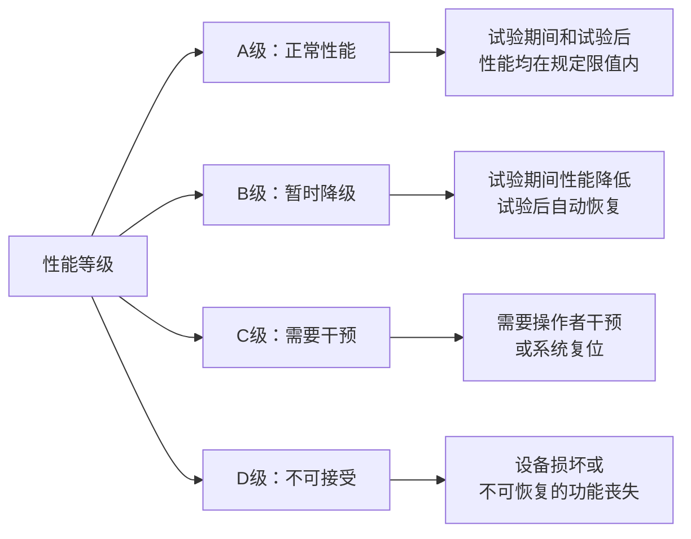
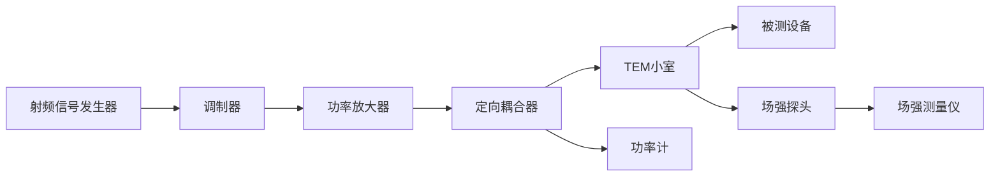
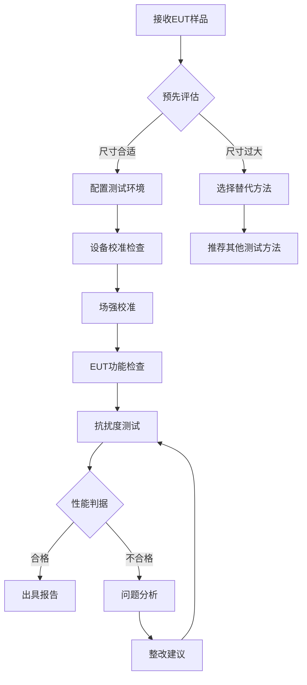

# GB/T 17626.20-2014 - 电磁兼容 试验和测量技术 横电磁波(TEM)小室中的辐射抗扰度试验

## 1. 标准概述

### 1.1 技术摘要

> 本标准规定了在横电磁波(TEM)小室中进行辐射抗扰度试验的测试方法和技术要求。适用于频率范围0.15MHz-6GHz的电磁辐射抗扰度试验，为不能在开阔场地或电波暗室中进行测试的设备提供了替代的封闭场测试环境。

### 1.2 标准定位

- **技术领域**：EMS抗扰度测试
- **应用层级**：测试方法标准
- **强制属性**：推荐性
- **实施状态**：现行有效

## 2. 物理原理与理论基础

### 2.1 电磁现象机理

TEM小室基于横电磁波传输线理论，在小室内建立均匀的横电磁场：

**麦克斯韦方程在TEM模式下的简化**：
$$
\nabla \times \vec{E} = -\frac{\partial \vec{B}}{\partial t}
$$

$$
\nabla \times \vec{H} = \frac{\partial \vec{D}}{\partial t}
$$

**TEM模式特征方程**：
$$
E_z = H_z = 0
$$

$$
\frac{E_x}{H_y} = -\frac{E_y}{H_x} = Z_0 = \sqrt{\frac{\mu_0}{\varepsilon_0}} = 377\Omega
$$

### 2.2 数学模型

**TEM小室特征阻抗计算**：
$$
Z_0 = \frac{377\Omega}{\sqrt{\varepsilon_r}} \cdot \frac{h}{w}
$$

**小室内电场强度分布**：
$$
E(x,y) = \sqrt{\frac{2P \cdot Z_0}{A}} \cdot f(x,y)
$$

**功率与场强关系**：
$$
P = \frac{E^2 \cdot A}{2Z_0}
$$

### 2.3 关键参数定义

> **重要说明**：所有公式中出现的字母和符号必须在此表格中给出明确的定义和物理意义说明。

| 参数符号 | 参数名称 | 物理意义 | 单位 | 典型值 |
|---------|---------|---------|------|--------|
| E | 电场强度 | TEM小室内电场强度 | V/m | 1-200 |
| H | 磁场强度 | TEM小室内磁场强度 | A/m | E/377 |
| Z₀ | 特征阻抗 | TEM传输线特征阻抗 | Ω | 50 |
| P | 输入功率 | 注入TEM小室的射频功率 | W | 0.1-1000 |
| f | 频率 | 射频信号频率 | Hz | 0.15M-6G |
| h | 高度 | 内外导体间距 | m | 0.1-1.0 |
| w | 宽度 | 内导体宽度 | m | 0.05-0.5 |
| A | 横截面积 | TEM小室有效测试区域面积 | m² | 0.01-1.0 |
| εᵣ | 相对介电常数 | 小室内介质相对介电常数 | - | 1(空气) |
| f(x,y) | 场分布函数 | 横截面场强分布归一化函数 | - | 0.8-1.2 |

## 3. 技术要求详解

### 3.1 限值要求

**试验等级与场强对应关系**：
| 等级 | 环境描述 | 场强(V/m) | 典型应用 |
|------|----------|-----------|----------|
| 1 | 保护良好环境 | 1 | 实验室环境 |
| 2 | 典型商业环境 | 3 | 办公室、住宅 |
| 3 | 典型工业环境 | 10 | 工厂、户外设备 |
| 4 | 恶劣工业环境 | 30 | 发电站、焊接场所 |
| X | 开放等级 | 用户定义 | 特殊应用 |

### 3.2 性能等级划分

### 3.3 适用范围界定

- **包含**：信息技术设备、工业控制设备、医疗器械、汽车电子、通信设备
- **不包含**：尺寸超过TEM小室测试区域的大型设备、频率超过6GHz的毫米波设备
- **特殊考虑**：高功率设备需要考虑TEM小室的功率承受能力限制

## 4. 测试方法与程序

### 4.1 测试配置

**TEM小室测试配置示意图**：

**TEM小室几何结构**：
- 锥形过渡段：阻抗从50Ω渐变到TEM小室特征阻抗
- 测试区域：保证足够大的均匀场区域容纳EUT
- 匹配负载：确保小室另一端良好匹配，防止反射

### 4.2 测试步骤

1. **准备阶段**
   - 检查TEM小室完整性和清洁度
   - 校准所有测试设备
   - 配置EUT工作状态
   - 建立性能监测系统

2. **场强校准阶段**
   - 在无EUT条件下进行场强校准
   - 使用场强探头测量测试区域内场强分布
   - 记录功率-场强对应关系
   - 验证场强均匀性(±3dB)

3. **抗扰度测试阶段**
   - 放置EUT在测试区域中心
   - 从最低试验等级开始逐级增加
   - 每个频率点停留足够时间观察EUT响应
   - 记录EUT性能变化和恢复情况

4. **数据记录阶段**
   - 记录所有试验参数(频率、场强、调制方式)
   - 记录EUT的功能性能状态
   - 记录异常现象和恢复时间
   - 拍照记录试验配置

### 4.3 判定准则

**合格判定标准**：
- 在规定的试验等级下，EUT应满足产品标准规定的性能判据
- A级：试验期间和试验后性能均正常
- B级：试验期间可以有暂时性能降低，但试验后必须自动恢复
- C级：允许需要操作者干预的暂时性能降低
- D级：不允许设备损坏或不可恢复的功能丧失

## 5. 测试设备与环境

### 5.1 主要测试设备

**TEM小室技术规范**：
| 设备名称 | 技术指标 | 校准要求 | 参考型号 |
|---------|---------|---------|---------|
| TEM小室 | 特征阻抗50Ω±2Ω, 频率0.15MHz-6GHz | 24个月特性验证 | TESEQ NSG3060 |
| 射频信号发生器 | 0.15MHz-6GHz, 输出+20dBm | 12个月校准 | R&S SMC100A |
| 功率放大器 | 100W输出, 0.15-6GHz | 12个月线性度检查 | AR 100A250AM6 |
| 场强测量仪 | 0.1MHz-6GHz, ±1dB精度 | 12个月校准 | Narda EHP-50F |
| 定向耦合器 | 方向性≥20dB, 插损≤0.5dB | 24个月S参数验证 | Narda 3001-20 |

### 5.2 测试环境要求

**TEM小室环境条件**：
- **电磁环境**：背景场强应小于试验场强6dB以上
- **物理环境**：温度15-35°C(±2°C)，湿度30%-60% RH(±5%)
- **电源质量**：电压稳定度±2%，频率稳定度±0.5%
- **接地系统**：TEM小室与参考地平面可靠连接，接地阻抗<0.1Ω

**TEM小室性能验证**：
- 特征阻抗：50Ω±2Ω (全频段)
- 驻波比：VSWR<1.5:1 (无EUT时)
- 场强均匀性：±3dB (测试区域内)
- 串扰隔离：>60dB (与外界)

## 6. 工程实施指南

### 6.1 典型问题与对策

| 常见问题 | 可能原因 | 建议对策 | 预期效果 |
|---------|---------|---------|---------|
| 场强校准不准确 | 探头位置不当或探头失效 | 重新校准探头，确认探头位置 | 测量精度±1dB |
| 驻波比过高 | EUT与小室阻抗不匹配 | 调整EUT位置或增加匹配网络 | VSWR<2:1 |
| 场强不均匀 | TEM小室内有反射或谐振 | 检查小室结构，清理导体表面 | 均匀性±3dB |
| 调制信号失真 | 功率放大器非线性 | 降低输入功率或更换线性放大器 | THD<5% |

### 6.2 测试流程优化

### 6.3 成本控制建议

**设备投资优化**：
- **TEM小室**：根据主要测试产品尺寸选择合适规格，避免过度投资
- **功率放大器**：分频段配置，提高利用率
- **测量设备**：选择多功能集成设备，减少设备数量

**测试效率提升**：
- **批量测试**：同类产品批量安排，减少配置变更时间
- **自动化程度**：采用自动测试系统，减少人工操作
- **并行测试**：多个TEM小室并行工作，提高产能

## 7. 标准差异与互认

### 7.1 国际标准对比

| 对比项 | GB/T 17626.20 | IEC 61000-4-20 | 差异说明 | 互认情况 |
|--------|---------------|----------------|----------|---------|
| 频率范围 | 0.15MHz-6GHz | 0.15MHz-6GHz | 完全一致 | 直接互认 |
| 试验等级 | 1,2,3,4,X级 | 1,2,3,4,X级 | 完全一致 | 直接互认 |
| 场强精度 | ±3dB | ±3dB | 完全一致 | 直接互认 |
| 调制要求 | AM 80%@1kHz | AM 80%@1kHz | 完全一致 | 直接互认 |
| 性能判据 | A,B,C,D级 | A,B,C,D级 | 完全一致 | 直接互认 |

### 7.2 认证互认指南

**直接互认项目**：
- 测试方法和程序完全一致
- 试验等级和限值要求相同
- 设备技术要求等同
- 不确定度评估方法一致

**注意事项**：
- 测试报告需要包含完整的试验参数
- 校准证书需要溯源到国际标准
- 人员资质需要满足相应认可要求

## 8. 相关标准导航

### 8.1 上游标准

- [[GB_T_17626_1]] - 电磁兼容试验和测量技术一般实施指南
- [[IEC_61000-4-1]] - 国际基础标准，提供基本原理和方法
- [[CISPR_16-1-4]] - 测量仪器和方法规范

### 8.2 平行标准

- [[GB_T_17626_3]] - 射频电磁场辐射抗扰度试验(开阔场/电波暗室)
- [[GB_T_17626_21]] - 混响室中的射频电磁场辐射抗扰度试验
- [[IEC_61000-4-3]] - 国际射频辐射抗扰度标准
- [[IEC_61000-4-21]] - 国际混响室测试标准

### 8.3 下游标准

- [[GB_9254]] - 信息技术设备的无线电骚扰限值和测量方法
- [[GB_4943_1]] - 信息技术设备安全标准
- [[GB_T_15153_1]] - 工业环境电磁兼容通用标准
- [[YY_0505]] - 医疗器械电磁兼容标准

## 9. 附录

### 9.1 术语定义

**横电磁波(TEM)**：电场和磁场都垂直于传播方向的电磁波模式

**TEM小室**：基于TEM传输线原理设计的封闭式测试装置，用于产生均匀的横电磁场

**特征阻抗**：TEM传输线的特征阻抗，通常设计为50Ω以匹配标准测试设备

**场强均匀性**：测试区域内电场强度分布的均匀程度，通常要求在±3dB以内

### 9.2 参考文献

1. IEC 61000-4-20:2010, Electromagnetic compatibility (EMC) - Part 4-20: Testing and measurement techniques - Radiated immunity test in TEM waveguide
2. GB/T 17626.1-2006, 电磁兼容 试验和测量技术 第4-1部分：试验技术 概述
3. CISPR 16-1-4:2019, 无线电干扰和抗扰度测量设备和测量方法规范

### 9.3 修订记录

| 版本 | 日期 | 主要变化 | 影响评估 |
|------|------|----------|---------|
| Ed.2014.0 | 2014-12-05 | 等同采用IEC 61000-4-20:2010 | 建立了TEM小室测试方法的国家标准 |

---

**标准声明**：本文档为GB/T 17626.20-2014标准的技术解读，等同采用IEC 61000-4-20:2010国际标准。作为推荐性国家标准，为TEM小室中的辐射抗扰度试验提供了标准化的测试方法和技术要求。

---

*文档版本：v1.0*  
*最后更新：2025年6月19日*  
*编制：电磁兼容技术标准化工作组*  
*审核：全国无线电干扰标准化技术委员会*