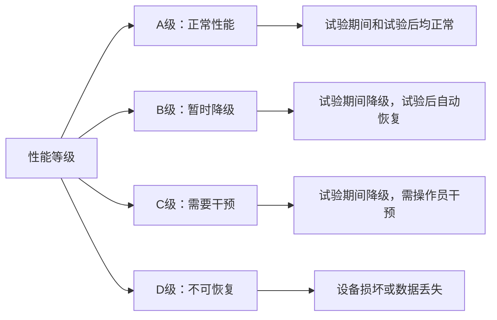
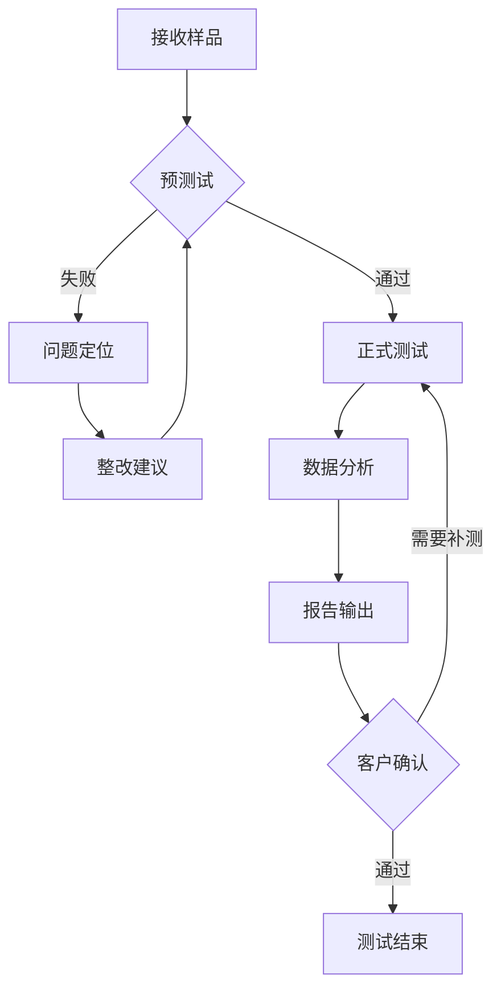

# GB/T 17626.21 - 电磁兼容 试验和测量技术 第21部分：射频场感应的传导骚扰抗扰度试验

## 1. 标准概述

### 1.1 技术摘要

> 本标准规定了电气和电子设备在射频场感应传导骚扰环境中的抗扰度试验方法，建立了一致的试验程序、试验等级和性能判据，适用于频率范围150kHz至80MHz的传导抗扰度评估。

### 1.2 标准定位

- **技术领域**：EMS
- **应用层级**：测试方法标准
- **强制属性**：推荐性
- **实施状态**：现行有效

## 2. 物理原理与理论基础

### 2.1 电磁现象机理

> 射频场感应传导骚扰是指电磁场通过连接电缆感应产生的共模和差模电流，对设备造成的电磁干扰现象。

**共模感应机理**：
$$
V_{CM} = j\omega\mu_0 \int_S \vec{H} \cdot d\vec{S}
$$

**差模感应机理**：
$$
V_{DM} = j\omega\mu_0 \int_L \vec{H} \cdot d\vec{l} \times \frac{A_{loop}}{l}
$$

### 2.2 数学模型

**CDN传输特性**：
$$
H(f) = \frac{V_{out}}{V_{in}} = \frac{Z_L}{Z_L + Z_{CDN}(f)}
$$

**电流钳转换系数**：
$$
K_{clamp}(f) = \frac{V_{output}}{I_{cable}} = \frac{\mu_0 \omega A_{eff}}{N}
$$

### 2.3 关键参数定义

> **重要说明**：所有公式中出现的字母和符号必须在此表格中给出明确的定义和物理意义说明。

| 参数符号 | 参数名称 | 物理意义 | 单位 | 典型值 |
|---------|---------|---------|------|--------|
| $V_{CM}$ | 共模电压 | 线缆对地的感应电压 | V | 1-10 |
| $V_{DM}$ | 差模电压 | 线缆间的感应电压 | V | 0.1-3 |
| $\omega$ | 角频率 | 电磁场角频率 | rad/s | $10^6-10^8$ |
| $\mu_0$ | 真空磁导率 | 真空中的磁导率常数 | H/m | $4\pi\times10^{-7}$ |
| $H$ | 磁场强度 | 入射电磁场磁场分量 | A/m | 0.1-10 |
| $Z_{CDN}$ | CDN阻抗 | 耦合去耦网络阻抗 | Ω | 50 |
| $K_{clamp}$ | 钳转换系数 | 电流钳的电流电压转换系数 | V/A | 1-10 |
| $A_{eff}$ | 有效面积 | 电流钳的有效磁通面积 | m² | $10^{-4}$ |
| $N$ | 匝数 | 电流钳的等效匝数 | - | 1 |

## 3. 技术要求详解

### 3.1 限值要求

> 不同等级下的试验电平要求

| 试验等级 | 试验电平(rms) | 应用环境 | 典型应用场景 |
|---------|--------------|----------|-------------|
| 1级 | 1V | 保护良好环境 | 屏蔽机房、实验室 |
| 2级 | 3V | 典型商业环境 | 办公室、商业建筑 |
| 3级 | 10V | 典型工业环境 | 工厂、变电站附近 |
| X级 | 用户定义 | 特殊环境 | 根据具体应用确定 |

### 3.2 性能等级划分



### 3.3 适用范围界定

- **包含**：额定电压不超过1000V的电气电子设备、连接电缆长度超过3m的设备
- **不包含**：射频发射设备本身、军用设备、航空航天设备
- **特殊考虑**：医疗设备需要参考专用标准要求

## 4. 测试方法与程序

### 4.1 测试配置

> CDN测试配置示意图

```
射频信号发生器 → 功率放大器 → CDN → 被试设备
                             ↓
                         终端负载(50Ω)
```

> 电流钳测试配置示意图

```
射频信号发生器 → 功率放大器 → 电流钳 → 被试设备电缆
                             ↓
                         监测接收机
```

### 4.2 测试步骤

1. **准备阶段**
   - 环境条件确认：温度15-35°C，湿度25-75%
   - 设备校准检查：信号发生器、功率计精度验证
   - EUT预处理：正常工作状态运行30分钟

2. **执行阶段**
   - 步骤1：按照测试配置连接设备
   - 步骤2：设置试验频率点，从150kHz开始
   - 步骤3：调节试验电平至规定值
   - 步骤4：施加调制信号(1kHz，80%AM)
   - 步骤5：观察EUT响应，记录性能等级

3. **数据记录**
   - 原始数据记录：频率、电平、调制参数
   - 异常现象记录：故障现象、恢复时间

### 4.3 判定准则

> 根据试验期间和试验后EUT的性能表现，按照A、B、C、D四个等级进行判定，其中A、B级为可接受等级。

## 5. 测试设备与环境

### 5.1 主要测试设备

| 设备名称 | 技术指标 | 校准要求 | 参考型号 |
|---------|---------|---------|---------| 
| 射频信号发生器 | 频率范围：150kHz-80MHz，精度：±0.01% | 12个月 | R&S SMB100A |
| 功率放大器 | 功率：≥100W，频率范围：150kHz-80MHz | 12个月 | AR 100A250A |
| CDN | 阻抗：50Ω，频率范围：150kHz-80MHz | 24个月 | Teseq CDN M3 |
| 电流钳 | 频率范围：30MHz-80MHz，转换系数已知 | 12个月 | Fischer F-33-1 |
| 功率计 | 精度：±0.5dB，频率范围：150kHz-80MHz | 12个月 | Rohde&Schwarz NRP |

### 5.2 测试环境要求

- **电磁环境**：背景射频场强<试验电平-6dB
- **物理环境**：温度15-35°C(±2°C)，湿度25-75%(±5%)，大气压86-106kPa
- **电源质量**：电压变化<±2%，频率变化<±1%，THD<3%

## 6. 工程实施指南

### 6.1 典型问题与对策

| 常见问题 | 可能原因 | 建议对策 | 预期效果 |
|---------|---------|---------|---------| 
| CDN插入损耗过大 | CDN老化或损坏 | 更换CDN或校准修正 | 恢复正常传输特性 |
| 电流钳耦合不稳定 | 钳子位置不当 | 调整钳子位置和角度 | 获得稳定耦合效果 |
| 背景噪声过高 | 环境电磁干扰 | 改善屏蔽或选择测试时间 | 提高测试精度 |
| EUT响应不一致 | 测试状态不稳定 | 标准化测试条件和程序 | 提高测试重现性 |

### 6.2 测试流程优化



### 6.3 成本控制建议

- **设备复用**：CDN可用于多个传导类测试项目，电流钳可用于辐射敏感度预测试
- **时间优化**：批量测试时可并行进行设备预热和样品准备
- **人员配置**：1名主测工程师+1名助理工程师的配置最为高效

## 7. 标准差异与互认

### 7.1 国际标准对比

| 对比项 | GB/T 17626.21 | IEC 61000-4-6 | 差异说明 | 互认情况 |
|--------|---------------|---------------|----------|----------|
| 技术内容 | 等同采用 | 原版标准 | 无技术差异 | 完全互认 |
| 测试等级 | 1,2,3,X级 | 1,2,3,X级 | 完全一致 | 完全互认 |
| 频率范围 | 150kHz-80MHz | 150kHz-80MHz | 完全一致 | 完全互认 |
| 性能判据 | A,B,C,D级 | A,B,C,D级 | 完全一致 | 完全互认 |

### 7.2 认证互认指南

- **直接互认**：所有技术参数和测试方法完全一致
- **条件互认**：无需补充测试的项目
- **不可互认**：无此类项目

## 8. 相关标准导航

### 8.1 上游标准

- [[GB/T 17626.1]] - 电磁兼容试验和测量技术通用指南
- [[GB/T 6113.1]] - 无线电骚扰和抗扰度测量设备规范

### 8.2 平行标准

- [[GB/T 17626.3]] - 射频电磁场辐射抗扰度试验
- [[GB/T 17626.4]] - 电快速瞬变脉冲群抗扰度试验
- [[GB/T 17626.5]] - 浪涌(冲击)抗扰度试验

### 8.3 下游标准

- [[GB 4343.1]] - 家用电器和电动工具EMC要求
- [[GB/T 18655]] - 车辆、船舶和内燃机EMC要求
- [[YD/T 983]] - 电信设备EMC要求和测量方法

### 8.4 国际对应标准

- [[IEC 61000-4-6]] - 射频场感应传导骚扰抗扰度试验(原版)
- [[CISPR 24]] - 信息技术设备抗扰度限值和测量方法
- [[EN 61000-4-6]] - 欧盟等效标准

## 9. 附录

### 9.1 术语定义

> 关键术语的标准定义

**射频场感应传导骚扰 (RF field induced conducted disturbance)**：由射频电磁场通过连接电缆感应产生的传导骚扰现象。

**耦合去耦网络 (CDN)**：在射频传导抗扰度试验中，用于将试验信号耦合到被试设备端口，同时将辅助设备去耦的装置。

**电流钳 (Current injection clamp)**：通过磁耦合方式向电缆注入射频电流的装置。

**共模骚扰 (Common mode disturbance)**：所有导体相对于参考地的同相位骚扰。

### 9.2 参考文献

> 标准制定的技术依据

1. IEC 61000-4-6:2013, Electromagnetic compatibility (EMC) - Part 4-6: Testing and measurement techniques - Immunity to conducted disturbances, induced by radio-frequency fields
2. CISPR 16-1-2:2014, Specification for radio disturbance and immunity measuring apparatus and methods - Part 1-2: Radio disturbance and immunity measuring apparatus - Coupling devices for conducted disturbance measurements
3. ITU-R SM.1541-5:2013, Unwanted emissions in the out-of-band domain

### 9.3 修订记录

| 版本 | 日期 | 主要变化 | 影响评估 |
|------|------|----------|----------|
| 2023版 | 2023-12-01 | 等同采用IEC 61000-4-6:2013，更新设备要求和校准周期 | 提高测试精度和国际一致性 |
| 2014版 | 2014-06-01 | 首次发布，基于IEC 61000-4-6:2008 | 建立国内传导抗扰度测试技术基础 |

---