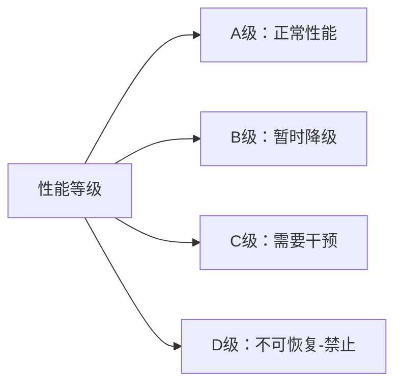
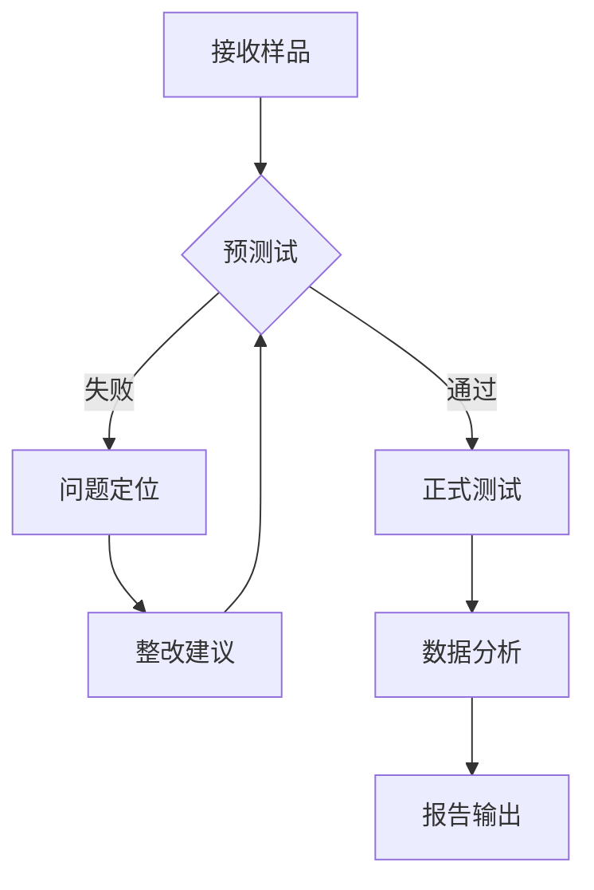

# GB/T 17626.22-2024 - 电磁兼容 试验和测量技术 辐射(无线频率)电磁场抗扰度试验

## 1. 标准概述

### 1.1 技术摘要

> GB/T 17626.22-2024规定了电气和电子设备在80MHz-6GHz频率范围内辐射射频电磁场的抗扰度试验方法，建立了统一的试验程序、设备要求和性能判据，为产品EMC认证提供技术依据。

### 1.2 标准定位

- **技术领域**：EMS电磁抗扰度
- **应用层级**：测试方法标准
- **强制属性**：推荐性
- **实施状态**：现行有效

## 2. 物理原理与理论基础

### 2.1 电磁现象机理

> 辐射电磁场通过空间传播以电磁波形式耦合到被测设备，在导体上感应出电压和电流，影响设备正常工作。

**远场条件下的电磁场关系**：

$$
E = \frac{\sqrt{30P_t G_t}}{d}
$$

**天线辐射功率密度**：

$$
S = \frac{P_t G_t}{4\pi d^2}
$$

**自由空间阻抗关系**：

$$
Z_0 = \sqrt{\frac{\mu_0}{\varepsilon_0}} = 377\Omega
$$

### 2.2 数学模型

**调制信号的数学表达**：

$$
u(t) = U_c[1 + m \sin(2\pi f_m t)] \sin(2\pi f_c t)
$$

**耦合电压计算**：

$$
V_{induced} = \int_0^L E(x) \cdot h_{eff}(x) dx
$$

### 2.3 关键参数定义

> **重要说明**：所有公式中出现的字母和符号必须在此表格中给出明确的定义和物理意义说明。

| 参数符号 | 参数名称 | 物理意义 | 单位 | 典型值 |
|---------|---------|---------|------|--------|
| E | 电场强度 | 单位电荷受到的电场力 | V/m | 1-30 |
| f | 频率 | 电磁波振荡频率 | MHz/GHz | 80MHz-6GHz |
| P_t | 发射功率 | 天线辐射的射频功率 | W | 1-1000 |
| G_t | 天线增益 | 相对于理想偶极子的增益 | dB | 0-20 |
| d | 距离 | 天线到被测设备的距离 | m | 3-10 |
| m | 调制度 | AM调制深度 | % | 80 |
| f_m | 调制频率 | 调制信号频率 | Hz | 1000 |
| Z_0 | 自由空间阻抗 | 电场与磁场比值 | Ω | 377 |

## 3. 技术要求详解

### 3.1 限值要求

> 使用表格清晰展示不同条件下的限值

| 测试等级 | 场强 (V/m) | 适用环境 | 典型应用 |
|---------|-----------|---------|----------|
| 1级 | 1 | 保护良好 | 实验室环境 |
| 2级 | 3 | 商业环境 | 办公室、商店 |
| 3级 | 10 | 典型工业 | 工厂车间 |
| 4级 | 30 | 恶劣工业 | 重工业环境 |
| X级 | 用户定义 | 特殊应用 | 军用、航空 |

### 3.2 性能等级划分



### 3.3 适用范围界定

- **包含**：信息技术设备、工业设备、家用电器、医疗器械、汽车电子
- **不包含**：专用军工设备、核设施设备、航空电子(需专用标准)
- **特殊考虑**：对安全相关设备应采用更严格的性能判据

## 4. 测试方法与程序

### 4.1 测试配置

> 测试配置示意图 - 使用ASCII图

```
    天线 ←---3m---→ EUT
     ↕                ↕
  场强探头        接地平面
     
信号发生器 → 功放 → 天线系统
场强监测 ← 探头 ← 校准
```

### 4.2 测试步骤

1. **准备阶段**
   - 环境条件确认(温度、湿度、背景场)
   - 设备校准检查(场强探头、信号源)
   - EUT预处理(正常工作状态)

2. **执行阶段**
   - 步骤1：频率扫描建立场强均匀区
   - 步骤2：EUT放置于均匀场区中心
   - 步骤3：按等级施加调制电磁场
   - 步骤4：监测EUT工作状态

3. **数据记录**
   - 原始数据记录(场强、频率、极化)
   - 异常现象记录(故障时间、恢复方式)

### 4.3 判定准则

> 根据试验期间和试验后设备的工作状态，按A/B/C/D四级性能判据评定合格性。A、B、C级均为合格，D级为不合格。

## 5. 测试设备与环境

### 5.1 主要测试设备

| 设备名称 | 技术指标 | 校准要求 | 参考型号 |
|---------|---------|---------|---------|
| 信号发生器 | 80MHz-6GHz，±1dB精度 | 12个月 | R&S SMB100A |
| 功率放大器 | 线性度<-40dB，1dB压缩点>+40dBm | 12个月 | AR 25A250A |
| 双锥天线 | 80-300MHz，VSWR<3:1 | 36个月 | ETS 3142C |
| 对数周期天线 | 300MHz-1GHz，增益8-12dB | 36个月 | ETS 3145 |
| 喇叭天线 | 1-6GHz，增益10-25dB | 36个月 | ETS 3115 |
| 场强探头 | 各向同性，动态范围80dB | 24个月 | AR FP6001 |

### 5.2 测试环境要求

- **电磁环境**：背景场强<测试等级的3% (-30dB)
- **物理环境**：温度15-35℃(±2℃)，湿度25-75%(±5%RH)
- **电源质量**：电压稳定度±2%，谐波失真<5%

## 6. 工程实施指南

### 6.1 典型问题与对策

| 常见问题 | 可能原因 | 建议对策 | 预期效果 |
|---------|---------|---------|----------|
| 场强不均匀 | 天线位置不当 | 调整天线高度和角度 | 均匀度改善至±6dB |
| 背景场过高 | 环境干扰 | 增加滤波或屏蔽 | 背景场降低20dB |
| 调制度偏差 | 调制器非线性 | 校准调制深度 | 调制度误差<5% |
| EUT误动作 | 敏感度过高 | 分析故障模式 | 确定薄弱环节 |

### 6.2 测试流程优化



### 6.3 成本控制建议

- **设备复用**：信号发生器、功放可用于多项EMC测试
- **时间优化**：频率扫描与敏感度测试并行进行
- **人员配置**：1名主测工程师+1名辅助人员的最优配置

## 7. 标准差异与互认

### 7.1 国际标准对比

| 对比项 | GB/T 17626.22 | IEC 61000-4-3 | 差异说明 | 互认情况 |
|--------|---------------|---------------|----------|----------|
| 频率范围 | 80MHz-6GHz | 80MHz-6GHz | 完全一致 | 直接互认 |
| 测试等级 | 1,3,10,30V/m | 1,3,10,30V/m | 完全一致 | 直接互认 |
| 调制方式 | AM 80% 1kHz | AM 80% 1kHz | 完全一致 | 直接互认 |
| 性能判据 | A/B/C/D四级 | A/B/C/D四级 | 完全一致 | 直接互认 |

### 7.2 认证互认指南

- **直接互认**：与IEC 61000-4-3测试结果完全互认
- **条件互认**：与汽车标准ISO 11452-2需补充特定条件测试
- **不可互认**：与军用标准GJB需重新按军标要求测试

## 8. 相关标准导航

### 8.1 上游标准

- [[GB_T_17626_1]] - EMC试验和测量技术总论
- [[IEC_61000_4_1]] - EMC基础标准和术语定义

### 8.2 平行标准

- [[GB_T_17626_2]] - 静电放电抗扰度试验
- [[GB_T_17626_4]] - 电快速瞬变脉冲群抗扰度试验
- [[GB_T_17626_5]] - 浪涌(冲击)抗扰度试验

### 8.3 下游标准

- [[GB_4343_1]] - 家用电器EMC要求
- [[GB_T_18655]] - 车辆船舶和内燃机无线电骚扰特性限值
- [[ISO_11452_2]] - 道路车辆电气干扰特性测试方法

## 9. 附录

### 9.1 术语定义

> 关键术语的标准定义

**辐射抗扰度 (Radiated immunity)**：设备在电磁场辐射环境中保持正常工作的能力

**均匀场区 (Uniform field area)**：场强变化在±6dB以内的测试区域

**性能判据 (Performance criteria)**：评定设备在电磁骚扰条件下工作状态的分级标准

### 9.2 参考文献

> 标准制定的技术依据

[1] IEC 61000-4-3:2020, Electromagnetic compatibility (EMC) - Part 4-3: Testing and measurement techniques - Radiated, radio-frequency, electromagnetic field immunity test

[2] CISPR 16-1-4:2019, Specification for radio disturbance and immunity measuring apparatus and methods - Part 1-4: Radio disturbance and immunity measuring apparatus - Antennas and test sites for radiated disturbance measurements

### 9.3 修订记录

| 版本 | 日期 | 主要变化 | 影响评估 |
|------|------|----------|----------|
| 2024版 | 2024-03-15 | 等同采用IEC 61000-4-3:2020，频率扩展至6GHz | 提升测试覆盖范围，适应5G等新技术需求 |
| 2018版 | 2018-06-01 | 首次发布国家标准版本 | 统一国内辐射抗扰度测试方法 |

---