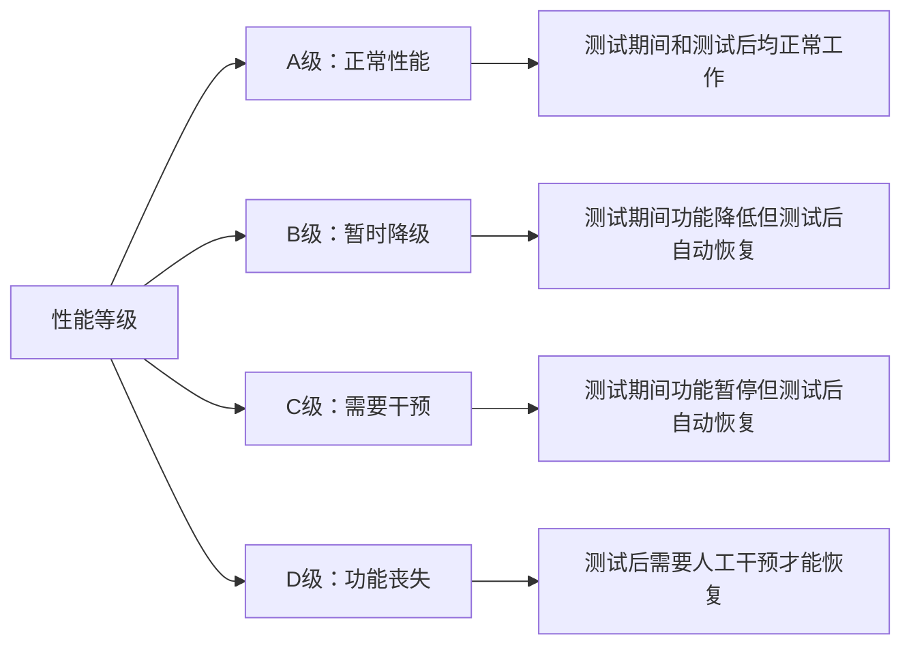
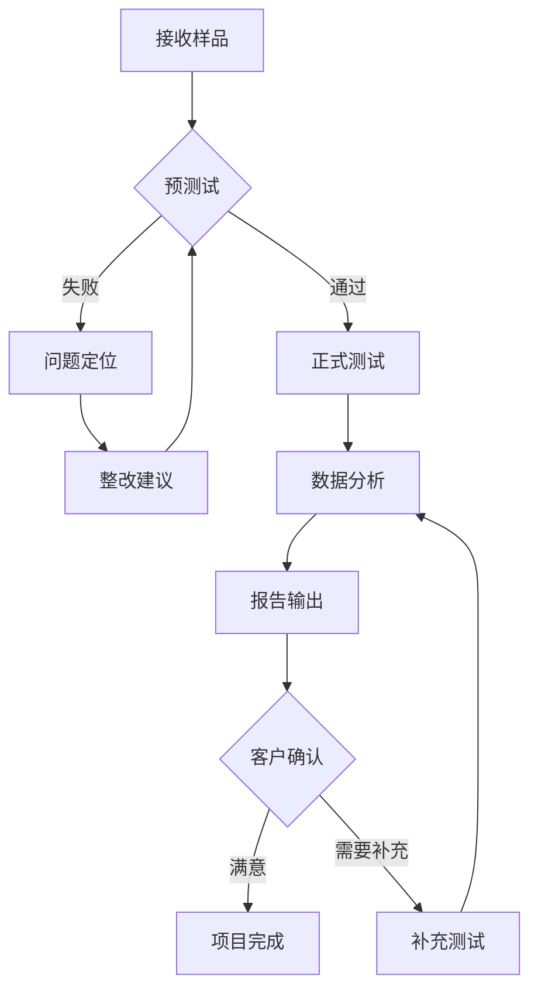

# GB/T 17626.24 - 电磁兼容 试验和测量技术 第24部分：HEMP和其他辐射扰动保护测试

## 1. 标准概述

### 1.1 技术摘要

> 本标准规定了高空电磁脉冲(HEMP)和其他辐射扰动对电子电气设备抗扰度的测试方法和要求。涵盖10kHz至1GHz频率范围内的脉冲电磁场测试，适用于军用和民用关键设备的电磁脉冲防护能力评估。

### 1.2 标准定位

- **技术领域**：EMS电磁抗扰度
- **应用层级**：测试方法标准
- **强制属性**：推荐性
- **实施状态**：现行有效

## 2. 物理原理与理论基础

### 2.1 电磁现象机理

> HEMP现象源于高空核爆产生的γ射线与大气分子相互作用，产生康普顿电子和正离子对，在地磁场作用下形成瞬态电磁脉冲。

HEMP电场的时域特性可表示为：

$$
E(t) = E_0 \cdot e^{-\alpha t} \cdot (1 - e^{-\beta t})
$$

其中典型的双指数脉冲波形参数为：

$$
S(f) = \frac{E_0}{\alpha - \beta} \cdot \frac{1}{(1 + j\omega/\alpha)(1 + j\omega/\beta)}
$$

### 2.2 数学模型

TEM小室内的电场分布可用传输线理论描述：

$$
E(z,t) = \frac{V(z,t)}{d} = \frac{1}{d}\sqrt{\frac{Z_0}{Z_L}}V_{in}(t)e^{-\gamma z}
$$

耦合到设备的感应电压为：

$$
V_{induced} = \int_0^L \vec{E} \cdot \vec{l} \, dl = E_0 \cdot L \cdot \cos\theta
$$

### 2.3 关键参数定义

> **重要说明**：所有公式中出现的字母和符号必须在此表格中给出明确的定义和物理意义说明。

| 参数符号 | 参数名称 | 物理意义 | 单位 | 典型值 |
|---------|---------|---------|------|--------|
| E₀ | 峰值电场强度 | HEMP脉冲的最大电场强度 | V/m | 1-50kV/m |
| α | 慢衰减常数 | 控制脉冲后沿衰减速度 | s⁻¹ | 4×10⁵ |
| β | 快上升常数 | 控制脉冲前沿上升速度 | s⁻¹ | 2×10⁸ |
| t | 时间变量 | 从脉冲开始的时间 | s | 0-1×10⁻⁶ |
| f | 频率 | 电磁波频率 | Hz | 10kHz-1GHz |
| Z₀ | TEM小室特性阻抗 | 传输线特性阻抗 | Ω | 50 |
| d | 板间距离 | TEM小室上下板距离 | m | 0.1-1.0 |
| γ | 传播常数 | 电磁波在TEM小室中传播常数 | m⁻¹ | jβ |
| L | 有效耦合长度 | 设备与电场耦合的有效长度 | m | 0.1-2.0 |
| θ | 入射角度 | 电场与设备轴线夹角 | rad | 0-π/2 |

## 3. 技术要求详解

### 3.1 限值要求

| 测试等级 | 环境描述 | 场强 (V/m) | 上升时间 (ns) | 脉冲宽度 (ns) |
|---------|---------|-----------|-------------|-------------|
| 1级 | 保护良好 | 1,000 | 2-5 | 20-50 |
| 2级 | 典型工业 | 3,000 | 2-5 | 20-50 |
| 3级 | 恶劣工业 | 10,000 | 2-5 | 20-50 |
| 4级 | 军用威胁 | 30,000 | 2-5 | 20-500 |
| X级 | 用户定义 | 协商确定 | 协商确定 | 协商确定 |

### 3.2 性能等级划分



### 3.3 适用范围界定

- **包含**：所有电子电气设备、系统和子系统
- **不包含**：不具备电子控制功能的纯机械设备
- **特殊考虑**：军用设备应同时满足相关军用标准要求

## 4. 测试方法与程序

### 4.1 测试配置

```
    脉冲发生器 ──→ TEM小室/平行板线 ──→ 监测设备
                      │
                   被测设备(EUT)
                      │
                   辅助设备(AE)
```

### 4.2 测试步骤

1. **准备阶段**
   - 环境条件确认：温度15-35°C，湿度45-75%RH
   - 设备校准检查：场强探头、示波器、脉冲发生器
   - EUT预处理：按产品标准要求进行预处理

2. **执行阶段**
   - 步骤1：EUT和AE按典型使用配置连接和工作
   - 步骤2：施加测试等级对应的脉冲场强
   - 步骤3：在每个测试频率点进行至少10次脉冲测试
   - 步骤4：改变极化方向重复测试

3. **数据记录**
   - 原始数据记录：场强值、波形参数、EUT响应
   - 异常现象记录：功能降级、错误信息、恢复时间

### 4.3 判定准则

> 根据EUT在测试期间和测试后的表现，按照性能判据A-D级进行评估。A级为最佳，D级为最差，需要在测试报告中明确说明判定依据。

## 5. 测试设备与环境

### 5.1 主要测试设备

| 设备名称 | 技术指标 | 校准要求 | 参考型号 |
|---------|---------|---------|---------|
| HEMP模拟器 | 峰值功率≥1MW，上升时间<5ns | 6个月 | Montena HEMP-2000 |
| TEM小室 | 工作频率10kHz-200MHz | 24个月 | ETS-Lindgren Model 5402 |
| 场强探头 | 频响10kHz-1GHz，动态范围>60dB | 12个月 | Rohde & Schwarz TS-EMF |
| 高速示波器 | 带宽≥1GHz，采样率≥5GSa/s | 12个月 | Tektronix DPO7104C |
| 脉冲发生器 | 峰值电压50kV，脉冲宽度20-500ns | 6个月 | Directed Energy PG-1 |

### 5.2 测试环境要求

- **电磁环境**：背景场强<测试电平的1%
- **物理环境**：温度15-35°C，湿度45-75%RH，大气压力86-106kPa
- **电源质量**：电压稳定度±2%，THD<5%
- **接地系统**：接地阻抗<2Ω，等电位连接

## 6. 工程实施指南

### 6.1 典型问题与对策

| 常见问题 | 可能原因 | 建议对策 | 预期效果 |
|---------|---------|---------|---------|
| 场强不均匀 | TEM小室设计缺陷 | 重新设计或使用场强补偿 | 提高测试准确度 |
| 脉冲波形失真 | 传输线阻抗不匹配 | 调整匹配网络 | 改善波形质量 |
| EUT误动作 | 测试等级过高 | 降低测试等级或改进防护 | 满足性能要求 |
| 重现性差 | 环境干扰或设备不稳定 | 改善屏蔽和设备维护 | 提高测试可靠性 |

### 6.2 测试流程优化



### 6.3 成本控制建议

- **设备复用**：TEM小室可用于多种EMC测试
- **时间优化**：批量测试类似产品，并行进行预处理
- **人员配置**：1名高级工程师+1名技术员的标准配置

## 7. 标准差异与互认

### 7.1 国际标准对比

| 对比项 | GB/T 17626.24 | IEC 61000-4-24 | 差异说明 | 互认情况 |
|--------|---------------|-----------------|----------|----------|
| 频率范围 | 10kHz-1GHz | 10kHz-1GHz | 完全一致 | 直接互认 |
| 测试等级 | 1-4级+X级 | 1-4级+X级 | 完全一致 | 直接互认 |
| 波形参数 | 双指数脉冲 | 双指数脉冲 | 完全一致 | 直接互认 |
| 性能判据 | A-D四级 | A-D四级 | 完全一致 | 直接互认 |
| 测试程序 | 等同采用 | 原版标准 | 无技术差异 | 直接互认 |

### 7.2 认证互认指南

- **直接互认**：基于GB/T 17626.24的测试报告可直接用于IEC体系认证
- **条件互认**：军用产品需要补充相应军标的特殊要求测试
- **不可互认**：与其他EMC测试项目无直接互认关系，需要独立测试

## 8. 相关标准导航

### 8.1 上游标准

- [[GB/T 17626-1]] - 电磁兼容试验和测量技术总则
- [[IEC 61000-4-1]] - 电磁兼容性试验和测量技术概述
- [[IEC 60050-161]] - 国际电工词汇 第161部分：电磁兼容性

### 8.2 平行标准

- [[GB/T 17626-3]] - 射频电磁场辐射抗扰度试验
- [[GB/T 17626-4]] - 电快速瞬变脉冲群抗扰度试验
- [[GB/T 17626-5]] - 浪涌(冲击)抗扰度试验
- [[MIL-STD-461]] - 军用设备和子系统电磁兼容性要求

### 8.3 下游标准

- [[GB 4343.1]] - 家用电器、电动工具和类似器具的电磁兼容要求
- [[GB/T 18655]] - 车辆、船和内燃机无线电骚扰特性用于保护车外接收机的限值和测量方法
- [[GJB 151B]] - 军用设备和分系统电磁发射和敏感度要求与测量

## 9. 附录

### 9.1 术语定义

**高空电磁脉冲(HEMP)**：高空核爆炸产生的电磁脉冲现象，具有极高的峰值场强和极短的上升时间。

**TEM小室**：横电磁模传输小室，用于产生均匀的电磁场进行EMC测试。

**双指数脉冲**：具有快速上升和慢速衰减特性的脉冲波形，用于模拟HEMP现象。

### 9.2 参考文献

- IEC 61000-4-24:2015, Electromagnetic compatibility (EMC) - Part 4-24: Testing and measurement techniques - Test methods for protective devices for HEMP and other radiated disturbances
- MIL-STD-461G:2015, Requirements for the Control of Electromagnetic Interference Characteristics of Subsystems and Equipment
- ITU-T K.78:2016, High altitude electromagnetic pulse (HEMP) resistant protection concepts

### 9.3 修订记录

| 版本 | 日期 | 主要变化 | 影响评估 |
|------|------|----------|----------|
| 2013版 | 2013-12-31 | 等同采用IEC 61000-4-24:2015 | 与国际标准完全一致 |
| 2006版 | 2006-07-01 | 首次发布，基于IEC 61000-4-24:2006 | 填补国内空白 |

---