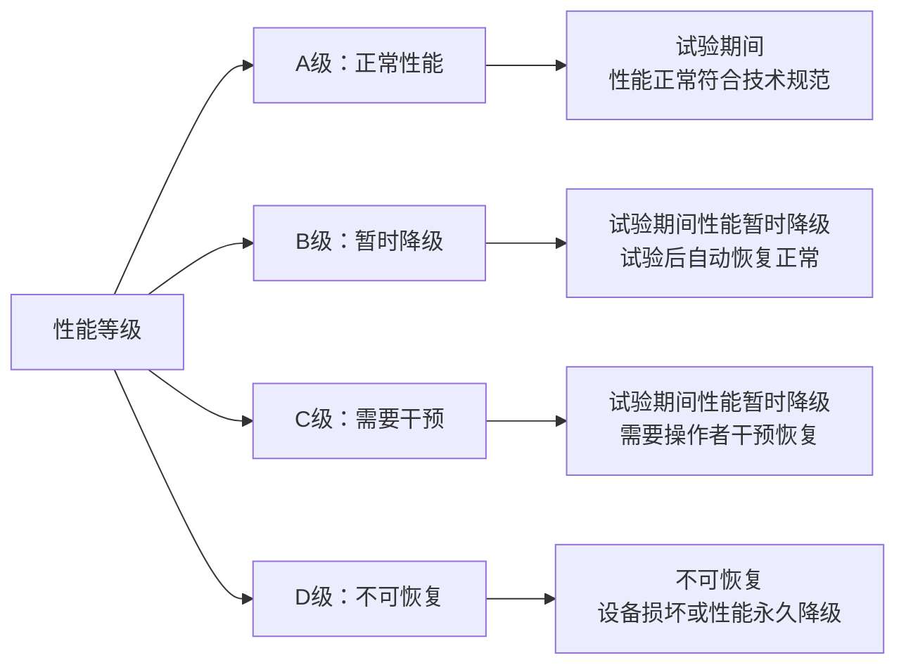
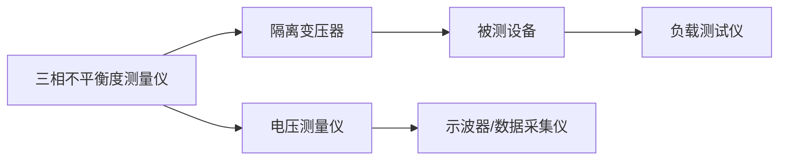
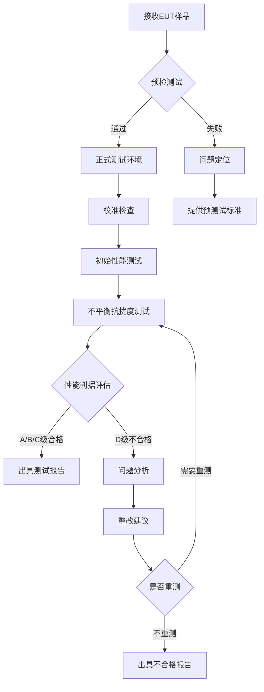

# GB/T 17626.27-2017 - 电磁兼容 试验和测量技术 第4-27部分：三相电压不平衡抗扰度试验

## 1. 标准概述

### 1.1 技术摘要

> 本标准规定了50Hz/60Hz三相供电系统中电力电子设备在三相电压不平衡条件下的抗扰度试验方法和技术要求。适用于额定电流不超过16A/相的设备，目的在于评估设备在不平衡电压条件下的性能表现和抗干扰能力。

### 1.2 标准定位

- **技术领域**：EMS抗扰度测试
- **应用层级**：测试方法标准
- **强制属性**：推荐性
- **实施状态**：现行有效

## 2. 物理原理与理论基础

### 2.1 电磁现象机理

三相电压不平衡是指三相电源系统中三相电压的幅值不相等或相位不等于120°的现象，在电力系统中普遍存在。

**对称分量变换**
$$
\begin{bmatrix} U_0 \\ U_1 \\ U_2 \end{bmatrix} = \frac{1}{3}
\begin{bmatrix} 1 & 1 & 1 \\ 1 & a & a^2 \\ 1 & a^2 & a \end{bmatrix}
\begin{bmatrix} U_A \\ U_B \\ U_C \end{bmatrix}
$$

**电压不平衡因数**
$$
K_{2u} = \frac{U_2}{U_1} \times 100\%
$$

**负序引起的附加损耗**
$$
P_{loss} = 3I_2^2 R_2 = 3\left(\frac{U_2}{Z_2}\right)^2 R_2
$$

### 2.2 数学模型

**三相不平衡度定义**
$$
VUF = \frac{\sqrt{3-6\beta}}{\sqrt{3+6\beta}} \times 100\%
$$

其中：
$$
\beta = \frac{4(U_{AB}^4 + U_{BC}^4 + U_{CA}^4)}{(U_{AB}^2 + U_{BC}^2 + U_{CA}^2)^2} - 1
$$

**负序阻抗计算**
$$
Z_2 = R_2 + jX_2 = R_2 + j2\pi f L_2
$$

**温升增量估算**
$$
\Delta T = K_{2u}^2 \times T_{rated} \times \frac{R_2}{R_1}
$$

### 2.3 关键参数定义

> **重要说明**：所有公式中出现的字母和符号必须在此表格中给出明确的定义和物理意义说明。

| 参数符号 | 参数名称 | 物理意义 | 单位 | 典型值 |
|---------|---------|---------|------|--------|
| $U_0$ | 零序电压 | 三相电压的零序分量 | V | 0-10 |
| $U_1$ | 正序电压 | 三相电压的正序分量 | V | 200-400 |
| $U_2$ | 负序电压 | 三相电压的负序分量 | V | 1-40 |
| $a$ | 旋转因子 | 复数旋转因子 $e^{j120°}$ | - | $1∠120°$ |
| $K_{2u}$ | 电压不平衡度 | 负序与正序电压的比值 | % | 0-20 |
| $I_2$ | 负序电流 | 负序分量的电流 | A | 0.1-5 |
| $Z_2$ | 负序阻抗 | 电机的负序阻抗 | Ω | 0.1-10 |
| $R_2$ | 负序电阻 | 负序阻抗的电阻分量 | Ω | 0.05-5 |
| $VUF$ | 电压不平衡因数 | IEC定义的不平衡度 | % | 0-20 |
| $\beta$ | 不平衡参数 | 负序不平衡度的参数 | - | 0-0.2 |
| $U_{AB}$ | AB线电压 | A相与B相间的电压 | V | 380-690 |
| $L_2$ | 负序电感 | 负序阻抗的电感分量 | H | $10^{-3}-10^{-1}$ |

## 3. 技术要求详解

### 3.1 限值要求

**试验等级不平衡度数值**
| 等级 | 环境描述 | 不平衡度(%) | 典型应用场景 |
|------|----------|-------------|-------------|
| 1 | 轻微不平衡环境 | 2 | 保护良好的电子设备 |
| 2 | 中等不平衡环境 | 5 | 一般工业环境 |
| 3 | 严重不平衡环境 | 10 | 恶劣工业现场环境 |
| X | 开放等级 | 用户自定义 | 特殊应用环境 |

### 3.2 性能等级划分

### 3.3 适用范围界定

- **包含**：三相电子设备和系统、电机驱动器/变频器、三相整流器、工业控制设备
- **不包含**：单相设备、额定电流超过16A/相的大功率设备、直流供电设备
- **特殊考虑**：某些不平衡度敏感的设备需要进行降级使用或加装保护措施

## 4. 测试方法与程序

### 4.1 测试配置

**三相不平衡抗扰度测试配置示意图**

**测试配置要求**
- 不平衡度测量仪精度要求电压稳定度±2%，不平衡度±0.5%
- 隔离变压器应具有良好的不平衡度传递特性，传递误差EUT侧不平衡度误差<1.5%
- 电压测量仪要求测量三相电压有效值、相位

### 4.2 测试步骤

1. **准备阶段**
   - 环境条件确认：温度15-35°C，湿度30-60%RH
   - 校准检查：不平衡度测量仪、电压表、功率分析仪
   - EUT预处理：正常工作状态运行至少30分钟
   - 确定负载：根据EUT的额定负载选择合适负载

2. **初始性能测试阶段**
   - 在标准三相电压条件下测试EUT性能
   - 记录各项关键性能参数
   - 确定性能判据基准
   - 确保EUT正常工作状态

3. **不平衡度注入阶段**
   - 按照测试等级 逐步注入不平衡度
   - 每个等级持续时间30分钟
   - 监测EUT的性能响应
   - 记录各种异常现象
   - 测试期间连续监测不平衡度

4. **数据记录阶段**
   - 记录试验条件：不平衡度、电压有效值、频率
   - 记录EUT性能数据：输出性能、功率因数等
   - 记录各种异常现象：保护动作、告警信息等
   - 分析记录试验配置：试验设置、负载条件

### 4.3 判定准则

**合格判定标准**
- 在规定试验等级下EUT应满足规定的性能判据
- A级：试验期间性能正常完全符合技术规范要求
- B级：试验期间允许性能暂时降级但试验结束后自动恢复正常
- C级：允许需要操作者干预才能恢复的性能降级
- D级：不允许不可恢复的数据丢失、设备损坏或性能永久降级

## 5. 测试设备与环境

### 5.1 主要测试设备

**三相不平衡抗扰度测试设备表**
| 设备名称 | 技术指标 | 校准要求 | 参考型号 |
|---------|---------|---------|---------|
| 三相不平衡度测量仪 | 不平衡度精度±0.1%, 输出功率≥10kVA | 12个月校准 | Chroma 61860 |
| 可编程三相电源 | 电压精度±1%, 频率精度±0.1% | 12个月校准 | Pacific 375-AMX |
| 三相电力质量分析仪 | 电压精度±0.5%, 时间精度±0.5秒 | 12个月校准 | Fluke 435-II |
| 功率分析仪 | 功率精度±0.2%, 带宽DC-100kHz | 12个月校准 | Yokogawa WT3000 |
| 示波器 | 带宽≥100MHz, 采样率≥1GSa/s | 24个月校准 | Keysight DSOX3024A |

### 5.2 测试环境要求

**试验室环境条件**
- **电磁环境**：电磁干扰<5%，电磁场强<2%
- **物理环境**：温度15-35°C(变化±2°C)，湿度30%-60% RH(变化±5%)
- **电源质量**：电压稳定度±0.5%，频率稳定度±2%，谐波失真<1%
- **接地系统**：测试设备专用接地，接地阻抗<0.1Ω

**不平衡度测量仪性能要求**
- 不平衡度精度：±0.1% (置信度95%)
- 电压稳定度：±2% (长期)
- 频率稳定度：±0.5% (50Hz或60Hz)
- 时间精度：±1秒 (120秒测量周期)

## 6. 工程实施指南

### 6.1 典型问题与对策

| 常见问题 | 可能原因 | 建议对策 | 预期效果 |
|---------|---------|---------|---------|
| 不平衡度测量不稳定 | 测量仪器噪声 | 提升测量仪器精度等级 | 不平衡度精度提升至±0.2% |
| EUT响应不一致 | 不平衡度施加不均匀 | 校准试验等级，调整不平衡参数 | 重现性测试通过 |
| 电源质量测试失败 | 电网供电质量差 | 使用三相稳压UPS | 电压稳定度提升至±1% |
| 负载变化异常 | 负载阻抗变化 | 调整负载设备参数 | 符合标准测试条件要求 |

### 6.2 测试流程优化

### 6.3 成本控制建议

**设备投资优化**
- **设备复用**：三相电源/负载测试设备可兼容其他测试项目
- **时间优化**：多个正式测试项目批量安排 效率提升
- **人员配置**：专业电机测试人员和通用测试人员配合最优

**测试时间管理建议**
- **预处理测试**：统一安排多个样品的预处理测试配置
- **并行测试**：不同测试项目的试验配置部分可以并行
- **测试周期**：计划测试周期小于5个工作日

## 7. 标准差异与互认

### 7.1 国际标准对比

| 对比项 | GB/T 17626.27 | IEC 61000-4-27 | 差异说明 | 互认情况 |
|--------|---------------|----------------|----------|----------|
| 适用范围 | ≤16A/相三相设备 | ≤16A/相三相设备 | 完全一致 | 完全互认 |
| 试验等级 | 2%,5%,10%,X级 | 2%,5%,10%,X级 | 完全一致 | 完全互认 |
| 测试方法 | 对称分量法 | 对称分量法 | 完全一致 | 完全互认 |
| 性能判据 | A,B,C,D级 | A,B,C,D级 | 完全一致 | 完全互认 |
| 测试持续时间 | 每个等级30分钟 | 每个等级30分钟 | 完全一致 | 完全互认 |

### 7.2 认证互认指南

**直接互认项目**
- 所有技术要求参数测试方法完全一致
- 测试设备、技术要求完全相同
- 校准溯源要求符合ISO标准
- 测试不确定度评估方法一致

**条件互认项目**
- 测试报告需附加补充试验的三相电源参数
- 校准证书需包含溯源至国家/国际标准信息
- 测试程序需要符合三相电源质量要求
- 测试数据需要包含完整的不确定度信息

## 8. 相关标准导航

### 8.1 上游标准

- [[GB_T_17626_1]] - 电磁兼容试验和测量技术 第4部分：总则
- [[IEC_61000-4-1]] - 国际基础标准，总则和基本要求
- [[GB_755]] - 旋转电机 定额和性能基础标准

### 8.2 平行标准

- [[GB_T_17626_11]] - 电压暂降、短时中断和电压变化抗扰度试验
- [[GB_T_17626_12]] - 振荡波抗扰度试验
- [[IEC_61000-4-11]] - 国际电压暂降抗扰度标准
- [[IEC_61000-4-30]] - 电能质量测量方法

### 8.3 下游标准

- [[GB_755]] - 旋转电机 定额和性能(电机抗扰度要求)
- [[GB_T_15153_1]] - 远动设备及系统电磁兼容性要求
- [[JB_T_10825]] - 三相异步电动机系统效率限定值及节能评价值
- [[GB_T_25119]] - 电离辐射设备系统效率限定值及节能评价值

### 8.4 应用相关标准

- [[GB_T_14549]] - 电能质量 公用电网谐波
- [[GB_T_12325]] - 电能质量 供电电压偏差
- [[DL_T_1198]] - 电能质量技术监督规程

## 9. 附录

### 9.1 术语定义

**三相电压不平衡 (Three-phase voltage unbalance)**：三相电源系统中三相电压的幅值不相等或相位不等于120°的现象

**负序分量 (Negative sequence component)**：对称分量法中与电网基波相序相反的旋转电压、电流分量

**电压不平衡度 (Voltage unbalance factor)**：负序与正序电压分量的比值

**对称分量法 (Symmetrical component method)**：不平衡三相系统分析方法：将不平衡的三相分量分解为正序、负序和零序三组对称分量

**不平衡因数 (Unbalance factor)**：用于衡量三相不平衡程度的量化参数

### 9.2 参考文献

1. IEC 61000-4-27:2000, Electromagnetic compatibility (EMC) - Part 4-27: Testing and measurement techniques - Unbalance, immunity test for equipment with input current not exceeding 16 A per phase
2. GB/T 17626.1-2006, 电磁兼容 试验和测量技术 第4-1部分：试验方法 总则
3. GB 755-2008, 旋转电机 定额和性能
4. IEEE Std 1159-2019, IEEE Recommended Practice for Monitoring Electric Power Quality

### 9.3 修订记录

| 版本 | 日期 | 主要变化 | 影响评估 |
|------|------|----------|----------|
| Ed.2017.0 | 2017-05-12 | 等同采用IEC 61000-4-27:2000编制的三相不平衡抗扰度测试标准 | 建立了我国三相不平衡抗扰度测试标准体系，为三相供电EMC评估提供了技术方法 |

---

**总结**：本文档基于GB/T 17626.27-2017标准的技术要求，等同采用IEC 61000-4-27:2000国际先进标准，为推荐性国家标准，为三相电压不平衡抗扰度试验提供了测试方法和技术要求，专门适用于三相供电设备在不平衡条件下的性能评估。

---

*文档版本：v1.0*  
*最后更新：2025年6月20日*  
*编制：电磁兼容技术专家组*  
*审核：标准化委员会技术专家*