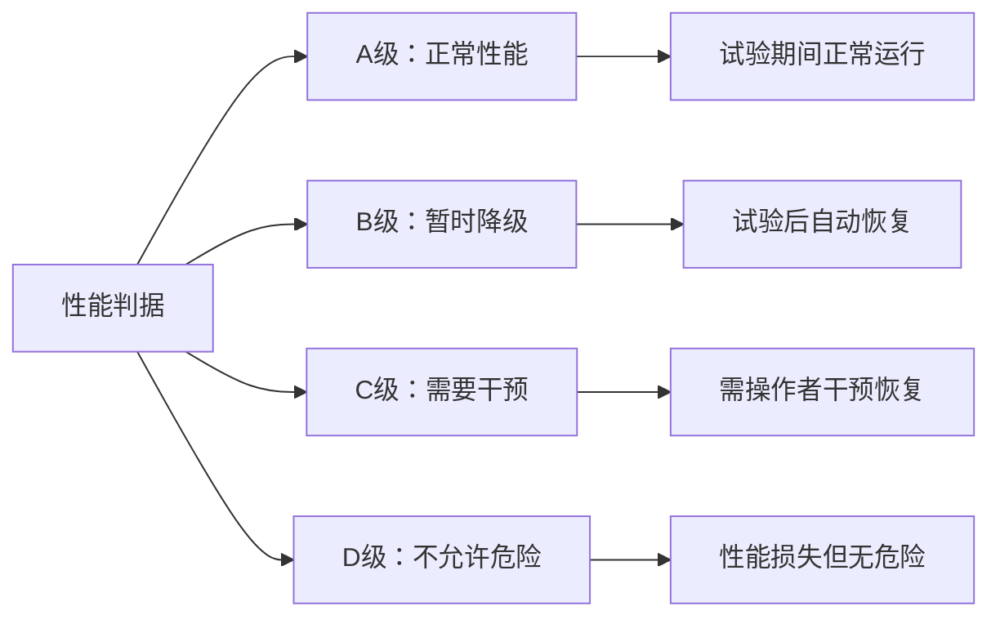
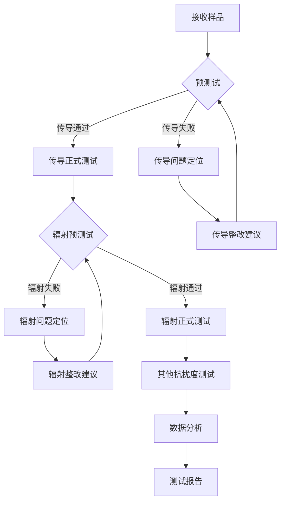

# GB/T 17626.28-2022 - 电磁兼容 试验和测量技术 第28部分：变频器功率驱动系统抗扰度试验

## 1. 标准概述

### 1.1 技术摘要

> 本标准规定了变频器功率驱动系统的电磁兼容抗扰度试验方法，包括传导和辐射抗扰度测试。适用于额定电压不超过1000V AC或1500V DC的变频器功率驱动系统，覆盖工业、商业和轻工业环境中的应用。标准等同采用IEC 61800-3:2017，确保与国际标准的技术一致性。

### 1.2 标准定位

- **技术领域**：EMS电磁抗扰度
- **应用层级**：产品专用测试标准
- **强制属性**：推荐性
- **实施状态**：现行有效

## 2. 物理原理与理论基础

### 2.1 电磁现象机理

变频器功率驱动系统的电磁抗扰度涉及多种耦合机制：

**传导耦合机理**：
$$
V_{noise} = Z_{common} \cdot I_{common} = \frac{Z_L \cdot Z_N}{Z_L + Z_N} \cdot I_{source}
$$

**辐射耦合机理**：
$$
E_{induced} = \frac{\eta_0 \cdot P \cdot G}{4\pi r^2} = \frac{120\pi \cdot P \cdot G}{4\pi r^2}
$$

**功率驱动系统敏感性**：
$$
S_{threshold} = \frac{V_{malfunction}}{E_{field}} = \frac{U_{critical}}{h_{eff} \cdot f \cdot l_{eff}}
$$

### 2.2 数学模型

**传导抗扰度传递函数**：
$$
H(j\omega) = \frac{V_{out}(j\omega)}{V_{in}(j\omega)} = \frac{Z_L}{Z_S + Z_L} \cdot \frac{1}{1 + j\omega RC}
$$

**辐射抗扰度耦合效率**：
$$
\eta_{coupling} = \frac{P_{absorbed}}{P_{incident}} = \frac{4R_L}{(R_S + R_L)^2 + (\omega L)^2}
$$

### 2.3 关键参数定义

| 参数符号 | 参数名称 | 物理意义 | 单位 | 典型值 |
|---------|---------|---------|------|--------|
| $V_{noise}$ | 传导噪声电压 | 通过传导路径耦合的干扰电压 | V | 0.1-30 |
| $Z_{common}$ | 共模阻抗 | 共模电流路径的等效阻抗 | Ω | 10-150 |
| $E_{induced}$ | 感应电场强度 | 辐射场在敏感电路中感应的电场 | V/m | 1-30 |
| $\eta_0$ | 自由空间波阻抗 | 377Ω,电磁波在自由空间中的特性阻抗 | Ω | 377 |
| $S_{threshold}$ | 敏感性阈值 | 引起功能异常的最小场强 | V/m | 1-100 |
| $h_{eff}$ | 有效高度 | 天线或导体的有效接收高度 | m | 0.01-1 |
| $l_{eff}$ | 有效长度 | 敏感电路的有效长度 | m | 0.1-10 |
| $R_L$ | 负载电阻 | 接收电路的等效负载电阻 | Ω | 50-1000 |

## 3. 技术要求详解

### 3.1 限值要求

**传导抗扰度测试电平**：

| 环境等级 | 频率范围 | 测试电平 | 调制方式 | 应用环境 |
|---------|---------|---------|---------|---------|
| 1级 | 150kHz-80MHz | 3V | 80%AM,1kHz | 保护良好的环境 |
| 2级 | 150kHz-80MHz | 3V | 80%AM,1kHz | 受控的EMC环境 |
| 3级 | 150kHz-80MHz | 10V | 80%AM,1kHz | 典型工业环境 |
| 4级 | 150kHz-80MHz | 30V | 80%AM,1kHz | 恶劣工业环境 |

**辐射抗扰度测试电平**：

| 环境等级 | 频率范围 | 测试电平 | 调制方式 | 测试距离 |
|---------|---------|---------|---------|---------|
| 1级 | 80MHz-1GHz | 1V/m | 80%AM,1kHz | 3m |
| 2级 | 80MHz-1GHz | 3V/m | 80%AM,1kHz | 3m |
| 3级 | 80MHz-1GHz | 10V/m | 80%AM,1kHz | 3m |
| 4级 | 80MHz-1GHz | 30V/m | 80%AM,1kHz | 3m |

### 3.2 性能等级划分



### 3.3 适用范围界定

- **包含**：交流变频器、直流变频器、伺服驱动器、完整功率驱动系统(CDM)
- **不包含**：不间断电源(UPS)、电焊设备、照明用电子镇流器
- **特殊考虑**：多轴系统应分别测试每个轴的驱动器

## 4. 测试方法与程序

### 4.1 测试配置

**传导抗扰度测试配置**：
```
射频信号发生器 → 功率放大器 → CDN → 被测设备(EUT)
                                ↓
                           人工电源网络(AMN)
                                ↓
                           接收机/频谱仪
```

**辐射抗扰度测试配置**：
```
信号发生器 → 功率放大器 → 发射天线 ))) 被测设备(EUT)
                                    电波暗室环境
                         场强探头 → 场强监测仪
```

### 4.2 测试步骤

1. **准备阶段**
   - 环境条件确认：温度15-35°C，湿度45-75%RH
   - 设备校准检查：信号源、功率计、场强探头
   - EUT预处理：按制造商要求预热和设置

2. **传导抗扰度执行阶段**
   - 步骤1：将CDN插入EUT电源线路
   - 步骤2：设置射频信号发生器频率扫描150kHz-80MHz
   - 步骤3：调制设置80%AM，1kHz正弦波
   - 步骤4：监测EUT运行状态，记录异常现象

3. **辐射抗扰度执行阶段**
   - 步骤1：EUT放置在电波暗室转台上，距离发射天线3m
   - 步骤2：频率扫描80MHz-1GHz，每个频率驻留时间≥1s
   - 步骤3：场强校准后施加测试电平
   - 步骤4：水平和垂直极化分别测试

4. **数据记录**
   - 原始数据记录：频率点、测试电平、EUT响应
   - 异常现象记录：故障模式、恢复方式、持续时间

### 4.3 判定准则

- **合格**：所有测试频率点均满足规定的性能判据要求
- **不合格**：任一测试频率点出现超出性能判据的异常

## 5. 测试设备与环境

### 5.1 主要测试设备

| 设备名称 | 技术指标 | 校准要求 | 参考型号 |
|---------|---------|---------|---------|
| 射频信号发生器 | 9kHz-1GHz,输出电平-140dBm~+20dBm | 12个月 | R&S SMW200A |
| 功率放大器 | 10W-1000W,增益>40dB,1dB压缩点>43dBm | 12个月 | AR 75A250A |
| CDN耦合网络 | 150kHz-80MHz,纵向转换损耗>20dB | 12个月 | Teseq CDN M5 |
| 电流注入探头 | 30MHz-1GHz,转移阻抗>60dBΩ | 24个月 | Fischer F-120-1 |
| 场强探头 | 80MHz-1GHz,各向同性误差<±1dB | 24个月 | Narda NBM-550 |

### 5.2 测试环境要求

- **电磁环境**：背景场强<测试电平-6dB
- **物理环境**：温度15-35°C±2°C，湿度45-75%RH±5%RH
- **电源质量**：电压变化<±2%，总谐波失真<5%

## 6. 工程实施指南

### 6.1 典型问题与对策

| 常见问题 | 可能原因 | 建议对策 | 预期效果 |
|---------|---------|---------|---------|
| 低频传导抗扰度失效 | 电源滤波器截止频率过高 | 增加共模电感，降低截止频率至100kHz | 传导抗扰度提升10-20dB |
| 中频辐射抗扰度失效 | 控制电缆屏蔽不足 | 使用双层屏蔽电缆，360°屏蔽接地 | 辐射抗扰度提升15-25dB |
| 高频辐射抗扰度失效 | 机箱屏蔽效能不足 | 改善缝隙处理，增加导电衬垫 | 屏蔽效能提升20-30dB |
| 瞬态抗扰度失效 | 瞬态抑制器响应时间慢 | 选用快速响应TVS管或气体放电管 | 瞬态抗扰度提升5-10dB |

### 6.2 测试流程优化



### 6.3 成本控制建议

- **设备复用**：CDN可用于多个传导测试项目，辐射测试系统可共享
- **时间优化**：传导和辐射测试可并行准备，减少设备闲置时间
- **人员配置**：1名高级工程师+1名技术员的配置最优

## 7. 标准差异与互认

### 7.1 国际标准对比

| 对比项 | GB/T 17626.28 | IEC 61800-3 | 差异说明 | 互认情况 |
|--------|---------------|-------------|----------|----------|
| 测试电平 | 1/3/10/30V(传导) | 1/3/10/30V(传导) | 完全一致 | 直接互认 |
| 频率范围 | 150kHz-80MHz | 150kHz-80MHz | 完全一致 | 直接互认 |
| 性能判据 | A/B/C/D四级 | A/B/C/D四级 | 完全一致 | 直接互认 |
| 测试方法 | CDN注入法 | CDN注入法 | 完全一致 | 直接互认 |

### 7.2 认证互认指南

- **直接互认**：符合GB/T 17626.28的测试报告可直接用于IEC 61800-3认证
- **条件互认**：某些特殊应用需要补充特定频段的测试
- **不可互认**：企业标准(如GMW、VW80000)需要重新测试

## 8. 相关标准导航

### 8.1 上游标准

- [[GB_T_17626_1]] - EMC试验和测量技术总则和定义
- [[IEC_61000_4_1]] - EMC基础标准概述

### 8.2 平行标准

- [[GB_T_17626_2]] - 静电放电抗扰度试验
- [[GB_T_17626_3]] - 射频电磁场辐射抗扰度试验  
- [[GB_T_17626_4]] - 电快速瞬变脉冲群抗扰度试验
- [[GB_T_17626_5]] - 浪涌(冲击)抗扰度试验
- [[GB_T_17626_8]] - 工频磁场抗扰度试验
- [[GB_T_17626_11]] - 电压暂降、短时中断和电压变化抗扰度试验

### 8.3 下游标准

- [[GB_4343_1]] - 家用电器、电动工具和类似器具的电磁兼容要求
- [[GB_T_18655]] - 车辆、船和内燃机无线电骚扰特性用于保护车载接收机的限值和测量方法

## 9. 附录

### 9.1 术语定义

**变频器功率驱动系统(PDS)**：包括变频器(驱动器)和被驱动电机的完整系统

**完整驱动模块(CDM)**：包含所有必要功能的独立驱动系统

**功率驱动系统组件(PDC)**：构成完整系统的单个组件

**基本驱动模块(BDM)**：满足基本EMC要求的驱动模块

### 9.2 参考文献

1. IEC 61800-3:2017, Adjustable speed electrical power drive systems - Part 3: EMC requirements and specific test methods
2. GB/T 17626.1-2006, 电磁兼容 试验和测量技术 第1部分：总则
3. CISPR 11:2015, Industrial, scientific and medical equipment - Radio-frequency disturbance characteristics

### 9.3 修订记录

| 版本 | 日期 | 主要变化 | 影响评估 |
|------|------|----------|----------|
| 2022版 | 2022-10-12 | 等同采用IEC 61800-3:2017，更新测试方法和限值 | 提高了与国际标准的一致性 |
| 2006版 | 2006-05-01 | 首次发布，参考IEC 61800-3:2004 | 填补了变频器EMC测试标准空白 |

---