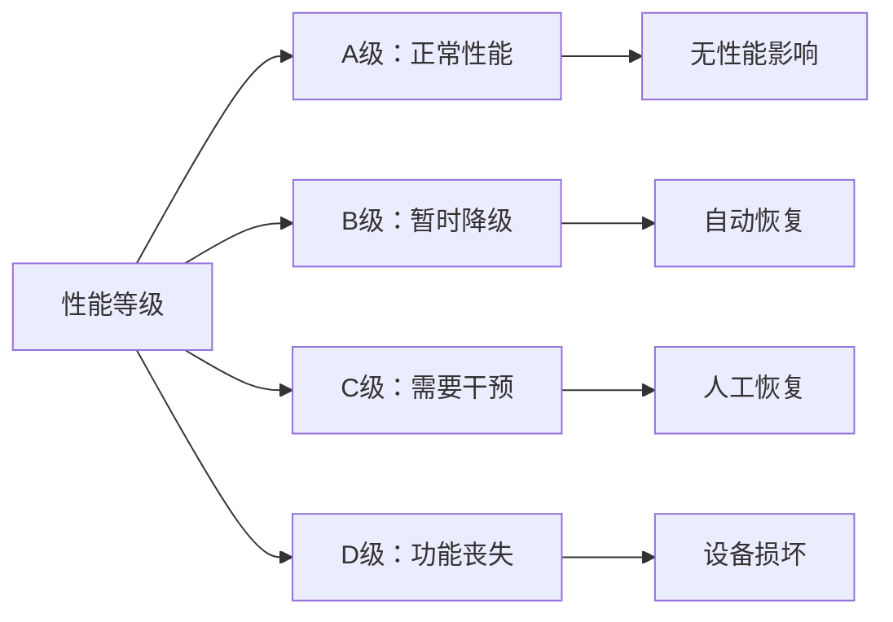
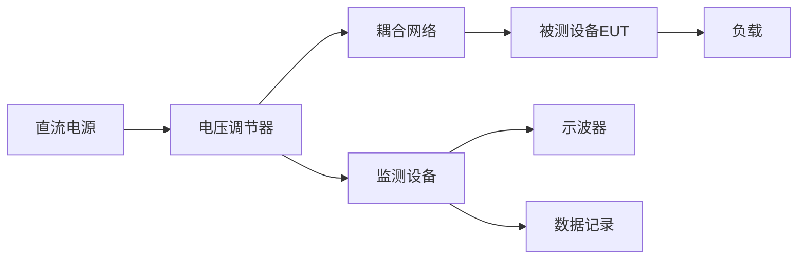
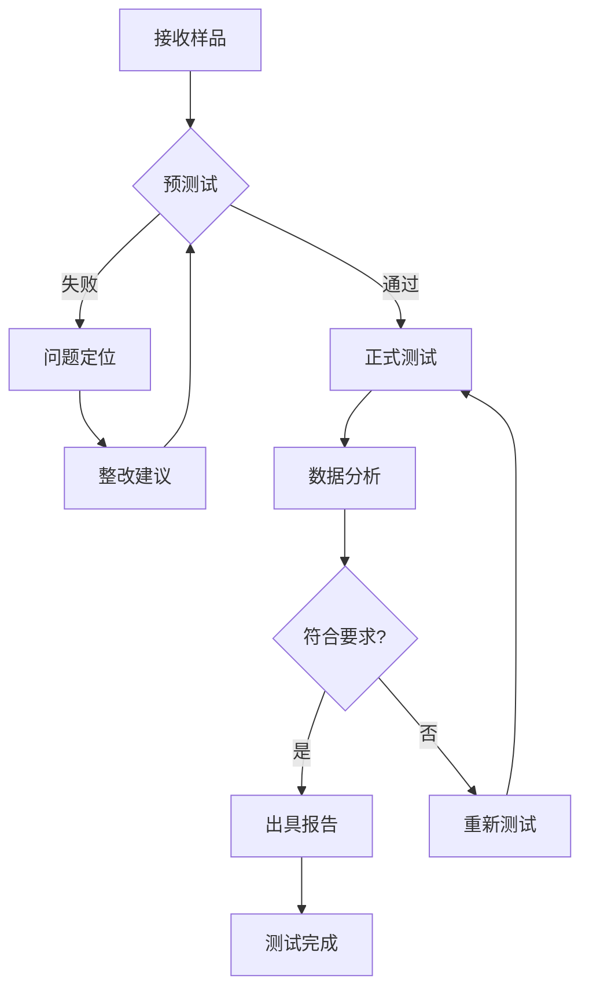

# GB/T 17626.29-2006 - 电磁兼容 试验和测量技术 直流电源输入端口电压暂降、短时中断和电压变化的抗扰度试验

## 1. 标准概述

### 1.1 技术摘要

> 本标准规定了在电气、电子设备的直流电源输入端口对电压暂降、短时中断和电压变化的抗扰度试验方法。建立了评价直流电气、电子设备在经受电压暂降、短时中断和电压变化时抗扰度的通用准则，适用于额定电压不超过300V的直流电源输入端口。

### 1.2 标准定位

- **技术领域**：EMS电磁抗扰度
- **应用层级**：基础测试方法标准
- **强制属性**：推荐性标准
- **实施状态**：现行有效

## 2. 物理原理与理论基础

### 2.1 电磁现象机理

> 直流电源系统中的电压暂降、短时中断现象主要由以下机理产生：

**电压暂降机理**：
$$V_{sag}(t) = V_{nominal} \times \left(1 - \frac{\Delta V}{V_{nominal}}\right) \times u(t)$$

**短时中断机理**：
$$V_{interrupt}(t) = \begin{cases} 
V_{nominal} & t < t_{start} \\
0 & t_{start} \leq t \leq t_{end} \\
V_{nominal} & t > t_{end}
\end{cases}$$

**电压变化机理**：
$$V_{variation}(t) = V_{nominal} + \Delta V \times \sin(2\pi f t + \phi)$$

### 2.2 数学模型

**设备抗扰度评估模型**：
$$I_{immunity} = f(V_{test}, t_{duration}, \frac{dV}{dt}, f_{repetition})$$

**能量存储需求模型**：
$$E_{required} = P_{load} \times t_{holdup} \times \eta^{-1}$$

### 2.3 关键参数定义

> **重要说明**：所有公式中出现的字母和符号必须在此表格中给出明确的定义和物理意义说明。

| 参数符号 | 参数名称 | 物理意义 | 单位 | 典型值 |
|---------|---------|---------|------|--------|
| $V_{sag}$ | 暂降电压 | 电压暂降期间的实际电压值 | V | 0.05~0.95×额定电压 |
| $V_{nominal}$ | 额定电压 | 设备正常工作时的直流电压 | V | 12V, 24V, 48V |
| $\Delta V$ | 电压变化量 | 相对于额定电压的变化量 | V | ±5%~±20% |
| $t_{duration}$ | 持续时间 | 电压异常状态的持续时间 | s | 0.01~5.0 |
| $t_{holdup}$ | 维持时间 | 设备在电压中断时的维持时间 | s | 0.02~1.0 |
| $P_{load}$ | 负载功率 | 设备的额定功率消耗 | W | 依设备而定 |
| $\eta$ | 效率因子 | 内部能量转换效率 | - | 0.8~0.95 |
| $f_{repetition}$ | 重复频率 | 电压异常事件的重复频率 | Hz | 0.1~100 |
| $u(t)$ | 单位阶跃函数 | 数学函数，描述突变过程 | - | 0或1 |

## 3. 技术要求详解

### 3.1 限值要求

> 标准规定的测试等级和技术参数

| 测试等级 | 电压暂降深度 | 持续时间 | 重复次数 | 间隔时间 |
|---------|-------------|----------|----------|----------|
| 1级 | 30% (70%额定值) | 0.5周期 | 3次 | 10s |
| 2级 | 60% (40%额定值) | 1周期 | 3次 | 10s |
| 3级 | 95% (5%额定值) | 10周期 | 3次 | 10s |
| X级 | 用户定义 | 用户定义 | 用户定义 | 用户定义 |

### 3.2 性能等级划分

### 3.3 适用范围界定

- **包含**：信息技术设备、工业控制设备、医疗器械、通信设备的直流电源输入端口
- **不包含**：交流电源端口、直流电源输出端口、内部直流母线
- **特殊考虑**：额定电压超过300V的设备、电池供电设备、不间断电源设备

## 4. 测试方法与程序

### 4.1 测试配置

### 4.2 测试步骤

1. **准备阶段**
   - 环境条件确认：温度16-35℃，湿度45-75%
   - 设备校准检查：电压调节器精度校验
   - EUT预处理：按制造商要求设置工作状态

2. **执行阶段**
   - 步骤1：设置测试等级和参数
   - 步骤2：施加电压暂降/中断信号
   - 步骤3：监测EUT性能响应
   - 步骤4：记录测试数据和现象

3. **数据记录**
   - 原始数据记录：电压波形、时间参数
   - 异常现象记录：功能状态变化、恢复时间

### 4.3 判定准则

> 根据EUT在测试期间和测试后的性能表现进行分类判定

- **A级合格**：设备功能正常，性能指标在规定范围内
- **B级合格**：设备功能暂时降级但自动恢复
- **C级合格**：设备功能丧失但可人工恢复
- **D级不合格**：设备功能永久丧失或损坏

## 5. 测试设备与环境

### 5.1 主要测试设备

| 设备名称 | 技术指标 | 校准要求 | 参考型号 |
|---------|---------|---------|---------|
| 直流电压调节器 | 精度≤1%，响应时间≤100μs | 12个月 | EMTest VDS200N |
| 示波器 | 带宽≥100MHz，采样率≥1GSa/s | 24个月 | Tektronix MSO64 |
| 直流电压表 | 精度0.1级，量程覆盖测试范围 | 12个月 | Fluke 8508A |
| 函数发生器 | 频率0.1Hz-1MHz，幅度精度≤1% | 12个月 | Keysight 33500B |
| 电流探头 | 带宽≥10MHz，精度≤2% | 12个月 | Tektronix A622 |

### 5.2 测试环境要求

- **电磁环境**：背景场强<测试等级的10%，接地阻抗≤10Ω
- **物理环境**：温度16-35℃(±2℃)，湿度45-75%(±5%)，气压86-106kPa
- **电源质量**：电压波动≤±2%，谐波失真≤5%，频率精度≤±0.1%

## 6. 工程实施指南

### 6.1 典型问题与对策

| 常见问题 | 可能原因 | 建议对策 | 预期效果 |
|---------|---------|---------|---------|
| 测试结果不稳定 | 接地不良、环境干扰 | 改善接地系统，屏蔽干扰源 | 提高测试重现性 |
| 设备意外损坏 | 测试等级设置过高 | 从低等级开始逐步提升 | 保护被测设备 |
| 无法产生标准波形 | 设备校准不准确 | 重新校准电压调节器 | 确保测试有效性 |
| 数据记录不完整 | 监测设备设置错误 | 检查触发条件和采样率 | 获得完整测试数据 |

### 6.2 测试流程优化

### 6.3 成本控制建议

- **设备复用**：电压调节器可用于多种电压暂降测试，示波器可复用于其他EMC测试
- **时间优化**：合理安排测试序列，利用设备预热时间进行样品准备
- **人员配置**：1名测试工程师+1名技术员的配置最为经济高效

## 7. 标准差异与互认

### 7.1 国际标准对比

| 对比项 | GB/T 17626.29 | IEC 61000-4-29 | 差异说明 | 互认情况 |
|--------|---------------|----------------|----------|----------|
| 测试等级 | 1-3级+X级 | 1-3级+X级 | 完全一致 | 直接互认 |
| 测试方法 | 电压调节器法 | 电压调节器法 | 完全一致 | 直接互认 |
| 性能判据 | A/B/C/D级 | A/B/C/D级 | 完全一致 | 直接互认 |
| 环境条件 | 16-35℃,45-75%RH | 15-35℃,45-75%RH | 温度下限略有差异 | 基本互认 |

### 7.2 认证互认指南

- **直接互认**：测试方法、测试等级、性能判据完全相同的项目
- **条件互认**：环境条件略有差异时需要说明测试条件
- **不可互认**：使用非标准测试方法或设备的测试结果

## 8. 相关标准导航

### 8.1 上游标准

- [[GB_T_17626_1]] - 电磁兼容试验和测量技术总则，提供基本概念和通用要求
- [[IEC_61000_4_1]] - 国际标准总则，规定了抗扰度试验的一般要求

### 8.2 平行标准

- [[GB_T_17626_11]] - 交流电源端口电压暂降抗扰度试验，与本标准形成交直流互补
- [[GB_T_17626_12]] - 振铃波抗扰度试验，同属传导抗扰度测试范畴
- [[GB_T_17626_34]] - 电压暂降、短时中断和电压变化的抗扰度试验设备

### 8.3 下游标准

- [[GB_4943_1]] - 信息技术设备安全要求，引用本标准进行EMC测试
- [[GB_T_9254]] - 信息技术设备的无线电骚扰限值和测量方法
- [[YD_T_993]] - 电信设备的电磁兼容性要求和测量方法

## 9. 附录

### 9.1 术语定义

> 关键术语的标准定义

- **电压暂降(Voltage dip)**：供电电压有效值在短时间内降低到90%~10%额定值，持续时间为0.5周期到1分钟
- **短时中断(Short interruption)**：供电电压降低到额定值的10%以下，持续时间不超过3分钟的供电中断
- **电压变化(Voltage variation)**：供电电压有效值相对稳态值的偏差超过额定值的5%
- **抗扰度(Immunity)**：设备、装置或系统面临电磁骚扰时能够不降级运行的能力

### 9.2 参考文献

> 标准制定的技术依据

1. IEC 61000-4-29:2000, Electromagnetic compatibility (EMC) - Part 4-29: Testing and measurement techniques - Voltage dips, short interruptions and voltage variations on d.c. input power port immunity tests
2. IEEE Std 1159-2019, IEEE Recommended Practice for Monitoring Electric Power Quality
3. GB/T 12668.3-2012, 调速电气传动系统 第3部分：EMC标准
4. CISPR 16-1-2:2014, 无线电骚扰和抗扰度测量设备和测量方法规范

### 9.3 修订记录

| 版本 | 日期 | 主要变化 | 影响评估 |
|------|------|----------|----------|
| 2006版 | 2006-06-01 | 等同采用IEC 61000-4-29:2000 | 与国际标准保持一致性 |
| 1998版 | 1998-12-01 | 首次发布国家标准 | 填补国内标准空白 |

---