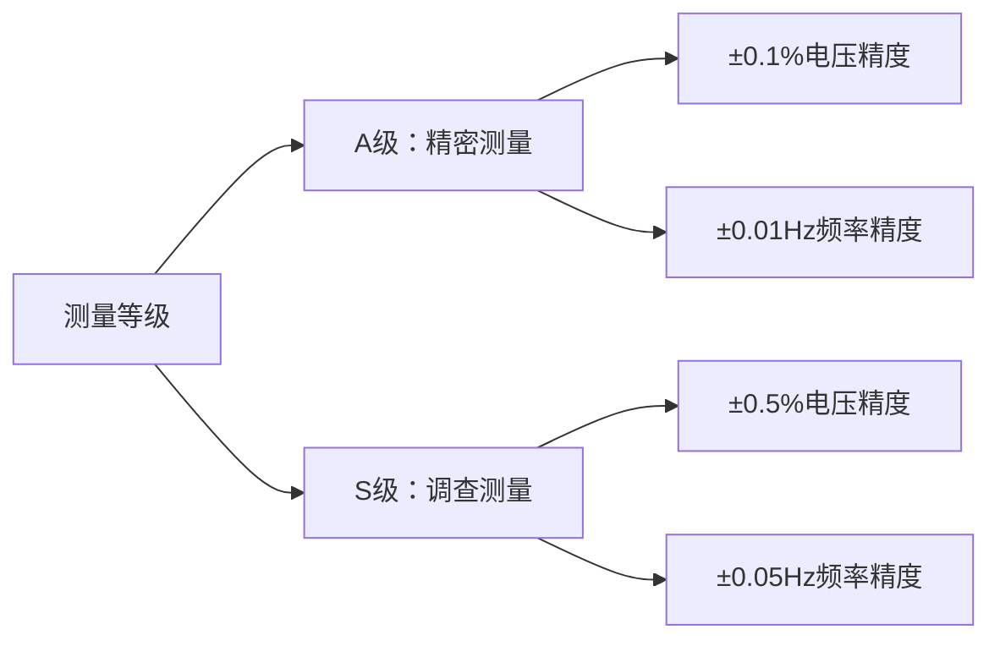
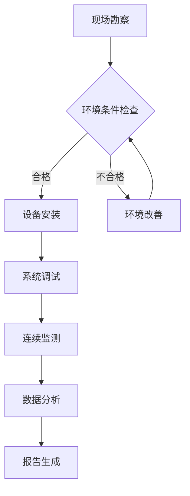

# GB/T 17626.30-2023 - 电磁兼容 试验和测量技术 第30部分：电能质量测量方法

## 1. 标准概述

### 1.1 技术摘要

> GB/T 17626.30-2023规定了50Hz交流供电系统中电能质量参数的测量方法，包括电压、频率、谐波、闪变、不平衡等参数的现场测量技术要求。标准分为A级(精密测量)和S级(调查测量)两个精度等级，为电能质量监测和评估提供标准化测量方法。

### 1.2 标准定位

- **技术领域**：EMS/电能质量测量
- **应用层级**：测试方法标准
- **强制属性**：推荐性
- **实施状态**：现行有效

## 2. 物理原理与理论基础

### 2.1 电磁现象机理

> 电能质量问题源于电力系统中各种线性和非线性负载对电网的影响，产生电压波动、谐波污染、频率偏差等现象。

$$
u(t) = U_1\sqrt{2}\sin(\omega t + \phi_1) + \sum_{h=2}^{40} U_h\sqrt{2}\sin(h\omega t + \phi_h)
$$

其中电压总有效值为：

$$
U_{rms} = \sqrt{U_1^2 + \sum_{h=2}^{40} U_h^2}
$$

总谐波畸变率定义为：

$$
THD_U = \frac{\sqrt{\sum_{h=2}^{40} U_h^2}}{U_1} \times 100\%
$$

### 2.2 数学模型

闪变的定量评估采用短时间闪变严重度：

$$
P_{st} = \sqrt{0.0314P_{0.1} + 0.0525P_1 + 0.0657P_3 + 0.28P_{10} + 0.08P_{50}}
$$

电压不平衡度计算：

$$
VUF = \frac{|U_2|}{||U_1||} \times 100\%
$$

### 2.3 关键参数定义

| 参数符号 | 参数名称 | 物理意义 | 单位 | 典型值 |
|---------|---------|---------|------|--------|
| $U_{rms}$ | 电压有效值 | 交流电压的有效值 | V | 220/380 |
| $f$ | 供电频率 | 交流电网基本频率 | Hz | 50 |
| $U_h$ | h次谐波电压 | 第h次谐波分量有效值 | V | <5%基波 |
| $P_{st}$ | 短时间闪变严重度 | 10分钟内闪变强度 | - | <1.0 |
| $VUF$ | 电压不平衡度 | 负序与正序电压比值 | % | <2% |
| $\Delta U$ | 电压偏差 | 电压与额定值偏差 | % | ±7% |
| $\omega$ | 角频率 | 2πf | rad/s | 314.16 |
| $\phi_h$ | h次谐波相位 | 谐波分量初相位 | rad | 0-2π |

## 3. 技术要求详解

### 3.1 限值要求

| 参数类型 | A级精度 | S级精度 | 测量范围 | 聚合周期 |
|---------|---------|---------|----------|----------|
| 电压有效值 | ±0.1% | ±0.5% | 0.1-1000V | 10分钟 |
| 频率 | ±0.01Hz | ±0.05Hz | 42.5-57.5Hz | 10秒 |
| 谐波电压 | ±5% | ±5% | 2-40次 | 10分钟 |
| 闪变Pst | ±5% | ±15% | 0.25-20 | 10分钟 |
| 电压不平衡 | ±0.15% | ±0.30% | 0-5% | 10分钟 |

### 3.2 性能等级划分



### 3.3 适用范围界定

- **包含**：50Hz工频交流电力系统、配电网络、用户端电能质量监测
- **不包含**：直流系统、特殊频率系统、瞬态电能质量事件
- **特殊考虑**：新能源接入点、大型负载接入点需要特别关注

## 4. 测试方法与程序

### 4.1 测试配置

```
电网━━━[电压互感器]━━━[信号调理]━━━[A/D转换]━━━[数字信号处理]━━━[数据存储]
                    ┃
                   [电流互感器]━━━[功率计算]
```

### 4.2 测试步骤

1. **准备阶段**
   - 测量点环境条件确认(温度23±5℃，湿度45%-75%)
   - 测量设备校准检查(校准有效期内)
   - 测量系统连接检查

2. **执行阶段**
   - 步骤1：建立测量连接，确认相序正确
   - 步骤2：设置采样参数(≥256样点/周期)
   - 步骤3：连续测量168小时(一周)
   - 步骤4：实时数据处理和聚合

3. **数据记录**
   - 10秒聚合数据(频率)
   - 10分钟聚合数据(电压、谐波、闪变)
   - 异常事件标记和记录

### 4.3 判定准则

> 测量结果符合相应等级精度要求，数据有效性≥95%，异常数据剔除后进行统计分析

## 5. 测试设备与环境

### 5.1 主要测试设备

| 设备名称 | 技术指标 | 校准要求 | 参考型号 |
|---------|---------|---------|---------|
| 电能质量分析仪 | A级±0.1%，采样≥200样点/周期 | 12个月 | Fluke 435-II |
| 谐波分析仪 | 2-40次谐波，±5%精度 | 12个月 | Hioki 3197 |
| 闪变测量仪 | 符合IEC 61000-4-15 | 12个月 | LEM TOPAS 1000 |
| 数据采集系统 | 16位ADC，同步采样 | 12个月 | NI cDAQ-9178 |

### 5.2 测试环境要求

- **电磁环境**：背景电磁场<3V/m
- **物理环境**：温度23±5℃，相对湿度45%-75%
- **电源质量**：辅助电源THD<5%，电压稳定度<1%

## 6. 工程实施指南

### 6.1 典型问题与对策

| 常见问题 | 可能原因 | 建议对策 | 预期效果 |
|---------|---------|---------|---------|
| 测量数据跳变 | 接触不良 | 检查连接端子 | 数据稳定 |
| 谐波测量偏差 | 相位不同步 | 校准相位基准 | 精度提升 |
| 闪变测量异常 | 滤波器设置错误 | 重新配置参数 | 结果准确 |

### 6.2 测试流程优化



### 6.3 成本控制建议

- **设备复用**：多功能电能质量分析仪可满足多项参数测量
- **时间优化**：采用连续监测减少人工干预
- **人员配置**：1名专业工程师+1名辅助人员

## 7. 标准差异与互认

### 7.1 国际标准对比

| 对比项 | GB/T 17626.30 | IEC 61000-4-30 | 差异说明 | 互认情况 |
|--------|---------------|----------------|----------|----------|
| 基准频率 | 50Hz | 50/60Hz | 中国采用50Hz | 直接互认 |
| A级精度 | ±0.1% | ±0.1% | 完全一致 | 直接互认 |
| 聚合周期 | 10分钟 | 10分钟 | 完全一致 | 直接互认 |
| 谐波次数 | 2-40次 | 2-40次 | 完全一致 | 直接互认 |

### 7.2 认证互认指南

- **直接互认**：基本测量方法和精度要求
- **条件互认**：需要确认工频制式(50Hz/60Hz)
- **不可互认**：特殊电网参数和国别化要求

## 8. 相关标准导航

### 8.1 上游标准

- [[GB_T_17626_1]] - 电磁兼容试验和测量技术 总则
- [[GB_T_2900_82]] - 电工术语 电能质量

### 8.2 平行标准

- [[GB_T_14549]] - 电能质量 公用电网谐波
- [[GB_T_12325]] - 电能质量 供电电压偏差
- [[GB_T_24337]] - 电能质量 公用电网间谐波

### 8.3 下游标准

- [[GB_T_19862]] - 电能质量监测设备通用要求
- [[DL_T_1028]] - 电能质量技术监督规程
- [[NB_T_42025]] - 风电场电能质量测试方法

## 9. 附录

### 9.1 术语定义

- **电能质量**：供电系统向用户供给的电能的品质
- **聚合**：在指定时间窗内对测量数据进行统计处理
- **基本测量周期**：工频周期的整数倍测量时间窗
- **闪变**：由电压波动引起的光源光通量波动产生的视觉感受

### 9.2 参考文献

- IEC 61000-4-30:2021 电磁兼容 试验和测量技术 第4-30部分
- IEEE 1159-2019 推荐的电能质量监测实施方法
- EN 50160:2010 公用配电系统供电电压特性

### 9.3 修订记录

| 版本 | 日期 | 主要变化 | 影响评估 |
|------|------|----------|----------|
| 2023版 | 2023-12-28 | 基于IEC 61000-4-30:2021更新 | 提升测量精度要求 |
| 2012版 | 2012-06-29 | 首次发布 | 建立标准化测量方法 |