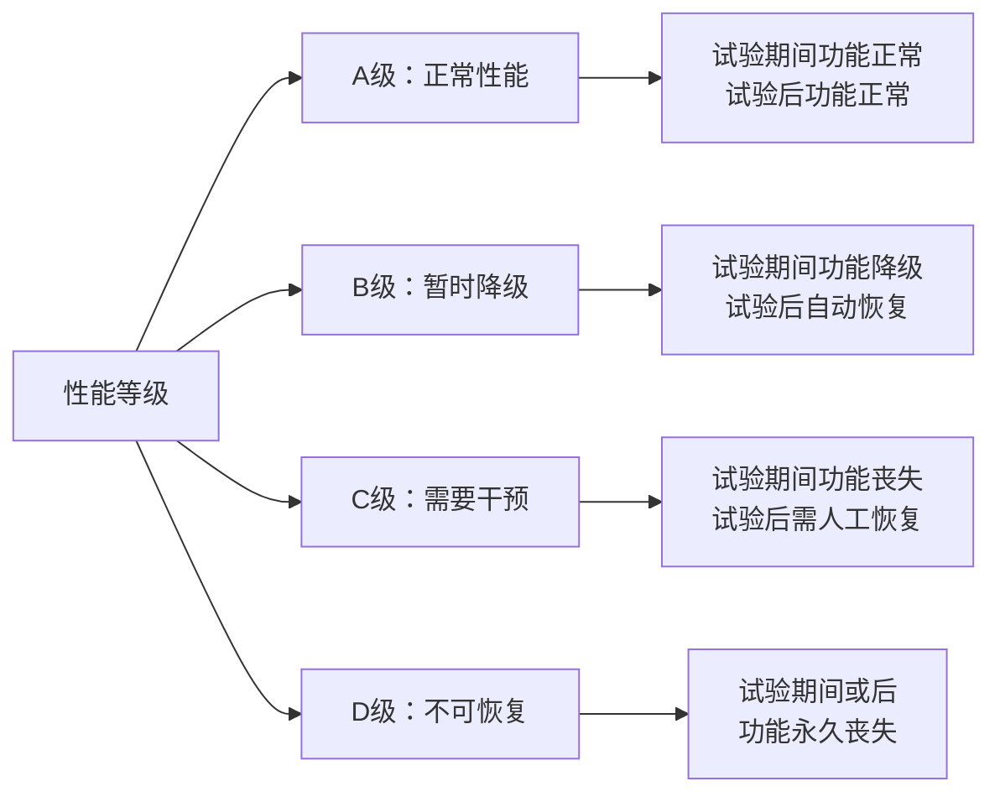
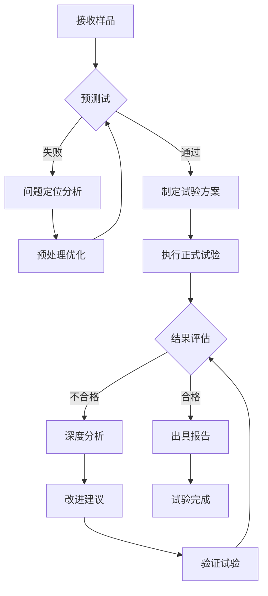

# GB/T 17626.34 - 电磁兼容 试验和测量技术 第34部分：电压暂降、短时中断和电压变化抗扰度试验指南

## 1. 标准概述

### 1.1 技术摘要

> 本标准为[[GB_T_17626_11]]《电压暂降、短时中断和电压变化的抗扰度试验》提供详细的实施指南，涵盖试验方法选择、设备配置、测试流程和结果评估的完整技术框架。标准重点解决实际试验中的配置优化、干扰模拟真实性和结果评估一致性问题。

### 1.2 标准定位

- **技术领域**：EMS抗扰度
- **应用层级**：实施指南标准
- **强制属性**：推荐性
- **实施状态**：现行有效

## 2. 物理原理与理论基础

### 2.1 电磁现象机理

> 电压暂降是电力系统中最常见的电能质量问题，其物理机理涉及电网故障、大负荷启动和配电系统保护动作等多种因素。

电压暂降的基本数学描述：

$$
V(t) = V_0 \cdot \alpha(t) \cdot e^{j(\omega t + \phi)}
$$

其中暂降深度函数：

$$
\alpha(t) = \begin{cases}
1 & t < t_1 \\
\frac{V_{sag}}{V_{nom}} & t_1 \leq t \leq t_2 \\
1 & t > t_2
\end{cases}
$$

设备敏感性阈值模型：

$$
V_{threshold}(t) = V_{nom} \cdot \left(1 - \frac{t - t_{min}}{t_{max} - t_{min}}\right)^{-k}
$$

### 2.2 数学模型

电压暂降对设备影响的定量评估模型：

$$
P_{impact} = 1 - e^{-\lambda \cdot f(V_{sag}, t_{dur}, \theta)}
$$

其中影响函数：

$$
f(V_{sag}, t_{dur}, \theta) = \left(\frac{V_{nom} - V_{sag}}{V_{nom}}\right)^{\alpha} \cdot t_{dur}^{\beta} \cdot g(\theta)
$$

### 2.3 关键参数定义

> **重要说明**：所有公式中出现的字母和符号必须在此表格中给出明确的定义和物理意义说明。

| 参数符号 | 参数名称 | 物理意义 | 单位 | 典型值 |
|---------|---------|---------|------|--------|
| V(t) | 瞬时电压 | 随时间变化的电压波形 | V | - |
| V₀ | 标称电压幅值 | 正常工作电压的峰值 | V | 311V(220V有效值) |
| α(t) | 暂降深度函数 | 电压暂降的时间特性 | 无量纲 | 0.1-0.9 |
| ω | 角频率 | 电网基波角频率 | rad/s | 314(50Hz) |
| φ | 相位角 | 暂降发生时的相位角 | ° | 0°-360° |
| Vsag | 暂降电压 | 暂降期间的电压有效值 | V | 22V-198V |
| Vnom | 标称电压 | 设备额定工作电压 | V | 220V |
| t₁ | 暂降开始时间 | 电压暂降起始时刻 | s | - |
| t₂ | 暂降结束时间 | 电压暂降结束时刻 | s | - |
| tdur | 暂降持续时间 | 暂降的总持续时间 | 周期 | 0.5-300 |
| λ | 敏感性参数 | 设备对暂降的敏感程度 | - | 设备相关 |
| k | 阈值衰减指数 | 敏感性随时间的变化率 | - | 0.5-2.0 |
| θ | 相位角 | 暂降发生的相位位置 | ° | 0°-360° |

## 3. 技术要求详解

### 3.1 限值要求

**试验等级与电压暂降深度对应关系**

| 试验等级 | 暂降深度(%) | 剩余电压(%) | 应用环境 | 典型持续时间 |
|---------|------------|------------|----------|------------|
| 1级 | 30% | 70% | 保护良好的环境 | 0.5周期 |
| 2级 | 60% | 40% | 典型商业环境 | 1-25周期 |
| 3级 | 90% | 10% | 恶劣工业环境 | 26-250周期 |
| X级 | 用户定义 | 用户定义 | 特殊应用 | 用户定义 |

**短时中断试验等级**

| 试验等级 | 中断深度 | 持续时间范围 | 应用场景 |
|---------|----------|------------|----------|
| 1级 | >95% | 0.5-1周期 | 配电开关动作 |
| 2级 | >95% | 1-25周期 | 故障切除时间 |
| 3级 | >95% | 25-250周期 | 自动重合闸 |

### 3.2 性能等级划分



### 3.3 适用范围界定

- **包含**：额定电压1000V及以下的所有电气电子设备
- **不包含**：专门设计的不间断电源UPS内部电路
- **特殊考虑**：医疗设备需要更严格的性能要求

## 4. 测试方法与程序

### 4.1 测试配置

```
    电网模拟器          耦合去耦网络CDN          被试设备EUT
    ┌─────────────┐    ┌─────────────────┐    ┌─────────────┐
    │             │    │                 │    │             │
    │   AC电源    ├────┤   L1  ┌───┐     ├────┤    EUT      │
    │             │    │       │ C │     │    │             │
    │  暂降发生器  │    │   L2  └───┘  N  │    │             │
    │             ├────┤              ├────┤             │
    │             │    │   L3     ┌───┐   │    │             │
    └─────────────┘    │          │ C │   │    └─────────────┘
                       │       PE └───┘   │
                       └─────────────────┘
```

**关键配置要素：**

1. **电源系统**：低阻抗交流电源，THD<5%
2. **暂降发生器**：精确控制暂降深度和持续时间
3. **耦合网络**：隔离测试信号，防止回流
4. **监测系统**：同步记录电压波形和设备响应

### 4.2 测试步骤

1. **准备阶段**
   - 环境条件确认：温度16-35℃，湿度45-75%RH
   - 设备校准检查：电压±2%，时间±1%
   - EUT预处理：按说明书要求预热稳定

2. **执行阶段**
   - 步骤1：设置标称工作电压，确认EUT正常运行
   - 步骤2：选择试验等级，设置暂降深度和持续时间
   - 步骤3：选择相位角(0°, 45°, 90°, 135°, 180°, 225°, 270°, 315°)
   - 步骤4：施加电压暂降，记录EUT响应
   - 步骤5：每个相位角重复试验，间隔时间≥10s

3. **数据记录**
   - 原始数据记录：电压波形、时间戳、EUT状态
   - 异常现象记录：故障模式、恢复时间、性能降级

### 4.3 判定准则

**合格判定条件：**
- A级：所有试验点均满足正常性能要求
- B级：允许暂时性能降级，但须自动恢复
- C级：允许需要操作员干预的功能恢复
- D级：不允许永久性功能丧失

## 5. 测试设备与环境

### 5.1 主要测试设备

| 设备名称 | 技术指标 | 校准要求 | 参考型号 |
|---------|---------|---------|---------|
| 电压暂降发生器 | 输出电压精度±2%<br/>时间精度±1%<br/>相位精度±2° | 12个月 | Teseq VDS200<br/>EMTEST VCS500 |
| 示波器 | 带宽≥100MHz<br/>采样率≥1GSa/s<br/>存储深度≥1Mpts | 12个月 | Keysight DSOX3024A<br/>Tektronix MSO44 |
| 电能质量分析仪 | 电压精度±0.1%<br/>频率精度±0.01Hz<br/>THD测量<5% | 12个月 | Fluke 435-II<br/>Hioki PW3198 |
| 耦合去耦网络 | 插入损耗<0.1dB<br/>隔离度>60dB<br/>电流容量适配 | 24个月 | Teseq CDN M3<br/>EMTEST CDN M2 |

### 5.2 测试环境要求

- **电磁环境**：背景场强<3V/m(80MHz-1000MHz)
- **物理环境**：温度16-35℃(±2℃)，湿度45-75%RH(±5%)
- **电源质量**：电压稳定度±1%，THD<5%，频率偏差±0.5%

## 6. 工程实施指南

### 6.1 典型问题与对策

| 常见问题 | 可能原因 | 建议对策 | 预期效果 |
|---------|---------|---------|---------|
| 试验重现性差 | 暂降发生相位角不确定 | 使用同步触发，固定相位角 | 提高试验一致性 |
| 设备异常复位 | 电源内阻过大 | 使用低阻抗电源或加大容量 | 减少电压跌落 |
| 干扰信号泄露 | CDN隔离度不足 | 检查CDN接地和屏蔽 | 提高试验准确性 |
| 波形失真严重 | 电源谐波含量高 | 使用线性电源或加装滤波器 | 改善电压质量 |

### 6.2 测试流程优化



### 6.3 成本控制建议

- **设备复用**：暂降发生器可用于多种抗扰度试验
- **时间优化**：多设备并行测试，批量处理
- **人员配置**：1名主试工程师+1名辅助技术员

## 7. 标准差异与互认

### 7.1 国际标准对比

| 对比项 | GB/T 17626.34 | IEC 61000-4-34 | 差异说明 | 互认情况 |
|--------|---------------|-----------------|----------|----------|
| 试验等级 | 1-3级+X级 | 1-3级+X级 | 完全一致 | 直接互认 |
| 相位角选择 | 8个相位角 | 8个相位角 | 完全一致 | 直接互认 |
| 性能判据 | A/B/C/D级 | A/B/C/D级 | 完全一致 | 直接互认 |
| 校准要求 | 12个月周期 | 12个月周期 | 完全一致 | 直接互认 |

### 7.2 认证互认指南

- **直接互认**：CB认证、CE认证可直接接受本标准试验结果
- **条件互认**：UL认证需要补充特殊等级试验
- **不可互认**：无，本标准与国际标准技术要求一致

## 8. 相关标准导航

### 8.1 上游标准

- [[GB_T_17626_1]] - EMC试验和测量技术通用导则
- [[GB_T_6113_101]] - 电能质量 电压暂降与短时中断

### 8.2 平行标准

- [[GB_T_17626_11]] - 电压暂降、短时中断和电压变化的抗扰度试验
- [[GB_T_17626_12]] - 振荡波抗扰度试验

### 8.3 下游标准

- [[GB_4343_1]] - 家用电器EMC要求
- [[GB_T_18655]] - 车载接收机的无线电骚扰特性限值和测量方法

## 9. 附录

### 9.1 术语定义

**电压暂降(Voltage dip)**：电压有效值暂时降低到90%~10%额定电压之间，持续时间从半个周期到1分钟。

**短时中断(Short interruption)**：电压中断时间从半个周期到3秒，期间电压降低到10%额定电压以下。

**电压变化(Voltage variation)**：电压有效值缓慢变化，变化幅度超过±10%额定电压。

### 9.2 参考文献

1. IEC 61000-4-34:2023, Electromagnetic compatibility (EMC) - Part 4-34: Testing and measurement techniques - Voltage dips, short interruptions and voltage variations immunity tests guide
2. IEEE Std 1159-2019, IEEE Recommended Practice for Monitoring Electric Power Quality
3. IEC 61000-2-8:2002, Electromagnetic compatibility (EMC) - Part 2-8: Environment - Voltage dips and short interruptions on public electric power supply systems

### 9.3 修订记录

| 版本 | 日期 | 主要变化 | 影响评估 |
|------|------|----------|----------|
| Ed.2024.1 | 2024-03-15 | 等同采用IEC 61000-4-34:2023 | 与国际标准完全一致 |
| Ed.2017.1 | 2017-06-01 | 首次发布 | 填补国内标准空白 |