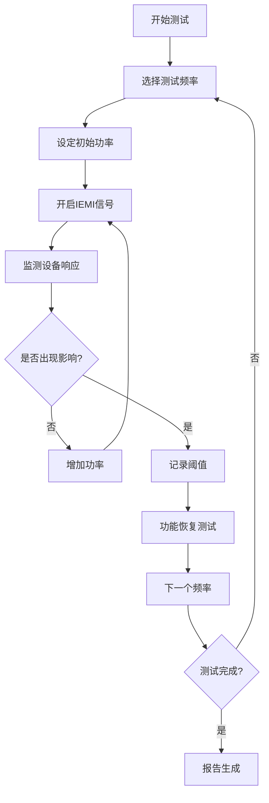

# GB/T 17626.36-2024 有意电磁干扰抗扰度试验方法

## 1. 物理原理与数学建模

### 1.1 有意电磁干扰(IEMI)的物理机制

有意电磁干扰是指人为产生的高强度电磁场，旨在破坏或干扰电子设备的正常工作。与自然电磁环境不同，IEMI具有以下特征：

#### 1.1.1 高峰值功率密度

IEMI源的功率密度远超常规EMC标准：
$$
P_d = \frac{E^2}{Z_0} = \frac{E^2}{377} \text{ (W/m²)}
$$

其中：
- 常规EMC测试：$E \leq 10$ V/m，$P_d \leq 0.27$ mW/m²
- IEMI威胁级别：$E \geq 100$ V/m，$P_d \geq 26.5$ mW/m²
- 高威胁环境：$E \geq 2000$ V/m，$P_d \geq 10.6$ W/m²

#### 1.1.2 脉冲特性分析

**窄带脉冲(HPM - 高功率微波)**：
单频高功率微波脉冲的时域表达式：
$$
E(t) = E_0 \cos(2\pi f_0 t) \cdot \text{rect}\left(\frac{t}{\tau}\right)
$$

其中：$E_0$ - 峰值场强，$f_0$ - 载波频率，$\tau$ - 脉宽

**宽带脉冲(UWB - 超宽带)**：
超宽带脉冲的高斯导数表达式：
$$
E(t) = E_0 \cdot \frac{d^n}{dt^n}\left[\exp\left(-\frac{t^2}{2\sigma^2}\right)\right]
$$

脉冲频谱带宽：
$$
B_{-3dB} = \frac{0.44}{\sigma} \text{ (Hz)}
$$

#### 1.1.3 场强-距离衰减模型

**自由空间传播**：
$$
E(r) = \frac{\sqrt{30P_tG_t}}{r} \text{ (V/m)}
$$

**近场区域** ($r < \frac{D^2}{4\lambda}$)：
$$
E(r) = E_0 \cdot \frac{D^2}{16r^2} \text{ (反比于 } r^2 \text{)}
$$

**远场区域** ($r > \frac{D^2}{4\lambda}$)：
$$
E(r) = E_0 \cdot \frac{D}{2r} \text{ (反比于 } r \text{)}
$$

| 变量 | 含义 | 单位 | 典型值范围 | 测量不确定度 |
|------|------|------|------------|-------------|
| $E_0$ | 峰值场强 | V/m | 100-10000 | ±2.5 dB |
| $P_t$ | 发射功率 | W | 10⁶-10⁹ | ±1.0 dB |
| $G_t$ | 发射天线增益 | dBi | 10-40 | ±0.5 dB |
| $r$ | 传播距离 | m | 1-1000 | ±0.1 m |
| $D$ | 天线孔径 | m | 0.1-10 | ±0.01 m |
| $\lambda$ | 波长 | m | 0.017-3 | 理论值 |

### 1.2 目标系统脆弱性模型

#### 1.2.1 线性耦合阈值模型

对于数字电路，干扰阈值与信号幅度的关系：
$$
E_{threshold} = \frac{V_{noise}}{L_{eff} \cdot f_{max}} \sqrt{\frac{Z_{source}}{Z_{load}}}
$$

其中：
- $V_{noise}$ - 噪声容限阈值 (V)
- $L_{eff}$ - 有效耦合长度 (m)  
- $f_{max}$ - 最高工作频率 (Hz)
- $Z_{source}$, $Z_{load}$ - 源/负载阻抗 (Ω)

#### 1.2.2 功率敏感性分析

功率相关的损伤阈值：
$$
P_{damage} = \frac{V_{breakdown}^2}{R_{load}} = \frac{(E_{breakdown} \cdot L_{eff})^2}{R_{load}}
$$

**半导体器件损伤机制**：
- **热损伤**：$P_{thermal} = \frac{T_{junction} - T_{ambient}}{R_{thermal}}$
- **电场击穿**：$E_{breakdown} = \frac{V_{breakdown}}{t_{oxide}}$
- **闩锁效应**：$I_{latch} = \frac{V_{supply}}{R_{holding}}$

### 1.3 频域与时域响应特性

#### 1.3.1 系统传递函数

线性系统对IEMI的响应：
$$
H(\omega) = \frac{Y(\omega)}{X(\omega)} = \frac{1}{1 + j\omega RC}
$$

时域响应：
$$
y(t) = \mathcal{F}^{-1}[H(\omega) \cdot X(\omega)]
$$

#### 1.3.2 非线性效应

**饱和特性**：
$$
y(t) = \begin{cases}
V_{sat,max} & \text{if } x(t) > V_{sat,max} \\
K \cdot x(t) & \text{if } |x(t)| \leq V_{sat,max} \\
V_{sat,min} & \text{if } x(t) < V_{sat,min}
\end{cases}
$$

**谐波失真**：
$$
THD = \frac{\sqrt{\sum_{n=2}^{\infty} V_n^2}}{V_1} \times 100\%
$$

## 2. 技术参数详解

### 2.1 IEMI源分类与技术指标

#### 2.1.1 窄带IEMI源 (高功率微波 HPM)

**技术特征**：
- **频率范围**：100 MHz - 18 GHz
- **峰值功率**：1 MW - 1 GW
- **脉冲宽度**：0.1 μs - 1 ms
- **重复频率**：单脉冲 - 10 kHz
- **频谱纯度**：边带 < -40 dBc

**关键参数表**：

| 参数 | L波段 (1-2 GHz) | S波段 (2-4 GHz) | C波段 (4-8 GHz) | X波段 (8-12 GHz) |
|------|----------------|----------------|----------------|-----------------|
| 峰值功率 | 1-100 MW | 10-500 MW | 50-1000 MW | 100-1000 MW |
| 脉冲宽度 | 0.1-10 μs | 0.1-5 μs | 0.1-2 μs | 0.1-1 μs |
| 占空比 | 0.001-0.1% | 0.001-0.05% | 0.001-0.02% | 0.001-0.01% |
| 天线增益 | 15-25 dBi | 20-30 dBi | 25-35 dBi | 30-40 dBi |

#### 2.1.2 宽带IEMI源

**超宽带脉冲 (UWB)**：
- **频谱范围**：DC - 10 GHz
- **脉冲宽度**：0.1 - 10 ns
- **上升时间**：< 0.1 ns
- **峰值电压**：10 - 500 kV
- **重复频率**：1 Hz - 1 MHz

**短脉冲 (SP)**：
- **频谱范围**：100 MHz - 18 GHz
- **脉冲宽度**：0.1 - 1 ns
- **峰值功率**：10 MW - 1 GW
- **频谱密度**：-20 dBm/MHz @ 1 GHz

### 2.2 测试等级与场强分级

#### 2.2.1 标准测试等级

| 等级 | 场强范围 (V/m) | 功率密度 (W/m²) | 威胁环境 | 典型应用 |
|------|---------------|---------------|---------|---------|
| 1级 | 30-100 | 0.0024-0.027 | 低威胁商业环境 | 办公设备、消费电子 |
| 2级 | 100-300 | 0.027-0.24 | 中等威胁工业环境 | 工业控制系统 |
| 3级 | 300-1000 | 0.24-2.65 | 高威胁基础设施 | 电力、通信系统 |
| 4级 | 1000-3000 | 2.65-23.9 | 极高威胁军用环境 | 国防、核设施 |
| X级 | >3000 | >23.9 | 特殊定制要求 | 特殊安全应用 |

#### 2.2.2 频率相关的场强要求

**频率补偿因子**：
$$
E_{test}(f) = E_{base} \times K_f(f)
$$

其中频率补偿因子：
$$
K_f(f) = \begin{cases}
1.0 & \text{100 MHz} \leq f < \text{1 GHz} \\
1.0 + 0.3\log_{10}(f/1\text{GHz}) & \text{1 GHz} \leq f < \text{10 GHz} \\
1.3 & f \geq \text{10 GHz}
\end{cases}
$$

### 2.3 脉冲波形参数定义

#### 2.3.1 时域参数

**上升时间 (Rise Time)**：
$$
t_r = t_{90\%} - t_{10\%}
$$

**脉冲宽度 (Pulse Width)**：
$$
\tau = t_{50\%,falling} - t_{50\%,rising}
$$

**峰值因子 (Crest Factor)**：
$$
CF = \frac{E_{peak}}{E_{rms}} = \frac{E_{peak}}{\sqrt{\frac{1}{T}\int_0^T E^2(t)dt}}
$$

## 3. 工程实施指导

### 3.1 测试环境建设

#### 3.1.1 电波暗室要求

**尺寸设计**：
最小暗室尺寸应满足远场条件：
$$
d_{min} = \frac{2D^2}{\lambda}
$$

其中 $D$ 为被测设备的最大尺寸。

**吸波材料性能**：
- **反射系数**：< -20 dB (100 MHz - 18 GHz)
- **吸收厚度**：最低频率对应 $\lambda/4$ 厚度
- **角度特性**：入射角 0° - 60°，反射 < -15 dB

#### 3.1.2 安全防护系统

**辐射监测**：
- **实时监测**：连续监测所有出入口场强
- **报警阈值**：10 mW/cm² (人员安全限值)
- **自动联锁**：超阈值自动断电
- **记录存储**：完整的暴露记录档案

**人员防护装备**：
- **防护服**：屏蔽效能 > 40 dB
- **面罩**：眼部防护，透明材料屏蔽
- **通信设备**：光纤通信，避免金属导体

### 3.2 测试程序与方法

#### 3.2.1 预试验程序

**1. 环境背景测量**：
```
测试步骤：
1. 关闭所有IEMI发生器
2. 测量环境背景场强 (100 MHz - 18 GHz)
3. 记录频谱数据，确保 < 3 V/m
4. 验证测试区域电磁清洁度
```

**2. 设备功能基线测试**：
```
基线建立：
1. 正常工作条件下功能测试
2. 记录所有性能参数
3. 建立故障检测基准
4. 设定性能降级判据
```

**3. 校准和验证**：
```
校准程序：
1. 场强传感器校准验证
2. 信号发生器输出校准
3. 测试距离精确测量
4. 环境参数记录
```

#### 3.2.2 正式测试程序

**窄带IEMI测试**：



**测试参数配置**：

| 测试阶段 | 频率范围 | 功率步进 | 脉冲参数 | 暴露时间 |
|----------|----------|----------|----------|----------|
| 粗测 | 0.1-18 GHz | 10 dB | 1 μs / 100 Hz | 10 s |
| 精测 | 敏感频段 | 2 dB | 0.1-10 μs / 1-1000 Hz | 60 s |
| 确认 | 阈值频点 | 1 dB | 实际威胁波形 | 300 s |

## 4. 应用案例与持续改进

### 4.1 关键基础设施防护案例

#### 4.1.1 电力系统SCADA保护

**案例背景**：
某500kV变电站数字化SCADA系统IEMI防护能力评估。

**测试配置**：
- **被测系统**：ABB MicroSCADA Pro SYS600
- **测试环境**：10m × 6m × 4m电波暗室
- **IEMI源**：1-6 GHz HPM发生器，峰值功率 100 MW
- **监测点**：HMI工作站、通信网关、I/O模块

**测试结果分析**：

| 子系统 | 脆弱频率 | 阈值场强 | 影响类型 | 恢复时间 | 分级 |
|--------|----------|----------|----------|----------|------|
| HMI工作站 | 2.4 GHz | 85 V/m | 屏幕闪烁 | 即时 | B级 |
| 通信网关 | 1.2 GHz | 150 V/m | 通信中断 | 30 s | B级 |
| I/O模块 | 5.8 GHz | 300 V/m | 数据错误 | 手动复位 | C级 |

**防护改进措施**：
1. **屏蔽机房**：增加60 dB屏蔽效能机房
2. **滤波器**：关键信号线路加装IEMI滤波器
3. **冗余设计**：采用双通道热备份架构
4. **软件强化**：增加数据校验和错误恢复算法

**改进后测试结果**：
所有子系统阈值提升至 > 1000 V/m，满足3级防护要求。

#### 4.1.2 航空管制系统防护

**系统概述**：
机场塔台雷达管制系统，包括一次雷达、二次雷达和管制员工作站。

**IEMI威胁分析**：
- **远程威胁**：5 km外HPM攻击，预期场强 50-200 V/m
- **近程威胁**：便携式UWB设备，距离100 m，场强 > 1000 V/m
- **内部威胁**：恶意设备接入，直接注入干扰

**测试方法**：
```
阶段1：系统级测试
- 整机暴露测试
- 实际工作状态
- 多频点扫描

阶段2：部件级测试  
- 关键电路板测试
- 接口连接器测试
- 电缆耦合测试

阶段3：注入测试
- 信号线注入
- 电源线注入
- 天线端口注入
```

### 4.2 汽车电子IEMI防护

#### 4.2.1 新能源汽车高压系统

**测试对象**：800V高压电驱系统
- **电机控制器**：IGBT功率模块
- **DC/DC变换器**：双向充放电控制
- **BMS系统**：电池管理与保护

**IEMI威胁场景**：
- **充电桩区域**：2.4/5.8 GHz ISM频段干扰
- **高速公路**：汽车电子对抗设备
- **停车场**：恶意便携式干扰器

**测试标准适配**：

| 原始要求 | IEMI强化要求 | 提升倍数 |
|----------|-------------|---------|
| ISO 11452-2: 30 V/m | GB/T 17626.36 L3: 300 V/m | 10× |
| ISO 11452-3: 10 V/m | GB/T 17626.36 L3: 1000 V/m | 100× |
| 脉冲宽度: 1 s | 脉冲宽度: 1 μs | 1/10⁶ |

### 4.3 持续改进与标准演进

#### 4.3.1 威胁环境变化跟踪

**新兴威胁类型**：

1. **认知电子攻击**：
   - AI驱动的自适应干扰
   - 学习型攻击算法
   - 多模态协同攻击

2. **量子技术威胁**：
   - 量子雷达反隐身
   - 量子通信干扰
   - 量子计算破解防护

3. **太赫兹技术应用**：
   - 0.1-10 THz频段威胁
   - 高定向性攻击
   - 穿透性增强

#### 4.3.2 测试方法创新

**数字孪生测试**：
```python
class DigitalTwinIEMITest:
    def __init__(self, physical_eut, simulation_model):
        self.physical_eut = physical_eut
        self.simulation = simulation_model
        
    def hybrid_test(self, iemi_waveform):
        # 仿真预测
        sim_result = self.simulation.predict_response(iemi_waveform)
        
        # 物理验证
        if sim_result.vulnerability_risk > 0.7:
            phys_result = self.physical_eut.test(iemi_waveform)
            
            # 模型校准
            self.simulation.calibrate(phys_result)
            
        return sim_result, phys_result
```

#### 4.3.3 国际标准协调

**标准互认框架**：

| 地区 | 标准编号 | 技术差异 | 互认状况 |
|------|----------|----------|----------|
| 中国 | GB/T 17626.36 | 与IEC一致 | 完全互认 |
| 欧盟 | EN 61000-4-36 | 与IEC一致 | 完全互认 |
| 美国 | MIL-STD-461G | 军用标准，更严格 | 部分互认 |
| 日本 | JIS C 61000-4-36 | 与IEC一致 | 完全互认 |

**未来发展趋势**：

1. **智能化测试**：
   - 自适应测试序列
   - 实时风险评估
   - 预测性维护

2. **云端协作**：
   - 分布式测试资源
   - 大数据分析平台
   - 全球威胁情报共享

3. **标准化扩展**：
   - 物联网设备专用标准
   - 关键基础设施行业标准
   - 新兴技术适应性标准

通过持续的技术创新、标准演进和国际合作，GB/T 17626.36将为我国电子信息系统的IEMI防护能力提供更加完善的技术支撑和标准保障。

---

## 参考文献

1. IEC 61000-4-36:2020, Electromagnetic compatibility (EMC) - Part 4-36: Testing and measurement techniques - IEMI immunity test methods for equipment and systems
2. IEC 61000-1-5:2004, Electromagnetic compatibility (EMC) - General - High power electromagnetic (HPEM) effects on civil systems  
3. IEEE Std 1642-2008, IEEE Recommended Practice for Protecting Public Accessible Computer Systems from Intentional Electromagnetic Interference (IEMI)
4. ITU-T K.81:2009, High-power electromagnetic immunity guide for telecommunication systems
5. CISPR 16-1-4:2019, Specification for radio disturbance and immunity measuring apparatus and methods - Part 1-4: Radio disturbance and immunity measuring apparatus - Antennas and test sites for radiated disturbance measurements

---

**文档版本**: 1.0  
**最后更新**: 2024-06-23  
**维护者**: EMC标准化技术委员会  
**联系方式**: emc-standards@cesi.cn