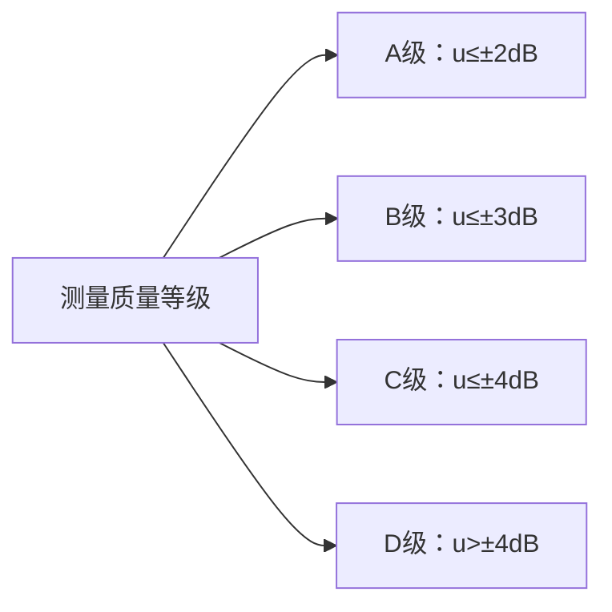
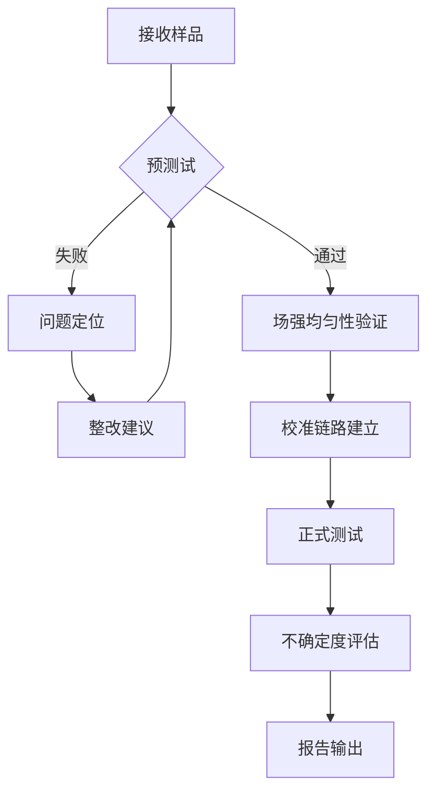

# GB/T 17626.39-2024 - 电磁兼容 试验和测量技术 第39部分：辐射射频电磁场抗扰度试验 测量不确定度

## 1. 标准概述

### 1.1 技术摘要

> 本标准规定了辐射射频电磁场抗扰度试验中测量不确定度的评定方法，涵盖80MHz至1000MHz频率范围内的场强测量、校准链路验证和不确定度分量分析，为EMC测试实验室提供量化的测量质量评估体系。

### 1.2 标准定位

- **技术领域**：EMS电磁抗扰度
- **应用层级**：测试方法标准
- **强制属性**：推荐性
- **实施状态**：现行有效

## 2. 物理原理与理论基础

### 2.1 电磁现象机理

> 辐射射频电磁场抗扰度测试基于远场平面波传播理论，测量不确定度主要源于场强分布不均匀性、设备校准误差和环境因素的影响。

$$
E(r,\theta,\phi) = \frac{\sqrt{60P_t G_t}}{r} \cdot F(\theta,\phi)
$$

场强测量的合成不确定度为：

$$
u_c^2 = \sum_{i=1}^{n} c_i^2 u_i^2 + 2\sum_{i=1}^{n-1}\sum_{j=i+1}^{n} c_i c_j u_i u_j r_{ij}
$$

### 2.2 数学模型

> 建立基于GUM(测量不确定度表述指南)的评定模型

测量结果的扩展不确定度：

$$
U = k \cdot u_c
$$

其中包覆因子k根据有效自由度确定。

### 2.3 关键参数定义

> **重要说明**：所有公式中出现的字母和符号必须在此表格中给出明确的定义和物理意义说明。

| 参数符号 | 参数名称 | 物理意义 | 单位 | 典型值 |
|---------|---------|---------|------|--------|
| E | 电场强度 | 测试位置的电场强度 | V/m | 1-30 |
| P_t | 发射功率 | 天线输入功率 | W | 1-1000 |
| G_t | 天线增益 | 发射天线增益 | dBi | 2-15 |
| r | 距离 | 天线到测试位置距离 | m | 3 |
| F(θ,φ) | 方向函数 | 天线辐射方向图 | - | 0.7-1.0 |
| u_c | 合成不确定度 | 所有不确定度分量的合成 | dB | ±3.5 |
| u_i | 标准不确定度 | 第i个不确定度分量 | dB | ±0.3-±3.0 |
| c_i | 灵敏度系数 | 输入量对输出量的偏导数 | - | 0.5-2.0 |
| k | 包覆因子 | 扩展不确定度系数 | - | 2.0 |
| r_ij | 相关系数 | 不确定度分量间的相关性 | - | 0-1 |

## 3. 技术要求详解

### 3.1 限值要求

> 测量不确定度的目标值和限值要求

| 频率范围 | 场强均匀性 | 天线系数不确定度 | 场强测量仪不确定度 | 合成不确定度(k=2) |
|---------|-----------|----------------|-------------------|------------------|
| 80-1000MHz | ±3dB | ±0.5dB | ±1.0dB | ≤±4dB |
| 80-200MHz | ±3dB | ±0.4dB | ±0.8dB | ≤±3.5dB |
| 200-1000MHz | ±3dB | ±0.6dB | ±1.2dB | ≤±4.5dB |

### 3.2 性能等级划分



### 3.3 适用范围界定

- **包含**：电波暗室和开阔场地的辐射抗扰度测试
- **不包含**：传导抗扰度测试、近场辐射测试
- **特殊考虑**：天线近场区和远场区的边界条件

## 4. 测试方法与程序

### 4.1 测试配置

```
[信号发生器] → [功率放大器] → [发射天线] ~~~电磁波~~~ [EUT] → [监测设备]
                                    ↑
                            [场强测量仪+监测天线]
```

### 4.2 测试步骤

1. **准备阶段**
   - 环境条件确认：温度、湿度、背景场
   - 设备校准检查：信号发生器、场强测量仪
   - EUT预处理：按制造商说明书设置

2. **场强均匀性验证**
   - 步骤1：在1m×1.5m矩形平面上设置16个测量点
   - 步骤2：逐点测量场强，记录数值和相位
   - 步骤3：计算场强变化范围，应≤±3dB

3. **校准链路建立**
   - 替代法校准：用场强测量仪替代EUT
   - 记录信号发生器设置与实际场强关系
   - 建立校准因子数据库

### 4.3 判定准则

> 测量不确定度合格判定：合成扩展不确定度(k=2)≤±4dB

## 5. 测试设备与环境

### 5.1 主要测试设备

| 设备名称 | 技术指标 | 校准要求 | 参考型号 |
|---------|---------|---------|---------|
| 信号发生器 | 80MHz-1GHz, ±0.5dB | 12个月 | R&S SMB100A |
| 功率放大器 | 100W, 1dB压缩点 | 12个月 | AR 100A250A |
| 场强测量仪 | 9kHz-3GHz, ±1dB | 12个月 | R&S ESW |
| 对数周期天线 | 80-1000MHz, VSWR<2 | 24个月 | Schwarzbeck VULP9118 |
| 单极子天线 | 80-1000MHz监测用 | 24个月 | Schwarzbeck MM4030 |

### 5.2 测试环境要求

- **电磁环境**：背景场强<-6dB相对于测试电平
- **物理环境**：温度15-35℃(±2℃), 湿度25-75%RH(±5%)
- **电源质量**：电压波动≤±2%, 总谐波失真<5%

## 6. 工程实施指南

### 6.1 典型问题与对策

| 常见问题 | 可能原因 | 建议对策 | 预期效果 |
|---------|---------|---------|---------|
| 场强均匀性超限 | 天线距离不足 | 增加天线距离至3m以上 | 均匀性改善至±2dB |
| 校准因子不稳定 | 温度漂移 | 增加温度补偿和稳定时间 | 稳定度提高至±0.2dB |
| 背景场干扰 | 外部辐射源 | 改善屏蔽室屏蔽效能 | 背景场降低10dB |
| 天线VSWR过大 | 阻抗失配 | 使用宽带匹配器 | VSWR<1.5 |

### 6.2 测试流程优化



### 6.3 成本控制建议

- **设备复用**：场强测量仪可用于发射和抗扰度测试
- **时间优化**：批量样品可共用校准链路
- **人员配置**：1名主测+1名操作员的标准配置

## 7. 标准差异与互认

### 7.1 国际标准对比

| 对比项 | GB/T 17626.39 | IEC 61000-4-3 | 差异说明 | 互认情况 |
|--------|---------------|---------------|----------|----------|
| 不确定度目标 | ±4dB(k=2) | ±4dB(k=2) | 完全一致 | 直接互认 |
| 场强均匀性 | ±3dB | ±3dB | 完全一致 | 直接互认 |
| 校准要求 | 引用JJF1059.1 | 引用GUM | 等效标准 | 直接互认 |
| 频率范围 | 80MHz-1GHz | 80MHz-1GHz | 完全一致 | 直接互认 |

### 7.2 认证互认指南

- **直接互认**：测量不确定度评估结果
- **条件互认**：需提供校准证书和溯源链
- **不可互认**：无特殊限制项目

## 8. 相关标准导航

### 8.1 上游标准

- [[GB_T_17626_1]] - 电磁兼容试验和测量技术 第1部分：总则
- [[JJF_1059_1]] - 测量不确定度评定与表示

### 8.2 平行标准

- [[GB_T_17626_3]] - 辐射射频电磁场抗扰度试验
- [[GB_T_17626_4]] - 电快速瞬变脉冲群抗扰度试验
- [[GB_T_6113_1]] - 无线电骚扰和抗扰度测量设备

### 8.3 下游标准

- [[GB_4343_1]] - 家用电器、电动工具和类似器具的电磁兼容要求
- [[GB_T_18655]] - 车辆、船和内装发动机的无线电骚扰特性

## 9. 附录

### 9.1 术语定义

**测量不确定度**：根据所用到的信息，表征赋予被测量值分散性的非负参数。

**场强均匀性**：在规定的测试区域内，电场强度的空间分布均匀程度。

**校准链路**：从信号源到测试场地的完整信号传输路径。

### 9.2 参考文献

> IEC 61000-4-3:2020, Electromagnetic compatibility (EMC) - Part 4-3: Testing and measurement techniques - Radiated, radio-frequency, electromagnetic field immunity test

> JJF 1059.1-2012, 测量不确定度评定与表示

### 9.3 修订记录

| 版本 | 日期 | 主要变化 | 影响评估 |
|------|------|----------|----------|
| 2024.1 | 2024-07-01 | 首次发布 | 填补国内测量不确定度标准空白 |

---