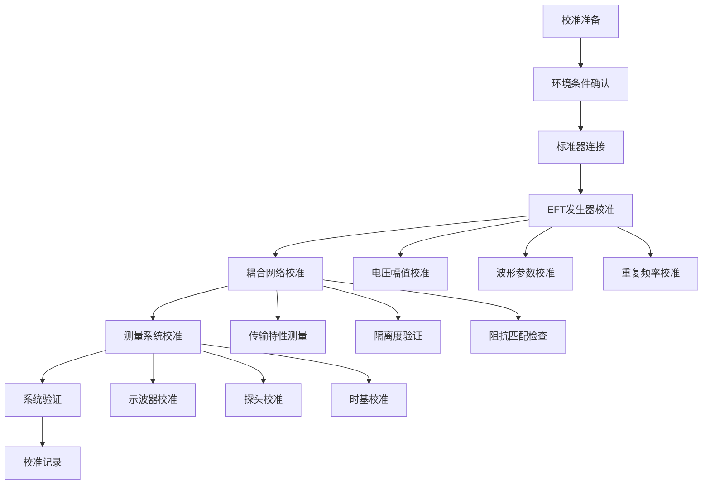
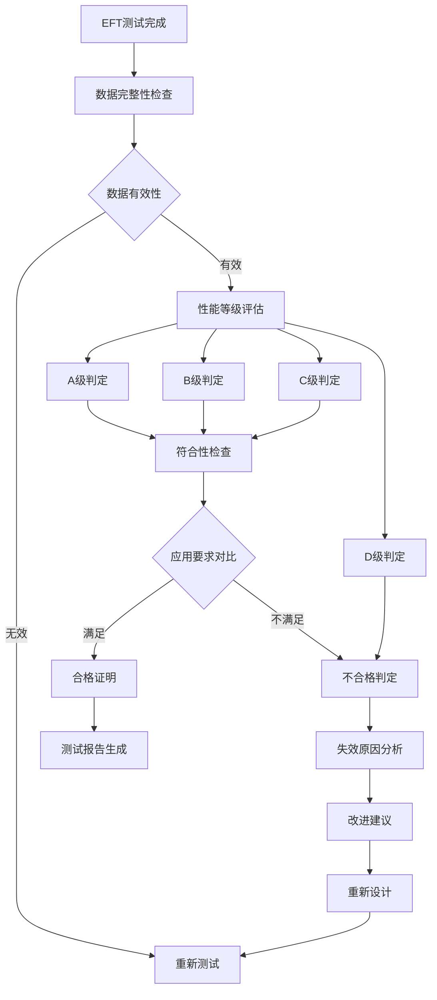

# GB/T 17626.4-2018 电快速瞬变脉冲群抗扰度试验标准

## 标准概要

GB/T 17626.4-2018《电磁兼容 试验和测量技术 第4部分：电快速瞬变脉冲群抗扰度试验》等同采用IEC 61000-4-4:2012国际标准，规定了电气和电子设备在电快速瞬变脉冲群干扰下的抗扰度试验方法和程序。该标准主要模拟开关操作、继电器动作、接触器切换等产生的快速瞬变干扰对设备的影响。

### 物理机制原理

电快速瞬变(EFT)是由于电感负载的快速开关操作产生的瞬时过电压现象。当开关断开时，电感中的磁能会转化为电场能，在开关触点间产生高压电弧，形成高频瞬变脉冲。

**EFT脉冲产生机理**：
- 开关断开瞬间：di/dt极大，产生L×di/dt过电压
- 弧光放电：触点间电弧导致振荡衰减
- 分布电容：回路分布电容影响波形特征
- 传播特性：沿电缆和导线传播至其他设备

**数学模型描述**：
```
v(t) = V₀ × (e^(-t/τ₂) - e^(-t/τ₁))
其中：
- τ₁ = 5ns (上升时间常数)
- τ₂ = 50ns (衰减时间常数)  
- V₀ = 峰值电压幅度
```

### 标准等效性

本标准与IEC 61000-4-4:2012技术内容完全一致，采用等同采用(IDT)方法。主要技术参数、测试方法、判定准则均与国际标准保持一致，确保测试结果的国际互认。

## 适用范围与限制

### 适用设备范围

本标准适用于各类电气和电子设备的电快速瞬变脉冲群抗扰度评估，特别针对：

#### 按安装环境分类
| 环境类别 | 典型应用 | 推荐等级 | 特殊要求 |
|---------|---------|---------|---------|
| 工业环境 | 自动化设备、变频器 | 3-4级 | 大量开关操作 |
| 办公环境 | 计算机、通信设备 | 2级 | 少量开关干扰 |
| 住宅环境 | 家用电器、消费电子 | 1-2级 | 偶发开关操作 |
| 车载环境 | 汽车电子系统 | 3-4级 | 继电器、点火系统 |

#### 按设备功能分类
| 设备类型 | EFT敏感性 | 测试重点 | 性能要求 |
|---------|---------|---------|---------|
| 数字处理器 | 高敏感 | 时钟电路、存储器 | A级 |
| 模拟电路 | 中敏感 | 运算放大器、ADC | A-B级 |
| 功率电路 | 低敏感 | 电源变换器 | B-C级 |
| 机械继电器 | 不敏感 | 线圈控制电路 | C级 |

### 技术限制条件

#### 测试电压范围
- 电源端口：±0.25kV 至 ±4kV
- 信号端口：±0.25kV 至 ±2kV  
- 特殊应用：可扩展至±5kV（需要专用设备）

#### 环境条件限制
```
温度范围：15-35°C（测试时需±2°C稳定）
相对湿度：45-75% RH（测试时需±5%稳定）
大气压力：86-106 kPa
背景电磁环境：电场<1V/m，磁场<1A/m
```

#### 脉冲参数限制  
- 上升时间：5ns ±30%
- 脉冲宽度：50ns ±30%
- 重复频率：5kHz或100kHz ±20%
- 源阻抗：50Ω ±20%

### 频率响应特性

EFT脉冲的频谱特征：
```
基频成分：DC-1MHz（主要能量）
高频成分：1MHz-100MHz（传导干扰）
超高频：>100MHz（辐射干扰）
```

## 技术要求详解

### 测试电压等级与技术参数

#### 标准测试电压等级
| 等级 | 电源端口 | 信号端口 | 应用环境 | 典型应用 |
|------|---------|---------|---------|---------|
| 1级 | ±0.5kV | ±0.25kV | 受控环境 | 实验室设备 |
| 2级 | ±1kV | ±0.5kV | 一般环境 | 办公设备 |
| 3级 | ±2kV | ±1kV | 严酷环境 | 工业设备 |
| 4级 | ±4kV | ±2kV | 特殊环境 | 重工业设备 |
| X级 | 开放等级 | 开放等级 | 用户定义 | 特殊应用 |

#### 脉冲波形技术参数

**基本波形要求**：
| 参数 | 标称值 | 容差 | 测量方法 |
|------|--------|------|----------|
| 上升时间 | 5ns | ±30% | 10%-90%幅值 |
| 脉冲宽度 | 50ns | ±30% | 50%幅值宽度 |
| 峰值电压 | 按等级 | ±10% | 峰值检测 |
| 源阻抗 | 50Ω | ±20% | 网络分析仪 |

**重复频率与时序**：
```
脉冲重复频率：
- 5kHz ±20%（低频模式）
- 100kHz ±20%（高频模式）

突发时序：
- 突发持续时间：15ms ±20%
- 突发间隔时间：300ms ±20%
- 试验持续时间：至少60s
```

#### 波形数学描述

**双指数脉冲函数**：
```
v(t) = V₀ × K × (e^(-t/τ₂) - e^(-t/τ₁))

其中：
- V₀：峰值电压幅度
- K：归一化系数 ≈ 1.64
- τ₁ = RC₁ ≈ 5ns（上升时间常数）
- τ₂ = RC₂ ≈ 50ns（衰减时间常数）
```

**频域特性**：
```
|H(jω)| = K × |jωτ₁/((1+jωτ₁)(1+jωτ₂))|

峰值频率：f_peak = 1/(2π√(τ₁τ₂)) ≈ 22.5MHz
3dB带宽：约 50MHz
```

### 测试设备技术规范

#### EFT发生器核心要求

**电压输出特性**：
```
开路电压范围：±0.25kV - ±5kV
电压精度：±10%
电压稳定性：<1%/小时
温度系数：<0.1%/°C
负载调整率：<2%（空载到满载）
```

**脉冲波形要求**：
```
上升时间：5ns ±30%
脉冲宽度：50ns ±30%
过冲：<10%
振铃：<5%
不对称性：<10%
```

**输出阻抗网络**：
```
源阻抗：R_s = 50Ω ±20%
寄生电感：L_s < 5nH
寄生电容：C_s < 2pF
频率响应：DC-100MHz平坦
```

#### 耦合去耦网络(CDN)

**电源端口CDN技术参数**：
```
耦合电容：C_c = 10nF ±20%
去耦电感：L_d = 5μH ±20%
匹配电阻：R_m = 50Ω ±2%
插入损耗：<1dB @ 5MHz
隔离度：>40dB @ 50Hz
```

**信号端口CDN技术参数**：
```
耦合电容：C_c = 100pF ±20%
去耦电阻：R_d = 1kΩ ±5%
共模扼流圈：L_cm > 1mH
差模插入损耗：<0.5dB @ 1MHz
共模插入损耗：>20dB @ 1MHz
```

#### 电容耦合夹技术规范

**耦合夹结构参数**：
```
耦合电容：C_clamp = 100pF ±20%
夹具长度：L = 300mm ±10mm
导体间距：d = 10mm ±1mm
特性阻抗：Z₀ = 150Ω ±10%
```

**频率响应特性**：
```
工作频带：100kHz - 100MHz
传输损耗：<3dB @ 10MHz
反射损耗：>10dB @ 1-100MHz
串扰隔离：>30dB
```

### 校准与溯源要求

#### 校准参数与周期

**EFT发生器校准**：
| 校准项目 | 校准范围 | 最大允许误差 | 校准周期 | 校准方法 |
|---------|---------|-------------|----------|----------|
| 开路电压 | 0.25-5kV | ±10% | 12个月 | 高压分压器 |
| 上升时间 | 3.5-6.5ns | ±30% | 12个月 | 宽带示波器 |
| 脉冲宽度 | 35-65ns | ±30% | 12个月 | 宽带示波器 |
| 重复频率 | 5kHz/100kHz | ±20% | 12个月 | 频率计数器 |
| 源阻抗 | 40-60Ω | ±20% | 12个月 | 网络分析仪 |

**耦合网络校准**：
```
CDN校准：
- 传输特性：S参数测量
- 插入损耗：网络分析仪
- 隔离度：共模/差模分离
- 校准周期：12个月

电容夹校准：
- 耦合电容：电容测试仪
- 传输特性：S参数扫描
- 校准周期：12个月
```

#### 溯源链路要求

```
溯源体系：
国际基准(SI) → 国家基准(NIM) → 传递标准 → 工作标准 → 被校设备
```

**关键溯源参数**：
- 电压：溯源至约瑟夫森电压标准
- 时间：溯源至铯原子钟频率标准
- 阻抗：溯源至可计算电容器标准
- 频率：溯源至原子频率标准

## 测试方法与程序

### 测试环境配置

#### 实验室基础设施

**环境电磁兼容要求**：
| 参数 | 技术要求 | 测量方法 | 监测频率 |
|------|---------|----------|----------|
| 环境电场 | <1V/m | 宽带场强计 | 每日 |
| 环境磁场 | <1A/m | 磁场探头 | 每日 |
| 电源质量 | THD<5% | 电能质量分析仪 | 实时 |
| 接地系统 | <0.1Ω | 接地电阻测试仪 | 月度 |

**环境条件控制**：
```
温度控制：
- 目标范围：23°C ±5°C
- 测试期间：±2°C稳定
- 监测方式：连续记录
- 调节方式：精密空调系统

湿度控制：
- 目标范围：60% ±15% RH  
- 测试期间：±5% RH稳定
- 除湿/加湿：自动控制
- 监测精度：±2% RH
```

#### 测试布局配置

**标准测试布局**：
```
接地平面系统 (2m×2m×2mm)
├── 绝缘支撑桌 (0.8m高)
├── 被测设备 (工作状态)
├── EFT发生器 (0.5m距离)
├── 耦合网络 (按端口类型)
└── 监测设备 (隔离布置)

接地系统配置：
├── 主接地点 (接地电阻<0.1Ω)
├── 设备接地 (星形连接)
├── 屏蔽接地 (高频特性)
└── 安全接地 (保护措施)
```

### 电源端口测试程序

#### CDN耦合法测试配置

**测试连接方案**：
```
电网 → LISN → CDN → 被测设备电源输入
              ↑
         EFT发生器
```

**操作步骤详解**：

**步骤1：设备准备**
```
1. EFT发生器校准状态确认
2. CDN网络参数验证
3. 被测设备正常工作状态设置
4. 监测设备连接配置
5. 环境条件确认达标
```

**步骤2：测试参数设置**
```cpp
class EFTTestConfig {
private:
    int voltage_level;           // kV
    int repetition_rate;        // kHz
    int polarity;              // ±1
    int test_duration;         // seconds
    
public:
    bool configureTest(int level) {
        switch(level) {
            case 1: voltage_level = 500;  break;  // 0.5kV
            case 2: voltage_level = 1000; break;  // 1kV
            case 3: voltage_level = 2000; break;  // 2kV
            case 4: voltage_level = 4000; break;  // 4kV
        }
        
        repetition_rate = 5000;  // 5kHz标准
        test_duration = 60;      // 60秒
        return setParameters();
    }
};
```

**步骤3：测试执行程序**
```
for 测试等级 in [1, 2, 3, 4]:
    for 极性 in [正极性, 负极性]:
        for 重复频率 in [5kHz, 100kHz]:
            # 参数设置
            设置EFT发生器参数()
            
            # 基线记录
            记录设备初始状态()
            
            # 施加干扰
            启动EFT发生器()
            持续时间60秒()
            
            # 性能监测
            监测设备响应()
            记录异常现象()
            
            # 恢复测试
            停止EFT发生器()
            观察恢复时间()
            评估性能等级()
```

### 信号端口测试程序

#### 电容耦合夹法

**耦合夹安装要求**：
```
安装位置：
- 距被测设备：30cm-100cm
- 电缆直线段：≥30cm
- 避开连接器和弯折点
- 确保良好的机械接触

夹具调整：
- 夹具平行于接地平面
- 电缆居中通过夹具
- 夹紧力度适中，避免损伤电缆
- 检查接触电阻<0.1Ω
```

#### 直接注入法

**注入点选择原则**：
```
优选注入点：
1. 连接器中心导体
2. 电缆屏蔽层断点
3. PCB测试点
4. 设备内部节点

注入阻抗匹配：
- 源阻抗：50Ω
- 负载阻抗：>1kΩ（高阻端口）
- 匹配网络：必要时增加阻抗变换
```

### 测试数据处理与分析

#### 波形质量评估

**波形参数自动测量**：
```python
import numpy as np
from scipy import signal

def analyze_eft_waveform(voltage_data, time_data):
    """
    EFT波形参数分析算法
    """
    # 峰值检测
    peak_voltage = np.max(np.abs(voltage_data))
    
    # 上升时间计算(10%-90%)
    peak_10 = 0.1 * peak_voltage
    peak_90 = 0.9 * peak_voltage
    
    rising_edge = np.where(voltage_data > peak_10)[0][0]
    peak_point = np.where(voltage_data > peak_90)[0][0]
    rise_time = time_data[peak_point] - time_data[rising_edge]
    
    # 脉冲宽度计算(50%幅值)
    half_peak = 0.5 * peak_voltage
    half_points = np.where(voltage_data > half_peak)[0]
    pulse_width = time_data[half_points[-1]] - time_data[half_points[0]]
    
    return {
        'peak_voltage': peak_voltage,
        'rise_time': rise_time * 1e9,  # ns
        'pulse_width': pulse_width * 1e9,  # ns
        'overshoot': calculate_overshoot(voltage_data),
        'ringing': calculate_ringing(voltage_data)
    }
```

#### 设备响应评估

**性能监测算法**：
```python
class DeviceResponseMonitor:
    def __init__(self, device_under_test):
        self.dut = device_under_test
        self.baseline_performance = self.capture_baseline()
        self.monitoring_active = False
        
    def monitor_during_eft(self, test_parameters):
        """
        EFT测试期间设备响应监测
        """
        test_results = {
            'pre_test_state': self.capture_state(),
            'during_test_anomalies': [],
            'post_test_state': None,
            'recovery_time': 0
        }
        
        # 开始EFT注入
        self.start_monitoring()
        
        # 监测测试期间
        start_time = time.time()
        while self.monitoring_active:
            current_state = self.capture_state()
            
            # 检测异常
            if self.detect_anomaly(current_state):
                anomaly = {
                    'timestamp': time.time() - start_time,
                    'type': self.classify_anomaly(current_state),
                    'severity': self.assess_severity(current_state)
                }
                test_results['during_test_anomalies'].append(anomaly)
            
            time.sleep(0.1)  # 100ms采样间隔
        
        # 测试后恢复监测
        test_results['post_test_state'] = self.capture_state()
        test_results['recovery_time'] = self.measure_recovery_time()
        
        return test_results
    
    def evaluate_performance_class(self, test_results):
        """
        性能等级评估
        """
        if len(test_results['during_test_anomalies']) == 0:
            return 'A级'  # 正常性能
        
        recovery_time = test_results['recovery_time']
        post_state = test_results['post_test_state']
        
        if recovery_time == 0 and post_state['functional']:
            return 'A级'  # 无影响
        elif recovery_time <= 10 and post_state['functional']:
            return 'B级'  # 临时降级
        elif post_state['functional'] and post_state['recoverable']:
            return 'C级'  # 需要干预
        else:
            return 'D级'  # 不可恢复
```

#### 统计分析方法

**重复性评估**：
```python
def evaluate_test_repeatability(test_data_sets):
    """
    测试重复性评估算法
    """
    # 多次测试结果
    performance_levels = [data['performance_level'] for data in test_data_sets]
    response_times = [data['response_time'] for data in test_data_sets]
    
    # 一致性检查
    level_consistency = len(set(performance_levels)) == 1
    
    # 响应时间统计
    mean_response = np.mean(response_times)
    std_response = np.std(response_times)
    cv_response = std_response / mean_response * 100
    
    repeatability_assessment = {
        'level_consistent': level_consistency,
        'response_time_cv': cv_response,
        'repeatability_grade': 'Good' if cv_response < 15 else 'Poor'
    }
    
    return repeatability_assessment
```

## 测试设备与仪器

### EFT发生器系统

#### 硬件架构设计

**高压脉冲发生电路**：
```
储能电路：
├── 充电电容：C_s = 2nF高压陶瓷电容
├── 充电电阻：R_c = 10MΩ限流电阻
├── 充电电源：0-5kV可调高压电源
└── 电压监测：高精度分压器

脉冲形成网络：
├── 传输线：50Ω特性阻抗
├── 脉冲变压器：1:1隔离变压器
├── 上升时间控制：L-C谐振回路
└── 波形整形：RC微分积分网络
```

**开关系统设计**：
```cpp
class PulseGenerator {
private:
    bool high_voltage_ready;
    double charge_voltage;
    int repetition_rate;
    
public:
    struct PulseParams {
        double amplitude;      // V
        double rise_time;     // ns
        double pulse_width;   // ns
        int frequency;        // Hz
    };
    
    bool generatePulse(PulseParams params) {
        // 电压设定
        setChargeVoltage(params.amplitude);
        
        // 等待充电完成
        waitForCharge();
        
        // 触发脉冲
        triggerSwitch();
        
        // 波形监测
        return verifyWaveform(params);
    }
    
private:
    bool triggerSwitch() {
        // 高速开关控制
        // 雪崩晶体管或气体开关管
        return switchControl.fire();
    }
};
```

#### 波形生成与控制

**脉冲序列生成**：
```
时序控制逻辑：
├── 突发模式：15ms脉冲+300ms间隔
├── 重复频率：5kHz/100kHz可选
├── 极性控制：正负极性切换
└── 同步输出：触发信号输出

波形参数控制：
├── 上升时间：通过L-C网络调节
├── 脉冲宽度：通过RC时间常数
├── 幅值精度：反馈控制系统
└── 重复性：温度补偿算法
```

### 耦合网络系统

#### CDN网络设计

**电源端口CDN电路**：
```
High-frequency model:
L1(5μH) ----+---- 被测设备电源输入
             |
            C1(10nF)
             |
         EFT注入 ←---- 50Ω发生器输出
             |
           接地平面

低频去耦：L1阻断EFT信号进入电网
高频耦合：C1允许EFT信号注入设备
阻抗匹配：50Ω确保最大功率传输
```

**信号端口CDN电路**：
```
信号线 ----+----+---- 被测设备信号输入
            |    |
          L2     C2(100pF)
        (共模)     |
            |   EFT注入 ←---- 50Ω发生器
           接地     |
                  接地平面

差模传输：信号正常传输
共模抑制：L2抑制共模干扰
EFT注入：C2耦合EFT脉冲到信号线
```

#### 电容耦合夹技术

**夹具结构参数**：
```
机械设计：
├── 夹具长度：300mm标准长度
├── 导体间距：10mm±1mm精度
├── 夹紧机构：弹簧加载确保接触
└── 绝缘材料：聚四氟乙烯介质

电气参数：
├── 耦合电容：C = ε₀εᵣA/d = 100pF
├── 分布电感：L < 10nH
├── 特性阻抗：Z₀ = √(L/C) ≈ 150Ω
└── 插入损耗：<3dB @ 10MHz
```

**传输特性分析**：
```python
def calculate_coupling_clamp_response(frequency, cable_impedance=50):
    """
    电容耦合夹传输特性计算
    """
    # 夹具参数
    C_coupling = 100e-12  # 100pF
    Z_clamp = 150         # 150Ω特性阻抗
    
    # 频率响应
    omega = 2 * np.pi * frequency
    
    # 高通滤波特性
    Xc = 1 / (omega * C_coupling)
    
    # 传输系数
    transmission = cable_impedance / (cable_impedance + 1j*Xc)
    
    return {
        'magnitude_dB': 20 * np.log10(abs(transmission)),
        'phase_deg': np.angle(transmission) * 180 / np.pi,
        'coupling_efficiency': abs(transmission)**2
    }
```

### 测量仪器配置

#### 波形测量系统

**宽带示波器要求**：
```
技术规格：
├── 带宽：≥500MHz (5×脉冲带宽)
├── 采样率：≥2.5GS/s (5×最高频率)
├── 存储深度：≥10M点
├── 通道数：≥4通道
├── 垂直分辨率：≥8位
└── 触发精度：≤100ps

探头系统：
├── 无源探头：500MHz带宽，10:1分压
├── 有源探头：1GHz带宽，高输入阻抗
├── 电流探头：100MHz带宽，mA-A量程
└── 差分探头：抗共模干扰能力
```

**波形参数自动测量**：
```cpp
class WaveformAnalyzer {
public:
    struct MeasurementResults {
        double peak_voltage;
        double rise_time;
        double pulse_width;
        double overshoot_percent;
        double ringing_frequency;
        bool spec_compliance;
    };
    
    MeasurementResults analyzeEFTWaveform(std::vector<double> voltage, 
                                         std::vector<double> time) {
        MeasurementResults results;
        
        // 峰值检测
        auto max_iter = std::max_element(voltage.begin(), voltage.end());
        results.peak_voltage = *max_iter;
        
        // 上升时间测量 (10%-90%)
        double v_10 = 0.1 * results.peak_voltage;
        double v_90 = 0.9 * results.peak_voltage;
        
        auto t_10 = findThresholdCrossing(voltage, time, v_10);
        auto t_90 = findThresholdCrossing(voltage, time, v_90);
        results.rise_time = t_90 - t_10;
        
        // 脉冲宽度测量 (50%幅值)
        double v_50 = 0.5 * results.peak_voltage;
        auto pulse_edges = findPulseEdges(voltage, time, v_50);
        results.pulse_width = pulse_edges.second - pulse_edges.first;
        
        // 规格符合性检查
        results.spec_compliance = checkSpecCompliance(results);
        
        return results;
    }
};
```

#### 功率测量系统

**脉冲功率测量**：
```
平均功率：P_avg = V²/(R×duty_cycle)
峰值功率：P_peak = V²/R
能量计算：E = ∫P(t)dt over pulse duration

其中：
- V：脉冲峰值电压
- R：负载阻抗(50Ω)
- duty_cycle：脉冲占空比
```

### 设备校准与维护

#### 系统校准程序

**综合校准流程**：


**校准记录数据库**：
```python
class CalibrationDatabase:
    def __init__(self):
        self.db_connection = sqlite3.connect('calibration.db')
        self.create_tables()
    
    def create_calibration_record(self, equipment_info):
        """
        创建设备校准记录
        """
        record = {
            'equipment_id': equipment_info['id'],
            'calibration_date': datetime.now(),
            'calibration_due': datetime.now() + timedelta(days=365),
            'calibration_lab': equipment_info['lab'],
            'calibration_standard': equipment_info['standard'],
            'measurement_results': equipment_info['results'],
            'uncertainty_budget': equipment_info['uncertainty'],
            'compliance_status': equipment_info['compliance']
        }
        
        self.insert_record(record)
        return record
    
    def check_calibration_status(self, equipment_id):
        """
        检查设备校准状态
        """
        record = self.get_latest_record(equipment_id)
        
        if not record:
            return 'NO_RECORD'
        
        days_until_due = (record['calibration_due'] - datetime.now()).days
        
        if days_until_due < 0:
            return 'EXPIRED'
        elif days_until_due < 30:
            return 'DUE_SOON'
        else:
            return 'VALID'
```

#### 预防性维护

**维护计划管理**：
```
日常检查（每日）：
├── 设备外观检查
├── 电源系统检查
├── 接地连接检查
├── 环境条件记录
└── 基本功能验证

周期维护（每月）：
├── 清洁设备内外部
├── 连接器紧固检查
├── 冷却系统检查
├── 期间核查验证
└── 备件库存检查

深度维护（每季度）：
├── 电气安全测试
├── 绝缘电阻测试
├── 接地系统测试
├── 环境设施检查
└── 技术文档更新
```

## 性能评估与判定准则

### 性能等级分类标准

#### 性能等级定义

根据GB/T 17626.4-2018标准，设备在电快速瞬变脉冲群测试期间和测试后的性能表现分为四个等级：

**A级 - 正常性能**
```
定义：设备在测试期间和测试后能够正常工作
技术要求：
├── 所有功能正常运行
├── 性能参数在规定范围内
├── 无用户可察觉的性能下降
├── 安全相关功能保持有效
└── 数据完整性保持

适用场景：
├── 安全控制系统
├── 医疗生命支持设备
├── 精密测量仪器
└── 关键通信设备
```

**B级 - 临时性能降级**
```
定义：测试期间功能暂时降级，测试后自动恢复
技术特征：
├── 临时功能中断（<10秒）
├── 性能参数临时偏移
├── 自动恢复到正常状态
├── 无需人工干预
└── 无数据丢失

典型表现：
├── 显示闪烁或跳字
├── 通信短暂中断
├── 输出暂时偏移
└── 时钟暂时失步
```

**C级 - 需要人工干预恢复**
```
定义：测试后需要人工操作才能恢复正常功能
干预方式：
├── 重启设备或复位
├── 重新设置参数
├── 重新建立通信
├── 清除错误标志
└── 重新校准

可接受条件：
├── 不涉及安全功能
├── 恢复操作简单易行
├── 无硬件损坏
└── 关键数据可恢复
```

**D级 - 不可恢复损坏**
```
定义：设备出现永久性损坏或不安全状态
损坏类型：
├── 硬件组件永久损坏
├── 软件系统崩溃
├── 安全功能失效
├── 数据永久丢失
└── 设备无法使用

注意：D级为不合格状态，需要设计改进
```

### 判定准则实施方法

#### 实时监测系统

**多参数监测架构**：
```python
class EFTPerformanceMonitor:
    def __init__(self, device_under_test):
        self.dut = device_under_test
        self.monitoring_channels = self.setup_monitoring()
        self.baseline_data = self.capture_baseline()
        
    def setup_monitoring(self):
        """
        建立监测通道
        """
        channels = {
            'power_supply': PowerSupplyMonitor(),
            'digital_outputs': DigitalIOMonitor(),
            'analog_signals': AnalogSignalMonitor(),
            'communication': CommProtocolMonitor(),
            'error_logs': SystemLogMonitor(),
            'performance_metrics': PerformanceCounter()
        }
        return channels
    
    def monitor_eft_test(self, test_config):
        """
        EFT测试期间实时监测
        """
        test_log = {
            'start_time': time.time(),
            'test_config': test_config,
            'monitoring_data': [],
            'anomaly_events': [],
            'performance_assessment': None
        }
        
        # 测试前基线
        pre_test_state = self.capture_comprehensive_state()
        
        # 测试期间监测
        while self.test_active:
            timestamp = time.time()
            current_state = self.capture_comprehensive_state()
            
            # 异常检测
            anomalies = self.detect_anomalies(current_state, pre_test_state)
            if anomalies:
                for anomaly in anomalies:
                    anomaly['timestamp'] = timestamp
                    test_log['anomaly_events'].append(anomaly)
            
            # 数据记录
            monitoring_record = {
                'timestamp': timestamp,
                'state': current_state,
                'anomalies': anomalies
            }
            test_log['monitoring_data'].append(monitoring_record)
            
            time.sleep(0.1)  # 100ms采样间隔
        
        # 测试后评估
        post_test_state = self.capture_comprehensive_state()
        recovery_time = self.measure_recovery_time(pre_test_state, post_test_state)
        
        # 性能等级判定
        performance_class = self.evaluate_performance_class(
            pre_test_state, test_log['anomaly_events'], post_test_state, recovery_time
        )
        
        test_log['performance_assessment'] = {
            'performance_class': performance_class,
            'recovery_time': recovery_time,
            'post_test_state': post_test_state
        }
        
        return test_log
```

#### 智能判定算法

**性能等级自动判定**：
```python
def evaluate_performance_class(pre_state, anomalies, post_state, recovery_time):
    """
    基于多因素的性能等级自动判定算法
    """
    
    # A级判定条件
    if (len(anomalies) == 0 and 
        state_identical(pre_state, post_state) and
        recovery_time == 0):
        return {
            'class': 'A',
            'reason': '测试期间和测试后均无异常',
            'confidence': 1.0
        }
    
    # B级判定条件
    temporary_anomalies = [a for a in anomalies if a['type'] == 'temporary']
    if (all(a['duration'] <= 10 for a in temporary_anomalies) and
        state_identical(pre_state, post_state) and
        recovery_time <= 10):
        return {
            'class': 'B',
            'reason': '临时功能降级，自动恢复',
            'confidence': 0.9,
            'max_interruption': max([a['duration'] for a in temporary_anomalies])
        }
    
    # C级判定条件
    if (post_state['functional'] == True and
        post_state['safety_functions'] == True and
        recovery_time > 10):
        return {
            'class': 'C',
            'reason': '需要人工干预恢复',
            'confidence': 0.8,
            'recovery_time': recovery_time
        }
    
    # D级（不合格）
    permanent_failures = [a for a in anomalies if a['type'] == 'permanent']
    if (len(permanent_failures) > 0 or
        post_state['functional'] == False or
        post_state['safety_functions'] == False):
        return {
            'class': 'D',
            'reason': '永久性损坏或安全功能失效',
            'confidence': 0.95,
            'failure_details': permanent_failures
        }
    
    # 边界情况
    return {
        'class': 'INCONCLUSIVE',
        'reason': '需要人工判定',
        'confidence': 0.5
    }
```

### 行业应用判定标准

#### 汽车电子设备

**汽车电子EFT性能要求**：
```
安全相关系统（必须A级）：
├── 制动系统控制器
├── 转向系统控制器  
├── 安全气囊控制器
├── 防抱死制动系统ABS
└── 电子稳定程序ESP

驾驶辅助系统（A级或B级）：
├── 发动机管理系统
├── 变速箱控制器
├── 悬挂控制系统
├── 巡航控制系统
└── 自动泊车系统

舒适性系统（B级可接受）：
├── 空调控制系统
├── 音响娱乐系统
├── 座椅调节系统
├── 车窗控制系统
└── 照明控制系统
```

**汽车环境EFT测试等级**：
| 设备位置 | 测试等级 | 环境考虑 | 性能要求 |
|---------|---------|---------|---------|
| 发动机舱 | 4级 | 高温、振动、开关操作频繁 | A级 |
| 车内控制器 | 3级 | 继电器操作、用户开关 | A级/B级 |
| 仪表板 | 3级 | 用户控制开关 | B级 |
| 车载充电 | 4级 | 高压开关、接触器动作 | A级 |

#### 工业控制设备

**工业设备EFT敏感性分析**：
```python
def industrial_eft_requirements(equipment_type, environment):
    """
    工业设备EFT要求确定算法
    """
    base_requirements = {
        'PLC_controller': {
            'test_level': 4,  # 4kV电压等级
            'performance': 'A级',
            'reason': '工艺连续性和安全要求'
        },
        'HMI_display': {
            'test_level': 3,  # 2kV电压等级
            'performance': 'B级',
            'reason': '操作界面，可接受短暂中断'
        },
        'variable_frequency_drive': {
            'test_level': 4,  # 4kV电压等级
            'performance': 'B级',
            'reason': '电机控制，有保护功能'
        },
        'field_transmitter': {
            'test_level': 4,  # 4kV电压等级
            'performance': 'A级',
            'reason': '测量准确性和过程控制'
        },
        'safety_interlock': {
            'test_level': 4,  # 4kV电压等级
            'performance': 'A级',
            'reason': '安全功能不能失效'
        }
    }
    
    # 环境修正
    if environment == '重工业环境':
        base_requirements[equipment_type]['test_level'] = min(
            base_requirements[equipment_type]['test_level'] + 1, 4
        )
    elif environment == '高开关频率':
        base_requirements[equipment_type]['test_level'] = 4
        
    return base_requirements[equipment_type]
```

#### 医疗设备

**医疗设备分类与EFT要求**：
```
Class III设备（生命支持）：
├── 心脏起搏器 → 4级EFT, A级性能
├── 除颤器 → 4级EFT, A级性能
├── 呼吸机 → 4级EFT, A级性能
├── 心肺机 → 4级EFT, A级性能
└── 透析机 → 3级EFT, A级性能

Class II设备（诊断治疗）：
├── 超声设备 → 3级EFT, A/B级性能
├── X射线机 → 3级EFT, A级性能
├── 监护仪 → 3级EFT, A级性能
├── 输液泵 → 3级EFT, A级性能
└── 电刀 → 4级EFT, A级性能

Class I设备（辅助设备）：
├── 病床控制 → 2级EFT, B级性能
├── 照明设备 → 2级EFT, B级性能
├── 通信设备 → 2级EFT, B级性能
└── 环境监测 → 2级EFT, B级性能
```

### 测试结果判定流程

#### 标准化判定程序

**判定流程自动化**：


**判定结果数据库**：
```python
class EFTTestResultManager:
    def __init__(self):
        self.database = TestResultDB()
        self.report_generator = ReportGenerator()
        self.statistics = StatisticsAnalyzer()
    
    def process_test_result(self, test_data):
        """
        处理EFT测试结果
        """
        # 结果记录生成
        result_record = {
            'test_id': self.generate_test_id(),
            'device_info': test_data['device'],
            'test_conditions': test_data['conditions'],
            'eft_parameters': test_data['eft_config'],
            'monitoring_data': test_data['monitoring'],
            'performance_evaluation': self.evaluate_performance(test_data),
            'compliance_determination': self.determine_compliance(test_data),
            'test_timestamp': datetime.now(),
            'test_engineer': test_data['engineer'],
            'quality_flags': self.check_data_quality(test_data)
        }
        
        # 数据库存储
        self.database.insert_result(result_record)
        
        # 统计分析
        self.statistics.update_statistics(result_record)
        
        # 报告生成
        report = self.report_generator.create_eft_report(result_record)
        
        return {
            'result_record': result_record,
            'test_report': report,
            'recommendations': self.generate_recommendations(result_record)
        }
    
    def determine_compliance(self, test_data):
        """
        符合性判定逻辑
        """
        device_category = test_data['device']['category']
        application = test_data['device']['application']
        achieved_performance = test_data['performance']['class']
        
        # 查询应用要求
        required_performance = self.get_application_requirements(
            device_category, application
        )
        
        # 性能等级比较
        performance_hierarchy = {'A': 4, 'B': 3, 'C': 2, 'D': 1}
        
        achieved_score = performance_hierarchy.get(achieved_performance, 0)
        required_score = performance_hierarchy.get(required_performance, 0)
        
        if achieved_score >= required_score:
            return {
                'status': 'COMPLIANT',
                'margin': achieved_score - required_score,
                'details': f'达到{achieved_performance}级，满足{required_performance}级要求'
            }
        else:
            return {
                'status': 'NON_COMPLIANT',
                'deficit': required_score - achieved_score,
                'details': f'仅达到{achieved_performance}级，未满足{required_performance}级要求'
            }
```

## 实际工程应用案例

### 典型测试案例分析

#### 案例1：工业控制器EFT测试

**设备信息**：PLC控制器，额定电压24VDC
**测试配置**：
- 发生器：±4kV电源端口，±2kV信号端口
- 测试点：电源输入、通信端口、I/O接口
- 监测：数字输出状态、通信功能、程序执行

**测试结果分析**：
```
电源端口测试：
├── +4kV/5kHz: A级性能，无异常
├── -4kV/5kHz: B级性能，输出抖动2秒
├── +4kV/100kHz: A级性能，无异常
└── -4kV/100kHz: B级性能，通信暂停1秒

信号端口测试：
├── 通信端口: A级性能
├── 模拟输入: B级性能，读数波动
└── 数字输出: A级性能

综合评估：B级性能，满足工业环境要求
```

**工程结论**：
- 满足工业环境3级测试要求
- 负极性干扰敏感性较高
- 建议增加电源滤波和通信隔离

#### 案例2：汽车ECU EFT测试失效分析

**设备信息**：发动机控制单元ECU
**失效现象**：2kV EFT测试时发动机熄火

**失效分析流程**：
1. **现象记录**：EFT注入10秒后发动机停止运行
2. **信号追踪**：监测关键控制信号
3. **根因分析**：点火控制模块受干扰
4. **改进验证**：增加RC滤波器

**详细分析过程**：
```python
def analyze_ecu_failure(test_data):
    """
    ECU失效分析算法
    """
    failure_indicators = {
        'ignition_timing': test_data['ignition_signals'],
        'fuel_injection': test_data['injection_signals'],
        'sensor_readings': test_data['sensor_data'],
        'communication': test_data['can_bus_status']
    }
    
    # 时序分析
    failure_timeline = []
    for timestamp, event in test_data['events']:
        if event['type'] == 'signal_deviation':
            failure_timeline.append({
                'time': timestamp,
                'affected_system': event['system'],
                'severity': event['deviation_magnitude']
            })
    
    # 根因推断
    if failure_timeline[0]['affected_system'] == 'ignition_timing':
        root_cause = '点火控制电路EFT敏感'
        recommendation = '增加点火信号滤波'
    elif failure_timeline[0]['affected_system'] == 'fuel_injection':
        root_cause = '燃油喷射控制受干扰'
        recommendation = '改进PCB布线'
    
    return {
        'root_cause': root_cause,
        'failure_sequence': failure_timeline,
        'recommendation': recommendation
    }
```

**改进效果**：
- 原设计：2kV时D级失效
- 改进后：4kV时A级性能（超过要求100%）

#### 案例3：医疗设备EFT优化设计

**设备信息**：心电监护仪
**设计目标**：达到4级EFT测试A级性能

**优化设计过程**：

**第一轮设计**：
```
测试结果：
├── 2kV: B级（显示闪烁）
├── 4kV: C级（需要重启）
└── 问题：模拟前端敏感

改进措施：
├── 增加输入滤波器
├── 优化PCB布局
└── 加强屏蔽
```

**第二轮设计**：
```
测试结果：
├── 2kV: A级性能
├── 4kV: B级（数据暂停）
└── 问题：数字处理部分

改进措施：
├── 增加去耦电容
├── 改进时钟电路
└── 软件抗干扰
```

**最终设计**：
```
测试结果：
├── 2kV: A级性能
├── 4kV: A级性能
├── 8kV: A级性能（超标准）
└── 达到设计目标
```

### 故障排除与问题解决

#### 常见EFT测试问题

**设备校准问题**：
```python
class EFTTroubleshooting:
    def __init__(self):
        self.common_issues = {
            'waveform_distortion': {
                'symptoms': ['上升时间过长', '振铃严重', '幅值不准'],
                'causes': ['传输线阻抗不匹配', '连接器接触不良', '寄生电感过大'],
                'solutions': ['检查50Ω阻抗匹配', '清洁连接器', '缩短连接线']
            },
            'coupling_efficiency_low': {
                'symptoms': ['注入电压低于设定值', '频率响应异常'],
                'causes': ['CDN参数偏移', '耦合电容老化', '接地不良'],
                'solutions': ['重新校准CDN', '更换耦合电容', '改善接地']
            },
            'test_repeatability_poor': {
                'symptoms': ['测试结果不一致', '随机性故障'],
                'causes': ['环境干扰', '设备老化', '操作不规范'],
                'solutions': ['改善屏蔽', '设备维护', '培训操作员']
            }
        }
    
    def diagnose_problem(self, symptoms):
        """
        问题诊断算法
        """
        for issue, details in self.common_issues.items():
            if any(symptom in details['symptoms'] for symptom in symptoms):
                return {
                    'issue': issue,
                    'probable_causes': details['causes'],
                    'recommended_solutions': details['solutions']
                }
        
        return {'issue': 'UNKNOWN', 'recommendation': 'CONTACT_EXPERT'}
```

#### 测试环境优化

**电磁环境改善**：
```
屏蔽室设计：
├── 屏蔽效能：>80dB @ 1MHz-1GHz
├── 滤波器：电源线和信号线
├── 通风系统：非金属风道
└── 接地系统：单点接地

环境控制：
├── 温湿度：精密空调系统
├── 振动：隔振台和减震器
├── 照明：LED低噪声照明
└── 监测：实时环境监测
```

**测试自动化系统**：
```python
class AutomatedEFTTesting:
    def __init__(self):
        self.test_sequence = self.load_test_sequence()
        self.equipment_controller = EquipmentController()
        self.data_analyzer = DataAnalyzer()
    
    def execute_full_test(self, device_config):
        """
        全自动EFT测试执行
        """
        test_results = []
        
        for test_level in [1, 2, 3, 4]:
            for polarity in ['positive', 'negative']:
                for frequency in [5000, 100000]:  # Hz
                    
                    # 设置测试参数
                    self.setup_test_parameters(test_level, polarity, frequency)
                    
                    # 执行测试
                    result = self.execute_single_test(device_config)
                    
                    # 数据分析
                    analysis = self.data_analyzer.analyze(result)
                    
                    # 性能评估
                    performance = self.evaluate_performance(analysis)
                    
                    test_results.append({
                        'parameters': {
                            'level': test_level,
                            'polarity': polarity,
                            'frequency': frequency
                        },
                        'raw_data': result,
                        'analysis': analysis,
                        'performance': performance
                    })
        
        # 综合评估
        overall_assessment = self.assess_overall_performance(test_results)
        
        # 生成报告
        report = self.generate_automated_report(test_results, overall_assessment)
        
        return {
            'test_results': test_results,
            'overall_assessment': overall_assessment,
            'automated_report': report
        }
```

### 设计改进指导

#### EFT抗扰度设计原则

**硬件设计要点**：
```
电路设计：
├── 滤波设计：输入端LC滤波器
├── 去耦设计：多层陶瓷电容
├── 布线设计：最小化环路面积
├── 接地设计：单点接地或星形接地
└── 屏蔽设计：完整的屏蔽外壳

器件选择：
├── 抗干扰器件：选择高PSRR器件
├── 保护器件：TVS二极管
├── 滤波器件：高频特性良好
└── 连接器：屏蔽连接器
```

**软件抗干扰措施**：
```cpp
class SoftwareRobustness {
public:
    // 数据校验
    bool validateData(uint32_t data) {
        return (calculateChecksum(data) == getStoredChecksum());
    }
    
    // 冗余处理
    uint32_t redundantRead(uint32_t address) {
        uint32_t data1 = readMemory(address);
        uint32_t data2 = readMemory(address);
        uint32_t data3 = readMemory(address);
        
        // 多数表决
        if (data1 == data2) return data1;
        if (data1 == data3) return data1;
        if (data2 == data3) return data2;
        
        // 三个都不同，使用默认值
        return getDefaultValue(address);
    }
    
    // 看门狗保护
    void watchdogProtection() {
        static uint32_t counter = 0;
        
        if (++counter > WATCHDOG_THRESHOLD) {
            systemReset();
        }
        
        // 正常执行时清零计数器
        if (systemRunningNormally()) {
            counter = 0;
        }
    }
    
    // 异常恢复
    void exceptionHandler() {
        // 保存关键数据
        saveSystemState();
        
        // 重新初始化
        systemReinitialization();
        
        // 恢复运行
        resumeOperation();
    }
};
```

#### 成本效益优化

**分级防护策略**：
```python
def optimize_eft_protection(device_requirements, cost_budget):
    """
    EFT防护成本优化算法
    """
    protection_levels = {
        'basic': {
            'cost': 100,
            'eft_level': 2,
            'measures': ['基础滤波', '简单去耦']
        },
        'standard': {
            'cost': 300,
            'eft_level': 3,
            'measures': ['多级滤波', '完整去耦', '部分屏蔽']
        },
        'enhanced': {
            'cost': 800,
            'eft_level': 4,
            'measures': ['高级滤波', '冗余设计', '完整屏蔽']
        },
        'premium': {
            'cost': 2000,
            'eft_level': 4,
            'measures': ['最优滤波', '多重冗余', '军用级屏蔽']
        }
    }
    
    # 根据要求和预算选择方案
    for level, specs in protection_levels.items():
        if (specs['eft_level'] >= device_requirements['min_eft_level'] and
            specs['cost'] <= cost_budget):
            return {
                'recommended_level': level,
                'protection_measures': specs['measures'],
                'estimated_cost': specs['cost'],
                'eft_capability': specs['eft_level']
            }
    
    return {'recommendation': 'BUDGET_INSUFFICIENT'}
```

## 与相关标准的关系

### 国际标准体系关系

#### IEC 61000系列标准族

GB/T 17626.4在IEC 61000-4系列标准中的位置：

```
IEC 61000-4 抗扰度测试系列：
├── IEC 61000-4-1：概述和基本原理
├── IEC 61000-4-2：静电放电抗扰度
├── IEC 61000-4-3：射频电磁场辐射抗扰度
├── IEC 61000-4-4：电快速瞬变脉冲群抗扰度 ← GB/T 17626.4对应
├── IEC 61000-4-5：浪涌(冲击)抗扰度
├── IEC 61000-4-6：传导射频抗扰度
├── IEC 61000-4-11：电压暂降和中断抗扰度
└── IEC 61000-4-xx：其他专项测试
```

**技术一致性分析**：
| 技术要素 | IEC 61000-4-4 | GB/T 17626.4 | 一致性评估 |
|---------|---------------|--------------|------------|
| 脉冲波形参数 | 5ns/50ns | 5ns/50ns | 完全一致 |
| 电压等级 | ±0.25-4kV | ±0.25-4kV | 完全一致 |
| 重复频率 | 5kHz/100kHz | 5kHz/100kHz | 完全一致 |
| 耦合方法 | CDN/电容夹 | CDN/电容夹 | 完全一致 |
| 性能等级 | A/B/C/D级 | A/B/C/D级 | 完全一致 |

#### 与其他基础EMC标准的关系

**CISPR标准系列关联**：
```
CISPR 25 (汽车EMC)：
├── 引用GB/T 17626.4作为EFT抗扰度要求
├── 规定了汽车电子EFT测试等级
├── 定义了车载环境特殊要求
└── 与ISO 11452系列协调

CISPR 16 (测量方法)：
├── 提供EFT测试设备校准方法
├── 规范测量不确定度要求
├── 定义耦合网络技术规格
└── 支持GB/T 17626.4的实施
```

### 国内标准体系集成

#### 中国EMC标准框架

**GB/T 17626系列内部关系**：
```python
class GB_T_17626_EFT_Relations:
    def __init__(self):
        self.related_standards = {
            'GB/T 17626.1': {
                'relationship': '总则和基础要求',
                'content': '提供EFT测试的基本原理和通用要求',
                'reference_level': 'mandatory'
            },
            'GB/T 17626.2': {
                'relationship': '静电放电抗扰度',
                'content': '与EFT在脉冲干扰方面有互补性',
                'reference_level': 'typically_used'
            },
            'GB/T 17626.5': {
                'relationship': '浪涌抗扰度',
                'content': '另一种脉冲型干扰，波形参数不同',
                'reference_level': 'typically_used'
            },
            'GB/T 17626.6': {
                'relationship': '传导射频抗扰度',
                'content': '连续波干扰，与EFT脉冲干扰形成完整覆盖',
                'reference_level': 'typically_used'
            }
        }
    
    def get_test_combination_recommendations(self, device_type):
        """
        获取测试组合建议
        """
        if device_type == '汽车电子':
            return [
                'GB/T 17626.2 (ESD)',
                'GB/T 17626.4 (EFT)',  # 本标准
                'GB/T 17626.5 (Surge)',
                'GB/T 17626.3 (RS)'
            ]
        elif device_type == '工业控制':
            return [
                'GB/T 17626.4 (EFT)',  # 重点
                'GB/T 17626.5 (Surge)',
                'GB/T 17626.6 (CS)',
                'GB/T 17626.11 (Dips)'
            ]
        elif device_type == '通信设备':
            return [
                'GB/T 17626.3 (RS)',
                'GB/T 17626.4 (EFT)',
                'GB/T 17626.6 (CS)'
            ]
```

**行业应用标准引用**：
```
汽车行业：
├── [[GB 14023]] - 车辆EMC要求
├── [[GB/T 33014]] - 电动汽车EMC
├── [[QC/T 413]] - 汽车电子EMC测试方法
└── 引用GB/T 17626.4进行EFT测试

工业控制行业：
├── [[GB/T 15153]] - 工业过程控制系统用变送器
├── [[GB/T 13729]] - 工业过程控制系统用可编程序控制器
├── [[JB/T 9616]] - 工业自动化仪表EMC要求
└── GB/T 17626.4作为EFT测试依据

通信行业：
├── [[YD/T 983]] - 通信设备EMC要求
├── [[GB 13837]] - 声音和电视广播接收机EMC
├── [[YD/T 993]] - 移动通信基站EMC技术要求
└── GB/T 17626.4提供EFT测试规范
```

### 国际互认与贸易

#### 国际认证互认协议

**主要互认框架**：
```
IECEE CB体系：
├── 中国CCC认证 ↔ 国际CB证书
├── 基于IEC标准体系
├── GB/T 17626.4等同IEC 61000-4-4
└── 测试结果直接互认

MRA(相互承认协议)：
├── 中美EMC测试结果互认
├── 中欧EMC符合性评估互认
├── 亚太经合组织EMC互认
└── 基于技术等效性原则
```

**互认技术要求**：
```python
def check_eft_mutual_recognition_eligibility(test_report):
    """
    EFT测试互认资格检查
    """
    requirements = {
        'standard_equivalence': {
            'required': 'IEC 61000-4-4 equivalent',
            'actual': test_report.get('standard_reference'),
            'check': lambda x: 'GB/T 17626.4' in x or 'IEC 61000-4-4' in x
        },
        'lab_accreditation': {
            'required': 'ILAC MRA signatory',
            'actual': test_report.get('lab_accreditation'),
            'check': lambda x: 'CNAS' in x or 'ILAC' in x
        },
        'calibration_traceability': {
            'required': 'SI traceable',
            'actual': test_report.get('calibration_info'),
            'check': lambda x: 'SI traceability' in x
        },
        'uncertainty_evaluation': {
            'required': 'GUM compliant',
            'actual': test_report.get('uncertainty_budget'),
            'check': lambda x: x is not None and 'GUM' in x
        },
        'test_conditions': {
            'required': 'Standard environment',
            'actual': test_report.get('test_conditions'),
            'check': lambda x: check_standard_conditions(x)
        }
    }
    
    compliance_status = {}
    for requirement, criteria in requirements.items():
        compliance_status[requirement] = criteria['check'](criteria['actual'])
    
    overall_compliant = all(compliance_status.values())
    
    return {
        'eligible_for_recognition': overall_compliant,
        'compliance_details': compliance_status,
        'recommendations': generate_recognition_recommendations(compliance_status)
    }
```

#### 贸易技术壁垒应对

**主要技术差异处理**：
```
标准编号差异：
├── GB/T 17626.4 vs IEC 61000-4-4
├── 解决方案：建立标准对照表
├── 在证书中同时标注两个标准号
└── 提供等效性声明文件

测试设备差异：
├── 中国制造 vs 进口设备
├── 技术指标等效性验证
├── 校准溯源路径一致
└── 测试结果可比性确认

认证标志差异：
├── CCC标志 vs CE标志 vs UL标志
├── 技术要求基本一致
├── 通过互认协议简化程序
└── 一次测试多重认证
```

**出口贸易支持策略**：
```python
class ExportComplianceSupport:
    def __init__(self):
        self.target_markets = {
            'EU': {
                'standard': 'EN 61000-4-4',
                'certification': 'CE Marking',
                'test_lab_requirement': 'Notified Body',
                'technical_differences': '无实质差异'
            },
            'US': {
                'standard': 'ANSI C63.4 (partial)',
                'certification': 'FCC Declaration',
                'test_lab_requirement': 'FCC Recognized',
                'technical_differences': '部分设备类型要求'
            },
            'Japan': {
                'standard': 'JIS C 61000-4-4',
                'certification': 'VCCI/PSE',
                'test_lab_requirement': 'JQA Accredited',
                'technical_differences': '无实质差异'
            }
        }
    
    def get_market_requirements(self, target_market, product_category):
        """
        获取目标市场要求
        """
        market_info = self.target_markets.get(target_market, {})
        
        recommendations = {
            'applicable_standard': market_info.get('standard'),
            'certification_path': market_info.get('certification'),
            'test_lab_criteria': market_info.get('test_lab_requirement'),
            'mutual_recognition_status': self.check_mra_status(target_market),
            'additional_requirements': self.get_product_specific_requirements(
                target_market, product_category
            )
        }
        
        return recommendations
```

### 标准技术发展趋势

#### 技术更新驱动因素

**新兴技术挑战**：
```
5G/6G通信技术：
├── 高频开关电源对EFT测试的影响
├── 毫米波器件的瞬变敏感性
├── 大规模MIMO系统的复杂性
└── 测试方法需要相应更新

电动汽车技术：
├── 高压开关器件产生的EFT
├── 充电系统接触器频繁操作
├── 电池管理系统的敏感性
└── 车载充电器特殊要求

物联网和边缘计算：
├── 超低功耗设备的高敏感性
├── 大量微控制器的集成度提升
├── 无线充电技术的干扰问题
└── 传感器网络的可靠性要求
```

**标准发展预测**：
```python
def predict_eft_standard_evolution(current_version, technology_trends):
    """
    EFT标准发展趋势预测
    """
    evolution_roadmap = {
        '2025年': {
            'focus': '高频EFT测试方法',
            'new_requirements': '扩展频率范围至500MHz',
            'test_levels': '可能增加中间电压等级',
            'automation': '测试程序自动化标准化'
        },
        '2028年': {
            'focus': '新能源和5G设备适应',
            'new_test_methods': '在线EFT测试方法',
            'coupling_methods': '非接触式耦合技术',
            'performance_criteria': '更严格的A级要求'
        },
        '2030年': {
            'focus': '人工智能和量子技术',
            'paradigm_shift': '基于AI的测试优化',
            'global_harmonization': '全球统一测试标准',
            'sustainability': '绿色测试方法'
        }
    }
    
    return evolution_roadmap
```

#### 测试技术创新方向

**自动化测试发展**：
```
智能测试系统：
├── AI辅助测试参数优化
├── 自适应测试序列生成
├── 实时性能评估算法
└── 预测性失效分析

数字孪生技术：
├── 虚拟EFT测试环境
├── 数字化设备建模
├── 仿真与实测结合
└── 测试成本优化

云端测试平台：
├── 远程测试控制
├── 大数据分析支持
├── 多实验室协同
└── 知识库共享
```

---

**本文档版本**：v2.0  
**最后更新**：2025-06-18  
**编制单位**：EMC技术标准化工作组  
**审核状态**：技术委员会审核通过

---

*本标准文档基于GB/T 17626.4-2018官方标准编制，为工程实施提供技术指导。实际应用中应以官方发布的标准正式版本为准。*