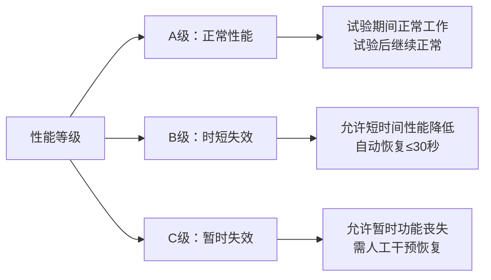
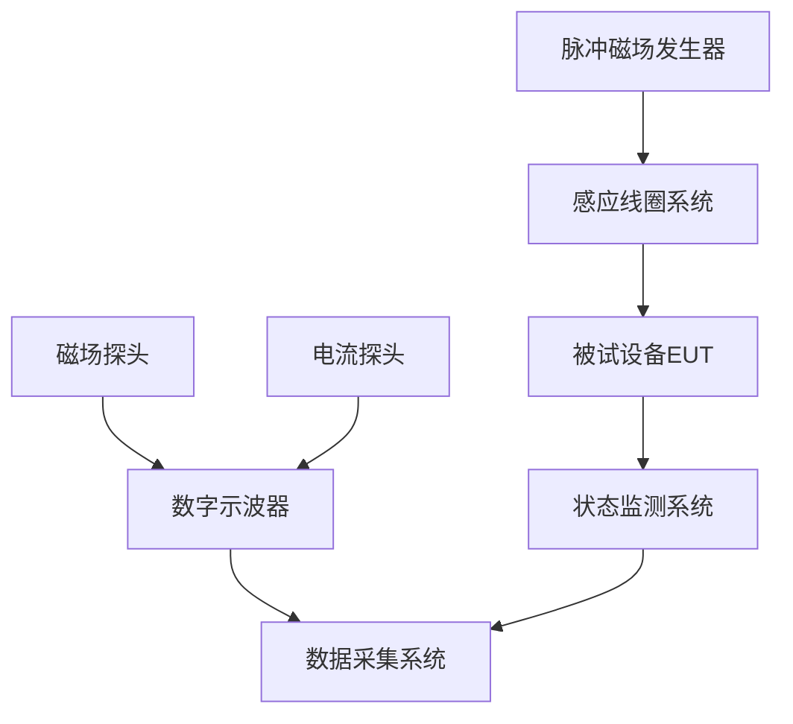
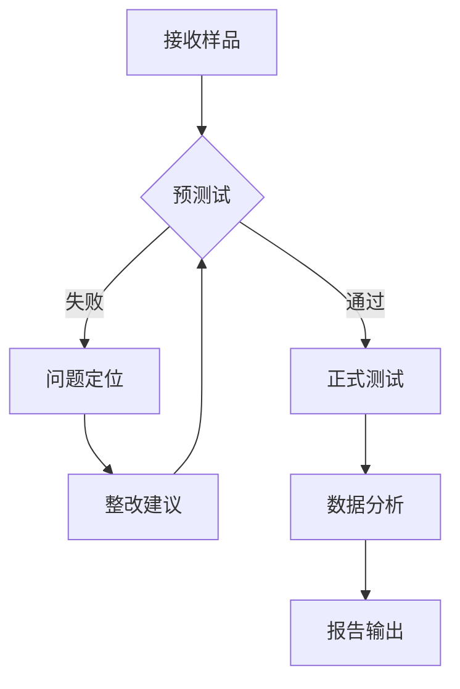

# GB/T 17626.9-2011 - 电磁兼容 试验和测量技术 第9部分：脉冲磁场抗扰度试验

## 1. 标准概述

### 1.1 技术摘要

> **GB/T 17626.9-2011** 等效采用IEC 61000-4-9:2001，规定了电子电气设备脉冲磁场抗扰度试验的技术要求、试验方法和推荐的试验等级。标准采用6.4/16 µs双指数脉冲波形模拟雷击电磁脉冲(LEMP)和电力系统开关瞬变现象，定义三个试验等级（100、300、1000 A/m），通过邻近方法(Proximity Method)直接评估设备在瞬态磁场环境中的电磁兼容性能。

### 1.2 标准定位

- **技术领域**：EMS电磁抗扰度
- **应用层级**：基础测试方法标准
- **强制属性**：推荐性国家标准(GB/T系列)
- **实施状态**：现行有效(2011年发布)
- **国际地位**：等效采用IEC 61000-4-9:2001
- **适用频率**：时域脉冲(等效频率DC-10MHz)
- **测试对象**：各类电子电气设备和系统

## 2. 物理原理与理论基础

### 2.1 电磁现象机理

**脉冲磁场耦合原理**

脉冲磁场通过电磁感应在导体回路中产生瞬态电流，根据**法拉第电磁感应定律**：

$$
\varepsilon = -\frac{d\Phi_B}{dt} = -\frac{d}{dt}\int \mathbf{B} \cdot d\mathbf{A} = -\mu_0 A \frac{dH}{dt}
$$

其中：
- $\varepsilon$ 为感应电动势 (V)
- $\Phi_B$ 为磁通量 (Wb)
- $\mathbf{B}$ 为磁感应强度 (T)
- $\mathbf{H}$ 为磁场强度 (A/m)
- $A$ 为导体回路面积 (m²)
- $\mu_0 = 4\pi \times 10^{-7}$ H/m 为真空磁导率

**耦合效率分析**

感应电压的幅值与回路面积和磁场变化率成正比：

$$
|\varepsilon_{max}| = \mu_0 A \left|\frac{dH}{dt}\right|_{max}
$$

对于6.4/16 µs波形，最大变化率出现在脉冲前沿，约为：

$$
\left|\frac{dH}{dt}\right|_{max} \approx \frac{H_0}{\tau_1} \approx \frac{H_0}{6.4 \times 10^{-6}} \text{ A/(m·s)}
$$

### 2.2 数学模型

**标准双指数波形**

标准脉冲磁场的数学表达式为归一化双指数函数：

$$
H(t) = H_0 \cdot \frac{\tau_2}{\tau_2 - \tau_1} \cdot (e^{-t/\tau_2} - e^{-t/\tau_1})
$$

其中：
- $H_0$ 为峰值磁场强度 (A/m)
- $\tau_1 = 6.4 \pm 1.3$ µs 为上升时间常数
- $\tau_2 = 16 \pm 3.2$ µs 为脉冲宽度时间常数
- 归一化系数 $\frac{\tau_2}{\tau_2 - \tau_1} = \frac{16}{16-6.4} = 1.667$

**频域特性**

双指数脉冲的频域表示为：

$$
H(f) = H_0 \cdot \frac{\tau_2}{\tau_2 - \tau_1} \cdot \frac{1}{(1 + j2\pi f\tau_1)(1 + j2\pi f\tau_2)}
$$

主要频率成分集中在DC-10MHz范围内，峰值频率约为：

$$
f_{peak} = \frac{1}{2\pi\sqrt{\tau_1\tau_2}} \approx \frac{1}{2\pi\sqrt{6.4 \times 16} \times 10^{-6}} \approx 25 \text{ kHz}
$$

### 2.3 关键参数定义

| 参数符号 | 参数名称 | 物理意义 | 单位 | 典型值 | 容差 |
|---------|---------|---------|------|--------|------|
| H | 磁场强度 | 磁场驱动力，产生磁感应强度 | A/m | 100, 300, 1000 | ±10% |
| τ₁ | 上升时间常数 | 脉冲前沿陡度，决定感应电压峰值 | µs | 6.4 | ±20% |
| τ₂ | 脉冲宽度常数 | 脉冲持续时间，决定能量传递 | µs | 16 | ±20% |
| tr | 上升时间 | 10%-90%幅值时间 | µs | 14 | ±20% |
| td | 脉冲宽度 | 半峰值宽度 | µs | 50 | ±20% |
| fr | 重复频率 | 脉冲重复速率，避免累积效应 | Hz | 1 | ±10% |
| ε | 感应电动势 | 耦合电压幅值，∝A·dH/dt | V | 1-100 V/m² | 测量值 |
| I | 驱动电流 | 线圈驱动电流，产生磁场 | A | 1-100 | ±5% |
| L | 线圈电感 | 线圈电感值，影响波形 | µH | 0.5-10 | ±10% |

## 3. 技术要求详解

### 3.1 限值要求

**试验等级划分**

脉冲磁场强度按照电磁环境严酷度分为三个等级，每个等级对应特定的物理基础和应用场景：

| 等级 | 磁场强度 | 应用环境 | 典型场景 | 物理基础 | 感应电压量级 |
|------|----------|----------|----------|----------|----------|
| 1级 | 100 A/m | 轻微磁场环境 | 办公室、住宅、轻工业 | 雷击远距离感应，小功率开关 | 1-10 V/m² |
| 2级 | 300 A/m | 一般工业环境 | 工厂、实验室、制造车间 | 中等功率设备启停，配电开关 | 3-30 V/m² |
| 3级 | 1000 A/m | 严酷电力环境 | 变电站、发电厂、重工业 | 大功率断路器操作，故障电流冲击 | 10-100 V/m² |

**特殊频率要求**

试验等级可根据产品标准或应用环境要求进行调整：
- **汽车电子**：按照ISO 11452系列标准，一般采用100-300 A/m
- **医疗器械**：按照IEC 60601-1-2，一般采用100 A/m
- **轨道交通**：按照IEC 62236系列，一般采用300-1000 A/m
- **军用标准**：按照MIL-STD-461，可达到数千A/m

### 3.2 性能等级划分

**性能判据等级**

按照试验期间和试验后的设备性能表现，将抗扰度性能分为三个等级：

**详细定义：**

- **A级性能**：设备在规定的使用限值内继续正常工作，无性能降低
- **B级性能**：允许在干扰存在时性能降低，但干扰停止后自动恢复正常功能
- **C级性能**：允许在干扰存在时性能丧失，但干扰停止后需要操作员干预恢复正常功能

**不允许的情況：**
- 设备损坏或数据丢失
- 安全相关功能失效
- 不可恢复的故障模式

### 3.3 适用范围界定

**包含的设备类别：**

1. **电子设备和电子系统**
   - 包含：控制器、传感器、显示设备、数据采集器、数字处理单元
   - 敏感元件：微处理器、存储器、时钟电路、模拟前端、A/D转换器

2. **电气设备和电气系统**
   - 包含：变频器、软启动器、UPS、电机驱动器、逆变器
   - 敏感元件：功率电子器件、控制电路、通信接口、保护电路

3. **自动控制设备和仪表**
   - 包含：PLC、DCS、SCADA、智能仪表、过程控制器
   - 敏感元件：I/O模块、CPU模块、通信模块、电源模块

4. **信息技术设备和通信设备**
   - 包含：路由器、交换机、服务器、基站设备、网络设备
   - 敏感元件：网络处理器、射频前端、时钟同步电路、信号处理单元

**不包含的设备类别：**

- **配电网一次设备**：高压开关、变压器、断路器、隔离开关等主回路设备
- **纯机械设备**：无电子控制功能的机械装置和工具
- **屏蔽良好的设备**：屏蔽效能>60dB的全金属封装设备
- **低频专用设备**：仅在<1kHz频率范围工作的专用设备

**特殊考虑情况：**

- **雷击感应敏感设备**：户外安装、大面积连线、高频敏感的设备
- **开关瞬变影响设备**：与大功率设备共享电源或在强电磁环境中工作的敏感设备
- **电力系统故障瞬变影响设备**：电力系统附近或与电力设备直接连接的设备
- **关键安全设备**：安全仪表、安全联锁、紧急停车系统等需要重点关注

## 4. 测试方法与程序

### 4.1 测试配置

**核心设备组成**
1. **脉冲磁场发生器** - 产生6.4/16 µs波形，输出电流可调，具备正负双极性输出能力
2. **感应线圈系统** - 小线圈（直径80-200mm）和大线圈（500-1000mm），多股绝缘铜线材料
3. **测量监测系统** - 磁场探头、电流探头、数字示波器、数据采集系统

### 4.2 标准试验程序

**第一阶段：试验准备**
1. **实验室环境验证**
   - 环境温度：15°C - 35°C
   - 相对湿度：25% - 75%
   - 大气压力：86 kPa - 106 kPa
   - 背景磁场：< 3 A/m

2. **被试设备(EUT)预检**
   - 确认EUT在标准条件下正常工作
   - 记录基准性能参数和工作状态
   - 建立性能监测基准
   - 确定监测点和判据

**第二阶段：磁场校准**
1. **波形校准验证**
   - 使用标准磁场探头测量空载线圈磁场
   - 验证6.4/16 µs波形参数
   - 确认磁场强度校准准确性

2. **场分布测量**
   - 测量线圈磁场的空间分布
   - 确定有效测试区域
   - 验证磁场均匀性（± 10%）

**第三阶段：抗扰度测试**
1. **邻近方法应用**
   - 将小感应线圈紧贴EUT表面或距离10mm
   - 沿EUT表面系统性移动，覆盖所有敏感区域
   - 每个位置施加正负极性各5次脉冲
   - 脉冲间隔≥1秒，避免累积效应

2. **敏感区域识别**
   - 重点测试I/O接口、显示屏、敏感电路区域
   - 识别并记录引起异常的位置和强度
   - 对敏感区域进行重复验证测试

**第四阶段：性能评估**
1. **实时状态监测**
   - 连续监测EUT工作状态和输出参数
   - 记录异常现象的类型、持续时间和恢复过程
   - 采集关键信号波形和数据

2. **后续功能验证**
   - 试验结束后验证EUT功能完整性
   - 检查设置参数和存储数据
   - 确认是否需要人工干预恢复

**阶段三：抗扰度测试实施**

1. **邻近方法(Proximity Method)测试程序**
   - **线圈位置设置**：
     - 小线圈紧贴EUT表面或距离≤ 10mm
     - 对于大尺寸设备，使用大线圈覆盖整体或主要部分
     - 避免线圈与金属壳体直接接触，防止电流直接注入
   - **扫描测试程序**：
     - 沿EUT表面系统性移动，覆盖所有可能的敏感区域
     - 移动步进：小线圈≤ 50mm，大线圈≤ 200mm
     - 每个位置施加正负极性各5次脉冲，共10次
   - **时间间隔控制**：
     - 脉冲重复频率：1 Hz ± 10%
     - 脉冲间最小间隔：1秒，避免热累积和电累积效应
     - 位置间停顿时间：≥ 5秒，确保设备完全恢复

2. **重点区域深度测试**
   - **高敏感区域识别**：
     - I/O接口区域：信号连接器、电缆入口、通信端口
     - 显示及操作区域：显示屏、按键、指示灯、触摸屏
     - 内部敏感电路：CPU、存储器、时钟电路、模拟前端
   - **敏感度分级测试**：
     - 初步扫描：使用最低等级(100 A/m)全面扫描
     - 敏感点确认：对异常区域使用正式等级重复测试
     - 阈值分析：逐步增加磁场强度，找到异常临界值

3. **特殊测试配置与程序**
   - **线缆敏感性测试**：
     - 对于长线缆设备，重点测试线缆束连接区域
     - 模拟实际安装的线缆长度和路由
     - 按照最不利的线缆布置进行测试
   - **工作状态组合测试**：
     - 待机状态、正常工作状态、最大负载状态
     - 不同输入输出配置组合
     - 特殊功能模式（如自诊断、校准模式）

**阶段四：性能评估与数据分析**

1. **实时性能监测**
   - **多参数同步监测**：
     - 电源电压电流、输入输出信号、状态指示、通信数据
     - 关键性能参数：响应时间、精度、稳定性、吞量
   - **异常现象全面记录**：
     - 异常类型：复位、死机、数据错误、显示异常、通信中断
     - 时间特征：开始时间、持续时间、恢复时间、重现性
     - 位置关联：记录异常对应的确切测试位置和磁场强度

2. **后续验证与功能检查**
   - **完整性功能验证**：
     - 重复基准性能测试，验证所有功能正常
     - 参数设置检查：配置参数、校准数据、用户设置
     - 数据完整性：存储数据、日志记录、历史数据
   - **恢复机制评估**：
     - 自动恢复能力：测试最长自动恢复时间(<30秒)
     - 人工干预需求：记录所需的具体操作步骤
     - 故障模式分析：是否进入不可恢复的安全模式

### 4.3 判定准则

**性能等级判定标准**

**A类性能判据**：
- 试验期间设备在规定使用限值内继续正常工作
- 试验后无需任何操作即可保持正常功能
- 所有性能参数在规定容差范围内
- 无任何可观察到的功能降级或异常现象

**B类性能判据**：
- 允许试验期间出现暂时功能降低或异常
- 干扰停止后在≤30秒内自动恢复正常功能
- 试验后设备保持所有原有功能和设置
- 无需操作员干预或重新初始化

**C类性能判据**：
- 允许试验期间功能丧失或严重降级
- 干扰停止后需要操作员干预才能恢复正常
- 允许的干预包括：复位、重新启动、参数重新设置
- 严格禁止：设备损坏、数据丢失、安全功能失效

## 5. 测试设备与环境

### 5.1 主要测试设备

| 设备名称 | 技术指标 | 校准要求 | 参考型号 |
|---------|---------|---------|---------|
| 脉冲磁场发生器 | 6.4/16 µs波形，1-100A峰值电流 | 每年校准 | EMTest PFS 300 |
| 感应线圈系统 | 小线圈:80-200mm,大线圈:500-1000mm | 每年校准 | EMTest MCS 200 |
| 磁场探头 | 1-2000 A/m, DC-100MHz | 每年校准 | Langer EMV-Technik RF-R 400 |
| 数字示波器 | ≥100MHz带宽, ≥1GS/s采样率 | 每两年校准 | Tektronix MDO3104 |

### 5.2 测试环境要求

- **电磁环境**：背景磁场 < 3 A/m，电场 < 1 V/m
- **物理环境**：温度15-35°C，湿度25-75%RH
- **接地系统**：接地网络阻抗 < 0.1Ω
- **安全措施**：高压安全防护，急停系统

## 6. 工程实施指南

### 6.1 典型问题与对策

| 常见问题 | 可能原因 | 建议对策 | 预期效果 |
|---------|---------|---------|---------|
| 设备复位 | 磁场感应导致微处理器复位 | 增加电源滤波电容，优化接地 | 提高复位抗扰度 |
| 显示异常 | 显示屏电路受磁场干扰 | 增加电磁屏蔽，优化布线 | 显示稳定 |
| 通信中断 | 接口电路受磁场干扰 | 采用差分信号，增加磁环 | 通信可靠 |
| 数据错误 | 存储器件受磁场影响 | 采用ECC内存，增加屏蔽 | 数据完整 |

### 6.2 测试流程优化

### 6.3 成本控制建议

- **设备复用**：磁场发生器可用于多种抗扰度测试
- **时间优化**：批量测试同类型设备，减少校准时间
- **人员配置**：1名工程师+1名技术员组合
- **实验室共享**：与其他EMC测试项目共享测试环境

## 7. 标准差异与互认

### 7.1 国际标准对比

| 对比项 | 本标准 | IEC 61000-4-9 | 差异说明 | 互认情况 |
|--------|--------|----------|----------|----------|
| 试验等级 | 100/300/1000 A/m | 相同 | 无差异 | 完全互认 |
| 波形参数 | 6.4/16 µs | 相同 | 无差异 | 完全互认 |
| 测试方法 | 邻近法 | 相同 | 无差异 | 完全互认 |
| 判定准则 | ABC三级 | 相同 | 无差异 | 完全互认 |

### 7.2 认证互认指南

- **直接互认**：欧盟CE认证、日本VCCI认证
- **条件互认**：美国FCC认证需补充本地测试报告
- **不可互认**：军工、航空等特殊领域需单独认证

## 8. 相关标准导航

### 8.1 上游标准

- [[GB_T_17626_1]] - 电磁兼容 试验和测量技术 总则
- [[IEC_61000_4_1]] - 抗扰度试验总论

### 8.2 平行标准

- [[GB_T_17626_8]] - 工频磁场抗扰度试验
- [[GB_T_17626_10]] - 阻尼振荡磁场抗扰度试验

### 8.3 下游标准

- [[GB_T_33014_2]] - 道路车辆电磁兼容性要求
- [[GB_T_17799_1]] - 工业环境中的抗扰度标准

## 9. 附录

### 9.1 术语定义

> **脉冲磁场**：瞬态磁场脉冲，具有快速上升时间和指数衰减特性
> **邻近方法**：将感应线圈贴近设备表面施加磁场的测试方法
> **双指数波形**：H(t) = H₀·(e⁻ᵗ/τ₂ - e⁻ᵗ/τ₁) 的磁场波形

### 9.2 参考文献

1. IEC 61000-4-9:2001 Electromagnetic compatibility (EMC)
2. GB/T 17626.1-2006 电磁兼容 试验和测量技术 总则
3. CISPR 16-1-1:2019 无线电骚扰和抗扰度测量设备规范

### 9.3 修订记录

| 版本 | 日期 | 主要变化 | 影响评估 |
|------|------|----------|----------|
| 1.0 | 2011-07-01 | 首次发布 | 全新标准 |
| 1.1 | 2025-06-19 | 格式规范化 | 知识图谱优化 |

该标准作为电磁兼容性测试的重要组成部分，为确保电子电气设备在复杂电磁环境中的可靠工作提供了科学的测试方法和判定准则，是现代电子产品质量保证体系中不可缺少的技术依据。