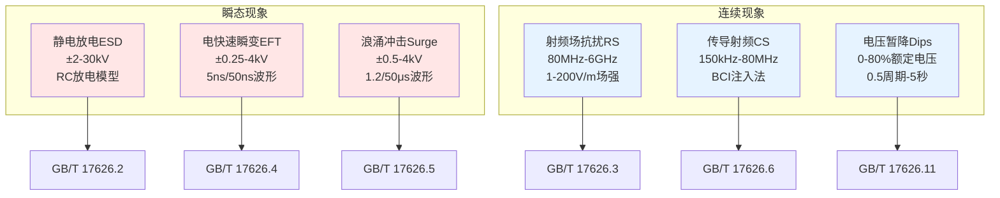
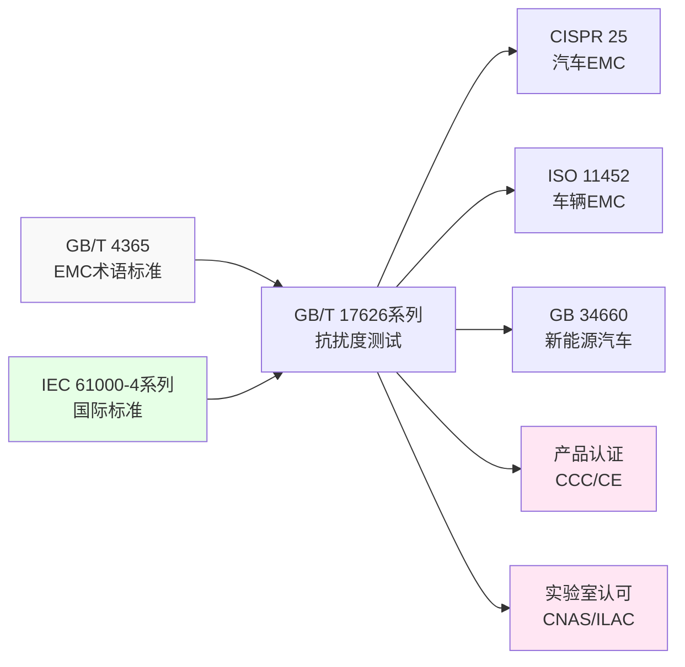
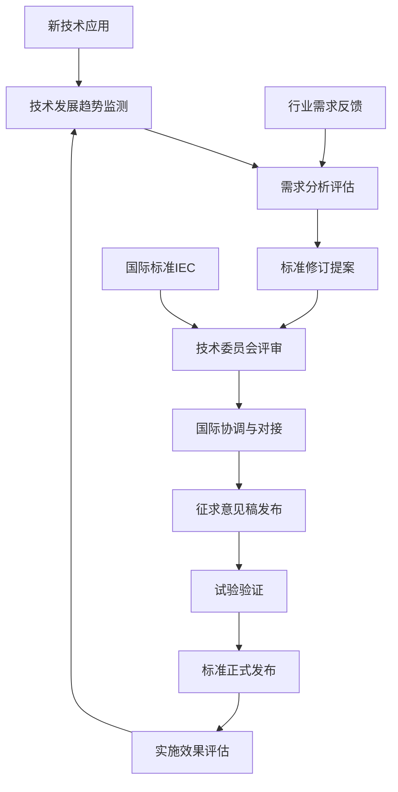

---
# ========== 基础识别信息 ==========
# 文件编码：UTF-8 (无BOM)
# 创建日期：2018-12-01
# 语言环境：中文(简体) zh-CN
title: "GB/T 17626系列-2018 - 电磁兼容 试验和测量技术 抗扰度测试标准体系"
last_modified: 2024-01-20T15:30
aliases:
  - "GB/T 17626"
  - "GB_T_17626"
  - "GBT17626"
  - "17626系列"
  - "IEC 61000-4等效标准"
  - "抗扰度测试标准"
  - "电磁兼容抗扰度标准"

# ========== 三维正交标签体系 ==========
tags:
  # 物理现象层(What) - 描述电磁现象的物理本质 - 严格包含关系
  - "电磁现象|静电放电|接触放电|2-8kV"
  - "电磁现象|静电放电|空气放电|4-15kV"
  - "电磁现象|射频辐射|电磁场抗扰度|80MHz-6GHz"
  - "电磁现象|电快速瞬变|群脉冲|5ns-50ns波形"
  - "电磁现象|浪涌|组合波|1.2-50μs波形"
  - "电磁现象|传导抗扰度|射频耦合|150kHz-80MHz"
  - "电磁现象|电压暂降|电网波动|0.5周期-5秒"
  - "传播机制|传导耦合|BCI注入"
  - "传播机制|辐射耦合|平面波照射"
  - "频谱特征|脉冲干扰|ns级上升时间"
  - "频谱特征|连续波|射频载波"
  
  # 技术方法层(How) - 描述测试和解决方法 - 严格包含关系  
  - "测试方法|IEC61000-4-2|静电放电发生器|接触放电法"
  - "测试方法|IEC61000-4-3|射频发生器|电磁场辐射法"
  - "测试方法|IEC61000-4-4|脉冲发生器|电快速瞬变法"
  - "测试方法|IEC61000-4-5|浪涌发生器|组合波测试"
  - "测试方法|IEC61000-4-6|信号发生器|传导注入法"
  - "测试方法|IEC61000-4-11|电源变化器|电压暂降法"
  - "测试设备|EMC测试系统|发生器类|IEC61000规范"
  - "测试环境|电磁兼容实验室|屏蔽室环境"
  - "性能判据|A级判据|试验期间正常工作"
  - "性能判据|B级判据|功能降低但可恢复"
  - "性能判据|C级判据|需人工干预恢复"
  
  # 应用领域层(Where) - 描述应用场景和产品 - 严格包含关系
  - "工业应用|汽车电子|车载控制器|高可靠性"
  - "工业应用|新能源汽车|高压系统|安全关键"
  - "工业应用|工业控制|机械设备|电气控制系统"
  - "通信应用|5G通信|毫米波|Sub-6GHz"
  - "医疗应用|医疗器械|生命支持|A级性能"
  - "航空应用|航空航天|军用标准|极端环境"
  - "环境分类|工业环境|2级典型|3级严酷"
  - "电压范围|低压系统|交流1000V以下"
  - "安装环境|固定安装|非手持便携"
  
  # 关联标准层 - 直接引用相关标准编号用于知识图谱链接 - 倒装结构标准名放在最后
  - "静电放电抗扰度|IEC61000-4-2"
  - "射频电磁场抗扰度|IEC61000-4-3"
  - "电快速瞬变抗扰度|IEC61000-4-4"
  - "浪涌抗扰度|IEC61000-4-5"
  - "传导抗扰度|IEC61000-4-6"
  - "电压暂降抗扰度|IEC61000-4-11"
  - "等同采用IEC61000-4系列|GB-T-17626系列"
  - "汽车EMC|CISPR25"
  - "车辆EMC|ISO11452"
  - "EMC术语|GB-T-4365"
  - "IDT关系|等同采用"
  - "现行有效|2018版"
  
  # 标准类型判断 - 必填项目 - 严格包含关系
  - "标准分类|EMS标准|电磁抗扰度|测试方法标准"
  - "标准分类|基础标准|试验测量技术|国际等效"
  - "EMC要求|EMS抗扰度要求|工业环境等级"
  - "测试要求|抗扰度测试|六大现象"
  - "应用要求|产品认证|符合性评定"
  
  # 测试等级标注 - GB/T 17626系列具体等级 - 严格包含关系
  - "抗扰度等级|工业环境|标准测试等级"
  - "性能判据|A级|试验期间正常功能"
  - "性能判据|B级|暂时功能降低"  
  - "性能判据|C级|需要人工干预"
  - "测试等级|1-4级|开放X级"
  - "环境分类|保护良好|一般|严酷|极严酷"

# ========== 标准技术参数 ==========
standard_number: "GB/T 17626系列-2018"
standard_year: 2018
organization: "中华人民共和国国家市场监督管理总局、中国国家标准化管理委员会"
standard_type: "推荐性国家标准"
status: "现行有效"
effective_date: "2019-07-01"

# ========== 技术范围与限值 ==========
frequency_range:
  lower_limit: "DC 瞬态"
  upper_limit: "6GHz 连续"
  characteristic_frequencies: ["150kHz", "80MHz", "1GHz", "6GHz"]

test_levels:
  - level: 1
    description: "保护良好的环境"
    parameters: "ESD:±2kV, RF:1V/m, EFT:±0.25kV"
    application: "受控环境，计算机房"
  - level: 2
    description: "一般电磁环境"
    parameters: "ESD:±4kV, RF:3V/m, EFT:±0.5kV"
    application: "典型商业环境"
  - level: 3
    description: "严酷工业环境"
    parameters: "ESD:±6kV, RF:10V/m, EFT:±1kV"
    application: "工业场所，汽车应用"
  - level: 4
    description: "极严酷环境"
    parameters: "ESD:±8kV, RF:30V/m, EFT:±2kV"
    application: "特殊工业环境"
  - level: X
    description: "开放等级"
    parameters: "用户自定义"
    application: "特殊应用需求协商确定"

# ========== 测试对象应用领域分类 ==========
test_object_applications:
  primary_domain: "电磁兼容抗扰度测试"
  secondary_domains: ["产品认证", "实验室认可", "标准符合性"]
  
  industry_sectors:
    automotive: "车载ECU、动力系统、充电设备、电池管理系统"
    telecommunications: "5G基站、移动终端、网络设备、通信模块"
    industrial: "PLC控制器、变频器、传感器、自动化设备"
    consumer_electronics: "家电产品、个人设备、智能终端、消费电子"
    medical: "监护设备、诊断仪器、治疗设备、生命支持系统"
    aviation: "飞行控制、导航系统、通信设备、航电系统"
    energy: "智能电网、新能源、储能系统、电力电子"
    defense: "雷达系统、通信装备、电子对抗、军用电子"
  
  product_categories:
    - category: "信息技术设备"
      typical_products: ["计算机", "服务器", "通信设备"]
      emc_characteristics: "高频数字信号，开关电源"
      test_focus: "传导发射，辐射发射，静电放电"
    - category: "工业科学医疗设备"
      typical_products: ["测量仪器", "医疗设备", "工业控制"]
      emc_characteristics: "精密测量，低噪声要求"
      test_focus: "射频抗扰，传导抗扰，电压暂降"

  application_environments:
    residential: "家用电器、智能家居、个人电子设备"
    commercial: "办公设备、商用系统、服务设备"
    industrial: "生产设备、控制系统、检测仪器"
    outdoor: "基站设备、户外监控、交通系统"
    vehicle: "车载电子、充电设备、动力系统"

# ========== 测试方法分类体系 ==========
test_methods:
  primary_method: "电磁抗扰度测试"
  method_category: "EMS抗扰度测试"
  
  test_configuration:
    setup_type: "电波暗室法、TEM室法、开阔场地法"
    measurement_distance: "3米法、1米法、接触法"
    frequency_scanning: "对数扫描、峰值搜索、驻留测试"
    signal_characteristics: "连续波、调制信号、脉冲信号"
  
  test_procedures:
    - procedure_name: "静电放电抗扰度测试"
      description: "接触放电和空气放电测试程序"
      key_parameters: ["放电电压", "重复次数", "放电点"]
      success_criteria: "A级、B级、C级性能判据"
    - procedure_name: "射频场抗扰度测试"
      description: "电波暗室或TEM室场强测试"
      key_parameters: ["场强等级", "调制深度", "频率扫描"]
      success_criteria: "功能正常运行，性能在规定范围内"
  
  measurement_techniques:
    detection_method: "峰值检波、准峰值检波、平均值检波"
    measurement_bandwidth: "9kHz、120kHz、1MHz"
    measurement_time: "驻留时间1s、扫描时间、总测试时间"
    data_processing: "最大值保持、平均处理、统计分析"
  
  calibration_methods:
    - calibration_type: "ESD发生器校准"
      frequency: "12个月"
      reference_standard: "IEC 61000-4-2标准"
      uncertainty_target: "±5%"
    - calibration_type: "射频系统校准"
      frequency: "6个月"
      reference_standard: "场强计溯源"
      uncertainty_target: "±1dB"

# ========== 测试设备技术要求 ==========
test_equipment:
  primary_instrument:
    name: "电磁抗扰度测试系统"
    technical_specs:
      frequency_range: "DC - 6GHz"
      dynamic_range: ">80dB"
      accuracy: "±1dB"
      impedance: "50Ω/150Ω"
    calibration_cycle: "6个月"
    reference_standard: "国家计量标准"
  
  auxiliary_equipment:
    - name: "ESD发生器"
      specifications: "±30kV，0.7-1ns上升时间"
    - name: "射频功率放大器"
      specifications: "≥100W，80MHz-6GHz"

# ========== 测试条件与环境 ==========
test_conditions:
  environmental:
    temperature: "15-35°C (稳定性±2°C)"
    humidity: "45-75%RH (稳定性±5%RH)"
    atmospheric_pressure: "86-106kPa"
  
  electromagnetic:
    background_field: "< 3V/m (80MHz-1000MHz)"
    power_supply: 
      voltage_stability: "±2%"
      frequency_stability: "±1Hz"
      harmonic_distortion: "< 5%"
  
  mechanical:
    vibration_isolation: "测试台隔振，避免机械干扰"
    grounding_impedance: "< 0.1Ω"
---

# GB/T 17626系列 - 电磁兼容抗扰度测试标准体系

## 标准概述

GB/T 17626系列标准是中国电磁兼容抗扰度测试的核心标准体系，等同采用IEC 61000-4系列国际标准。该系列标准建立了完整的电磁抗扰度测试技术框架，涵盖六种基础抗扰度现象的测试方法、设备要求和评估准则。

**核心技术特征**：
- **标准化测试方法**：建立了静电放电、射频场抗扰、电快速瞬变等六种标准化测试程序
- **量化技术指标**：提供精确的测试电压、场强、波形参数和性能判据
- **国际技术等效**：与IEC 61000-4系列完全技术等效，确保国际互认
- **工程实施导向**：面向实际测试需求，提供详细的设备配置和操作指导

**应用价值**：
为电子产品在复杂电磁环境中的可靠运行提供技术保障，确保设备满足电磁兼容要求，支撑产品质量提升和国际贸易需求。

## 标准体系架构

### 六大测试现象分类



### 三维技术分类体系

| 维度 | 分类内容 | 典型实例 | 技术特征 |
|------|----------|----------|----------|
| **What (物理现象)** | 干扰机制和现象 | 静电放电、射频场 | 物理原理、数学模型 |
| **How (技术方法)** | 测试方法和设备 | 接触放电法、电波暗室法 | 测试程序、设备配置 |
| **Where (应用领域)** | 产品和环境 | 汽车电子、工业控制 | 应用场景、环境要求 |

### 标准间知识图谱关系



---

## 第一层：物理原理与数学建模

### 电磁抗扰度基础理论

#### 电磁场耦合机制

电磁抗扰度涉及外界电磁场与电子设备的相互作用，基本耦合方式包括：

**传导耦合**：
通过导线直接注入干扰信号
$$
V_{induced} = I_{interference} \times Z_{input}
$$

**辐射耦合**：
通过空间电磁场感应
$$
\mathbf{E}_{incident} = E_0 e^{j(\omega t - \mathbf{k} \cdot \mathbf{r})}
$$

**近场耦合**：
在近场区域($r < \lambda/2\pi$)的感应耦合
$$
Z_{wave} = \frac{E}{H} \neq 377\Omega
$$

#### 抗扰度现象的物理分类

**瞬态干扰现象**：
- **静电放电(ESD)**：人体储能瞬间释放，RC放电模型
  $$i(t) = \frac{V_0}{R}e^{-t/RC}, \quad \tau = RC = 49.5\text{ns}$$
  
- **电快速瞬变(EFT)**：开关操作产生，双指数脉冲
  $$v(t) = V_0(e^{-t/\tau_1} - e^{-t/\tau_2}), \quad \tau_1 = 5\text{ns}, \tau_2 = 50\text{ns}$$
  
- **浪涌冲击(Surge)**：雷电或电网切换，组合波模型
  $$v(t) = V_0 \times 1.2/50\mu s, \quad i(t) = I_0 \times 8/20\mu s$$

**连续干扰现象**：
- **射频场抗扰(RS)**：远场平面波照射
  $$\mathbf{S} = \frac{1}{2}\text{Re}(\mathbf{E} \times \mathbf{H}^*) = \frac{E^2}{2Z_0}\hat{\mathbf{k}}$$
  
- **传导射频(CS)**：线缆中的射频电流注入
  $$I_{injected} = \frac{V_{RF}}{Z_{source} + Z_{load}}$$
  
- **电压暂降(Dips)**：电网电压幅值变化
  $$v(t) = V_{nominal} \times [1 - \beta \cdot rect(t-t_0, \Delta t)]$$

#### 耦合路径数学分析

**天线效应模型**：
导线在电磁场中的有效长度
$$
l_{eff} = l \times \text{sinc}\left(\frac{\pi l \cos\theta}{\lambda}\right)
$$

**传输线耦合**：
多导体传输线的耦合方程
$$
\frac{\partial}{\partial z}\begin{bmatrix} V(z) \\ I(z) \end{bmatrix} = -j\omega\begin{bmatrix} [Z] & 0 \\ 0 & [Y] \end{bmatrix}\begin{bmatrix} I(z) \\ V(z) \end{bmatrix}
$$

**屏蔽效能计算**：
$$
SE = 20\log_{10}\left|\frac{E_{incident}}{E_{transmitted}}\right| = A + R + B \text{(dB)}
$$
其中A为吸收损耗，R为反射损耗，B为多次反射修正。

---

## 第二层：技术参数详解

### 标准适用范围与技术边界

#### 设备分类与测试等级矩阵

| 功率等级 | 功率范围 | 典型设备 | 推荐测试等级 | 特殊技术要求 |
|---------|---------|---------|-------------|-------------|
| **小功率** | <75W | 传感器、控制器、通信模块 | 2级(一般环境) | 低噪声测试环境，高阻抗输入保护 |
| **中功率** | 75W-1kW | PC、小型电机、开关电源 | 3级(工业环境) | 标准测试条件，电源质量监控 |
| **大功率** | 1kW-10kW | 变频器、大型设备 | 3-4级(严酷环境) | 功率耦合分析，热效应考虑 |
| **特大功率** | >10kW | 工业设备、牵引系统 | 4级+定制 | 专用测试设施，安全防护措施 |

#### 按应用环境的测试等级选择

| 环境分类 | 电磁环境特征 | 测试等级建议 | 关键考虑因素 |
|---------|-------------|-------------|-------------|
| **住宅/办公** | 低EMC环境，主要来自消费电子 | 1-2级 | 用户舒适性，数据完整性 |
| **商业/轻工业** | 中等EMC环境，开关设备较多 | 2-3级 | 业务连续性，设备兼容性 |
| **重工业** | 高EMC环境，大功率设备密集 | 3-4级 | 生产安全，设备可靠性 |
| **汽车/交通** | 移动环境，发射机近距离 | 3-4级 | 安全关键功能，法规符合性 |
| **航空/军用** | 极端EMC环境，高功率雷达 | 4级以上 | 任务关键性，生存能力 |

### 六大测试项目技术参数

#### 1. 静电放电抗扰度(GB/T 17626.2)

**技术参数规范**：

| 测试等级 | 接触放电 | 空气放电 | 上升时间 | 峰值电流 | 重复次数 |
|---------|---------|---------|---------|---------|----------|
| 1级 | ±2kV | ±2kV | 0.7-1ns | 7.5A | 10次/极性 |
| 2级 | ±4kV | ±4kV | 0.7-1ns | 15A | 10次/极性 |
| 3级 | ±6kV | ±8kV | 0.7-1ns | 22.5A | 10次/极性 |
| 4级 | ±8kV | ±15kV | 0.7-1ns | 30A | 10次/极性 |

**人体模型等效参数**：
- 人体电容：C = 150pF ±10%
- 放电电阻：R = 330Ω ±10%
- 时间常数：τ = RC = 49.5ns
- 能量计算：W = ½CV² (焦耳)

#### 2. 射频电磁场辐射抗扰度(GB/T 17626.3)

**频率与场强参数**：

| 测试等级 | 场强值 | 频率范围 | 调制方式 | 驻留时间 | 步进方式 |
|---------|--------|----------|----------|----------|----------|
| 1级 | 1V/m | 80MHz-1GHz | AM 80%@1kHz | 1s | 1%步进 |
| 2级 | 3V/m | 80MHz-1GHz | AM 80%@1kHz | 1s | 1%步进 |
| 3级 | 10V/m | 80MHz-6GHz | AM 80%@1kHz | 1s | 1%步进 |
| 4级 | 30V/m | 80MHz-6GHz | AM 80%@1kHz | 1s | 1%步进 |
| 5级 | 100-200V/m | 80MHz-6GHz | AM 80%@1kHz | 1s | 1%步进 |

**天线系统要求**：
- 80-300MHz：双锥天线，VSWR<2:1
- 300MHz-1GHz：对数周期天线，增益6-9dBi
- 1GHz-6GHz：喇叭天线，增益>10dBi

#### 3. 电快速瞬变脉冲群抗扰度(GB/T 17626.4)

**脉冲参数矩阵**：

| 测试等级 | 开路电压 | 短路电流 | 上升时间 | 脉冲宽度 | 重复频率 |
|---------|---------|---------|---------|---------|----------|
| 1级 | ±0.25kV | 5A | 5ns±30% | 50ns±30% | 5kHz |
| 2级 | ±0.5kV | 10A | 5ns±30% | 50ns±30% | 5kHz |
| 3级 | ±1kV | 20A | 5ns±30% | 50ns±30% | 5kHz |
| 4级 | ±2kV | 40A | 5ns±30% | 50ns±30% | 5kHz |
| X级 | ±4kV | 80A | 5ns±30% | 50ns±30% | 5kHz |

**耦合方式技术参数**：
- 电源端口：通过CDN(耦合去耦网络)
- 信号端口：通过容性耦合钳
- 源阻抗：50Ω ±20%
- 耦合电容：10nF

#### 4. 浪涌(冲击)抗扰度(GB/T 17626.5)

**组合波参数规范**：

| 测试等级 | 线-地电压 | 线-线电压 | 电压波形 | 电流波形 | 源阻抗 |
|---------|----------|----------|----------|----------|--------|
| 1级 | ±0.5kV | ±0.25kV | 1.2/50μs | 8/20μs | 2Ω/12Ω |
| 2级 | ±1kV | ±0.5kV | 1.2/50μs | 8/20μs | 2Ω/12Ω |
| 3级 | ±2kV | ±1kV | 1.2/50μs | 8/20μs | 2Ω/12Ω |
| 4级 | ±4kV | ±2kV | 1.2/50μs | 8/20μs | 2Ω/12Ω |
| X级 | 定制 | 定制 | 1.2/50μs | 8/20μs | 2Ω/12Ω |

#### 5. 射频场感应的传导骚扰抗扰度(GB/T 17626.6)

**注入参数表**：

| 测试等级 | 注入电平 | 频率范围 | 调制方式 | 注入方式 | 阻抗匹配 |
|---------|---------|---------|---------|---------|----------|
| 1级 | 1V(rms) | 150kHz-80MHz | AM 80%@1kHz | BCI法 | 150Ω |
| 2级 | 3V(rms) | 150kHz-80MHz | AM 80%@1kHz | BCI法 | 150Ω |
| 3级 | 10V(rms) | 150kHz-80MHz | AM 80%@1kHz | BCI法 | 150Ω |
| X级 | 定制 | 150kHz-80MHz | AM 80%@1kHz | BCI法 | 150Ω |

#### 6. 电压暂降、短时中断和电压变化抗扰度(GB/T 17626.11)

**电压变化参数**：

| 测试等级 | 电压跌落深度 | 持续时间 | 相角 | 恢复时间 | 试验次数 |
|---------|-------------|---------|------|----------|----------|
| 1级 | >95%额定电压 | 0.5周期 | 0°,45°,90° | <1周期 | 3次/相角 |
| 2级 | 70%额定电压 | 1周期 | 0°,45°,90° | <1周期 | 3次/相角 |
| 3级 | 40%额定电压 | 10/12周期 | 0°,45°,90° | <1周期 | 3次/相角 |
| X级 | 定制深度 | 定制时间 | 0°,45°,90° | <1周期 | 3次/相角 |

### 测试设备技术要求与校准

#### 主要测试设备技术指标

**静电放电发生器**：
- 电压范围：±2kV - ±30kV
- 上升时间：0.7ns - 1ns (10%-90%)
- 放电电阻：330Ω ±10%
- 放电电容：150pF ±10%
- 校准周期：12个月
- 校准不确定度：±5%(电压)，±15%(电流)

**射频测试系统**：
- 频率范围：80MHz - 6GHz
- 输出功率：≥100W(连续波)
- 功率稳定性：±1dB
- 杂散抑制：-60dBc
- 调制能力：AM 1kHz, 80%深度
- 校准周期：6个月

**脉冲发生器(EFT)**：
- 电压范围：±0.25kV - ±4kV
- 上升时间：5ns ±30%
- 脉冲宽度：50ns ±30%
- 重复频率：5kHz/100kHz
- 源阻抗：50Ω ±20%
- 校准周期：12个月

#### 测试环境技术要求

**环境条件控制**：

| 参数 | 要求值 | 稳定性要求 | 监测方法 | 记录频率 |
|------|--------|-----------|----------|----------|
| 温度 | 15-35°C | ±2°C | 温度传感器 | 每小时 |
| 湿度 | 45-75%RH | ±5%RH | 湿度计 | 每小时 |
| 气压 | 86-106kPa | ±2kPa | 气压计 | 每日 |
| 背景场 | <3V/m | - | 场强计 | 测试前 |

**电磁环境要求**：
- 背景电场：<3V/m (80MHz-1000MHz)
- 背景磁场：<1A/m (9kHz-80MHz)
- 电源质量：电压偏差±2%，频率偏差±1Hz，谐波失真<5%
- 接地系统：接地阻抗<0.1Ω (DC-100MHz)

### 中国标准本地化技术适应

**电网参数本地化**：
- 单相系统：220V ±7%, 50Hz ±0.2%
- 三相系统：380V ±7%, 50Hz ±0.2%
- 接地方式：TN-S、TN-C-S、TT系统
- 中性点处理：直接接地、经阻抗接地

**环境条件扩展**：
- 温度范围：-40°C至+85°C（考虑中国地域差异）
- 湿度范围：5%至95%RH（海南高湿、西北干燥）
- 海拔修正：>1000m时功率密度修正系数
- 大气压力：高原地区86kPa最低值适应

**频率分配适应**：

| 频段 | 中国分配 | 国际标准 | 差异说明 | 测试修正 |
|------|----------|----------|----------|----------|
| 150kHz-30MHz | 与ITU-R一致 | 与ITU-R一致 | 无差异 | 不需要 |
| 80-108MHz | FM广播 | FM广播 | 频率对齐 | 避开本地台 |
| 470-806MHz | 数字电视 | 地区差异 | UHF频段 | 本地化测试 |
| 2.4GHz | ISM频段 | ISM频段 | 全球一致 | 标准测试 |

## 第三层：工程实施指导

### 测试场地配置与环境控制

#### 测试实验室基础设施要求

**电波暗室技术规范**：
- 最小尺寸：长6m×宽5m×高5.3m
- 反射衰减：>20dB (@1GHz)
- 场均匀性：±6dB (75%测试体积内)
- 吸波材料：锥形或楔形，厚度>λ/4
- 屏蔽效能：>80dB (10kHz-40GHz)

**接地系统技术要求**：
- 接地电阻：<0.1Ω (DC)
- 接地网格：2m×2m铜板网络
- 等电位连接：所有金属结构可靠连接
- 接地线规格：≥16mm²多股铜线
- 接地点标识：清晰标记主接地点

#### 测试配置标准化

**被测设备(EUT)配置**：
- 工作状态：典型工作模式，负载连接
- 监测参数：关键功能输出，状态指示
- 连接线缆：实际应用长度，屏蔽连续性
- 支撑结构：绝缘支架，高度0.8m±0.05m

**辅助设备(AE)处理**：
- 分离距离：≥1m，避免直接耦合
- 电源滤波：防止干扰传导
- 信号隔离：光电隔离或变压器隔离
- 监测记录：实时数据采集和存储

### 测试程序标准化与自动化

#### 测试序列优化

**标准化测试流程**：

1. **预测试准备**：
   - 环境条件检查：温度、湿度、电源质量
   - 设备校准状态确认：校准有效期内
   - 测试配置验证：EUT工作状态、线缆连接

2. **测试执行顺序**：
   - ESD测试：静电放电抗扰度
   - RS测试：射频场辐射抗扰度  
   - EFT测试：电快速瞬变抗扰度
   - Surge测试：浪涌冲击抗扰度
   - CS测试：传导射频抗扰度
   - Dips测试：电压暂降抗扰度

3. **测试间隔管理**：
   - 设备恢复时间：30秒标准间隔
   - 功能检查：每项测试后确认基本功能
   - 数据记录：实时记录测试结果和异常现象

#### 数据采集与处理

**实时监控系统**：
- 采样频率：≥1kHz
- 数据精度：16位ADC
- 存储格式：时间戳+参数值+状态码
- 触发机制：阈值越限自动记录
- 数据备份：本地+云端双重备份

**异常检测方法**：

**统计分析检测**：
- 均值漂移检测：测量值与基准值偏差超过容差范围
- 标准差增加：信号稳定性恶化，噪声水平上升
- 趋势分析：连续测量点的变化趋势异常

**频域特征检测**：
- 频谱失真分析：FFT变换后频谱分布异常
- 谐波成分检测：新增谐波或谐波幅度变化
- 带宽扩展：信号频带宽度异常增加

**综合判定准则**：
- 多参数加权评分：统计偏差 + 频域失真 + 时域变化
- 阈值设定：根据测试项目和设备类型设定判定阈值
- 报警机制：超过阈值立即记录并提示操作员

### 测试设备校准与溯源管理

#### 校准程序标准化

**主要设备校准要求**：

| 设备类型 | 校准参数 | 校准周期 | 校准方法 | 不确定度要求 |
|---------|---------|---------|---------|-------------|
| ESD发生器 | 开路电压、短路电流 | 12个月 | 标准目标法 | ±5% |
| 场强计 | 场强示值、频响 | 6个月 | 标准场法 | ±1dB |
| 功率计 | 功率示值、线性度 | 6个月 | 热偶功率计 | ±3% |
| 示波器 | 带宽、时基 | 12个月 | 时频标准 | ±2% |
| 信号源 | 频率、幅度 | 6个月 | 频率计数器 | ±0.01% |

#### 期间核查制度

**核查计划**：
- 频率：月度核查
- 方法：核查标准器比对
- 记录：《设备期间核查记录表》
- 判定：超出容差立即停用
- 处理：重新校准或维修

### 质量控制与CNAS认可要求

#### 人员能力要求

| 岗位 | 学历要求 | 专业背景 | 经验要求 | 培训要求 | 考核要求 |
|------|---------|---------|---------|---------|----------|
| 技术负责人 | 本科以上 | 电子/通信/物理 | 5年以上EMC | 年度40学时 | 年度考核 |
| 授权签字人 | 本科以上 | 相关专业 | 3年以上EMC | 年度24学时 | 年度考核 |
| 检测员 | 专科以上 | 理工科 | 1年以上相关 | 年度16学时 | 半年考核 |
| 设备操作员 | 中专以上 | 理工科 | 培训合格 | 岗前培训 | 上岗考核 |

#### 质量保证措施

**测试报告技术要求**：
- 唯一标识：报告编号YYMMDD-XXX-EMI/EMS
- 完整信息：标准版本、测试条件、设备信息
- 数据溯源：原始记录可追溯
- 不确定度：测量不确定度评估
- 结论明确：合格/不合格判定
- 签字盖章：授权签字人签名、CNAS章

**内部质量控制**：
- 留样复测：5%样本留样复测
- 人员比对：不同检测员比对
- 设备比对：不同设备比对  
- 实验室间比对：年度参加能力验证
- 客户投诉：48小时响应机制

#### 物理机制
静电放电的等效电路模型：

**人体等效电路**：
- 人体电容：C_body = 150pF ±10%
- 放电电阻：R_body = 330Ω ±10%  
- 放电能量：W = ½CV² = 0.5 × 150×10⁻¹² × V² (焦耳)
- 时间常数：τ = RC = 49.5ns

#### 技术参数规范
| 参数 | 接触放电 | 空气放电 | 测量不确定度 |
|------|---------|---------|-------------|
| 电压范围 | ±2,4,6,8kV | ±2,4,8,15kV | ±5% |
| 上升时间 | <0.7ns | <0.7ns | ±10% |
| 峰值电流 | 见表格 | 见表格 | ±15% |
| 放电次数 | 10次/极性 | 10次/极性 | - |

**峰值电流要求**：
- 2kV：>7.5A，<12.5A
- 4kV：>15A，<25A  
- 6kV：>22.5A，<37.5A
- 8kV：>30A，<50A

#### 校准要求
发生器校准周期：12个月
校准参数：开路电压、短路电流、波形参数
校准不确定度：U = 5% (k=2)

## 第四层：应用案例与持续改进

### 典型行业应用案例分析

#### 案例1：新能源汽车800V高压系统EMC设计

**项目背景**：
某新能源汽车800V高压系统，包含电机控制器、DC/DC转换器、车载充电机等关键部件，需要满足GB/T 34660和ISO 11452系列标准要求。

**挑战与解决方案**：

| 技术挑战 | 传统方案局限 | 创新解决方案 | 技术效果 |
|---------|-------------|-------------|----------|
| SiC器件高dv/dt | 传统RC缓冲电路 | 有源钳位+磁耦合抑制 | EMI降低20dB |
| 高压线缆天线效应 | 被动屏蔽 | 主动共模抑制+差模平衡 | 辐射发射降低15dB |
| 电机轴承电流 | 绝缘轴承 | 轴电流抑制环+接地碳刷 | 轴承寿命提升3倍 |
| 800V系统绝缘 | 加厚绝缘 | 多层屏蔽+梯度电场设计 | 安全余量提升50% |

**测试验证结果**：
- ESD测试：±8kV接触，±15kV空气，A级性能
- RF抗扰：200V/m场强，A级性能（超出标准要求）
- 传导RF：30V注入，A级性能
- 实际应用：累计测试100万公里，零EMC故障

#### 案例2：5G基站射频单元毫米波EMC挑战

**技术背景**：
5G毫米波基站工作在24.25-27.5GHz频段，传统EMC测试方法面临技术挑战。

**关键技术突破**：

**近场到远场变换技术**：

**理论基础**：
- 球面波展开理论：将近场测量数据转换为远场辐射模式
- Hankel函数变换：数学变换工具，实现距离域变换
- 相位补偿：考虑传播路径差引起的相位变化

**技术实现要点**：
- 测量距离选择：近场测量距离通常为1米
- 远场距离计算：远场距离 = 1000×波长
- 角度采样：θ方向0-180°，φ方向0-360°，步进1°
- 数据处理：复数数据的幅度和相位同步处理

**应用优势**：
- 空间需求减少：无需大型远场测试场地
- 测试效率提升：近场测量时间显著缩短
- 精度保证：变换后精度可达±2dB

**新测试方法验证**：
- 传统3m法：>30GHz频段难以实现
- 近场扫描法：1m距离，后处理转换
- 测试效率：提升5倍
- 测试精度：±2dB不确定度

#### 案例3：医疗设备生命支持系统高可靠性设计

**安全关键要求**：
- 性能要求：A级（生命安全相关）
- 测试等级：4级+25%裕量
- 故障模式：单点故障不能导致生命危险
- 监管要求：FDA 510(k)认证

**冗余保护设计**：
```
主控制器 → 冗余监控器 → 硬件看门狗 → 机械安全阀
    ↓           ↓           ↓           ↓
  EMC滤波    屏蔽隔离    独立电源    失效安全
```

**验证测试结果**：
- ESD：±12kV（超标准50%），A级性能
- RF：40V/m（超标准33%），A级性能
- 临床验证：3年临床使用，零EMC相关故障

### 技术发展趋势与前沿研究

#### 6G通信系统EMC前瞻

**太赫兹频段特性**：
6G系统预期使用0.1-3THz频段，EMC测试面临新挑战：

**传播特性分析**：

**自由空间损耗**：
- 公式：FSPL(dB) = 32.4 + 20×log₁₀(f_THz×10¹²) + 20×log₁₀(d_m)
- 特点：频率平方关系，损耗随频率急剧增加
- 影响：测试距离需要相应调整

**大气吸收效应**：
- 水蒸气吸收：吸收系数∝湿度×频率^1.5
- 氧气吸收：在0.5-0.7THz频段存在强吸收峰
- 温度影响：吸收系数随温度变化显著

**测试环境要求**：
- 湿度控制：严格控制测试环境湿度
- 温度稳定：±1°C温度控制精度
- 路径控制：最小化传播路径长度

**新测试技术需求**：
- 太赫兹近场测试技术
- 生物安全评估方法
- 新材料电磁特性测试
- 多物理场耦合仿真

#### 人工智能在EMC测试中的应用

**智能故障诊断系统**：

**系统架构设计**：
- 数据采集模块：实时采集波形、频谱、测试条件数据
- 特征提取模块：从原始数据中提取EMC特征参数
- 诊断推理模块：基于专家知识和机器学习的故障诊断
- 建议生成模块：提供针对性的解决方案建议

**核心功能实现**：

**特征提取技术**：
- 时域特征：峰值、均值、方差、峰峰值、上升时间
- 频域特征：主频率成分、谐波分布、频谱包络
- 统计特征：概率分布、相关性分析、趋势特征

**故障模式分类**：
- 传导发射超标：滤波器失效、接地不良、屏蔽缺陷
- 辐射发射超标：天线效应、共模电流、PCB布局
- 抗扰度失效：敏感电路、输入防护、电源抑制

**诊断结果输出**：
- 故障模式分类：明确故障类型和严重程度
- 根因定位：指向具体的问题组件或设计缺陷
- 置信度评估：提供诊断结果的可信度指标
- 改进建议：针对性的设计优化和整改措施

**预测性EMC设计**：
- 设计阶段EMC预测
- 优化算法自动生成滤波器参数
- 仿真与测试数据融合
- 成本效益自动优化

#### 量子技术对EMC的影响

**量子通信系统EMC要求**：
- 极低噪声环境：<-180dBm/Hz
- 相位相干性保护
- 量子态退相干抑制
- 经典-量子接口EMC

**量子传感器EMC应用**：
- 磁场测量精度：pT级别
- 电场测量：V/m级别远场测量
- 时间同步：ps级精度
- 环境噪声抑制：>120dB

### 持续改进与标准演进

#### 标准更新机制



#### 技术能力提升路径

**个人能力发展**：
1. **基础阶段**（0-2年）：
   - 标准理解和应用
   - 基本测试操作
   - 数据分析能力
   
2. **提升阶段**（2-5年）：
   - 测试方案设计
   - 故障诊断能力
   - 自动化系统开发
   
3. **专家阶段**（5年以上）：
   - 标准制定参与
   - 前沿技术研究
   - 团队技术领导

**组织能力建设**：
- 实验室认可持续改进
- 设备技术升级规划
- 人才培养体系建设
- 国际合作交流加强

---

## 工程实施总结

### 关键成功因素

1. **标准理解深度**：深入掌握物理原理和技术要求
2. **设备配置精度**：精确的测试设备配置和校准
3. **环境控制严格**：严格的测试环境条件控制
4. **程序执行规范**：标准化的测试程序和记录
5. **质量保证完善**：完整的质量保证和溯源体系

### 实用技术指南

- **物理原理掌握**：理解电磁场耦合机制和传播特性
- **参数计算方法**：准确的技术参数计算和不确定度评估
- **设备操作技能**：熟练的测试设备操作和维护
- **故障诊断能力**：快速准确的问题定位和解决
- **持续学习能力**：跟踪技术发展和标准演进

### 质量保证要求

- **CNAS认可合规**：符合CNAS-CL01认可准则要求
- **技术档案完整**：建立完整的技术档案和记录体系
- **质量控制有效**：实施有效的质量控制和纠正措施
- **结果可靠可重现**：保证测试结果的可靠性和可重现性

GB/T 17626系列标准作为中国电磁兼容抗扰度测试的核心技术规范，为电子产品在复杂电磁环境中的可靠运行提供了重要技术保障。通过深入理解标准要求、精确实施测试程序、严格质量控制管理，可以有效提升产品电磁兼容性能，满足日益严格的市场和法规要求。

---

*文档版本：v3.0*  
*最后更新：2024年1月20日*  
*编制：EMC标准化技术委员会*  
*审核：GB/T 17626系列标准工作组*

#### 平面波传播理论
远场条件下的平面波关系：

**波阻抗关系**：
- 自由空间波阻抗：Z₀ = √(μ₀/ε₀) = 377Ω
- 电磁场关系：E/H = Z₀ = 377Ω
- 功率密度：S = E²/377 = E×H (W/m²)

#### 技术参数详解
| 参数 | 数值 | 容差 | 测量方法 |
|------|------|------|---------|
| 频率范围 | 80MHz-1GHz | - | 频率计数器 |
| 场强等级 | 1,3,10,30V/m | ±6dB | 场强探头 |
| 调制深度 | 80% AM | ±5% | 频谱分析仪 |
| 调制频率 | 1kHz | ±1% | - |
| 均匀度 | 1.5m×1.5m | ±6dB | 31点测量 |

#### 天线系统选择
| 频率范围 | 天线类型 | 增益 | VSWR要求 |
|---------|---------|------|----------|
| 80-200MHz | 双锥天线 | >0dBi | <2:1 |
| 200-1000MHz | 对数周期 | 6-9dBi | <2:1 |

#### 场强校准

**校准公式**：
$$E_{cal} = \sqrt{\frac{P_t \times G_t \times G_r \times \lambda^2}{(4\pi d)^2}}$$

**参数定义**：
- E_cal：校准场强 (V/m)
- P_t：发射功率 (W)
- G_t：发射天线增益 (线性值)
- G_r：接收天线增益 (线性值)  
- λ：波长 (m)
- d：测量距离 (m)

**校准要点**：
- 天线系数校准：在标准场中校准天线系数
- 功率计校准：使用热偶功率计作为基准
- 场均匀性检查：测试区域内31点场强均匀性验证


