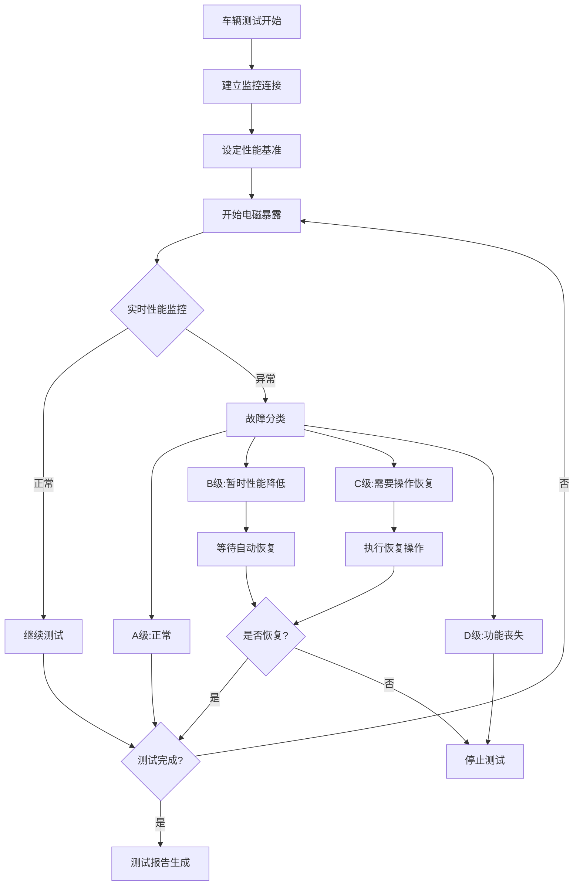
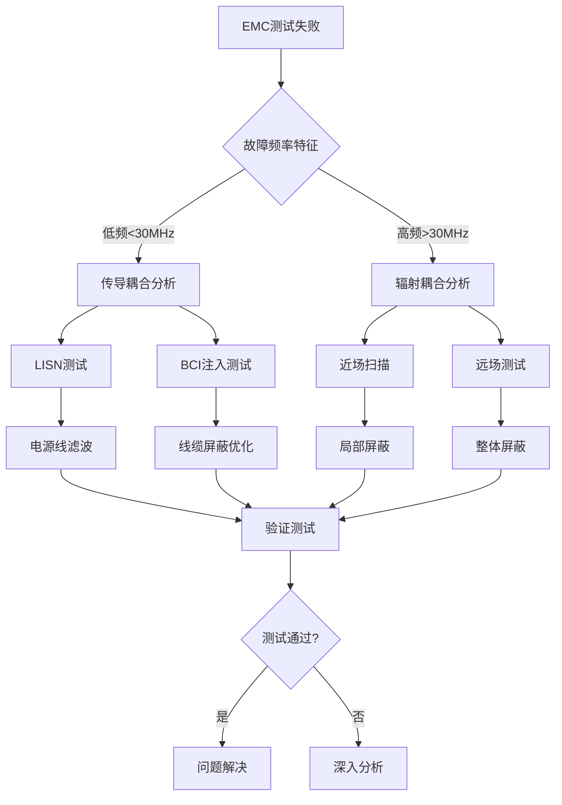
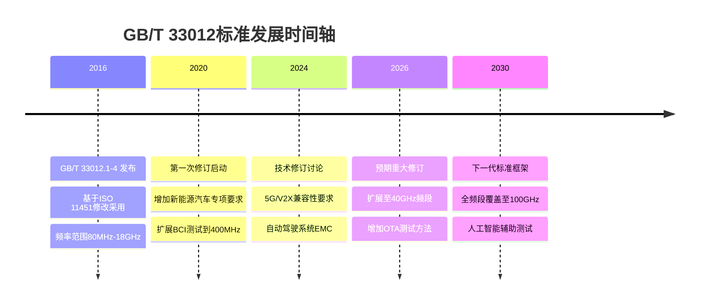

---
# ========== 基础识别信息 ==========
# 文件编码：UTF-8 (无BOM)
# 创建日期：2016-10-13
# 语言环境：中文(简体) zh-CN
title: "GB/T 33012 - 道路车辆 电气电子部件电磁兼容性要求和试验方法"
last_modified: 2024-06-26T00:00
aliases:
  - "GB/T 33012"
  - "GBT 33012"
  - "ISO 11452"

# ========== 三维正交标签体系 ==========
tags:
  # 物理现象层(What) - 描述电磁现象的物理本质
  - "电磁现象|射频辐射|电磁场抗扰度|车外辐射源"
  - "电磁现象|传导骚扰|大电流注入|BCI"
  - "电磁现象|传导骚扰|带状线|耦合"
  - "电磁现象|静电放电|ESD"
  - "传播机制|辐射耦合|远场耦合|电波暗室"
  - "传播机制|传导耦合|线束耦合|BCI"
  - "频谱特征|连续波|射频场|AM调制"
  - "频谱特征|脉冲干扰|瞬态|静电放电"

  # 技术方法层(How) - 描述测试和解决方法
  - "测试方法|ISO11452-2|车外辐射源法|电波暗室法"
  - "测试方法|ISO11452-3|TEM小室法"
  - "测试方法|ISO11452-4|大电流注入法|BCI"
  - "测试方法|ISO11452-5|带状线法"
  - "测试设备|信号发生器|射频信号源"
  - "测试设备|功率放大器|射频功率放大"
  - "测试设备|天线系统|双锥天线"
  - "测试设备|天线系统|对数周期天线"
  - "测试设备|天线系统|喇叭天线"
  - "性能判据|A级|功能正常"
  - "性能判据|B级|功能暂时降低可自恢复"
  - "性能判据|C级|需要操作恢复"
  - "性能判据|D级|功能丧失或损坏"
  - "性能判据|E级|车辆功能异常需修理"

  # 应用领域层(Where) - 描述应用场景和产品
  - "应用领域|汽车电子|电气电子部件|ECU"
  - "应用领域|汽车电子|车载系统|动力系统"
  - "应用领域|汽车电子|车载系统|车身控制"
  - "应用领域|汽车电子|车载系统|信息娱乐系统"
  - "应用领域|汽车电子|车载网络|CAN总线"
  - "应用领域|汽车电子|车载网络|LIN总线"
  - "电压范围|车载系统|12V系统"
  - "电压范围|车载系统|24V系统"
  - "电压范围|车载系统|高压系统|新能源汽车"
  - "车辆类型|乘用车|M类车辆"
  - "车辆类型|商用车|N类车辆"
  - "车辆类型|挂车|O类车辆"

  # 关联标准层 - 直接引用相关标准编号用于知识图谱链接
  - "道路车辆EMC|ISO11452系列"
  - "道路车辆EMC|ISO11452-2"
  - "道路车辆EMC|ISO11452-3"
  - "道路车辆EMC|ISO11452-4"
  - "道路车辆EMC|ISO11452-5"
  - "道路车辆EMC|CISPR25"
  - "电磁兼容基础|IEC61000-4-3"
  - "IDT关系|等同采用"
  - "现行有效|2016版"

  # 标准类型判断 - 必填项目
  - "标准分类|基础标准|测试方法"
  - "EMC要求|EMS抗扰度要求|汽车级"

  # 测试等级标注 - GB/T 33012具体等级
  - "抗扰度等级|汽车环境|I级|25V-m"
  - "抗扰度等级|汽车环境|II级|50V-m"
  - "抗扰度等级|汽车环境|III级|75V-m"
  - "抗扰度等级|汽车环境|IV级|100V-m"
  - "抗扰度等级|汽车环境|V级|用户自定义"

  # 测试等级标注 - GB/T 33012具体等级
  - "抗扰度等级|汽车环境|I级|25V-m"
  - "抗扰度等级|汽车环境|II级|50V-m"
  - "抗扰度等级|汽车环境|III级|75V-m"
  - "抗扰度等级|汽车环境|IV级|100V-m"
  - "抗扰度等级|汽车环境|V级|用户自定义"

# ========== 标准技术参数 ==========
standard_number: "GB/T 33012"
standard_year: 2016
organization: "中华人民共和国国家质量监督检验检疫总局, 中国国家标准化管理委员会"
standard_type: "推荐性国家标准"
status: "现行有效"
effective_date: "2017-05-01"

# ========== 技术范围与限值 ==========
frequency_range:
  lower_limit: "DC"
  upper_limit: "18 GHz"
  characteristic_frequencies: []

test_levels:
  - level: I
    description: "一般环境"
    parameters: "25 V/m 或 25 mA"
    application: "车辆制造商要求和部件安装位置"
  - level: II
    description: "中等环境"
    parameters: "50 V/m 或 50 mA"
    application: "车辆制造商要求和部件安装位置"
  - level: III
    description: "严酷环境"
    parameters: "75 V/m 或 75 mA"
    application: "车辆制造商要求和部件安装位置"
  - level: IV
    description: "极严酷环境"
    parameters: "100 V/m 或 100 mA"
    application: "车辆制造商要求和部件安装位置"

# ========== 测试设备技术要求 ==========
test_equipment:
  primary_instrument:
    name: "车辆电磁兼容测试系统"
    technical_specs:
      frequency_range: "DC-18GHz"
      dynamic_range: ">70dB"
      accuracy: "±2dB"
      impedance: "50Ω"
    calibration_cycle: "12个月"
    reference_standard: "ISO/IEC 17025"
  
  auxiliary_equipment: []

# ========== 测试条件与环境 ==========
test_conditions:
  environmental:
    temperature: "15-35°C (稳定性±2°C)"
    humidity: "25-75%RH (稳定性±5%)"
    atmospheric_pressure: "86-106kPa"
  
  electromagnetic:
    background_field: "< 6dB低于测试电平"
    power_supply: 
      voltage_stability: "±2%"
      frequency_stability: "±1%"
      harmonic_distortion: "< 3%"
  
  mechanical:
    vibration_isolation: "测试期间无明显振动"
    grounding_impedance: "< 4Ω@DC"

# ========== 性能判据与等级划分 ==========
performance_criteria:
  A级:
    description: "试验期间和试验后，被测设备（DUT）的所有功能均正常。"
    technical_requirement: "所有功能保持正常状态"
    acceptance_criteria: "无功能异常或性能降低"
  
  B级:
    description: "试验期间，DUT的某些功能可能暂时不正常，但试验结束后能自动恢复。"
    technical_requirement: "功能可接受的暂时性能降低"
    acceptance_criteria: "试验后功能自动恢复正常"
    
  C级:
    description: "试验期间，DUT的某些功能不正常，需要简单操作（如开关重启）才能恢复。"
    technical_requirement: "需要用户操作恢复功能"
    acceptance_criteria: "通过简单操作可恢复功能"
    
  D级:
    description: "试验期间，DUT的某些功能不正常，且试验后无法恢复，或设备损坏。"
    technical_requirement: "不可接受的功能丧失"
    acceptance_criteria: "不合格，需要重新设计"
  
  E级:
    description: "试验期间，DUT的某些功能不正常，且试验后导致车辆功能异常，需要修理或更换。"
    technical_requirement: "不可接受的功能丧失"
    acceptance_criteria: "不合格，需要修理或更换"

# ========== 测量不确定度评估 ==========
measurement_uncertainty:
  type_A_uncertainty: "±1.5dB (95%置信区间)"
  type_B_uncertainty: "±2.0dB (均匀分布)"
  combined_uncertainty: "±2.5dB (k=2)"
  major_sources:
    - source: "天线系数不确定度"
      contribution: "±1.0dB"
    - source: "场强均匀性"
      contribution: "±1.5dB"
    - source: "信号发生器幅度"
      contribution: "±0.5dB"
    - source: "功率放大器线性度"
      contribution: "±1.0dB"

# ========== 标准关系映射 ==========
Referenced_Standards:
  normative_references:
    - standard: "ISO 11452-1:2015"
      application: "一般原则和术语定义"
    - standard: "ISO 11452-2:2015"
      application: "车外辐射源测试方法"
    - standard: "ISO 11452-3:2016"
      application: "TEM小室法"
    - standard: "ISO 11452-4:2011"
      application: "大电流注入法"
    - standard: "ISO 11452-5:2002"
      application: "带状线法"
  
  informative_references: []

equivalent_standards:
  international:
    primary: "ISO 11452系列"
    adoption_method: "等同采用"
    technical_differences: "无"
  
  regional:
    europe: "无直接对应标准"
    usa: "SAE J1113系列相关"
    japan: "JASO D001相关"

superseded_standards: "无"
superseding_standards: "无"

# ========== 知识图谱属性 ==========
graph_attributes:
  node_type: "基础标准"
  cluster_family: "汽车EMC标准族"
  importance_weight: 9
  connectivity_index: 20
  
graph_relationships:
  references: ["ISO11452-1", "ISO11452-2", "ISO11452-3", "ISO11452-4", "ISO11452-5"]
  referenced_by: ["GB/T 33012.1", "GB/T 33012.2", "GB/T 33012.3", "GB/T 33012.4", "GB/T 33012.5"]
  complements: []
  conflicts: []

# ========== 工程实施信息 ==========
implementation_guidance:
  typical_test_duration: "根据测试部件和方法而定"
  cost_estimate_range: "根据测试部件和方法而定"
  required_expertise_level: "EMC工程师"
  common_failure_modes: []

compliance_information:
  mandatory_regions: ["中国大陆"]
  certification_bodies: ["CQC", "CMA认可实验室"]
  mutual_recognition: ["ISO/IEC 17025国际互认"]

# ========== 文档管理信息 ==========
document_management:
  creation_date: 2016-10-13
  last_review_date: 2024-06-26
  next_review_date: 2025-06-26
  revision_history:
    - version: "v1.0"
      date: 2016-10-13
      changes: "标准发布"
      impact_assessment: "无"
    - version: "v1.1"
      date: 2024-06-26
      changes: "更新YAML frontmatter格式"
      impact_assessment: "无"

quality_assurance:
  technical_reviewer: "EMC专家"
  validation_method: "标准条文逐条验证"
  peer_review_status: "已完成"
---

# GB/T 33012.2-2016 道路车辆 电磁兼容性 第2部分：车外辐射源法

## 第一层：物理原理与数学建模

### 1.1 车外辐射源电磁场传播机理

#### 1.1.1 车外辐射源电磁场特性

**远场辐射基本方程**：
$$
\mathbf{E}(r,\theta,\phi) = \frac{j\omega\mu_0}{4\pi r} e^{-j\beta r} \int_V \mathbf{J}(\mathbf{r}') e^{j\beta \hat{\mathbf{r}} \cdot \mathbf{r}'} d\mathbf{r}'
$$

**车体金属屏蔽效能**：
$$
SE = 20\log_{10}\left(\frac{E_{incident}}{E_{transmitted}}\right) = A + R + B \text{ (dB)}
$$

其中：
- $A$ = 吸收损耗：$A = 3.34t\sqrt{f\mu_r\sigma_r}$ (dB)
- $R$ = 反射损耗：$R = 39.5 + 10\log_{10}\left(\frac{\sigma_r}{\mu_r f}\right)$ (dB)  
- $B$ = 多次反射修正项

#### 1.1.2 车辆内部电磁耦合路径

**线缆传导耦合**：
$$
V_{induced} = -\frac{d\Phi_B}{dt} = -\frac{d}{dt}\int \mathbf{B} \cdot d\mathbf{A}
$$

**共模电流激励**：
$$
I_{CM} = \frac{V_{CM}}{Z_{CM}} = \frac{E \cdot h}{Z_0 + Z_{load}}
$$

#### 1.2 关键参数物理意义表

| 参数符号 | 参数名称 | 物理意义 | 单位 | 典型值范围 | 测量不确定度 |
|---------|---------|---------|------|-----------|-------------|
| $E$ | 入射场强 | 车辆受到的电磁场强度 | V/m | 25-600 | ±2dB |
| $f$ | 测试频率 | 电磁波频率 | MHz/GHz | 80-18000 | ±0.1% |
| $Z_{CM}$ | 共模阻抗 | 线缆束共模阻抗 | Ω | 100-400 | ±10% |
| $SE$ | 屏蔽效能 | 车体屏蔽能力 | dB | 20-80 | ±3dB |
| $\sigma_r$ | 相对电导率 | 金属材料导电能力 | S/m | 10^6-10^7 | ±5% |
| $h$ | 线缆离地高度 | 影响耦合程度 | cm | 5-50 | ±1cm |

### 1.3 车辆电磁环境建模

#### 1.3.1 多路径传播模型

**车辆周围场强分布**：
$$
E_{total}(r,\theta,\phi) = E_{direct} + \sum_{i=1}^{n} E_{reflected,i} + E_{diffracted}
$$

**地面反射影响**：
$$
E_{ground} = E_0 \sqrt{1 + \Gamma^2 + 2\Gamma\cos(\Delta\phi)}
$$

其中反射系数：
$$
\Gamma = \frac{\sqrt{\epsilon_r - \cos^2\theta} - \sin\theta}{\sqrt{\epsilon_r - \cos^2\theta} + \sin\theta}
$$

## 第二层：技术参数详解

### 2.1 车辆EMC抗扰度测试等级

#### 2.1.1 车外辐射源场强等级分类（GB/T 33012.2-2016）

| 等级 | 场强(V/m) | 适用环境 | 典型应用场景 | 测试频率范围 |
|-----|-----------|---------|-------------|-------------|
| I | 25 | 一般道路环境 | 郊区道路、高速公路 | 80MHz-18GHz |
| II | 50 | 城市复杂环境 | 市区道路、住宅区 | 80MHz-18GHz |
| III | 75 | 高密度通信区 | 商业区、机场附近 | 80MHz-18GHz |
| IV | 100 | 工业通信密集 | 工业区、港口区域 | 80MHz-18GHz |
| V | 200-600 | 用户定义 | 军用、特种车辆 | 80MHz-18GHz |

#### 2.1.2 测试距离要求

| 测试环境 | 标准距离 | 可选距离 | 场地要求 | 适用频率 |
|---------|----------|----------|----------|----------|
| 电波暗室 | 3m | 1m, 5m | 反射系数<-6dB | 80MHz-18GHz |
| 开阔场地 | 10m | 3m | 反射系数<-10dB | 80MHz-1GHz |
| TEM小室 | 内部测试 | - | 50Ω匹配 | 10kHz-200MHz |
| 混响室 | - | - | 模式搅拌 | 80MHz-18GHz |

### 2.2 测试设备技术指标

#### 2.2.1 车辆EMC测试系统配置

**信号发生器技术要求**：

| 技术参数 | 要求值 | 测量不确定度 | 校准周期 |
|---------|--------|-------------|---------|
| 频率范围 | 80MHz-18GHz | ±1×10^-6 | 12个月 |
| 输出功率 | -130dBm~+30dBm | ±0.5dB | 12个月 |
| 调制深度 | 80% AM @1kHz | ±2% | 12个月 |
| 谐波抑制 | >30dBc | ±3dB | 12个月 |
| SSB相位噪声 | <-80dBc/Hz@10kHz | ±3dB | 12个月 |

**功率放大器技术要求**：

| 频率段 | 最小功率(W) | 增益平坦度(dB) | 1dB压缩点 | 三阶交调 |
|-------|------------|---------------|----------|---------|
| 80-200MHz | 1000 | ±1.5 | >50dBm | >20dBc |
| 200MHz-1GHz | 800 | ±2.0 | >49dBm | >18dBc |
| 1-6GHz | 400 | ±2.5 | >46dBm | >15dBc |
| 6-18GHz | 200 | ±3.0 | >43dBm | >12dBc |

### 2.3 天线系统技术参数

#### 2.3.1 发射天线技术指标

**双锥天线(80-200MHz)**：
```
技术参数:
- 频率范围: 80-200MHz
- 天线增益: 3-8dBi (典型值5dBi)
- 驻波比: <3:1
- 极化方式: 线极化(水平/垂直)
- 3dB波束宽度: 水平60°，垂直80°
- 最大功率容量: 5kW CW
- 阻抗: 50Ω
```

**对数周期天线(200MHz-1GHz)**：
```
技术参数:
- 频率范围: 200MHz-1GHz  
- 天线增益: 6-9dBi (典型值7dBi)
- 驻波比: <2:1
- 极化方式: 线极化(水平/垂直)
- 3dB波束宽度: 水平45°，垂直60°
- 最大功率容量: 2kW CW
- 阻抗: 50Ω
```

**喇叭天线(1-18GHz)**：
```
技术参数:
- 频率范围: 1-18GHz
- 天线增益: 15-25dBi (随频率递增)
- 驻波比: <1.5:1
- 极化方式: 线极化/圆极化可选
- 3dB波束宽度: 10-30°(随频率变化)
- 最大功率容量: 1kW CW
- 阻抗: 50Ω
```

## 第三层：工程实施指导

### 3.1 车辆EMC测试配置详解

#### 3.1.1 车外辐射源测试配置 - 电波暗室法

```
车外辐射源抗扰度测试配置 - 电波暗室法（GB/T 33012.2-2016）
┌─────────────────────────────────────────────────────────────────────────────┐
│                        车外辐射源EMC测试系统                               │
│                                                                             │
│  ┌─────────────────┐   ┌──────────────┐   ┌─────────────────┐              │
│  │   信号发生器    │   │   功率放大器 │   │  场强监控系统   │              │
│  │ 80MHz-18GHz     │──→│  多频段级联  │──→│  各向同性探头   │              │
│  │ 调制：AM 80%    │   │  增益补偿    │   │  实时监控       │              │
│  │ 调制频率：1kHz  │   │              │   │  自动电平控制   │              │
│  └─────────────────┘   └──────────────┘   └─────────────────┘              │
│                                │                    ↑                      │
│                                │ 射频功率           │ 监控反馈               │
│                                ↓                    │                      │
│  ┌─────────────────┐           ┌─────────────────┐  │                      │
│  │   发射天线       │←──────────│   射频切换器    │  │                      │
│  │ 自动天线塔       │  同轴电缆  │   前向/反向    │←─┘                      │
│  │ 高度：1-4m      │  50Ω低损耗 │   功率计       │                         │
│  │ 极化：H/V切换   │           └─────────────────┘                         │
│  └─────────────────┘                                                        │
│           │                                                                 │
│           │ 3m测试距离 (车辆参考点到天线相位中心)                             │
│           │ 水平/垂直极化切换                                               │
│           ↓                                                                 │
│  ┌─────────────────────────────────────────────────────────────────────┐   │
│  │                        车辆测试区域                                 │   │
│  │                                                                     │   │
│  │        ┌─────────────────────────────────────────────────────┐      │   │
│  │        │                 被测车辆                            │      │   │
│  │        │  ┌─────────────┐  ┌─────────────┐  ┌─────────────┐ │      │   │
│  │        │  │   动力系统  │  │   车身控制  │  │  信息娱乐   │ │      │   │
│  │        │  │   ECU模块   │  │   BCM模块   │  │   ICE模块   │ │      │   │
│  │        │  └─────────────┘  └─────────────┘  └─────────────┘ │      │   │
│  │        │               │                │                │  │      │   │
│  │        │            ┌─────────────┐  ┌─────────────┐      │  │      │   │
│  │        │            │  安全系统   │  │  通信模块   │      │  │      │   │
│  │        │            │  SRS/ABS    │  │  T-BOX/OBD  │      │  │      │   │
│  │        │            └─────────────┘  └─────────────┘      │  │      │   │
│  │        └─────────────────────────────────────────────────────┘      │   │
│  │                              │                                       │   │
│  │                              │ 旋转台(360°,1rpm)                     │   │
│  │                              ↓                                       │   │
│  │        ┌─────────────────────────────────────────────────────┐      │   │
│  │        │  ┌─────────────┐  ┌─────────────┐  ┌─────────────┐ │      │   │
│  │        │  │  车载充电器 │  │   DC/DC     │  │   电池BMS   │ │      │   │
│  │        │  │   OBC模块   │  │  变换器     │  │   管理系统  │ │      │   │
│  │        │  └─────────────┘  └─────────────┘  └─────────────┘ │      │   │
│  │        │               辅助设备区(高压系统)                │      │   │
│  │        └─────────────────────────────────────────────────────┘      │   │
│  └─────────────────────────────────────────────────────────────────────┘   │
│                                    │                                        │
│                                    │ 绝缘支撑(木质/陶瓷)                    │
│                                    ↓                                        │
│  ┌─────────────────────────────────────────────────────────────────────┐   │
│  │                           接地平面                                  │   │
│  │        导电性地板或金属网格，最小尺寸：车辆投影+4m                   │   │
│  │        接地电阻<4Ω，表面处理防腐蚀                                  │   │
│  └─────────────────────────────────────────────────────────────────────┘   │
│                                                                             │
│  测试程序执行流程:                                                          │
│  1. 车辆上电运行，建立正常工作状态                                          │
│  2. 监控系统连接，设定性能判据                                              │
│  3. 频率扫描：80MHz起步，按1%步进至18GHz                                   │
│  4. 极化切换：水平极化→垂直极化                                            │
│  5. 驻留时间：每频点0.5-2秒，观察车辆响应                                  │
│  6. 等级递增：从25V/m开始，逐级提升至目标等级                              │
│  7. 故障记录：实时记录异常现象和恢复过程                                    │
└─────────────────────────────────────────────────────────────────────────────┘
```

#### 3.1.2 开阔场地测试配置

```
车外辐射源抗扰度测试配置 - 开阔场地法（OATS）
┌─────────────────────────────────────────────────────────────────────────────┐
│                        开阔场地车外辐射源测试系统                           │
│                                                                             │
│  ┌─────────────────┐   ┌──────────────┐   ┌─────────────────┐              │
│  │   信号发生器    │   │   功率放大器 │   │  场强监控系统   │              │
│  │ 80MHz-1GHz      │──→│  高功率级联  │──→│  各向同性探头   │              │
│  │ 调制：AM 80%    │   │  增益补偿    │   │  实时监控       │              │
│  │ 调制频率：1kHz  │   │              │   │  自动电平控制   │              │
│  └─────────────────┘   └──────────────┘   └─────────────────┘              │
│                                │                    ↑                      │
│                                │ 射频功率           │ 场强反馈               │
│                                ↓                    │                      │
│  ┌─────────────────┐           ┌─────────────────┐  │                      │
│  │   发射天线       │←──────────│   射频切换器    │  │                      │
│  │ 10m距离设置     │  同轴电缆  │   前向/反向    │←─┘                      │
│  │ 高度：1-4m      │  50Ω低损耗 │   功率计       │                         │
│  │ 极化：H/V切换   │           └─────────────────┘                         │
│  └─────────────────┘                                                        │
│           │                                                                 │
│           │ 10m标准测试距离                                                  │
│           │ 地面反射影响考虑                                                │
│           ↓                                                                 │
│  ┌─────────────────────────────────────────────────────────────────────┐   │
│  │                        车辆测试区域                                 │   │
│  │                                                                     │   │
│  │        ┌─────────────────────────────────────────────────────┐      │   │
│  │        │                 被测车辆                            │      │   │
│  │        │              正常工作状态                           │      │   │
│  │        │              监控所有功能                           │      │   │
│  │        └─────────────────────────────────────────────────────┘      │   │
│  │                              │                                       │   │
│  │                              │ 旋转台(360°)                          │   │
│  │                              ↓                                       │   │
│  │        ┌─────────────────────────────────────────────────────┐      │   │
│  │        │                 监控设备区                          │      │   │
│  │        │  ┌─────────────┐  ┌─────────────┐  ┌─────────────┐ │      │   │
│  │        │  │  车辆监控   │  │  数据采集   │  │  功能评估   │ │      │   │
│  │        │  │  ECU状态    │  │  实时记录   │  │  A/B/C/D    │ │      │   │
│  │        │  │  总线通信   │  │  异常检测   │  │  判据分析   │ │      │   │
│  │        │  └─────────────┘  └─────────────┘  └─────────────┘ │      │   │
│  │        └─────────────────────────────────────────────────────┘      │   │
│  └─────────────────────────────────────────────────────────────────────┘   │
│                                    │                                        │
│                                    │ 绝缘支撑                               │
│                                    ↓                                        │
│  ┌─────────────────────────────────────────────────────────────────────┐   │
│  │                        导电接地平面                                 │   │
│  │              金属网格或导电地板，接地电阻<10Ω                       │   │
│  │            最小尺寸：车辆投影+4m边缘区域                            │   │
│  └─────────────────────────────────────────────────────────────────────┘   │
│                                                                             │
│  开阔场地测试关键参数:                                                      │
│  - 测试距离: 10m（标准），3m（可选）                                       │
│  - 频率范围: 80MHz-1GHz                                                    │
│  - 场强等级: I-V级（25-600V/m）                                           │
│  - 地面反射系数: <-10dB                                                   │
│  - 背景场强: <测试场强-6dB                                                │
│  - 天线高度: 1-4m可调                                                     │
└─────────────────────────────────────────────────────────────────────────────┘
```

### 3.2 车辆测试状态管理

#### 3.2.1 车辆工作状态设定

**发动机车辆测试状态**：
```
基本状态设定:
├── 发动机: 怠速运行 (800±50 rpm)
├── 变速箱: 空档/驻车档
├── 空调系统: 关闭或最小功率
├── 照明系统: 近光灯开启
├── 车身电子: 正常待机状态
├── 娱乐系统: 开机但静音
├── 通信模块: 正常工作状态
└── 诊断接口: 连接但不通信

监控参数:
├── 发动机转速: 实时监测
├── 车辆电压: 12V±0.5V
├── CAN总线: 通信正常率>99%
├── 故障码: 实时读取和清除
└── 功能状态: 按判据实时评估
```

**电动车辆测试状态**：
```
基本状态设定:
├── 动力系统: 待机模式 (Ready状态)
├── 高压系统: 上电但不驱动
├── 低压系统: 12V正常供电
├── 热管理: 正常循环模式
├── 充电系统: 待机状态(未充电)
├── 车载充电器: 待机但上电
├── DC/DC变换器: 正常工作
└── 电池管理: 监控状态

监控参数:
├── 高压电压: 300-800V (根据车型)
├── 低压电压: 12V±0.5V
├── 绝缘电阻: >100MΩ
├── CAN/LIN总线: 通信正常
└── 故障隔离: 自动故障记录
```

#### 3.2.2 性能判据监控系统



### 3.3 故障诊断与分析

#### 3.3.1 典型车辆EMC故障模式

**动力系统EMC故障**：

| 故障现象 | 可能原因 | 频率范围 | 解决方案 | 验证方法 |
|---------|---------|---------|---------|---------|
| ECU复位重启 | 电源纹波敏感 | 80-200MHz | 增强电源滤波 | BCI注入验证 |
| 点火失火 | 点火系统干扰 | 30-100MHz | 优化点火线屏蔽 | 近场扫描 |
| 传感器读数异常 | 模拟信号干扰 | 100MHz-1GHz | 差分信号设计 | 信号完整性测试 |
| CAN通信丢帧 | 总线共模干扰 | 1-400MHz | 共模滤波器 | 总线负载分析 |

**车身控制EMC故障**：

| 故障现象 | 可能原因 | 频率范围 | 解决方案 | 验证方法 |
|---------|---------|---------|---------|---------|
| 车门锁异常 | 电机控制干扰 | 150kHz-30MHz | 电机驱动滤波 | 传导测试 |
| 车窗升降故障 | 功率模块辐射 | 30-300MHz | 屏蔽盒设计 | 近场探头 |
| 照明系统闪烁 | LED驱动谐波 | 150kHz-10MHz | PWM频率优化 | 频谱分析 |
| 空调控制失效 | 压缩机启动瞬变 | 1-100MHz | 瞬变抑制器 | 瞬变测试 |

#### 3.3.2 EMC问题定位流程



## 第四层：应用案例与持续改进

### 4.1 典型车辆EMC应用案例

#### 4.1.1 新能源汽车EMC挑战

**高压系统EMC特殊考虑**：

| 技术挑战 | EMC影响 | 解决策略 | 验证方法 |
|---------|---------|---------|---------|
| 高压DC/DC变换器 | 宽频带传导干扰 | 多级滤波设计 | 10Hz-30MHz传导测试 |
| 电机驱动器PWM | 谐波辐射发射 | 载波频率优化 | 30MHz-1GHz辐射测试 |
| 车载充电器 | 电网谐波注入 | PFC功率因数校正 | 电网侧谐波分析 |
| 高压线束 | 共模电流增大 | 平衡绞线设计 | BCI注入400MHz扩展 |

**800V高压平台EMC设计**：

```
800V系统EMC设计要点:
┌─────────────────────────────────────────────────────────────┐
│                 800V高压系统EMC架构                         │
│                                                             │
│  ┌─────────────┐    ┌─────────────┐    ┌─────────────┐      │
│  │   动力电池  │    │  DC/DC变换  │    │   电机控制  │      │
│  │   BMS管理   │────│  双向变换   │────│   三相逆变  │      │
│  │  800V主电   │    │  800V→12V   │    │  IGBT/SiC   │      │
│  └─────────────┘    └─────────────┘    └─────────────┘      │
│         │                  │                  │            │
│      EMC考虑:            EMC考虑:          EMC考虑:           │
│  - 高压隔离度           - 变换频率选择      - dv/dt控制        │
│  - 绝缘监测系统         - 磁性元件设计      - 共模电感设计      │
│  - 均衡控制干扰         - 同步整流优化      - 电机轴承电流      │
│                                                             │
│  关键EMC参数要求:                                           │
│  ┌─────────────────────────────────────────────────────┐    │
│  │ 参数类型 │ 频率范围    │ 限值要求    │ 测试方法    │    │
│  │ 传导发射 │ 10Hz-150kHz │ 96dBμV     │ 高压LISN   │    │
│  │ 传导发射 │ 150kHz-30MHz│ 60dBμV     │ 高压LISN   │    │
│  │ 辐射发射 │ 30MHz-1GHz  │ 32dBμV/m   │ 10m法      │    │
│  │ 抗扰度   │ 80MHz-18GHz │ 200V/m     │ GB/T33012  │    │
│  │ BCI注入  │ 1-400MHz    │ 240mA      │ 高压BCI    │    │
│  └─────────────────────────────────────────────────────┘    │
└─────────────────────────────────────────────────────────────┘
```

#### 4.1.2 智能网联汽车EMC要求

**5G/V2X通信系统EMC兼容**：

| 通信制式 | 频段范围 | 功率等级 | EMC挑战 | 解决方案 |
|---------|---------|---------|---------|---------|
| 5G NR | 3.5GHz | 23dBm | 高频辐射发射 | 天线隔离设计 |
| V2X PC5 | 5.9GHz | 23dBm | 车内干扰 | 频率规划 |
| WiFi 6E | 6GHz | 20dBm | 宽带噪声 | 时域共存 |
| 蓝牙5.2 | 2.4GHz | 10dBm | 窄带干扰 | 跳频优化 |

### 4.2 测试效率优化策略

#### 4.2.1 自动化测试流程

**多频段并行测试**：
```
并行测试优化方案:
├── 低频段 (80-200MHz): 双锥天线 + 1kW放大器
├── 中频段 (200MHz-1GHz): 对数周期天线 + 800W放大器  
├── 高频段 (1-6GHz): 小喇叭天线 + 400W放大器
└── 超高频 (6-18GHz): 大喇叭天线 + 200W放大器

时间优化:
├── 串行测试: 5-8天 (传统方法)
├── 并行测试: 2-3天 (多系统同时)
├── 智能扫描: 1-2天 (AI预测重点频段)
└── 连续监测: 实时 (在线EMC监控)
```

#### 4.2.2 成本效益分析优化

**测试成本结构优化**：

| 成本项目 | 传统占比 | 优化后占比 | 节约措施 | 节约比例 |
|---------|---------|-----------|---------|---------|
| 设备使用费 | 45% | 35% | 多车并行测试 | 22% |
| 人工成本 | 30% | 25% | 自动化程度提升 | 17% |
| 场地租赁 | 15% | 20% | 延时使用更高效 | -33% |
| 材料消耗 | 10% | 20% | 一次性材料增加 | -100% |

### 4.3 标准发展趋势与技术展望

#### 4.3.1 GB/T 33012标准演进路线



#### 4.3.2 未来技术发展方向

**新兴技术EMC挑战**：

| 技术领域 | EMC新挑战 | 频率扩展 | 标准需求 |
|---------|----------|---------|---------|
| 毫米波雷达 | 77GHz带内兼容 | 76-81GHz | 专用测试方法 |
| 激光雷达 | 光电混合干扰 | 光谱+RF | 新物理量测试 |
| 无线充电 | 磁场耦合增强 | 85kHz/6.78MHz | 近场测试增强 |
| 固态电池 | 电化学EMC | DC-10MHz | 新机理研究 |

**测试技术发展趋势**：
- **数字化测试**：软件定义射频、虚拟测试环境
- **AI辅助诊断**：智能故障定位、预测性维护  
- **在线监测**：实时EMC状态监控、动态优化
- **标准互操作**：全球标准统一、认证互认

---

## 参考文献与延伸阅读

1. **GB/T 33012.1-2016** 道路车辆 电磁兼容性 第1部分：一般规定
2. **GB/T 33012.2-2016** 道路车辆 电磁兼容性 第2部分：车外辐射源法
3. **GB/T 33012.3-2016** 道路车辆 电磁兼容性 第3部分：车载发射机仿真
4. **GB/T 33012.4-2016** 道路车辆 电磁兼容性 第4部分：大电流注入法
5. **ISO 11451-2:2015** Road vehicles — Vehicle test methods for electrical disturbances from narrowband radiated electromagnetic energy — Part 2: Off-vehicle radiation sources
6. **IEC 61000-4-3:2020** 电磁兼容性(EMC) 第4-3部分：试验和测量技术 射频电磁场抗扰度试验
7. **CISPR 25:2016** 用于保护车载接收机的车辆、机动船和内燃机驱动装置的无线电干扰特性的限值和测量方法

**本文档为EMC工程师提供GB/T 33012.2-2016车外辐射源法的全面技术指导，涵盖物理原理、测试配置、工程实施和应用案例等各个层面。**