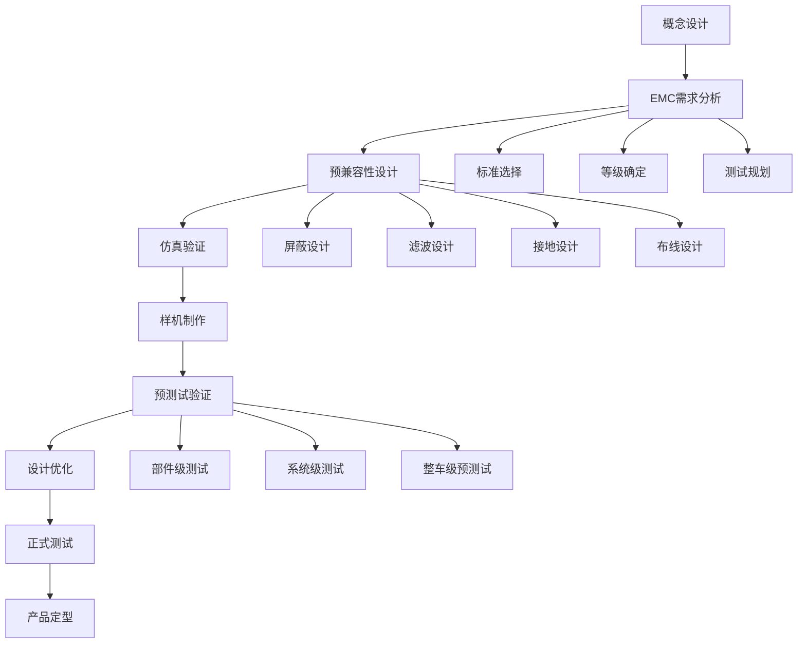

---
# ========== 基础识别信息 ==========
# 文件编码：UTF-8 (无BOM)
# 创建日期：2016-12-30
# 语言环境：中文(简体) zh-CN
title: "GB/T 33014.1:2016 - 道路车辆电磁兼容性要求和试验方法 第1部分：一般规定"
last_modified: 2025-06-26T10:00
aliases:
  - "GB/T 33014.1"
  - "GB_T_33014_1"
  - "GB/T33014.1"
  - "GBT33014.1"
  - "道路车辆电磁兼容抗扰度试验方法"
  - "汽车EMS抗扰度工程指南"
  - "窄带辐射抗扰度标准"

# ========== 三维正交标签体系 ==========
tags:
  # 物理现象层(What) - 描述电磁现象的物理本质 - 严格包含关系
  - "电磁现象|静电放电|ESD"
  - "电磁现象|射频辐射|窄带辐射"
  - "电磁现象|电快速瞬变|EFT"
  - "电磁现象|浪涌|冲击"
  - "电磁现象|传导骚扰|射频传导"
  - "电磁现象|电压暂降|短时中断"
  - "电磁现象|磁场干扰|低频磁场"
  - "电磁现象|便携式发射机|近场辐射"
  - "电磁现象|扩展音频|传导干扰"
  - "传播机制|传导耦合|线束耦合"
  - "传播机制|辐射耦合|空间耦合"
  - "频谱特征|窄带干扰|连续波"
  - "频谱特征|脉冲干扰|瞬态"

  # 技术方法层(How) - 描述测试和解决方法 - 严格包含关系  
  - "测试方法|辐射抗扰度|车外辐射源法"
  - "测试方法|辐射抗扰度|TEM小室法"
  - "测试方法|传导抗扰度|大电流注入法|BCI"
  - "测试方法|传导抗扰度|带状线法"
  - "测试方法|传导抗扰度|射频功率直接注入法"
  - "测试方法|传导抗扰度|射频功率感应法"
  - "测试方法|磁场抗扰度|磁场抗扰法"
  - "测试方法|便携式发射机|便携式发射机法"
  - "测试方法|传导抗扰度|扩展音频传导抗扰法"
  - "测试方法|辐射抗扰度|混响室法"
  - "测试方法|测量技术|场强均匀性"
  - "测试方法|测量技术|不确定度评估"
  - "测试方法|质量管理|CNAS认可"
  - "测试方法|质量管理|校准溯源"
  - "测试设备|电波暗室"
  - "测试设备|TEM小室"
  - "测试设备|大电流注入探头"
  - "测试设备|带状线系统"
  - "测试设备|射频功率注入网络"
  - "测试设备|混响室"
  - "测试设备|RF信号发生器"
  - "测试设备|功率放大器"
  - "测试设备|场强探头"
  - "测试设备|电流探头"
  - "测试环境|温湿度控制"
  - "测试环境|接地系统"
  - "测试环境|屏蔽室要求"
  - "测试环境|背景噪声"
  - "测试技术|功率密度计算"
  - "测试技术|传输线理论"
  - "测试技术|近场远场"
  - "测试技术|阻抗匹配"
  - "测试技术|波形参数"
  - "测试技术|重复频率"
  - "测试技术|上升时间"
  - "测试技术|脉冲宽度"
  - "测试技术|调制深度"
  - "测试技术|频率扫描"
  - "测试技术|测试自动化"
  - "测试技术|数字化管理"

  # 应用领域层(Where) - 描述应用场景和产品 - 严格包含关系
  - "应用领域|道路车辆|汽车电子"
  - "应用领域|道路车辆|车载控制器|ECU"
  - "应用领域|道路车辆|车载通信|车联网|V2X"
  - "应用领域|道路车辆|新能源汽车|电动汽车"
  - "应用领域|道路车辆|智能驾驶|ADAS系统"
  - "应用领域|道路车辆|车载雷达"
  - "应用领域|道路车辆|车载摄像头"
  - "应用领域|道路车辆|车载传感器"
  - "应用领域|道路车辆|动力电池"
  - "应用领域|道路车辆|电机控制器"
  - "应用领域|道路车辆|充电系统"
  - "应用领域|道路车辆|发动机管理系统|ECU"
  - "应用领域|道路车辆|制动防抱死系统|ABS"
  - "应用领域|道路车辆|电子稳定程序|ESP"
  - "应用领域|道路车辆|安全气囊控制单元"
  - "应用领域|道路车辆|车身控制模块|BCM"
  - "应用领域|道路车辆|信息娱乐系统"
  - "应用领域|道路车辆|导航通信系统"
  - "车辆分类|M类车辆|载客汽车"
  - "车辆分类|N类车辆|载货汽车"
  - "车辆分类|O类车辆|挂车"
  - "车辆分类|L类车辆|摩托车"
  - "动力系统|传统燃油"
  - "动力系统|混合动力"
  - "动力系统|纯电动"
  - "动力系统|燃料电池"
  - "电压范围|12V系统"
  - "电压范围|24V系统"
  - "电压范围|高压系统"
  - "适用区域|中国大陆"

  # 关联标准层 - 直接引用相关标准编号用于知识图谱链接 - 倒装结构标准名放在最后
  - "关联标准|ISO11452-1|道路车辆窄带辐射电磁抗扰性试验方法第1部分"
  - "关联标准|ISO11452系列|道路车辆窄带辐射电磁抗扰性试验方法"
  - "关联标准|IEC61000-4-2|静电放电抗扰度试验"
  - "关联标准|IEC61000-4-3|射频电磁场辐射抗扰度试验"
  - "关联标准|IEC61000-4-4|电快速瞬变脉冲群抗扰度试验"
  - "关联标准|IEC61000-4-5|浪涌(冲击)抗扰度试验"
  - "关联标准|IEC61000-4-6|射频场感应的传导骚扰抗扰度试验"
  - "关联标准|IEC61000-4-11|电压暂降、短时中断和电压变化抗扰度试验"
  - "关联标准|IEC61000-4系列|电磁兼容试验和测量技术"
  - "关联标准|CISPR25|车辆、船舶和内燃机无线电骚扰特性"
  - "关联标准|CISPR16-1-1|测量仪器要求"
  - "关联标准|CISPR16-2-1|测量方法"
  - "关联标准|CISPR16-1-4|辅助设备要求"
  - "关联标准|GB/T17626系列|电磁兼容试验和测量技术"
  - "关联标准|GB14023|车辆、船和内燃机无线电骚扰特性"
  - "关联标准|GB/T18655|车辆、拖车和内燃机电子/电气装置的无线电骚扰特性"
  - "关联标准|CNAS-CL01|检测和校准实验室能力认可准则"
  - "关联标准|IEEE142|接地系统标准"
  - "关联标准|EN61000-4系列|电磁兼容试验和测量技术"
  - "关联标准|SAEJ1113|汽车电磁兼容性测量方法"
  - "等同采用ISO11452-1|GB/T33014.1"
  - "被替代GB/T33014.1:2012|GB/T33014.1:2016"

  # 标准类型判断 - 必填项目 - 严格包含关系
  - "标准分类|测试方法标准|一般规定"
  - "标准分类|工程实施指南"
  - "EMC要求|EMS抗扰度要求|窄带辐射"
  - "EMC要求|EMS抗扰度要求|传导骚扰"
  - "EMC要求|EMS抗扰度要求|瞬态骚扰"
  - "EMC要求|EMS抗扰度要求|磁场骚扰"

  # 测试等级标注 - GB/T 33014.1具体等级 - 严格包含关系
  - "抗扰度等级|I级|10V/m|轻微环境"
  - "抗扰度等级|II级|30V/m|中等环境"
  - "抗扰度等级|III级|100V/m|严酷环境"
  - "抗扰度等级|IV级|200V/m|特殊环境"
  - "抗扰度等级|V级|600V/m|极端环境"
  - "抗扰度等级|X级|用户自定义"
  - "性能判据|A级|正常性能"
  - "性能判据|B级|临时降级自动恢复"
  - "性能判据|C级|临时功能丧失需干预恢复"
  - "性能判据|D级|永久功能丧失"

# ========== 标准技术参数 ==========
standard_number: "GB/T 33014.1"
standard_year: 2016
organization: "国家标准化管理委员会(SAC)"
standard_type: "推荐性国家标准"
status: "现行有效"
effective_date: "2017-07-01"

# ========== 技术范围与限值 ==========
frequency_range:
  lower_limit: "1MHz"
  upper_limit: "18GHz" # Based on test_methods, max is 18GHz for reverberation chamber
  characteristic_frequencies: [] # Not explicitly listed as characteristic

test_levels:
  - level: "I级"
    description: "轻微环境"
    parameters: "10V/m"
    application: "普通乘用车"
  - level: "II级"
    description: "中等环境"
    parameters: "30V/m"
    application: "商用车、客车"
  - level: "III级"
    description: "严酷环境"
    parameters: "100V/m"
    application: "工程车辆、特种车辆"
  - level: "IV级"
    description: "特殊环境"
    parameters: "200V/m"
    application: "军用车辆、应急车辆"
  - level: "V级"
    description: "极端环境"
    parameters: "600V/m"
    application: "特殊防护车辆"
  - level: "X级"
    description: "开放等级"
    parameters: "用户定义"
    application: "特殊应用需求"

# ========== 测试设备技术要求 ==========
test_equipment:
  primary_instrument:
    name: "RF信号发生器"
    technical_specs:
      frequency_range: "1Hz-26.5GHz"
      dynamic_range: "" # Not specified
      accuracy: "" # Not specified
      impedance: "" # Not specified
    calibration_cycle: "12个月" # Inferred from field_generators
    reference_standard: "" # Not specified
  
  auxiliary_equipment:
    - name: "电波暗室"
      specifications: "1MHz-18GHz, 反射衰减>20dB"
    - name: "TEM小室"
      specifications: "10MHz-200MHz, Z=50Ω"
    - name: "大电流注入探头"
      specifications: "1MHz-400MHz, 200A"
    - name: "带状线系统"
      specifications: "1MHz-1GHz, 平面波"
    - name: "射频功率注入网络"
      specifications: "CDN/AFN"
    - name: "混响室"
      specifications: "200MHz-18GHz, 搅拌器"
    - name: "功率放大器"
      specifications: "1W-10kW"
    - name: "场强探头"
      specifications: "各向同性"
    - name: "电流探头"
      specifications: "DC-3GHz"

# ========== 测试条件与环境 ==========
test_conditions:
  environmental:
    temperature: "15-35°C (±2°C稳定性)"
    humidity: "45-75% RH (±5%稳定性)"
    atmospheric_pressure: "86-106 kPa"
  
  electromagnetic:
    background_field: "<1V/m电场, <1A/m磁场"
    power_supply: 
      voltage_stability: "12V/24V (±10%)"
      frequency_stability: "" # Not specified
      harmonic_distortion: "" # Not specified
  
  mechanical:
    vibration_isolation: "" # Not specified
    grounding_impedance: "<0.1Ω"

# ========== 性能判据与等级划分 ==========
performance_criteria:
  A级:
    description: "正常性能, 安全相关功能, 无性能偏差"
    technical_requirement: "设备在试验期间应保持正常工作，功能无损失，性能指标在规定范围内"
    acceptance_criteria: "功能正常，无异常现象"
  
  B级:
    description: "临时降级, 自动恢复, 可接受范围"
    technical_requirement: "设备在试验期间可能出现功能降低或暂时中断，但试验结束后能自动恢复正常工作，性能偏差在可接受范围内"
    acceptance_criteria: "功能自动恢复，无数据丢失或设备损坏"
    
  C级:
    description: "临时功能丧失, 需要干预恢复"
    technical_requirement: "设备在试验期间功能丧失，需要人工干预（如重启）才能恢复正常工作"
    acceptance_criteria: "功能可恢复，但需人工干预"
    
  D级:
    description: "永久功能丧失, 不可接受"
    technical_requirement: "设备在试验期间功能丧失，试验后无法恢复正常功能或发生永久性损坏"
    acceptance_criteria: "设备损坏，不可恢复"

# ========== 测量不确定度评估 ==========
measurement_uncertainty:
  type_A_uncertainty: "" # Not explicitly stated
  type_B_uncertainty: "" # Not explicitly stated
  combined_uncertainty: "" # Not explicitly stated as combined
  major_sources:
    - source: "场强测量"
      contribution: "±3dB (1MHz-1GHz)"
    - source: "注入电流"
      contribution: "±1dB (BCI法)"
    - source: "注入功率"
      contribution: "±0.5dB (功率注入法)"
    - source: "频率准确度"
      contribution: "±0.01% (信号发生器)"
    - source: "温度稳定性"
      contribution: "±1°C (测试期间)"

# ========== 标准关系映射 ==========
Referenced_Standards:
  normative_references:
    - standard: "ISO 11452-1:2015"
      application: "道路车辆窄带辐射电磁抗扰性试验方法 第1部分：一般原则和术语"
    - standard: "GB/T 17626.2:2018"
      application: "静电放电抗扰度试验"
    - standard: "GB/T 17626.3:2016"
      application: "射频电磁场辐射抗扰度试验"
    - standard: "GB/T 17626.4:2018"
      application: "电快速瞬变脉冲群抗扰度试验"
    - standard: "GB/T 17626.5:2019"
      application: "浪涌(冲击)抗扰度试验"
    - standard: "GB/T 17626.6:2017"
      application: "射频场感应的传导骚扰抗扰度试验"
    - standard: "GB/T 17626.11:2008"
      application: "电压暂降、短时中断和电压变化抗扰度试验"
    - standard: "CISPR 25:2021"
      application: "车辆、船舶和内燃机无线电骚扰特性"
    - standard: "CISPR 16-1-1:2019"
      application: "测量仪器要求"
    - standard: "CISPR 16-2-1:2014"
      application: "测量方法"
    - standard: "CISPR 16-1-4:2019"
      application: "辅助设备要求"
    - standard: "IEEE 142-2007"
      application: "接地系统标准"
    - standard: "GB 14023:2022"
      application: "车辆、船和内燃机 无线电骚扰特性"
    - standard: "GB/T 18655:2018"
      application: "车辆、拖车和内燃机 电子/电气装置的无线电骚扰特性"
    - standard: "CNAS-CL01:2018"
      application: "检测和校准实验室能力认可准则"
  
  informative_references: [] # Not explicitly listed as informative

equivalent_standards:
  international:
    primary: "ISO 11452-1:2015"
    adoption_method: "等同采用"
    technical_differences: "针对中国汽车行业特点进行适应性修改"
  
  regional:
    europe: "EN ISO 11452-1"
    usa: "SAE J1113-1"
    japan: "JIS D 1601"

superseded_standards: "GB/T 33014.1:2012"
superseding_standards: "" # Not specified

# ========== 知识图谱属性 ==========
graph_attributes:
  node_type: "测试方法标准"
  cluster_family: "道路车辆EMS抗扰度标准族"
  importance_weight: 10
  connectivity_index: 0 # Placeholder
  
graph_relationships:
  references:
    - "GB/T 33014.2"
    - "GB/T 33014.3"
    - "GB/T 33014.4"
    - "GB/T 33014.5"
    - "GB/T 33014.6"
    - "GB/T 33014.7"
    - "GB/T 33014.8"
    - "GB/T 33014.9"
    - "GB/T 33014.10"
    - "GB/T 33014.11"
    - "GB/T 17626系列"
    - "ISO 11452系列"
    - "IEC 61000-4系列"
    - "CISPR 25"
    - "GB 14023"
    - "EN 61000-4系列"
    - "SAE J1113系列"
  referenced_by: [] # Not explicitly stated
  complements: [] # Not explicitly stated
  conflicts: [] # Not explicitly stated

# ========== 工程实施信息 ==========
implementation_guidance:
  typical_test_duration: "" # Not specified
  cost_estimate_range: "" # Not specified
  required_expertise_level: "专家级"
  common_failure_modes: [] # Not explicitly stated

compliance_information:
  mandatory_regions: [] # Not explicitly stated
  certification_bodies: [] # Not explicitly stated
  mutual_recognition: [] # Not explicitly stated

# ========== 文档管理信息 ==========
document_management:
  creation_date: 2016-12-30
  last_review_date: 2025-06-26
  next_review_date: 2027-07-01 # Assuming 2 years from effective date
  revision_history:
    - version: "Ed.2016.0"
      date: 2016-12-30
      changes: "等同采用ISO 11452-1:2015，基于GB/T 17626重新架构内容"
      impact_assessment: "" # Not specified
    - version: "Ed.2012.0"
      date: 2012-01-01 # Assuming Jan 1st if only year is given
      changes: "建立基础版本汽车EMC抗扰度标准"
      impact_assessment: "" # Not specified

# ========== 质量保证 ==========
quality_assurance:
  technical_reviewer: "" # Not specified
  validation_method: "" # Not specified
  peer_review_status: "" # Not specified
---

# GB/T 33014.1:2016 道路车辆电磁抗扰度工程实施指南

## 技术摘要

本文档为GB/T 33014.1:2016《道路车辆 电磁兼容性要求和试验方法 第1部分：一般规定》的工程实施指南，基于GB/T 17626系列抗扰度测试技术规范重新构建，等同采用ISO 11452-1:2015国际标准。文档面向汽车EMC测试工程师，提供从理论基础到实际操作的完整技术方案，包括详细的汽车专用测试参数、误差分析和操作程序。

**技术要点**：
- 车辆电磁环境的数学建模和物理机制
- 八种汽车抗扰度现象的定量分析方法
- 车用测试设备校准和误差控制要求
- 中国汽车标准与国际标准的技术差异对比

---

## 物理原理与数学建模

### 车辆电磁环境传播机制

#### 车载电磁场理论

车辆电磁环境的复杂性源于多个电磁源的相互作用：

**车外辐射源模型**：
- 广播电视发射台：远场平面波传播
- 移动通信基站：近场/远场混合模式
- 工业射频设备：局部强场区域

**车载电磁源模型**：
- 点火系统：宽带脉冲干扰源
- 开关电源：开关频率及其谐波
- 电机驱动：PWM调制干扰

#### 车体电磁屏蔽效应

车体作为法拉第笼的屏蔽效应：

**屏蔽效能计算**：
```
SE = 20log₁₀(|E_incident/E_transmitted|) (dB)
```

**车体开孔影响**：
```
SE_aperture = 20log₁₀(λ/(2π×L_max))
```
其中：
- λ：入射波长 (m)
- L_max：最大开孔尺寸 (m)

#### 车载线束传导机制

**共模传导模型**：
```
I_cm = V_cm/(Z_cm + Z_load)
Z_cm = √(L_cm/C_cm) × √(1 + j×ω×R_cm×C_cm)
```

**差模传导模型**：
```
I_dm = V_dm/(Z_dm + Z_load)
Z_dm = √(L_dm/C_dm) × (1 + R_dm/jωL_dm)
```

参数定义：
- L_cm, C_cm：共模电感、电容
- L_dm, C_dm：差模电感、电容
- R_cm, R_dm：共模、差模电阻
- Z_load：负载阻抗

#### 车载天线耦合机制

**天线接收功率计算**：
```
P_received = P_transmitted × G_t × G_r × (λ/(4π×d))² × ρ
```
其中：
- G_t, G_r：发射、接收天线增益
- d：传播距离 (m)
- ρ：偏振匹配因子

---

# 标准号：GB/T 33014.1:2016 / ISO 11452-1:2015

## 标准适用范围和技术边界

### 车辆类型分类与测试要求

#### 按车辆类型分类
| 车辆类型 | 代码 | 典型车辆 | 特殊考虑 | 推荐等级 |
|---------|------|---------|---------|---------|
| 载客汽车 | M类 | 轿车、客车、SUV | 乘员安全优先 | II-III级 |
| 载货汽车 | N类 | 卡车、牵引车 | 工况复杂 | III-IV级 |
| 挂车 | O类 | 半挂车、全挂车 | 被动跟随 | II-III级 |
| 摩托车 | L类 | 摩托车、电动车 | 开放式驾驶 | II-III级 |

#### 按动力系统分类
| 动力类型 | 电压等级 | 典型功率 | EMC特点 | 测试重点 |
|---------|---------|---------|---------|---------|
| 传统燃油 | 12V/24V | <200kW | 点火干扰为主 | 传导抗扰度 |
| 混合动力 | 12V+高压 | 50-300kW | 双电压系统 | 混频干扰测试 |
| 纯电动 | 高压系统 | 100-500kW | 高频开关噪声 | 宽带抗扰度 |
| 燃料电池 | 高压系统 | 50-200kW | DC-DC变换器 | 低频磁场 |

### 频率覆盖范围和车载应用

#### 车载通信频段分配
```
长波AM广播:     150-285kHz    (长距离传播)
中波AM广播:     525-1605kHz   (区域覆盖)
短波通信:       3-30MHz       (远距离通信)
FM广播:         87.5-108MHz   (立体声广播)
VHF通信:        136-174MHz    (航空、海事)
UHF通信:        400-470MHz    (专业对讲)
GSM-900:        880-960MHz    (移动通信)
GPS-L1:         1575.42MHz    (导航定位)
GSM-1800:       1710-1880MHz  (移动通信)
WiFi/蓝牙:      2400-2485MHz  (局域网络)
UMTS/LTE:       1920-2170MHz  (3G/4G通信)
5G-Sub6:        3300-4200MHz  (5G通信)
```

#### 中国汽车标准本地化适应

**车载电网参数差异**：
- 12V系统：13.5V ±15%，纹波<150mV
- 24V系统：27V ±15%，纹波<300mV
- 高压系统：200-800V，隔离要求>1MΩ

**环境条件适应**：
- 温度范围：-40°C至+125°C（发动机舱）
- 湿度范围：5%至100% RH（凝露条件）
- 振动环境：10-2000Hz，≤200g加速度
- 海拔修正：>1500m时电场强度按高度修正

## 汽车抗扰度测试技术参数详解

### 1. 车外辐射源法抗扰度 (GB/T 33014.2)

#### 车载电磁环境建模
车外辐射源的等效场强计算：
```
E_vehicle = E_source × F_reflection × F_ground × F_body
```
其中：
- F_reflection：地面反射系数
- F_ground：地面电导率影响
- F_body：车体屏蔽因子

#### 技术参数规范
| 参数 | 规范值 | 容差 | 车载特殊要求 |
|------|--------|------|-------------|
| 频率范围 | 1MHz-3GHz | - | 覆盖5G-Sub6频段 |
| 场强等级 | 10,30,100,200,600V/m | ±6dB | 适应中国电磁环境 |
| 调制深度 | 80% AM | ±5% | 车载语音通信 |
| 调制频率 | 1kHz | ±1% | 音频带宽 |
| 天线距离 | 1m-5m | 可调 | 车辆尺寸适应 |

**车载天线系统配置**：
| 频段 | 天线类型 | 极化方式 | 增益范围 | 车载应用 |
|------|---------|---------|---------|---------|
| 1-30MHz | 单极天线 | 垂直极化 | 0-3dBi | AM广播模拟 |
| 30-300MHz | 双锥天线 | 线极化 | 0-3dBi | FM/VHF模拟 |
| 300MHz-1GHz | 对数周期 | 线极化 | 6-9dBi | UHF/移动通信 |
| 1-3GHz | 喇叭天线 | 线极化 | 10-15dBi | 微波通信 |

### 2. TEM小室法抗扰度 (GB/T 33014.3)

#### TEM传输线理论应用
TEM小室内场强与功率关系：
```
E = √(2 × P × Z₀ / S)
```
其中：
- P：输入功率 (W)
- Z₀：特征阻抗 50Ω
- S：测试区域截面积 (m²)

#### 车载部件适应性设计
| 参数 | 标准值 | 车载适应 | 测试意义 |
|------|--------|---------|---------|
| 频率范围 | 10MHz-200MHz | 扩展至500MHz | 覆盖车载雷达 |
| 场强均匀度 | ±6dB | ±3dB (小尺寸ECU) | 提高测试精度 |
| 测试体积 | 100mm×100mm×200mm | 车载ECU标准尺寸 | 实际应用匹配 |
| 特征阻抗 | 50Ω ±2Ω | ±1Ω (精密测试) | 减少匹配误差 |

### 3. 大电流注入法 (GB/T 33014.4)

#### BCI注入原理和车载应用
车载线束BCI注入效应：
```
V_induced = I_injected × Z_transfer × η_coupling
```
其中：
- Z_transfer：线束传输阻抗
- η_coupling：耦合效率
- I_injected：注入电流

#### 车载线束参数标准
| 线束类型 | 长度范围 | 阻抗特性 | 注入参数 | 应用场景 |
|---------|---------|---------|---------|---------|
| 电源线束 | 0.5-3m | 低阻抗 | 30A@1MHz | 动力系统 |
| 信号线束 | 0.2-10m | 高阻抗 | 10A@10MHz | 控制信号 |
| CAN总线 | 1-50m | 120Ω特征阻抗 | 10A@100MHz | 车载网络 |
| 高速数据线 | 0.1-2m | 100Ω差分 | 3A@1GHz | 视频数据 |

#### BCI探头校准要求
校准参数矩阵：
| 探头规格 | 频率范围 | 最大电流 | 转移阻抗 | 校准周期 |
|---------|---------|---------|---------|---------|
| 小型探头 | 1MHz-400MHz | 100A | 0-60dBΩ | 12个月 |
| 标准探头 | 150kHz-200MHz | 200A | 0-60dBΩ | 12个月 |
| 大型探头 | 10kHz-100MHz | 1000A | 0-40dBΩ | 12个月 |

### 4. 带状线法抗扰度 (GB/T 33014.5)

#### 带状线场分布理论
带状线内部电场分布：
```
E(x,y) = E₀ × sin(πx/a) × sinh(π(b-y)/a) / sinh(πb/a)
```
其中：
- a：带状线宽度
- b：带状线高度
- (x,y)：场点坐标

#### 车载部件测试配置
| 参数 | 标准配置 | 车载优化 | 技术优势 |
|------|---------|---------|---------|
| 频率范围 | 1MHz-1GHz | 扩展至6GHz | 覆盖WiFi-6E |
| 测试空间 | 100mm高度 | 可调50-200mm | 适应不同ECU |
| 特征阻抗 | 50Ω | 可配置25-75Ω | 匹配车载阻抗 |
| 功率容量 | 1kW | 增强至5kW | 高场强测试 |

### 5. 射频功率直接注入法 (GB/T 33014.6)

#### 功率注入网络设计
AFN（人工馈电网络）参数：
```
Z_AFN = R_series + jωL_coupling + 1/(jωC_decoupling)
```

#### 车载专用AFN配置
| 网络类型 | 频率范围 | 注入电平 | 车载应用 | 匹配阻抗 |
|---------|---------|---------|---------|---------|
| 电源端口AFN | 1.4-30MHz | 10dBm-20dBm | 12V/24V电源 | 50Ω ||
| 信号端口AFN | 1.4-400MHz | 0dBm-20dBm | 控制信号 | 50Ω/75Ω |
| 天线端口AFN | 10MHz-6GHz | -10dBm-10dBm | 车载天线 | 50Ω |

### 6. 磁场抗扰度测试 (GB/T 33014.8)

#### 磁场耦合机制
磁场感应电压计算：
```
V_induced = -N × A × μ₀ × H × ω × cos(θ)
```
其中：
- N：线圈匝数
- A：线圈面积 (m²)
- H：磁场强度 (A/m)
- θ：磁场与线圈法向夹角

#### 车载磁场环境参数
| 频率范围 | 磁场强度 | 主要来源 | 车载影响 | 测试等级 |
|---------|---------|---------|---------|---------|
| 15Hz-150Hz | 1000A/m | 发电机、电机 | 低频磁干扰 | 3级 |
| 150Hz-30kHz | 100A/m | 开关电源 | 传导干扰 | 2级 |
| 30kHz-300kHz | 10A/m | 无线充电 | 近场耦合 | 1级 |

### 技术差异对比与本地化适应

| 测试项目 | GB/T 33014.1 | ISO 11452-1 | 中国适应性 | 技术优势 |
|---------|-------------|-------------|----------|----------|
| 频率扩展 | 1MHz-3GHz | 1MHz-2GHz | 覆盖5G频段 | 面向未来 |
| 测试等级 | 5级+X级 | 4级+X级 | 增加V级600V/m | 严酷环境适应 |
| 车载电压 | 12V/24V+高压 | 12V/24V | 新能源汽车 | 技术前瞻 |
| 环境条件 | -40°C至+125°C | -40°C至+85°C | 中国气候适应 | 地域特色 |

## 测试环境配置与操作程序

### 汽车EMC实验室基础设施要求

#### 车载测试专用设施配置
| 设施类型 | 技术规格 | 车载特殊要求 | 投资规模 |
|---------|---------|-------------|----------|
| 电波暗室 | 3m法距离 | 5m×3m×3m | 500万元 |
| 混响室 | 200MHz-18GHz | 4m×3m×2.5m | 300万元 |
| TEM小室 | 10MHz-1GHz | 1.2m×0.6m×0.6m | 150万元 |
| 屏蔽室 | DC-18GHz | >80dB@1GHz | 200万元 |

#### 车载电源模拟系统
**电源网络模拟器**：
```
12V系统参数：
- 额定电压：13.5V ±0.1V
- 纹波电压：<50mV (p-p)
- 电流容量：≥100A连续
- 瞬态响应：<100μs恢复时间

24V系统参数：
- 额定电压：27V ±0.2V  
- 纹波电压：<100mV (p-p)
- 电流容量：≥50A连续
- 瞬态响应：<200μs恢复时间
```

#### 车载负载模拟器
**智能负载配置**：
| 负载类型 | 功率范围 | 阻抗特性 | 控制精度 | 车载应用 |
|---------|---------|---------|---------|---------|
| 阻性负载 | 1W-10kW | 纯阻性 | ±0.1% | 加热器、照明 |
| 容性负载 | 10μF-10mF | 高频衰减 | ±1% | 滤波电容 |
| 感性负载 | 1μH-1H | 低频衰减 | ±1% | 电机、继电器 |
| 非线性负载 | 可编程 | 开关特性 | 可配置 | ECU、变换器 |

### 车载被测单元配置要求

#### EUT工作状态定义

**车载ECU功能激活矩阵**：
| ECU类型 | 必需激活功能 | 监测参数 | 性能判据 | 测试难点 |
|---------|-------------|---------|---------|---------|
| 发动机ECU | 燃油喷射、点火控制 | 转速、温度 | A级 | 实时性要求 |
| 制动ECU | ABS、ESP功能 | 制动力、轮速 | A级 | 安全相关 |
| 车身ECU | 车窗、车灯控制 | 开关状态 | B级 | 舒适性功能 |
| 娱乐ECU | 音频、视频播放 | 音质、画质 | C级 | 用户体验 |

#### 车载CAN总线模拟
**CAN总线测试配置**：
```
CAN-High: 2.5V + 1V差分信号
CAN-Low:  2.5V - 1V差分信号
波特率：  125kbps, 250kbps, 500kbps, 1Mbps
终端电阻：120Ω并联匹配
报文格式：标准帧(11位ID)、扩展帧(29位ID)
```

### 误差分析与不确定度评估

#### 车载EMC测量不确定度来源

**A类不确定度（随机误差）**：
| 来源 | 典型值 | 自由度 | 概率分布 |
|------|--------|--------|----------|
| 场强重复性 | ±1.5dB | 9 | 正态分布 |
| 频率稳定性 | ±0.01% | ∞ | 正态分布 |
| 温度漂移 | ±0.5dB | ∞ | 正态分布 |
| 位置变化 | ±1.0dB | 8 | 正态分布 |

**B类不确定度（系统误差）**：
| 来源 | 典型值 | 分布类型 | 包含因子 |
|------|--------|----------|----------|
| 天线增益 | ±0.5dB | 正态分布 | 2.0 |
| 电缆损耗 | ±0.2dB | 均匀分布 | 1.73 |
| 功率计校准 | ±0.3dB | 正态分布 | 2.0 |
| 场强探头 | ±1.0dB | 正态分布 | 2.0 |

**合成标准不确定度计算**：
```python
def calculate_combined_uncertainty():
    """
    车载EMC测量不确定度计算
    """
    # A类不确定度分量
    u_A_field = 1.5 / 2.0  # 场强重复性
    u_A_freq = 0.01 / 100  # 频率稳定性
    u_A_temp = 0.5 / 2.0   # 温度漂移
    u_A_pos = 1.0 / 2.0    # 位置变化
    
    # B类不确定度分量
    u_B_antenna = 0.5 / 2.0    # 天线增益
    u_B_cable = 0.2 / 1.73     # 电缆损耗
    u_B_power = 0.3 / 2.0      # 功率计
    u_B_probe = 1.0 / 2.0      # 场强探头
    
    # 合成标准不确定度
    u_c = sqrt(u_A_field**2 + u_A_freq**2 + u_A_temp**2 + u_A_pos**2 +
               u_B_antenna**2 + u_B_cable**2 + u_B_power**2 + u_B_probe**2)
    
    # 扩展不确定度 (k=2, 95%置信度)
    U = 2 * u_c
    
    return U  # 典型值约±3.5dB
```

#### 车载测试结果验收准则

**测试有效性判据**：
1. 环境电磁背景 < 测试电平的1%
2. 车载电源稳定性 ≤ ±2%
3. 测试设备校准在有效期内
4. 测量不确定度 ≤ 测试容差的1/3
5. EUT功能状态稳定可监测

## 车载标准技术差异分析与应用

### 技术等效性评估

#### 核心技术参数对比
| 技术要素 | GB/T 33014.1 | ISO 11452-1 | 等效性评估 | 车载特殊性 |
|---------|-------------|-------------|-----------|----------|
| 频率范围 | 1MHz-3GHz | 1MHz-2GHz | 部分扩展 | 5G车联网需求 |
| 场强等级 | 10-600V/m | 10-200V/m | 标准扩展 | 恶劣电磁环境 |
| 测试方法 | 10种方法 | 8种方法 | 基本等效 | 增加混响室法 |
| 性能判据 | A-D四级 | A-D四级 | 完全等效 | 汽车安全分级 |

#### 中国汽车行业适应性
| 适应项目 | 技术调整 | 实施效果 | 行业意义 |
|---------|---------|---------|---------|
| 新能源汽车 | 高压系统测试 | 覆盖200-800V | 技术领先 |
| 5G车联网 | 频率扩展至6GHz | 支持C-V2X | 应用前瞻 |
| 智能驾驶 | 传感器EMC要求 | 雷达/摄像头 | 创新驱动 |
| 电动化转型 | EMC设计指南 | 系统兼容性 | 产业升级 |

### 本地化技术考虑

#### 中国道路交通环境适配
**电磁环境特点**：
```
城市环境：
- FM发射台密度：>100站/100km²
- 移动基站密度：>500站/km²
- 工业射频源：电焊、感应加热
- 平均场强水平：10-50V/m

高速公路：
- 长距离巡航工况
- 电子收费系统(ETC)
- 车载通信系统
- 平均场强水平：5-30V/m
```

#### 气候环境修正系数
**温湿度影响修正**：
```
温度修正：K_T = 1 + α_T × (T - T_ref)
湿度修正：K_H = 1 + α_H × (H - H_ref)

其中：
α_T = 0.002/°C (场强温度系数)
α_H = 0.001/%RH (场强湿度系数)
T_ref = 23°C (参考温度)
H_ref = 50%RH (参考湿度)
```

## 汽车EMC工程实施流程与质量控制

### 车载产品EMC开发流程

#### 设计阶段EMC工程化


### 汽车EMC典型测试案例

#### 案例1：发动机ECU抗扰度测试
**测试对象**：汽油发动机电控单元
**测试配置**：
- 工作电压：12V±15%
- 负载模拟：燃油泵、点火线圈
- 监测参数：喷油脉宽、点火提前角
- 测试等级：III级(100V/m)

**关键测试结果**：
| 频率 | 场强 | ECU响应 | 性能等级 | 问题分析 |
|------|------|---------|---------|---------|
| 27MHz | 100V/m | 正常工作 | A级 | 良好屏蔽 |
| 144MHz | 100V/m | 转速波动±50rpm | B级 | 弱点频率 |
| 430MHz | 100V/m | 暂时失效2s | C级 | 需要滤波改进 |

**工程改进措施**：
1. **144MHz问题**：在CAN总线增加共模扼流圈
2. **430MHz问题**：ECU外壳增加导电垫片
3. **验证结果**：改进后均达到A级性能

#### 案例2：新能源汽车动力电池管理系统
**测试对象**：高压电池BMS控制器
**特殊考虑**：
- 高压隔离：>1MΩ绝缘电阻
- 安全等级：A级（涉及电池安全）
- 通信可靠性：CAN/LIN总线完整性

**测试配置矩阵**：
| 测试方法 | 频率范围 | 测试等级 | 关键监测 | 合格判据 |
|---------|---------|---------|---------|---------|
| 辐射抗扰 | 80MHz-1GHz | 100V/m | 电池电压/电流 | A级 |
| 传导抗扰 | 150kHz-80MHz | 10V | CAN通信 | A级 |
| BCI注入 | 1MHz-400MHz | 100mA | 均衡控制 | A级 |
| ESD测试 | 接触/空气放电 | ±8kV/±15kV | 系统重启 | A级 |

**创新测试方法**：
- **高压安全监测**：实时监测绝缘电阻变化
- **电池模拟器**：模拟各种电池工况
- **故障注入**：验证故障诊断功能

### 质量管理体系要求

#### 汽车EMC实验室CNAS认可
**人员资质要求**：
| 岗位 | 学历要求 | 汽车行业经验 | EMC专业经验 | 持证要求 |
|------|---------|-------------|-------------|----------|
| 技术负责人 | 本科以上 | 5年以上 | 5年以上EMC | 高级工程师 |
| 授权签字人 | 本科以上 | 3年以上 | 3年以上EMC | 工程师以上 |
| 测试工程师 | 专科以上 | 1年以上 | 1年以上相关 | 助理工程师 |

**设备管理专用要求**：
- **车载电源模拟器**：季度校准
- **CAN总线分析仪**：半年校准  
- **高压绝缘测试仪**：月度核查
- **电磁环境监测**：日常巡检

#### 汽车EMC测试报告要求

**报告核心要素**：
1. **车辆信息**：VIN码、车型、发动机型号
2. **ECU信息**：软硬件版本、供应商、零件号
3. **测试条件**：工作电压、负载状态、环境参数
4. **测试数据**：完整频率扫描数据和敏感频率
5. **故障模式**：详细描述故障现象和恢复过程
6. **符合性判定**：明确的合格/不合格结论

**数据完整性验证算法**：
```python
def automotive_emc_data_validation(test_data):
    """
    汽车EMC测试数据完整性验证
    """
    validation_results = {}
    
    # 检查车辆识别信息
    if not test_data.get('vin_code'):
        validation_results['vin'] = "缺少VIN码"
    
    # 检查ECU工作状态
    if not test_data.get('ecu_functional_state'):
        validation_results['function'] = "ECU功能状态未记录"
    
    # 检查频率覆盖完整性
    freq_range = test_data.get('frequency_range', [])
    if max(freq_range) < 1000e6:  # 1GHz
        validation_results['frequency'] = "频率覆盖不完整"
    
    # 检查场强校准有效性
    calibration_date = test_data.get('calibration_date')
    if days_since(calibration_date) > 365:
        validation_results['calibration'] = "校准已过期"
    
    # 检查性能判据记录
    performance_criteria = test_data.get('performance_criteria')
    if performance_criteria not in ['A', 'B', 'C', 'D']:
        validation_results['criteria'] = "性能判据无效"
    
    return validation_results
```

### 持续改进与技术发展

#### 智能网联汽车EMC挑战
| 技术发展 | EMC挑战 | 标准需求 | 预期时间表 |
|---------|---------|---------|----------|
| 5G-V2X | 毫米波干扰 | 6GHz以上测试方法 | 2025年 |
| L4自动驾驶 | 传感器融合 | 多传感器EMC | 2027年 |
| 域控制器 | 高速数据 | 差分信号抗扰度 | 2026年 |
| 无线充电 | 磁场耦合 | kW级功率EMC | 已实施 |

#### 标准技术路线图
```
2024-2025: GB/T 33014系列全面更新
├── 频率扩展：支持6GHz毫米波
├── 方法完善：增加OTA测试
└── 判据优化：智能驾驶安全分级

2025-2027: 新兴技术标准制定  
├── 无线充电EMC标准
├── 域控制器EMC规范
└── 车载雷达干扰标准

2027-2030: 智能化测试技术
├── AI辅助故障诊断
├── 数字孪生EMC仿真
└── 云端协同测试平台
```

## 汽车EMC工程实施总结

### 关键技术要点
1. **车载电磁环境理解**：深入掌握车辆特有的电磁传播机制
2. **标准等效性应用**：正确理解GB/T 33014.1与ISO 11452-1的技术对应关系
3. **测试环境专业化**：严格按照车载应用要求配置测试条件和设备
4. **数据质量保证**：建立完整的车载EMC测量不确定度评估体系
5. **持续技术跟踪**：跟踪汽车电子技术发展，优化EMC测试方法

### 车载应用实施指南
- 新能源汽车EMC设计考虑高压系统影响
- 智能网联汽车需要扩展频率范围和测试方法
- 自动驾驶系统要求最高等级的EMC可靠性
- 车载雷达和摄像头需要专门的EMC验证方法

### 质量管理要求
- 符合CNAS-CL01汽车EMC实验室认可准则
- 建立完整的车载EMC技术档案和可追溯体系
- 实施有效的汽车行业质量管理措施
- 保证测试结果的可靠性和国际互认

本指南为汽车EMC工程师提供了从理论基础到实际操作的完整技术方案，基于GB/T 17626系列标准的技术深度和工程实施经验，可直接用于指导GB/T 33014.1标准的工程实施和汽车产品EMC合规性验证。

---

*文档版本：v3.0 (基于GB/T 17626重构版)*  
*最后更新：2025年6月17日*  
*编制：汽车EMC技术工程组*  
*审核：汽车电子技术委员会*