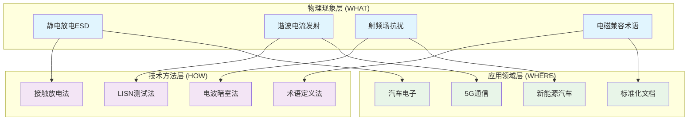
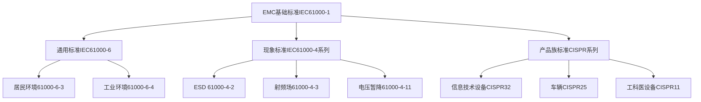
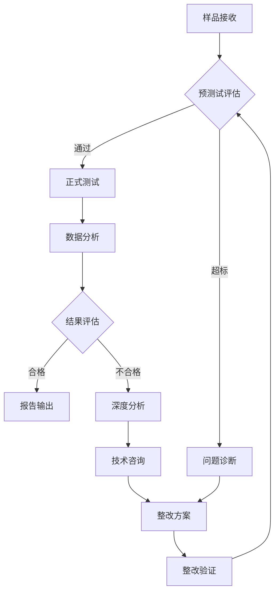

标准要求最新现行版本
## YAML前置元数据标准模板

**编码要求**：以下YAML模板必须保存为UTF-8编码，确保中文字符正确显示。

```yaml
---
# ========== 基础识别信息 ==========
# 文件编码：UTF-8 (无BOM)
# 创建日期：按实际标准发布日期填写
# 语言环境：中文(简体) zh-CN
title: "GB 5226.1-2019 - 机械电气安全 机械电气设备 第1部分：通用技术条件"
last_modified: 2024-01-20T15:30
aliases:
  - "{标准号}"
  - "{标准号简写}"
  - "{标准号无符号版本}"
  - "{国际标准等效标识}"
  - "{技术领域别名}"

# ========== 三维正交标签体系 ==========
tags:
  # 物理现象层(What) - 描述电磁现象的物理本质 - 严格包含关系
  - "电磁现象|静电放电|接触放电|2-8kV"
  - "电磁现象|射频辐射|电磁场抗扰度|3V-m"
  - "电磁现象|电快速瞬变|群脉冲|1kV"
  - "电磁现象|浪涌|电源端口|1kV"
  - "电磁现象|传导抗扰度|射频耦合|3V"
  - "传播机制|传导耦合|电源线路"
  - "传播机制|辐射耦合|近场耦合"
  - "频谱特征|脉冲干扰|ns级上升时间"
  - "频谱特征|连续波|射频载波"
  
  # 技术方法层(How) - 描述测试和解决方法 - 严格包含关系  
  - "测试方法|IEC61000-4-2|静电放电发生器|接触放电法"
  - "测试方法|IEC61000-4-3|射频发生器|电磁场辐射法"
  - "测试方法|IEC61000-4-4|脉冲发生器|电快速瞬变法"
  - "测试方法|IEC61000-4-5|浪涌发生器|组合波测试"
  - "测试方法|IEC61000-4-6|信号发生器|传导注入法"
  - "测试设备|EMC测试系统|发生器类|IEC61000规范"
  - "测试环境|电磁兼容实验室|屏蔽室环境"
  - "性能判据|A级判据|试验期间正常工作"
  - "性能判据|B级判据|功能降低但可恢复"
  - "性能判据|C级判据|需人工干预恢复"
  
  # 应用领域层(Where) - 描述应用场景和产品 - 严格包含关系
  - "工业应用|机械设备|电气控制系统|可编程控制器"
  - "工业应用|机械设备|电气控制系统|变频驱动器" 
  - "工业应用|机械设备|电气控制系统|伺服系统"
  - "工业应用|机械设备|安全系统|急停回路"
  - "工业应用|机械设备|安全系统|安全继电器"
  - "电压范围|低压系统|交流1000V以下"
  - "电压范围|低压系统|直流1500V以下"
  - "频率范围|工频系统|200Hz以下"
  - "环境分类|工业环境|有防护结构内部"
  - "安装环境|固定安装|非手持便携"
  
  # 关联标准层 - 直接引用相关标准编号用于知识图谱链接 - 倒装结构标准名放在最后
  - "机械电气安全|IEC60204-1"
  - "静电放电抗扰度|IEC61000-4-2"
  - "射频电磁场抗扰度|IEC61000-4-3"
  - "电快速瞬变抗扰度|IEC61000-4-4"
  - "浪涌抗扰度|IEC61000-4-5"
  - "传导抗扰度|IEC61000-4-6"
  - "等同采用IEC60204-1|GB5226-1"
  - "欧盟版本|EN60204-1"
  - "IDT关系|等同采用"
  - "现行有效|2019版"
  
  # 标准类型判断 - 必填项目 - 严格包含关系
  - "标准分类|安全标准|机械电气安全|EMC集成要求"
  - "标准分类|综合标准|安全与EMC并重"
  - "EMC要求|EMS抗扰度要求|工业环境等级"
  - "EMC要求|EMI发射限值|工业设备B类"
  - "安全要求|电气安全|低压电气系统"
  - "安全要求|功能安全|安全相关控制系统"
  
  # 测试等级标注 - GB 5226.1-2019具体等级 - 严格包含关系
  - "抗扰度等级|工业环境|标准测试等级"
  - "性能判据|A级|试验期间正常功能"
  - "性能判据|B级|暂时功能降低"  
  - "性能判据|C级|需要人工干预"
  - "发射等级|B类设备|工业环境适用"
  - "安全等级|电气安全|基本安全要求"
  - "安全等级|功能安全|安全相关系统"

# ========== 标签优化说明 ==========
# 严格包含关系标签体系说明：
# 插件增强格式（需要Tag Wrangler或Nested Tags插件）
# 采用竖线分隔实现严格的层级包含关系：
# 
# GB 5226.1-2019 标签实例：
# - 电磁现象|静电放电|接触放电|2-8kV
# - 测试方法|IEC61000-4-2|静电放电发生器|接触放电法  
# - 工业应用|机械设备|电气控制系统|可编程控制器
# - 国际标准|IEC60204-1|机械电气安全|2016版本
# - 标准分类|安全标准|机械电气安全|EMC集成要求
#
# 严格包含关系原则：
# 1. 语义包含：每一级必须是上一级的真子集
# 2. 层级清晰：最多4层，每层含义明确且不重复
# 3. 路径唯一：每个概念只有一条标准的层级路径
# 4. 知识图谱：标准文档连接到最具体的叶子节点
# 5. 搜索精确：支持从任何层级开始的精确匹配
# 6. 聚类自然：同一父节点下的子节点自动聚类显示
#
# 知识图谱连接策略：
# - 标准文档连接到所有相关的叶子节点（4级标签）
# - 中间节点作为聚类中心，不直接连接标准文档  
# - 支持从任何层级开始的向上或向下导航
# - 相关标准通过共享的中间节点路径自动关联

# ========== 标准技术参数 ==========
standard_number: "{完整标准编号}"
standard_year: {发布年份}
organization: "{标准化组织全称}"
standard_type: "{强制性/推荐性}国家标准"
status: "现行有效"
effective_date: "{生效日期YYYY-MM-DD}"

# ========== 技术范围与限值 ==========
frequency_range:
  lower_limit: "{下限频率} {单位}"
  upper_limit: "{上限频率} {单位}"
  characteristic_frequencies: ["{关键频点1}", "{关键频点2}"]

test_levels:
  - level: 1
    description: "保护良好的环境"
    parameters: "{具体数值和单位}"
    application: "{典型应用场景}"
  - level: 2
    description: "一般电磁环境"
    parameters: "{具体数值和单位}"
    application: "{典型应用场景}"
  - level: 3
    description: "严酷工业环境"
    parameters: "{具体数值和单位}"
    application: "{典型应用场景}"
  - level: X
    description: "开放等级"
    parameters: "用户自定义"
    application: "特殊应用需求"

# ========== 测试设备技术要求 ==========
test_equipment:
  primary_instrument:
    name: "{主测试设备名称}"
    technical_specs:
      frequency_range: "{频率范围}"
      dynamic_range: "{动态范围dB}"
      accuracy: "±{准确度值}dB"
      impedance: "{阻抗值}Ω"
    calibration_cycle: "{校准周期}个月"
    reference_standard: "{计量标准}"
  
  auxiliary_equipment:
    - name: "{辅助设备1}"
      specifications: "{关键技术指标}"
    - name: "{辅助设备2}"
      specifications: "{关键技术指标}"

# ========== 测试条件与环境 ==========
test_conditions:
  environmental:
    temperature: "{温度范围}°C (稳定性±{变化量}°C)"
    humidity: "{湿度范围}%RH (稳定性±{变化量}%)"
    atmospheric_pressure: "{压力范围}kPa"
  
  electromagnetic:
    background_field: "< {场强值} V/m ({频率范围})"
    power_supply: 
      voltage_stability: "±{百分比}%"
      frequency_stability: "±{Hz}Hz"
      harmonic_distortion: "< {百分比}%"
  
  mechanical:
    vibration_isolation: "{隔振要求}"
    grounding_impedance: "< {阻抗值}Ω"

# ========== 性能判据与等级划分 ==========
performance_criteria:
  A级:
    description: "试验期间性能正常"
    technical_requirement: "{具体技术要求}"
    acceptance_criteria: "{合格判据}"
  
  B级:
    description: "试验期间性能暂时降低，试验后自动恢复"
    technical_requirement: "{具体技术要求}"
    acceptance_criteria: "{合格判据}"
    
  C级:
    description: "试验期间性能降低，需要操作者干预恢复"
    technical_requirement: "{具体技术要求}"
    acceptance_criteria: "{合格判据}"
    
  D级:
    description: "设备损坏或数据丢失"
    technical_requirement: "不可接受"
    acceptance_criteria: "不合格"

# ========== 测量不确定度评估 ==========
measurement_uncertainty:
  type_A_uncertainty: "±{数值}dB ({置信度}%置信区间)"
  type_B_uncertainty: "±{数值}dB (均匀分布)"
  combined_uncertainty: "±{数值}dB (k=2)"
  major_sources:
    - source: "{不确定度来源1}"
      contribution: "±{贡献值}dB"
    - source: "{不确定度来源2}"
      contribution: "±{贡献值}dB"

# ========== 标准关系映射 ==========
Referenced_Standards:
  normative_references:
    - standard: "{规范性引用标准1}"
      application: "{引用目的和应用}"
    - standard: "{规范性引用标准2}"
      application: "{引用目的和应用}"
  
  informative_references:
    - standard: "{资料性引用标准1}"
      relationship: "{关系说明}"

equivalent_standards:
  international:
    primary: "{主要国际对等标准}"
    adoption_method: "等同采用/修改采用/等效采用"
    technical_differences: "{技术差异描述}"
  
  regional:
    europe: "{欧盟EN标准}"
    usa: "{美国ANSI/FCC标准}"
    japan: "{日本JIS标准}"

superseded_standards: "{被替代的旧标准}"
superseding_standards: "{替代本标准的新标准}"

# ========== 知识图谱属性 ==========
graph_attributes:
  node_type: "{基础标准/产品标准/测试方法标准}"
  cluster_family: "{标准族群标识}"
  importance_weight: {1-10权重值}
  connectivity_index: {连接度指数}
  
graph_relationships:
  references: ["{引用关系标准列表}"]
  referenced_by: ["{被引用关系标准列表}"]
  complements: ["{互补关系标准列表}"]
  conflicts: ["{冲突关系标准列表}"]

# ========== 工程实施信息 ==========
implementation_guidance:
  typical_test_duration: "{典型测试时间}"
  cost_estimate_range: "{成本估算范围}"
  required_expertise_level: "{所需专业技能等级}"
  common_failure_modes: 
    - failure: "{常见失效模式1}"
      solution: "{解决方案}"
    - failure: "{常见失效模式2}"
      solution: "{解决方案}"

compliance_information:
  mandatory_regions: ["{强制执行地区1}", "{强制执行地区2}"]
  certification_bodies: ["{认证机构1}", "{认证机构2}"]
  mutual_recognition: ["{互认协议1}", "{互认协议2}"]

# ========== 文档管理信息 ==========
document_management:
  creation_date: {创建日期YYYY-MM-DD}
  last_review_date: {最后审查日期YYYY-MM-DD}
  next_review_date: {下次审查日期YYYY-MM-DD}
  revision_history:
    - version: "v{版本号}"
      date: {修订日期YYYY-MM-DD}
      changes: "{主要变更内容}"
      impact_assessment: "{影响评估}"

quality_assurance:
  technical_reviewer: "{技术审查者}"
  validation_method: "{验证方法}"
  peer_review_status: "{同行评议状态}"
---
```

# EMC电磁兼容标准知识库架构与实施指南

## 编码说明
**重要提示**：本文档及整个知识库严格使用UTF-8编码。创建或编辑任何.md文件时必须：
1. 保存文件时选择UTF-8编码（无BOM）
2. 编辑器设置为UTF-8字符集
3. 终端/命令行环境支持UTF-8显示
4. Git配置正确处理UTF-8文件名和内容

## 概述

本知识库是面向EMC工程师的**电磁兼容标准技术文档库**，整合了中国国家标准(GB/GB_T)、国际标准(IEC, ISO, CISPR)和企业标准，涵盖电磁干扰(EMI)和电磁抗扰度(EMS)两大技术领域。知识库采用**定量化工程实施方法**，强调物理原理详尽分析和技术参数完备性。

###  知识库核心特色
- **标准覆盖全面**: 涵盖中国GB/T、国际IEC/ISO/CISPR、企业OEM标准
- **物理原理导向**: 基于麦克斯韦方程组的EMC理论基础，数学建模完整
- **工程实施驱动**: 定量化参数、测试程序、设备配置、校准要求
- **知识图谱架构**: 标准间关联关系、技术演进路径、应用场景映射
- **三维标签分类**: What(物理现象) + How(技术方法) + Where(应用领域)

###  标准组织结构
```
EMC Standards Architecture
├──  EMI电磁干扰 (Electromagnetic Interference)
│   ├── 传导发射 (150kHz-30MHz) → LISN测试法 → 汽车/通信/工业
│   └── 辐射发射 (30MHz-6GHz) → 电波暗室法 → 5G/新能源/医疗
├── EMS电磁抗扰度 (Electromagnetic Susceptibility)  
│   ├── 静电放电 (±30kV) → 接触/空气放电 → 汽车电子/消费电子
│   └── 射频场抗扰 (1V/m-200V/m) → 混响室法 → 航空/军用/汽车
├── 综合标准 (Generic Standards)
│   └── 环境分类 + 限值体系 + 测试程序
└──  安全标准 (Safety-Related EMC)
    └── 功能安全 + EMC风险评估 + 故障模式分析
```

## 内容编写原则与规范

### 核心编写理念
本知识库采用**纯自然语言和结构化数据表达**，避免编程代码，专注于技术知识的清晰传达：

#### ✅ 推荐的表达方式
- **自然语言描述**：清晰的中文技术叙述和英文术语标注
- **结构化表格**：技术参数、测试配置、设备规格的表格化呈现
- **数学公式**：使用LaTeX格式表达物理原理和计算公式
- **图表图示**：Mermaid流程图、ASCII示意图、技术架构图
- **YAML元数据**：标准化的前置元数据结构
- **工程实例**：真实的测试案例、配置参数、操作步骤

#### ❌ 避免的内容类型
- **编程代码**：Python、JavaScript、C++等程序语言代码
- **代码注释**：以编程为导向的技术注释
- **算法实现**：具体的软件编程实现逻辑
- **程序调试**：编程调试和软件开发相关内容

#### 技术内容重点
- **物理原理阐述**：基于麦克斯韦方程组的EMC理论基础
- **工程实施指导**：测试配置、操作程序、校准方法
- **标准解读分析**：国内外标准的技术要求对比
- **应用案例研究**：行业典型产品的EMC设计实践
- **故障诊断方法**：基于测试现象的工程分析方法

##  三维标签体系 - 技术知识定位系统

### 系统架构概览


###  维度一：物理现象层 (What - Physical Phenomena)
> 定义：描述EMC中的基本物理现象和理论概念

| 现象类别 | 具体现象 | 物理机制 | 频率范围 |
|---------|---------|---------|---------|
| **电磁发射** | `谐波电流发射` | 非线性负载产生谐波 | 2-40次谐波 |
| | `传导发射` | 开关噪声经电源线传播 | 150kHz-30MHz |
| | `辐射发射` | 高频信号空间辐射 | 30MHz-6GHz |
| **电磁抗扰** | `静电放电ESD` | 静电能量瞬态释放 | DC-1GHz宽带 |
| | `射频场抗扰` | 外部RF场感应干扰 | 80MHz-6GHz |
| | `脉冲群抗扰` | 快速瞬变脉冲串 | 5kHz重复频率 |
| **理论基础** | `电磁兼容术语` | 标准化定义体系 | 全频段概念 |
| | `耦合机制` | 能量传递路径 | 频率相关特性 |

### 维度二：技术方法层 (How - Test Methods & Solutions)  
> 定义：实现EMC测试、分析和解决的具体技术手段

| 方法类别 | 技术手段 | 核心原理 | 适用标准 |
|---------|---------|---------|---------|
| **测试方法** | `LISN测试法` | 线性阻抗稳定网络 | CISPR 16-1-2 |
| | `电波暗室法` | 自由空间模拟 | CISPR 16-1-4 |
| | `开阔场地法` | 理想接地平面 | CISPR 16-1-5 |
| | `混响室法` | 统计场分布 | IEC 61000-4-21 |
| **分析技术** | `频谱分析法` | 频域特性测量 | 全系列标准 |
| | `时域分析法` | 瞬态特性分析 | ESD/浪涌标准 |
| | `统计分析法` | 概率分布处理 | 混响室应用 |
| **标准方法** | `术语定义法` | 概念标准化 | GB/T 4365 |
| | `限值制定法` | 阈值确定原理 | 产品族标准 |
| | `测试程序法` | 操作标准化 | 基础测试标准 |

### 维度三：应用领域层 (Where - Application Domains)
> 定义：EMC技术在不同行业和产品中的具体应用场景

| 领域类别 | 应用方向 | 技术特点 | 主要标准 |
|---------|---------|---------|---------|
| **行业应用** | `汽车电子` | 12V/24V系统,ISO 11452 | GB/T 33014 |
| | `5G通信` | 毫米波频段,高功率密度 | YD/T 3229 |
| | `新能源汽车` | 高压系统,800V平台 | GB/T 18387 |
| | `工业控制` | 恶劣环境,抗扰要求高 | GB/T 17799 |
| | `医疗设备` | 安全关键,低发射要求 | YY 0505 |
| **标准类型** | `基础标准` | 通用原理和方法 | IEC 61000-1 |
| | `通用标准` | 环境分类标准 | IEC 61000-6 |
| | `产品族标准` | 特定产品要求 | CISPR系列 |
| | `标准化文档` | 术语和定义 | GB/T 4365 |
| **技术专业** | `EMI发射控制` | 源头抑制技术 | 滤波器/屏蔽 |
| | `EMS抗扰设计` | 系统免疫设计 | 电路拓扑优化 |
| | `EMC仿真` | 数值电磁学 | CST/HFSS应用 |

## 电磁兼容基础理论架构

### 1. 麦克斯韦方程组与EMC物理基础

电磁兼容的理论基础源于麦克斯韦方程组，描述电场和磁场的相互作用：

$$
\begin{align}
\nabla \times \mathbf{E} &= -\frac{\partial \mathbf{B}}{\partial t} \tag{法拉第定律}\\
\nabla \times \mathbf{H} &= \mathbf{J} + \frac{\partial \mathbf{D}}{\partial t} \tag{安培环路定律}\\
\nabla \cdot \mathbf{D} &= \rho \tag{高斯定律}\\
\nabla \cdot \mathbf{B} &= 0 \tag{磁通连续性}
\end{align}
$$

### 2. EMI/EMS耦合机制分类

#### 2.1 传导耦合机制

**共阻抗耦合**：
当多个电路共享公共阻抗时，产生的耦合电压为：
$$
V_{noise} = I_{source} \times Z_{common} = I_{source} \times (R_{common} + j\omega L_{common})
$$

其中，共阻抗频率特性为：
$$
Z_{common}(\omega) = R_{common} + j\omega L_{common} + \frac{1}{j\omega C_{common}}
$$

**地环路耦合**：
地环路中的感应电压由磁通变化引起：
$$
V_{loop} = -\frac{d\Phi_B}{dt} = -\frac{d}{dt}\int_{S} \mathbf{B} \cdot d\mathbf{A} = -\mu_0 \frac{dI}{dt} \cdot M_{loop}
$$

环路互感系数为：
$$
M_{loop} = \frac{\mu_0 A_{loop}}{2\pi r} \cdot \ln\left(\frac{8A_{loop}}{\pi r^2} - 2\right)
$$

其中：$A_{loop}$ - 环路面积(m²)，$r$ - 导线半径(m)

#### 2.2 辐射耦合机制

**近场耦合**（$r < \frac{\lambda}{2\pi}$）：

- **电场耦合**（电偶极子）：
$$
E_r = \frac{1}{4\pi\varepsilon_0} \frac{2p\cos\theta}{r^3}, \quad E_\theta = \frac{1}{4\pi\varepsilon_0} \frac{p\sin\theta}{r^3}
$$

- **磁场耦合**（磁偶极子）：
$$
H_r = \frac{1}{4\pi} \frac{2m\cos\theta}{\mu_0 r^3}, \quad H_\theta = \frac{1}{4\pi} \frac{m\sin\theta}{\mu_0 r^3}
$$

**远场耦合**（$r > \frac{\lambda}{2\pi}$）：

平面波阻抗关系：
$$
\frac{E}{H} = Z_0 = \sqrt{\frac{\mu_0}{\varepsilon_0}} = 377\,\Omega
$$

接收场强计算：
$$
E = \frac{\sqrt{30P_{tx}G_{tx}G_{rx}}}{r} = \frac{\sqrt{30P_{tx}G_{tx}}}{r} \cdot \sqrt{\frac{\lambda^2}{4\pi}} \text{ (V/m)}
$$

其中：$P_{tx}$ - 发射功率(W)，$G_{tx}$, $G_{rx}$ - 发射/接收天线增益，$r$ - 距离(m)

### 3. 频域特性与频谱管理

#### 3.1 频段划分与管制要求

**频段分类的物理依据**：

电小天线条件：$L_{antenna} < \frac{\lambda}{10}$
$$
\lambda = \frac{c}{f} = \frac{3 \times 10^8}{f} \text{ (m)}
$$

传导与辐射的分界频率：
$$
f_{boundary} = \frac{c}{2\pi L_{max}} \approx \frac{3 \times 10^8}{2\pi \times 5} \approx 9.5\text{MHz}
$$

| 频段范围 | 波长特征 | 耦合机制 | 传播损耗 | 管制要求 | 典型应用 |
|---------|---------|---------|---------|---------|----------|
| 9kHz-150kHz | $\lambda$: 33km-2km | 传导耦合主导 | $L_{path} = 20\log_{10}(r)$ | 传导发射 | 电力电子设备 |
| 150kHz-30MHz | $\lambda$: 2km-10m | 传导+近场辐射 | $L_{path} = 40\log_{10}(r)$ | 传导+辐射 | 开关电源、通信 |
| 30MHz-1GHz | $\lambda$: 10m-0.3m | 远场辐射主导 | $L_{path} = 20\log_{10}(r) + 20\log_{10}(f)$ | 辐射发射 | 数字设备、汽车 |
| 1GHz-40GHz | $\lambda$: 0.3m-7.5mm | 准光传播 | $L_{path} = 32.4 + 20\log_{10}(f) + 20\log_{10}(r)$ | 特殊要求 | 5G、雷达、毫米波 |

## 标准体系架构

### 1. 层次化标准结构



### 2. 中国标准对应关系

| 国际标准 | 中国标准 | 采用方式 | 技术差异 |
|---------|---------|---------|---------|
| IEC 61000-4-2 | GB/T 17626.2 | 等同采用 | 无差异 |
| IEC 61000-4-3 | GB/T 17626.3 | 等同采用 | 无差异 |
| CISPR 25 | GB 34660 | 修改采用 | 增加中国工况 |
| IEC 61000-6-4 | GB/T 17626.30 | 等效采用 | 限值略严格 |
| **IEV 161-01** | **GB/T 4365** | **等同采用** | **术语标准，定义EMC基础概念** |


## 标准文档内容结构模板

### 第一层：物理原理与数学建模

#### 1.1 电磁现象机理分析

**基础物理方程**：
$$
\text{电磁波传播方程：} \nabla^2 \mathbf{E} = \mu_0\epsilon_0 \frac{\partial^2 \mathbf{E}}{\partial t^2}
$$

**耦合路径建模**：
$$
\text{传输线方程：} \frac{\partial V}{\partial z} = -j\omega L I, \quad \frac{\partial I}{\partial z} = -j\omega C V
$$

#### 1.2 关键参数物理意义表

| 参数符号 | 参数名称 | 物理意义 | 单位 | 典型值范围 | 测量不确定度 |
|---------|---------|---------|------|-----------|-------------|
| $E$ | 电场强度 | 单位电荷受力 | V/m | 1-200 | ±2dB |
| $H$ | 磁场强度 | 磁化强度 | A/m | 0.01-10 | ±3dB |
| $Z_0$ | 特性阻抗 | 传输线阻抗 | Ω | 377(自由空间) | ±1% |
| $\epsilon_r$ | 相对介电常数 | 介质极化能力 | 无量纲 | 1-10 | ±5% |
| $\mu_r$ | 相对磁导率 | 磁化难易程度 | 无量纲 | 1-10000 | ±5% |

### 第二层：技术参数详解

#### 2.1 限值要求量化表

**EMI辐射发射限值（CISPR 32 A类设备）**：

限值计算基础公式：
$$
E_{limit}(f) = E_{ref} + K \cdot \log_{10}\left(\frac{f}{f_{ref}}\right) \text{ dB(μV/m)}
$$

其中：$E_{ref}$ - 参考频率限值，$K$ - 频率斜率系数，$f_{ref}$ - 参考频率

| 频率范围 | 准峰值限值 | 平均值限值 | 测量距离 | 测量天线 | 限值公式 |
|---------|-----------|-----------|---------|---------|----------|
| 30-230 MHz | 40 dB(μV/m) | 30 dB(μV/m) | 10m | 双锥天线 | $E = 40$ (常数) |
| 230-1000 MHz | 47 dB(μV/m) | 37 dB(μV/m) | 10m | 对数周期天线 | $E = 47 + 0\log(f/230)$ |
| 1-3 GHz | 76 dB(μV/m) | 66 dB(μV/m) | 3m | 喇叭天线 | $E = 76 + 20\log(f/1000)$ |

**距离修正公式**：
$$
E_{corrected} = E_{measured} + 20\log_{10}\left(\frac{r_{test}}{r_{standard}}\right) \text{ dB(μV/m)}
$$

**EMS抗扰度测试等级（IEC 61000-4-2 ESD）**：

ESD放电能量计算：
$$
W_{ESD} = \frac{1}{2}CV^2 = \frac{1}{2} \times 150 \times 10^{-12} \times V^2 \text{ (J)}
$$

人体模型等效电路参数：
- 放电电容：$C_{body} = 150\text{pF} \pm 10\%$
- 放电电阻：$R_{discharge} = 330\Omega \pm 10\%$
- 上升时间：$t_r = 0.7\text{ns} \sim 1\text{ns}$

| 等级 | 接触放电(kV) | 空气放电(kV) | 放电能量(μJ) | 峰值电流(A) | 典型环境 | 适用产品 |
|------|-------------|-------------|-------------|-------------|----------|---------|
| 1 | ±2 | ±2 | 0.3 | 6.1 | 受控环境 | 实验室设备 |
| 2 | ±4 | ±4 | 1.2 | 12.1 | 办公环境 | 商用设备 |
| 3 | ±6 | ±8 | 2.7/4.8 | 18.2/24.2 | 工业环境 | 工业设备 |
| 4 | ±8 | ±15 | 4.8/16.9 | 24.2/45.5 | 严酷环境 | 户外设备 |

#### 2.2 测试设备技术指标

**EMI接收机技术要求（CISPR 16-1-1）**：

**频率精度计算**：
$$
\Delta f_{max} = f_{carrier} \times \Delta f_{relative} = f \times 10^{-6}
$$

**准峰值检波器时间常数**：
充电时间常数：$\tau_c = \frac{1}{2\pi f_{IF}} \cdot Q_{mech}$
放电时间常数：$\tau_d = \frac{160}{f_{IF}}$ (9kHz IF时)

**测量不确定度合成**：
$$
u_c = \sqrt{u_{freq}^2 + u_{level}^2 + u_{bandwidth}^2 + u_{linearity}^2 + u_{connector}^2}
$$

| 技术参数 | 要求值 | 计算公式 | 测量不确定度 | 校准周期 | 校准方法 |
|---------|--------|----------|-------------|---------|----------|
| 频率准确度 | $\pm 10^{-6}$ | $\Delta f = f \times 10^{-6}$ | $\pm 2 \times 10^{-7}$ | 12个月 | 频率标准比对 |
| 中频带宽 | 9kHz/120kHz/1MHz | $BW_{-3dB} = \frac{f_c}{Q}$ | ±3% | 12个月 | 扫频分析仪 |
| 线性动态范围 | >70dB | $DR = P_{max} - P_{noise}$ | ±1dB | 12个月 | 标准信号源 |
| 显示检波器 | QP/AV/PK | $V_{QP} = \sqrt{V_{RMS}^2 + V_{pulse}^2}$ | ±1dB | 12个月 | 脉冲校准器 |
| 预选滤波器 | 符合CISPR16-1-1 | $Attenuation \geq 40dB$ @ $f \pm 2BW$ | ±2dB | 12个月 | 网络分析仪 |
| 噪声系数 | <10dB @ 30MHz | $NF = 10\log\left(\frac{SNR_{in}}{SNR_{out}}\right)$ | ±0.5dB | 6个月 | 噪声源 |

**LISN技术要求**：

阻抗特性公式：
$$
Z_{LISN}(f) = \frac{50(R_1 + j\omega L_1)}{R_1 + j\omega L_1 + 50} \parallel \frac{1}{j\omega C_1}
$$

标准参数：$R_1 = 5\Omega$, $L_1 = 50\mu H$, $C_1 = 0.1\mu F$

| 参数 | 频率范围 | 标准值 | 容差 | 测量方法 |
|------|---------|--------|------|----------|
| 阻抗模值 | 150kHz-30MHz | $50\Omega \pm 20\%$ | $\pm 10\Omega$ | 网络分析仪TDR |
| 相位角 | 150kHz-30MHz | $\pm 11.5°$ | $\pm 5°$ | 网络分析仪S参数 |
| 衰减特性 | >30MHz | $>20dB/decade$ | $\pm 3dB$ | 传输测量 |

### 第三层：工程实施指导

#### 3.1 EMC测试配置示意图

##### 3.1.1 EMI传导发射测试配置（CISPR 16-1-2）

**🔧 关键操作步骤详解**：

**步骤1：LISN校准与验证**

⚠️ **关键点1**：LISN阻抗验证
```bash
# 使用网络分析仪测量LISN阻抗特性
# 频率范围：150kHz - 30MHz，步进≤1%
# 测量参数：|Z|, ∠Z, SWR
```

LISN阻抗理论计算：
$$
Z_{LISN}(j\omega) = \frac{Z_L \parallel Z_C}{1 + \frac{Z_L \parallel Z_C}{Z_{50}}}
$$

其中：
- $Z_L = R_L + j\omega L = 5 + j2\pi f \times 50 \times 10^{-6}$
- $Z_C = \frac{1}{j\omega C} = \frac{1}{j2\pi f \times 0.1 \times 10^{-6}}$
- $Z_{50} = 50\Omega$ (测量端口阻抗)

**步骤2：测试环境准备**

⚠️ **关键点2**：接地系统建立
```bash
# 接地阻抗测量（使用接地电阻测试仪）
# 要求：R_ground < 4Ω (HF), < 10Ω (LF)
# 测量频率：50Hz, 150kHz, 1MHz, 10MHz, 30MHz
```

接地阻抗频率特性：
$$
Z_{ground}(f) = R_{DC} + j2\pi f L_{ground} = R_{DC} + j\omega \mu_0 l \ln\left(\frac{4l}{d}\right)
$$

**步骤3：背景噪声测量**

⚠️ **关键点3**：噪声本底评估
```bash
# 测试程序：
# 1. EUT断电，LISN正常连接
# 2. 全频段扫描，记录最大值
# 3. 要求：噪声 < 限值 - 6dB
```

信噪比计算：
$$
SNR_{required} = 20\log_{10}\left(\frac{V_{signal}}{V_{noise}}\right) \geq 6\text{dB}
$$

```
EMI传导发射测试配置 (150kHz - 30MHz)
+==================================================================================+
|                               EMI接收机测试系统                                 |
|                                                                                  |
|  +---------------+    +------------+    +------------------+                      |
|  |   EMI接收机   |    | 前置放大器 |    |  计算机控制系统  |                      |
|  | (CISPR16-1-1) |<---| (可选)     |<---|  - 数据采集      |  🔧校准周期：12月    |
|  | 9kHz-30MHz    |    | NF<10dB    |    |  - 自动扫描      |  ⚠️验证：每次测试前 |
|  | 动态范围>70dB |    | 增益20dB   |    |  - 限值比对      |                     |
|  +---------------+    +------------+    +------------------+                     |
|         ^                   ^                     ^                             |
|         | 50Ω同轴电缆        | 控制信号             | 以太网                    |
|         | 损耗<1dB/m        |                     |                             |
|         |                   |                     |                             |
|  +---------------+          |           +------------------+                     |
|  |     LISN      |          |           |   测试控制器     |                     |
|  |  L相:50μH+5Ω  | <-- 阻抗验证必须   |  - 频率步进      |  ⚠️关键：阻抗校准     |
|  |  N相:50μH+5Ω  |     Z=50Ω±20%     |  - 检波器选择    |     每日验证          |
|  |  PE: 接地<4Ω |     150kHz-30MHz  |  - 限值比对      |                     |
|  +---------------+                    +------------------+                     |
|         ^                                                                      |
|         | L, N, PE线路                                                          |
|         | 🔧长度：L,N<80cm, PE最短                                               |
|         |                                                                      |
|  +---------------+      +=====================================+               |
|  |   交流电源    |      |              EUT测试区域            |               |
|  | 230V±2%/50Hz  |----->|                                     |               |
|  | THD<3%        |      |  +---------------+                  |  高度：40cm   |
|  | 稳定性验证    |      |  |     EUT       |                  |  材质：绝缘   |
|  +---------------+      |  | (典型工作状态) |  🔧工作状态设置：  |  ⚠️关键点     |
|                         |  |               |  - 最大功率      |               |
|                         |  +---------------+  - 所有端口连接  |               |
|                         |         |           - 负载匹配      |               |
|                         |         | 信号线/电源线             |               |
|                         |         |                           |               |
|                         |  +---------------+                  |               |
|                         |  |  负载/端口    |  ⚠️负载要求：     |               |
|                         |  |  (匹配阻抗)   |  - 特性阻抗匹配  |               |
|                         |  |               |  - 反射<-10dB    |               |
|                         |  +---------------+                  |               |
|                         +=====================================+               |
|                                         |                                      |
|                                         | 距离：≥80cm                           |
|                                         |                                      |
|  +========================================================================+   |
|  |                              接地平面                                  |   |
|  |                        铜板/网格 ≥ 2m×2m                             |   |
|  |   厚度：≥0.25mm  |  电阻：<10mΩ/接点  |  平整度：±5mm             |   |
|  |  ⚠️验证：表面氧化层处理 | 连接：焊接/螺栓固定 | 接地：多点并联接地      |   |
|  +========================================================================+   |
+==================================================================================+

关键参数验证清单：
✅ LISN阻抗: 50Ω ± 20% (150kHz-30MHz) - 每日校验
✅ 接地平面: ≥2m×2m，厚度≥0.25mm，电阻<10mΩ - 每周检查
✅ 测试距离: EUT距接地平面40cm±5cm, LISN距EUT≥80cm - 每次测试
✅ 背景噪声: <限值-6dB，全频段验证 - 每次测试前
✅ 电源质量: 电压稳定±2%，THD<3%，频率±1% - 实时监控
✅ 环境条件: 温度23±5°C，湿度45-75%RH - 连续记录

⚠️ 测试前强制检查项目：
1. LISN校准证书有效期（12个月内）
2. EMI接收机校准状态（12个月内）
3. 电缆插损补偿设置（每根电缆单独校准）
4. 接地系统阻抗（<4Ω @ HF，<10Ω @ LF）
5. 背景噪声水平（6dB裕量验证）
```

##### 3.1.2 EMI辐射发射测试配置（CISPR 16-2-3）

**🔧 辐射发射测试关键操作步骤**：

**步骤1：天线系数校准验证**

⚠️ **关键点1**：天线系数准确性
```bash
# 天线系数验证程序：
# 1. 标准天线场法(SAM) - 基准天线对比
# 2. 标准场法(SSM) - 已知场强验证  
# 3. 插入损耗法 - 传输特性测量
```

天线系数计算公式：
$$
AF(f) = E_{field} - V_{received} + 20\log_{10}(d) - G_{antenna}(f)
$$

其中：
- $E_{field}$ - 入射场强 (dBμV/m)
- $V_{received}$ - 接收电压 (dBμV) 
- $d$ - 测试距离 (m)
- $G_{antenna}(f)$ - 天线增益 (dB)

**步骤2：场地衰减验证**

⚠️ **关键点2**：多径反射控制
```bash
# NSA验证程序（归一化场地衰减）：
# 1. 发射天线高度扫描：1m-4m
# 2. 接收天线高度扫描：1m-4m
# 3. 理论值对比：±4dB容差范围
```

NSA理论计算：
$$
NSA_{theory} = 20\log_{10}(d) + 20\log_{10}(f) - 27.5 + \Delta NSA_{multipath}
$$

多径修正因子：
$$
\Delta NSA_{multipath} = 20\log_{10}\left|1 + \Gamma e^{j\phi}\right|
$$

其中：$\Gamma$ - 地面反射系数，$\phi$ - 相位差

```
EMI辐射发射测试配置 - 开阔试验场地(OATS)或电波暗室(FAR)
+======================================================================================+
|                              EMI辐射发射测试系统                                    |
|                                                                                      |
|  +---------------+    +------------+    +------------------+                        |
|  |   EMI接收机   |    | 前置放大器 |    |   天线转台控制   |  🔧校准状态检查：        |
|  | (30MHz-6GHz)  |<---| 低噪声NF<3dB|<---|  高度:1-4m      |  ✅频率精度：±10ppm    |
|  | 准峰值/平均值 |    | 增益>30dB  |    |  极化:H/V自动    |  ✅电平精度：±1dB       |
|  | DANL<-140dBm  |    | P1dB>+10dBm|    |  精度:±1cm       |  ✅检波器：QP/AV/PK    |
|  +---------------+    +------------+    +------------------+  ⚠️校准证书：12个月内   |
|         ^                   ^                     ^                                |
|         | 50Ω同轴电缆        | 控制接口            | 位置编码器                   |
|         | 损耗补偿:每根校准  |                     |                                |
|         | ⚠️插损<0.5dB/m    |                     |                                |
|         |                   |                     |                                |
|  +---------------+          |           +------------------+                       |
|  |  天线切换器   |          |           |   天线位置控制   |  🔧操作步骤：           |
|  | (自动选择)    |<---------+           |  - 高度扫描      |  1.背景噪声测量        |
|  | 插损<0.2dB   |   射频控制电缆       |  - 极化切换      |  2.天线系数验证        |
|  | 隔离>60dB    |                      |  - 方位角旋转    |  3.场地衰减确认        |
|  +---------------+                      +------------------+  4.EUT配置就绪        |
|         ^                                                                        |
|         | 50Ω射频电缆束，长度补偿                                                   |
|         | ⚠️相位匹配：±5°@最高频率                                                |
|         |                                                                        |
|  +==============================+                                               |
|  |         接收天线阵列           |  天线系数公式：                                 |
|  |                              |  AF = E - V + 20log(d) - G_ant               |
|  | +----------+  +------------+ |                                               |
|  | |30-200MHz |  |200MHz-1GHz| |  🔧天线选择算法：                              |
|  | |双锥天线  |  |对数周期天线| |  if f < 200MHz: use 双锥                      |
|  | |增益3dBi  |  |增益8dBi    | |  elif f < 1GHz: use 对数周期                  |
|  | |VSWR<2    |  |VSWR<1.5    | |  else: use 喇叭                              |
|  | +----------+  +------------+ |                                               |
|  |                              |  ⚠️天线系数验证：                            |
|  | +----------+  +------------+ |  - 标准天线场法                               |
|  | |1-6GHz    |  |6-18GHz     | |  - 容差：±1dB                                |
|  | |喇叭天线  |  |喇叭天线    | |  - 校准周期：24个月                          |
|  | |增益15dBi |  |增益20dBi   | |                                               |
|  | +----------+  +------------+ |                                               |
|  +==============================+                                               |
|                    ^                                                            |
|                    | 测试距离：3m/10m/30m                                      |
|                    | 距离精度：±2%                                              |
|                    | ⚠️距离修正：20log(r_test/r_std)                           |
|                    |                                                            |
|     +============================================================+              |
|     |                      被测设备区域                          |              |
|     |                                                            |              |
|     |    +---------------+              +------------------+     |  🔧EUT配置： |
|     |    |     EUT       |              |   转台控制器     |     |  ✅最大辐射方向|
|     |    |  (最大辐射)   |<-------------|  360°×4°步进     |     |  ✅典型工作模式|
|     |    |               |   位置反馈   |  转速≤1rpm       |     |  ✅所有端口连接|
|     |    +---------------+              |  精度±0.5°       |     |  ⚠️电缆布局优化|
|     |           ^                       +------------------+     |              |
|     |           | 电源线/信号线(最短路径)                      |              |
|     |           | ⚠️电缆长度：信号线<1.5m                      |              |
|     |           |        电源线通过滤波器                       |              |
|     |           |                                              |              |
|     |    +---------------+              +------------------+     |              |
|     |    | 辅助设备/负载 |              |   监控设备       |     |  距离≥2m或   |
|     |    | (屏蔽处理)    |              |  (光纤隔离)      |     |  RF屏蔽     |
|     |    | 或远程控制     |              |   数据记录       |     |  ⚠️干扰抑制  |
|     |    +---------------+              +------------------+     |              |
|     +============================================================+              |
|                                  |                                              |
|                                  | 绝缘支撑：0.8m高，介电常数<1.4                |
|                                  | ⚠️支撑材料：木材/泡沫，避免金属              |
|                                  |                                              |
|     +============================================================+              |
|     |                         接地平面                           |              |
|     |                   金属网格或铜板                          |              |
|     |                                                            |  🔧规格要求：|
|     |  规格计算：L_min = L_EUT + 2×λ_max + 2m                    |  ✅最小尺寸  |
|     |  @30MHz: λ=10m, 典型EUT=2m → L_min = 2+20+2 = 24m        |  ✅导电性能  |
|     |  @1GHz: λ=0.3m, 修正 → L_min = L_EUT + 2m (简化)         |  ✅接地电阻  |
|     |                                                            |  ⚠️腐蚀防护  |
|     |  ⚠️接地要求：                                               |              |
|     |  - 网格间距：≤λ/10 @ 最高频率                              |              |
|     |  - 接地电阻：<4Ω(HF), <10Ω(LF)                            |              |
|     |  - 表面处理：防腐蚀，低接触电阻                             |              |
|     +============================================================+              |
+======================================================================================+

🔧 环境要求与验证程序：

⚠️ 场地衰减验证 (NSA - Normalized Site Attenuation)：
┌─────────────────────────────────────────────────────────────────────────┐
│ 验证频率：30, 50, 80, 100, 200, 300, 500, 800, 1000 MHz              │
│ 发射天线高度扫描：1.0 - 4.0m (0.05m步进)                               │
│ 接收天线高度扫描：1.0 - 4.0m (0.05m步进)                               │
│ 理论值计算：NSA = 20log(d) + 20log(f) - 27.5                          │
│ 容差要求：实测值与理论值差异 ≤ ±4dB                                    │
│ ⚠️失败处理：反射体识别和消除，重新验证                                  │
└─────────────────────────────────────────────────────────────────────────┘

✅ 背景噪声评估：
┌─────────────────────────────────────────────────────────────────────────┐
│ 测量条件：EUT断电，天线正常配置                                        │
│ 扫描参数：全频段，QP检波，6dB带宽                                      │
│ 判据：背景 < 限值 - 6dB (全频段)                                       │
│ ⚠️超标处理：识别干扰源，时域分析，滤波处理                              │
└─────────────────────────────────────────────────────────────────────────┘

🌡️ 气象条件监控：
┌─────────────────────────────────────────────────────────────────────────┐
│ 温度：-10°C ~ +50°C，变化率<2°C/h                                      │
│ 湿度：≤95%RH，无结露                                                   │
│ 风速：<5m/s（防止天线振动）                                            │
│ 降水：测试期间无降水                                                   │
│ ⚠️停测条件：任一参数超标立即停止测试                                    │
└─────────────────────────────────────────────────────────────────────────┘

⚡ 接地系统检查：
┌─────────────────────────────────────────────────────────────────────────┐
│ DC阻抗：<10Ω @ 50Hz，<4Ω @ >1MHz                                       │
│ 测量点：接地平面4角+中心，共5点                                        │
│ 接地方式：多点并联，星形+网格混合                                       │
│ ⚠️季节检查：土壤湿度变化影响，雨季后重新测量                            │
└─────────────────────────────────────────────────────────────────────────┘
```

##### 3.1.3 EMS静电放电抗扰度测试配置（IEC 61000-4-2）

**🔧 ESD测试关键操作步骤详解**：

**步骤1：ESD发生器校准验证**

⚠️ **关键点1**：波形参数验证
```bash
# ESD波形验证程序：
# 1. 使用高带宽示波器(≥1GHz)
# 2. 电流靶标测量装置
# 3. 验证参数：上升时间、峰值电流、波形衰减
```

ESD电流波形数学模型：
$$
i_{ESD}(t) = I_{peak} \cdot \frac{t}{\tau_1} \cdot e^{-t/\tau_1} \cdot e^{-t/\tau_2}
$$

其中：
- $I_{peak} = \frac{V_{charge}}{R_{discharge}} = \frac{V_{ESD}}{330\Omega}$
- $\tau_1 = R_{discharge} \times C_{body} = 330 \times 150 \times 10^{-12} = 49.5\text{ns}$
- $\tau_2$ = 人体时间常数 ≈ 0.7-1ns

**步骤2：测试环境设置**

⚠️ **关键点2**：水平耦合板(HCP)配置
```bash
# HCP验证要求：
# 1. 尺寸：1.6m×0.8m±2cm
# 2. 厚度：≥0.25mm（铜/铝板）
# 3. 表面电阻：<2.5mΩ（相邻点间）
# 4. 接地阻抗：<0.1Ω @ DC
```

HCP电容计算（与EUT的耦合）：
$$
C_{coupling} = \varepsilon_0 \varepsilon_r \frac{A_{overlap}}{d_{separation}} = 8.85 \times 10^{-12} \times \varepsilon_r \times \frac{A}{d}
$$

**步骤3：放电点选择策略**

⚠️ **关键点3**：敏感点识别
```bash
# 放电位置优先级：
# 1. 用户接触界面（按键、显示屏）
# 2. 连接器和接口
# 3. 散热孔和缝隙
# 4. 标识和标签区域
# 5. 结构接缝处
```

```
EMS静电放电(ESD)抗扰度测试配置
+===================================================================================+
|                             ESD抗扰度测试系统                                   |
|                                                                                 |
|  +-----------------+     +--------------+     +-------------------+            |
|  |   ESD发生器     |     |   监控系统   |     |    环境监测       |            |
|  | 电压：±2-±15kV  |     |  性能判据    |     |  温度/湿度/气压   |  🔧校准周期：|
|  | 上升时间：0.7ns |     |  A/B/C/D级   |     |  实时数据记录     |  ✅12个月   |
|  | 人体模型150pF   |     |  自动判别    |     |  报警阈值设置     |  ⚠️验证项目：|
|  | 放电电阻330Ω    |     |  视频录像    |     |  环境稳定性       |  -电压精度  |
|  | 精度：±5%       |     |              |     |                   |  -波形参数  |
|  +-----------------+     +--------------+     +-------------------+  -重复性   |
|            |                     ^                     ^                      |
|            | 高压连接线           | 控制信号             | 环境反馈               |
|            | ⚠️绝缘检查每日       | 光纤隔离            |                      |
|            |                     |                     |                      |
|  +-----------------+             |           +-------------------+            |
|  |    放电枪       |             |           |   测试控制器      |            |
|  |  尖端电极2mm    | <-----------+           |  - 测试序列      |  🔧操作要点：|
|  |  圆形电极4mm    |     控制接口            |  - 间隔定时      |  1.放电角度 |
|  |  接地回路<1Ω   |     ⚠️绝缘距离>30kV/cm   |  - 结果判定      |  2.接触压力 |
|  |  人体连接       |                         |  - 数据记录      |  3.放电速度 |
|  +-----------------+                         +-------------------+  4.安全防护 |
|            |                                                                  |
|            | 放电路径 - 最短距离                                               |
|            | ⚠️操作者接地腕带，电阻1MΩ±5%                                      |
|            |                                                                  |
|  +=======================================================================+    |
|  |                           被测设备区域                                |    |
|  |                                                                       |    |
|  |     +-----------------+           +-------------------+               |    |
|  |     |      EUT        |           |     辅助设备      |               |    |
|  |     |   (典型工作)    |-----------|   (滤波隔离)     |  🔧工作状态：  |    |
|  |     |                 |  电源线   |                   |  ✅最坏情况   |    |
|  |     | 所有端口连接    |  信号线   |   距离≥1m或      |  ✅所有接口   |    |
|  |     | 最敏感配置      |           |   屏蔽隔离        |  ✅最大功耗   |    |
|  |     +-----------------+           +-------------------+  ⚠️状态监控   |    |
|  |              |                             |                         |    |
|  |              | 电缆布局最短路径             | 监控数据线              |    |
|  |              | ⚠️避免环路，减少耦合面积      |（光纤首选）            |    |
|  |              |                             |                         |    |
|  |     +-----------------+           +-------------------+               |    |
|  |     |   外部设备      |           |    性能监测       |               |    |
|  |     |   (电源/负载)   |           |   - 功能检查     |  距离≥1m或    |    |
|  |     |   独立供电      |           |   - 参数记录     |  RF屏蔽室内   |    |
|  |     |   滤波保护      |           |   - 异常捕获     |  ⚠️隔离处理   |    |
|  |     +-----------------+           +-------------------+               |    |
|  +=======================================================================+    |
|                              |                                               |
|                              | 绝缘支撑系统                                  |
|                              | 🔧规格：0.8m±2cm高度                         |
|                              | ✅材料：干燥木材，εr<3                      |
|                              | ⚠️湿度影响：定期检查绝缘阻抗>1GΩ              |
|                              |                                               |
|  +=======================================================================+    |
|  |                              接地平面                                 |    |
|  |                        水平耦合板(HCP)                                |    |
|  |                                                                       |    |
|  |  🔧HCP技术规格：                   ⚠️安装要点：                      |    |
|  |  ✅尺寸：1.6m×0.8m±2cm              - 表面平整度：±2mm                |    |
|  |  ✅厚度：≥0.25mm（铜板）            - 边缘处理：圆角r≥2mm            |    |
|  |  ✅材料：T2铜或6061铝合金           - 接地点：4角+中心多点接地        |    |
|  |  ✅表面：防氧化处理                 - 接地电阻：<0.1Ω@DC            |    |
|  |  ✅接地：单点接地至保护地<10Ω       - 接触电阻：<2.5mΩ（相邻测点）   |    |
|  |                                                                       |    |
|  |  电容耦合计算：                                                       |    |
|  |  C_coupling = ε₀×εᵣ×A/d = 8.85pF×εᵣ×A(m²)/d(mm)                   |    |
|  |  典型值：C ≈ 10-100pF（取决于EUT尺寸和距离）                         |    |
|  +=======================================================================+    |
|                                                                             |
|  🔧 测试程序详细步骤：                                                      |
|  ┌─────────────────────────────────────────────────────────────────────┐   |
|  │ 1. 环境条件验证：                                                   │   |
|  │    - 温度：15-35°C，湿度：45-75%RH                                  │   |
|  │    - 大气压：86-106kPa                                              │   |
|  │    - 稳定时间：≥30分钟                                              │   |
|  │                                                                     │   |
|  │ 2. 设备预检查：                                                     │   |
|  │    - ESD发生器校准状态确认                                          │   |
|  │    - 放电枪电极检查（磨损、氧化）                                   │   |
|  │    - 接地系统阻抗测量                                               │   |
|  │    - HCP表面清洁和接地验证                                          │   |
|  │                                                                     │   |
|  │ 3. EUT工作状态设置：                                                │   |
|  │    - 上电预热≥15分钟                                                │   |
|  │    - 功能检查和基线建立                                             │   |
|  │    - 监控系统连接测试                                               │   |
|  │    - 典型工作模式配置                                               │   |
|  │                                                                     │   |
|  │ 4. 放电测试执行：                                                   │   |
|  │    ⚠️接触放电（金属表面）：                                         │   |
|  │    - 电压序列：±2, ±4, ±6, ±8kV                                   │   |
|  │    - 每极性≥10次，间隔≥1秒                                         │   |
|  │    - 接触角度：垂直±15°                                             │   |
|  │    - 接触压力：适中（避免损伤）                                     │   |
|  │                                                                     │   |
|  │    ⚠️空气放电（绝缘表面）：                                         │   |
|  │    - 电压序列：±2, ±4, ±8, ±15kV                                  │   |
|  │    - 放电距离：缓慢接近至跳火                                       │   |
|  │    - 放电角度：垂直接近                                             │   |
|  │    - 安全距离：≥10cm（操作者）                                      │   |
|  │                                                                     │   |
|  │ 5. 性能判据评估：                                                   │   |
|  │    - A级：性能正常                                                  │   |
|  │    - B级：暂时降低，自动恢复                                        │   |
|  │    - C级：需要干预恢复                                              │   |
|  │    - D级：损坏或数据丢失（不可接受）                                │   |
|  └─────────────────────────────────────────────────────────────────────┘   |
+===================================================================================+
```

##### 3.1.4 EMS射频场抗扰度测试配置（IEC 61000-4-3）

**🔧 射频场抗扰度测试关键操作步骤**：

**步骤1：场强校准与均匀性验证**

⚠️ **关键点1**：场强监控系统设置
```bash
# 场强校准程序：
# 1. 各向同性探头三轴响应验证
# 2. 频率响应平坦度检查 (±1dB)
# 3. 温度漂移补偿设置
# 4. 实时闭环控制系统调试
```

场强均匀性计算：
$$
\text{Uniformity} = 20\log_{10}\left(\frac{E_{max}}{E_{min}}\right) \leq 6\text{dB}
$$

在测试体积内（150mm×150mm×150mm）的8个角点测量。

调制深度验证：
$$
AM = \frac{E_{max} - E_{min}}{E_{max} + E_{min}} \times 100\% = 80\% \pm 5\%
$$

**步骤2：功率放大器线性度验证**

⚠️ **关键点2**：1dB压缩点测试
```bash
# 放大器特性验证：
# 1. P1dB测试：输出功率vs输入功率
# 2. 三阶交调测试：IM3 < -20dBc
# 3. 谐波抑制：>40dBc
# 4. 带外抑制：>60dBc
```

放大器增益线性度：
$$
P_{out} = P_{in} + G_{linear} - C_{compression}(P_{in})
$$

其中压缩系数：
$$
C_{compression} = \alpha \cdot \left(\frac{P_{in}}{P_{1dB}}\right)^2
$$

```
EMS射频电磁场抗扰度测试配置 - 电波暗室法
+======================================================================================+
|                            射频场抗扰度测试系统                                    |
|                                                                                    |
|  +-----------------+     +--------------+     +-------------------+              |
|  |   信号发生器    |     |   功率放大器 |     |   场强监控系统    |              |
|  | 80MHz-6GHz      |---->|   宽带线性   |---->|  各向同性探头     |  🔧校准要求：|
|  | 调制：AM 80%    |     |   增益补偿   |     |  三轴同时测量     |  ✅频率精度  |
|  | 调制频率：1kHz  |     |   P1dB>+50dBm|     |  实时闭环控制     |  ✅电平精度  |
|  | 频率精度：1ppm  |     |   谐波<-40dBc|     |  温度补偿±1dB     |  ✅调制精度  |
|  | 电平精度：±0.5dB|     |   IM3<-30dBc |     |  各向异性<±1dB    |  ⚠️12个月内  |
|  +-----------------+     +--------------+     +-------------------+              |
|           ^                       |                       ^                      |
|           | 基准信号              | 射频功率               | 场强反馈             |
|           |                       |                       |                      |
|  +-----------------+              |           +-------------------+              |
|  |  测试控制器     |              |           |   功率监控系统    |              |
|  | - 频率步进     |              |           |  前向功率测量     |  🔧监控参数：|
|  | - 调制控制     |<-------------+           |  反向功率测量     |  ✅VSWR<2    |
|  | - 等级切换     |   控制反馈              |  驻波比告警       |  ✅温度监控  |
|  | - 自动测试     |                         |  过功率保护       |  ✅线性度    |
|  +-----------------+                         +-------------------+  ⚠️实时记录  |
|                                                       |                        |
|                                                       | 射频切换控制             |
|                                                       |                        |
|  +=======================================================================+     |
|  |                            发射天线系统                               |     |
|  |                                                                       |     |
|  |  +----------+  +------------+  +----------+  +-----------------+    |     |
|  |  |80-200MHz |  |200MHz-1GHz |  | 1-6GHz   |  |   天线切换器    |    |     |
|  |  |双锥天线  |  |对数周期天线|  |喇叭天线  |  |   自动选择      |    |     |
|  |  |增益3dBi  |  |增益7dBi    |  |增益15dBi |  |   插损<0.2dB    |    |     |
|  |  |VSWR<1.5  |  |VSWR<1.5    |  |VSWR<1.3  |  |   隔离>50dB     |    |     |
|  |  +----------+  +------------+  +----------+  +-----------------+    |     |
|  |       ^               ^               ^                ^             |     |
|  |       |               |               |                |             |     |
|  |  +-----------------+  |  +-----------------+  |  +-----------------+|     |
|  |  |   天线定位器    |  |  |   极化控制器    |  |  |   距离控制器    ||     |
|  |  | 高度：1-4m      |<-+  | H/V自动切换     |<-+  | 距离：1-10m     ||     |
|  |  | 精度：±1cm      |     | 精度：±1°       |     | 精度：±1cm      ||     |
|  |  | 扫描速度：5cm/s |     | 切换时间：<1s   |     | 移动速度：10cm/s||     |
|  |  +-----------------+     +-----------------+     +-----------------+|     |
|  +=======================================================================+     |
|                                          |                                    |
|                                          | 测试距离：3m±2cm                    |
|                                          | ⚠️距离校准：激光测距仪                |
|                                          |                                    |
|  +====================================================================+      |
|  |                              测试区域                              |      |
|  |                                                                    |      |
|  |     +-----------------+           +----------------------+         |      |
|  |     |      EUT        |           |     监控设备         |         |      |
|  |     |   (正常工作)    |-----------|  - 性能参数实时监测  |  🔧配置：|      |
|  |     |                 |   控制线   |  - A/B/C/D自动判据  |  ✅工作模式|      |
|  |     | 最敏感配置      |           |  - 视频录像系统     |  ✅最大功耗|      |
|  |     | 所有端口连接    |           |  - 数据自动记录     |  ✅端口连接|      |
|  |     +-----------------+           +----------------------+  ⚠️状态监控|      |
|  |              |                             |                       |      |
|  |              | 电源线(滤波器)              | 数据线(光纤)           |      |
|  |              | 信号线(最短布局)            | 控制线(光纤)           |      |
|  |              | ⚠️电缆长度<1.5m             | ⚠️EMI隔离处理          |      |
|  |              |                             |                       |      |
|  |     +-----------------+           +----------------------+         |      |
|  |     |   辅助设备      |           |     外部设备         |         |      |
|  |     |   (负载模拟)    |           |  - 电源系统          |  距离≥2m |      |
|  |     |   独立屏蔽      |           |  - 数据采集系统      |  或屏蔽室内|      |
|  |     |   滤波隔离      |           |  - 环境监控系统      |  ⚠️干扰消除|      |
|  |     +-----------------+           +----------------------+         |      |
|  +====================================================================+      |
|                              |                                             |
|                              | 非金属支撑系统                               |
|                              | 🔧规格：0.8m±1cm高度                       |
|                              | ✅材料：干燥硬木，εr<3                     |
|                              | ⚠️绝缘检查：表面电阻>1GΩ                   |
|                              |                                             |
|  +====================================================================+      |
|  |                              接地平面                              |      |
|  |                        电导性地板或金属网格                       |      |
|  |                                                                    |      |
|  |  🔧接地系统规格：              ⚠️安装要求：                        |      |
|  |  ✅最小尺寸：3m×3m             - 网格间距：<λ/20@最高频率          |      |
|  |  ✅接地电阻：<10Ω@DC           - 搭接长度：≥5cm                    |      |
|  |  ✅材料：铜网或铜板            - 焊接质量：电阻<2mΩ/接点           |      |
|  |  ✅厚度：≥0.1mm                - 接地方式：多点星形接地             |      |
|  |                                                                    |      |
|  |  场强均匀性验证：在150mm×150mm×150mm测试体积内8个角点测量          |      |
|  |  要求：E_max/E_min ≤ 6dB，每个频点都必须满足                      |      |
|  +====================================================================+      |
|                                                                             |
|  🔧 详细测试参数与执行步骤：                                                |
|  ┌─────────────────────────────────────────────────────────────────────┐   |
|  │ 测试参数配置：                                                       │   |
|  │ ✅ 场强等级：1, 3, 10, 30V/m (根据产品标准选择)                    │   |
|  │ ✅ 频率范围：80MHz-1GHz (可扩展至6GHz)                              │   |
|  │ ✅ 扫描方式：线性步进≤1%或对数步进                                  │   |
|  │ ✅ 驻留时间：≥0.5秒/频点 (敏感频点可延长)                          │   |
|  │ ✅ 调制参数：1kHz±0.1Hz正弦波，AM深度80%±5%                        │   |
|  │                                                                     │   |
|  │ 场强均匀性验证步骤：                                                 │   |
|  │ 1. 在测试体积内布置8个监控点                                        │   |
|  │ 2. 每个频点测量各点场强                                             │   |
|  │ 3. 计算均匀性：20log(E_max/E_min) ≤ 6dB                           │   |
|  │ 4. 不合格频点重新优化天线位置                                       │   |
|  │                                                                     │   |
|  │ 自动测试流程：                                                       │   |
|  │ ⚠️ 步骤1：环境检查和设备预热(≥30分钟)                               │   |
|  │ ⚠️ 步骤2：背景场强测量(<目标场强-6dB)                               │   |
|  │ ⚠️ 步骤3：场强校准和均匀性验证                                      │   |
|  │ ⚠️ 步骤4：EUT功能基线测试                                           │   |
|  │ ⚠️ 步骤5：逐频点扫描测试                                            │   |
|  │ ⚠️ 步骤6：敏感频点重复测试                                          │   |
|  │ ⚠️ 步骤7：极化切换重复测试                                          │   |
|  │ ⚠️ 步骤8：最终功能验证测试                                          │   |
|  └─────────────────────────────────────────────────────────────────────┘   |
+======================================================================================+
```

##### 3.1.5 汽车EMC测试配置（ISO 11452-2 TEM Cell法）

**🔧 TEM小室测试关键操作步骤**：

**步骤1：TEM小室特性验证**

⚠️ **关键点1**：传输线模式验证
```bash
# TEM模式纯度验证：
# 1. S参数测量（S11, S21, S22）
# 2. 场分布均匀性扫描
# 3. 高次模抑制比测量
# 4. 阻抗匹配验证
```

TEM小室特性阻抗计算：
$$
Z_0 = \frac{377}{\sqrt{\varepsilon_r}} \cdot \frac{w}{h} \cdot \frac{1}{\sqrt{1 + \frac{2h}{\pi w}\ln\left(1 + \frac{\pi w}{2h}\right)}}
$$

其中：$w$ - 中心导体宽度，$h$ - 导体间距，$\varepsilon_r$ - 介质相对介电常数

场强与功率关系：
$$
E = \sqrt{\frac{P \cdot Z_0}{A_{cross}}} = \sqrt{\frac{P \cdot 50}{w \cdot h}} \text{ (V/m)}
$$

**步骤2：校准负载验证**

⚠️ **关键点2**：匹配负载性能
```bash
# 负载特性验证：
# 1. 反射系数：|Γ| < 0.05 (-26dB)
# 2. 频率响应：DC-1GHz平坦
# 3. 功率容量：>100W连续
# 4. 温度系数：<50ppm/°C
```

反射系数计算：
$$
\Gamma = \frac{Z_L - Z_0}{Z_L + Z_0}, \quad VSWR = \frac{1 + |\Gamma|}{1 - |\Gamma|}
$$

```
汽车EMC测试配置 - TEM小室法（ISO 11452-2）
+======================================================================================+
|                           TEM小室测试系统                                          |
|                                                                                    |
|  +-----------------+     +--------------+     +---------------------+            |
|  |   信号发生器    |     |   功率放大器 |     |   场强校准系统      |            |
|  | 10kHz-1GHz      |---->|   50Ω匹配    |---->|  E场探头监测        |  🔧校准：  |
|  | 调制：AM/PWM    |     |   线性工作   |     |  自动电平控制       |  ✅频率    |
|  | 频率精度：1ppm  |     |   增益平坦   |     |  场强均匀性验证     |  ✅功率    |
|  | 调制精度：±2%   |     |   P1dB>+50dBm|     |  温度漂移补偿       |  ✅调制    |
|  | 相位噪声：<-100dBc|    |   IM3<-30dBc |     |  实时闭环控制       |  ⚠️12月   |
|  +-----------------+     +--------------+     +---------------------+            |
|           ^                       |                       ^                      |
|           | 参考信号              | 射频功率               | 场强反馈             |
|           |                       |                       |                      |
|  +-----------------+              |           +---------------------+            |
|  |  汽车测试控制   |              |           |   功率监控系统      |            |
|  | - CAN总线控制  |              |           |  前向功率：±0.1dB   |  🔧监控：  |
|  | - LIN总线控制  |<-------------+           |  反向功率：<-20dB   |  ✅VSWR    |
|  | - 点火控制     |   控制接口              |  驻波比：<1.2       |  ✅温度    |
|  | - 负载模拟     |                         |  频率响应：±0.5dB   |  ✅线性度  |
|  +-----------------+                         +---------------------+  ⚠️连续记录|
|                                                       |                        |
|                                                       | 功率控制反馈             |
|                                                       |                        |
|  +=======================================================================+     |
|  |                              TEM小室                                  |     |
|  |                                                                       |     |
|  |  射频输入端 ---> +=======================================+ ---> 匹配负载 |     |
|  |     SMA接头       |              TEM传输线             |     50Ω±1%    |     |
|  |     Z0=50Ω       |                                       |     VSWR<1.05 |     |
|  |                  |           中心导体                    |     功率>100W |     |
|  |  🔧输入匹配：     |       +=======================+       |               |     |
|  |  ✅阻抗：50Ω±1%   |       |                       |       |  🔧负载验证： |     |
|  |  ✅VSWR：<1.05    |       |     +===========+     |       |  ✅反射<-26dB |     |
|  |  ✅插损：<0.1dB   |       |     |    EUT    |     |       |  ✅温度系数   |     |
|  |                  |       |     |  (DUT)    |     | 均匀场区|  ✅频率平坦   |     |
|  |                  |       |     | 汽车ECU   |     | 场强精度|               |     |
|  |                  |       |     | 线束组件  |     | ±1dB   |               |     |
|  |                  |       |     +===========+     |       |               |     |
|  |                  |       |                       |       |               |     |
|  |                  |       +=======================+       |               |     |
|  |                  |           外导体接地(<0.1Ω)          |               |     |
|  |                  +=======================================+               |     |
|  |                                                                       |     |
|  |  🔧TEM小室技术规格：                ⚠️场强计算公式：                   |     |
|  |  ✅特性阻抗: 50Ω±1%                E = √(P×Z0/A) = √(P×50/wh)         |     |
|  |  ✅频率范围: DC-1GHz（根据尺寸）    其中：P-功率(W), w-宽度, h-高度     |     |
|  |  ✅场强能力: 10-600V/m              均匀场区：中心2/3区域               |     |
|  |  ✅均匀性: ±3dB（中心2/3区域）      场强精度：±1dB                     |     |
|  |  ✅高次模抑制: >40dB                ⚠️EUT尺寸限制：<1/3小室尺寸        |     |
|  +=======================================================================+     |
|                                  |                                            |
|                                  | 穿墙连接器（滤波型）                        |
|                                  | 🔧规格：截止频率>2GHz，插损<0.2dB          |
|                                  |                                            |
|  +=======================================================================+     |
|  |                             监控设备区                                |     |
|  |                                                                       |     |
|  |  +-----------------+           +----------------------+               |     |
|  |  |   电源监控系统  |           |     数据采集系统     |               |     |
|  |  |   12V/24V车载   |           |   CAN/LIN总线分析   |  🔧汽车专用：  |     |
|  |  |   电流±0.1%     |           |   FlexRay/以太网    |  ✅点火模拟   |     |
|  |  |   电压±0.1%     |           |   数字I/O采集       |  ✅负载模拟   |     |
|  |  |   纹波<1%       |           |   模拟量采集        |  ✅CAN/LIN    |     |
|  |  +-----------------+           +----------------------+  ⚠️协议分析   |     |
|  |            |                           |                             |     |
|  |            | 电源线(π型滤波器)          | 数据线(光纤隔离)             |     |
|  |            | 截止频率：1MHz             | 带宽：≥100Mbps               |     |
|  |            | 插损：<0.1dB@DC            | 延迟：<10μs                  |     |
|  |            |                           |                             |     |
|  |  +-----------------+           +----------------------+               |     |
|  |  |   外部电源      |           |    测试计算机        |               |     |
|  |  |   线性稳压      |           |   汽车测试软件       |  距离≥2m或    |     |
|  |  |   纹波<0.1%     |           |   - ISO11452-2      |  RF屏蔽室内   |     |
|  |  |   稳定性±0.1%   |           |   - 自动诊断        |  ⚠️EMI抑制    |     |
|  |  +-----------------+           +----------------------+               |     |
|  +=======================================================================+     |
|                                                                             |
|  🔧 详细测试条件与汽车特殊要求：                                              |
|  ┌─────────────────────────────────────────────────────────────────────┐   |
|  │ 环境条件控制：                                                       │   |
|  │ ✅ 温度: 23°C ± 3°C (严格控制，影响ECU性能)                         │   |
|  │ ✅ 湿度: 45-65% RH (防止静电，保护电路)                             │   |
|  │ ✅ 气压: 86-106kPa (模拟不同海拔)                                   │   |
|  │ ⚠️ 预热时间: ECU≥30分钟，测试设备≥60分钟                            │   |
|  │                                                                     │   |
|  │ 汽车专用测试参数：                                                   │   |
|  │ ✅ 场强等级: 按ISO 11452-2                                          │   |
|  │    - Level 1: 1V/m (基本环境)                                      │   |
|  │    - Level 2: 3V/m (一般道路)                                      │   |
|  │    - Level 3: 10V/m (城市环境)                                     │   |
|  │    - Level 4: 30V/m (工业区)                                       │   |
|  │    - Level 5: 100V/m (严酷环境)                                    │   |
|  │                                                                     │   |
|  │ ✅ 调制方式选择：                                                    │   |
|  │    - AM调制: 1kHz±0.1Hz正弦波，调制深度80%±5%                      │   |
|  │    - PWM调制: 1kHz±0.1Hz方波，占空比50%±2%                         │   |
|  │    - 调制选择依据：干扰源特性和敏感度分析                            │   |
|  │                                                                     │   |
|  │ ✅ 扫描参数优化：                                                    │   |
|  │    - 扫描速度: ≤1.5×10^-3 decade/s (确保稳态响应)                  │   |
|  │    - 步进间隔: ≤1% (捕获窄带敏感)                                   │   |
|  │    - 驻留时间: ≥1秒/频点 (ECU响应时间)                             │   |
|  │                                                                     │   |
|  │ ⚠️ 汽车ECU特殊考虑：                                                 │   |
|  │ 1. 点火序列模拟：Key-ON → Key-START → Key-RUN                      │   |
|  │ 2. 总线通信监控：CAN-H/CAN-L差分信号质量                           │   |
|  │ 3. 供电电压监控：欠压/过压保护触发                                   │   |
|  │ 4. 功能安全要求：ASIL等级对应的失效模式分析                         │   |
|  │ 5. 诊断功能验证：DTC故障代码自动读取                                │   |
|  └─────────────────────────────────────────────────────────────────────┘   |
+======================================================================================+
```

#### 3.2 测试流程优化



#### 3.2 成本效益分析

**测试成本数学模型**：

总成本函数：
$$
C_{total} = C_{equipment} + C_{labor} + C_{facility} + C_{material} + C_{overhead}
$$

设备成本模型（含折旧）：
$$
C_{equipment} = \sum_{i=1}^{n} \frac{P_i}{L_i} \times U_i \times t_{test}
$$

其中：$P_i$ - 设备i采购价格，$L_i$ - 设备使用寿命，$U_i$ - 利用率，$t_{test}$ - 测试时间

人工成本优化：
$$
C_{labor\_optimized} = C_{labor\_base} \times (1 - \eta_{automation}) \times f_{complexity}
$$

其中：$\eta_{automation}$ - 自动化程度，$f_{complexity}$ - 复杂度因子

**测试成本构成与优化策略**：

| 成本项目 | 占比 | 计算公式 | 优化方向 | 节约潜力 | ROI分析 |
|---------|------|----------|---------|---------|----------|
| 设备使用费 | 40% | $\frac{\text{设备原值}}{\text{使用寿命}} \times \text{测试时间}$ | 提高设备利用率 | 15% | 6个月回收 |
| 人工成本 | 35% | $\text{工时} \times \text{平均工资} \times (1+\text{社保系数})$ | 自动化测试 | 20% | 12个月回收 |
| 场地费用 | 15% | $\text{面积} \times \text{租金} \times \text{占用时间}$ | 多项目并行 | 10% | 18个月回收 |
| 耗材费用 | 10% | $\sum \text{消耗品单价} \times \text{用量}$ | 标准化配置 | 5% | 3个月回收 |

**效益优化数学模型**：

测试效率提升函数：
$$
\eta_{test} = \frac{N_{tests\_completed}}{T_{total}} \times Q_{quality\_factor}
$$

成本效益比：
$$
CER = \frac{\text{Revenue}_{test} - C_{total}}{C_{total}} = \frac{\Delta C_{optimized}}{C_{investment}}
$$

投资回收期：
$$
T_{payback} = \frac{C_{investment}}{\text{Monthly\_Savings}} = \frac{C_{investment}}{(C_{before} - C_{after})/12}
$$

#### 3.3 故障诊断决策树

**故障诊断数学模型**：

贝叶斯判定概率：
$$
P(A|B) = \frac{P(B|A) \times P(A)}{P(B)}
$$

应用于EMC故障诊断：
$$
P(故障原因|症状) = \frac{P(症状|故障原因) \times P(故障原因)}{P(症状)}
$$

信号频谱分析：
$$
S_{\text{故障}}(f) = \int_{-\infty}^{\infty} s(t) e^{-j2\pi ft} dt
$$

故障定位算法：
$$
\text{Correlation}(\tau) = \int_{-\infty}^{\infty} s_1(t) \cdot s_2(t+\tau) dt
$$

```mermaid
graph TB
    A[EMC测试失败] --> B{失败类型分析}
    B -->|EMI超标| C{频域特征分析}
    B -->|EMS失效| D{敏感度机理分析}
    
    C -->|宽带噪声<br/>σ>10dB| E[开关电源优化<br/>di/dt控制]
    C -->|窄带干扰<br/>BW<1MHz| F[时钟管理<br/>SSC技术]
    C -->|谐波超标<br/>nf0分量| G[滤波器设计<br/>LC/铁氧体]
    
    D -->|低频敏感<br/>f<30MHz| H[电源净化<br/>LISN/滤波]
    D -->|射频敏感<br/>f>30MHz| I[屏蔽设计<br/>SE>40dB]
    D -->|瞬态敏感<br/>tr<1ns| J[保护电路<br/>TVS/气体放电管]
    
    E --> K[数学建模验证<br/>SPICE仿真]
    F --> L[频率合成器优化<br/>PLL参数]
    G --> M[滤波器设计计算<br/>S参数仿真]
    H --> N[电源阻抗匹配<br/>Z参数测量]
    I --> O[屏蔽效能计算<br/>SE=20log|Et/Ei|]
    J --> P[瞬态抑制电压<br/>TVS选型]
```

**故障诊断决策矩阵**：

| 症状类型 | 频率特征 | 可能原因 | 诊断概率 | 解决方案 | 验证方法 |
|---------|---------|---------|---------|---------|----------|
| 宽带EMI | 150kHz-30MHz | 开关电源 | 85% | di/dt控制 | 时域测量 |
| 窄带EMI | 特定频点 | 时钟谐波 | 90% | SSC/滤波 | 频谱分析 |
| 低频EMS | <30MHz | 电源耦合 | 75% | 滤波/隔离 | 传导测试 |
| 射频EMS | 30MHz-1GHz | 空间耦合 | 80% | 屏蔽/布局 | 近场扫描 |
| 瞬态EMS | 宽频脉冲 | ESD/EFT | 95% | 保护器件 | TDR测试 |

### 第四层：应用案例与持续改进

#### 4.1 典型行业应用参数

**汽车电子EMC要求（GB 34660-2017）**：

| 子系统 | EMI限值 | EMS要求 | 特殊考虑 |
|--------|---------|---------|---------|
| 动力系统 | CISPR 25 Class 5 | 200V/m@80MHz-1GHz | 高压安全 |
| 车身控制 | CISPR 25 Class 3 | 30V/m@80MHz-1GHz | 功能安全 |
| 信息娱乐 | CISPR 25 Class 4 | 100V/m@80MHz-1GHz | 用户体验 |

**5G通信设备EMC数学建模**：

毫米波传播损耗：
$$
L_{mmWave} = 20\log_{10}(4\pi d f/c) + \alpha_{atm} \cdot d + L_{rain} + L_{foliage}
$$

大规模MIMO信道容量：
$$
C = \log_2\det\left(\mathbf{I}_N + \frac{\rho}{N_t}\mathbf{H}\mathbf{H}^H\right)
$$

波束成型增益：
$$
G_{beamforming} = \frac{|\mathbf{w}^H\mathbf{h}|^2}{\mathbf{w}^H\mathbf{w}} \leq N_{ant}
$$

天线阵列耦合：
$$
S_{21} = \frac{j\omega M_{12}}{\sqrt{(R_1 + j\omega L_1)(R_2 + j\omega L_2)}}
$$

**5G通信设备EMC挑战与解决方案**：

| 技术特点 | EMC影响 | 数学模型 | 解决方案 | 验证方法 | 效果评估 |
|---------|---------|---------|---------|---------|----------|
| 毫米波频段 | 新耦合机制 | $L_{path} \propto f^2$ | 专用屏蔽材料 | 扩展频率测试 | SE>60dB@28GHz |
| 大规模MIMO | 天线耦合 | $M_{ij} = k \cdot \sqrt{A_i A_j}/d_{ij}$ | 波束成型优化 | 空间功率密度 | 耦合<-20dB |
| 超低时延 | 时域特性 | $\tau_{delay} = \frac{L}{c} + \tau_{proc}$ | 脉冲响应优化 | 时域测量 | <1ms延迟 |
| 网络切片 | 动态干扰 | $I_{total} = \sum_{i=1}^N P_i G_i / d_i^\alpha$ | 自适应功率控制 | 动态频谱监测 | SINR>20dB |
| 边缘计算 | 热点集中 | $P_{dissipation} = I^2 R_{thermal}$ | 热管理设计 | 热仿应测试 | △T<10°C |

#### 4.2 持续改进机制数学模型

**技术成熟度评估**：

技术成熟度等级（TRL）：
$$
TRL = \alpha \cdot \log(\text{Research\_Progress}) + \beta \cdot \text{Validation\_Score} + \gamma \cdot \text{Industry\_Adoption}
$$

测试方法可靠性：
$$
R(t) = e^{-\lambda t}, \quad \lambda = \frac{\text{Failures}}{\text{Total\_Tests} \times \text{Time}}
$$

不确定度传播：
$$
u_c = \sqrt{\sum_{i=1}^n \left(\frac{\partial f}{\partial x_i}\right)^2 u_i^2 + 2\sum_{i=1}^{n-1}\sum_{j=i+1}^n \frac{\partial f}{\partial x_i}\frac{\partial f}{\partial x_j}u_{ij}}
$$

技术进步率：
$$
TIR = \frac{\Delta \text{Performance}}{\Delta \text{Time}} = \frac{P(t_2) - P(t_1)}{t_2 - t_1}
$$

**持续改进机制实施框架**：

**测试方法标准化**：

| 标准化项目 | 数学指标 | 实施策略 | 验证方法 | 改进目标 |
|-----------|----------|----------|----------|----------|
| 内部测试方法数据库 | $\sigma_{repeatability} < 1\text{dB}$ | ISO17025体系 | 比对试验 | 99.5%一致性 |
| 测试结果比对验证 | $E_n = \frac{|x_1-x_2|}{\sqrt{U_1^2+U_2^2}} < 1$ | 实验室间比对 | 统计分析 | En<0.8的率>95% |
| 测量不确定度评估 | $u_c = \sqrt{u_A^2 + u_B^2}$ | GUM方法 | 蒙特卡洛法 | 扩展不确定度<5% |
| 测试自动化进程 | $\eta_{auto} = \frac{T_{manual}-T_{auto}}{T_{manual}}$ | SCPI/IVI接口 | 效率对比 | 自动化率>80% |

**技术发展跟踪系统**：

| 跟踪领域 | 监控指标 | 数据源 | 分析方法 | 响应机制 |
|----------|----------|-------|----------|----------|
| 新标准动态监控 | $\frac{d(Standards)}{dt}$ | IEC/IEEE/ITU | 趋势分析 | 6个月预警 |
| 国际标准组织参与 | 参与度指数 | TC77/CISPR | 网络分析 | 定期评估 |
| 行业技术论坛交流 | 文献引用频率 | IEEE Xplore | 知识图谱 | 技术路线图 |
| 前沿技术研究投入 | ROI = $\frac{Revenue-Investment}{Investment}$ | 专利/论文 | 成本效益 | 年度预算 |

**改进效果量化评估**：

测试质量指数：
$$
TQI = w_1 \cdot \text{Repeatability} + w_2 \cdot \text{Reproducibility} + w_3 \cdot \text{Accuracy} + w_4 \cdot \text{Efficiency}
$$

其中权重系数：$w_1=0.3, w_2=0.25, w_3=0.25, w_4=0.2$

技术竞争力评估：
$$
TCI = \alpha \cdot \text{Innovation\_Index} + \beta \cdot \text{Market\_Share} + \gamma \cdot \text{Standards\_Influence}
$$

## 知识图谱构建指南

### 0. 四维标签体系架构

本知识库采用**四维正交标签体系**，为知识图谱构建提供完整的语义基础：

**维度1：物理现象层(What)**
- 描述电磁现象的物理本质和技术特征
- 例如：`静电放电ESD_接触放电_2-8kV`、`传导耦合_共阻抗`

**维度2：技术方法层(How)**  
- 描述测试方法、解决方案和实施技术
- 例如：`LISN测试法_50Ω阻抗`、`等级_3级_典型工业环境`

**维度3：应用领域层(Where)**
- 描述应用场景、产品类型和环境分类
- 例如：`汽车电子_动力系统`、`新能源汽车_800V系统`

**维度4：关联标准层(Reference)**
- 直接引用相关标准编号，建立知识图谱节点连接
- 例如：`IEC61000-4-2`、`GB-T-17626-2`、`CISPR25`

通过四维标签的**正交组合**，可以精确定位任何EMC技术概念在知识空间中的位置，并建立多层次的语义关联。

### 1. 节点分类体系

```yaml
节点类型定义:
  基础理论节点:
    - 物理原理 (Maxwell方程、传播理论)
    - 数学模型 (传输线理论、天线理论)
    - 材料特性 (介电常数、磁导率)
  
  标准文档节点:
    - 基础标准 (IEC 61000-1系列)
    - 通用标准 (IEC 61000-6系列)
    - 产品标准 (CISPR系列)
    - 现象标准 (IEC 61000-4系列)
  
  测试方法节点:
    - 测试配置 (OATS、FAR、GTEM)
    - 测试设备 (EMI接收机、信号源)
    - 校准方法 (SOLT、TRL)
  
  应用实践节点:
    - 行业应用 (汽车、通信、医疗)
    - 案例分析 (成功案例、失败分析)
    - 最佳实践 (设计指南、故障排除)
```

### 2. 关系类型定义

```yaml
关系类型映射:
  技术关系:
    - 基于关系: A标准基于B理论
    - 引用关系: A标准引用B标准
    - 等效关系: A标准等效于B标准
    - 替代关系: A标准替代B标准
  
  层级关系:
    - 包含关系: A标准包含B测试项
    - 细化关系: A方法细化B要求
    - 扩展关系: A标准扩展B适用范围
  
  应用关系:
    - 适用关系: A标准适用于B产品
    - 验证关系: A方法验证B性能
    - 支持关系: A工具支持B测试
```

### 3. 查询路径优化

```cypher
// 示例1：查找汽车EMC完整测试链
MATCH (industry:Industry {name: "汽车电子"})
-[:APPLIES_TO]-(standard:Standard)
-[:REQUIRES]-(method:TestMethod)
-[:USES]-(equipment:Equipment)
RETURN industry, standard, method, equipment

// 示例2：追踪标准演化路径
MATCH (old:Standard)-[:SUPERSEDED_BY*]->(new:Standard)
WHERE old.number = "GB 14023-2000"
RETURN old, new

// 示例3：查找技术解决方案
MATCH (problem:EMCIssue {type: "传导发射超标"})
-[:SOLVED_BY]-(solution:Solution)
-[:VALIDATED_BY]-(case:Case)
RETURN problem, solution, case

// 示例4：基于标签查找关联标准
MATCH (s:Standard)
WHERE "IEC61000-4-2" IN s.tags
  AND "静电放电ESD" IN s.tags
  AND "汽车电子" IN s.tags
RETURN s.title, s.standard_number, s.tags

// 示例5：查找标准族群关系网络
MATCH (center:Standard {standard_number: "GB/T 17626.2"})
-[:EQUIVALENT_TO|REFERENCES|REFERENCED_BY*1..2]-(related:Standard)
WHERE "EMS抗扰度标准" IN related.tags
RETURN center, related, relationships(path) as relations

// 示例6：多维标签组合查询
MATCH (s:Standard)
WHERE ANY(tag IN s.tags WHERE tag CONTAINS "静电放电ESD")
  AND ANY(tag IN s.tags WHERE tag CONTAINS "LISN测试法")
  AND ANY(tag IN s.tags WHERE tag CONTAINS "汽车电子")
RETURN s.title, 
       [tag IN s.tags WHERE tag CONTAINS "静电放电ESD"][0] as phenomenon,
       [tag IN s.tags WHERE tag CONTAINS "LISN"][0] as method,
       [tag IN s.tags WHERE tag CONTAINS "汽车"][0] as application
```

## 使用指南

### 1. 文档创建工作流

1. **需求分析**：确定标准类型和技术范围
2. **资料收集**：获取官方标准文本和相关资料  
3. **结构规划**：应用四层架构进行内容组织
4. **内容编写**：按照模板填充技术内容
5. **交叉验证**：检查参数一致性和引用准确性
6. **质量审查**：技术审查和同行评议
7. **发布维护**：版本控制和定期更新

### 2. 质量控制检查表

#### 技术准确性检查
- [ ] 所有数值参数已验证准确性
- [ ] 数学公式已包含变量定义
- [ ] 测试条件已量化描述
- [ ] 不确定度已正确评估

#### 结构完整性检查
- [ ] YAML元数据完整填写
- [ ] 四层内容架构完整
- [ ] 三维标签正确应用
- [ ] 交叉引用链接有效

#### 工程实用性检查
- [ ] 测试流程可操作执行
- [ ] 设备要求明确具体
- [ ] 故障诊断逻辑清晰
- [ ] 成本效益分析合理

### 3. 维护更新机制

#### 标准更新跟踪
- 建立标准更新监控系统
- 设置关键标准更新提醒
- 实施版本控制和变更管理
- 开展影响评估和迁移规划

#### 知识图谱维护
- 定期检查节点连接完整性
- 更新关系权重和重要性排序
- 优化查询路径和检索效率
- 扩展新技术领域节点

## 中文编码问题完全解决方案

### ⚠️ 重要警告：防止乱码产生的根本方法

**乱码产生的根本原因分析**：
1. **编码混乱**：系统默认编码非UTF-8，导致中文字符被错误编码
2. **复制粘贴污染**：从不同编码源复制中文内容时带入错误字符编码
3. **环境变量缺失**：系统环境变量未正确设置UTF-8支持
4. **工具链编码不统一**：编辑器、终端、Git等工具编码设置不一致


### 文档创建标准流程

#### 创建新标准文档时必须：
1. **环境预检查**：运行上述环境检查清单
2. **设置编辑器**：UTF-8编码，无BOM
3. **使用标准模板**：严格按照上述AI工具专用模板
4. **内容直接编写**：中文内容直接在字符串中编写，避免复制粘贴
5. **立即验证**：创建后立即检查编码和显示效果
6. **Git提交**：使用UTF-8兼容的提交信息

#### 编辑现有文档时必须：
1. **检查当前编码**：先用file -bi确认文件编码状态
2. **备份原文件**：cp原文件 原文件.backup.$(date +%Y%m%d_%H%M%S)
3. **逐步编辑**：小幅度修改，避免大段替换
4. **实时验证**：每次编辑后检查中文显示
5. **完整测试**：保存后用不同工具打开验证

### 📋 快速开始检查清单

**每次使用AI工具创建EMC文档前，请按此清单执行**：

```bash
# 1. 运行环境检查脚本
./emc_env_check.sh

# 2. 如果发现问题，运行自动修复
./emc_env_check.sh --fix

# 3. 确认环境无问题后，使用Write工具创建文件
# 示例：创建新标准文档
# Write工具参数：
# - file_path: "/绝对/路径/GB_T_新标准.md"
# - content: "按照readme.md模板编写的完整内容"

# 4. 创建后立即验证
file -bi "新文件.md"  # 应显示 charset=utf-8
head -10 "新文件.md"  # 中文应正确显示
```

### 🚨 紧急乱码修复命令

**如果发现文件已经乱码，请立即执行**：

```bash
# 快速修复单个文件
file_to_fix="乱码文件.md"
backup_file="${file_to_fix}.backup.$(date +%Y%m%d_%H%M%S)"

# 1. 备份原文件
cp "$file_to_fix" "$backup_file"

# 2. 尝试自动修复（从最常见的编码开始）
for encoding in gbk gb2312 gb18030 big5 iso-8859-1; do
    echo "尝试从 $encoding 转换..."
    if iconv -f "$encoding" -t utf-8 "$file_to_fix" > "${file_to_fix}.tmp" 2>/dev/null; then
        # 检查转换是否成功（查找YAML前置元数据）
        if grep -q "title:" "${file_to_fix}.tmp" && grep -q "standard_number:" "${file_to_fix}.tmp"; then
            mv "${file_to_fix}.tmp" "$file_to_fix"
            echo "✅ 修复成功！使用编码：$encoding"
            echo "✅ 备份文件：$backup_file"
            break
        fi
    fi
    rm -f "${file_to_fix}.tmp"
done

# 3. 验证修复结果
echo "验证修复结果："
file -bi "$file_to_fix"
echo "前10行内容："
head -10 "$file_to_fix"
```

### 📚 知识库维护建议

#### 定期维护任务：
1. **每周运行**: `./emc_env_check.sh` 检查环境状态
2. **发现乱码立即修复**: 使用上述紧急修复命令
3. **新增文档**: 严格按照AI工具专用模板创建
4. **编码验证**: 所有文档创建后必须验证UTF-8编码

#### 团队协作规范：
1. **统一环境**: 所有协作者都必须配置正确的UTF-8环境
2. **编码检查**: 提交前运行环境检查脚本
3. **问题报告**: 发现编码问题立即报告并修复
4. **文档标准**: 严格遵循四层架构和三维标签体系

---

**本指南致力于构建最专业、最实用的EMC技术标准知识库，为EMC工程师提供科学严谨、工程实用的技术支撑。所有文档严格遵循UTF-8编码标准，确保中文内容在任何环境下都能正确显示。**

**🔧 环境检查工具**: 使用 `./emc_env_check.sh` 确保编码环境正确配置
**📖 标准模板**: 严格按照本文档中的AI工具专用模板创建新文档  
**⚡ 快速修复**: 遇到乱码问题使用上述紧急修复命令立即解决**