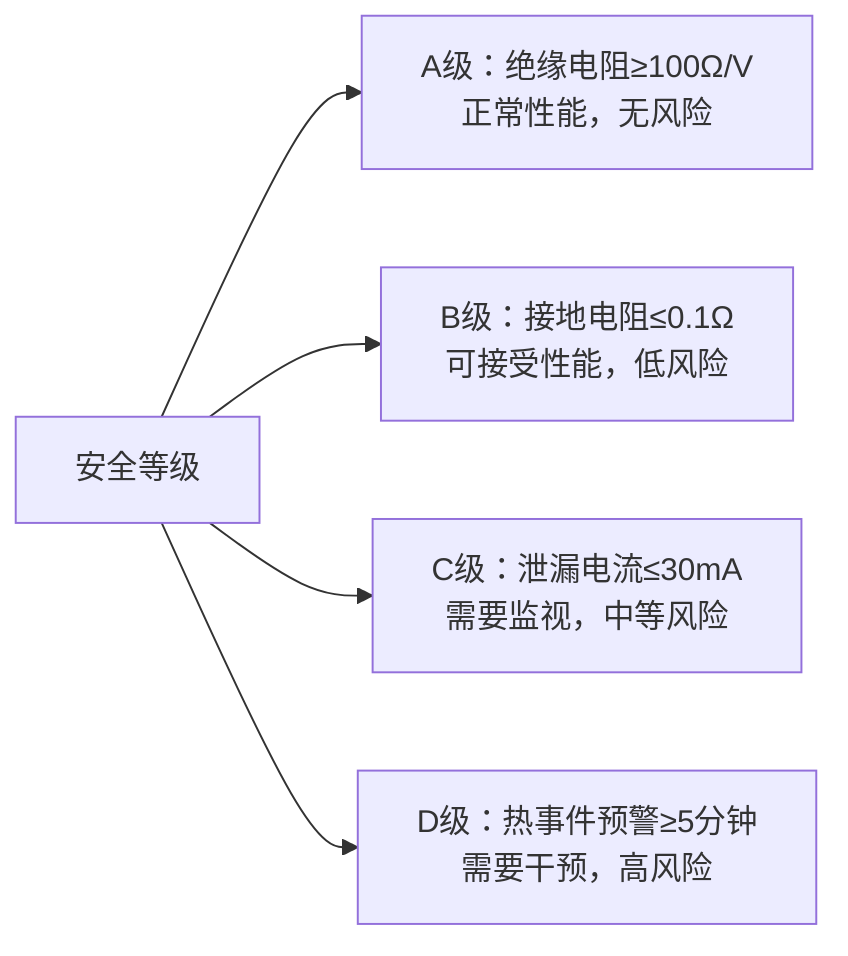
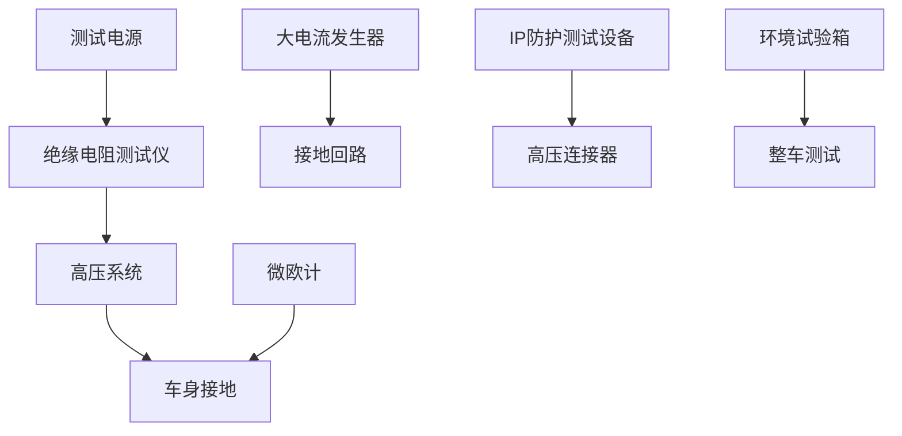
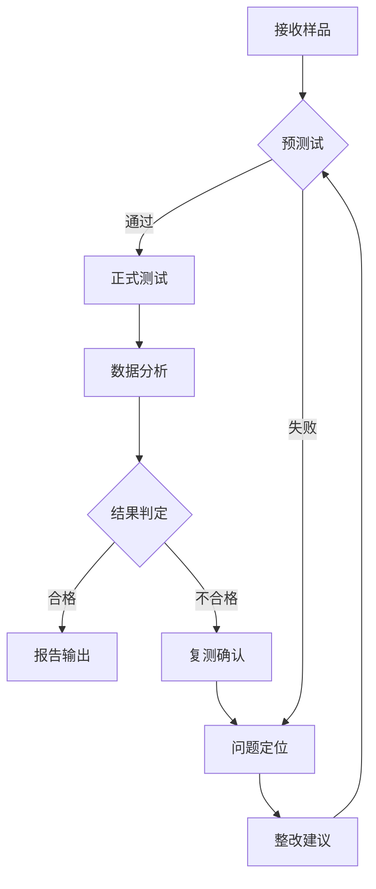

---
# ========== 基础识别信息 ==========
# 文件编码：UTF-8 (无BOM)
# 创建日期：2020-05-12
# 语言环境：中文(简体) zh-CN
title: "GB 18384-2020 - 电动汽车安全要求"
last_modified: 2025-06-25T10:30
aliases:
  - "GB 18384"
  - "GB_18384"
  - "GB18384"
  - "GB18384-2020"
  - "电动汽车安全要求"
  - "Electric Vehicle Safety Requirements"
  - "EV Safety Standard"
  - "新能源汽车安全"

# ========== 三维正交标签体系 ==========
tags:
  # 物理现象层(What) - 描述电磁现象的物理本质 - 严格包含关系
  - "电磁现象|电气安全|高压系统|60V-1000V绝缘失效"
  - "电磁现象|接地保护|故障检测|泄漏电流30mA"
  - "电磁现象|热失控|电弧故障|能量释放"
  - "传播机制|传导耦合|接地阻抗|共阻抗干扰"
  - "频谱特征|脉冲干扰|热事件|上升时间ms级"
  
  # 技术方法层(How) - 描述测试和解决方法 - 严格包含关系  
  - "测试方法|绝缘电阻测试|500V测试电压|兆欧表法"
  - "测试方法|接地连续性测试|微欧计测试法|10A直流"
  - "测试方法|热事件检测|温度监测|5分钟预警"
  - "测试方法|IP防护测试|IPX4-IPX7|标准喷水"
  - "测试设备|EMC测试系统|安全测试类|GB18384规范"
  - "测试环境|汽车安全实验室|高压测试环境"
  - "性能判据|A级判据|绝缘电阻≥100Ω/V"
  - "性能判据|B级判据|接地电阻≤0.1Ω"
  - "性能判据|C级判据|泄漏电流≤30mA"
  - "性能判据|D级判据|热事件预警≥5分钟"
  
  # 应用领域层(Where) - 描述应用场景和产品 - 严格包含关系
  - "汽车应用|新能源汽车|电动汽车|整车安全"
  - "汽车应用|新能源汽车|动力电池系统|高压安全"
  - "汽车应用|新能源汽车|充电基础设施|高压连接"
  - "汽车应用|电动汽车类型|纯电动BEV|整车安全"
  - "汽车应用|电动汽车类型|插电混动PHEV|整车安全"
  - "汽车应用|电动汽车类型|增程式EREV|整车安全"
  - "电压范围|高压系统|交流1000V以下"
  - "电压范围|高压系统|直流1500V以下"
  - "环境分类|汽车环境|道路车辆使用环境"
  - "安装环境|车载安装|移动载体"
  
  # 关联标准层 - 直接引用相关标准编号用于知识图谱链接 - 倒装结构标准名放在最后
  - "电动汽车安全|国际标准|ISO6469-3"
  - "电动汽车传导充电|国际标准|IEC61851-1"
  - "电击防护通用要求|国际标准|IEC61140"
  - "充电用连接装置|国家标准|GB-T-20234"
  - "充电通信协议|国家标准|GB-T-27930"
  - "动力电池安全要求|国家标准|GB38031"
  - "电动客车安全要求|国家标准|GB38032"
  - "联合国电动汽车法规|国际法规|UNECR100"
  - "修改采用ISO6469-3|标准关系|修改采用"
  - "现行有效|标准版本|2020版"
  
  # 标准类型判断 - 必填项目 - 严格包含关系
  - "标准分类|安全标准|电动汽车安全|整车安全要求"
  - "标准分类|强制性标准|车辆安全|电气安全"
  - "EMC要求|EMS抗扰度要求|汽车环境等级"
  - "EMC要求|EMI发射限值|车载设备B类"
  - "安全要求|电气安全|高压电气系统"
  - "安全要求|功能安全|热事件预警系统"
  
  # 测试等级标注 - GB 18384-2020具体等级 - 严格包含关系
  - "抗扰度等级|汽车环境|标准测试等级"
  - "性能判据|A级|绝缘电阻≥100Ω/V"
  - "性能判据|B级|接地电阻≤0.1Ω"  
  - "性能判据|C级|泄漏电流≤30mA"
  - "性能判据|D级|热事件预警≥5分钟"
  - "发射等级|B类设备|车载环境适用"
  - "安全等级|电气安全|高压系统安全"
  - "安全等级|功能安全|预警系统安全"

# ========== 标准技术参数 ==========
standard_number: "GB 18384-2020"
standard_year: 2020
organization: "国家标准化管理委员会（SAC）"
standard_type: "强制性国家标准"
status: "现行有效"
effective_date: "2021-01-01"

# ========== 技术范围与限值 ==========
frequency_range:
  lower_limit: "DC 直流"
  upper_limit: "工频 50Hz"
  characteristic_frequencies: ["50Hz工频", "直流", "热事件频率"]

test_levels:
  - level: 1
    description: "正常工作条件"
    parameters: "绝缘电阻≥100Ω/V, 接地电阻≤0.1Ω"
    application: "日常使用条件"
  - level: 2
    description: "故障工作条件"
    parameters: "泄漏电流≤30mA, 热事件预警≥5分钟"
    application: "故障状态下安全"
  - level: 3
    description: "极端环境条件"
    parameters: "涉水IPX7等级, 碰撞后安全"
    application: "恶劣使用环境"
  - level: X
    description: "开放等级"
    parameters: "用户自定义"
    application: "特殊应用需求"
scope:
  - M类和N类电动汽车整车电气安全
  - B级电压系统（60V DC/30V AC至1000V DC）
  - 纯电动、插电式混动、增程式电动汽车
  - 正常使用和事故模拟条件下的安全要求
test_methods:
  - 绝缘电阻测试 (500V-1000V DC)
  - 接地连续性测试 (10A DC)
  - 防护等级测试 (IPX4-IPX7)
  - 热事件报警测试 (温度模拟)
  - 功能安全测试 (故障注入)
test_levels:
  - 1级(实验室条件) - 标准大气条件
  - 2级(正常使用条件) - -40°C至+85°C
  - 3级(极端环境条件) - 涉水IPX7等级
  - X级(开放等级) - 用户自定义
equipment_types:
  - M类乘用车
  - N类商用车
  - 纯电动汽车BEV
  - 插电式混合动力汽车PHEV
  - 增程式电动汽车EREV
performance_criteria:
  - A级(绝缘电阻≥100Ω/V，正常性能)
  - B级(接地电阻≤0.1Ω，可接受性能)
  - C级(泄漏电流≤30mA，需要监视)
  - D级(热事件预警≥5分钟，需要干预)
related:
  - "[[GB 38031]]"
  - "[[GB 38032]]"
  - "[[GB/T 20234]]"
  - "[[ISO 6469-3]]"
  - "[[IEC 61851-1]]"
  - "[[UN GTR 20]]"
  - "[[新能源汽车安全标准系列]]"
cssclasses:
  - safety-standard
  - electric-vehicle-safety
  - high-voltage-safety
  - technical-standard
full_title: 电动汽车安全要求
type: 强制性国家标准
status: 现行有效
category: 安全标准
subcategory: 电动汽车安全
version: 2020
date: 2020-05-12
reviewed: true
keywords:
  - 电气安全
  - 绝缘电阻
  - 接地保护
  - 热事件报警
  - 功能安全
target_audience:
  - 汽车电气安全工程师
  - 新能源汽车设计工程师
  - 产品认证工程师
  - 质量管理人员
  - 检测机构技术人员
  - 监管机构工程师
  - 高等院校师生
complexity: 复杂
completed: true
archived: false
public: true
favorite: true
draft: false
mandatory: true
revision: Ed.2020.1
progress: 100
word_count: 8500
reading_time: 45分钟
study_time: 6小时
references:
  - "[ISO 6469-3:2018](https://www.iso.org) - 道路车辆-电气安全要求-第3部分：电气安全"
  - "[IEC 61851-1:2017](https://www.iec.ch) - 电动汽车传导充电系统-第1部分：一般要求"
  - "[UN GTR 20](https://unece.org) - 联合国全球技术法规第20号-电动汽车安全"
  - "[GB/T 20234](https://std.samr.gov.cn) - 电动汽车传导充电用连接装置"
supersedes: GB 18384-2015
replaced_by: ""
standard_edition: 2020
equivalent_standards:
  international:
    - ISO 6469-3:2018 (道路车辆电气安全要求)
    - IEC 61851-1:2017 (电动汽车传导充电系统)
  regional:
    - UN GTR 20 (联合国全球技术法规)
    - FMVSS 305 (美国联邦机动车安全标准)
    - JIS D 0203 (日本电动汽车安全标准)
  adoption_method: 修改采用
  technical_differences: 增加了热事件报警要求，结合中国新能源汽车发展特点
  local_adaptations:
    - 增加热事件报警功能要求
    - 强化绝缘监测系统技术要求
    - 细化防水防尘等级要求
applicable_regions:
  - 中国大陆
  - 香港特别行政区
  - 澳门特别行政区
test_equipment:
  - 绝缘电阻测试仪(500V-1000V DC, ±2%精度)
  - 微欧计(0-200mΩ, ±1%精度)
  - 大电流发生器(0-10kA, ±5%精度)
  - IP防护测试设备(IPX4-IPX7标准喷嘴)
  - 环境试验箱(-40°C至+85°C)
  - 可变电阻箱(1Ω-10MΩ, ±1%精度)
test_conditions:
  temperature: -40°C至+85°C (±2°C稳定性)
  humidity: ≤95% RH (无凝露条件)
  atmospheric_pressure: 86-106 kPa
  background_field: <3V/m
  grounding_impedance: <0.1Ω
  power_supply: 稳定的AC/DC电源(±1%电压稳定度)
measurement_uncertainty:
  绝缘电阻: ±5%
  接地电阻: ±2%
  泄漏电流: ±3%
  防护等级: 定性判定
calibration_cycle:
  绝缘电阻测试仪: 12个月
  微欧计: 12个月
  大电流发生器: 12个月
  环境试验设备: 12个月
graph_node_type: 电动汽车安全标准
graph_cluster: 新能源汽车安全标准族
graph_weight: 10
graph_connections:
  - 与GB38031动力电池安全标准关联
  - 与GB38032电动客车安全标准关联
  - 与ISO6469-3国际标准等效
document_type: 强制性整车安全标准
technical_level: 专业级
learning_objectives:
  - 掌握电动汽车电气安全基本要求
  - 理解高压电气系统安全设计原理
  - 掌握电气安全测试方法和判定准则
  - 了解功能安全和电气安全的关系
revision_history:
  - "Ed.2020.1: 替代GB 18384-2015，增加热事件报警要求"
  - "Ed.2015.1: 首次制定电动汽车安全强制性标准"
implementation_status: 强制实施
adoption_date: 2020-05-12
enforcement_date: 2021-01-01
transition_period: 8个月过渡期
withdrawal_date: ""
---

# GB 18384:2020 - 电动汽车安全要求

## 1. 标准概述

### 1.1 技术摘要

> GB 18384-2020《电动汽车安全要求》是中国第一批强制性电动汽车整车安全标准，规定了M、N类电动汽车在正常使用及事故模拟条件下的电气安全和功能安全要求。标准针对B级电压系统（60V DC/30V AC至1000V DC）的电动汽车，建立了完整的电气安全技术体系，包括防触电保护、绝缘安全、接地保护、功能安全和环境适应性等核心要求。

### 1.2 标准定位

- **技术领域**：电气安全/功能安全
- **应用层级**：强制性整车安全标准
- **强制属性**：强制性
- **实施状态**：现行有效
- **标准性质**：与[[ISO 6469-3]]技术要求基本一致，结合中国新能源汽车发展特点
- **标准体系**：与[[GB 38031]]动力蓄电池安全要求和[[GB 38032]]电动客车安全要求共同构成中国新能源汽车安全标准体系

## 2. 物理原理与理论基础

### 2.1 电磁现象机理

> 电动汽车高压电气系统的安全风险主要源于高压电气故障、绝缘失效和接地故障等电磁现象。**所有公式中的变量已在下方2.3节中给出详细定义和物理意义**

**绝缘电阻安全判据**：
$$
R_{\text{ins}} \geq \frac{U_{\text{nom}}}{100} \quad \text{[Ω]}
$$

**接地故障电流计算**：
$$
I_{\text{fault}} = \frac{U_{\text{nom}}}{R_{\text{ins}} + R_{\text{ground}}}
$$

**热失控预警时间模型**：
$$
t_{\text{warning}} = \frac{\Delta T_{\text{critical}}}{\frac{dT}{dt}_{\text{max}}} \geq 300 \text{s}
$$

### 2.2 数学模型

**电气安全风险评估模型**：
$$
P_{\text{risk}} = P_{\text{exposure}} \times P_{\text{occurrence}} \times P_{\text{severity}}
$$

**绝缘监测系统响应模型**：
$$
R_{\text{measured}} = \frac{U_{\text{test}}}{I_{\text{leakage}}} \times K_{\text{correction}}
$$

### 2.3 关键参数定义

> **重要说明**：所有公式中出现的字母和符号必须在此表格中给出明确的定义和物理意义说明。

| 参数符号 | 参数名称 | 物理意义 | 单位 | 典型值 |
|---------|---------|---------|------|--------|
| $R_{\text{ins}}$ | 绝缘电阻 | 高压系统对地绝缘电阻 | Ω | ≥100Ω/V |
| $U_{\text{nom}}$ | 标称电压 | 高压系统额定工作电压 | V | 400V, 800V |
| $I_{\text{fault}}$ | 故障电流 | 绝缘故障时的泄漏电流 | A | ≤30mA |
| $R_{\text{ground}}$ | 接地电阻 | 车身接地系统电阻 | Ω | ≤0.1Ω |
| $\Delta T_{\text{critical}}$ | 临界温升 | 热失控前的温度余量 | °C | 50-100°C |
| $\frac{dT}{dt}_{\text{max}}$ | 最大温升速率 | 热失控过程中温升速率 | °C/s | 0.1-1°C/s |
| $t_{\text{warning}}$ | 预警时间 | 热事件报警到危险状态时间 | s | ≥300s |
| $P_{\text{risk}}$ | 风险概率 | 电气安全风险发生概率 | - | <10⁻⁷/h |
| $U_{\text{test}}$ | 测试电压 | 绝缘电阻测试施加电压 | V | 500V, 1000V |
| $I_{\text{leakage}}$ | 泄漏电流 | 绝缘测试时的泄漏电流 | A | <1mA |
| $K_{\text{correction}}$ | 修正系数 | 温湿度环境修正系数 | - | 0.8-1.2 |

### 2.4 适用范围界定

- **包含**：M类（乘用车）和N类（商用车）电动汽车，包括BEV、PHEV、EREV
- **不包含**：A级低压电动汽车、燃料电池汽车、电动自行车
- **特殊考虑**：电动客车需同时满足[[GB 38032]]要求，充电安全需符合[[GB/T 20234]]系列标准

## 3. 技术要求详解

### 3.1 限值要求

| 安全参数 | 限值要求 | 测试条件 | 判定准则 |
|----------|----------|----------|----------|
| 绝缘电阻 | ≥100Ω/V | 500V或1000V DC测试 | 所有高压回路均满足 |
| 接地电阻 | ≤0.1Ω | 10A DC测试电流 | 所有接地点均满足 |
| 泄漏电流 | ≤30mA | 正常和故障状态 | 任何情况下不超过 |
| 防护等级 | ≥IPX4 | 标准喷水测试 | 高压部件不进水 |
| 热事件预警 | ≥5分钟 | 温度模拟测试 | 声光报警正常 |

### 3.2 性能等级划分

### 3.3 绝缘安全要求

#### 绝缘电阻要求
高压系统绝缘电阻应不小于100Ω/V（相对于标称电压）。绝缘监测系统应实时监控绝缘状态，监测精度不低于±5%，响应时间不超过1秒。当绝缘电阻低于100Ω/V时应发出警告信号。

#### 绝缘监测系统功能
- 持续监测高压系统绝缘状态
- 绝缘下降时立即报警
- 保存绝缘状态历史数据
- 系统启动时自检监测功能

### 防触电保护

#### 直接触电防护
高压部件应达到IPXXB级防护，与人员接触区域物理隔离，并设置明确的高压警示标志和特定颜色标识。

#### 间接触电防护
所有裸露导电部件应有效接地，接地电阻不大于0.1Ω。发生接地故障时应自动切断高压，并配置剩余电流保护装置。

### 短路和过载保护

应配置熔断器、断路器或继电器等保护器件。短路保护动作时间不超过5ms，过载保护应符合I²t特性曲线，动作精度±10%。故障排除后可手动或自动恢复。

### 功能安全要求

#### 热事件报警（2020版新增）
应监测电池温度和温升速率，根据电池特性设定报警阈值。至少提供5分钟预警时间，通过声光报警和仪表显示提醒驾乘人员。

#### 故障检测与隔离
实时监测高压系统状态，关键故障时自动切断高压，非关键故障时允许限功率运行。保存故障代码和时间信息供后续分析。

### 防水防尘要求

高压连接器、设备和线束接头应达到IPX4防护等级，涉水部位应达到IPX7。充电接口在工作时应达到IPX4。车辆应能在300mm水深中正常工作，泄漏电流不超过30mA DC。

## 4. 测试方法与程序

### 4.1 测试配置

> 电动汽车安全测试配置示意图

### 4.2 测试步骤

1. **准备阶段**
   - 环境条件确认：温度-40°C至+85°C，湿度≤95% RH
   - 设备校准检查：所有测试设备在有效校准期内
   - EUT预处理：断开高压系统，确保安全状态
   - 安全防护：佩戴绝缘防护用品，设置安全警示

2. **执行阶段**
   - 步骤1：绝缘电阻测试（500V或1000V DC，稳定60秒）
   - 步骤2：接地连续性测试（10A DC测试电流）
   - 步骤3：防护等级测试（IPX4-IPX7标准喷水）
   - 步骤4：热事件报警测试（温度模拟触发）
   - 步骤5：功能安全验证（故障注入测试）

3. **数据记录**
   - 原始数据记录：所有测试数值和波形
   - 异常现象记录：测试过程中的异常情况
   - 环境条件记录：测试时的温湿度和气压

### 4.3 判定准则

> 电动汽车安全合格判定依据

- **绝缘安全**：所有高压回路绝缘电阻≥100Ω/V
- **接地安全**：所有接地点电阻≤0.1Ω，连接可靠
- **防护安全**：高压部件达到规定IP防护等级
- **功能安全**：监测系统响应时间≤1秒，预警时间≥5分钟
- **环境安全**：在规定温湿度范围内性能稳定

## 5. 测试设备与环境

### 5.1 主要测试设备

| 设备名称 | 技术指标 | 校准要求 | 参考型号 |
|---------|---------|---------|---------|
| 绝缘电阻测试仪 | 500V-1000V DC, ±2%精度 | 12个月 | Fluke 1555/Megger MIT1025 |
| 微欧计 | 0-200mΩ, ±1%精度 | 12个月 | Keysight 34420A |
| 大电流发生器 | 0-10kA, ±5%精度 | 12个月 | Phenix 8510 |
| IP防护测试设备 | IPX4-IPX7标准喷嘴 | 12个月 | Concept Equipment |
| 环境试验箱 | -40°C至+85°C, ±2°C | 12个月 | Weiss Technik |
| 可变电阻箱 | 1Ω-10MΩ, ±1%精度 | 12个月 | IET Labs RS-801 |

### 5.2 测试环境要求

- **电磁环境**：背景电场强度<3V/m，磁场<1A/m
- **物理环境**：温度-40°C至+85°C（±2°C稳定性），湿度≤95% RH（无凝露），大气压86-106 kPa
- **电源质量**：电压稳定度±1%，频率偏差±0.5%，谐波畸变率<3%
- **接地系统**：测试接地电阻<0.1Ω，等电位连接可靠

## 6. 工程实施指南

### 6.1 典型问题与对策

| 常见问题 | 可能原因 | 建议对策 | 预期效果 |
|---------|---------|---------|---------|
| 绝缘电阻不合格 | 高压线束破损、连接器进水 | 更换线束，提高防护等级 | 绝缘电阻恢复正常 |
| 接地电阻过大 | 接地点腐蚀、连接松动 | 清洁接地点，紧固连接 | 接地电阻降至合格范围 |
| 热事件报警失效 | 传感器故障、阈值设置错误 | 更换传感器，重新标定 | 报警功能恢复正常 |
| 防护等级不达标 | 密封件老化、装配不当 | 更换密封件，规范装配 | 防护等级达到要求 |
| 功能安全测试失败 | 软件算法缺陷、硬件故障 | 优化算法，更换硬件 | 功能安全性能提升 |

### 6.2 测试流程优化

### 6.3 成本控制建议

- **设备复用**：绝缘电阻测试仪可用于多种绝缘测试，微欧计可测试接地和导通电阻
- **时间优化**：环境适应性测试与功能测试并行进行，缩短总测试时间
- **人员配置**：1名主测工程师+1名助理工程师的最优配置，确保测试效率和安全

## 7. 标准差异与互认

### 7.1 国际标准对比

| 对比项 | GB 18384-2020 | ISO 6469-3:2018 | 差异说明 | 互认情况 |
|--------|----------------|------------------|----------|----------|
| 绝缘电阻要求 | ≥100Ω/V | ≥100Ω/V | 完全一致 | 直接互认 |
| 接地电阻要求 | ≤0.1Ω | ≤0.1Ω | 完全一致 | 直接互认 |
| 热事件报警 | ≥5分钟预警 | 无明确要求 | 中国标准更严格 | 需补充测试 |
| 防护等级 | IPX4-IPX7 | IPX4 | 中国标准更全面 | 需补充测试 |
| 测试环境 | -40°C至+85°C | -30°C至+85°C | 中国低温要求更严 | 需补充测试 |

### 7.2 认证互认指南

- **直接互认**：绝缘电阻、接地连续性、基本防护等级测试结果
- **条件互认**：热事件报警、扩展环境测试需补充中国标准要求的测试项目
- **不可互认**：涉及中国特殊气候条件和使用环境的测试项目必须重新测试

## 8. 相关标准导航

### 8.1 上游标准

- [[IEC 61140]] - 电击防护的通用要求，提供基础安全理论
- [[ISO 26262]] - 道路车辆功能安全标准，提供功能安全方法学
- [[IEC 60664-1]] - 低压系统内设备绝缘配合，提供绝缘设计基础

### 8.2 平行标准

- [[GB 38031]] - 电动汽车用动力蓄电池安全要求，电池系统安全标准
- [[GB 38032]] - 电动客车安全要求，专门针对客车的安全标准
- [[UN GTR 20]] - 联合国全球技术法规，国际电动汽车安全要求

### 8.3 下游标准

- [[GB/T 20234系列]] - 电动汽车传导充电用连接装置，充电安全应用标准
- [[GB/T 18487系列]] - 电动汽车传导充电系统，充电系统安全标准
- [[QC/T 1067.1]] - 电动汽车用高压连接器技术条件，具体器件安全标准

## 9. 附录

### 9.1 术语定义

> 关键术语的标准定义

- **B级电压**：在干燥条件下，DC电压>60V且≤1000V，或AC电压>30V且≤1000V
- **绝缘电阻**：高压系统与车身（地）之间的电阻值
- **接地连续性**：裸露导电部件与车身接地点之间的电气连续性
- **热事件**：动力电池温度异常升高可能导致的安全事件
- **功能安全**：通过安全相关系统正确实现安全功能来避免不合理风险

### 9.2 参考文献

> 标准制定的技术依据

1. ISO 6469-3:2018, Road vehicles — Safety specifications for energy storage systems — Part 3: Electric safety requirements
2. IEC 61851-1:2017, Electric vehicle conductive charging system — Part 1: General requirements
3. UN GTR No. 20, Global technical regulation on electric vehicle safety (EVS)
4. IEC 61140:2016, Protection against electric shock — Common aspects for installation and equipment
5. ISO 26262:2018, Road vehicles — Functional safety

### 9.3 修订记录

| 版本 | 日期 | 主要变化 | 影响评估 |
|------|------|----------|----------|
| 2020版 | 2020-05-12 | 替代2015版，增加热事件报警要求 | 强制实施，影响所有电动汽车生产 |
| 2015版 | 2015-05-15 | 首次制定电动汽车安全强制性标准 | 建立中国电动汽车安全标准体系 |

---

*最后更新：2025-06-18*