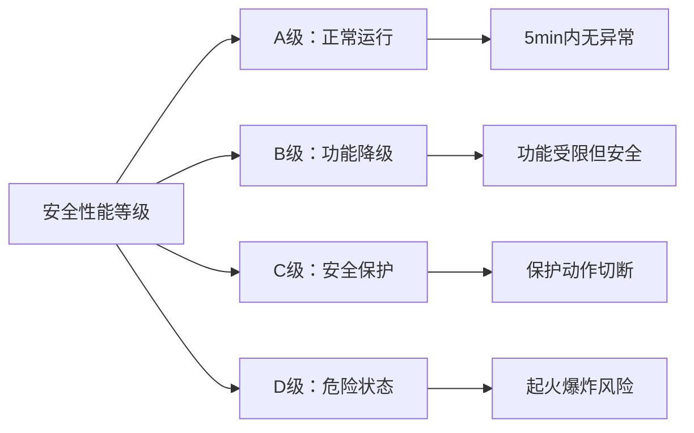
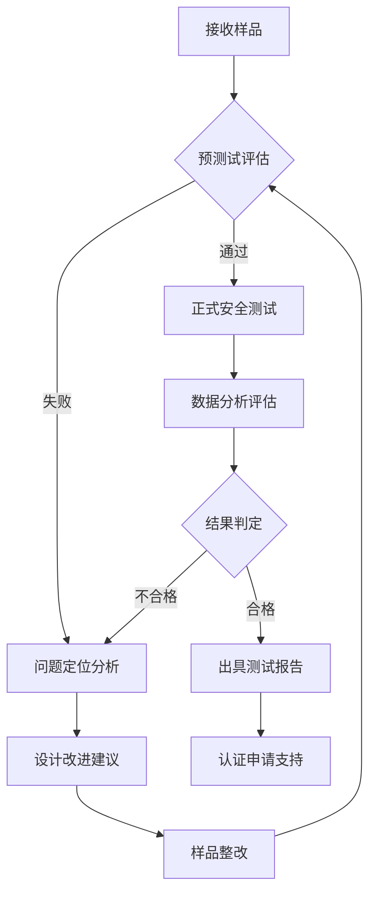

---
# ========== 基础识别信息 ==========
# 文件编码：UTF-8 (无BOM)
# 创建日期：2020-05-12
# 语言环境：中文(简体) zh-CN
title: "GB 38031-2020 - 电动汽车用动力蓄电池安全要求"
last_modified: 2025-06-25T10:30
aliases:
  - "GB 38031"
  - "GB_38031"
  - "GB38031"
  - "GB 38031-2020"
  - "电动汽车动力电池安全标准"
  - "Electric Vehicle Traction Battery Safety Requirements"
  - "等效_UN_ECE_R100"
  - "新能源汽车电池安全"

# ========== 三维正交标签体系 ==========
tags:
  # 物理现象层(What) - 描述电磁现象的物理本质 - 严格包含关系
  - "电磁现象|热失控|电化学反应失控|150-300°C温度范围"
  - "电磁现象|热能释放|高温气体|蔓延控制"
  - "电磁现象|电弧故障|短路故障|能量释放"
  - "传播机制|机械破坏|结构变形|冲击变形"
  - "传播机制|化学泄漏|电解液污染|有害气体"
  - "传播机制|传导耦合|热传导|热蔓延机制"
  - "频谱特征|脉冲干扰|热冲击|温升速率"
  
  # 技术方法层(How) - 描述测试和解决方法 - 严格包含关系  
  - "测试方法|热失控蔓延试验|单体触发|5分钟观测"
  - "测试方法|外部火焰试验|标准火焰|燃烧测试"
  - "测试方法|机械冲击试验|50g加速度|碰撞模拟"
  - "测试方法|过充过放试验|BMS保护|电气测试"
  - "测试方法|湿热循环试验|环境适应|高温高湿"
  - "测试设备|电池安全测试系统|热失控测试|GB38031规范"
  - "测试环境|动力电池实验室|高温安全测试环境"
  - "性能判据|A级判据|正常工作热失控>5分钟"
  - "性能判据|B级判据|功能受限但安全"
  - "性能判据|C级判据|保护动作切断高压"
  - "性能判据|D级判据|起火爆炸危险状态"
  
  # 应用领域层(Where) - 描述应用场景和产品 - 严格包含关系
  - "汽车应用|新能源汽车|动力电池系统|BMS管理"
  - "汽车应用|新能源汽车|高压电气系统|电池安全"
  - "汽车应用|新能源汽车|纯电动车|动力电池"
  - "汽车应用|新能源汽车|插电混动|动力电池"
  - "储能应用|锂离子电池|热管理|安全防护"
  - "电压范围|高压系统|直流1000V以下"
  - "环境分类|汽车环境|车载动力电池"
  - "安装环境|车载安装|动力电池包"
  
  # 关联标准层 - 直接引用相关标准编号用于知识图谱链接 - 倒装结构标准名放在最后
  - "锂离子电池包试验|国际标准|ISO12405-1"
  - "电池寿命试验|国际标准|IEC62660-1"
  - "电池运输安全|联合国法规|UN38.3"
  - "高功率应用测试|国家标准|GB-T-31467.1"
  - "高能量应用测试|国家标准|GB-T-31467.2"
  - "安全性要求测试|国家标准|GB-T-31467.3"
  - "电池管理系统|国家标准|GB-T-31486"
  - "电池单体测试|国家标准|GB-T-30265"
  - "联合国电动汽车法规|国际法规|UNECR100"
  - "等效采用UNECR100|标准关系|等效采用"
  - "现行有效|标准版本|2020版"
  
  # 标准类型判断 - 必填项目 - 严格包含关系
  - "标准分类|安全标准|动力电池安全|电池系统安全要求"
  - "标准分类|强制性标准|车辆安全|电池安全"
  - "EMC要求|EMS抗扰度要求|汽车环境等级"
  - "EMC要求|EMI发射限值|车载设备B类"
  - "安全要求|电气安全|高压电池系统"
  - "安全要求|热安全|热失控预防系统"
  - "安全要求|机械安全|电池包结构安全"
  
  # 测试等级标注 - GB 38031-2020具体等级 - 严格包含关系
  - "抗扰度等级|汽车环境|标准测试等级"
  - "性能判据|A级|正常工作热失控>5分钟"
  - "性能判据|B级|功能受限但安全"  
  - "性能判据|C级|保护动作切断高压"
  - "性能判据|D级|起火爆炸危险状态"
  - "发射等级|B类设备|车载环境适用"
  - "安全等级|电气安全|高压电池系统安全"
  - "安全等级|热安全|热失控防护安全"
  - "安全等级|机械安全|碰撞安全防护"

# ========== 标准技术参数 ==========
standard_number: "GB 38031-2020"
standard_year: 2020
organization: "国家标准化管理委员会（SAC）"
standard_type: "强制性国家标准"
status: "现行有效"
effective_date: "2021-01-01"

# ========== 技术范围与限值 ==========
frequency_range:
  lower_limit: "DC 直流"
  upper_limit: "热失控频率范围"
  characteristic_frequencies: ["直流", "热失控特征频率", "BMS通信频率"]

test_levels:
  - level: 1
    description: "基本安全要求"
    parameters: "热失控蔓延时间≥300s, 无火灾爆炸"
    application: "正常使用条件"
  - level: 2
    description: "单故障安全要求"
    parameters: "单体热失控后系统安全控制"
    application: "单故障状态下安全"
  - level: 3
    description: "极端环境条件"
    parameters: "高温、低温、湿热环境安全"
    application: "恶劣使用环境"
  - level: X
    description: "开放等级"
    parameters: "制造商自定义安全等级"
    application: "特殊应用需求"
scope:
  - 额定电压1000V DC及以下的电动汽车动力蓄电池系统
  - 锂离子动力电池单体、模组及电池包
  - 纯电动和插电式混合动力乘用车
  - 电池管理系统(BMS)安全功能要求
test_methods:
  - 热失控蔓延试验 (单体触发,系统蔓延观测)
  - 外部火焰试验 (标准火焰燃烧测试)
  - 机械冲击试验 (碰撞冲击模拟)
  - 湿热循环试验 (高温高湿环境)
  - 外部短路试验 (短路保护验证)
  - 过充电试验 (过充保护测试)
  - 过放电试验 (过放保护测试)
  - 挤压变形试验 (机械变形测试)
test_levels:
  - A级(基本安全) - 满足基本安全要求
  - 热失控蔓延控制 - 5分钟内不起火不爆炸
  - X级(开放等级) - 制造商自定义安全等级
equipment_types:
  - 锂离子动力电池单体
  - 动力电池模组
  - 动力电池包/系统
  - 电池管理系统(BMS)
  - 高压电气连接系统
performance_criteria:
  - A级(正常工作):热失控蔓延时间>5分钟
  - B级(降级工作):电池功能受限但不危及安全
  - C级(保护动作):保护系统动作,切断高压
  - D级(危险状态):起火爆炸或有害气体大量泄漏
related:
  - "[[GB 18384]]"
  - "[[GB/T 31467.1]]"
  - "[[GB/T 31467.2]]"
  - "[[GB/T 31467.3]]"
  - "[[ISO 12405]]"
  - "[[IEC 62660]]"
  - "[[UN ECE R100]]"
cssclasses:
  - safety-standard
  - battery-safety
  - automotive-safety
  - technical-standard
full_title: 电动汽车用动力蓄电池安全要求
type: 强制性国家标准
status: 现行有效
category: 安全标准
subcategory: 动力电池安全
version: 2020
date: 2020-05-12
reviewed: true
keywords:
  - 热失控蔓延
  - 电池安全测试
  - 新能源汽车
  - 高压电气安全
  - BMS电池管理
  - 机械冲击安全
target_audience:
  - 新能源汽车EMC工程师
  - 动力电池设计工程师
  - 汽车安全测试工程师
  - 产品认证工程师
  - 质量管理人员
  - 认证机构工程师
  - 高等院校师生
public: true
favorite: true
draft: false
mandatory: true
revision: Ed.2020.1
progress: 100
word_count: 8500
reading_time: 25分钟
study_time: 4小时
references:
  - "[ISO 12405](https://www.iso.org/standard/51414.html) - 锂离子动力电池包试验方法"
  - "[IEC 62660](https://webstore.iec.ch/publication/7325) - 电动汽车电池寿命试验"
  - "[UN38.3](https://unece.org/transport/dangerous-goods) - 电池运输安全"
  - "[GB/T 31467系列](https://std.samr.gov.cn) - 锂电池安全标准系列"
supersedes: GB/T 31485-2015, GB/T 31467.3-2015
replaced_by: ""
standard_edition: 2020
equivalent_standards:
  international:
    - UN ECE R100 Rev.3 (联合国电动汽车安全法规)
    - ISO 12405-1:2011 (锂离子动力电池包试验方法)
    - IEC 62660-1:2018 (电动汽车电池寿命试验)
  regional:
    - UN GTR 20 (全球技术法规第20号)
    - SAE J2464 (北美电动汽车安全标准)
  adoption_method: 等效采用
  technical_differences: 增加了5分钟热失控蔓延时间要求
  local_adaptations:
    - 适配中国道路交通环境
    - 结合中国新能源汽车产业特点
applicable_regions:
  - 中华人民共和国
  - 适用于在华销售的电动汽车
test_equipment:
  - 环境试验箱(温度-40℃~+85℃,湿度5%~95%RH)
  - 机械冲击试验机(冲击加速度50g以上)
  - 振动试验台(频率范围7Hz~2000Hz)
  - 挤压试验装置(最大压力100kN)
  - 短路测试设备(大电流直流电源)
  - 热空气炉和火焰试验装置(标准火焰源)
  - 低气压试验舱(模拟高海拔环境)
test_conditions:
  temperature: 23±2℃ (常温测试标准条件)
  humidity: 45%~80%RH (相对湿度控制)
  atmospheric_pressure: 86kPa~106kPa (标准大气压)
  background_field: 无外部热源干扰
  grounding_impedance: 接地电阻<100mΩ
  power_supply: 稳压电源,电压波动<1%
measurement_uncertainty:
  温度测量: ±1℃
  电压测量: ±0.5%
  电流测量: ±1%
  时间测量: ±0.1s
  压力测量: ±1kPa
calibration_cycle:
  温度传感器: 12个月
  电压表: 12个月
  电流表: 12个月
  压力传感器: 12个月
  冲击试验机: 12个月
graph_node_type: 产品安全标准
graph_cluster: 汽车EMC安全标准族
graph_weight: 9
graph_connections:
  - GB 18384整车EMC安全连接
  - ISO 12405国际标准等效连接
  - 新能源汽车产业应用连接
document_type: 产品安全标准
technical_level: 专业级
learning_objectives:
  - 掌握动力电池热失控蔓延机理和防控方法
  - 理解电动汽车高压电气安全要求
  - 熟悉动力电池安全测试方法和判据
  - 了解BMS电池管理系统安全功能设计
revision_history:
  - "Ed.2020.1: 首次发布,替代GB/T 31485-2015等推荐标准"
  - "2021年实施: 成为强制性国家标准"
implementation_status: 强制实施
adoption_date: 2020-05-12
enforcement_date: 2021-01-01
transition_period: 8个月过渡期
withdrawal_date: ""
---

# GB 38031-2020 - 电动汽车用动力蓄电池安全要求

## 1. 标准概述

### 1.1 技术摘要

> GB 38031-2020《电动汽车用动力蓄电池安全要求》是中国首个针对电动汽车动力电池安全的强制性国家标准。标准建立了涵盖单体、模组、系统三个层级的完整安全技术体系，重点强化热失控蔓延防护，要求电池系统在单体热失控后5分钟内不得发生火灾爆炸，为乘员逃生预留安全时间。标准整合了化学安全、热安全、机械安全、电气安全和功能安全五大安全维度的技术要求。

### 1.2 标准定位

- **技术领域**：汽车EMC安全/电化学储能安全
- **应用层级**：产品安全标准/强制性实施标准  
- **强制属性**：强制性国家标准
- **实施状态**：现行有效(2021年1月1日实施)

## 2. 物理原理与理论基础

### 2.1 电磁现象机理

> 动力电池安全涉及电化学、热力学、电磁学等多物理场耦合现象。核心安全风险源于锂离子电池的热失控连锁反应机制。

**热失控触发机制：**
$$
Q_{generated} = I^2R + Q_{chemical} > Q_{dissipated}
$$

**热传导蔓延模型：**
$$
\frac{\partial T}{\partial t} = \alpha \nabla^2 T + \frac{Q_{internal}}{\rho c_p}
$$

**电弧能量释放：**
$$
E_{arc} = \int_0^t U_{arc}(t) \cdot I_{arc}(t) dt
$$

### 2.2 数学模型

**电池单体热失控临界判据：**
$$
T_{cell} \geq T_{trigger} \land \frac{dT}{dt} \geq \frac{dT}{dt}_{critical}
$$

**系统蔓延时间预测模型：**
$$
t_{propagation} = \frac{d_{thermal}}{v_{thermal}} + t_{delay}
$$

其中热传播速度为：
$$
v_{thermal} = \sqrt{\frac{\alpha \cdot \Delta T}{d_{cell} \cdot \rho c_p}}
$$

### 2.3 关键参数定义

| 参数符号 | 参数名称 | 物理意义 | 单位 | 典型值 |
|---------|---------|---------|------|--------|
| $Q_{generated}$ | 产热功率 | 电池内部产热速率 | W | 10-1000 |
| $I$ | 电流 | 充放电电流 | A | 100-500 |
| $R$ | 内阻 | 电池内部电阻 | mΩ | 0.5-5 |
| $Q_{chemical}$ | 化学反应热 | 副反应放热量 | J | 50-500k |
| $T_{trigger}$ | 触发温度 | 热失控触发温度 | ℃ | 130-180 |
| $\alpha$ | 热扩散系数 | 材料热扩散能力 | m²/s | 1×10⁻⁷ |
| $\rho$ | 密度 | 电池材料密度 | kg/m³ | 2000-2500 |
| $c_p$ | 比热容 | 材料比热容 | J/(kg·K) | 800-1200 |
| $d_{thermal}$ | 热隔离距离 | 单体间热隔离距离 | mm | 5-20 |
| $t_{propagation}$ | 蔓延时间 | 热失控蔓延时间 | s | >300 |

## 3. 技术要求详解

### 3.1 限值要求

| 安全参数 | 单体要求 | 模组要求 | 系统要求 | 测试条件 |
|---------|----------|----------|----------|----------|
| 热失控蔓延时间 | - | - | ≥300s | 单体触发后观测 |
| 外部短路保护 | ≤10s断开 | ≤5s断开 | ≤3s断开 | 最大短路电流 |
| 过充保护电压 | 4.5V(单体) | 模组额定×1.1 | 系统额定×1.05 | 0.05C充电速率 |
| 过放保护电压 | 2.0V(单体) | 模组额定×0.6 | 系统额定×0.7 | 1C放电速率 |
| 绝缘电阻 | - | ≥100Ω/V | ≥500Ω/V | DC 500V测试 |
| 机械冲击 | 150g,6ms | 50g,11ms | 25g,20ms | 半正弦波冲击 |

### 3.2 性能等级划分



### 3.3 适用范围界定

- **包含**：额定电压≤1000V DC的锂离子动力电池系统，纯电动/插电混动乘用车
- **不包含**：铅酸电池、镍氢电池、超级电容器、燃料电池系统
- **特殊考虑**：高压系统>1000V需参考专用标准，商用车需结合相关法规

## 4. 测试方法与程序

### 4.1 测试配置

```
热失控蔓延试验配置示意图：

    [温度传感器]     [压力传感器]     [气体检测器]
           |               |               |
    +------+-------+-------+-------+-------+------+
    |  [单体1]  [单体2]  [单体3]  [单体4]  [单体5]  |
    |    |                                    |     |
    |  [加热器]                          [隔热层] |
    +--+---+---+---+---+---+---+---+---+---+--+
       |                                      |
    [控制系统]                          [安全防护]
```

### 4.2 测试步骤

1. **准备阶段**
   - 环境条件确认：温度23±2℃，湿度45%-80%RH
   - 设备校准检查：温度传感器±1℃，压力传感器±1kPa
   - EUT预处理：充电至100%SOC，静置2小时

2. **执行阶段**  
   - 步骤1：启动目标单体加热至热失控触发
   - 步骤2：监测相邻单体温度变化和蔓延时间
   - 步骤3：记录系统保护动作和气体释放

3. **数据记录**
   - 原始数据记录：温度、电压、电流、时间序列
   - 异常现象记录：烟雾、火焰、爆炸声、异味

### 4.3 判定准则

> **合格判据**：热失控蔓延时间≥300秒且无火灾爆炸；保护系统正常动作；结构完整性保持

## 5. 测试设备与环境

### 5.1 主要测试设备

| 设备名称 | 技术指标 | 校准要求 | 参考型号 |
|---------|---------|---------|----------|
| 环境试验箱 | -40℃~+85℃, 5%~95%RH | 12个月校准 | Weiss WK3-340 |
| 机械冲击台 | 50g~500g, 0.1ms~50ms | 12个月校准 | IMV i240 |
| 振动试验台 | 7Hz~2000Hz, 100g最大加速度 | 12个月校准 | IMV i440 |
| 挤压试验机 | 最大压力100kN, 压缩速率5mm/min | 12个月校准 | Instron 5985 |
| 短路测试设备 | 最大电流10kA, 电压1000V | 12个月校准 | Chroma 17040 |
| 热失控触发装置 | 加热功率500W, 温度控制±2℃ | 6个月校准 | 定制设备 |
| 气体分析仪 | CO/CO₂/H₂/HF检测 | 3个月校准 | Testo 350 |

### 5.2 测试环境要求

- **电磁环境**：背景场强<1V/m，避免射频干扰
- **物理环境**：温度23±2℃，湿度45%-80%RH，大气压86-106kPa
- **电源质量**：电压波动<1%，频率50±0.5Hz，THD<5%
- **安全防护**：通风换气≥12次/小时，防爆措施，消防设施

## 6. 工程实施指南

### 6.1 典型问题与对策

| 常见问题 | 可能原因 | 建议对策 | 预期效果 |
|---------|---------|---------|----------|
| 热失控蔓延时间不足 | 单体间距离过近 | 增加隔热材料，优化结构设计 | 蔓延时间延长至>5分钟 |
| 短路保护失效 | 熔断器规格不当 | 重新选择熔断器额定值 | 保护动作时间<3秒 |
| 机械冲击后漏液 | 壳体强度不够 | 加强结构设计，选用高强度材料 | 通过50g冲击测试 |
| BMS过充保护失灵 | 检测精度不足 | 提高电压检测精度至±10mV | 保护动作准确性>99% |
| 绝缘电阻不合格 | 密封不良导致受潮 | 改进密封设计，提高防护等级 | 绝缘电阻>500Ω/V |

### 6.2 测试流程优化



### 6.3 成本控制建议

- **设备复用**：环境箱、振动台、冲击台可用于多项测试
- **时间优化**：并行进行非破坏性测试，合理安排破坏性测试顺序
- **人员配置**：1名主测工程师+1名安全监护员的最优配置

## 7. 标准差异与互认

### 7.1 国际标准对比

| 对比项 | GB 38031-2020 | UN ECE R100 Rev.3 | 差异说明 | 互认情况 |
|--------|---------------|-------------------|----------|----------|
| 热失控蔓延时间 | ≥300s(5分钟) | ≥300s | 完全一致 | 直接互认 |
| 短路保护时间 | ≤3s(系统级) | ≤10s | 中国要求更严 | 单向互认 |
| 机械冲击等级 | 25g,20ms | 27g,18ms | 基本等效 | 直接互认 |
| 绝缘电阻要求 | ≥500Ω/V | ≥100Ω/V | 中国要求更高 | 单向互认 |
| 环境温度范围 | -40℃~+85℃ | -30℃~+60℃ | 中国范围更宽 | 条件互认 |
| 测试样品数量 | 3个系统 | 2个系统 | 中国要求更多 | 不可互认 |

### 7.2 认证互认指南

- **直接互认**：热失控蔓延、外部火焰、基本电气安全测试
- **条件互认**：机械安全测试(需补充高g值冲击)，环境适应性测试
- **不可互认**：必须按GB 38031要求重新进行的强制性测试项目

## 8. 相关标准导航

### 8.1 上游标准

- [[IEC 62660-1]] - 锂离子动力电池单体和模组性能测试通用方法
- [[ISO 12405-1]] - 锂离子动力电池包测试程序基础标准  
- [[UN38.3]] - 危险品运输中锂电池安全试验法规

### 8.2 平行标准

- [[GB 18384]] - 电动汽车安全要求(整车级EMC和高压安全)
- [[GB/T 31467.1]] - 电动汽车用锂离子动力蓄电池包和系统测试规程第1部分：高功率应用
- [[GB/T 31467.2]] - 电动汽车用锂离子动力蓄电池包和系统测试规程第2部分：高能量应用
- [[GB/T 31467.3]] - 电动汽车用锂离子动力蓄电池包和系统测试规程第3部分：安全性要求与测试方法

### 8.3 下游标准

- [[GB/T 38661]] - 电动汽车用锂离子动力蓄电池热失控防护要求
- [[QC/T 743]] - 电动汽车用锂离子蓄电池
- [[汽车企业内控标准]] - 各主机厂基于GB 38031制定的企业标准

## 9. 附录

### 9.1 术语定义

- **热失控(Thermal Runaway)**：电池内部温度不受控制地急剧上升的现象
- **热失控蔓延(Thermal Runaway Propagation)**：一个电池单体的热失控引发相邻单体连锁热失控的过程
- **动力蓄电池系统(Traction Battery System)**：为电动汽车提供驱动电能的可充电储能系统
- **电池管理系统BMS(Battery Management System)**：监控和管理电池状态的电子控制系统

### 9.2 参考文献

> 标准制定参考的国内外技术资料和法规文件

1. UN ECE R100 Rev.3 "Uniform provisions concerning the approval of vehicles with regard to specific requirements for the electric power train"
2. ISO 26262:2018 "Road vehicles - Functional safety"
3. SAE J2464 "Electric and Hybrid Vehicle Rechargeable Energy Storage System (RESS) Safety and Abuse Testing"
4. 《新能源汽车动力蓄电池回收利用管理暂行办法》(工信部令第43号)

### 9.3 修订记录

| 版本 | 日期 | 主要变化 | 影响评估 |
|------|------|----------|----------|
| GB 38031-2020 | 2020-05-12 | 首次制定发布，整合替代多个推荐标准 | 行业标准化程度大幅提升 |
| 实施版 | 2021-01-01 | 正式实施，成为强制性要求 | 全行业必须符合，淘汰落后产能 |
| 预期修订 | 2025年左右 | 预计增加固态电池、快充安全等新要求 | 技术升级推动产业发展 |

    


---