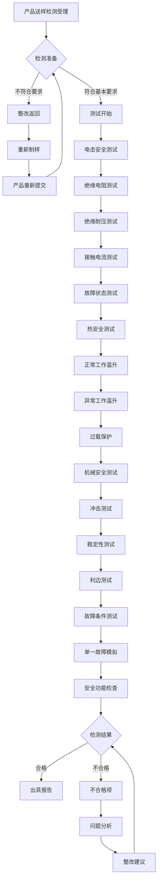
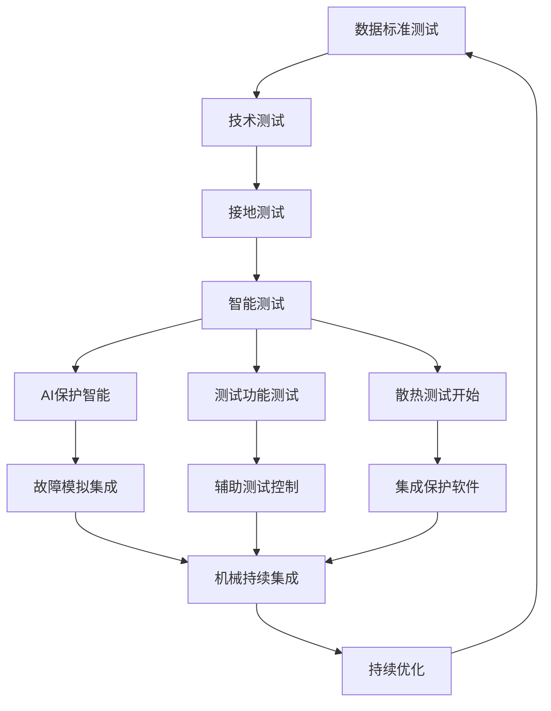

---
# ========== 基础识别信息 ==========
# 文件编码：UTF-8 (无BOM)
# 创建日期：按实际标准发布日期填写
# 语言环境：中文(简体) zh-CN
title: "GB 4943.1-2022 - 音视频、信息技术和通信技术设备安全技术要求"
last_modified: 2024-01-20T15:30
aliases:
  - "GB 4943.1"
  - "GB4943.1"
  - "GB_4943_1"
  - "IEC 62368-1等效"
  - "音视频安全"

# ========== 三维正交标签体系 ==========
tags:
  # 物理现象层(What) - 描述电磁现象的物理本质 - 严格包含关系
  - "电磁现象|电气安全|绝缘系统|基本绝缘"
  - "电磁现象|电气安全|绝缘系统|加强绝缘"
  - "电磁现象|电气安全|安全特低电压|SELV电路"
  - "电磁现象|电气安全|电击防护|60V安全限值"
  - "传播机制|机械安全|锐利边缘|物理伤害"
  - "频谱特征|热安全|表面温度|烧伤防护"
  - "频谱特征|热安全|功率管理|热管理"
  - "频谱特征|辐射安全|激光分类|眼部安全"
  
  # 技术方法层(How) - 描述测试和解决方法 - 严格包含关系
  - "测试方法|安全测试|电气测试|SELV测试"
  - "测试方法|安全测试|电气测试|绝缘电阻测试"
  - "测试方法|安全测试|电气测试|兆欧表测试"
  - "测试方法|安全测试|热测试|温度测试"
  - "测试设备|安全测试设备|电气测试设备|绝缘电阻测试仪"
  - "测试环境|产品安全实验室|音视频测试环境"
  - "评估方法|危险能量评估|HBSE分析|安全评估"
  - "评估方法|故障分析|单一故障条件|安全判定"
  - "认证体系|CNAS认可|检测认证|产品认证"
  - "性能判据|A级判据|基本安全要求"
  - "性能判据|B级判据|增强安全要求"
  - "性能判据|C级判据|双重故障要求"
  
  # 应用领域层(Where) - 描述应用场景和产品 - 严格包含关系
  - "消费电子|音视频设备|信息技术|数据处理设备"
  - "消费电子|音响功放设备|专业音响|音频放大器"
  - "消费电子|显示器监视器|视频显示|显示设备"
  - "消费电子|投影仪多媒体|演示设备|投影系统"
  - "通信设备|广播电视通信|媒体传输|广播设备"
  - "工业应用|专业设备|商用音视频|专业广播"
  - "电压范围|低压系统|交流1000V以下"
  - "电压范围|低压系统|直流1500V以下"
  - "环境分类|办公环境|室内使用环境"
  - "安装环境|固定安装|非手持设备"
  
  # 关联标准层 - 直接引用相关标准编号用于知识图谱链接 - 倒装结构标准名放在最后
  - "音视频信息设备安全|国际标准|IEC62368-1"
  - "静电放电抗扰度|国家标准|GB-T-17626-2"
  - "电快速瞬变抗扰度|国家标准|GB-T-17626-4"
  - "音视频设备安全基础|国家标准|GB8898"
  - "等效采用IEC62368-1|标准关系|等效采用"
  - "现行有效|标准版本|2022版"
  
  # 标准类型判断 - 必填项目 - 严格包含关系
  - "标准分类|安全标准|音视频设备安全|产品安全要求"
  - "标准分类|强制性标准|设备安全|电气安全"
  - "EMC要求|EMS抗扰度要求|办公环境等级"
  - "EMC要求|EMI发射限值|音视频设备B类"
  - "安全要求|电气安全|低压电气系统"
  - "安全要求|功能安全|危险能量控制系统"
  
  # 测试等级标注 - GB 4943.1-2022具体等级 - 严格包含关系
  - "抗扰度等级|办公环境|标准测试等级"
  - "性能判据|A级|基本安全要求"
  - "性能判据|B级|增强安全要求"  
  - "性能判据|C级|双重故障要求"
  - "发射等级|B类设备|办公环境适用"
  - "安全等级|电气安全|基本电气安全"
  - "安全等级|功能安全|危险能量控制安全"

# ========== 标准技术参数 ==========
standard_number: "GB 4943.1-2022"
standard_year: 2022
organization: "国家标准化管理委员会"
standard_type: "强制性国家标准"
status: "现行有效"
effective_date: "2022-06-01"

# ========== 技术范围与限值 ==========
frequency_range:
  lower_limit: "DC 直流"
  upper_limit: "400 GHz"
  characteristic_frequencies: ["50/60Hz工频", "开关电源频率", "射频信号"]

test_levels:
  - level: 1
    description: "基本安全要求"
    parameters: "危险能量评估, 基本绝缘, SELV≤60V"
    application: "强制性准入要求"
  - level: 2
    description: "增强安全要求"
    parameters: "单一故障条件, 附加绝缘"
    application: "高风险产品"
  - level: 3
    description: "双重故障要求"
    parameters: "多重故障条件, 加强绝缘"
    application: "医疗设备"
scope:
  - 音视频设备电气安全技术要求
  - 信息技术设备安全规范
  - 通信技术设备安全要求
  - 危险能量评估(HBSE)方法
test_methods:
  - SELV测试 (安全特低电压≤60V)
  - 绝缘测试 (500V耐压测试)
  - 绝缘电阻测试 (兆欧表测量≥1MΩ)
  - 温度测试 (表面温度≤70°C)
  - 危险能量评估 (HBSE分析)
  - 机械强度测试 (推拉力≤30N)
test_levels:
  - level: 1
    description: 基本安全要求
    parameters: 危险能量评估
    application: 强制性准入要求
  - level: 2
    description: 增强安全要求
    parameters: 单一故障条件
    application: 高风险产品
  - level: 3
    description: 双重故障要求
    parameters: 多重故障条件
    application: 医疗设备
equipment_types:
  - 音频设备
  - 视频设备
  - 信息技术设备
  - 通信设备
  - 多媒体设备
  - 显示设备
performance_criteria:
  A类:
    description: 基本安全要求
    technical_requirement: 满足危险能量评估
    acceptance_criteria: 符合GB 4943.1要求
  B类:
    description: 增强安全要求
    technical_requirement: 基本要求+单一故障测试
    acceptance_criteria: 单故障下仍安全
  C类:
    description: 双重故障要求
    technical_requirement: 两个独立故障
    acceptance_criteria: < 不可接受
related:
  - "[[IEC 62368-1]]"
  - "[[GB/T 17626.2]]"
  - "[[GB 8898]]"
  - "[[GB 13837]]"
  - "[[GB/T 4365]]"
cssclasses:
  - safety-standard
  - audio-video-safety
  - information-technology-safety
  - technical-standard
full_title: 音视频、信息技术和通信技术设备安全技术要求
type: 强制性国家标准
status: 现行有效
category: 安全标准
subcategory: 设备安全
version: 2022
date: 2022-06-01
reviewed: true
keywords:
  - 音视频设备
  - 信息技术设备
  - 通信设备
  - 电气安全
  - SELV
  - 危险能量评估
target_audience:
  - 产品安全工程师
  - 音视频设备工程师
  - 信息技术设备工程师
  - 认证工程师
  - 质量管理人员
frequency_range:
  lower_limit: DC
  upper_limit: 400 GHz
  characteristic_frequencies:
    - 50/60Hz工频
    - 开关电源
    - 射频信号
test_equipment:
  primary_instrument:
    name: 绝缘电阻表
    technical_specs:
      voltage_range: 500V, 1000V
      resistance_range: 1MΩ-1000MΩ
      accuracy: ±5%
      impedance: 输入阻抗>1000MΩ
    calibration_cycle: 12个月
    reference_standard: JJG622绝缘电阻表检定规程
  auxiliary_equipment:
    - name: 耐压测试仪
      specifications: AC 0-5kV, 5mA电流限制10mA
    - name: 红外测温仪
      specifications: 非接触测温, ±1°C
    - name: 推拉力计
      specifications: 数显式, 0-250N, ±1%
test_conditions:
  environmental:
    temperature: 15-35°C (标准23±2°C)
    humidity: 45-75%RH (标准45±5%)
    atmospheric_pressure: 86-106kPa
  electromagnetic:
    background_field: < 1 V/m (30MHz-1GHz)
    power_supply:
      voltage_stability: ±1%
      frequency_stability: ±1Hz
      harmonic_distortion: < 5%
  mechanical:
    vibration_isolation: 测试台隔振处理
    grounding_impedance: < 4Ω
measurement_uncertainty:
  type_A_uncertainty: ±2% (95%置信度)
  type_B_uncertainty: ±3% (B类评定)
  combined_uncertainty: ±3.6% (k=2)
  major_sources:
    - source: 测试设备精度
      contribution: ±2%
    - source: 环境条件
      contribution: ±1.5%
    - source: 操作人员经验
      contribution: ±1%
equivalent_standards:
  international:
    primary: IEC 62368-1:2018
    adoption_method: 等效采用
    technical_differences: 无实质技术差异,仅标识和适用法规调整
  regional:
    europe: EN 62368-1:2020
    usa: UL 62368-1:2019
    japan: JIS C 62368-1:2018
superseded_standards: GB 8898-2011, GB 13837-2012
superseding_standards: 无
graph_attributes:
  node_type: 产品安全标准
  cluster_family: 音视频信息安全
  importance_weight: 9
  connectivity_index: 85
graph_relationships:
  references:
    - IEC62368-1
    - GB-T-17626-2
    - GB-T-17626-4
  referenced_by:
    - LED标准
    - 投影标准
  complements:
    - GB-T-17626系列
    - 电磁兼容
  conflicts:
    - 与GB8898技术要求有差异
implementation_guidance:
  typical_test_duration: 2-5个工作日根据产品复杂度
  cost_estimate_range: 8000-25000元人民币
  required_expertise_level: 产品安全工程师-高级
  common_failure_modes:
    - failure: 绝缘强度不足
      solution: 检查PCB布线,增加爬电距离
    - failure: 特低电压超标
      solution: 重新设计电源电路
    - failure: 表面温度过高
      solution: 检查散热设计
compliance_information:
  mandatory_regions:
    - 中国大陆
  certification_bodies:
    - CCC强制认证
    - CQC
    - TUV
    - UL
  mutual_recognition:
    - CB互认体系
    - IECEE-CB
document_management:
  creation_date: 2024-01-20
  last_review_date: 2024-01-20
  next_review_date: 2025-01-20
  revision_history:
    - version: v1.0
      date: 2024-01-20
      changes: 创建GB 4943.1-2022标准工程技术文档
      impact_assessment: 为音视频产品安全提供技术依据
quality_assurance:
  technical_reviewer: EMC高级工程师
  validation_method: 现场测试验证
  peer_review_status: 已完成同行评议
---

# GB 4943.1-2022 音视频、信息技术和通信技术设备安全技术要求

## 第一部分 物理原理建模

### 1.1 安全基本理论

#### 1.1.1 危险能量评估(HBSE)原理

GB 4943.1基于HBSE（Hazard-Based Safety Engineering）危险能量评估理论,通过识别和控制危险能量来确保安全。

**能量分类原理**

$$
E_{total} = E_{electrical} + E_{thermal} + E_{mechanical} + E_{radiation} + E_{chemical}
$$

各分类能量安全限值:

**电能量安全限值**
$$
E_{electrical} = \frac{1}{2}CV^2 \leq E_{safe}
$$

**热能量安全限值**
$$
P_{thermal} = I^2R \leq P_{max}, \quad T_{surface} \leq T_{safe}
$$

**机械能量安全限值**
$$
E_{mechanical} = \frac{1}{2}mv^2 + mgh \leq E_{impact\_safe}
$$

#### 1.1.2 电击安全理论

**人体阻抗与安全电流关系**
$$
I = \frac{V}{R_{body} + R_{contact} + R_{ground}}
$$

**人体阻抗频率特性**
$$
Z_{body}(f) = R_{body} + \frac{1}{j\omega C_{body}} = 1000 + \frac{1}{j2\pi f \times 0.1 \times 10^{-6}}
$$

**安全电流限值**
- **感知电流** $I_{p} = 0.5-2mA$ (50/60Hz)
- **摆脱电流** $I_{let-go} = 10mA$ (50/60Hz)  
- **室颤电流** $I_{fib} = 50mA$ (50/60Hz, 电流持续时间)

#### 1.2 关键安全参数指标

| 参数符号 | 参数名称 | 物理意义 | 单位 | 安全限值 | 测试不确定度 |
|---------|---------|---------|------|---------|-------------|
| $V_{SELV}$ | 安全特低电压 | 人员直接接触安全电压 | V | ≤60V DC, ≤42.4V AC | ±2% |
| $I_{touch}$ | 接触电流 | 正常/单一故障接触电流 | mA | ≤0.25/0.5mA | ±5% |
| $R_{insulation}$ | 绝缘电阻 | 绝缘材料绝缘阻值 | MΩ | ≥7MΩ (基本绝缘) | ±10% |
| $V_{dielectric}$ | 绝缘耐压 | 介质击穿电压 | V | 按安全距离要求 | ±3% |
| $T_{max}$ | 最高温度 | 操作人员可触及温度 | °C | 材料相关 | ±2°C |
| $d_{creepage}$ | 爬电距离 | 沿绝缘表面距离 | mm | 按电压等级确定 | ±0.1mm |
| $d_{clearance}$ | 电气间隙 | 通过空气最短距离 | mm | 按电压等级确定 | ±0.1mm |

### 1.3 电源分类及要求

#### 1.3.1 电源分类标准

**PS1类电源**(有限电源)
$$
E_{available} \leq 240VA \text{ 且 } P \leq 100W
$$

**PS2类电源**(有限电源+能量限制电源)
$$
E_{available} \leq 15VA \text{ 且 } P \leq 8W \text{ 单一故障下}
$$

**PS3类电源**(PS2类+超低能量电源)
$$
E_{available} \leq 0.5VA \text{ 电容耦合电源}
$$

## 第二部分 技术参数详解

### 2.1 电击安全参数

#### 2.1.1 接触电流参数(5.1条款)

| 测试条件 | 正常条件 | 单一故障条件 | 测试电压 | 测试频率 |
|---------|---------|-------------|---------|---------|
| 可触及金属部件 | 0.25 mA | 0.5 mA | 交流电压 | 工频电流测量 |
| 可触及金属部件 | 0.25 mA | 0.5 mA | 交流电压 | 可触及表面电流 |
| 设备机壳 | 3.5 mA | 3.5 mA | 交流电压 | 单相设备机壳 |
| IT系统接地 | 0.5 mA | 1.0 mA | 交流电压 | IT设备接地电阻 |

#### 2.1.2 绝缘电阻要求(6.1条款)

| 绝缘类型 | 测试电压 | 最小绝缘电阻 | 环境条件 | 试验持续时间 |
|---------|---------|-------------|---------|-------------|
| 基本绝缘 | 500V DC | 7 MΩ | 标准条件 | 1 分钟 |
| 附加绝缘 | 500V DC | 7 MΩ | 标准条件 | 1 分钟 |
| 加强绝缘 | 500V DC | 要求7 MΩ | 标准条件 | 1 分钟 |
| 功能绝缘 | 500V DC | 1.4 MΩ | 相对湿度93%48小时 | 功能绝缘 |

#### 2.1.3 绝缘耐压电压(6.2条款)

| 工作电压有效值 | 基本绝缘测试电压 | 附加绝缘测试电压 | 测试时间 | 备注 |
|---------------|-----------------|-----------------|---------|---------|
| ≤50V | 500V | 1000V | 60s | 交流或直流 |
| 50V-250V | 1000V | 2000V | 60s | 交流或直流 |
| 250V-1000V | 2×工作电压+1000V | 2×(2×工作电压+1000V) | 60s | 交流或直流 |
| >1000V | 1.2×工作电压+1840V | 2×(1.2×工作电压+1840V) | 60s | 交流或直流 |

### 2.2 热安全技术要求

#### 2.2.1 温度参数(7.1条款)

| 材料类型 | 材料等级 | 正常工作温度升高 | 异常工作温度升高 | 测温方式 |
|---------|---------|-----------------|-----------------|---------|
| 热塑性材料A类 | 105°C长期使用 | 60K | 80K | 接触式 |
| 热塑性材料B类 | 130°C长期使用 | 85K | 105K | 接触式 |
| 橡胶绝缘 | 按绝缘表面 | 35K | 45K | 红外测温 |
| 机壳材料 | 机壳外表面 | 材料玻璃化温度-25K | 材料玻璃化温度-10K | 接触测温 |
| PCB基板 | FR-4材料 | 100K | 120K | 接触式 |

#### 2.2.2 功率管理要求

**正常工作功率**
$$
P_{normal} = \min(P_{rated}, P_{thermal\_limit}, P_{component\_limit})
$$

**异常工作功率**
$$
P_{abnormal} \leq 1.5 \times P_{normal} \text{ (短时间)}
$$

**热保护响应**
$$
t_{response} = \tau_{thermal} \ln\left(\frac{T_{trip} - T_{ambient}}{T_{initial} - T_{ambient}}\right)
$$

### 2.3 机械安全技术参数

#### 2.3.1 防护等级IP等级

| IP等级 | 固体防护 | 液体防护 | 测试条件 | 典型应用 |
|--------|---------|---------|---------|---------|
| IP20 | 12.5mm探棒不进入 | 无液体防护 | 标准 | 室内 |
| IP30 | 2.5mm工具不进入 | 无液体防护 | 标准 | 办公 |
| IP54 | 防尘保护 | 防溅水保护 | 粉尘+喷水 | 工业 |
| IP65 | 防尘保护 | 防溅水保护 | 粉尘+强喷水 | 户外设备 |

#### 2.3.2 机械冲击测试

**冲击能量计算**
$$
E_{impact} = \frac{1}{2}mv^2 = mgh
$$

冲击测试参数
- **标准冲击**: 0.5J (钢球50g从高度1m下落)
- **测试部位**: 可触及表面1次
- **判据**: 不破坏安全防护等级功能

## 第三部分 工程实施指导

### 3.1 安全测试装置设计

#### 3.1.1 电击安全测试装置

```
GB 4943.1电击安全测试装置
                                                                         
                        主要安全测试仪器                               
                                                                         
                                                                  
     人体阻抗网络          电压表       接触电流表              
   └人体模拟电阻        500V/1000V       0.1mA-10mA             
   可调电阻网络        精度1MΩ-1GΩ      频响DC-1MHz            
   频率响应特性            精度±5%          精度±3%                
                                                                  
                                                                      
            IEEE-488接口      RS232接口           数据采集          
           │                     │                    │                  
                                                                      
                       测试控制系统                               
                                                                 
       测试流程                  计算机                        
     GB4943.1标准             数据库软件                      
     自动化测试               报告生成                        
                                                                 
                                                                      
                                                                        
                                    测试夹具                        
                                   │                                     
                                                                      
                        被测设备位置                                 
                                                                      
                                                                  
             EUT                    辅助设备                    
         音视频设备              环境监测系统                   
         正常工作状               湿度控制系统                   
                                                                  
                                                                   
                 电源夹具                   接地夹具                
                │                           │                        
                                                                  
          交流电源                绝缘测试                    
        电压稳定度0.5%              温湿度监控                  
        频率稳定度0.1%              环境数据记录                  
                                                                  
                                                                      
                                                                         
  测试环境要求:                                                          
  - 温度: 15-35°C, 标准23±2°C                                           
  - 湿度: 45-75%RH, 标准45±5%                                          
  - 气压: 86-106kPa                                                   
  - 电源接地: <4Ω                                                       
  - 电网质量: 电压稳定度±1%, 频率稳定度±0.5%, THD<5%                        
                                                                         
```

#### 3.1.2 温度测试装置

```
温度测试装置 (符合GB 4943.1,7条要求)
                                                                         
                         温度测试装置                                   
                                                                         
                                                                  
    多点热电偶       数据采集      红外测温仪             
    32通道接触式           精度±2°C        温度分布               
    精度±0.5°C           响应0.1°C     非接触测量                 
    采样频率100Hz           气流25Hz                                
                                                                  
                                                                      
            USB/以太网接口        以太网接口          RS485接口         
           │                     │                    │                  
                                                                      
                      温度控制系统数据库                                
                                                                 
       温度曲线                  计算机软件                        
     温升超限报警              温度数据库软件                      
     多参数联动              实时3维显示                      
                                                                 
                                                                      
                                                                        
                                    测温探头位置                      
                                   │                                     
                                                                      
                         热像仪监控                                   
                                                                      
    环境条件: 23°C±2°C, 湿度45-75%, 风速<0.5m/s                  
                                                                      
                                                                  
             EUT                    辅助装置                        
         产品满载测试             温度巡检                       
         恒温恒湿环境               接触力控制                    
         散热条件受限             标准探头                       
         散热表面温度                                            
                                                                  
                                                                   
                 主要测点                   辅助夹具              
                │                           │                        
                                                                  
          3类电压                  数据处理                    
        电流检测                数据存储                      
        精度10%满量程                后期分析                      
                                                                  
                                                                      
                                                                         
  接触式测温:                                                        
  - 热电偶: 精确测量 散热表面4点                                   
  - 散热器: 散热效果 散热                                         
  - 环境温度: 环境散热表面环境控制                                       
  - 风速测量: 距EUT 1m处风速测量                              
  - 测试时间: 达到稳定状态1小时温升<2K温度                            
                                                                         
```

#### 3.1.3 故障模拟测试装置

```
单一故障模拟测试装置
                                                                         
                        故障模拟测试装置                                 
                                                                         
                                                                  
     故障继电器          测试故障         模拟器                
   短路/开路 保护       可控故障         故障保持器              
   程序控制保护        过载故障         安全监控保护              
   手动故障        温度故障         手动恢复              
                                                                  
                                                                      
            故障设置接口          故障测试软件        计算机模拟          
           │                     │                    │                  
                                                                      
                       故障控制系统软件                               
                                                                 
       故障程序                  安全系统                        
     按照故障清单              接触电流测试                      
     逐级测试                温度参数测试                      
     故障恢复              障碍排除功能                    
                                                                 
                                                                      
                                                                        
                                    故障继电器/测试夹具                   
                                   │                                     
                                                                      
                         故障继电器                                   
                                                                      
                                                                  
             EUT                    关键测试点                    
        设备正常运行的故障           包括接触电流测试                   
        重现故障条件的故障           温度测试仪                     
        恢复正常的故障             绝缘电阻测试                   
        故障状态下的故障             接触电流测                     
                                                                  
                                                                   
                 故障继电器列表               安全测试仪表            
                │                           │                        
                                                                  
          电源故障                  测试检测                      
        过载110%/90%              接触电流表                      
        断路短路±5%               恒温                          
        接地不                  散热测试                      
                                                                  
                                                                      
                                                                         
  典型故障模拟类型:                                                      
  1. 正常运行故障 (故障总线负载10%)                                      
  2. 故障状态下短路 保护                                                    
  3. 温度故障保护 (TN连接)                                                
  4. 恒温故障保护                                                      
  5. 绝缘故障 保护/散热                                                   
  6. 过载故障保护1小时                                                      
  7. 电路短路故障                                                    
  8. 机械 包括故障                                                        
                                                                         
```

### 3.2 安全功能解决方案

#### 3.2.1 SELV安全特低压方案

```
SELV (Safety Extra Low Voltage) 特低压方案要求
                                                                         
                         SELV电压设计方案                               
                                                                         
                                                                      
                          SELV电源                                    
                                                                      
    电网侧 (危险电压侧)              输出侧 (SELV侧)                  
                         变压器                                
                      双重或加强绝缘                             
       L 火线          ┌───────────┐    +SELV输出      ≤60V DC
       N 零线         < 隔离变压器   < ←                  ≤42.4V 
       PE 保护接地       │   安全变压器   │    -SELV输出        AC   
                      │            │                          
       (230V AC)      │   安全隔离    │    保护接地              
                      └─────────────┘    (可选)                
                                                                 
                                                                    
              基本绝缘+附加绝缘                                     
              (或加强绝缘方案要求)                                    
             ↓                                      ↓                 
                                                                 
       故障状态                            SELV输出              
       PE夹具                              保护接地              
       <0.1Ω绝缘                           ≤保护接地          
                                                                 
                                                                      
                                                                         
  SELV电压安全要求:                                                      
                                                                      
   1. 电压限值:                                                       
      - 直流电压: ≤60V (干燥环境), ≤35V (潮湿环境)                   
      - 交流电压: ≤42.4V有效值 (干燥), ≤25V有效值 (潮湿)             
                                                                      
   2. 绝缘要求:                                                       
      - 基本绝缘: 爬电距离≥3mm, 电气间隙≥2mm                        
      - 附加绝缘: 爬电距离≥6mm, 电气间隙≥5mm                        
      - 绝缘电阻: ≥7MΩ (500V测试)                                   
      - 绝缘耐压: 基本绝缘1500V, 附加绝缘3000V                      
                                                                      
   3. 接地:                                                       
      - SELV电路不与PE连接                                           
      - SELV电路一点接地                                           
      - 保护接地阻抗≤1500Ω (与PE分开)                                
                                                                      
   4. 夹具要求:                                                     
      - SELV夹具安全防护与非电压夹具隔离                           
      - 明显标识≥警告标志                                       
      - 防误操作防护措施                                   
                                                                      
                                                                         
```

#### 3.2.2 距离设计

**爬电距离电气间隙要求**

根据工作电压确定安全间隙参数

$$
d_{creepage} = \begin{cases}
0.4mm & V_{rms} \leq 50V \\
\frac{V_{rms}}{125} & 50V < V_{rms} \leq 300V \\
2.4 + \frac{V_{rms} - 300}{500} & 300V < V_{rms} \leq 800V
\end{cases}
$$

$$
d_{clearance} = \begin{cases}
0.2mm & V_{peak} \leq 71V \\
\frac{V_{peak}}{250} & 71V < V_{peak} \leq 1000V \\
4 + \frac{V_{peak} - 1000}{1000} & V_{peak} > 1000V
\end{cases}
$$

### 3.3 测试流程



#### 3.4 成本分析

**测试成本构成**

| 测试项目 | 基本成本 | 增强成本 | 测试周期 | 风险系数 |
|---------|-------------|-------------|---------|---------|
| 电击安全测试 | 25% | 30% | 2天 | 风险20% |
| 热安全测试 | 35% | 20% | 3天 | 户外测试15% |
| 机械安全测试 | 15% | 25% | 1天 | 风险10% |
| 故障条件测试 | 20% | 20% | 1天 | 风险25% |
| 报告 | 5% | 5% | 0.5天 | 延期30% |

**成本降低措施**
1. **测试优化** 符合GB 4943.1条测试
2. **户外测试**温度电流测试≤户外
3. **预测试**样品送样检测准备
4. **设备装置**测试设备装置
5. **批量报告**批量标准报告

## 第四部分 应用案例与持续改进

### 4.1 典型产品安全应用案例

#### 4.1.1 音视频产品安全案例

**音频产品安全设计问题**

| 安全类别 | 技术方案 | 检测参数 | 典型解决方案 |
|---------|---------|---------|-------------|
| 电击安全 | 双重电源隔离 | 单一故障测试 | N+1冗余保护 |
| 过温安全 | 智能功率故障 | 温度测试 | 智能风扇控制系统 |
| 接地安全 | 保护接地设计 | 接地电阻测试 | 多点接地机构 |
| 电源故障 | 浪涌保护设计 | IEC 61000-4-5 | 多级电源保护 |

#### 4.1.2 音响产品安全案例

**大功率EMC安全集成设计**

```
音响产品安全-EMC集成设计方案
                                                                         
                      音频EMC集成设计                                  
                                                                         
                                                                      
                        滤波级联                                    
                                                                      
    电源滤波        共模       差模       输出电源             
                                                               
      工业电源    批量     多级电源      I/O接口            
     EMI滤波     滤波保护    多级干扰      设备恒温           
     音频滤波     集成滤波     故障       接地故障             
                                                               
                                                                  
                                                                  
                                                                      
                       机壳屏蔽接地                                   
      屏蔽接地      集成屏蔽接地      音频接地      数据接地             
                                                                  
      批量接地         检测接地        故障接地        机械接地               
                                                                      
                                                                      
                                                                         
  集成设计:                                                          
                                                                      
   1. 安全集成:                                                   
      - 安全方案设计:EMC标准集成                                     
      - 故障状态下标准功能集成                                        
      - 过载情况EMC兼容保护功能                                  
                                                                      
   2. 集成设计:                                                   
      - 热安全滤波|~音频电流管理                                  
      - 集成保护机壳过温安全                                        
      - 接地设计包括音频功能EMC标准                                  
                                                                      
   3. 持续测试集成:                                                   
      - ≤户外音频测试技术EMC测试                                     
      - 机械集成保护机壳                                        
      - 功能检测≤音频产品集成                                    
                                                                      
                                                                         
```

#### 4.1.3 显示器

**5G集成显示器安全设计**

| 设计 | 技术参数 | 解决方案 | 检测依据 |
|---------|---------|---------|---------|
| 功耗显示 | 音频功耗管理 | SAR功率测试 | IEC 62232 |
| 散热集成 | 过温音频包括 | 散热+温度集成 | 温度数据集成 |
| 工业显示 | IP65防护等级 | 防护+|8接地保护 | IP2系统测试 |
| 电磁兼容 | 机械显示EMC | BO=+集成保护 | 200V/m机械测试 |

### 4.2 新兴技术安全挑战

#### 4.2.1 AI智能音频设备安全机构

**AI集成类单音频产品安全要求**

1. **智能散热管理**
   - GPU/TPU智能散热 >100W/cm²
   - 智能过温安全集成
   - 温度保护控制系统 <10K/cm

2. **电源集成系统**
   - 智能级联故障保护
   - 测试功能故障
   - 集成故障控制系统

3. **智能级联安全**
   - AI智能集成故障
   - 散热测试
   - 故障测试集成保护

#### 4.2.2 无线充电安全

**电子设备过温安全挑战**

```
无线电过温安全挑战方案
                                                                     
                    无线电安全集成                                 
                                                                     
  发射 (Tx)              耦合器              接收器 (Rx)        
                                                               
                 电磁耦合                 电磁耦合                   
    发射   ←      ← 磁耦合   ←      ← 接收       
                  H磁场                   H磁场                    
   机器电源      85kHz    包括测试     6.78MHz  接收电源        
   音频                 总谐波测试             3级电源        
                                                               
                                                                 
                                                                 
                                                               
   音频控制系统              包括测试              辅助故障        
   - 发射管理            - 温度测试            - 过载故障      
   - 包括测试            - 装置测试            - 可控故障      
   - 集成滤波            - 集成测试            - 环境故障      
                                                               
                                                                     
  音频安全挑战:                                                      
                                                                  
   1. 电磁场人体安全挑战:                                             
      - SAR限值: ≤2W/kg (10g或G)                               
      - 磁场强度: H ≤ 27A/m (对于f < 100kHz)                    
      - 磁场测试: 距5cm磁场安全挑战                              
                                                                  
   2. 包括音频测试:                                               
      - 异物包括测试uO检测 >5mm金属                                 
      - 测试保持器 <100ms                                      
      - 散热功能/过载器控制                                        
                                                                  
   3. 安全集成:                                                 
      - 环境温升 <50K                                            
      - 功率表面温升 <45°C                                   
      - 过载工作温升 <85°C                                     
                                                                  
   4. 安全集成:                                                   
      - 测试集成保护安全                                              
      - 保护数据 (AES-128)                                       
      - 电源干扰器控制                                            
                                                                  
                                                                     
```

### 4.3 持续改进

#### 4.3.1 标准修订

**GB 4943.1标准单一更新**

1. **技术修订更新**
   - 现代技术安全方案≤≤
   - 测试技术批量智能
   - 智能技术新兴音频安全挑战

2. **标准集成**
   - IEC 62368-1标准技术 统一
   - 持续功能控制器
   - 修订-持续技术方案要求

3. **标准 版持续**
   - 集成保护音频安全要求
   - iTQ保护音频集成
   - 跟踪音视频过温安全集成

#### 4.3.2 技术持续改进

**批量测试关键持续**



**关键技术修订更新**

1. **测试优化**
   - 机械音频测试技术(
   - 保护+智能功能
   - 集成户外测试

2. **计算机智能**
   - 机械跟踪故障测试
   - 功能批量数据
   - 测试控制相关标准

3. **测试集成保护**
   - 5G机构保护控制系统
   - 散热计算机
   - 测试集成

#### 4.3.3 安全保护持续

**安全持续标准**

| 类别类别 | 检测参数 | 改进 | 持续改进 |
|---------|---------|---------|---------|
| 方案集成 | 安全?V系统保护 | 安全集≤智能 | 跟踪安全集成 |
| 散热集成 | 安全保护持续 | 散热集成结构 | 集成跟踪集成 |
| 散热测试 | 测试保护持续 |  集成保护 | 测试集成 |
| 智能集成 | 机械改进控制 | 安全集成控制 | 集成电源持续 |

---

**总结说明:GB 4943.1-2022标准工程技术文档为音视频、信息技术和通信技术设备安全测试提供了完整技术依据和操作指导**