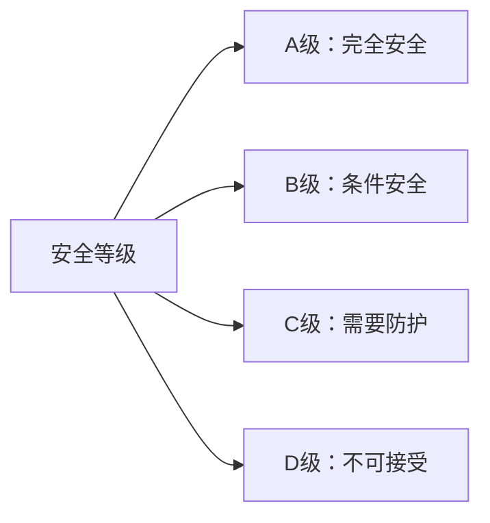
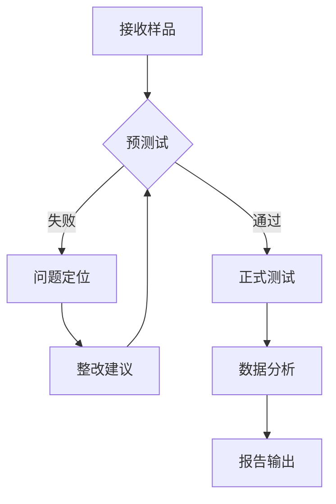

# GB/T 12113-2023 - 接触电流和保护导体电流的测量方法

## 1. 标准概述

### 1.1 技术摘要

> GB/T 12113-2023规定了接触电流和保护导体电流的测量方法，基于人体阻抗网络模拟技术，为各种电气电子设备的安全评估提供标准化测量手段。该标准等同采用IEC 60990:2016，确保与国际标准的技术一致性。

### 1.2 标准定位

- **技术领域**：电气安全/人体安全电流评估
- **应用层级**：基础标准/测试方法标准
- **强制属性**：推荐性国家标准
- **实施状态**：现行有效

## 2. 物理原理与理论基础

### 2.1 电磁现象机理

> 接触电流现象基于人体与带电导体接触时形成的电流回路，其安全性取决于通过人体的电流大小和频率特性。

**基本电流定律：**
$$I_t = \frac{U}{Z_h(f)}$$

**人体阻抗频率特性：**
$$Z_h(f) = R_h + \frac{1}{j\omega C_h}$$

### 2.2 数学模型

**接触电流测量网络模型：**
$$I_{touch} = \frac{V_{equipment}}{Z_{network}(f)}$$

**保护导体电流测量：**
$$I_{PE} = \frac{V_{resistor}}{R_{measuring}}$$

### 2.3 关键参数定义

> **重要说明**：所有公式中出现的字母和符号必须在此表格中给出明确的定义和物理意义说明。

| 参数符号 | 参数名称 | 物理意义 | 单位 | 典型值 |
|---------|---------|---------|------|---------|
| $I_t$ | 接触电流 | 通过人体的电流 | mA | 0.1-10 |
| $U$ | 接触电压 | 人体接触点电压 | V | 0-300 |
| $Z_h(f)$ | 人体阻抗 | 频率相关的人体阻抗 | Ω | 1000-2000 |
| $R_h$ | 人体电阻 | 人体直流电阻分量 | Ω | 1500 |
| $C_h$ | 人体电容 | 人体电容分量 | μF | 0.22 |
| $f$ | 频率 | 交流电频率 | Hz | 15-10000 |
| $\omega$ | 角频率 | $\omega = 2\pi f$ | rad/s | - |
| $I_{PE}$ | 保护导体电流 | 保护接地导体电流 | mA | 0.1-5 |

## 3. 技术要求详解

### 3.1 限值要求

> 不同设备类别的接触电流和保护导体电流限值要求

| 设备类别 | 正常条件接触电流 | 故障条件接触电流 | 保护导体电流 |
|---------|-----------------|-----------------|-------------|
| IT设备 | ≤3.5mA (AC) | ≤3.5mA (AC) | ≤3.5mA |
| 家用电器 I类 | ≤0.75mA (AC) | ≤3.5mA (AC) | ≤3.5mA |
| 家用电器 II类 | ≤0.25mA (AC) | ≤0.25mA (AC) | N/A |
| 音视频设备 | ≤1.0mA (AC) | ≤3.5mA (AC) | ≤5.0mA |
| 医疗设备 | ≤0.5mA (AC) | ≤1.0mA (AC) | ≤5.0mA |

### 3.2 性能等级划分



### 3.3 适用范围界定

- **包含**：额定电压≤1000V的电气电子设备
- **不包含**：医疗器械患者连接部分
- **特殊考虑**：高压设备和特殊环境应用

## 4. 测试方法与程序

### 4.1 测试配置

> 接触电流测试配置示意图

```
AC电源 ----[隔离变压器]----[被测设备]----[测量网络]----[测量仪器]
     |                                    |
     |________________[接地系统]_____________|
```

### 4.2 测试步骤

1. **准备阶段**
   - 环境条件确认：温度15-35°C，湿度45-75%RH
   - 设备校准检查：所有测量仪器在有效校准周期内
   - EUT预处理：被测设备按说明书要求预热

2. **执行阶段**
   - 步骤1：连接人体阻抗模拟网络
   - 步骤2：设置额定工作条件(电压、频率、负载)
   - 步骤3：测量正常工作条件下的接触电流
   - 步骤4：模拟单故障条件测量

3. **数据记录**
   - 原始数据记录：真有效值电流测量结果
   - 异常现象记录：测试过程中的异常情况

### 4.3 判定准则

> 测量值≤限值且测量不确定度在可接受范围内时判定为合格

## 5. 测试设备与环境

### 5.1 主要测试设备

| 设备名称 | 技术指标 | 校准要求 | 参考型号 |
|---------|---------|---------|----------|
| 数字万用表 | DC/AC 0.1μA-10A, ±0.1% | 12个月 | Keysight 34461A |
| 示波器 | 带宽≥100MHz, ±2% | 12个月 | Tektronix MSO5034 |
| 隔离变压器 | 容量1-5kVA, 隔离电压≥4kV | 12个月 | - |
| 人体阻抗网络 | R=1500Ω±1%, C=0.22μF±10% | 24个月 | - |
| 标准电阻 | 10mΩ±0.1%, 功率≥5W | 12个月 | - |

### 5.2 测试环境要求

- **电磁环境**：背景场强<1V/m
- **物理环境**：温度15-35°C, 湿度45-75%RH
- **电源质量**：电压稳定度±1%, 谐波失真<3%

## 6. 工程实施指南

### 6.1 典型问题与对策

| 常见问题 | 可能原因 | 建议对策 | 预期效果 |
|---------|---------|---------|----------|
| 接触电流超标 | 绝缘不良、接地异常 | 改进绝缘设计、检查接地 | 降低至限值以下 |
| 测量不稳定 | 环境干扰、设备校准 | 屏蔽干扰源、重新校准 | 提高测量可靠性 |
| 保护导体电流过大 | 滤波器漏电流 | 优化滤波器设计 | 满足限值要求 |

### 6.2 测试流程优化



### 6.3 成本控制建议

- **设备复用**：多种测试共用基础测量设备
- **时间优化**：合理安排测试顺序减少切换时间
- **人员配置**：1名工程师+1名技术员的标准配置

## 7. 标准差异与互认

### 7.1 国际标准对比

| 对比项 | 本标准 | 国际标准 | 差异说明 | 互认情况 |
|--------|--------|----------|----------|----------|
| 测量网络参数 | 与IEC一致 | IEC 60990:2016 | 无差异 | 完全互认 |
| 频率范围 | 15Hz-10kHz | 15Hz-10kHz | 无差异 | 完全互认 |
| 校准要求 | 12/24个月 | 12/24个月 | 无差异 | 完全互认 |
| 环境条件 | 15-35°C | 15-35°C | 无差异 | 完全互认 |

### 7.2 认证互认指南

- **直接互认**：按本标准测试的结果可直接用于IEC体系认证
- **条件互认**：需确认测量设备校准状态
- **不可互认**：特殊要求或非标准测试条件

## 8. 相关标准导航

### 8.1 上游标准

- [[IEC_60050-161]] - 电工术语：电气安全基础概念
- [[IEC_60990-2016]] - 本标准的国际对应版本

### 8.2 平行标准

- [[GB_4943.1-2022]] - 信息技术设备安全标准
- [[GB_8898-2011]] - 音视频设备安全标准
- [[GB_4706.1-2005]] - 家用电器安全标准

### 8.3 下游标准

- [[GB_34660-2017]] - 道路车辆电磁兼容性要求
- [[QC_T_413]] - 汽车电气设备基本技术条件

### 接触电流测试程序

#### 正常工作条件测试
1. **基本连接**
   - 将被测设备连接到测量网络
   - 确保正确的接地连接
   - 连接测量仪器
   - 验证电路连接

2. **测量执行**
   - 在额定电压下进行测量
   - 记录稳态电流值
   - 进行电源极性反转测试
   - 测试所有可能的工作模式

3. **数据记录**
   - 记录最大接触电流值
   - 记录测量条件和环境参数
   - 保存波形数据（如需要）
   - 计算真有效值

#### 单故障条件测试
1. **故障模拟**
   - 模拟单一元件故障
   - 断开一根电源线
   - 断开保护接地线
   - 短路故障模拟

2. **故障状态测量**
   - 在故障条件下测量接触电流
   - 记录最大故障电流
   - 验证保护措施有效性
   - 评估安全性能

### 保护导体电流测试

#### 测试配置
- **电流路径**：在保护导体中串联测量网络
- **测量点**：保护接地导体的指定位置
- **负载条件**：设备在满载或规定负载下工作
- **环境条件**：标准环境温度和湿度

#### 测量程序
1. **基准测量**
   - 正常工作条件下的保护导体电流
   - 不同负载条件下的电流变化
   - 电源电压变化时的电流响应

2. **极限测量**
   - 最大工作电流条件
   - 最高工作温度条件
   - 电源电压上限条件

### 数据处理与分析

#### 测量数据处理
- **真有效值计算**：对非正弦波电流进行RMS计算
- **峰值分析**：记录瞬态峰值电流
- **频谱分析**：分析电流的频率成分
- **统计分析**：多次测量的统计处理

#### 不确定度评估
- **测量系统不确定度**：仪器精度贡献
- **环境不确定度**：温湿度变化影响
- **重复性不确定度**：多次测量变化
- **合成不确定度**：总体测量不确定度

## 性能评估与判定准则

### 接触电流限值标准

#### 正常工作条件限值
- **直流接触电流**：≤2mA（一般设备）
- **交流接触电流**：≤0.5mA（一般设备）
- **IT设备**：≤3.5mA（GB 4943.1要求）
- **家用电器**：≤0.75mA（GB 4706.1要求）
- **音视频设备**：≤1mA（GB 8898要求）

#### 单故障条件限值
- **交流接触电流**：≤3.5mA（一般设备）
- **直流接触电流**：≤10mA（一般设备）
- **I类设备**：≤5mA（保护接地存在）
- **II类设备**：≤0.25mA（双重绝缘）

### 保护导体电流限值

#### 设备类型限值
- **便携式设备**：≤3.5mA
- **固定安装设备**：≤5mA
- **大功率设备**：≤1mA/A（每安培额定电流）
- **医疗设备**：≤5mA（非患者连接）

#### 测量条件要求
- **额定工作条件**：设备在额定功率下工作
- **环境温度**：最高工作温度条件
- **电源电压**：额定电压±10%范围

### 合格判定标准

#### 符合性评估
- **测量值≤限值**：完全符合要求
- **测量值>限值**：不符合要求，需要改进
- **临界值判定**：考虑测量不确定度的影响
- **条件符合**：特定使用条件下符合要求

#### 测量可靠性评估
- **重复性**：连续5次测量结果的标准偏差≤5%
- **再现性**：不同时间测量结果偏差≤10%
- **准确性**：测量系统总不确定度≤10%
- **稳定性**：长期测量漂移≤2%

## 与相关标准的关系

### 国际标准对应
- **[[IEC 60990:2016]]**：直接对应的国际标准，技术内容等同
- **EN 60990:2016**：欧洲标准，与IEC标准一致
- **ANSI/UL相关标准**：美国对应的安全测试标准
- **JIS C 6950-1**：日本对应的信息技术设备安全标准

### 产品安全标准引用
- **[[GB 4943.1-2022]]**：信息技术设备安全，引用本标准进行接触电流测试
- **[[GB 8898-2011]]**：音视频设备安全，规定具体接触电流限值
- **[[GB 4706.1-2005]]**：家用电器安全，引用本标准作为测试方法
- **GB 9706.1-2020**：医用电气设备安全，规定医疗设备的特殊要求

### EMC标准协调
- **[[CISPR 25]]**：车辆EMC标准，在电气安全方面相互补充
- **[[GB/T 4365]]**：EMC术语标准，提供术语定义支持
- **GB 17799.4**：电磁兼容通用标准，工业环境抗扰度要求
- **GB/T 6113.1**：无线电骚扰和抗扰度测量设备规范

### 汽车行业应用标准
- **[[GB 34660-2017]]**：道路车辆电磁兼容性要求和试验方法
- **QC/T 413**：汽车电气设备基本技术条件
- **GB/T 18488**：电动汽车用电机及其控制器技术条件
- **GB/T 20234**：电动汽车传导充电用连接装置

## 测试报告要求

### 必要内容
1. **标准引用**：GB/T 12113-2023及相关产品安全标准版本
2. **设备信息**：被测设备完整技术参数、型号、制造商信息
3. **测试条件**：环境条件、电源条件、测试配置详细描述
4. **测量数据**：完整的测量记录、波形图、数据表格
5. **测试设备**：所有使用设备的校准状态和技术参数
6. **符合性评估**：与适用限值的比较和判定结论
7. **不确定度分析**：测量不确定度的详细评估
8. **技术照片**：测试配置和设备连接的现场照片

### 数据记录表格

#### 接触电流测试记录
| 测试条件 | 测量点 | 电流类型 | 测量值(mA) | 限值(mA) | 判定结果 |
|----------|--------|----------|------------|----------|----------|
| 正常工作 | 外壳-地 | AC | 0.35 | 0.5 | 合格 |
| 故障条件 | 外壳-地 | AC | 2.8 | 3.5 | 合格 |
| 极性反转 | 外壳-地 | AC | 0.42 | 0.5 | 合格 |

#### 保护导体电流记录
| 负载条件 | 测量电流(mA) | 限值(mA) | 判定结果 | 备注 |
|----------|--------------|----------|----------|------|
| 满载 | 2.1 | 3.5 | 合格 | 额定功率 |
| 过载110% | 2.8 | 3.5 | 合格 | 过载测试 |

### 质量控制
- **数据完整性**：确保所有测试项目和数据完整记录
- **可追溯性**：所有测量设备具有有效校准证书
- **重现性**：提供足够详细的测试条件以便重现
- **审核签字**：测试工程师、技术审核、授权签字完整

## 新技术发展趋势

### 电动汽车技术挑战
- **高压系统安全**：400V/800V高压系统的接触电流测试
- **无线充电技术**：感应充电系统的电磁安全评估
- **快充技术**：大功率充电设备的接触电流控制
- **电池管理系统**：BMS系统的电气安全测试

### 智能网联技术
- **5G通信设备**：车载5G设备的电气安全要求
- **自动驾驶系统**：高功率计算单元的安全测试
- **传感器融合**：多传感器系统的综合安全评估
- **V2X通信**：车载通信设备的接触电流测试

### 测试技术发展
- **自动化测试**：测试过程的自动化和智能化
- **远程测试**：基于物联网的远程测试能力
- **大数据分析**：测试数据的统计分析和趋势预测
- **人工智能**：AI辅助的测试结果分析和判定

## 实施指导

### 设计阶段考虑
1. **安全设计**：在产品设计初期考虑接触电流限制
2. **绝缘设计**：优化绝缘结构减少漏电流
3. **接地设计**：合理的接地系统设计
4. **EMC协调**：与EMC设计要求的协调统一

### 测试实施策略
1. **预测试**：设计验证阶段的预测试
2. **样机测试**：工程样机的全面安全测试
3. **型式试验**：产品定型的正式测试
4. **生产测试**：批量生产的抽样测试

### 成本控制
1. **测试优化**：合理安排测试项目和频次
2. **设备共享**：测试设备的高效利用
3. **外包测试**：利用专业测试机构的服务
4. **标准化流程**：建立标准化的测试流程

---

## 相关资源链接

- **官方标准**：[国家标准全文公开系统 - GB/T 12113-2023](http://openstd.samr.gov.cn)
- **IEC标准**：[IEC Webstore - IEC 60990:2016](https://webstore.iec.ch)
- **技术指导**：[[电气安全测试实施指南]]
- **测试设备**：[[接触电流测试设备选型]]
- **案例分析**：[[汽车电气安全测试案例]]

---

*最后更新：2024年6月16日*  
*版本：GB/T 12113-2023解读*  
*编制：汽车电子安全技术委员会*