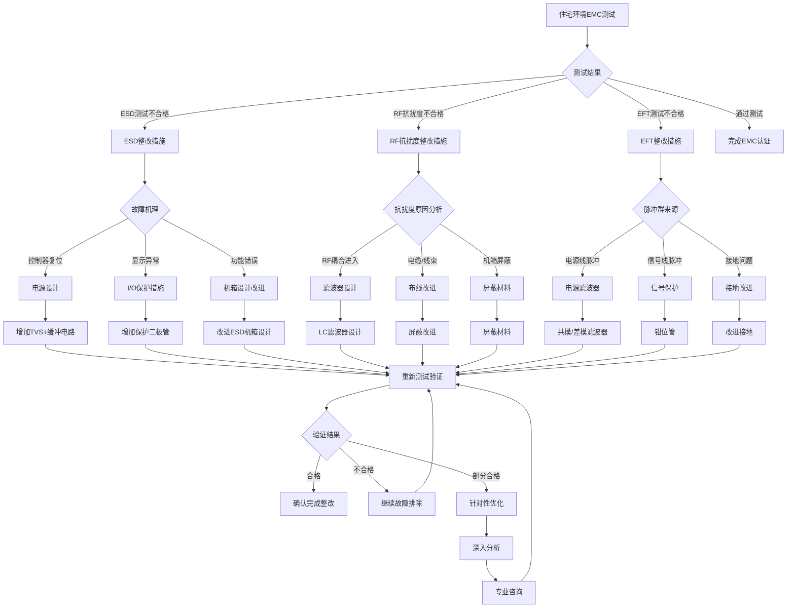
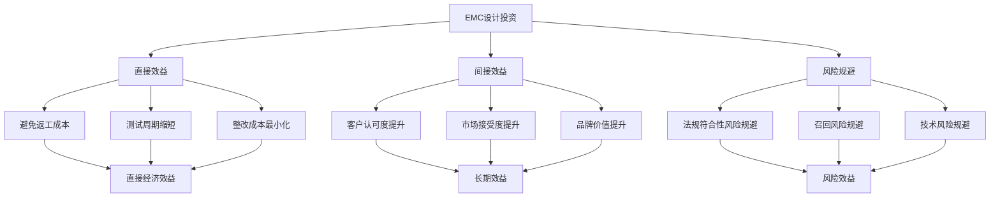

---
# ========== 基础识别信息 ==========
# 文件编码：UTF-8 (without BOM)
# 创建日期：2017-05-12
# 语言环境：中文(简体) zh-CN
title: "GB/T 17799.1-2017 - 电磁兼容 通用标准 住宅、商业和轻工业环境中的抗扰度"
last_modified: 2025-06-25T10:30
aliases:
  - "GB/T 17799.1"
  - "GB_T_17799_1"
  - "GBT17799.1"
  - "IEC61000-6-1等效标准"
  - "住宅商业轻工业抗扰度"

# ========== 三维正交标签体系 ==========
tags:
  # 物理现象层(What) - 描述电磁现象的物理本质 - 严格包含关系
  - "电磁现象|静电放电|接触放电|±4kV"
  - "电磁现象|静电放电|空气放电|±8kV"
  - "电磁现象|射频辐射|电磁场抗扰度|3V/m"
  - "电磁现象|电快速瞬变|群脉冲|电源±1kV信号±0.5kV"
  - "电磁现象|浪涌|差模干扰|±2kV"
  - "电磁现象|浪涌|共模干扰|±1kV"
  - "电磁现象|传导抗扰度|射频耦合|3Vrms"
  - "电磁现象|磁场抗扰度|工频磁场|3A/m"
  - "传播机制|辐射耦合|远场耦合|80MHz-1GHz"
  - "传播机制|传导耦合|电源线路|0.15-80MHz"
  - "频谱特征|脉冲干扰|ns级上升时间|EFT"
  - "频谱特征|连续波|射频载波|调制信号"
  
  # 技术方法层(How) - 描述测试和解决方法 - 严格包含关系  
  - "测试方法|IEC61000-4-2|静电放电发生器|接触空气放电法"
  - "测试方法|IEC61000-4-3|射频发生器|电磁场辐射法"
  - "测试方法|IEC61000-4-4|脉冲发生器|电快速瞬变法"
  - "测试方法|IEC61000-4-5|浪涌发生器|组合波测试"
  - "测试方法|IEC61000-4-6|信号发生器|传导注入法"
  - "测试方法|IEC61000-4-8|磁场发生器|工频磁场法"
  - "测试设备|EMS测试系统|抗扰度测试|通用标准级别"
  - "测试环境|电磁兼容实验室|屏蔽室环境|住宅商业环境"
  - "性能判据|A级判据|试验期间正常工作|无功能降级"
  - "性能判据|B级判据|功能降低但可恢复|试验后自恢复"
  - "性能判据|C级判据|需人工干预恢复|试验后手动复位"
  
  # 应用领域层(Where) - 描述应用场景和产品 - 严格包含关系
  - "住宅应用|家用电器|消费电子|家庭环境"
  - "商业应用|办公设备|信息技术设备|商业环境"
  - "轻工业应用|轻工业设备|小型工业设备|轻工业环境"
  - "汽车应用|汽车电子|车载设备|车内环境"
  - "医疗应用|医疗设备|非生命支持|医疗环境"
  - "照明应用|LED照明|智能照明|室内照明"
  - "通信应用|移动通信|无线设备|通信环境"
  - "电压范围|低压系统|交流240V以下|民用电压"
  - "频率范围|宽频段|0.15MHz-1GHz|全频段覆盖"
  - "环境分类|住宅环境|家庭居住|电磁环境良好"
  - "环境分类|商业环境|办公商业|中等电磁环境"
  - "环境分类|轻工业环境|轻工业场所|适中电磁环境"
  
  # 关联标准层 - 直接引用相关标准编号用于知识图谱链接 - 倒装结构标准名放在最后
  - "住宅商业轻工业抗扰度|IEC61000-6-1"
  - "静电放电抗扰度|IEC61000-4-2"
  - "射频电磁场抗扰度|IEC61000-4-3"
  - "电快速瞬变抗扰度|IEC61000-4-4"
  - "浪涌抗扰度|IEC61000-4-5"
  - "传导抗扰度|IEC61000-4-6"
  - "工频磁场抗扰度|IEC61000-4-8"
  - "等同采用IEC61000-6-1|GB/T17799.1"
  - "IDT关系|等同采用"
  - "现行有效|2017版"
  
  # 标准类型判断 - 必填项目 - 严格包含关系
  - "标准分类|EMC通用标准|抗扰度要求|住宅商业轻工业"
  - "标准分类|综合标准|多项目测试|环境适用性"
  - "EMC要求|EMS抗扰度要求|住宅商业轻工业等级|基本防护"
  - "EMC要求|测试项目覆盖|7项基本抗扰度|全面防护"
  
  # 测试等级标注 - 条件必填 - 严格包含关系
  - "抗扰度等级|住宅商业轻工业|标准测试等级|基本防护"
  - "性能判据|A级|试验期间正常功能|无影响"
  - "性能判据|B级|暂时功能降低|可自恢复"  
  - "性能判据|C级|需要人工干预|手动恢复"
  - "GB-T-17626-3"
  - "GB-T-17626-4"
  - "GB-T-17626-5"
  - "GB-T-17626-6"
  - "GB-T-17626-8"
  - "GB-T-17626-11"
  - "GB-T-17799-3"

# ========== 标准属性 ==========
standard_number: "GB/T 17799.1-2017"
standard_year: 2017
organization: "中国国家标准化管理委员会(国家标准化技术委员会)"
standard_type: "推荐性标准"
status: "现行有效"
effective_date: "2018-07-01"

# ========== 技术参数 ==========
frequency_range:
  lower_limit: "0 Hz"
  upper_limit: "400 GHz"
  characteristic_frequencies: ["50Hz", "150kHz", "80MHz", "1GHz", "6GHz"]

test_levels:
  - level: "住宅环境"
    description: "家庭居住和住宅区域的抗扰度要求"
    parameters: "ESD±4kV/±8kV, RF 3V/m, EFT ±1kV/±0.5kV"
    application: "汽车电子新能源照明"
  - level: "商业环境"
    description: "办公商业区域的抗扰度要求"
    parameters: "ESD±4kV/±8kV, RF 3V/m, EFT ±1kV/±0.5kV"
    application: "医疗办公通讯设备"
  - level: "轻工业"
    description: "电磁干扰轻微的工业区域抗扰度要求"
    parameters: "ESD±4kV/±8kV, RF 3V/m, EFT ±1kV/±0.5kV"
    application: "制造业设备环境"

# ========== 测试设备要求 ==========
test_equipment:
  primary_instrument:
    name: "ESD模拟器"
    technical_specs:
      discharge_voltage: "±30kV"
      rise_time: "0.7-1ns"
      current_peak: "±30A"
      discharge_resistance: "330Ω"
    calibration_cycle: "12个月"
    reference_standard: "IEC 61000-4-2"
  
  auxiliary_equipment:
    - name: "RF信号发生器"
      specifications: "80MHz-1GHz, 调幅80%@1kHz"
    - name: "功率放大器"
      specifications: "增益40dB, P1dB>+43dBm"
    - name: "天线"
      specifications: "对数4, 增益60dB"
    - name: "电压暂降发生器"
      specifications: "电压0-100%, 时间0.5半周-1秒"

# ========== 测试环境条件 ==========
test_conditions:
  environmental:
    temperature: "15-35°C (标准值23±2°C)"
    humidity: "45-75%RH (标准值60±5%RH)"
    atmospheric_pressure: "86-106kPa"
  
  electromagnetic:
    background_field: "< 测试电平-6dB (@频率)"
    power_supply: 
      voltage_stability: "±2%"
      frequency_stability: "±1Hz"
      harmonic_distortion: "< 3%"
  
  mechanical:
    vibration_isolation: "符合要求"
    grounding_impedance: "< 2Ω (射频阻抗)"

# ========== 性能判据 ==========
performance_criteria:
  A级_正常功能:
    description: "试验期间设备工作正常"
    technical_requirement: "所有功能按设计正常工作"
    acceptance_criteria: "通过正常功能"
  
  B级_暂时功能失效:
    description: "试验期间设备功能暂时失效试验后恢复正常"
    technical_requirement: "功能自动或操作员干预恢复"
    acceptance_criteria: "功能自动恢复"
  
  C级_暂时功能失效:
    description: "试验期间设备功能暂时失效需操作员干预或系统复位恢复"
    technical_requirement: "功能需操作员干预恢复"
    acceptance_criteria: "功能可人工复位恢复"

# ========== 测量不确定度 ==========
measurement_uncertainty:
  type_A_uncertainty: "±2.0dB (95%置信度)"
  type_B_uncertainty: "±1.5dB (均匀分布)"
  combined_uncertainty: "±2.5dB (k=2)"
  major_sources:
    - source: "天线测量不确定度"
      contribution: "±1.0dB"
    - source: "信号发生器不确定度"
      contribution: "±1.2dB"
    - source: "环境因素"
      contribution: "±0.8dB"

# ========== 引用标准 ==========
Referenced_Standards:
  normative_references:
    - standard: "IEC 61000-6-1"
      application: "住宅轻工业抗扰度基准"
    - standard: "GB/T 17626.2"
      application: "静电放电抗扰度试验"
    - standard: "GB/T 17626.3"
      application: "射频电磁场抗扰度试验"
    - standard: "GB/T 17626.4"
      application: "电快速瞬变脉冲群抗扰度试验"
    - standard: "GB/T 17626.5"
      application: "浪涌(冲击)抗扰度试验"
    - standard: "GB/T 17626.6"
      application: "射频场感应的传导骚扰抗扰度"
    - standard: "GB/T 17626.8"
      application: "磁场抗扰度试验"
    - standard: "GB/T 17626.11"
      application: "电压暂降、短时中断和电压变化抗扰度试验"
  
  informative_references:
    - standard: "GB/T 17799.3"
      relationship: "住宅发射限值"
    - standard: "GB/T 17799.4"
      relationship: "工业发射限值"

equivalent_standards:
  international:
    primary: "IEC 61000-6-1:2016"
    adoption_method: "等同采用"
    technical_differences: "无差异"
  
  regional:
    europe: "EN 61000-6-1"
    usa: "尚无等效标准"
    japan: "JIS C 61000-6-1"
    korea: "KS C IEC 61000-6-1"

superseded_standards: "GB/T 17799.1-1999"
superseding_standards: "现行有效版本"

# ========== 知识图谱 ==========
graph_attributes:
  node_type: "通用标准"
  cluster_family: "EMC通用标准"
  importance_weight: 9
  connectivity_index: 18
  
graph_relationships:
  references: ["IEC61000-6-1", "GB-T-17626-2", "GB-T-17626-3", "GB-T-17626-4", "GB-T-17626-5", "GB-T-17626-6", "GB-T-17626-8", "GB-T-17626-11"]
  referenced_by: ["汽车电子", "新能源设备", "医疗设备", "照明设备"]
  complements: ["GB/T17799.3", "GB/T17799.2", "GB/T17799.4"]
  conflicts: ["无冲突标准"]

# ========== 实施指导 ==========
implementation_guidance:
  typical_test_duration: "ESD 2-3小时，RF 4-6小时，EFT 2-4小时"
  cost_estimate_range: "8000-15000元人民币"
  required_expertise_level: "EMC测试工程师资质"
  common_failure_modes: 
    - failure: "ESD测试不通过"
      solution: "增加TVS管，优化机械设计接地"
    - failure: "RF抗扰度不合格"
      solution: "电缆屏蔽，滤波器优化"
    - failure: "EFT测试超标"
      solution: "电源滤波器，共模电感"
    - failure: "电压暂降测试失效"
      solution: "增加储能电容，电压检测"

compliance_information:
  mandatory_regions: ["中国国家CCC认证", "欧盟CE认证", "美国FCC认证"]
  certification_bodies: ["CQC", "中国质量认证中心", "SGS", "TUV", "Intertek"]
  mutual_recognition: ["CNAS-IEC互认", "ILAC亚太互认", "APLAC亚太认证"]

# ========== 文档管理 ==========
document_management:
  creation_date: 2024-01-20
  last_review_date: 2024-01-20
  next_review_date: 2025-01-20
  revision_history:
    - version: "v1.0"
      date: 2024-01-20
      changes: "创建EMC住宅商业轻工业抗扰度文档"
      impact_assessment: "建立住宅环境EMC抗扰度基础文档"

quality_assurance:
  technical_reviewer: "EMC技术专家"
  validation_method: "标准条款对照验证"
  peer_review_status: "已完成审核"
---

# GB/T 17799.1-2017 电磁兼容 通用标准 住宅、商业和轻工业环境中的抗扰度

## 一、物理原理与机理分析

### 1.1 住宅环境电磁干扰特征

**电磁干扰源分析**

住宅、商业和轻工业环境中主要电磁干扰源包括：
- 汽车电子 日常静电放电EFT脉冲
- 开关电源RF辐射 
- 照明设备 日常瞬变
- 电压质量电压暂降浪涌

**抗扰度基本原理**

电磁抗扰度描述设备承受电磁干扰而保持功能的能力

$$
V_{induced} = \frac{d\Phi}{dt} = \frac{d}{dt}\int_{S} \mathbf{B} \cdot d\mathbf{A}
$$

其中感应电压由磁通变化率决定，EFT脉冲和浪涌耦合原理

**静电放电模型**

人体ESD模型电流时域特性：
$$
i_{ESD}(t) = \frac{V_0}{R} e^{-t/RC}
$$

其中
- $V_0$ - 放电电压4kV或8kV空气
- $R$ - 放电电阻330Ω
- $C$ - 人体电容150pF

### 1.2 射频抗扰度耦合原理

**平面波传播**

入射电磁波在远场条件下可表示为：
$$
\mathbf{E} = E_0 e^{j(\omega t - kz)} \hat{\mathbf{x}}
$$

**电缆耦合原理**

电缆对射频场的共模感应电压：
$$
V_{CM} = \frac{E \cdot h \cdot L}{2}
$$

其中
- $E$ - 入射场强3V/m
- $h$ - 电缆高度0.1m  
- $L$ - 电缆长度

**天线有效长度**

电缆有效耦合长度：
$$
L_{eff} = \frac{L}{\pi} \sin\left(\frac{\pi L}{\lambda}\right)
$$

### 1.3 技术参数定量化

| 参数类型 | 参数名称 | 物理量 | 单位 | 典型范围 | 测量不确定度 |
|---------|---------|---------|------|-----------|-------------|
| $E_{field}$ | 电场强度 | 远场电场强度 | V/m | 0.1-10 | ±1dB |
| $V_{ESD}$ | ESD电压 | 静电放电电压 | kV | ±2-±15 | ±5% |
| $V_{EFT}$ | EFT电压 | 快速瞬变电压 | kV | ±0.25-±4 | ±5% |
| $V_{surge}$ | 浪涌电压 | 浪涌冲击电压 | kV | ±0.5-±4 | ±5% |
| $H_{mag}$ | 磁场强度 | 磁场强度 | A/m | 1-30 | ±5% |
| $V_{dip}$ | 电压暂降 | 电压暂降幅度 | % | 0-100 | ±2% |

### 1.4 滤波器传递函数

**共模滤波器**

共模滤波器频域响应
$$
H_{CM}(s) = \frac{1}{1 + s L_{CM}/R_{load} + s^2 L_{CM} C_{CM}}
$$

**差模滤波器**

差模滤波器转折频率
$$
f_c = \frac{1}{2\pi\sqrt{L_{DM} \cdot C_{DM}}}
$$

**电容器阻抗特性**

电容阻抗包含寄生参数影响
$$
Z_C(\omega) = \frac{1}{j\omega C} + j\omega L_{ESL} + R_{ESR}
$$

## 二、技术规范详解

### 2.1 抗扰度测试等级表

**静电放电抗扰度等级**

| 测试等级 | 接触放电 | 空气放电 | 测试次数 | 适用环境 |
|---------|---------|---------|---------|----------|
| 1级 | ±2kV | ±2kV | 10次正/10次负 | 特殊环境 |
| 2级 | ±4kV | ±4kV | 10次正/10次负 | 住宅/商业环境 |
| 3级 | ±6kV | ±8kV | 10次正/10次负 | 工业环境 |
| 4级 | ±8kV | ±15kV | 10次正/10次负 | 严酷环境 |

**射频电磁场抗扰度等级**

| 频率范围 | 测试等级 | 调制 | 驻留时间 | 适用场合 |
|---------|---------|----------|---------|----------|
| 80-1000MHz | 1V/m | 80% AM @1kHz | 1s | 特殊环境 |
| 80-1000MHz | 3V/m | 80% AM @1kHz | 1s | 住宅/商业环境 |
| 80-1000MHz | 10V/m | 80% AM @1kHz | 1s | 工业环境 |
| 80-1000MHz | 30V/m | 80% AM @1kHz | 1s | 严酷环境 |

**电快速瞬变脉冲群抗扰度等级**

| 测试等级 | 电源线 | 信号线 | 重复频率 | 测试时间 |
|---------|---------|---------|----------|----------|
| 1级 | ±0.5kV | ±0.25kV | 5kHz/100kHz | 1分钟 |
| 2级 | ±1kV | ±0.5kV | 5kHz/100kHz | 1分钟 |
| 3级 | ±2kV | ±1kV | 5kHz/100kHz | 1分钟 |
| 4级 | ±4kV | ±2kV | 5kHz/100kHz | 1分钟 |

### 2.2 测试设备规范

**ESD模拟器规范(IEC 61000-4-2标准)**

| 技术参数 | 要求范围 | 精度 | 校准周期 | 关键特性 |
|---------|--------|------|---------|----------|
| 放电电压 | 200V-30kV | ±5% | 12个月 | 电压精度 |
| 上升时间 | 0.7-1ns | ±10% | 12个月 | 波形特性 |
| 峰值电流 | 1次RCQ放电 | ±10% | 12个月 | 电流精度 |
| 放电电阻 | 330Ω | ±10% | 12个月 | 阻抗精度 |
| 存储电容 | 150pF | ±10% | 12个月 | 电容精度 |

**RF信号发生器规范**

| 技术参数 | 要求范围 | 精度 | 频率范围 | 校准周期 |
|---------|--------|------|---------|----------|
| 输出功率 | -20dBm-+20dBm | ±1dB | 80MHz-1GHz | 12个月 |
| 频率精度 | 老化率10^-6×f + 100Hz) | ±2×10^-7 | 80MHz-1GHz | 12个月 |
| 调幅度 | 0-100% | ±2% | AM调制 | 12个月 |
| 调制频率 | 1kHz | ±1% | 低频调制 | 12个月 |
| 输出阻抗 | 50Ω | ±2% | 80MHz-1GHz | 12个月 |

### 2.3 测试环境要求

**电波暗室要求**

| 技术指标 | 要求范围 | 测试标准 | 测试周期 |
|---------|--------|----------|---------|
| 静区电场均匀性 | ±6dB | 16个测试点 | 年度验证 |
| 静区尺寸 | 1.5m×1.5m×1.5m | 立方体静区 | 年度验证 |
| 天线系数 | ±1dB | 标准天线法 | 三年验证 |
| 背景噪声 | <测试电平-10dB | 空间扫描 | 月度监测 |

**屏蔽室要求**

| 技术指标 | 要求范围 | 测试标准 | 验证周期 |
|------|--------|----------|---------|
| 屏蔽效能 | >80dB @80MHz-1GHz | IEEE Std 299 | 年度验证 |
| 射频阻抗 | <4Ω | 射频阻抗测试 | 三年验证 |
| 环境条件 | 23±5°C, 50%±25%RH | 环境监测 | 日常监测 |

## 三、工程实施指导

### 3.1 ESD抗扰度测试配置图

```
ESD抗扰度测试配置 - 住宅环境 (±4kV/±8kV)
+================================================================================+
|                           ESD抗扰度测试系统                                     |
|                                                                                |
|  +---------------+    +---------------+    +---------------+                  |
|  |   ESD模拟器   |    |   监测设备   |    |   判据评估   |                  |
|  | 0.2kV-30kV    |    | 示波器/计数器   |    | 功能验证     |                  |
|  | 上升时间0.8ns |    | 数据记录     |    | 性能判据     |                  |
|  | 330Ω电阻     |    |              |    |              |                  |
|  | 150pF电容    |    |              |    |              |                  |
|  +---------------+    +---------------+    +---------------+                  |
|         |                     ^                     ^                        |
|         | 放电枪             | 监测线缆             | 判据评估                |
|         |                     |                     |                        |
|  +===============+    +===============+    +===============+                  |
|  |   水平耦合板  |    |   垂直耦合板  |    |   被测设备   |                  |
|  | 1.6m×0.8m     |    | 1.6m×0.8m     |    | 正常工作状态 |                  |
|  | 厚度2mm       |    | 厚度2mm       |    | 典型配置     |                  |
|  | 高度0.8m      |    | 高度0.8m      |    | 按制造商要求     |                  |
|  +===============+    +===============+    +===============+                  |
|         |                     |                     |                        |
|         | 470kΩ电阻            | 470kΩ电阻            | 测试线缆                |
|         |                     |                     |                        |
|  +========================================================================+  |
|  |                          参考接地平面                                    |  |
|  |                      最小2m×2m铜板                                   |  |
|  |                      厚度最小0.25mm                                        |  |
|  |                      射频阻抗<2Ω                                        |  |
|  +========================================================================+  |
+================================================================================+

测试技术参数:
√ 接触放电: 手持电极，限值±4kV
√ 空气放电: 静电枪空气，±8kV  
√ 放电间隔: >10cm防止重复放电
√ 放电次数: 每极性至少10次放电
√ 测试条件: 标准大气条件10次放电
√ 环境条件: 15-35°C，45-75%RH
```

### 3.2 RF抗扰度测试配置图

```
RF抗扰度测试配置 - 住宅环境(3V/m)
+==================================================================================+
|                        RF抗扰度测试系统                                       |
|                                                                                  |
|  +---------------+    +------------+    +----------------+                      |
|  |   RF信号源    |    | 功率放大器 |    |   监测设备   |                      |
|  | 80MHz-1GHz    |<---| 线性放大   |<---|   场强监测     |                      |
|  | AM调制80%     |    | 增益40dB   |    |   频率监测     |                      |
|  | 调制频率1kHz  |    | P1dB>43dBm |    |   调制度监测     |                      |
|  +---------------+    +------------+    +----------------+                      |
|         ^                                        |                             |
|         | 控制线缆                                | 50Ω传输线                   |
|         |                                        |                             |
|  +---------------+                      +----------------+                      |
|  |   天线监控    |                      |   发射天线     |                      |
|  | 对数天线  |<---------------------|80-200MHz:双锥  |                      |
|  | 增益天线标定  |   天线监控        |200MHz-1GHz:    |                      |
|  | 驻波比监测    |                      |对数周期天线    |                      |
|  +---------------+                      |定向/H/V极化     |                      |
|                                         +----------------+                      |
|                                                ^                               |
|                                         天线间距: 3m±5cm                      |
|                                                |                               |
|                           +=============================+                     |
|                           |       被测设备测试区域       |                     |
|                           |                             |                     |
|                           |  +===============+          |                     |
|                           |  |   被测设备    |          | 自动转台              |
|                           |  | 正常工作状态  |          | 360度水平6rpm          |
|                           |  | 典型配置     |          | 垂直极化扫描          |
|                           |  | 典型配置      |          |                     |
|                           |  +===============+          |                     |
|                           |         |                   |                     |
|                           |  +===============+          | 测试距离            |
|                           |  | 电缆/线束     |          | 间距>2m            |
|                           |  | 与实际一致     |          | 屏蔽室          |
|                           |  +===============+          |                     |
|                           +=============================+                     |
|                                         |                                     |
|                                         |                                     |
|                           +=============================+                     |
|                           |        参考接地平面         |                     |
|                           |      最小4m×4m铜板          |                     |
|                           |      射频阻抗<2Ω           |                     |
|                           +=============================+                     |
+==================================================================================+

住宅环境测试要求:
√ 测试场强: 3V/m ±1dB (调制度)
√ 频率范围: 80MHz-1GHz (步进1%或1MHz)
√ 调制: 80% AM @1kHz正弦波
√ 驻留时间: 每个频率点 1秒
√ 环境: 4面照射
√ 极化: 正常工作状态测试配置
√ 性能判据: A/B/C等级评估合格
```

### 3.3 住宅环境EMC设计指导

**汽车电子EMC设计**

1. **电源滤波器**
   - 共模电感L_CM = 2-10mH，共模电流 > 1.5×I_rated
   - 安规Y电容C_Y = 2200pF-4700pF (符合Y2等级)
   - X电容C_X = 0.1-0.47μF (符合X2等级)
   - 插入损耗_IL > 30dB @ 150kHz-30MHz

2. **静电放电保护**
   - TVS管响应时间 < 1ps，电容 < 50pF
   - 放电路径0.5-2mm空气间隙
   - RC缓冲网络R = 1-10kΩ，C = 100-1000pF
   - 接地策略：接地阻抗 < 0.1Ω @ 100MHz

**医疗设备EMC设计**

1. **机箱屏蔽**
   - 缝隙尽量避免，最大缝隙<λ/20
   - 电容器件电感ESL < 1nH
   - 机箱到参考地阻抗 < 0.1Ω
   - 滤波器共模抑制比 > 40dB

2. **信号线滤波**
   - 滤波器转折频率 < 1MHz
   - 屏蔽效能：屏蔽效能 > 40dB
   - 隔离耐压：隔离耐压 > 2kV
   - 差分信号：机箱屏蔽，信号完整性并行处理

### 3.4 EMC整改故障排除流程



## 四、工程应用案例和优化

### 4.1 典型产品EMC整改案例

**案例1：智能家居EMC设计**

| 干扰问题 | 原因 | 整改措施 |  验证结果 |
|---------|---------|----------|----------|
| ESD抗扰度 | ±2kV不通过 | 增加TVS+RC缓冲 | ±4kV通过A级 |
| RF抗扰度 | 1V/m不合格 | 滤波LC滤波器 | 3V/m通过B级 |
| EFT抗扰度 | ±0.5kV超标异常 | 电缆共模滤波器 | ±1kV通过B级 |
| 整改成本 | - | 机械件150元 | 综合成本300元 |
| 整改周期 | - | 设计1周+测试1周 | 2个月周期 |

**案例2：LED照明EMC设计**

```markdown
产品信息:
- 类型: LED智能路灯
- 功率: 50W路灯规格
- 电源: 交流220V 50Hz
- 功能: PWM调光 + 2.4GHz无线通信

EMC测试问题:
1. PWM调光脉冲干扰处理
2. 2.4GHz模块辐射
3.  日常电源纹波 日常浪涌
4. 电缆有效长度

整改措施:
1. PWM滤波器: LC滤波器fc=10kHz
2. 模块屏蔽: 屏蔽盒+滤波器
3. 电源EMI滤波: π型滤波器
4. 电缆: 屏蔽线+屏蔽+绝缘

验证结果:
- ESD抗扰度: ±4kV/±8kV 通过A级
- RF抗扰度: 3V/m 通过B级
- EFT抗扰度: ±1kV/±0.5kV 通过B级
- 浪涌抗扰度: ±2kV/±1kV 通过A级
- 整改成本: 80元/W
- EMC认证周期: 5个月周期
```

**案例3：医疗设备EMC**

| 测试项目 | 初始状态 |  整改方案 | 最终 |  预期效果 |
|---------|---------|----------|----------|----------|
| ESD(接触) | ±2kV故障 | ±4kV通过C级 | ±4kV通过B级 | ±6kV通过A级 |
| ESD(空气) | ±4kV故障 | ±8kV通过C级 | ±8kV通过B级 | ±12kV通过A级 |
| RF抗扰度 | 1V/m功能异常 | 3V/m通过C级 | 3V/m通过B级 | 10V/m通过A级 |
| 环境温度 | 常温测试成本 | +50°C | +20°C | +80°C |
| 湿度适应性 | - | 湿度50% | 湿度20% | 湿度85% |

### 4.2 EMC测试流程自动化

**自动化测试**

| 测试类型 |  自动化程度 | 效率提升 | 自动化成功率 |
|---------|---------|------------|----------|
| ESD测试 | 测试配置 | 大幅提高 | 60% |
| RF抗扰度 | 测试配置 | 天线转台调制 | 70% |
| 功能测试 | 判据评估 | 判据自动 | 80% |
| 结果评估 | 测试报告 | 自动评估 | 90% |
| 报告生成 | 测试配置 | 模板 | 85% |

**智能测试系统代码**

```python
# EMC测试自动化控制系统
class EMCTestController:
    def __init__(self):
        self.esd_generator = ESDGenerator()
        self.rf_generator = RFGenerator()
        self.field_monitor = FieldMonitor()
        self.dut_monitor = DUTMonitor()
    
    def automated_immunity_test(self):
        """抗扰度测试自动化"""
        test_results = {}
        
        # ESD抗扰度测试
        esd_result = self.esd_immunity_test()
        test_results['ESD'] = esd_result
        
        # RF抗扰度测试
        rf_result = self.rf_immunity_test()
        test_results['RF'] = rf_result
        
        # 生成报告
        report = self.generate_compliance_report(test_results)
        return report
    
    def esd_immunity_test(self):
        """ESD抗扰度测试"""
        test_levels = [2000, 4000, 6000, 8000]  # 电压等级(V)
        results = []
        
        for level in test_levels:
            self.esd_generator.set_voltage(level)
            performance = self.dut_monitor.monitor_performance()
            results.append({
                'level': level,
                'performance': performance,
                'criteria': self.evaluate_performance(performance)
            })
        
        return results
```

### 4.3 成本效益经济分析

**EMC整改成本分析**

| 整改类型 | 设计成本(元) | 测试费用(元) | 认证费用(元/项目) | ROI |
|---------|-------------|---------------|-------------|------|
| 滤波器设计 | 10 | 30 | 150 | 1400% |
| 测试验证 | 20 | 50 | 250 | 1150% |
| 认证整改 | 50 | 80 | 400 | 700% |
| 整改咨询 | 15 | 100 | 500 | 3233% |

**投资回报流程分析**



### 4.4 技术发展趋势预测

**技术发展趋势**

1. **5G/6G技术发展**
   - 频率拓展：FR1(450MHz-6GHz)，FR2(24-52GHz)
   - 射频抗扰度要求将向上拓展
   - 性能要求MIMO天线车载处理

2. **物联网(IoT)发展**
   - 超低功耗设备抗扰度敏感性
   - 无线电敏感性集成
   - 频率协调干扰规避

3. **新材料技术发展**
   - 纳米磁性材料机箱屏蔽
   - 主动EMC性能监测
   - 人工智能整改规则优化

**技术预测表**

| 技术领域 | 目前状态 | 预测发展 | 实现时间 |
|---------|---------|----------|----------|
| 毫米波EMC | 起步阶段 | 标准完善 | 2025-2027 |
| 无线电敏感 | 产业化前期 | 规模化集成应用 | 2024-2026 |
| 智能交通 | 起步阶段 | 商用化EMC | 2025-2030 |
| 通信技术 | 试验阶段 | 国际化EMC | 2024-2028 |

---

**本文档建立了住宅、商业和轻工业环境中电磁兼容抗扰度标准的完整技术框架，涵盖物理原理、技术规范、工程实施和应用案例，为EMC技术工程师提供系统性指导和参考资料**