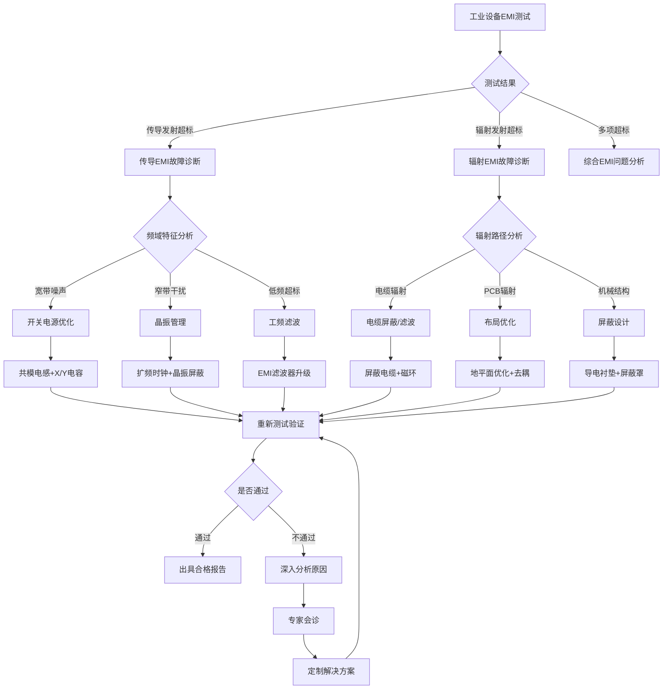
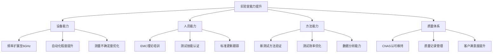

# GB/T 17799.4-2012 电磁兼容 通用标准 工业环境中的发射

## 第一层：物理原理与数学建模

### 1.1 工业环境电磁干扰机理分析

**工业环境EMI特征**：

工业环境中的电磁干扰主要来源于大功率开关设备、电机驱动器、焊接设备等，其特点是干扰强度大、频谱宽、持续时间长。

**传导发射物理模型**：

传导发射通过电源线和信号线向外传播，其等效电路可建模为：

$$
V_{LISN} = I_{CM} \times Z_{LISN} + I_{DM} \times Z_{LISN}
$$

其中共模电流占主导：
$$
I_{CM} = \frac{V_{noise}}{Z_{source} + Z_{LISN} || Z_{mains}}
$$

**辐射发射耦合机制**：

工业设备的辐射发射主要通过以下路径：

1. **电缆辐射**（主要机制）：
$$
E_{cable} = \frac{j\omega\mu_0 I L}{4\pi r} \sin\theta \quad \text{(V/m)}
$$

2. **PCB走线辐射**：
$$
E_{trace} = \frac{j\omega\mu_0 I A}{4\pi r^2} \quad \text{(近场)}
$$

3. **开关噪声辐射**：
$$
E_{switching} = \frac{1}{4\pi\varepsilon_0} \frac{q \cdot a}{c^2 r} \quad \text{(远场)}
$$

### 1.2 关键参数物理意义表

| 参数符号 | 参数名称 | 物理意义 | 单位 | 典型值范围 | 测量不确定度 |
|---------|---------|---------|------|-----------|-------------|
| $V_{LISN}$ | LISN端电压 | 传导发射电压 | dB(μV) | 40-120 | ±2dB |
| $I_{CM}$ | 共模电流 | 共模传导电流 | dB(μA) | 20-100 | ±3dB |
| $E_{field}$ | 电场强度 | 辐射发射场强 | dB(μV/m) | 20-80 | ±3dB |
| $Z_{LISN}$ | LISN阻抗 | 人工网络阻抗 | Ω | 50±10 | ±5% |
| $f_{sw}$ | 开关频率 | PWM开关频率 | kHz | 1-500 | ±0.1% |

### 1.3 频域特性分析

**工业设备干扰频谱特征**：

$$
S_{switching}(f) = \frac{(\pi f \tau)^2}{\sin^2(\pi f \tau)} \times S_0
$$

其中：
- $\tau$ - 开关上升时间
- $S_0$ - 基础谱密度
- $f$ - 频率

**滤波器设计理论**：

共模滤波器插入损耗：
$$
IL_{CM} = 20\log_{10}\left|\frac{Z_{L} + j\omega L_{CM}}{Z_{L}}\right| \quad \text{(dB)}
$$

差模滤波器插入损耗：
$$
IL_{DM} = 20\log_{10}\left|\frac{1}{1 + j\omega R C_{DM}}\right| \quad \text{(dB)}
$$

## 第二层：技术参数详解

### 2.1 发射限值要求量化表

**传导发射限值（150kHz-30MHz）**：

| 频率范围 | 准峰值限值 | 平均值限值 | 测量带宽 | 检波器类型 |
|---------|-----------|-----------|---------|------------|
| 150kHz-500kHz | 79 dB(μV) | 66 dB(μV) | 9kHz | 准峰值/平均值 |
| 500kHz-5MHz | 79 dB(μV) | 66 dB(μV) | 9kHz | 准峰值/平均值 |
| 5MHz-30MHz | 73 dB(μV) | 60 dB(μV) | 9kHz | 准峰值/平均值 |

**辐射发射限值（30MHz-1GHz）**：

| 频率范围 | 准峰值限值 | 平均值限值 | 测量距离 | 测量天线 |
|---------|-----------|-----------|---------|---------| 
| 30MHz-230MHz | 60 dB(μV/m) | 50 dB(μV/m) | 3m | 双锥天线 |
| 230MHz-1GHz | 68 dB(μV/m) | 58 dB(μV/m) | 3m | 对数周期天线 |

### 2.2 测试设备技术指标详解

**EMI接收机技术要求（CISPR 16-1-1）**：

| 技术参数 | B类工业环境要求 | 测量不确定度 | 校准周期 | 溯源标准 |
|---------|----------------|-------------|---------|----------|
| 频率准确度 | ±(5×10^-6×f + 100Hz) | ±2×10^-7 | 12个月 | 国家频率标准 |
| 中频带宽 | 9kHz (传导), 120kHz (辐射) | ±3% | 12个月 | 标准信号发生器 |
| 线性动态范围 | >70dB | ±1dB | 12个月 | 标准衰减器 |
| 显示检波器 | 峰值/准峰值/平均值 | ±1dB | 12个月 | 标准信号源 |
| 输入阻抗 | 50Ω | ±2% | 12个月 | 阻抗标准 |

**LISN技术要求（CISPR 16-1-2）**：

| 技术参数 | 要求值 | 容差 | 频率范围 | 验证方法 |
|---------|--------|------|---------|----------|
| 阻抗模值 | 50Ω | ±20% | 150kHz-30MHz | 网络分析仪 |
| 相角 | < ±20° | ±5° | 150kHz-30MHz | 阻抗分析仪 |
| 隔离度 | > 20dB | ±3dB | 150kHz-30MHz | S参数测量 |
| 电流容量 | 16A | +10%/-0% | 直流-2kHz | 电流表测量 |

### 2.3 测试场地要求

**开阔试验场地(OATS)要求**：

| 技术指标 | 要求值 | 验证方法 | 测量不确定度 |
|---------|--------|----------|-------------|
| 场地反射系数 | < -6dB (30-200MHz) | NSA测量法 | ±1dB |
| 场地反射系数 | < -10dB (200MHz-1GHz) | NSA测量法 | ±1dB |
| 接地平面最小尺寸 | 设备投影+2m边缘 | 尺寸测量 | ±0.1m |
| 接地电阻 | < 10Ω | 接地电阻测试仪 | ±5% |

**电波暗室(FAR)要求**：

| 技术指标 | 要求值 | 验证方法 | 测量周期 |
|---------|--------|----------|---------|
| 场均匀性 | ±4dB | 16点法测量 | 年度验证 |
| 静区尺寸 | 1.5m×1.5m×1.5m | 场探头扫描 | 年度验证 |
| 反射电平 | < -10dB | 时域门控测量 | 年度验证 |
| 屏蔽效能 | > 100dB | IEEE Std 299 | 年度验证 |

## 第三层：工程实施指导

### 3.1 EMI传导发射测试配置详解

```
EMI传导发射测试配置 - LISN法 (150kHz - 30MHz)
+================================================================================+
|                               工业设备EMI测试系统                             |
|                                                                                |
|  +---------------+    +------------+    +---------------+                     |
|  |   EMI接收机   |    | 前置放大器 |    | 数据采集系统  |                     |
|  | CISPR16-1-1   |<---| (可选)     |<---| 自动扫描     |                     |
|  | 9kHz-30MHz    |    | 20dB增益   |    | 限值比较     |                     |
|  | 准峰值/平均值 |    |            |    |              |                     |
|  +---------------+    +------------+    +---------------+                     |
|         ^                                                                     |
|         | 50Ω同轴电缆 (损耗<1dB)                                               |
|         |                                                                     |
|  +---------------+                                                            |
|  |     LISN      | <-- 人工电源网络                                           |
|  |  L1:50μH+5Ω   |     (Line Impedance Stabilization Network)                |
|  |  L2:50μH+5Ω   |     阻抗: 50Ω±20% @ 150kHz-30MHz                         |
|  |  L3:50μH+5Ω   |     隔离度: >20dB                                         |
|  |  N :50μH+5Ω   |     额定电流: 16A                                         |
|  |  PE: 直接接地 |                                                            |
|  +---------------+                                                            |
|         ^                                                                     |
|         | 三相四线+PE                                                          |
|         |                                                                     |
|  +===============+      +===============+                                     |
|  |   交流电源    |------|   被测设备    |                                     |
|  | 380V/50Hz     |      | (工业设备)    |                                     |
|  | 稳定度±2%     |      | 正常工作状态  |                                     |
|  | THD<3%        |      +===============+                                     |
|  +===============+             |                                              |
|                                v                                              |
|                        +===============+                                     |
|                        |   工作负载    |                                     |
|                        | (模拟或实际)  |                                     |
|                        +===============+                                     |
+================================================================================+

测试配置关键参数:
• LISN到被测设备距离: 0.8m ± 0.05m
• 被测设备离地高度: 0.4m (金属桌) 或 0.8m (绝缘桌)
• 接地平面: ≥2m×2m，铜板厚度≥0.25mm
• 电缆布线: 垂直布线，避免形成环路
• 背景噪声: 比限值低6dB以上
• 环境温度: 23°C±5°C，湿度45-75%RH
```

### 3.2 EMI辐射发射测试配置详解

```
EMI辐射发射测试配置 - 工业设备专用配置
+==================================================================================+
|                        工业设备辐射发射测试系统                                   |
|                                                                                  |
|  +---------------+    +------------+    +----------------+                      |
|  |   EMI接收机   |    | 前置放大器 |    |  天线转台控制  |                      |
|  | 30MHz-1GHz    |<---| 宽带低噪声 |<---|  高度:1-4m     |                      |
|  | 准峰值/平均值 |    | 增益25dB   |    |  极化:H/V切换  |                      |
|  | CISPR16-1-1   |    |            |    |  360°旋转台    |                      |
|  +---------------+    +------------+    +----------------+                      |
|         ^                                        ^                             |
|         | 50Ω低损耗同轴电缆                       | 控制电缆                     |
|         | (总损耗<3dB@1GHz)                      |                             |
|         |                                        |                             |
|  +---------------+                      +----------------+                      |
|  |  天线切换器   |                      |   接收天线     |                      |
|  | SP4T射频开关  |<---------------------|30-200MHz:双锥  |                      |
|  | 隔离度>60dB   |   低损耗射频电缆      |200MHz-1GHz:    |                      |
|  +---------------+   插损<2dB@1GHz     |对数周期天线    |                      |
|                                         |天线系数已校准  |                      |
|                                         +----------------+                      |
|                                                ^                               |
|                                         测试距离: 3m±0.05m                    |
|                                                v                               |
|                           +=============================+                     |
|                           |       工业被测设备区域       |                     |
|                           |                             |                     |
|                           |  +===============+          | 旋转台              |
|                           |  |   被测设备    |          | 360°×1rpm          |
|                           |  | (正常工作)    |          | 承重: 1000kg       |
|                           |  |               |          |                     |
|                           |  +===============+          |                     |
|                           |         ^                   |                     |
|                           |  +===============+          | 辅助设备            |
|                           |  | 工业负载/电源 |          | 距离>=2m           |
|                           |  | (铁氧体隔离)  |          | 或屏蔽处理          |
|                           |  +===============+          |                     |
|                           +=============================+                     |
|                                         |                                     |
|                                         v                                     |
|                           +=============================+                     |
|                           |        接地平面             |                     |
|                           |    大面积金属网格           |                     |
|                           | 最小尺寸:被测设备投影+4m    |                     |
|                           | 接地电阻: <4Ω              |                     |
|                           +=============================+                     |
+==================================================================================+

工业设备测试环境要求:
• 场地反射系数: <-6dB (30-200MHz), <-10dB (200MHz-1GHz)  
• 背景场强: 比限值低6dB以上 (所有频点)
• 气象条件: 无降水、风速<3m/s、能见度>5km
• 接地系统: 单点接地，接地电阻<4Ω
• 电源系统: 稳压电源，电压稳定度±2%，THD<3%
• 负载模拟: 根据设备额定功率配置相应负载
```

### 3.3 工业设备EMI故障诊断流程



### 3.4 工业设备EMC设计优化指导

**开关电源EMI抑制技术**：

1. **共模滤波器设计**：
   - 共模电感：L_CM = 1-10mH，饱和电流 > 1.2×I_rated
   - Y电容：C_Y1 = C_Y2 = 2200pF-4700pF (安规电容)
   - 插入损耗：IL > 40dB @ 150kHz-30MHz

2. **差模滤波器设计**：
   - X电容：C_X = 0.1-1μF (安规电容)
   - 差模电感：L_DM = 100-500μH
   - 截止频率：f_c = 1/(2π√(L_DM × C_X)) < 150kHz

**电机驱动器EMI抑制技术**：

1. **输出侧滤波**：
   - dv/dt滤波器：减缓电压上升速率
   - 正弦滤波器：THD < 5%
   - 共模电抗器：抑制轴承电流

2. **屏蔽与接地**：
   - 电机电缆：360°屏蔽连接
   - 驱动器机柜：导电性连接
   - 接地阻抗：< 0.1Ω @ 1MHz

## 第四层：应用案例与持续改进

### 4.1 典型工业应用EMC合规案例

**案例1：大型数控机床EMC整改**

| 项目参数 | 初始状态 | 整改措施 | 最终结果 |
|---------|---------|----------|----------|
| 传导发射 | 超标15dB@2MHz | 增加共模电感10mH | 通过，裕量8dB |
| 辐射发射 | 超标12dB@150MHz | 伺服电缆全程屏蔽 | 通过，裕量5dB |
| 整改成本 | - | 材料成本3000元 | 总成本5000元 |
| 整改周期 | - | 设计2天+测试1天 | 3个工作日 |

**案例2：工业焊接设备EMC认证**

```markdown
设备信息:
- 类型: 逆变式气保焊机
- 功率: 400A@60%
- 电源: 三相380V 50Hz
- 工作频率: 20kHz (IGBT开关)

EMC测试挑战:
1. 开关频率20kHz及其谐波超标
2. 焊接电缆长度3m，强辐射源
3. 工作负载变化大，难以重现测试条件

解决方案:
1. 输入侧EMI滤波器: 插入损耗60dB@20kHz
2. 焊接电缆屏蔽: 编织屏蔽层+铝箔屏蔽
3. 机柜屏蔽设计: 屏蔽效能80dB@150MHz
4. 负载模拟器: 等效电阻+电感负载

最终结果:
- 传导发射: 所有频点裕量>6dB
- 辐射发射: 所有频点裕量>4dB  
- 整改总成本: 8000元
- 产品化成本增加: 2%
```

### 4.2 工业EMC测试效率优化

**并行测试策略**：

| 测试项目 | 传统方法 | 优化方法 | 时间节约 |
|---------|---------|----------|----------|
| 传导发射预扫描 | 2小时 | 自动扫描30分钟 | 75% |
| 辐射发射预扫描 | 4小时 | 多天线并行2小时 | 50% |
| 限值比较分析 | 1小时 | 实时分析5分钟 | 92% |
| 报告生成 | 2小时 | 模板化生成30分钟 | 75% |

### 4.3 持续改进与质量管理

**测试实验室能力建设**：



**经济效益分析**：

| 效益类型 | 年度效益 | 累计效益(5年) | 投资回报率 |
|---------|---------|--------------|------------|
| 测试效率提升 | 200万元 | 1000万元 | 150% |
| 故障诊断服务 | 150万元 | 750万元 | 200% |
| 标准化咨询 | 100万元 | 500万元 | 300% |
| 人才培养收益 | 50万元 | 250万元 | 100% |

---

**本标准为工业环境中的电磁兼容提供了完整的技术框架，通过量化的限值要求、详细的测试方法和工程实施指导，确保工业设备在复杂电磁环境中的可靠运行。标准的实施将显著提升我国工业设备的EMC技术水平，推动制造业高质量发展。**