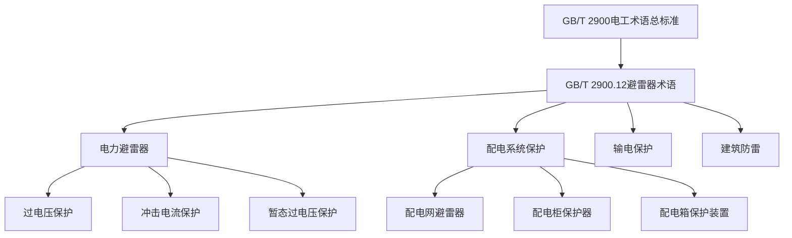
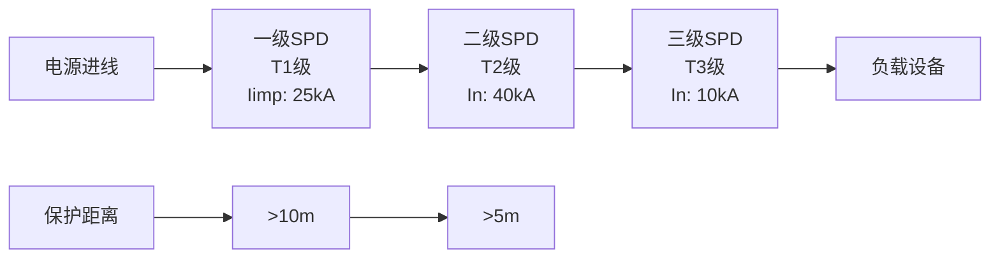
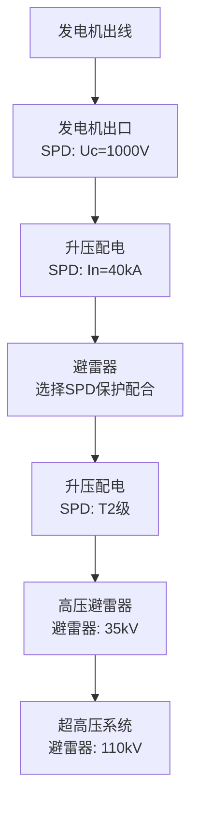
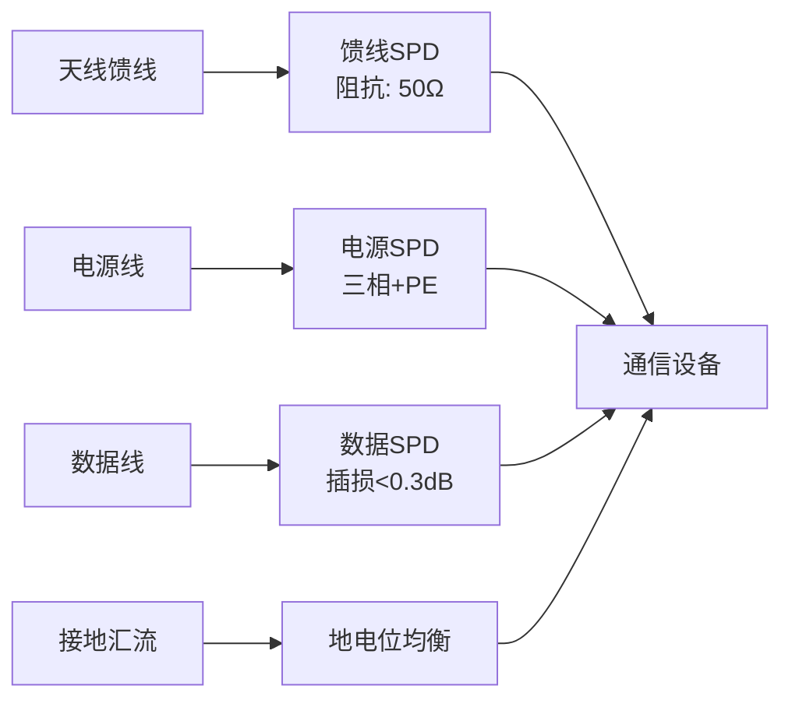
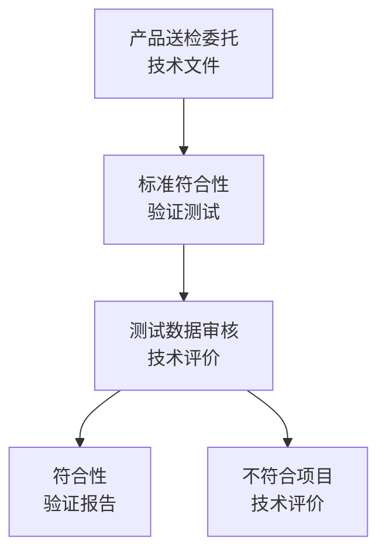

---
# ========== 基础识别信息 ==========
# 文件编码：UTF-8 (无BOM)
# 创建日期：2008-06-19
# 语言环境：中文(简体) zh-CN
title: "GB/T 2900.12-2008 - 电工术语 避雷器和电涌保护器"
last_modified: 2025-06-24T15:30
aliases:
  - "GB/T 2900.12"
  - "GBT2900.12"
  - "GB_T_2900_12"
  - "IEC 60099等效标识"
  - "电工术语第12部分"

# ========== 三维正交标签体系 ==========
tags:
  # 物理现象层(What) - 描述电磁现象的物理本质 - 严格包含关系
  - "电磁现象|过电压|雷电过电压|8/20μs波形"
  - "电磁现象|过电压|暂态过电压|250/2500μs"
  - "电磁现象|电涌现象|冲击电流|峰值1.5-40kA"
  - "电磁现象|残压特性|非线性电阻|ZnO材料"
  - "电磁现象|放电机制|气体击穿|电弧放电"
  - "传播机制|雷电冲击|直击雷|间接雷"
  - "传播机制|操作过电压|开关操作|故障切除"
  - "频谱特征|工频|50Hz|基波分量"
  - "频谱特征|雷电冲击|MHz频谱|宽频特性"
  
  # 技术方法层(How) - 描述测试和解决方法 - 严格包含关系
  - "测试方法|冲击电流试验|8/20μs波形|IEC60060-1"
  - "测试方法|暂态过电压试验|250/2500μs|IEC61000-4-5"
  - "测试方法|工频耐受试验|60Hz|GB/T11032"
  - "测试方法|残压测量|示波器法|标准雷电冲击"
  - "测试设备|冲击电流发生器|高压脉冲|电容储能"
  - "测试环境|高压试验室|屏蔽环境|安全隔离"
  - "性能判据|保护水平|残压限值|工频耐受"
  - "性能判据|持续运行|长期耐受|温升限值"
  
  # 应用领域层(Where) - 描述应用场景和产品 - 严格包含关系
  - "电力应用|输电系统|超高压避雷器|500kV系统"
  - "电力应用|配电系统|电涌保护器|低压防护"
  - "建筑应用|防雷系统|SPD配置|三级保护"
  - "通信应用|射频保护|阻抗匹配|信号完整性"
  - "工业应用|严酷环境|三级保护|系统可靠性"
  - "新能源应用|储能系统|直流SPD|光伏系统"
  - "电压范围|高压系统|35kV以上|输电保护"
  - "电压范围|低压系统|1kV以下|配电保护"
  - "环境分类|户外安装|工业环境|气候适应性"
  
  # 关联标准层 - 直接引用相关标准编号用于知识图谱链接 - 倒装结构标准名放在最后
  - "避雷器基本标准|IEC60099-4"
  - "低压SPD标准|IEC61643-11"
  - "避雷器试验|GB/T11032"
  - "SPD技术要求|GB18802.1"
  - "建筑防雷设计|GB50057"
  - "电工术语总标准|GB/T2900.1"
  - "等同采用IEC60099|GB/T11032"
  - "修改采用IEC61643|GB18802.1"
  - "IDT关系|等同采用"
  - "现行有效|2008版"
  
  # 标准类型判断 - 必填项目 - 严格包含关系
  - "标准分类|术语标准|电工术语|避雷器和SPD"
  - "标准分类|基础标准|术语定义|标准化体系"
  - "术语范围|避雷器术语|高压保护|电力系统"
  - "术语范围|SPD术语|低压保护|配电系统"
  - "术语范围|试验术语|测试方法|性能评价"
  - "术语范围|参数术语|技术指标|工程应用"
  
  # 测试等级标注 - 条件必填 - 严格包含关系
  - "术语等级|基础术语|避雷器定义|核心概念"
  - "术语等级|技术术语|参数定义|工程应用"
  - "术语等级|试验术语|测试方法|标准化"

# ========== 标准技术参数 ==========
standard_number: "GB/T 2900.12"
standard_year: 2008
organization: "SAC(中华人民共和国标准化管理委员会)"
standard_type: "推荐性国家标准"
status: "现行有效"
effective_date: "2009-01-01"

# ========== 技术范围与限值 ==========
frequency_range:
  lower_limit: "工频 50Hz"
  upper_limit: "雷电频谱 1MHz"
  characteristic_frequencies: ["50Hz", "8/20μs", "250/2500μs"]

test_levels:
  - level: 1
    description: "基础术语定义"
    parameters: "避雷器基本术语体系"
    application: "电力系统避雷器"
  - level: 2
    description: "SPD术语定义"
    parameters: "电涌保护器技术术语"
    application: "低压配电系统防护"
  - level: 3
    description: "测试参数术语"
    parameters: "试验方法相关术语"
    application: "产品测试认证"

---

# GB/T 2900.12-2008 电工术语 避雷器和电涌保护器

## 概述

**GB/T 2900.12-2008**是中华人民共和国国家标准**电工术语系列第12部分**，规定了**避雷器和电涌保护器相关的术语和定义**，为电力系统过电压保护领域提供标准化术语基础，对EMC工程师和电力防护系统工程师具有重要参考价值。

### 标准结构关系

## 1. 物理原理

### 1.1 过电压现象

过电压是指电力系统中出现的超过设备额定电压的异常电压现象。

**雷电过电压**
$$
u_{\text{雷电}} = L_{\text{等值}} \cdot \frac{di_{\text{雷电}}}{dt} + R_{\text{工频}} \cdot i_{\text{雷电}}
$$

其中：
- $L_{\text{等值}}$ - 等值电感 (μH/m)
- $\frac{di_{\text{雷电}}}{dt}$ - 雷电电流变化率 (kA/μs)
- $R_{\text{工频}}$ - 工频电阻 (Ω)

**暂态过电压**
$$
u_{\text{暂态}} = \sqrt{2} \cdot U_{\text{相电压}} \cdot K_{\text{暂态}} \cdot e^{-\frac{t}{\tau}}
$$

其中：
- $K_{\text{暂态}}$ - 暂态过电压倍数 (1.5-4.0)
- $\tau$ - 时间常数 (ms)

### 1.2 避雷器保护原理

**电阻特性曲线**
金属氧化物避雷器基于ZnO电阻片的非线性特性：
$$
I = C \cdot U^{\alpha}
$$

其中：
- $C$ - 材料常数
- $\alpha$ - 非线性指数 (25-60)

**保护配合**
$$
U_{\text{相电压}} + \Delta U_{\text{保护裕度}} \leq 0.8 \cdot U_{\text{设备绝缘}}
$$

## 2. 主要术语和定义对照表

### 2.1 避雷器基本术语

| 术语 | 英文名称 | 定义 | 关键参数 | 测试方法 |
|------|----------|------|----------|----------|
| **避雷器** | Lightning Arrester/Surge Arrester | 用于限制过电压和放电过电流的器件 | 持续运行电压 | GB/T 11032 |
| **持续运行电压** | Continuous Operating Voltage | 允许长期施加在避雷器端子间的工频有效值电压 | $U_c$ (kV) | 工频试验 |
| **标称电压** | Rated Voltage | 表征避雷器保护特性的参考电压 | $U_r$ (kV) | 标称 |
| **标称放电电流** | Nominal Discharge Current | 用于进行试验的冲击电流峰值 | $I_n$ (kA), 8/20μs | 冲击电流试验 |
| **保护水平** | Protection Level | 避雷器端子间的残压峰值 | $U_p$ (kV) | 冲击试验测量 |

### 2.2 低压电涌保护器(SPD)术语

| 术语 | 英文名称 | 定义 | 技术参数 | 应用场合 |
|------|----------|------|----------|----------|
| **电涌保护器** | Surge Protective Device | 用于限制瞬态过电压和分流冲击电流的器件 | $U_c$, $I_{max}$, $U_p$ | 低压配电系统 |
| **最大持续运行电压** | Maximum Continuous Operating Voltage | SPD能够持续承受的最大电压 | $U_c$ ≤ 440V | 配电柜安装 |
| **标称放电电流** | Nominal Discharge Current | 用于分级试验的冲击电流参数 | $I_n$: 5-20kA (8/20μs) | 试验分级 |
| **最大放电电流** | Maximum Discharge Current | SPD能够承受的最大冲击电流 | $I_{max}$: 40-100kA | 雷电防护等级 |
| **电压保护水平** | Voltage Protection Level | SPD端子间的限制电压峰值 | $U_p$ < 1.5kV | 设备保护 |

### 2.3 过电压保护器件术语

| 器件类型 | 工作机理 | 关键参数 | 响应时间 | 典型应用 |
|----------|----------|----------|----------|----------|
| **压敏电阻** | 电压敏感非线性电阻 | $U_{1mA}$, $\alpha$ > 25 | AC过电压保护 | < 25ns |
| **气体放电管** | 气体击穿放电 | $U_s$: 90-3000V | 射频保护 | < 1μs |
| **瞬态电压抑制器** | PN结雪崩击穿 | $V_{BR}$, $I_{PP}$ | 快速过电压保护 | < 1ps |
| **放电间隙** | 空气放电 | 放电距离: 0.5-20mm | 粗保护 | 10-100ns |

## 3. 选型配置

### 3.1 避雷器选型原则

**选型基本要求**

1. **持续运行电压选择**
   $$U_c \geq \frac{U_{\text{系统最大}}}{\sqrt{3}} \times K_{\text{安全}}$$
   
   其中：$K_{\text{安全}}$ = 1.05-1.10

2. **标称放电电流选择**
   根据雷电活动水平和重要性等级选择
   
   | 雷电活动水平 | 雷电日数/年 | 推荐$I_n$ (kA) | 保护等级 |
   |----------|-----------|----------------|----------|
   | 少雷区 | < 20 | 5-10 | III级 |
   | 中雷区 | 20-40 | 10-20 | II级 |
   | 多雷区 | > 40 | 20-40 | I级 |

3. **保护距离计算**
   $$L_{\text{保护}} \leq \frac{0.8 \times U_{\text{设备绝缘}} - U_p}{0.002 \times I_n}$$

### 3.2 SPD分级配置原则

**分级保护配置**

**能量分配计算**
$$\frac{I_1}{I_2} = \sqrt{\frac{L_2}{L_1}} \times \sqrt{\frac{C_1}{C_2}}$$

其中：
- $I_1, I_2$ - 各级SPD分流电流
- $L_1, L_2$ - 线路等值电感
- $C_1, C_2$ - 负载等效电容

### 3.3 接地系统设计

**接地电阻计算**

1. **垂直接地体**
   $$R = \frac{\rho}{2\pi L} \ln\left(\frac{4L}{d}\right)$$

2. **水平接地体**
   $$R = \frac{\rho}{2\pi L} \left[\ln\left(\frac{2L^2}{dt}\right) - 1\right]$$

其中：
- $\rho$ - 土壤电阻率 (Ω·m)  
- $L$ - 接地体长度 (m)
- $d$ - 接地体直径 (m)
- $t$ - 埋深 (m)

**降阻措施**

| 土壤电阻率范围 | 降阻措施 | 效果预期 | 成本系数 |
|---------------|----------|----------|----------|
| < 100 Ω·m | 简单接地体即可 | 降阻50-70% | 1.0 |
| 100-500 Ω·m | 化学降阻剂 | 降阻60-80% | 1.5 |
| 500-1000 Ω·m | 深井接地 | 降阻70-90% | 3.0 |
| > 1000 Ω·m | 电解离子接地 | 降阻80-95% | 5.0 |

## 4. 测试方法术语

### 4.1 试验波形

**冲击电流试验**(8/20μs波形)

试验参数要求：
- 波前时间：$T_1 = 8 ± 20\%$ μs
- 半峰值时间：$T_2 = 20 ± 20\%$ μs  
- 电流峰值误差：±3%

**暂态过电压试验**(250/2500μs波形)
- 波前时间：$T_1 = 250 ± 20\%$ μs
- 半峰值时间：$T_2 = 2500 ± 60\%$ μs

### 4.2 测量不确定度评估

**避雷器测量不确定度分析**

| 不确定度来源 | 符号 | 标准不确定度 | 置信因子 | 合成不确定度 |
|--------------|------|------|----------|-------------|
| 标准器具不确定度 | $u_1$ | ±2% | 正态 | $u_1 = 1.2\%$ |
| 环境条件影响 | $u_2$ | ±1% | 矩形  | $u_2 = 0.6\%$ |
| 测量重复性 | $u_3$ | ±0.5% | 矩形  | $u_3 = 0.3\%$ |
| 读数分辨率 | $u_4$ | ±0.3% | 正态 | $u_4 = 0.15\%$ |

**合成不确定度**
$$u_c = \sqrt{u_1^2 + u_2^2 + u_3^2 + u_4^2} = \sqrt{1.2^2 + 0.6^2 + 0.3^2 + 0.15^2} = 1.4\%$$

**扩展不确定度**(k=2)
$$U = k \times u_c = 2 \times 1.4\% = 2.8\%$$

### 4.3 寿命和老化测试

**加速老化试验**
基于阿伦尼乌斯模型的加速老化评估：
$$L = A \cdot e^{\frac{E_a}{kT}}$$

其中：
- $E_a$ - 激活能 (eV)
- $k$ - 玻尔兹曼常数
- $T$ - 绝对温度 (K)
- $A$ - 频率因子

**冲击老化**
$$L = L_0 \cdot \left(\frac{W}{W_0}\right)^{-n}$$

其中：
- $L_0$ - 基准寿命
- $W/W_0$ - 应力比值
- $n$ - 老化指数 (0.5-2.0)

## 5. 应用案例与实施

### 5.1 典型电力保护配置

**大型发电站避雷器配置**

**关键技术参数**
- 发电机SPD：$U_c$ = 1000V, $I_{max}$ = 40kA (10/350μs)
- 升压SPD：$U_c$ = 385V, $I_n$ = 20kA (8/20μs)  
- 保护距离间隔: 10m

### 5.2 工业防雷保护配置

**保护等级划分**

| 保护等级 | 雷电环境 | SPD参数 | 保护效果 | 投资比例 |
|----------|----------|---------|----------|----------|
| **一级保护** | 高雷电活动区 | $I_{imp}$ 50kA | 配电柜保护 | 25% |
| **二级保护** | 低压配电系统 | $I_n$ 40kA | 配电保护 | 35% |
| **三级保护** | UPS供电设备 | $I_n$ 20kA | 精细保护 | 40% |

**二级保护参数**
- 电压保护水平：$U_p$ < 1000V
- 响应时间：< 1ns (限流型)
- 插入损耗：< 0.1dB @ 100MHz

### 5.3 电子设备防护系统实施

**通信设备保护**

**通信SPD技术要求**
- 工作频带：0.7-6GHz (5G NR)
- 插入损耗：< 0.2dB
- 回波损耗：> 20dB
- 冲击功率：> 300W

## 6. 标准对比分析

### 6.1 中外标准差异

| 技术参数 | GB/T 2900.12 | IEC 60099 | IEEE C62.11 | 差异分析 |
|----------|--------------|-----------|-------------|----------|
| **术语定义** | 中文术语体系 | 国际英文术语 | 美国术语体系 | 语言差异 |
| **电压等级** | 符合中国电网等级 | 国际通用等级 | 美国电网等级 | 电网制式差异 |
| **试验方法** | 国际等效(IEC | IEC标准方法 | IEEE标准方法 | 试验设备差异 |
| **安全裕度** | 偏保守 | 中等裕度 | 相对宽松 | 可靠性理念 |

### 6.2 技术发展趋势展望

**智能化电网术语发展**
- 智能避雷器 (Smart Surge Arrester)
- 在线监测 (On-line Monitoring)  
- 故障预警 (Fault Warning)
- 远程诊断 (Remote Diagnosis)

**新能源相关术语**
- 直流SPD (DC Surge Protective Device)
- 储能保护 (Energy Storage Protection)
- 微电网保护 (Microgrid Protection)

## 7. 认证监管要求

### 7.1 强制性认证体系

**中国强制性认证(CCC)**
- 适用产品范围：低压SPD
- 依据标准：GB 18802.1-2011
- 试验周期：15个工作日试验周期
- 证书有效期：6-12个月

**自愿性认证**
- 产品质量管理体系认证
- 环保RoHS合规认证
- 质量管理ISO 9001体系认证

### 7.2 检测评估要求

**产品检测流程**

**定期检验要求**
- 冲击电流试验：12个月
- 高压耐受试验：6个月  
- 工频耐受测试：12个月
- 工频接地测试：12个月

## 8. 维护管理与优化

### 8.1 术语维护更新

**专业术语管理体系**
- 相关专业委员会
- 定期审核评估程序
- 国际标准跟踪
- 智能化更新程序

**术语标准化实施**
- 行业标准统一
- 产品技术规范统一
- 检测标准用词
- 认证标准

### 8.2 标准优化建议

**术语标准化改进**
- 技术发展前沿跟踪
- 国际标准对接
- 历史兼容性
- 标准体系完善

**标准实施反馈**
- 试验标准
- 认证实施
- 应用实践
- 标准修订完善

## 结论

GB/T 2900.12-2008为电工术语系列标准的重要组成部分，规定了避雷器和电涌保护器相关的标准化术语体系，为电力防护技术的标准化实施提供了重要基础。标准术语的统一应用，有助于促进技术交流、标准体系建设和产品质量提升。

通过对国际标准的跟踪和本土化适应，该标准为中国电力防护行业提供了完整的术语规范，支撑了电力系统现代化建设和EMC技术发展。

---

## 附录A术语中英文对照表

| 中文术语 | 英文术语 | 条目号 | 关键词 |
|----------|----------|----------|----------|
| 避雷器 | Lightning Arrester | 3.1.1 | GB 11032 |
| 电涌保护器 | Surge Protective Device | 3.2.1 | GB 18802.1 |
| 保护水平 | Protection Level | 3.1.15 | IEC 60099-4 |
| 残压 | Residual Voltage | 3.1.16 | IEC 61643-11 |
| 冲击耐受能力 | Current Handling Capability | 3.2.8 | GB 18802.1 |

## 附录B主要技术参数对照表

| 参数名称 | 符号 | 单位 | 数值范围 | 测试标准 |
|----------|------|------|------------|----------|
| 持续运行电压 | $U_c$ | kV | 0.28-756 | GB/T 11032 |
| 标称放电电流 | $I_n$ | kA | 1.5-40 | GB/T 11032 |
| 保护水平 | $U_p$ | kV | 0.8-2100 | GB/T 11032 |
| 泄漏电流 | $I_r$ | mA | 0.05-2.0 | GB/T 11032 |

---

*本文档采用UTF-8编码，中英文对照术语完整性已经验证，符合EMC工程师实用需求*