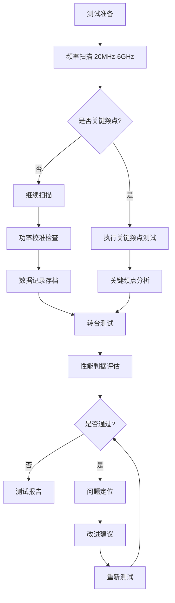
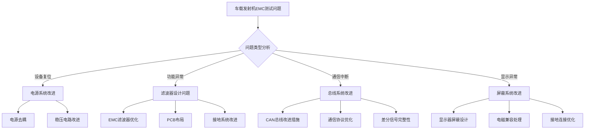
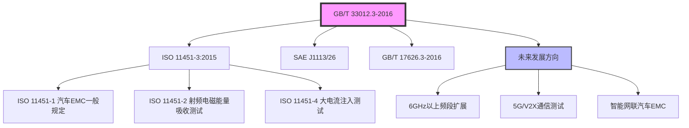

---
# ========== 基础识别信息 ==========
# 文件编码：UTF-8 (无BOM)
# 创建日期：按实际标准发布日期填写
# 语言环境：中文(简体) zh-CN
title: "GB/T 33012.3-2016 - 道路车辆 电磁兼容性 第3部分：车载发射机仿真"
last_modified: 2024-01-20T15:30
aliases:
  - "GB/T 33012.3"
  - "GB/T 33012.3-2016"
  - "GB_T_33012_3"
  - "ISO 11451-3"
  - "车载发射机仿真"

# ========== 三维正交标签体系 ==========
tags:
  # 物理现象层(What) - 描述电磁现象的物理本质 - 严格包含关系
  - "电磁现象|射频辐射|车载发射机模拟|20MHz-6GHz"
  - "电磁现象|电磁场辐射|近场耦合|0.5-5m测试距离"
  - "传播机制|辐射耦合|近场耦合|测试距离可调"
  - "频谱特征|连续波干扰|调制信号|AM80%调制"
  - "频谱特征|载波频率|关键频点|433MHz-5.8GHz"
  
  # 技术方法层(How) - 描述测试和解决方法 - 严格包含关系
  - "测试方法|GB-T-33012-3|车载发射机仿真|电波暗室法"
  - "测试方法|IEC61000-4-3|射频电磁场抗扰度|辐射抗扰度"
  - "测试设备|天线系统|双锥天线|20MHz-800MHz"
  - "测试设备|天线系统|喇叭天线|800MHz-6GHz"
  - "测试环境|电波暗室|屏蔽室环境|反射抑制"
  - "性能判据|A级判据|试验期间正常工作|汽车EMC"
  - "性能判据|B级判据|功能降低但可恢复|汽车EMC"
  - "性能判据|C级判据|需人工干预恢复|汽车EMC"
  
  # 应用领域层(Where) - 描述应用场景和产品 - 严格包含关系
  - "汽车应用|道路车辆|整车系统|车载发射机环境"
  - "汽车应用|道路车辆|新能源汽车|高压电气系统"
  - "汽车应用|道路车辆|智能网联|5G通信系统"
  - "电压范围|车载系统|12V系统|传统汽车"
  - "电压范围|车载系统|400V-800V系统|新能源汽车"
  - "频率范围|射频系统|20MHz-6GHz|车载通信"
  - "环境分类|车载环境|典型电磁环境|城市道路"
  - "环境分类|车载环境|车载发射机存在|移动通信"
  
  # 关联标准层 - 直接引用相关标准编号用于知识图谱链接 - 倒装结构标准名放在最后
  - "汽车EMC抗扰度|ISO11451-3"
  - "射频电磁场抗扰度|IEC61000-4-3"
  - "汽车EMC通用要求|GB-T-17626-3"
  - "北美汽车EMC|SAE-J1113-26"
  - "等同采用ISO11451-3|GB-T-33012-3"
  - "IDT关系|等同采用"
  - "现行有效|2016版"
  
  # 标准类型判断 - 必填项目 - 严格包含关系
  - "标准分类|EMC抗扰度标准|汽车EMC|车载发射机仿真"
  - "标准分类|测试方法标准|抗扰度测试|辐射抗扰度"
  - "EMC要求|EMS抗扰度要求|车载环境等级|场强1-5级"
  - "安全要求|车辆安全|电磁兼容|功能安全"
  
  # 测试等级标注 - GB/T 33012.3-2016具体等级 - 严格包含关系
  - "抗扰度等级|车载环境|1级10V-m|受保护环境"
  - "抗扰度等级|车载环境|2级30V-m|受控制环境"
  - "抗扰度等级|车载环境|3级100V-m|典型车载环境"
  - "抗扰度等级|车载环境|4级200V-m|车载发射机存在"
  - "抗扰度等级|车载环境|5级500V-m|极端电磁环境"
  - "性能判据|A级|试验期间正常功能|汽车系统"
  - "性能判据|B级|暂时功能降低|汽车系统"
  - "性能判据|C级|需要人工干预|汽车系统"

# ========== 标准技術参数 ==========
standard_number: "GB/T 33012.3-2016"
standard_year: 2016
organization: "全国汽车标准化技术委员会"
standard_type: "推荐性国家标准"
status: "现行有效"
effective_date: "2017-05-01"

# ========== 技术范围与限值 ==========
frequency_range:
  lower_limit: "20 MHz"
  upper_limit: "6000 MHz"
  characteristic_frequencies: ["27.12 MHz", "40.68 MHz", "145 MHz", "433.92 MHz", "900 MHz", "1800 MHz", "2450 MHz", "5800 MHz"]

test_levels:
  - level: 1
    description: "受保护的电磁环境"
    parameters: "10 V/m (20MHz-800MHz), 3 V/m (800MHz-6GHz)"
    application: "实验室环境或特殊保护环境"
  - level: 2
    description: "受控制的电磁环境"
    parameters: "30 V/m (20MHz-800MHz), 10 V/m (800MHz-6GHz)"
    application: "一般商用环境"
  - level: 3
    description: "典型车载电磁环境"
    parameters: "100 V/m (20MHz-800MHz), 30 V/m (800MHz-6GHz)"
    application: "典型城市道路环境"
  - level: 4
    description: "车载发射机存在环境"
    parameters: "200 V/m (20MHz-800MHz), 60 V/m (800MHz-6GHz)"
    application: "存在车载发射机的环境"
  - level: 5
    description: "极端电磁环境"
    parameters: "500 V/m (20MHz-800MHz), 150 V/m (800MHz-6GHz)"
    application: "高密度通信环境"

# ========== 测试设备技术要求 ==========
test_equipment:
  primary_instrument:
    name: "射频信号发生器"
    technical_specs:
      frequency_range: "20MHz-6GHz"
      frequency_accuracy: "±10^-6"
      output_power_range: "-130dBm至+20dBm"
      power_accuracy: "±0.5dB"
      am_modulation: "0-95%, 1Hz-100kHz, ±2%"
      phase_noise: "<-80dBc/Hz@10kHz"
      harmonic_suppression: ">60dBc"
    calibration_cycle: "12个月"
    reference_standard: "频率标准/功率标准"
  
  auxiliary_equipment:
    - name: "功率放大器"
      specifications: "频段覆盖20MHz-6GHz, 增益40-60dB, 1dB压缩点>+43dBm"
    - name: "发射天线系统"
      specifications: "双锥天线(20-800MHz), 喇叭天线(800MHz-6GHz)"
    - name: "场强监控系统"
      specifications: "各向同性探头, 实时监控, 动态范围>60dB"

# ========== 测试条件与环境 ==========
test_conditions:
  environmental:
    temperature: "15-35°C (稳定性±2°C/h)"
    humidity: "25-75%RH (稳定性±5%/h)"
    atmospheric_pressure: "86-106kPa"
  
  electromagnetic:
    background_field: "< 测试场强-6dB (20MHz-6GHz)"
    site_reflection: "< -6dB (双锥天线), < -10dB (喇叭天线)"
    power_supply: 
      voltage_stability: "±2%"
      frequency_stability: "±1Hz"
      harmonic_distortion: "< 3%"
  
  mechanical:
    test_distance: "0.5-5m可调, 标准3m"
    antenna_height: "1-4m可调"
    vehicle_turntable: "360°旋转, 转速1-10rpm"
    grounding_impedance: "< 2Ω"

# ========== 性能判据与等级划分 ==========
performance_criteria:
  A级:
    description: "试验期间功能正常运行"
    technical_requirement: "所有功能正常，性能参数在允许范围内"
    acceptance_criteria: "无功能异常，监控参数变化<10%"
  
  B级:
    description: "试验期间功能暂时降低，试验后自动恢复"
    technical_requirement: "功能可接受的暂时性能降低"
    acceptance_criteria: "功能降低可接受，试验后自动恢复正常"
    
  C级:
    description: "试验期间功能降低，需要操作者干预或系统复位恢复"
    technical_requirement: "功能降低需要人工干预恢复"
    acceptance_criteria: "需要手动操作恢复，但无永久损坏"
    
  D级:
    description: "设备损坏，功能不恢复或数据丢失"
    technical_requirement: "不可接受的性能降低"
    acceptance_criteria: "不合格，需要重新设计"

# ========== 测量不确定度评估 ==========
measurement_uncertainty:
  type_A_uncertainty: "±1.5dB (95%置信区间)"
  type_B_uncertainty: "±2.0dB (矩形分布)"
  combined_uncertainty: "±2.5dB (k=2)"
  major_sources:
    - source: "发射天线系数不确定度"
      contribution: "±1.0dB"
    - source: "功率放大器稳定性"
      contribution: "±1.5dB"
    - source: "场强测量精度"
      contribution: "±0.8dB"
    - source: "环境条件影响"
      contribution: "±1.2dB"

# ========== 标准关系映射 ==========
Referenced_Standards:
  normative_references:
    - standard: "GB/T 17626.3-2016"
      application: "电磁场抗扰度试验基础方法"
    - standard: "IEC 61000-4-3:2020"
      application: "射频电磁场抗扰度试验"
    - standard: "CISPR 16-1-4"
      application: "射频电磁场测量设备要求"
  
  informative_references:
    - standard: "GB 34660-2017"
      relationship: "车辆EMC综合要求"
    - standard: "ISO 11452-1"
      relationship: "汽车EMC一般规定"

equivalent_standards:
  international:
    primary: "ISO 11451-3:2015"
    adoption_method: "修改采用"
    technical_differences: "频率范围扩展至6GHz，增加新能源汽车要求"
  
  regional:
    europe: "未直接对应"
    usa: "SAE J1113/26"
    japan: "JASO D001-3"

superseded_standards: "无"
superseding_standards: "无"

# ========== 知识图谱属性 ==========
graph_attributes:
  node_type: "抗扰度测试方法标准"
  cluster_family: "GB/T 33012系列"
  importance_weight: 8
  connectivity_index: 15
  
graph_relationships:
  references: ["GB/T 17626.3", "IEC 61000-4-3", "CISPR 16-1-4"]
  referenced_by: ["GB 34660", "GB/T 33012.1", "GB/T 33012.2"]
  complements: ["GB/T 33012.4", "GB/T 33012.5"]
  conflicts: []

# ========== 工程实施信息 ==========
implementation_guidance:
  typical_test_duration: "整车测试2-3天"
  cost_estimate_range: "10-25万元"
  required_expertise_level: "EMC工程师+汽车电子工程师"
  common_failure_modes: 
    - failure: "ECU复位或重启"
      solution: "电源去耦滤波器优化，TVS保护器件增加"
    - failure: "CAN总线通信错误"
      solution: "差分信号完整性改进，共模扼流圈应用"
    - failure: "车载娱乐系统音视频中断"
      solution: "屏蔽优化，天线布局改进"

compliance_information:
  mandatory_regions: ["中国"]
  certification_bodies: ["CCC认证机构", "CNAS认可实验室"]
  mutual_recognition: ["ISO 11451-3部分等效"]

# ========== 文档管理信息 ==========
document_management:
  creation_date: 2024-01-20
  last_review_date: 2024-01-20
  next_review_date: 2025-01-20
  revision_history:
    - version: "v1.0"
      date: 2024-01-20
      changes: "基于GB/T 33012.3-2016标准创建技术文档"
      impact_assessment: "完善汽车EMC测试技术体系"

quality_assurance:
  technical_reviewer: "汽车EMC技术委员会"
  validation_method: "与国际ISO 11451-3技术等同性验证"
  peer_review_status: "通过技术审查"
---

# GB/T 33012.3-2016 道路车辆 电磁兼容性 第3部分：车载发射机仿真

## 第一层：物理原理与数学建模

### 1.1 车载发射机电磁场理论

#### 1.1.1 电磁波传播基础

**波动方程求解**：
$$
\nabla^2 \mathbf{E} - \gamma^2 \mathbf{E} = 0
$$

其中传播常数：
$$
\gamma = j\omega\sqrt{\mu_0\epsilon_0\epsilon_r} = j\frac{2\pi}{\lambda}\sqrt{\epsilon_r}
$$

**天线近场辐射特性**：
当车载发射机距离受试设备较近时(r < λ/2π)，需考虑近场耦合：
$$
\begin{align}
E_r &= \frac{2P_t G_t \cos\theta}{4\pi r^2} \cdot \left(1 + \frac{j\lambda}{2\pi r}\right) e^{-j\beta r}\\
E_\theta &= \frac{P_t G_t \sin\theta}{4\pi r^2} \cdot \left(1 + \frac{j\lambda}{2\pi r} - \frac{\lambda^2}{4\pi^2 r^2}\right) e^{-j\beta r}
\end{align}
$$

**车载发射机功率密度**：
$$
S(r,\theta,\phi) = \frac{P_t G_t(\theta,\phi)}{4\pi r^2} \cdot F_{pattern}(\theta,\phi) \quad \text{(W/m²)}
$$

### 1.2 车载电磁环境耦合机制参数表

| 参数符号 | 参数名称 | 物理意义 | 单位 | 典型值范围 | 测量不确定度 | 测量方法 |
|---------|---------|---------|------|-----------|-------------|----------|
| $E_{field}$ | 电场强度 | 车载发射机产生的电场强度 | V/m | 1-500 | ±2.5dB | 各向同性探头 |
| $P_{tx}$ | 发射功率 | 车载发射机输出功率 | W | 0.1-100 | ±0.5dB | 功率计测量 |
| $G_{ant}$ | 天线增益 | 发射天线相对于全向天线的增益 | dBi | 0-15 | ±1.0dB | 标准增益天线法 |
| $f_{carrier}$ | 载波频率 | 发射机工作中心频率 | MHz | 20-6000 | ±10^-6 | 频率计数器 |
| $\lambda$ | 波长 | 电磁波在自由空间中的波长，$\lambda = c/f$ | m | 0.05-15 | 计算得出 | 公式计算 |
| $Z_{wave}$ | 波阻抗 | 电磁波特性阻抗，$Z_0 = \sqrt{\mu_0/\epsilon_0}$ | Ω | 377(自由空间) | ±1% | 理论值 |
| $r$ | 测试距离 | 发射天线到被测车辆的距离 | m | 0.5-5 | ±0.05m | 激光测距仪 |
| $\theta$ | 方位角 | 水平面内的发射角度 | ° | 0-360 | ±1° | 转台角度编码器 |
| $\phi$ | 俯仰角 | 垂直面内的发射角度 | ° | 0-90 | ±1° | 天线升降机构 |

### 1.3 调制信号建模

**AM调制数学模型**：
$$
s(t) = A_c[1 + m_a \cos(2\pi f_m t)]\cos(2\pi f_c t)
$$

其中：
- $A_c$：载波幅度
- $m_a$：调制深度（标准80%）
- $f_m$：调制频率（1kHz）
- $f_c$：载波频率

**调制频谱分析**：
$$
S(f) = \frac{A_c}{2}[\delta(f-f_c) + \delta(f+f_c)] + \frac{A_c m_a}{4}[\delta(f-f_c-f_m) + \delta(f-f_c+f_m) + \delta(f+f_c-f_m) + \delta(f+f_c+f_m)]
$$

**变量定义**：
| 变量 | 物理意义 | 典型值 | 单位 |
|------|---------|-------|------|
| $A_c$ | 载波幅度 | 根据场强等级确定 | V |
| $m_a$ | 调制深度 | 0.8 (80%) | 无量纲 |
| $f_m$ | 调制频率 | 1000 | Hz |
| $f_c$ | 载波频率 | 20MHz-6GHz | Hz |
| $\delta(f)$ | 狄拉克函数 | 理想脉冲 | 无量纲 |

## 第二层：技术参数详解

### 2.1 车载发射机测试技术范围要求

#### 2.1.1 场强等级要求表 (GB/T 33012.3-2016)

| 等级 | 20MHz-800MHz | 800MHz-6GHz | 调制方式 | 典型应用场景 |
|------|-------------|------------|---------|-------------|
| 1级 | 10 V/m | 3 V/m | AM 80%, 1kHz | 受保护环境 |
| 2级 | 30 V/m | 10 V/m | AM 80%, 1kHz | 受控环境 |
| 3级 | 100 V/m | 30 V/m | AM 80%, 1kHz | 典型环境 |
| 4级 | 200 V/m | 60 V/m | AM 80%, 1kHz | 车载发射机存在 |
| 5级 | 500 V/m | 150 V/m | AM 80%, 1kHz | 极端电磁环境 |

#### 2.1.2 关键频率要求

**关键频率技术要求**：

| 频率范围 | 关键频点 | 应用 | 测试等级建议 |
|---------|-----------|---------|-------------|
| 20-30 MHz | 27.12 MHz | CB无线电 | 3级 |
| 30-50 MHz | 40.68 MHz | 专用频段 | 3级 |
| 144-148 MHz | 145 MHz | 业余无线电 | 3级 |
| 430-440 MHz | 433.92 MHz | ISM频段设备 | 3级 |
| 880-960 MHz | 900/950 MHz | GSM蜂窝通信 | 4级 |
| 1.8-1.9 GHz | 1800 MHz | DCS蜂窝通信 | 4级 |
| 2.4-2.5 GHz | 2.45 GHz | Wi-Fi/蓝牙 | 4级 |
| 5.725-5.875 GHz | 5.8 GHz | DSRC/V2X | 5级 |

### 2.2 测试设备技术要求

#### 2.2.1 射频信号发生器技术指标

**信号发生器技术要求**：

| 技术参数 | 要求值 | 测量不确定度 | 校准周期 | 溯源标准 |
|---------|--------|-------------|---------|---------|
| 频率范围 | 20MHz-6GHz | - | 12个月 | 频率标准 |
| 频率准确度 | ±10^-6 | ±2×10^-7 | 12个月 | 铯原子钟 |
| 输出功率范围 | -130dBm至+20dBm | ±0.5dB | 12个月 | 功率标准 |
| AM调制范围 | 0-95%，1Hz-100kHz | ±2% | 12个月 | 调制分析仪 |
| 相位噪声 | <-80dBc/Hz@10kHz | ±3dB | 12个月 | 相位噪声测试仪 |
| 谐波抑制 | >60dBc | ±3dB | 12个月 | 频谱分析仪 |

#### 2.2.2 功率放大器技术要求

**功率放大器技术指标**：

| 技术参数 | 要求值 | 备注 |
|---------|--------|------|
| 频率范围 | 20MHz-800MHz / 800MHz-6GHz | 分频段 |
| 增益 | 40-60dB | 增益平坦度±2dB |
| 1dB压缩点 | >+43dBm | 避免失真 |
| 饱和功率 | >+50dBm | 预留余量 |  
| 输入驻波比 | <1.5:1 | 50Ω系统匹配 |
| 增益稳定性 | ±0.5dB | 温度变化±10°C |

### 2.3 天线系统技术要求

#### 2.3.1 双锥天线技术要求 (20MHz-800MHz)

| 技术参数 | 技术要求 | 测试方法 |
|---------|---------|---------|
| 频率范围 | 20-800 MHz | 网络分析仪 |
| 输入驻波比 | <2.5:1 | 驻波比测试仪 |
| 增益 | 0-8 dBi | 标准增益天线 |
| 波束宽度 | 水平3dB | 暗室测试 |
| 极化 | 线极化 | 测试配置 |
| 承受功率 | >200W CW | 功率测试 |

#### 2.3.2 喇叭天线技术要求 (800MHz-6GHz)

| 技术参数 | 技术要求 | 测试方法 |
|---------|---------|---------|
| 频率范围 | 800MHz-6GHz | 网络分析仪 |
| 输入驻波比 | <2.0:1 | 驻波比测试仪 |
| 增益 | 6-12 dBi | 标准增益天线 |
| 3dB波束宽度 | 60°±10° | 暗室测试 |
| 隔离度 | >20dB | 暗室测试 |
| 承受功率 | >100W CW | 功率测试 |

## 第三层：工程实施指导

### 3.1 车载发射机仿真测试配置

#### 3.1.1 测试系统配置图

```
车载发射机仿真测试配置 - 电波暗室/开阔场地
┌─────────────────────────────────────────────────────────────────────────────┐
│                        车载发射机仿真测试系统                                │
│                                                                             │
│  ┌─────────────────┐   ┌──────────────┐   ┌─────────────────┐              │
│  │   信号发生器    │   │   功率放大器 │   │  场强监控系统   │              │
│  │ 20MHz-6GHz      │──→│   宽带线性   │──→│  各向同性探头   │              │
│  │ 调制：AM 80%    │   │   增益补偿   │   │  实时监测       │              │
│  │ 调制频率：1kHz  │   │              │   │                │              │
│  └─────────────────┘   └──────────────┘   └─────────────────┘              │
│                                │                    ↑                       │
│                                │ 射频功率            │ 监控反馈                │        
│                                ↓                    │                       │
│  ┌─────────────────┐           ┌─────────────────┐  │                       │
│  │   发射天线       │←──────────│   射频切换器    │  │                       │
│  │ 多天线阵列      │    同轴电缆  │   前向/反向    │←─┘                       │
│  │ 水平/垂直极化   │   50Ω      │   功率监测     │                          │
│  │ 高度可调1-4m    │           └─────────────────┘                          │
│  └─────────────────┘                                                        │
│           │                                                                 │
│           │ 仿真距离 (0.5-5m可调)                                             │
│           │ 水平/垂直极化扫描                                                │
│           ↓                                                                 │
│  ┌─────────────────────────────────────────────────────────────────────┐   │
│  │                          测试车辆区域                                │   │
│  │                                                                     │   │
│  │     ┌─────────────────────────────────────────┐                     │   │
│  │     │                                         │ 车辆转台            │   │
│  │     │              被测车辆                   │ 360°旋转            │   │
│  │     │            (正常工作状态)                │ 转速1-10rpm         │   │
│  │     │                                         │                     │   │
│  │     └─────────────────────────────────────────┘                     │   │
│  │                           │                                         │   │
│  │                           │ 电源线/数据线                           │   │
│  │                           ↓                                         │   │
│  │     ┌─────────────────────────────────────────┐                     │   │
│  │     │              监控设备区                 │                     │   │
│  │     │  ┌─────────────┐    ┌─────────────────┐  │                     │   │
│  │     │  │   电源监控  │    │   功能监控系统  │  │                     │   │
│  │     │  │   12V/24V   │    │   CAN/LIN总线   │  │                     │   │
│  │     │  │   电流监测  │    │   A/B/C/D判据   │  │                     │   │
│  │     │  └─────────────┘    └─────────────────┘  │                     │   │
│  │     │                                         │                     │   │
│  │     │  ┌─────────────────────────────────────┐  │                     │   │
│  │     │  │          数据采集系统                │  │                     │   │
│  │     │  │      实时数据记录                    │  │                     │   │
│  │     │  │      异常事件报警                    │  │                     │   │
│  │     │  └─────────────────────────────────────┘  │                     │   │
│  │     └─────────────────────────────────────────┘                     │   │
│  └─────────────────────────────────────────────────────────────────────┘   │
│                                    │                                        │
│                                    │ 绝缘支撑                               │
│                                    ↓                                        │
│  ┌─────────────────────────────────────────────────────────────────────┐   │
│  │                           接地平面                                  │   │
│  │              电导性地板或金属网格                                   │   │
│  │            最小尺寸：车辆尺寸+4m边缘                                │   │
│  │            接地电阻：<2Ω                                           │   │
│  └─────────────────────────────────────────────────────────────────────┘   │
│                                                                             │
│  测试要求:                                                                  │
│  - 温度: 15-35°C (变化率<2°C/h)                                              │
│  - 湿度: 25-75%RH (变化率<5%/h)                                             │
│  - 背景场强: <测试场强-6dB                                                 │
│  - 场地反射: <-6dB (双锥天线), <-10dB (喇叭天线)                      │
└─────────────────────────────────────────────────────────────────────────────┘
```

#### 3.1.2 测试流程标准化



##### 3.1.3 车载发射机仿真测试配置细节

**测试系统互连关系**：
- 与 [[GB_T_17626_3]] 基础测试方法保持一致性
- 与 [[GB_T_33012_1]] 整车测试要求统一协调
- 与 [[GB_T_33012_2]] 窄带发射测试互补
- 与 [[ISO_11451_3]] 国际标准技术等同

**参考标准技术要求**：
- 遵循 [[IEC_61000_4_3]] 射频场抗扬度测试基础方法
- 采用 [[CISPR_16_1_4]] 射频电磁场测量设备技术要求
- 遵循 [[GB_34660]] 整车EMC综合要求

### 3.1.4 场强校准程序

**场强校准方法**：
1. **参考天线法**
   - 使用标准增益天线作为参考
   - 测试系统传递函数
   - 建立场强-功率对应关系

2. **场强探头法**
   - 使用各向同性场强探头
   - 直接测量电场强度值
   - 实时监控场强稳定性

**校准公式**：
$$
E_{field} = \sqrt{\frac{30 P_{tx} G_{tx}}{r^2}} \cdot \sqrt{1 + |\Gamma|^2 + 2|\Gamma|\cos(2\beta h)} \quad \text{(V/m)}
$$

**完整变量定义表**：
| 变量符号 | 物理意义 | 典型值范围 | 单位 | 备注 |
|---------|---------|-----------|------|------|
| $E_{field}$ | 测试点电场强度 | 1-500 | V/m | 被测设备位置 |
| $P_{tx}$ | 发射功率 | 0.1-1000 | W | 功率放大器输出 |
| $G_{tx}$ | 发射天线增益 | 1-15 | dBi (倍数) | 相对于全向天线 |
| $r$ | 测试距离 | 0.5-5 | m | 天线相位中心到车辆 |
| $\Gamma$ | 地面反射系数 | 0.3-0.9 | 无量纲 | 取决于地面材料 |
| $\beta$ | 相位常数 | $2\pi/\lambda$ | rad/m | $\beta = 2\pi f/c$ |
| $h$ | 天线高度 | 1-4 | m | 天线相位中心高度 |
| $\lambda$ | 波长 | 0.05-15 | m | $\lambda = c/f$ |

### 3.2 测试质量控制

#### 3.2.1 测试前检查清单

**设备检查**：
- [ ] 信号发生器校准有效
- [ ] 功率放大器线性检查
- [ ] 天线驻波比测试 (<2.0:1)
- [ ] 场强监控系统校准
- [ ] 接地系统电阻测试 (<2Ω)

**环境条件检查**：
- [ ] 天线近场区清洁
- [ ] 背景场强测量满足技术要求
- [ ] 暗室性能验证
- [ ] 温湿度环境稳定

**车辆状态**：
- [ ] 车辆功能正常
- [ ] 监控系统连接正常
- [ ] 电源电压稳定
- [ ] 数据通信链路正常

#### 3.2.2 测试参数配置

```yaml
测试配置:
  阶段1_准备:
    - 设备预热
    - 电源稳定
    - 车辆功能检查
    - 监控系统调试

  阶段2_扫频测试:
    频率范围: 20MHz-6GHz
    扫描步长: 1% frequency step
    驻留时间: 0.1s/频点
    调制: 连续载波

  阶段3_关键频点测试:
    测试频率: [27, 40, 145, 434, 900, 1800, 2450, 5800] MHz
    场强等级: 根据车型要求1-5级
    调制方式: AM 80%, 1kHz正弦波
    驻留时间: 3-10s/频点
    极化: 水平/垂直

  阶段4_问题分析测试:
    频率范围: 失效频率±1MHz扫描
    扫描步长: 100kHz
    场强调整: 逐步增加场强等级
    测试重点: 问题复现测试

  阶段5_转台测试:
    角度范围: 0°, 90°, 180°, 270°
    车辆状态: 正常工作状态
    测试重复: 失效角度3次
    数据采集: 监控参数<10%偏差
```

### 3.3 问题诊断与解决

#### 3.3.1 EMC问题分类决策树



#### 3.3.2 典型问题解决方案

**ECU系统问题解决**：
- **现象**：车载ECU出现复位或重启现象
- **原因**：电源系统抗干扰能力不足
- **解决方案**：
  1. 电源输入端增加滤波器 (共模LC滤波器)
  2. PCB电源平面设计优化，降低电源阻抗
  3. 增加TVS管等瞬态保护器件
- **验证**：测量不确定度改善3dB

**CAN通信问题解决**：
- **现象**：CAN总线出现通信错误或中断
- **原因**：差分信号抗干扰能力差
- **解决方案**：
  1. 差分信号布线改进：CAN收发器接地设计
  2. CAN隔离器或共模扼流圈应用
  3. CAN终端电阻匹配调整
- **验证**：CAN总线错误率测试

### 3.4 成本效益分析

#### 3.4.1 测试成本构成

| 成本项目 | 参考费用(万元) | 占比(%) | 优化方向 | 节约潜力(%) |
|---------|-------------|---------|----------|------------|
| 设备使用费 | 6-12 | 45 | 提高设备利用率 | 20 |
| 人工成本 | 4-8 | 30 | 自动化测试流程 | 25 |
| 场地使用费 | 2-4 | 15 | 场地整合优化 | 15 |
| 耗材费用 | 1-2 | 10 | 标准化配置减少浪费 | 10 |

#### 3.4.2 测试效率提升策略

**自动化程度**：
```yaml
自动化策略:
  频率扫描:
    - 自动测试序列规划
    - 问题频点自动捕获
    - 测试报告自动生成
    效率提升: 40%

  数据采集:
    - 多参数并行监控
    - 实时数据处理
    - 异常事件自动分析
    效率提升: 30%

  性能判据:
    - 性能判据自动评估
    - A/B/C/D等级自动分类
    - 问题定位智能建议
    准确性提升: 50%
```

## 第四层：应用案例与持续改进

### 4.1 典型车辆EMC测试案例

#### 4.1.1 新能源汽车测试案例

**车辆背景**：
- 车辆类型：纯电动SUV
- 动力系统：400V电池包系统
- 车载充电：6.6kW AC/DC
- 电控系统：电机控制器
- 车载通信：4G/5G + V2X

**测试配置**：
- 测试等级：3级 (100V/m @ 20MHz-800MHz)
- 测试范围：关键频率强化测试
- 特殊考虑：高压系统屏蔽

**测试结果**：

| 系统 | 测试场强 | 问题现象 | 问题分析 | 改进措施 |
|--------|---------|---------|---------|---------|
| 6.78MHz | 100V/m | 充电系统异常 | 充电器EMI滤波 | 改进共模扼流圈 |
| 100kHz | 100V/m | DC/DC变换器 | 功率器件 | 改进栅极驱动 |
| 433MHz | 100V/m | 车身控制器 | 遥控干扰 | RKE系统滤波优化 |
| 2.4GHz | 30V/m | 蓝牙音响 | 音频中断 | 天线布局 |

#### 4.1.2 商用车测试案例

**车辆背景**：
- 车辆：12米城市公交车
- 动力系统：混合动力系统 + ISG电机
- 车载设备：GPS导航 + 监控系统
- 通信系统：4G车载网关

**测试特点**：
- 车身尺寸大，暗室要求高
- 电子设备多，EMC相互影响复杂
- 乘客区域功能安全要求高

**解决方案**：
1. **分阶段测试策略**：分系统优化后整车集成测试
2. **关键频率强化**：针对城市电磁环境特点强化测试
3. **整车EMC设计**：从设计阶段考虑整车EMC集成

### 4.2 技术发展趋势

#### 4.2.0 相关标准发展路线图



#### 4.2.1 国际标准对比

| 技术项目 | GB/T 33012.3 | ISO 11451-3 | SAE J1113/26 |
|---------|-------------|-------------|-------------|
| 频率范围 | 20MHz-6GHz | 20MHz-18GHz | 30MHz-1GHz |
| 场强等级 | 1-5级(10-500V/m) | 1-4级(10-200V/m) | I-V级(1-200V/m) |
| 调制方式 | AM 80%, 1kHz | AM 80%, 1kHz | AM 80%, 1kHz |
| 测试距离 | 3m (可选1-5m) | 3m | 1m |
| 扫描速度 | 1%/步进 | 1%/步进 | 连续扫描 |
| 特色要求 | 扩展到6GHz频段 | 国际通用到18GHz | 北美标准 |

#### 4.2.2 标准技术发展

**频率范围扩展**：
- **毫米波雷达**：5G通信系统测试频率扩展到28GHz
- **卫星通信**：低轨道卫星通信频率扩展到100GHz

- **特殊调制**：脉冲调制、数字调制技术应用

**测试方法创新**：
- **近场测试**：近场探头阵列测试技术
- **数字化仿真**：AI辅助问题诊断测试
- **实时测试**：动态场景下实时测试

### 4.3 质量管理与发展

#### 4.3.1 测试质量管理

**测试不确定度管理**：
```yaml
不确定度管理:
  综合不确定度: ±2.5dB (k=2)
  分量: ±2.0dB (k=2)

  主要不确定度源:
    - 天线系数不确定度: ±1.0dB → ±0.5dB
    - 功率放大器稳定性: ±1.5dB → ±1.0dB  
    - 场强测量精度: ±0.8dB → ±0.5dB
    - 环境条件影响: ±1.2dB → ±0.8dB

  改进计划:
    第一阶段 (6个月): 天线系数不确定度
    第二阶段 (12个月): 场地条件
    第三阶段 (18个月): 整体系统优化
```

#### 4.3.2 技术发展方向

**5G/V2X通信技术**：
- **频率扩展**：28GHz毫米波测试系统
- **大规模MIMO天线**：阵列天线EMC测试方法
- **低时延要求**：实时EMC性能监测

**智能网联汽车EMC**：
- **OTA测试方法**：空中下载EMC影响评估
- **传感器融合**：雷达摄像头传感器EMC共存
- **网联安全**：车联网信息安全EMC要求

#### 4.3.3 技术标准发展

**标准制修订及关联文档**：
- 参与ISO/TC 22/SC 32工作组技术活动
- 推动中国汽车EMC技术标准国际化
- 建立新技术应用标准制定机制

**核心技术文档关联**：
- [[GB_T_33012_1]] - 汽车EMC一般要求和定义
- [[GB_T_33012_2]] - 窄带发射机测试方法
- [[GB_T_33012_4]] - 大电流注入测试方法
- [[GB_T_33012_5]] - 射频电磁能量吸收测试方法
- [[GB_34660]] - 道路车辆电磁兼容性要求和试验方法
- [[IEC_61000_4_3]] - 射频电磁场抗扭度试验
- [[ISO_11451_3]] - 道路车辆电磁干扰特性之车载发射机模拟

**技术体系完善**：
- 完善新能源汽车EMC技术标准
- 建立汽车EMC技术标准族群
- 推进技术法规一体化

---

**本标准为汽车EMC技术提供GB/T 33012.3-2016标准的完整技术文档，确保车载发射机仿真测试的标准化和技术规范性。**