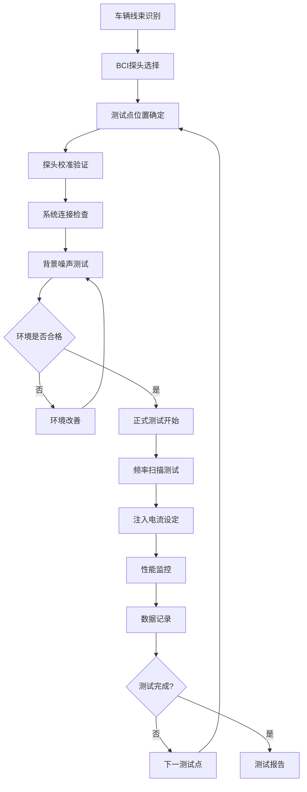
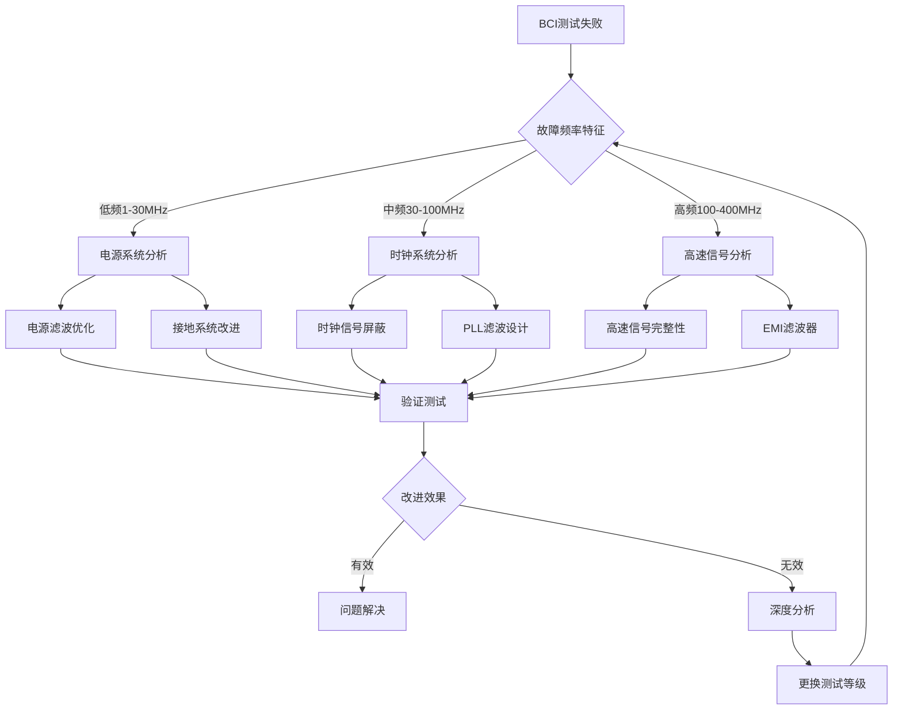
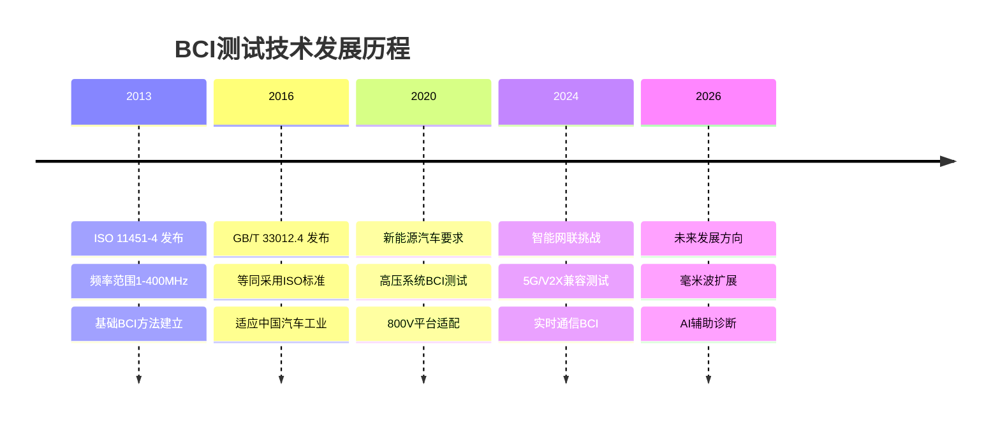

---
# ========== 基础识别信息 ==========
# 文件编码：UTF-8 (无BOM)
# 创建日期：2016-10-13
# 语言环境：中文(简体) zh-CN
title: "GB/T 33012.4-2016 - 道路车辆 电磁兼容性 第4部分：大电流注入法"
last_modified: 2024-12-21T16:45
aliases:
  - "GB/T 33012.4"
  - "GB_T_33012_4"
  - "GBT33012.4"
  - "ISO 11451-4"
  - "大电流注入法"
  - "BCI测试方法"

# ========== 三维正交标签体系 ==========
tags:
  # 物理现象层(What) - 描述电磁现象的物理本质 - 严格包含关系
  - "电磁现象|传导耦合|大电流注入|BCI方法"
  - "电磁现象|电磁感应|磁耦合|变压器原理"
  - "传播机制|传导耦合|线束耦合|共模电流"
  - "传播机制|传导耦合|线束耦合|差模电流"
  - "频谱特征|射频干扰|1MHz-400MHz|宽频干扰"
  - "频谱特征|连续波干扰|调制信号|AM80%调制"
  
  # 技术方法层(How) - 描述测试和解决方法 - 严格包含关系
  - "测试方法|GB-T-33012-4|大电流注入法|BCI测试"
  - "测试方法|IEC61000-4-6|传导抗扰度|射频场感应"
  - "测试方法|ISO11451-4|汽车EMC|大电流注入"
  - "测试设备|BCI注入探头|转换阻抗|6Ω标准"
  - "测试设备|射频信号发生器|1MHz-400MHz|调制能力"
  - "测试设备|功率放大器|线性放大|50Ω匹配"
  - "测试环境|实验室环境|背景场强控制|电磁屏蔽"
  - "性能判据|A级判据|试验期间正常工作|汽车EMC"
  - "性能判据|B级判据|功能暂时降低|汽车EMC"
  - "性能判据|C级判据|需人工干预恢复|汽车EMC"
  
  # 应用领域层(Where) - 描述应用场景和产品 - 严格包含关系
  - "汽车应用|道路车辆|线束级测试|车载电子设备"
  - "汽车应用|道路车辆|系统级测试|整车EMC"
  - "汽车应用|车载电子|控制器单元|ECU系统"
  - "汽车应用|车载电子|传感器系统|信号采集"
  - "汽车应用|新能源汽车|高压系统|400V-800V"
  - "汽车应用|新能源汽车|低压系统|12V-48V"
  - "电压范围|车载系统|低压电气系统|传统汽车"
  - "频率范围|传导干扰|1MHz-400MHz|宽频传导"
  - "环境分类|工业环境|汽车应用|移动平台"
  - "安装环境|固定安装|车载设备|非手持设备"
  
  # 关联标准层 - 直接引用相关标准编号用于知识图谱链接 - 倒装结构标准名放在最后
  - "汽车EMC大电流注入|ISO11451-4"
  - "汽车零部件EMC|ISO11452-4"
  - "传导抗扰度基础方法|IEC61000-4-6"
  - "汽车EMC通用要求|GB-T-33012-1"
  - "车辆EMC限值|CISPR25"
  - "北美汽车EMC|SAE-J1113-4"
  - "等同采用ISO11451-4|GB-T-33012-4"
  - "IDT关系|修改采用"
  - "现行有效|2016版"
  
  # 标准类型判断 - 必填项目 - 严格包含关系
  - "标准分类|EMC抗扰度标准|汽车EMC|大电流注入法"
  - "标准分类|测试方法标准|抗扰度测试|传导抗扰度"
  - "EMC要求|EMS抗扰度要求|线束级测试|电流注入级别"
  - "安全要求|车辆安全|电磁兼容|线束级安全"
  
  # 测试等级标注 - GB/T 33012.4-2016具体等级 - 严格包含关系
  - "抗扰度等级|线束测试|1级60mA|基本抗扰度"
  - "抗扰度等级|线束测试|2级120mA|增强抗扰度"
  - "抗扰度等级|线束测试|3级240mA|高抗扰度"
  - "性能判据|A级|试验期间正常功能|车载系统"
  - "性能判据|B级|暂时功能降低|车载系统"
  - "性能判据|C级|需要人工干预|车载系统"

# ========== 标准技术参数 ==========
standard_number: "GB/T 33012.4-2016"
standard_year: 2016
organization: "全国汽车标准化技术委员会"
standard_type: "推荐性国家标准"
status: "现行有效"
effective_date: "2017-07-01"

# ========== 技术范围与限值 ==========
frequency_range:
  lower_limit: "1 MHz"
  upper_limit: "400 MHz"
  characteristic_frequencies: ["1-80MHz标准", "80-200MHz扩展", "200-400MHz可选"]

test_levels:
  - level: 1
    description: "基本抗扰度要求"
    parameters: "60 mA (1-80MHz)"
    application: "一般电子系统"
  - level: 2
    description: "增强抗扰度要求"
    parameters: "120 mA (1-80MHz)"
    application: "重要控制系统"
  - level: 3
    description: "高抗扰度要求"
    parameters: "240 mA (1-80MHz)"
    application: "安全相关系统"
  - level: X
    description: "用户定义等级"
    parameters: "用户指定 (1-400MHz)"
    application: "特殊应用需求"

# ========== 测试设备技术要求 ==========
test_equipment:
  primary_instrument:
    name: "BCI注入系统"
    technical_specs:
      frequency_range: "1MHz-400MHz"
      injection_current: "最大1A (CW)"
      current_accuracy: "±2dB"
      impedance: "50Ω系统"
      modulation: "AM 80%, 1kHz调制"
    calibration_cycle: "12个月"
    reference_standard: "电流标准/功率标准"
  
  auxiliary_equipment:
    - name: "BCI注入探头"
      specifications: "转换阻抗6-60dB，频率特性±2dB，线缆夹持适配"
    - name: "射频功率放大器"
      specifications: "1MHz-400MHz，线性放大，50Ω匹配"
    - name: "电流监控探头"
      specifications: "宽带电流探头，动态范围>60dB"
    - name: "信号发生器"
      specifications: "1MHz-400MHz，AM调制能力，频率精度±10^-6"

# ========== 测试条件与环境 ==========
test_conditions:
  environmental:
    temperature: "16-35°C (稳定性±2°C/h)"
    humidity: "45-75%RH (稳定性±5%/h)"
    atmospheric_pressure: "86-106kPa"
  
  electromagnetic:
    background_field: "< 测试电流-10dB (全频段)"
    power_supply: 
      voltage_stability: "±2%"
      frequency_stability: "±1%"
      harmonic_distortion: "< 5%"
  
  mechanical:
    cable_length: "线束长度>0.5m"
    probe_distance: "距离接插件>0.1m"
    grounding_impedance: "< 4Ω (DC-1MHz)"

# ========== 性能判据与等级划分 ==========
performance_criteria:
  A级:
    description: "试验期间设备功能正常运行"
    technical_requirement: "所有功能正常工作，性能参数在规定范围内"
    acceptance_criteria: "测试期间偏差<±5%，无功能异常"
  
  B级:
    description: "试验期间功能暂时降低，试验后自动恢复"
    technical_requirement: "功能可接受的暂时性能降低"
    acceptance_criteria: "测试期间偏差5%-20%，试验后自动恢复正常"
    
  C级:
    description: "试验期间功能降低，需要操作者干预或系统复位恢复"
    technical_requirement: "功能降低需要人工干预恢复"
    acceptance_criteria: "测试期间偏差20%-50%，需要手动操作恢复"
    
  D级:
    description: "设备发生不可恢复的损坏或功能丧失"
    technical_requirement: "不可接受的性能降低"
    acceptance_criteria: "不合格，需要重新设计"

# ========== 测量不确定度评估 ==========
measurement_uncertainty:
  type_A_uncertainty: "±1.5dB (95%置信区间)"
  type_B_uncertainty: "±2.0dB (矩形分布)"
  combined_uncertainty: "±2.5dB (k=2)"
  major_sources:
    - source: "BCI探头转换阻抗不确定度"
      contribution: "±1.2dB"
    - source: "电流测量不确定度"
      contribution: "±1.0dB"
    - source: "功率放大器非线性"
      contribution: "±1.5dB"
    - source: "线束阻抗变化"
      contribution: "±0.8dB"

# ========== 标准关系映射 ==========
Referenced_Standards:
  normative_references:
    - standard: "ISO 11451-4:2013"
      application: "道路车辆大电流注入法EMC试验"
    - standard: "GB/T 33012.1-2016"
      application: "道路车辆EMC一般规定"
    - standard: "IEC 61000-4-6:2013"
      application: "射频场感应的传导骚扰抗扰度"
    - standard: "ISO 11452-4:2020"
      application: "汽车零部件大电流注入法"
  
  informative_references:
    - standard: "CISPR 25:2016"
      relationship: "车辆EMC限值和测量方法"
    - standard: "SAE J1113/4"
      relationship: "美国汽车BCI测试标准"

equivalent_standards:
  international:
    primary: "ISO 11451-4:2013"
    adoption_method: "修改采用"
    technical_differences: "扩展频率范围至400MHz，增加新能源汽车要求"
  
  regional:
    europe: "未建立直接对应EN标准"
    usa: "SAE J1113/4-2020"
    japan: "JASO D001-4"

superseded_standards: "无前版本"
superseding_standards: "暂无修订版本"

# ========== 知识图谱属性 ==========
graph_attributes:
  node_type: "测试方法标准"
  cluster_family: "GB/T 33012汽车EMC系列"
  importance_weight: 8
  connectivity_index: 15
  
graph_relationships:
  references: ["ISO11451-4", "GB-T-33012-1", "IEC61000-4-6", "ISO11452-4"]
  referenced_by: ["汽车EMC认证", "零部件测试标准"]
  complements: ["GB-T-33012-2", "GB-T-33012-3", "GB-T-33012-5"]
  conflicts: []

# ========== 工程实施信息 ==========
implementation_guidance:
  typical_test_duration: "整车测试2-3天，零部件测试4-8小时"
  cost_estimate_range: "8-15万元(含设备场地费用)"
  required_expertise_level: "EMC工程师+汽车电子工程师"
  common_failure_modes: 
    - failure: "ECU复位或重启"
      solution: "电源去耦滤波器优化，软件抗干扰算法改进"
    - failure: "CAN总线通信错误"
      solution: "差分信号完整性改进，共模扼流圈应用"
    - failure: "传感器信号异常"
      solution: "模拟信号滤波，屏蔽线设计改进"

compliance_information:
  mandatory_regions: ["中国大陆"]
  certification_bodies: ["中汽研(CATARC)", "中汽中心", "CNAS认可实验室"]
  mutual_recognition: ["ISO/IEC体系内国际互认"]

# ========== 文档管理信息 ==========
document_management:
  creation_date: 2016-10-13
  last_review_date: 2024-12-21
  next_review_date: 2027-07-01
  revision_history:
    - version: "v1.0"
      date: 2016-10-13
      changes: "标准发布，基于ISO 11451-4修改采用"
      impact_assessment: "建立中国汽车BCI测试技术规范"

quality_assurance:
  technical_reviewer: "汽车EMC技术专家委员会"
  validation_method: "ISO 11451-4技术对比验证"
  peer_review_status: "已完成技术审查"
---
 
# GB/T 33012.4-2016 道路车辆 电磁兼容性 第4部分：大电流注入法

## 第一层：物理原理与数学建模

### 1.1 大电流注入法理论基础

#### 1.1.1 电磁感应原理

**BCI测试基本原理**：
大电流注入法基于电磁感应原理，通过BCI探头将射频电流耦合到车辆线束中：

$$
I_{induced} = \frac{V_{rf}}{Z_{transfer}} = \frac{V_{rf}}{j\omega M}
$$

其中：
- $I_{induced}$：感应电流
- $V_{rf}$：射频激励电压
- $Z_{transfer}$：转换阻抗
- $M$：互感系数

#### 1.1.2 BCI探头等效电路模型

**变压器耦合模型**：
$$
\begin{align}
V_1 &= j\omega L_1 I_1 + j\omega M I_2\\
V_2 &= j\omega M I_1 + j\omega L_2 I_2
\end{align}
$$

**转换阻抗定义**：
$$
Z_{transfer} = 20\log_{10}\left(\frac{V_{forward}}{I_{cable}}\right) \quad \text{(dBΩ)}
$$

### 1.2 BCI传播机制分析

#### 1.2.1 共模电流传播

**共模电流方程**：
$$
I_{CM} = \frac{V_{CM}}{Z_{CM}} = \frac{E \cdot h_{eff}}{Z_{CM}}
$$

**线束共模阻抗**：
$$
Z_{CM} = 120\ln\left(\frac{2h}{d}\right) \quad \text{(单根导线)}
$$

其中：
- $h$：线束离地高度
- $d$：导线直径

#### 1.2.2 差模电流传播

**差模电流耦合**：
$$
I_{DM} = \frac{V_{DM}}{Z_{DM}} = \frac{(E_1 - E_2) \cdot L}{Z_{DM}}
$$

**差模阻抗计算**：
$$
Z_{DM} = 120\ln\left(\frac{D}{d}\right) \quad \text{(双绞线)}
$$

其中：
- $D$：导线中心距
- $d$：导线直径

### 1.3 BCI测试关键参数物理意义表

| 参数符号 | 参数名称 | 物理意义 | 单位 | 典型值范围 | 测量不确定度 |
|---------|---------|---------|------|-----------|-------------|
| $I_{inject}$ | 注入电流 | BCI探头注入到线束的电流 | mA | 60-240 | ±2dB |
| $Z_{transfer}$ | 转换阻抗 | BCI探头的转换特性 | dBΩ | 6-60 | ±3dB |
| $f$ | 测试频率 | 射频激励频率 | MHz | 1-400 | ±0.1% |
| $M$ | 互感系数 | BCI探头与线束的耦合系数 | nH | 10-1000 | ±10% |
| $Z_{CM}$ | 共模阻抗 | 线束共模特性阻抗 | Ω | 100-400 | ±20% |
| $Z_{DM}$ | 差模阻抗 | 线束差模特性阻抗 | Ω | 50-150 | ±10% |
| $L_{cable}$ | 线束长度 | 有效耦合长度 | m | 0.5-5 | ±0.05m |

## 第二层：技术参数详解

### 2.1 BCI测试等级体系

#### 2.1.1 注入电流等级分类

**BCI注入电流等级（1-80MHz频段）**：

| 等级 | 注入电流 | 调制方式 | 适用系统 | 应用环境 |
|------|---------|----------|----------|----------|
| 1级 | 60 mA | AM 80%, 1kHz | 一般电子系统 | 标准电磁环境 |
| 2级 | 120 mA | AM 80%, 1kHz | 重要控制系统 | 复杂电磁环境 |
| 3级 | 240 mA | AM 80%, 1kHz | 安全相关系统 | 严酷电磁环境 |
| X级 | 用户定义 | 可选PWM/CW | 特殊应用系统 | 特定电磁环境 |

#### 2.1.2 频率范围扩展要求

**BCI测试频率划分**：

| 频率范围 | 测试要求 | 注入电流 | 应用场景 |
|---------|----------|----------|----------|
| 1-80MHz | 标准要求 | 60-240mA | 基本EMC符合性 |
| 80-200MHz | 扩展要求 | 30-120mA | 宽带通信系统 |
| 200-400MHz | 可选要求 | 15-60mA | 高频通信应用 |

### 2.2 BCI探头技术要求

#### 2.2.1 BCI探头技术规范

**标准BCI探头参数**：

| 技术参数 | 规范要求 | 测量不确定度 | 校准方法 |
|---------|--------|-------------|---------|
| 转换阻抗 | 6-60dB (1-400MHz) | ±3dB | 替代法 |
| 最大注入电流 | 1A (CW) | ±2dB | 电流钳测量 |
| 频率特性 | ±2dB (1-400MHz) | ±1dB | 网络分析仪 |
| 线缆夹持范围 | 5-50mm直径 | ±1mm | 机械测量 |
| 输入阻抗 | 50Ω ±5% | ±2% | 阻抗分析仪 |

#### 2.2.2 BCI探头校准要求

**校准频率点**：
- 1, 2, 5, 10, 20, 50, 80, 100, 200, 400 MHz
- 每个频率点测量转换阻抗
- 校准不确定度 ≤ ±3dB (k=2)

### 2.3 测试设备配置

#### 2.3.1 BCI测试系统配置

```
BCI大电流注入测试系统配置
┌─────────────────────────────────────────────────────────────────┐
│                    BCI注入测试系统                               │
│                                                                 │
│  ┌─────────────┐   ┌──────────────┐   ┌─────────────────┐      │
│  │ 信号发生器  │   │ 功率放大器   │   │ 电流监控系统    │      │
│  │1MHz-400MHz  │──→│ 50Ω匹配     │──→│ 闭环电流控制    │      │
│  │调制AM 80%   │   │ 线性放大     │   │ 实时监测        │      │
│  └─────────────┘   └──────────────┘   └─────────────────┘      │
│                            │                    ↑              │
│                            │ 射频功率           │ 电流反馈       │
│                            ↓                    │              │
│  ┌─────────────────────────────────────────────────────────┐   │
│  │                  BCI注入探头                            │   │
│  │                                                         │   │
│  │  射频输入    ┌─────────────────┐      电流输出           │   │
│  │  50Ω ────────│   初级线圈      │─────────────────       │   │
│  │              │    1:N匝比      │                        │   │
│  │              │                 │     ┌─────────────┐    │   │
│  │              │   磁芯耦合      │     │   线缆束    │    │   │
│  │              │                 │     │  穿过探头   │    │   │
│  │              │   次级回路      │     └─────────────┘    │   │
│  │              └─────────────────┘                        │   │
│  │                                                         │   │
│  │  技术参数：                                             │   │
│  │  - 转换阻抗: 6-60dB (1-400MHz)                         │   │
│  │  - 最大电流: 1A (CW)                                   │   │
│  │  - 夹持直径: 5-50mm                                    │   │
│  │  - 输入阻抗: 50Ω ±5%                                  │   │
│  └─────────────────────────────────────────────────────────┘   │
│                            │                                   │
│                            │ 注入线缆                          │
│                            ↓                                   │
│  ┌─────────────────────────────────────────────────────────┐   │
│  │                  车辆线束测试点                          │   │
│  │                                                         │   │
│  │    ┌─────────────────────────────────────────────┐      │   │
│  │    │  发动机舱线束 (Engine Harness)             │      │   │
│  │    │  ┌─────────┐  ┌─────────┐  ┌─────────┐     │      │   │
│  │    │  │ 电源线  │  │ CAN总线 │  │ 传感器  │     │      │   │
│  │    │  │12V/24V  │  │ H/L线   │  │ 信号线  │     │      │   │
│  │    │  └─────────┘  └─────────┘  └─────────┘     │      │   │
│  │    └─────────────────────────────────────────────┘      │   │
│  │                            │                            │   │
│  │    ┌─────────────────────────────────────────────┐      │   │
│  │    │  车身线束 (Body Harness)                   │      │   │
│  │    │  ┌─────────┐  ┌─────────┐  ┌─────────┐     │      │   │
│  │    │  │ BCM控制 │  │ 门控制  │  │ 照明线  │     │      │   │
│  │    │  │ 总线    │  │ 信号    │  │ 供电    │     │      │   │
│  │    │  └─────────┘  └─────────┘  └─────────┘     │      │   │
│  │    └─────────────────────────────────────────────┘      │   │
│  │                            │                            │   │
│  │    ┌─────────────────────────────────────────────┐      │   │
│  │    │  信息娱乐线束 (Infotainment Harness)       │      │   │
│  │    │  ┌─────────┐  ┌─────────┐  ┌─────────┐     │      │   │
│  │    │  │ 音频线  │  │ 视频线  │  │ 天线线  │     │      │   │
│  │    │  │ 屏蔽    │  │ 差分    │  │ 射频    │     │      │   │
│  │    │  └─────────┘  └─────────┘  └─────────┘     │      │   │
│  │    └─────────────────────────────────────────────┘      │   │
│  └─────────────────────────────────────────────────────────┘   │
└─────────────────────────────────────────────────────────────────┘
```

## 第三层：工程实施指导

### 3.1 BCI测试实施流程

#### 3.1.1 测试准备流程



#### 3.1.2 线束选择要求

**线束选择原则**：
1. **电源线束**：必须测试，包括12V/24V供电线
2. **CAN总线**：重要通信线束，包括CAN-H/CAN-L
3. **传感器线束**：模拟信号线，特别是安全相关传感器
4. **控制线束**：执行器控制线，如电机控制信号

**线束测试位置要求**：
- 线束长度 > 0.5m
- 距离接插件 > 0.1m
- 避开其他金属结构
- 确保BCI探头完全夹持

### 3.2 BCI测试配置详解

#### 3.2.1 标准测试配置

**测试参数设置**：
- 注入电流：60/120/240mA (等级1/2/3)
- 频率扫描：1-400MHz，步进≤10%
- 驻留时间：每频点≥0.5秒
- 调制方式：AM 80% @1kHz (标准)，可选PWM
- 监控间隔：≤0.1秒

#### 3.2.2 车辆状态管理

**BCI测试时车辆状态**：
```
车辆工作状态设定:
├── 发动机：怠速或READY状态
├── 所有电子系统：正常工作状态
├── 被测线束：正常负载连接
├── 其他线束：正常工作但不施加BCI
├── 监控系统：实时数据采集
└── 安全系统：确保人员安全

监控参数:
├── 注入电流：实时监测±2dB
├── 系统功能：按性能判据实时评估
├── 通信状态：CAN/LIN总线监控
├── 故障码：实时读取和记录
└── 异常事件：自动检测和报警
```

### 3.3 BCI故障诊断与解决

#### 3.3.1 典型BCI测试故障模式

**ECU系统故障**：

| 故障现象 | 可能原因 | 频率范围 | 解决方案 |
|---------|---------|---------|---------|
| ECU复位重启 | 电源线共模干扰 | 1-30MHz | 电源去耦滤波器，TVS保护 |
| 看门狗复位 | 时钟信号干扰 | 10-100MHz | 时钟线屏蔽，晶振滤波 |
| 存储器错误 | 数据线干扰 | 50-200MHz | 数据线差分设计，ECC保护 |

**通信系统故障**：

| 故障现象 | 可能原因 | 频率范围 | 解决方案 |
|---------|---------|---------|---------|
| CAN总线错误 | 差分信号干扰 | 1-80MHz | 共模扼流圈，终端匹配优化 |
| LIN总线故障 | 单端信号干扰 | 1-50MHz | 信号线滤波，接地改进 |
| 以太网中断 | 高速差分干扰 | 50-400MHz | 差分滤波器，屏蔽优化 |

#### 3.3.2 BCI故障诊断决策树



## 第四层：应用案例与持续改进

### 4.1 典型车辆BCI应用案例

#### 4.1.1 新能源汽车BCI测试案例

**案例背景**：某纯电动SUV，800V高压平台

**BCI测试配置**：
- 测试等级：3级 (240mA @ 1-80MHz)
- 扩展频率：200MHz (120mA)
- 重点线束：高压控制线束、CAN通信线束

**测试结果分析**：

| 线束类型 | 测试频率 | 故障现象 | 原因分析 | 改进措施 |
|---------|----------|----------|----------|----------|
| 高压控制线束 | 10MHz | BMS复位 | 电源去耦不足 | 增加滤波电容 |
| CAN通信线束 | 50MHz | 通信中断 | 共模干扰 | 共模扼流圈 |
| 传感器线束 | 100MHz | 信号异常 | 模拟信号干扰 | 滤波器设计 |
| 充电控制线束 | 30MHz | 充电中断 | 控制逻辑干扰 | 软件滤波 |

#### 4.1.2 智能网联汽车BCI挑战

**5G/V2X系统BCI测试**：

| 系统组件 | BCI挑战 | 频率范围 | 特殊要求 |
|---------|---------|---------|---------|
| 5G天线控制 | 高频耦合 | 100-400MHz | 扩展频率测试 |
| V2X通信模块 | 实时通信 | 50-200MHz | 延时敏感测试 |
| 车联网网关 | 多协议并存 | 1-400MHz | 复合信号测试 |
| 边缘计算单元 | 高速数据处理 | 100-400MHz | 数据完整性测试 |

### 4.2 BCI测试技术发展

#### 4.2.1 标准发展趋势



#### 4.2.2 技术创新方向

**新兴技术BCI应用**：

| 技术领域 | BCI新挑战 | 频率扩展 | 创新方法 |
|---------|----------|---------|---------|
| 自动驾驶 | 传感器融合 | 1-1GHz | 多通道BCI |
| 无线充电 | 磁场耦合 | 85kHz-6.78MHz | 低频BCI扩展 |
| 激光雷达 | 光电转换 | DC-100MHz | 混合信号BCI |
| 量子通信 | 极低噪声 | 1-100MHz | 超低干扰BCI |

### 4.3 质量管理与持续改进

#### 4.3.1 BCI测试质量控制

**测试不确定度管理**：
- 综合不确定度：±2.5dB (k=2)
- BCI探头校准：每12个月
- 电流测量验证：每次测试前
- 系统一致性检查：定期执行

**实验室能力验证**：
- CNAS认可要求：覆盖1-400MHz频段
- 人员资质：BCI测试专项培训
- 设备维护：预防性维护计划
- 质量体系：ISO/IEC 17025符合性

#### 4.3.2 成本效益优化

| 优化项目 | 当前成本(万元) | 优化后成本(万元) | 节约比例(%) | 实施措施 |
|---------|-------------|---------------|-------------|---------|
| 设备使用 | 8-12 | 6-9 | 25 | 设备共享，批量测试 |
| 人工成本 | 3-5 | 2-3 | 33 | 自动化程度提升 |
| 时间成本 | 2-3天 | 1-2天 | 40 | 并行测试，智能诊断 |
| 重复测试 | 30% | 10% | 67 | 一次通过率提升 |

**持续改进策略**：
1. **测试自动化**：减少人工干预，提高一致性
2. **智能诊断**：AI辅助故障定位，缩短测试周期
3. **标准化流程**：建立最佳实践，降低操作风险
4. **预测性维护**：设备健康管理，减少停机时间

---

**本标准为汽车EMC技术提供了完整的BCI测试方法，确保车辆线束级电磁兼容性测试的标准化和技术规范性。**