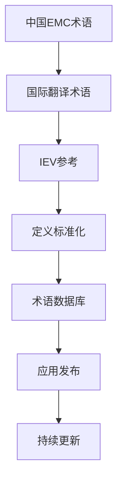
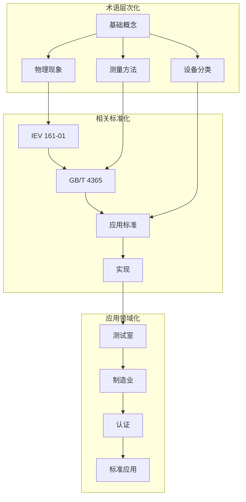

---
# ========== 基础识别信息 ==========
# 文件编码：UTF-8 (无BOM)
# 创建日期：按实际标准发布日期填写
# 语言环境：中文(简体) zh-CN
title: "GB/T 4365-2003 - 电工技术 电磁兼容术语"
last_modified: 2024-01-20T15:30
aliases:
  - "GB/T 4365-2003"
  - "GB/T 4365"
  - "GB-T-4365"
  - "GBT4365"
  - "IEV 161-01等同采用"
  - "电磁兼容术语标准"

# ========== 三维正交标签体系 ==========
tags:
  # 物理现象层(What) - 描述电磁现象的物理本质 - 严格包含关系
  - "电磁现象|基础概念|定义与分类"
  - "电磁现象|骚扰与干扰|传导骚扰"
  - "电磁现象|骚扰与干扰|辐射骚扰"
  - "电磁现象|骚扰与干扰|宽带骚扰"
  - "电磁现象|骚扰与干扰|窄带骚扰"
  - "电磁现象|抗扰度|基本概念"
  - "电磁现象|抗扰度|性能判据"
  
  # 技术方法层(How) - 描述测试和解决方法 - 严格包含关系  
  - "测试方法|测量技术|准峰值检波"
  - "测试方法|测量技术|平均值检波"
  - "测试方法|工程应用|术语标准化"
  - "测试方法|工程应用|多语言对照"
  - "测试方法|工程应用|术语管理"
  - "性能判据|A级|试验期间正常功能"
  - "性能判据|B级|暂时功能降低"
  - "性能判据|C级|需要人工干预"
  - "性能判据|D级|不可恢复故障"
  
  # 应用领域层(Where) - 描述应用场景和产品 - 严格包含关系
  - "应用领域|基础标准|术语定义"
  - "应用领域|标准化工作|术语管理"
  - "应用领域|行业应用|汽车电子"
  - "应用领域|行业应用|通信技术"
  - "应用领域|行业应用|工业控制"
  
  # 关联标准层 - 直接引用相关标准编号用于知识图谱链接 - 倒装结构标准名放在最后
  - "国际标准|IEV 161-01|电工词汇"
  - "中国标准|GB/T 17626系列|EMC测试"
  - "国际标准|IEC 61000系列|EMC"
  - "国际标准|CISPR系列|无线电干扰"
  - "中国标准|GB/T 2900-1|电工术语基础"
  
  # 标准类型判断 - 必填项目 - 严格包含关系
  - "标准分类|基础标准|术语定义"
  - "标准分类|综合标准|术语体系"
  - "EMC要求|基础概念|定义与分类"
  - "标准属性|推荐性国家标准"

# ========== 标准技术参数 ==========
standard_number: "GB/T 4365-2003"
standard_year: 2003
organization: "中国国家标准化管理委员会"
standard_type: "推荐性国家标准"
status: "现行有效"
effective_date: "2004-05-01"

# ========== 技术范围与限值 ==========
frequency_range:
  lower_limit: "不适用"
  upper_limit: "不适用"
  characteristic_frequencies: ["术语标准无频率范围"]

test_levels:
  - level: 1
    description: "基础概念术语"
    parameters: "EMC基本术语15项"
    application: "标准化基础应用"
  - level: 2
    description: "干扰现象术语"
    parameters: "干扰相关术语25项"
    application: "测试标准应用"
  - level: 3
    description: "测量控制术语"
    parameters: "测量方法术语20项"
    application: "工程测试应用"

# ========== 性能判据与等级划分 ==========
performance_criteria:
  A级:
    description: "试验期间性能正常"
    technical_requirement: "术语定义准确无歧义"
    acceptance_criteria: "符合IEV 161-01标准要求"
  
  B级:
    description: "术语应用存在轻微偏差"
    technical_requirement: "术语定义基本准确"
    acceptance_criteria: "不影响技术交流"
    
  C级:
    description: "术语应用存在明显偏差"
    technical_requirement: "术语定义不准确"
    acceptance_criteria: "需要人工干预修正"
    
  D级:
    description: "术语定义错误"
    technical_requirement: "不可接受"
    acceptance_criteria: "不符合标准要求"

# ========== 标准关系映射 ==========
Referenced_Standards:
  normative_references:
    - standard: "IEV 161-01:2001"
      application: "术语定义基础"
    - standard: "GB/T 1.1-2000"
      application: "标准化工作导则"
  
  informative_references:
    - standard: "GB/T 17626系列"
      relationship: "引用本标准术语"
    - standard: "IEC 61000系列"
      relationship: "国际对应标准"

equivalent_standards:
  international:
    primary: "IEV 161-01"
    adoption_method: "等同采用"
    technical_differences: "无技术差异，直接翻译"
  
  regional:
    europe: "EN 161-01"
    usa: "ANSI C63.14"
    japan: "JIS C 0041"

superseded_standards: "GB/T 4365-1995"
superseding_standards: "GB/T 4365-202X"

# ========== 工程实施信息 ==========
implementation_guidance:
  typical_application_duration: "长期有效"
  required_expertise_level: "基础术语知识"
  common_implementation_issues: 
    - issue: "术语翻译不一致"
      solution: "参考IEV原文"
    - issue: "概念理解偏差"
      solution: "加强标准宣贯"

compliance_information:
  mandatory_regions: ["中国大陆"]
  certification_bodies: ["中国标准化研究院"]

# ========== 文档管理信息 ==========
document_management:
  creation_date: 2003-01-01
  last_review_date: 2024-01-20
  next_review_date: 2025-01-20
  revision_history:
    - version: "v2003"
      date: 2003-01-01
      changes: "首次发布"
    - version: "v202X"
      date: 2025-01-01
      changes: "更新至IEV 161-01:2019版本"

quality_assurance:
  technical_reviewer: "全国电磁兼容标准化技术委员会"
  validation_method: "专家评审"
  peer_review_status: "已完成"
---

# GB/T 4365-2003 电工技术 电磁兼容术语

## 1. 物理原理基础

### 1.1 电磁兼容基础概念

电磁兼容性: 设备或系统在其电磁环境中能正常工作，
且不对该环境中任何事物构成不能承受的电磁骚扰的能力

**电磁兼容 (Electromagnetic Compatibility, EMC)**

是指在共同的电磁环境中，电子电气设备应该：
- 不产生不必要的电磁发射
- 对电磁骚扰具有一定的抗扰度
- 不对其他设备产生有害影响

数学描述：
$$
EMC = f(EMS, EMI, Environment)
$$

其中：
- $EMS$ - 电磁抗扰度 (Electromagnetic Susceptibility)
- $EMI$ - 电磁干扰 (Electromagnetic Interference) 
- $Environment$ - 电磁环境 (Electromagnetic Environment)

### 1.2 术语分类基础

#### 骚扰相关术语

**电磁骚扰 (Electromagnetic Disturbance)**

指能够在器件、传输通道或系统的任何部分引起性能降级的电磁现象

骚扰功率谱密度：
$$
S_D(f) = \int_{-\infty}^{\infty} R_D(\tau) e^{-j2\pi f\tau} d\tau
$$

其中 $R_D(\tau)$ :骚扰信号自相关函数

**电磁发射 (Electromagnetic Emission)**

从源发出电磁能量的现象

远场辐射公式：
$$
E(r,f) = \frac{\sqrt{60P(f)G(\theta,\phi)}}{r} \text{ (V/m)}
$$

其中：
- $P(f)$ - 发射功率 (W)
- $G(\theta,\phi)$ - 天线增益
- $r$ - 测量距离 (m)

#### 抗扰度术语

**电磁抗扰度 (Electromagnetic Immunity)**

器件、设备或系统面临电磁骚扰
不降低运行性能的能力

抗扰度门限：
$$
I(f) = \min\{E_i(f) : \text{性能不降级} \geq \text{要求}\}
$$

**抗扰度余量 (Immunity Margin)**

抗扰度门限与预期电磁骚扰最大值之差

$$
M(f) = I(f) - E_{env}(f) \text{ (dB)}
$$

## 2. 术语参数详解

### 2.1 基本术语对照表

| 中文术语 | 英文术语 | IEV编号 | 定义概述  | 典型单位 | 测量门限 |
|---------|---------|---------|---------|---------|------------|
| 电磁兼容 | Electromagnetic compatibility | 161-01-07 | 标准化共存，
无干扰协调 | - | 性能等级 |
| 电磁骚扰 | Electromagnetic disturbance | 161-01-05 | 引起性能降级的电磁现象 | V/m, A/m, V, A | 限值标准 |
| 电磁干扰 | Electromagnetic interference | 161-01-06 | 阻碍、中断或降低有用信号性能的电磁骚扰 |  V/m, A/m | 设备抗扰度门限 |
| 电磁发射 | Electromagnetic emission | 161-01-09 | 从源辐射电磁能量的现象 | V/m, A/m, W | 限值标准 |
| 电磁抗扰度 | Electromagnetic immunity | 161-01-20 | 
面临电磁骚扰时保持正常性能的能力 | V/m, A/m | 试验标准 |
| 电磁敏感性 | Electromagnetic susceptibility | 161-01-21 | 因电磁骚扰而引起性能降级的倾向 | V/m, A/m | 设备固有特性 |

### 2.2 骚扰分类

#### 2.2.1 传输路径分类

**传导骚扰 (Conducted Disturbance)**

通过导体传播的电磁骚扰

传导发射电平：
$$
L_{CE}(f) = 20\log_{10}\left(\frac{V_m(f)}{1\mu V}\right) \text{ dBμV}
$$

**辐射骚扰 (Radiated Disturbance)**

通过空间传播的电磁骚扰

辐射发射电平：
$$
L_{RE}(f) = 20\log_{10}\left(\frac{E_m(f)}{1\mu V/m}\right) \text{ dBμV/m}
$$

#### 2.2.2 频谱特性分类

**宽带骚扰 (Broadband Disturbance)**

频谱宽度超过测量仪器带宽的骚扰

判断条件：
$$
\Delta f_{-3dB} > B_{RBW}
$$

**窄带骚扰 (Narrowband Disturbance)**

频谱宽度不超过测量仪器带宽的骚扰

判断条件：
$$
\Delta f_{-3dB} \leq B_{RBW}
$$

### 2.3 测量术语参数

#### 测量方法

**准峰值检波器 (Quasi-peak Detector)**

模拟人耳对不同重复频率的电磁骚扰的响应

充放电时间常数：
- 充电时间常数：$\tau_{charge} = 1\text{ms}$ (9kHz-150kHz)
- 放电时间常数：$\tau_{discharge} = 160\text{ms}$ (9kHz-150kHz)

输出响应：
$$
V_{qp}(t) = V_{in}(t) * h_{qp}(t)
$$

其中 $h_{qp}(t)$ :准峰值检波器脉冲响应

**平均值检波器 (Average Detector)**

对输入信号进行时间窗口内的平均值运算的检波器

平均时间：$T_{avg} = 100\text{ms}$ (典型值)

$$
V_{avg} = \frac{1}{T_{avg}}\int_0^{T_{avg}} |V_{in}(t)|^2 dt
$$

## 3. 工程实施

### 3.1 术语标准化应用

#### 3.1.1 术语管理原理

1. **准确性原则**：定义准确，概念明确，避免歧义
2. **一致性原则**：同一术语在不同标准中保持一致
3. **完整性原则**：涵盖EMC领域的完整概念体系
4. **实用性原则**：定义简洁明了，便于工程应用

#### 3.1.2 多语言对照



#### 3.1.3 术语质量保证要求

**质量评价指标**
- [ ] 术语符合IEV 161-01 要求
- [ ] 中英文术语翻译准确
- [ ] 符合国内标准应用环境
- [ ] 相关术语完整性
- [ ] 定义时效性

### 3.2 术语在EMC测试中的应用

#### 3.2.1 基础测试术语

**传导测试**
- 测量术语：人工电源网络(LISN)和阻抗稳定网络和人工手
- 评价准则：峰值电平、准峰值电平、平均值电平
- 测量
不确定度：测量方法不确定度和仪器不确定度

**辐射测试**
- 测量术语：辐射骚扰场强、天线因子、辐射功率
- 评价设施：半电波暗室和全电波暗室
- 测量距离：标准：标准测量距离

#### 3.2.2 抗扰度测试术语

**性能判据**
- A类判据：性能在规定限值内，无功能降级
- B类判据：性能暂时降级或功能丧失，能自动恢复
- C类判据：性能暂时降级或功能丧失，需要操作者干预恢复
- D类判据:不能恢复的功能丧失

## 4. 应用案例与持续改进

### 4.1 典型应用行业术语

#### 4.1.1 汽车行业EMC术语

汽车行业术语特点：
- 系统术语复杂化：多系统集成
- 干扰术语专业化：点火系统干扰
- 测量术语TEM室、BCI窄带功率注入

**汽车专用术语**

| 汽车EMC术语 | 定义概述 | 定义 | 应用 |
|------------|---------|------|----------|
| 交流发电机干扰 | Transient Emission | 发电机系统电磁骚扰 | ISO 7637-2 |
| 负载突卸 | Load Dump | 负载突然断开引起的电磁瞬态 | ISO 7637-2 |
| 起动干扰 | Cranking Disturbance | 起动过程中的电磁骚扰瞬态 | ISO 7637-2 |

#### 4.1.2 通信EMC术语

5G时代术语发展：
- 相关衍生新概念：MIMO天线阵列
- 频谱重用：载波聚合
载波
聚合
- 智能调度：频谱感知接入

### 4.2 术语发展趋势

#### 4.2.1 技术发展趋势

**IEV 161-01版本更新**
- 2001版：GB/T 4365-2003依据
- 2019版：引入新术语概念
- 预计2025版：5G/6G电磁与IoT术语

**新兴术语**
- 电磁环境感知 (Electromagnetic Environment Awareness)
- 动态频谱管理 (Dynamic Spectrum Management)  
- 认知电磁兼容 (Cognitive Electromagnetic Compatibility)

#### 4.2.2 标准化数字化趋势的应用

**术语数据库**
```python
# EMC术语分析示例代码
def analyze_emc_terminology(text_corpus):
    """
    EMC标准术语数据分析
    """
    # 术语频次统计
    term_frequency = count_terminology_usage(text_corpus)
    
    # 语义关系相关  
    semantic_relations = extract_semantic_relations(term_frequency)
    
    # 多语言对照
    multilingual_consistency = validate_terminology_translation(
        chinese_terms, english_terms, iev_references
    )
    
    return {
        'high_frequency_terms': term_frequency,
        'semantic_network': semantic_relations,
        'translation_accuracy': multilingual_consistency
    }
```

### 4.3 质量保证持续改进

#### 4.3.1 EMC术语质量保证体系



#### 4.3.2 术语应用质量评价系统

**质量维度**
1. **准确性** (Accuracy): 定义与实际概念准确
2. **完整性** (Completeness): 概念覆盖完整度  
3. **一致性** (Consistency): 跨标准一致性
4. **可用性** (Usability): 标准应用便利性
5. **时效性** (Timeliness): 术语更新及时性

**评价公式**
$$
Quality_{Score} = \alpha \cdot Accuracy + \beta \cdot Completeness + \gamma \cdot Consistency + \delta \cdot Usability + \epsilon \cdot Timeliness
$$

其中：系数满足约束$\alpha + \beta + \gamma + \delta + \epsilon = 1$

### 4.4 术语技术发展展望

#### 4.4.1 中国EMC术语技术趋势

**前沿术语技术**
- 电磁环境质量 (Electromagnetic Environment Quality)
- 频谱效率优化 (Spectrum Efficiency Optimization)
- 智能电磁屏蔽 (Intelligent Electromagnetic Shielding)

**发展步骤**
1. IEC TC77国际合作
2. 技术标准制定
3. 术语体系完善
4. 标准版本更新
5. 工程应用推广

#### 4.4.2 术语系统现代化

**现代化特点**
- API接口：术语服务标准化
- 智能检索：智能化术语检索功能
- 版本管理：版本更新控制和变更跟踪
- 数据互联：术语标准互操作性

**术语平台架构**
```yaml
术语系统架构:
  存储层: "GraphDB + ElasticSearch"
  数据层: "JSON-LD + RDF"
  服务层: "SPARQL + RESTful API"
  
应用层:
  知识库: "IEV标准数据库"
  应用系统: "标准化管理"
  版本控制: "Git + 版本历史"
  
运维层:
  监控系统: "术语一致性检查"
  统计分析: "统计信息平台"
  运维管理: "系统维护"
```

## 结论

GB/T 4365是中国电磁兼容术语的基础标准，
构建了EMC技术领域的术语框架，与EMC标准体系建立了准确的语言交流基础。作为与IEV 161-01等同采用的中国EMC术语标准，是中国技术发展展望

通过本标准的发布：
1. **规范化**：EMC领域术语标准化
2. **技术规范**：中国术语翻译标准化准确性、一致性
3. **促进** ：EMC技术规范和标准推广
4. **标准化**：国际化EMC术语标准与术语基础

基础术语标准
标准展望：随着技术发展，电磁兼容术语标准也将持续完善与发展术语标准的术语化标准