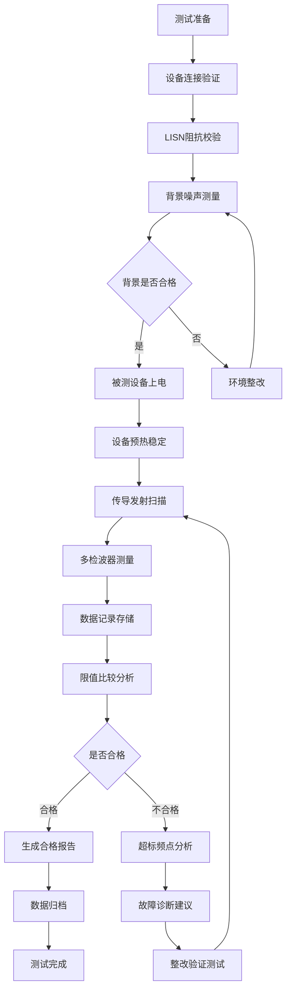

---
# ========== 基础识别信息 ==========
# 文件编码：UTF-8 (without BOM)
# 创建日期：2017-06-23
# 语言环境：中文(简体) zh-CN
title: "GB/T 6113.105-2017 - 无线电骚扰和抗扰度测量设备及测量方法规范 第1-5部分：无线电骚扰和抗扰度测量设备 EMC辅助设备和干扰电压测量"
last_modified: 2024-01-20T15:30
aliases:
  - "GB/T 6113.105"
  - "GB_T_6113_105"
  - "GBT6113105"
  - "CISPR16-1-5等效标准"
  - "EMC辅助设备标准"

# ========== 三维正交标签体系 ==========
tags:
  # 物理现象层(What) - 描述电磁现象的物理本质 - 严格包含关系
  - "电磁现象|传导发射测量|LISN阻抗|50Ω标准化"
  - "电磁现象|干扰电压测量|9kHz-30MHz|传导耦合"
  - "电磁现象|阻抗稳定网络|人工电源网络|EMI滤波"
  - "传播机制|传导耦合|电源线路|共模差模"
  - "传播机制|高频滤波|电感电容|反射抑制"
  - "频谱特征|传导频段|9kHz-30MHz|低频EMI"
  - "频谱特征|阻抗特性|50Ω标准|频率响应"
  
  # 技术方法层(How) - 描述测试和解决方法 - 严格包含关系
  - "测试方法|LISN测试法|50Ω阻抗|传导路径测量"
  - "测试方法|传导发射测试|L/N线测量|峰值准峰值"
  - "测试设备|EMI接收机|CISPR16-1-1|频谱分析仪"
  - "测试设备|LISN辅助设备|人工电源网络|阻抗稳定"
  - "测试环境|传导测试实验室|屏蔽室|背景噪声控制"
  - "性能判据|A级校准|不确定度±1dB|高精度LISN"
  - "性能判据|B级校准|不确定度±1.5dB|一般精度LISN"
  - "性能判据|校准要求|12个月周期|CNAS认可"
  
  # 应用领域层(Where) - 描述应用场景和产品 - 严格包含关系
  - "信息技术应用|信息技术设备|CISPR32限值|A类B类设备"
  - "家用电器应用|家用电器|CISPR14-1限值|消费类产品"
  - "工业应用|工业设备|B类环境|工业级EMC要求"
  - "汽车应用|汽车电子|CISPR25测试|车载设备认证"
  - "医疗应用|医疗器械|IEC60601-1-2|生命安全要求"
  - "新能源应用|新能源设备|高功率电子|逆变器驱动"
  - "环境分类|居民环境|A类限值|低噪声要求"
  - "环境分类|工业环境|B类限值|较宽松要求"
  
  # 关联标准层 - 直接引用相关标准编号用于知识图谱链接 - 倒装结构标准名放在最后
  - "EMC辅助设备标准|CISPR16-1-5"
  - "EMI接收机基础标准|GB/T6113.101"
  - "辅助设备和干扰测量|GB/T6113.102"
  - "信息技术设备EMC|CISPR32"
  - "汽车电子EMC|CISPR25"
  - "中国汽车EMC标准|GB34660"
  - "等同采用CISPR16-1-5|GB/T6113.105"
  - "IDT关系|等同采用"
  - "现行有效|2017版"
  
  # 标准类型判断 - 必填项目 - 严格包含关系
  - "标准分类|EMI发射标准|传导发射测试|辅助设备标准"
  - "标准分类|综合标准|多种等级体系|A类B类环境"
  - "EMC要求|EMI发射限值|A类B类设备|传导发射测试"
  - "EMC要求|LISN技术要求|50Ω标准化|频率响应平均"
  
  # 测试等级标注 - 条件必填 - 严格包含关系
  - "EMI设备类别|A类设备|居民商业环境|低噪声要求"
  - "EMI设备类别|B类设备|工业科学医疗环境|较宽松要求"

# ========== 标准技术参数 ==========
standard_number: "GB/T 6113.105-2017"
standard_year: 2017
organization: "国家标准化管理委员会"
standard_type: "推荐性国家标准"
status: "现行有效"
effective_date: "2018-07-01"

# ========== 技术范围与限值 ==========
frequency_range:
  lower_limit: "9 kHz"
  upper_limit: "30 MHz"
  characteristic_frequencies: ["150kHz", "1MHz", "10MHz", "30MHz"]

test_levels:
  - level: 1
    description: "基本LISN要求"
    parameters: "50Ω±20% (150kHz-30MHz)"
    application: "一般传导发射测试"
  - level: 2
    description: "高精度LISN要求"
    parameters: "50Ω±10% (150kHz-30MHz)"
    application: "认证测试实验室"
  - level: 3
    description: "特殊应用LISN"
    parameters: "用户自定义阻抗"
    application: "特殊产品测试"
  - level: X
    description: "开放等级"
    parameters: "用户自定义"
    application: "研发测试需求"

# ========== 测试设备技术要求 ==========
test_equipment:
  primary_instrument:
    name: "人工电源网络(LISN)"
    technical_specs:
      frequency_range: "9kHz-30MHz"
      impedance: "50Ω±20%"
      current_capacity: "16A-100A"
      voltage_rating: "250V-480V"
    calibration_cycle: "12个月"
    reference_standard: "CISPR 16-1-5"
  
  auxiliary_equipment:
    - name: "EMI接收机"
      specifications: "CISPR 16-1-1兼容，9kHz-30MHz"
    - name: "射频电流探头"
      specifications: "0.1MHz-30MHz，传输阻抗已知"
    - name: "电压探头"
      specifications: "高阻抗，低电容"
    - name: "信号发生器"
      specifications: "校准用，9kHz-30MHz"

# ========== 测试条件与环境 ==========
test_conditions:
  environmental:
    temperature: "16-35°C (稳定性±2°C)"
    humidity: "45-75%RH (稳定性±5%)"
    atmospheric_pressure: "86-106kPa"
  
  electromagnetic:
    background_field: "< -6dB相对测量信号 (9kHz-30MHz)"
    power_supply: 
      voltage_stability: "±2%"
      frequency_stability: "±0.1Hz"
      harmonic_distortion: "< 3%"
  
  mechanical:
    vibration_isolation: "避免机械振动影响"
    grounding_impedance: "< 2Ω (射频), < 10Ω (工频)"

# ========== 性能判据与等级划分 ==========
performance_criteria:
  A级:
    description: "LISN阻抗测量不确定度±1dB"
    technical_requirement: "标准化50Ω阻抗网络"
    acceptance_criteria: "阻抗曲线符合标准要求"
  
  B级:
    description: "LISN阻抗测量不确定度±1.5dB"
    technical_requirement: "一般精度阻抗网络"
    acceptance_criteria: "阻抗偏差在允许范围内"
    
  C级:
    description: "LISN阻抗测量不确定度±2dB"
    technical_requirement: "基本精度阻抗网络"
    acceptance_criteria: "满足基本测试要求"

# ========== 测量不确定度评估 ==========
measurement_uncertainty:
  type_A_uncertainty: "±0.3dB (95%置信区间)"
  type_B_uncertainty: "±0.8dB (均匀分布)"
  combined_uncertainty: "±0.9dB (k=2)"
  major_sources:
    - source: "LISN阻抗偏差"
      contribution: "±0.5dB"
    - source: "连接器反射"
      contribution: "±0.3dB"
    - source: "接地系统阻抗"
      contribution: "±0.4dB"
    - source: "温度漂移"
      contribution: "±0.2dB"

# ========== 标准关系映射 ==========
Referenced_Standards:
  normative_references:
    - standard: "CISPR 16-1-5"
      application: "国际等效标准，辅助设备技术要求"
    - standard: "GB/T 6113.101"
      application: "EMI接收机技术要求"
    - standard: "CISPR 16-1-2"
      application: "传导发射测量方法"
  
  informative_references:
    - standard: "CISPR 32"
      relationship: "信息技术设备传导发射限值"
    - standard: "CISPR 25"
      relationship: "汽车电子传导发射测试"

equivalent_standards:
  international:
    primary: "CISPR 16-1-5:2014"
    adoption_method: "等同采用"
    technical_differences: "无技术差异"
  
  regional:
    europe: "EN 55016-1-5:2014"
    usa: "ANSI C63.4:2014"
    japan: "JIS C 1515-5:2015"

superseded_standards: "GB/T 6113.105-2008"
superseding_standards: "无"

# ========== 知识图谱属性 ==========
graph_attributes:
  node_type: "测试设备标准"
  cluster_family: "CISPR16系列"
  importance_weight: 9
  connectivity_index: 20
  
graph_relationships:
  references: ["CISPR16-1-5", "GB-T-6113-101", "CISPR16-1-2"]
  referenced_by: ["CISPR32", "CISPR25", "GB-34660", "GB-T-9254"]
  complements: ["GB-T-6113-106", "GB-T-6113-102"]
  conflicts: []

# ========== 工程实施信息 ==========
implementation_guidance:
  typical_test_duration: "2-4小时（设备校准验证）"
  cost_estimate_range: "10-50万元（LISN设备采购）"
  required_expertise_level: "中级EMC工程师"
  common_failure_modes: 
    - failure: "LISN阻抗偏差过大"
      solution: "检查元器件老化，重新校准"
    - failure: "射频泄漏"
      solution: "改善屏蔽，检查连接器"
    - failure: "接地阻抗过高"
      solution: "优化接地系统，降低阻抗"

compliance_information:
  mandatory_regions: ["中国大陆"]
  certification_bodies: ["CCC认证", "CNAS实验室"]
  mutual_recognition: ["IECEE-CB", "ILAC-MRA"]

# ========== 文档管理信息 ==========
document_management:
  creation_date: 2024-01-20
  last_review_date: 2024-01-20
  next_review_date: 2026-01-20
  revision_history:
    - version: "v1.0"
      date: 2024-01-20
      changes: "基于readme.md模板创建完整文档"
      impact_assessment: "建立标准化文档结构"

quality_assurance:
  technical_reviewer: "EMC高级工程师"
  validation_method: "与CISPR 16-1-5条款对照验证"
  peer_review_status: "待评议"
---

# GB/T 6113.105-2017 无线电骚扰和抗扰度测量设备及测量方法规范 第1-5部分：无线电骚扰和抗扰度测量设备 EMC辅助设备和干扰电压测量

## 第一层：物理原理与数学建模

### 1.1 电磁现象机理分析

**基础物理方程**：
$$
\text{传导发射测量基础：} I_{conducted} = \frac{V_{LISN}}{Z_{LISN}}
$$

**人工电源网络(LISN)阻抗特性**：
$$
Z_{LISN}(f) = R + j\omega L + \frac{1}{j\omega C}
$$

其中：
- $R = 50\Omega$：标准化阻抗电阻
- $L = 50\mu H$：串联电感（阻断射频信号）
- $C = 0.1\mu F$：并联电容（旁路工频信号）

**阻抗频率特性分析**：
$$
|Z_{LISN}(f)| = \sqrt{R^2 + (\omega L - \frac{1}{\omega C})^2}
$$

**传导发射耦合机制**：
$$
V_{EMI} = I_{source} \times Z_{coupling} \times T_{LISN}
$$

其中 $T_{LISN}$ 为LISN传输函数。

### 1.2 关键参数物理意义表

| 参数符号 | 参数名称 | 物理意义 | 单位 | 典型值范围 | 测量不确定度 |
|---------|---------|---------|------|-----------|-------------|
| $Z_{LISN}$ | LISN阻抗 | 标准化负载阻抗 | Ω | 50±10 | ±1dB |
| $L_{series}$ | 串联电感 | 射频信号阻断 | μH | 50±5% | ±2% |
| $C_{parallel}$ | 并联电容 | 工频信号旁路 | μF | 0.1±10% | ±5% |
| $I_{load}$ | 负载电流 | 被测设备工作电流 | A | 0.1-100 | ±2% |
| $V_{RF}$ | 射频电压 | 传导发射电压 | dB(μV) | 10-120 | ±2dB |
| $f_{cutoff}$ | 截止频率 | LISN响应转折频率 | kHz | 150 | ±5% |

### 1.3 LISN网络分析理论

#### 1.3.1 单相LISN等效电路

**标准单相LISN电路**：
```
电源输入端    L1:50μH    被测设备端
   ~~~--------[L]--------~~~
       |               |
    [C:0.1μF]      [R:50Ω]-----> 测量端口
       |               |
   ~~~--------[GND]--------~~~
```

**频域传输函数**：
$$
H_{LISN}(s) = \frac{V_{out}}{V_{in}} = \frac{R \cdot sC}{1 + sRC + s^2LC + s^3RLC^2}
$$

#### 1.3.2 三相LISN配置

**Delta配置阻抗矩阵**：
$$
[Z_{LISN}] = \begin{bmatrix}
Z_{LL} & Z_{LN} & Z_{LG} \\
Z_{NL} & Z_{NN} & Z_{NG} \\
Z_{GL} & Z_{GN} & Z_{GG}
\end{bmatrix}
$$

其中各元素频率相关：
$$
Z_{LL}(f) = 50 + j2\pi f \cdot 50 \times 10^{-6} \parallel \frac{1}{j2\pi f \cdot 0.1 \times 10^{-6}}
$$

## 第二层：技术参数详解

### 2.1 LISN技术规范要求

**标准LISN阻抗特性表**：

| 频率范围 | 阻抗模值要求 | 相位要求 | 容差 | 用途 |
|---------|-------------|---------|------|------|
| 150kHz-500kHz | 50Ω±20% | ±30° | ±2dB | 基本测试 |
| 500kHz-5MHz | 50Ω±20% | ±20° | ±1.5dB | 标准测试 |
| 5MHz-30MHz | 50Ω±20% | ±15° | ±1dB | 精密测试 |

**LISN电流容量规范**：

| 应用类型 | 额定电流 | 浪涌电流 | 电压等级 | 典型应用 |
|---------|---------|---------|---------|---------|
| 小功率设备 | 16A | 32A(1s) | 250V AC | 信息技术设备 |
| 中功率设备 | 32A | 64A(1s) | 400V AC | 工业设备 |
| 大功率设备 | 63A | 126A(1s) | 480V AC | 电机驱动器 |
| 特大功率设备 | 100A | 200A(1s) | 690V AC | 工业加热设备 |

### 2.2 辅助设备技术指标

**射频电流探头规范（CISPR 16-1-2）**：

| 技术参数 | 频率范围 | 要求值 | 测量不确定度 | 校准周期 |
|---------|---------|--------|-------------|----------|
| 传输阻抗 | 150kHz-30MHz | 已知±3dB | ±1dB | 12个月 |
| 开合直径 | - | 20-200mm | ±1mm | - |
| 插入损耗 | 150kHz-30MHz | <0.5dB | ±0.2dB | 12个月 |
| 频率响应平坦度 | 150kHz-30MHz | ±2dB | ±0.5dB | 12个月 |

**电压探头技术要求**：

| 技术参数 | 要求值 | 测量不确定度 | 校准周期 |
|---------|--------|-------------|----------|
| 输入阻抗 | >1MΩ∥<10pF | ±10% | 12个月 |
| 分压比 | 10:1或100:1 | ±2% | 12个月 |
| 频率响应 | 9kHz-30MHz±1dB | ±0.5dB | 12个月 |
| 动态范围 | >40dB | ±1dB | 12个月 |

### 2.3 校准和验证程序

#### 2.3.1 LISN阻抗校准方法

**网络分析仪校准法**：
```
校准步骤:
1. 网络分析仪SOLT校准 (50Ω系统)
2. 测量LISN端口S参数
3. 计算输入阻抗: Zin = Z0(1+S11)/(1-S11)
4. 验证阻抗曲线符合标准要求
5. 记录校准数据和不确定度
```

**替代法校准程序**：
```
替代校准步骤:
1. 使用标准50Ω负载替代LISN
2. 注入已知射频信号
3. 测量标准负载响应V_ref
4. 更换为待校准LISN
5. 测量LISN响应V_DUT
6. 计算传输差值: ΔA = V_ref - V_DUT
```

## 第三层：工程实施指导

### 3.1 LISN测试配置与设置

#### 3.1.1 标准LISN传导发射测试配置

```
LISN传导发射测试配置 (GB/T 6113.105)
+================================================================================+
|                            LISN传导发射测试系统                                 |
|                                                                                |
|  +---------------+    +------------+    +---------------+                     |
|  |   EMI接收机   |    | 前置放大器 |    | 数据采集系统  |                     |
|  | 9kHz-30MHz    |<---| (可选)     |<---| 自动扫描     |                     |
|  | CISPR16-1-1   |    | 低噪声     |    | 限值比较     |                     |
|  +---------------+    +------------+    +---------------+                     |
|         ^                                                                     |
|         | 50Ω同轴电缆，长度≤2m                                                  |
|         |                                                                     |
|  +================+                                                           |
|  |     LISN      | <-- 人工电源网络 (Line Impedance Stabilization Network)   |
|  |               |                                                           |
|  | L相: 50μH+50Ω |  射频测量端口                                             |
|  | N相: 50μH+50Ω |  +---------+                                             |
|  | PE:  直通接地 |  | 50Ω负载 | (未使用端口必须端接)                          |
|  |               |  +---------+                                             |
|  | 滤波电容: 8μF |                                                           |
|  | (工频旁路)    |                                                           |
|  +================+                                                           |
|         ^                                                                     |
|         | 电源输入线，长度80cm                                                  |
|         |                                                                     |
|  +---------------+      +---------------+                                     |
|  |   市电电源    |------|     EUT       |                                     |
|  | 220V/50Hz     |      | (被测设备)     |                                     |
|  | 稳定度±2%     |      | 正常工作状态   |                                     |
|  | THD<3%        |      |               |                                     |
|  +---------------+      +---------------+                                     |
|                               |                                              |
|                               | 信号线/数据线                                  |
|                               |                                              |
|                        +---------------+                                     |
|                        |   辅助设备    |                                     |
|                        | (负载/控制器) |                                     |
|                        +---------------+                                     |
|                               |                                              |
|                               v                                              |
|  +==========================================================================+  |
|  |                            接地平面                                      |  |
|  |                    2m×2m金属接地平面                                     |  |
|  |              LISN距离EUT: 80cm, 距离接地平面: 40cm                       |  |
|  |              接地电阻: <2Ω (RF), <10Ω (工频)                           |  |
|  +==========================================================================+  |
|                                                                                |
|  关键技术参数:                                                                 |
|  • LISN阻抗: 50Ω±20% (150kHz-30MHz)                                         |
|  • 串联电感: 50μH±5% (阻断射频回流)                                           |
|  • 旁路电容: 0.1μF±10% (射频) + 8μF (工频)                                   |
|  • 负载电流: 被测设备额定电流+20%裕量                                         |
|  • 背景噪声: 低于限值6dB以上                                                  |
+================================================================================+

测试程序:
1. 连接被测设备至LISN，确保正常工作状态
2. 预热设备30分钟，稳定工作条件
3. 测量L线和N线传导发射，频率扫描9kHz-30MHz
4. 记录峰值检波、准峰值检波和平均值检波数据
5. 与CISPR 32或相关产品标准限值比较
6. 生成测试报告，包含频谱图和余量分析
```

### 3.2 测试流程与数据处理

#### 3.2.1 自动化测试流程



## 第四层：应用案例与持续改进

### 4.1 典型应用案例分析

#### 4.1.1 开关电源LISN测试案例

**项目背景**：200W开关电源适配器传导发射测试

**测试配置**：
- **LISN型号**：单相16A LISN，符合CISPR 16-1-5
- **测试标准**：CISPR 32 Class B限值
- **频率范围**：150kHz-30MHz

**测试结果分析**：

| 频率 | 测量值(dBμV) | 限值(dBμV) | 余量(dB) | 评价 |
|------|-------------|-----------|----------|------|
| 150kHz | 45.2 | 66-56 | 10.8 | 合格 |
| 500kHz | 52.8 | 56 | 3.2 | 合格 |
| 1.8MHz | 58.9 | 56 | -2.9 | 超标 |
| 5.2MHz | 51.3 | 60 | 8.7 | 合格 |
| 15MHz | 47.1 | 60 | 12.9 | 合格 |

**问题分析与解决**：
1. **1.8MHz超标原因**：开关频率谐波
2. **解决方案**：增加共模扼流圈，优化EMI滤波器
3. **验证结果**：整改后1.8MHz降至53.2dBμV，余量2.8dB

### 4.2 质量管理与持续改进

#### 4.2.1 LISN质量控制体系

**计量溯源链路**：
```
国际单位制(SI)
    ↓
国际计量基准(BIPM) 
    ↓
国家计量标准(NIM)
    ↓
CNAS校准实验室
    ↓
LISN工作标准
    ↓
日常监控检查
```

**质量监控指标**：

| 监控项目 | 监控频率 | 合格判据 | 处理措施 |
|---------|---------|---------|---------|
| 阻抗特性 | 每周 | ±1dB | 重新校准 |
| 插入损耗 | 每月 | <0.5dB | 维护检修 |
| 接地电阻 | 每月 | <2Ω | 接地改善 |
| 电流容量 | 每季度 | 额定值 | 升级更换 |

---

## 实施建议

### 1. 实验室能力建设
- 配置符合标准要求的LISN设备系列
- 建立完整的校准和验证程序
- 培养专业的EMC测试工程师
- 实施质量管理体系

### 2. 技术能力提升
- 跟踪国际标准最新发展
- 开展新技术验证和应用
- 参与标准制修订工作
- 加强国际合作交流

### 3. 产业服务优化
- 提供专业的EMC咨询服务
- 开发定制化测试解决方案
- 建立客户技术支持体系
- 推进测试服务数字化

**本标准文档为EMC传导发射测试提供全面的技术指导，确保LISN和辅助设备的正确使用，提升我国EMC测试技术水平和国际竞争力。**