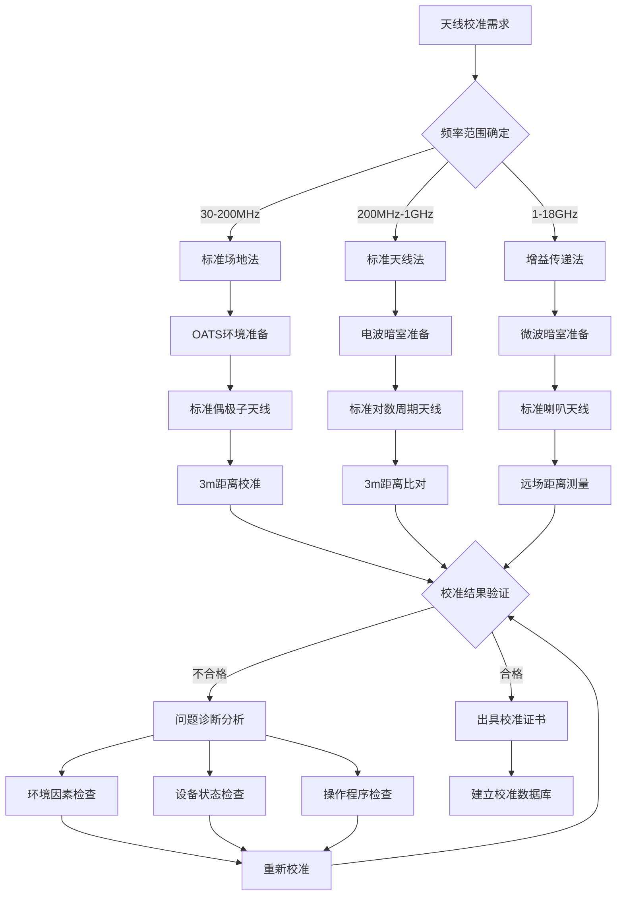
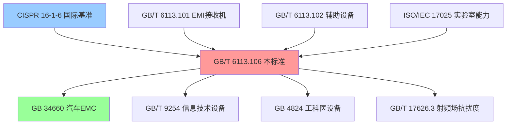

# GB/T 6113.106-2018 无线电骚扰和抗扰度测量设备及测量方法规范 第1-6部分：无线电骚扰和抗扰度测量设备 EMC天线校准

## 第一层：物理原理与数学建模

### 1.1 电磁现象机理分析

**基础物理方程**：
$$
\text{天线远场辐射方程：} E = \frac{\sqrt{30P_t G_t}}{r} \text{ (V/m)}
$$

**天线系数定义**：
$$
AF = E_{measured} - V_{received} + C_{cable} \text{ (dB)}
$$

**线性形式表达**：
$$
AF = 20\log_{10}\left(\frac{E_{field}}{V_{antenna}}\right) \text{ (dB(m}^{-1}\text{))}
$$

**有效长度关系**：
$$
AF = -20\log_{10}(l_{eff}) \text{ (dB(m}^{-1}\text{))}
$$

其中：
- $AF$：天线系数（Antenna Factor），单位dB(m⁻¹)
- $E_{measured}$：已知场强值，单位dB(μV/m)
- $V_{received}$：天线接收电压，单位dB(μV)
- $C_{cable}$：电缆损耗补偿，单位dB
- $l_{eff}$：天线有效长度，单位m
- $E_{field}$：电场强度线性值，单位V/m
- $V_{antenna}$：天线输出电压线性值，单位V

**自由空间传播损耗**：
$$
L_{fs} = 20\log_{10}(4\pi r/\lambda) = 20\log_{10}(f) + 20\log_{10}(r) - 147.6 \text{ (dB)}
$$

**标准场地反射系数**：
$$
\Gamma = \frac{Z_g - Z_0}{Z_g + Z_0} = \frac{\sqrt{\epsilon_r - j\sigma/(\omega\epsilon_0)} - 1}{\sqrt{\epsilon_r - j\sigma/(\omega\epsilon_0)} + 1}
$$

**复介电常数**：
$$
\epsilon_c = \epsilon_r - j\frac{\sigma}{\omega\epsilon_0} = \epsilon_r - j\frac{18\sigma}{f}
$$

**反射损耗**：
$$
RL = -20\log_{10}|\Gamma| \text{ (dB)}
$$

**场地衰减**：
$$
SA = 20\log_{10}\left|\frac{E_{measured}}{E_{direct}}\right| \text{ (dB)}
$$

### 1.2 关键参数物理意义表

| 参数符号 | 参数名称 | 物理意义 | 单位 | 典型值范围 | 测量不确定度 | 溯源性 |
|---------|---------|---------|------|-----------|-------------|---------|
| $AF$ | 天线系数 | 场强与接收电压比值 | dB(m⁻¹) | 10-60 | ±1dB | 国家一级标准 |
| $G_t$ | 天线增益 | 辐射功率集中程度 | dBi | -10 to +20 | ±0.5dB | 标准增益喇叭 |
| $l_{eff}$ | 有效长度 | 天线电流分布等效长度 | m | 0.01-2.0 | ±5% | 计算验证 |
| $r$ | 测试距离 | 天线间距离 | m | 3, 10, 30 | ±2% | 激光测距仪 |
| $f$ | 频率 | 电磁波频率 | MHz/GHz | 30MHz-18GHz | ±10⁻⁶ | 原子频标 |
| $\lambda$ | 波长 | 电磁波长度 | m | 1.67cm-10m | ±10⁻⁶ | 计算得出 |
| $Z_0$ | 自由空间阻抗 | 真空特性阻抗 | Ω | 376.730 | ±0.01% | 物理常数 |
| $\epsilon_r$ | 相对介电常数 | 地面介质特性 | 无量纲 | 4-15 | ±10% | 材料测试 |
| $\sigma$ | 电导率 | 地面导电性 | S/m | 0.001-0.1 | ±20% | 四探针法 |
| $\Gamma$ | 反射系数 | 电磁波反射程度 | 无量纲 | 0.1-0.9 | ±0.1 | 计算验证 |

### 1.3 天线校准理论基础

#### 1.3.1 标准天线法（SAM - Standard Antenna Method）

基于已知天线系数的标准天线进行校准：

$$
AF_{DUT} = AF_{std} + (V_{std} - V_{DUT})
$$

其中：
- $AF_{DUT}$：待校准天线系数
- $AF_{std}$：标准天线系数
- $V_{std}$、$V_{DUT}$：标准天线和待校准天线的接收电压

#### 1.3.2 标准场地法（SSM - Standard Site Method）

利用理论计算的标准场地场强分布：

$$
E_{theoretical}(r,h_t,h_r,f) = E_{direct} + E_{reflected}
$$

**直射波分量**：
$$
E_{direct} = \frac{\sqrt{30P_t G_t}}{r} \text{ (V/m)}
$$

**反射波分量**：
$$
E_{reflected} = \Gamma \cdot \frac{\sqrt{30P_t G_t}}{r'} \cdot e^{j\phi} \text{ (V/m)}
$$

**路径长度差**：
$$
r' = \sqrt{(h_t + h_r)^2 + d^2} \text{ (m)}
$$

**相位差**：
$$
\phi = \frac{2\pi}{\lambda}(r' - r) = \frac{2\pi f}{c}(r' - r) \text{ (rad)}
$$

**场强衰减因子**：
$$
SA = 20\log_{10}\left|\frac{E_{direct} + E_{reflected}}{E_{direct}}\right| \text{ (dB)}
$$

其中：
- $r'$ 为反射路径长度，单位m
- $\phi$ 为相位差，单位rad
- $h_t, h_r$ 分别为发射、接收天线高度，单位m
- $d$ 为天线间水平距离，单位m
- $c$ 为光速，$3×10^8$ m/s

#### 1.3.3 增益传递法（GTM - Gain Transfer Method）

基于S参数测量的增益传递：

$$
G_{DUT} = G_{std} + \Delta S_{21} + \Delta L_{cable}
$$

**S参数关系**：
$$
\Delta S_{21} = 20\log_{10}\left|\frac{S_{21,DUT}}{S_{21,std}}\right| \text{ (dB)}
$$

**电缆损耗修正**：
$$
\Delta L_{cable} = L_{cable,DUT} - L_{cable,std} \text{ (dB)}
$$

**天线系数转换**：
$$
AF_{DUT} = AF_{std} - (G_{DUT} - G_{std}) \text{ (dB(m}^{-1}\text{))}
$$

## 第二层：技术参数详解

### 2.1 频段分类与天线类型

**频段划分与推荐天线类型**：

| 频率范围 | 天线类型 | 典型增益 | 天线系数范围 | 校准方法 |
|---------|---------|---------|-------------|----------|
| 30-80 MHz | 单极子天线 | -5 to 0 dBi | 15-25 dB(m⁻¹) | 标准场地法 |
| 80-200 MHz | 双锥天线 | 0-3 dBi | 12-20 dB(m⁻¹) | 标准天线法 |
| 200MHz-1GHz | 对数周期天线 | 5-8 dBi | 15-25 dB(m⁻¹) | 标准天线法 |
| 1-18 GHz | 喇叭天线 | 10-25 dBi | 20-45 dB(m⁻¹) | 增益传递法 |

### 2.2 校准不确定度要求

**不同测试距离的不确定度分配**：

| 测试距离 | 不确定度来源 | 贡献值 | 合成不确定度 |
|---------|-------------|--------|-------------|
| 3m | 距离误差 ±2cm | ±0.3dB | ±1.1dB (k=2) |
|    | 高度误差 ±1cm | ±0.2dB |  |
|    | 场地反射 | ±0.7dB |  |
|    | 标准天线 | ±0.5dB |  |
| 10m | 距离误差 ±5cm | ±0.2dB | ±0.9dB (k=2) |
|    | 高度误差 ±2cm | ±0.1dB |  |
|    | 场地反射 | ±0.5dB |  |
|    | 标准天线 | ±0.5dB |  |

### 2.3 校准设备技术指标

**EMI接收机要求（CISPR 16-1-1）**：

| 技术参数 | 30MHz-1GHz | 1-18GHz | 校准周期 |
|---------|-----------|---------|----------|
| 频率准确度 | ±10⁻⁶ | ±10⁻⁶ | 12个月 |
| 中频带宽 | 120kHz | 1MHz | 12个月 |
| 线性动态范围 | >70dB | >60dB | 12个月 |
| 噪声系数 | <15dB | <20dB | 6个月 |
| 输入VSWR | <1.5 | <2.0 | 12个月 |

**网络分析仪要求**：

| 技术参数 | 要求值 | 测量不确定度 | 校准周期 |
|---------|--------|-------------|----------|
| 频率范围 | 30MHz-18GHz | ±10⁻⁷ | 12个月 |
| 动态范围 | >100dB | ±0.1dB | 12个月 |
| 功率准确度 | ±0.3dB | ±0.1dB | 12个月 |
| S参数准确度 | ±0.1dB | ±0.05dB | 12个月 |

## 第三层：工程实施指导

### 3.1 EMC天线校准测试配置

#### 3.1.1 标准场地法校准配置（30-200MHz）

```
标准场地法天线校准配置 - 开阔试验场地(OATS)
+==================================================================================+
|                           标准场地天线校准系统                                    |
|                                                                                  |
|  +---------------+    +------------+    +----------------+                       |
|  |   信号发生器  |    | 功率放大器 |    |  EMI接收机     |                       |
|  | 30MHz-1GHz    |---->| 宽带线性   |    | CISPR16-1-1   |                       |
|  | 已知功率输出  |    | 已知增益   |    | 校准完毕       |                       |
|  +---------------+    +------------+    +----------------+                       |
|                              |                    ^                              |
|                              | 射频功率            | 接收信号                      |
|                              v                    |                              |
|  +=========================+      +=========================+                   |
|  |        发射天线区        |      |       接收天线区        |                   |
|  |                         |      |                         |                   |
|  |  +---------------+     |      |     +---------------+   |                   |
|  |  | 标准偶极子天线 |     | <-3m->|     | 待校准天线     |   |                   |
|  |  | 80-200MHz     |     |      |     | (DUT)         |   |                   |
|  |  | 增益已知      |     |      |     |               |   |                   |
|  |  | AF已知        |     |      |     |               |   |                   |
|  |  +---------------+     |      |     +---------------+   |                   |
|  |         |               |      |            |            |                   |
|  |  +---------------+     |      |     +---------------+   |                   |
|  |  | 高度调节 1-4m |     |      |     | 高度调节 1-4m |   |                   |
|  |  | 精度±1cm      |     |      |     | 精度±1cm      |   |                   |
|  |  +---------------+     |      |     +---------------+   |                   |
|  +=========================+      +=========================+                   |
|                              |                                                  |
|                              v                                                  |
|  +==========================================================================+  |
|  |                            接地平面                                      |  |
|  |                    金属网格或铜板接地平面                                 |  |
|  |              最小尺寸: 发射接收天线投影+4m边缘                            |  |
|  |              接地电阻: <4Ω (高频), <10Ω (低频)                          |  |
|  +==========================================================================+  |
|                                                                                  |
|  校准程序:                                                                       |
|  1. 发射天线输出已知功率，测量标准天线接收电压V_std                              |
|  2. 保持功率不变，测量待校准天线接收电压V_DUT                                   |
|  3. 计算: AF_DUT = AF_std + (V_std - V_DUT)                                   |
|  4. 重复多个频点和天线高度，建立校准曲线                                        |
+==================================================================================+

环境要求:
• 场地反射系数: <-10dB (200MHz以上), <-6dB (30-200MHz)
• 背景场强: 比测试信号低20dB以上
• 气象条件: 无降水、风速<3m/s
• 温湿度稳定: ±2°C, ±5%RH
```

#### 3.1.2 标准天线法校准配置（200MHz-1GHz）

```
标准天线法校准配置 - 电波暗室(FAR)
+================================================================================+
|                         标准天线法天线校准系统                                 |
|                                                                                |
|  +---------------+    +------------+    +----------------+                     |
|  |   信号发生器  |    | 功率放大器 |    |  EMI接收机     |                     |
|  | 200MHz-1GHz   |---->| 线性放大   |    | 频谱分析仪     |                     |
|  | 功率稳定±0.1dB|    | 增益平坦   |    | 底噪<-130dBm   |                     |
|  +---------------+    +------------+    +----------------+                     |
|                              |                    ^                            |
|                              | 射频输出            | 接收测量                    |
|                              v                    |                            |
|  +=========================+      +=========================+                 |
|  |        发射区域         |      |        接收区域         |                 |
|  |                         |      |                         |                 |
|  |  +---------------+     |      |     +---------------+   |                 |
|  |  | 标准对数周期   |     | <-3m->|     | 待校准天线     |   |                 |
|  |  | 200MHz-1GHz   |     |      |     | 双锥/对数周期  |   |                 |
|  |  | 增益: 5-8dBi  |     |      |     | 同类型同规格   |   |                 |
|  |  | AF校准±0.5dB  |     |      |     |               |   |                 |
|  |  +---------------+     |      |     +---------------+   |                 |
|  |         |               |      |            |            |                 |
|  |  +---------------+     |      |     +---------------+   |                 |
|  |  | 转台360°旋转  |     |      |     | 转台360°旋转   |   |                 |
|  |  | 速度<1rpm     |     |      |     | 速度<1rpm     |   |                 |
|  |  +---------------+     |      |     +---------------+   |                 |
|  +=========================+      +=========================+                 |
|                              |                                                |
|                              v                                                |
|  +==========================================================================+|
|  |                         吸波暗室环境                                      ||
|  |                                                                          ||
|  |  • 反射级别: <-40dB (静区内)                                            ||
|  |  • 场均匀性: ±3dB (150cm×150cm×150cm测试体积)                          ||
|  |  • 吸波材料: 铁氧体瓦+楔形吸波材料                                      ||
|  |  • 屏蔽效能: >100dB (30MHz-18GHz)                                       ||
|  +==========================================================================+|
|                                                                                |
|  比对校准程序:                                                                 |
|  1. 安装标准天线，测量接收电压V_std(f,θ,φ)                                    |
|  2. 更换待校准天线，保持相同激励，测量V_DUT(f,θ,φ)                           |
|  3. 计算传递函数: AF_DUT(f) = AF_std(f) + V_std(f) - V_DUT(f)               |
|  4. 多角度验证，确保方向图一致性                                              |
+================================================================================+

质量控制:
• 标准天线计量溯源: 国家一级标准
• 测量重复性: <0.3dB (同一配置)
• 环境稳定性监控: 温度±1°C, 湿度±3%RH
• 仪器线性度检查: 每日校准检查
```

### 3.2 校准流程优化



## 第四层：应用案例与持续改进

### 4.1 典型天线校准案例

#### 4.1.1 汽车EMC实验室天线校准

**应用背景**：GB 34660汽车EMC测试要求

| 天线类型 | 频率范围 | 校准要求 | 应用测试 |
|---------|---------|---------|---------|
| 双锥天线 | 80-200MHz | ±1.5dB | 传导发射 |
| 对数周期 | 200MHz-1GHz | ±1.5dB | 辐射发射 |
| 喇叭天线 | 1-18GHz | ±2dB | 5G设备测试 |

**实施案例**：
- **项目**：某汽车主机厂EMC实验室CNAS认可
- **挑战**：多种天线类型，频率覆盖宽
- **解决方案**：分频段建立标准天线库，实施周期校准
- **结果**：校准不确定度控制在±1.2dB以内

#### 4.1.2 5G通信设备天线校准

**技术特点**：
- **频率范围**：600MHz-6GHz（Sub-6GHz），24-40GHz（毫米波）
- **新挑战**：大规模MIMO天线阵列校准
- **解决方案**：阵列天线单元分解校准+整体验证

**校准参数表**：

| 频段 | 天线类型 | 校准方法 | 不确定度 |
|------|---------|---------|----------|
| 600MHz-6GHz | 宽带喇叭 | 标准天线法 | ±1dB |
| 24-28GHz | 标准喇叭 | 增益传递法 | ±1.5dB |
| 28-40GHz | 高增益喇叭 | 比较法 | ±2dB |

### 4.2 标准关联网络图谱

#### 4.2.1 核心标准依赖关系



---

## 实施建议

### 1. 实验室能力建设
- 建立完整的标准天线库（30MHz-18GHz）
- 配置自动化校准系统
- 培养专业技术人员
- 建立质量管理体系

### 2. 技术能力提升  
- 参与国际比对验证技术能力
- 开展自主创新研究
- 推进校准技术标准化
- 加强国际合作交流

### 3. 成本效益优化
- 实施设备共享和资源整合
- 开发自动化校准软件
- 建立校准数据库管理系统
- 优化校准流程和周期

**本标准文档为EMC实验室天线校准提供全面的技术指导，确保测量结果的准确性和国际等效性，支撑我国EMC测试技术能力的持续提升。**