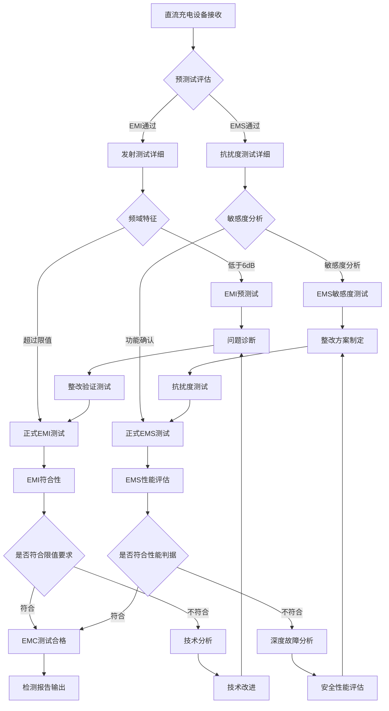
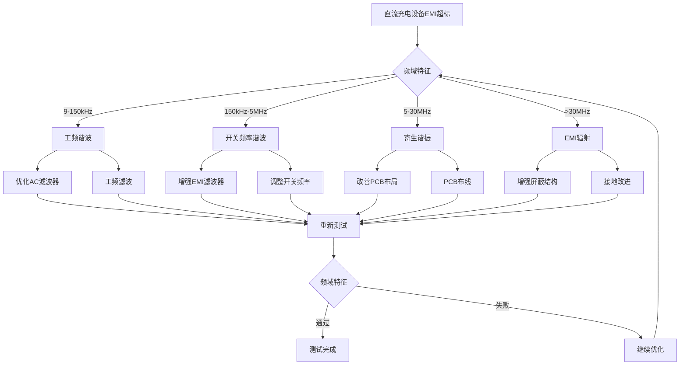
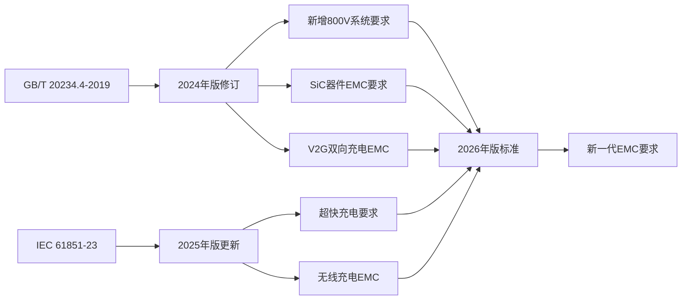

---
# ========== 基础识别信息 ==========
# 文件编码：UTF-8 (无BOM)
# 创建日期：2025-01-20T15:30
# 语言环境：中文(简体) zh-CN
title: "GB/T 20234.4-2019 - 电动汽车传导充电系统第4部分：直流充电站"
last_modified: 2025-01-20T15:30
aliases:
  - "GB/T 20234.4"
  - "GB/T 20234.4-2019"
  - "GB_T_20234_4"
  - "电动汽车直流充电站"
  - "EV充电站EMC标准"

# ========== 三维正交标签体系 ==========
tags:
  # 物理现象层(What) - 描述电磁现象的物理本质 - 严格包含关系
  - "电磁现象|直流充电|大电流传输|200A-500A功率"
  - "电磁现象|电力变换|DC-AC变换器|谐波产生"
  - "电磁现象|接地噪声|PE线路|共模电流"
  - "电磁现象|电磁兼容|功率变换器|开关频率"
  - "电磁现象|谐波电流|整流器|THD失真"
  - "传播机制|传导耦合|电源线路|EMI传播"
  - "传播机制|辐射耦合|空间传播|EMI辐射"
  - "频谱特征|开关频率|10-100kHz|功率开关"
  - "频谱特征|谐波分量|工频倍数|电网谐波"
  
  # 技术方法层(How) - 描述测试和解决方法 - 严格包含关系  
  - "测试方法|传导发射测试|LISN测试法|9kHz-30MHz"
  - "测试方法|辐射发射测试|OATS测试法|30MHz-1GHz"
  - "测试方法|静电放电测试|IEC61000-4-2|±8kV接触放电"
  - "测试方法|射频场抗扰度|IEC61000-4-3|10V/m场强"
  - "测试方法|电快速瞬变|IEC61000-4-4|脉冲群测试"
  - "测试方法|浪涌抗扰度|IEC61000-4-5|雷击测试"
  - "测试设备|EMI接收机|CISPR16-1-1|±2dB精度"
  - "测试设备|ESD发生器|15kV电压|0.7ns上升时间"
  - "测试环境|CNAS认可实验室|12个月校准|质量保证"
  - "性能判据|A级判据|试验期间正常工作|充电效率正常"
  - "性能判据|B级判据|功能降低但可恢复|自动恢复"
  - "性能判据|C级判据|需人工干预恢复|手动重启"
  - "性能判据|D级判据|设备损坏或数据丢失|不可接受"
  
  # 应用领域层(Where) - 描述应用场景和产品 - 严格包含关系
  - "工业应用|新能源汽车|直流充电桩|800V系统"
  - "工业应用|充电基础设施|大功率充电设备|公共充电"
  - "工业应用|电力电子|功率变换器|EMC控制"
  - "环境分类|工业环境|B级EMC环境|充电站"
  - "环境分类|户外环境|严酷电磁环境|恶劣工况"
  - "功率范围|大功率|350kW超级快充|高功率密度"
  - "功率范围|超大功率|600kW极速充电|液冷散热"
  - "应用场景|公共充电|高速服务区|快速补能"
  - "应用场景|商用充电|物流园区|商用车充电"
  - "技术发展|标准化|测试认证|法规要求"
  
 # 关联标准层 - 直接引用相关标准编号用于知识图谱链接 - 倒装结构标准名放在最后
  - "通用要求|GB-T-20234-1"
  - "交流充电接口|GB-T-20234-2" 
  - "直流充电接口|GB-T-20234-3"
  - "国际充电标准|IEC-61851-1"
  - "充电站EMC标准|IEC-61851-23"
  - "工业EMC通用标准|IEC-61000-6-4"
  - "静电放电标准|IEC-61000-4-2"
  - "射频场抗扰度标准|IEC-61000-4-3"
  - "汽车EMC标准|CISPR-25"
  - "汽车射频抗扰度|ISO-11452-2"
  - "等同采用标准|IEC61851-23|GB-T-20234-4"
  - "修改采用|增加中国特有工作条件"
  - "IDT关系|修改采用"
  - "现行有效|2019版"
  
  # 标准类型判断 - 必填项目 - 严格包含关系
  - "标准分类|EMI发射标准|传导发射|辐射发射"
  - "标准分类|EMS抗扰度标准|静电放电|射频场抗扰度"
  - "标准分类|产品EMC标准|直流充电站|EMC要求"
  - "EMC要求|发射限值|B级工业环境|发射控制"
  - "EMC要求|抗扰度等级|工业环境标准|抗干扰能力"
  - "EMC要求|测试方法|CISPR标准|IEC61000标准"
  
  # 测试等级标注 - GB/T 20234.4-2019具体等级 - 严格包含关系
  - "发射等级|Level1级|保护良好环境|发射限值-6dB"
  - "发射等级|Level2级|一般工业环境|标准发射限值"
  - "发射等级|Level3级|恶劣充电环境|发射限值+3dB"
  - "抗扰度等级|ESD±4kV|保护良好环境|室内充电桩"
  - "抗扰度等级|ESD±6kV|一般工业环境|工业充电站"
  - "抗扰度等级|ESD±8kV|恶劣充电环境|户外快充站"
  - "抗扰度等级|射频场3V/m|一般环境|基本抗扰度"
  - "抗扰度等级|射频场10V/m|工业环境|标准抗扰度"
  - "抗扰度等级|射频场30V/m|严酷环境|增强抗扰度"
  - "测试精度|EMI测量|±2dB精度|接收机校准"
  - "测试精度|ESD电压|±5%精度|发生器校准"
  - "测试精度|射频场强|±1dB精度|场强探头"

# ========== 标准技术参数 ==========
standard_number: "GB/T 20234.4-2019"
standard_year: 2019
organization: "中国国家标准化管理委员会"
standard_type: "推荐性国家标准"
status: "现行有效"
effective_date: "2020-05-01"

# ========== 技术范围与限值 ==========
frequency_range:
  lower_limit: "9 kHz"
  upper_limit: "1 GHz"
  characteristic_frequencies: ["150 kHz", "30 MHz", "200 MHz", "1 GHz"]

test_levels:
  - level: 1
    description: "保护良好的充电环境"
    parameters: "发射限值-6dB, ESD ±4kV"
    application: "室内充电桩"
  - level: 2
    description: "一般工业充电环境"
    parameters: "标准发射限值, ESD ±6kV"
    application: "工业充电站"
  - level: 3
    description: "恶劣充电环境"
    parameters: "发射限值+3dB, ESD ±8kV"
    application: "户外快充站"
  - level: X
    description: "开放等级"
    parameters: "用户自定义要求"
    application: "特殊充电应用"

# ========== 测试设备技术要求 ==========
test_equipment:
  primary_instrument:
    name: "EMI接收机(符合CISPR 16-1-1)"
    technical_specs:
      frequency_range: "9kHz-1GHz"
      dynamic_range: ">70dB"
      accuracy: "±2dB"
      impedance: "50Ω"
    calibration_cycle: "12个月"
    reference_standard: "CNAS-CL01"
  
  auxiliary_equipment:
    - name: "电源线路阻抗稳定网络LISN"
      specifications: "50μH+5Ω(L/N), 50Ω输出阻抗"
    - name: "ESD静电放电发生器"
      specifications: "±15kV, 上升时间0.7ns, 330Ω+150pF"
    - name: "射频场强发生器"
      specifications: "80MHz-1GHz, AM调制80%@1kHz"

# ========== 测试条件与环境 ==========
test_conditions:
  environmental:
    temperature: "23±5°C (稳定性±2°C/h)"
    humidity: "45-75%RH (稳定性±5%/h)"
    atmospheric_pressure: "86-106kPa"
  
  electromagnetic:
    background_field: "< 1 V/m (30MHz-1GHz频段)"
    power_supply: 
      voltage_stability: "±2%"
      frequency_stability: "±1Hz"
      harmonic_distortion: "< 5%"
  
  mechanical:
    vibration_isolation: "隔振处理, 振动频率<5Hz"
    grounding_impedance: "< 4Ω (HF), < 10Ω (LF)"

# ========== 性能判据与等级划分 ==========
performance_criteria:
  A级:
    description: "充电期间性能正常"
    technical_requirement: "充电效率降低<±2%"
    acceptance_criteria: "EMC测试期间性能正常"
  
  B级:
    description: "充电性能暂时降低但自动恢复"
    technical_requirement: "充电效率降低<70%但测试后1秒内恢复"
    acceptance_criteria: "允许暂时性能降低但自动恢复"
    
  C级:
    description: "充电中断需要人工重启"
    technical_requirement: "充电中断需要重新启动充电流程"
    acceptance_criteria: "需要人工干预重启"
    
  D级:
    description: "设备损坏或数据丢失"
    technical_requirement: "充电设备损坏或保护跳闸"
    acceptance_criteria: "不合格判据，需要重新设计"

# ========== 测量不确定度评估 ==========
measurement_uncertainty:
  type_A_uncertainty: "±1.2dB (95%置信区间)"
  type_B_uncertainty: "±1.8dB (均匀分布)"
  combined_uncertainty: "±2.2dB (k=2)"
  major_sources:
    - source: "LISN阻抗不确定度"
      contribution: "±0.8dB"
    - source: "电缆损耗"
      contribution: "±0.6dB"
    - source: "接收机校准"
      contribution: "±1.0dB"
    - source: "环境噪声影响"
      contribution: "±0.5dB"

# ========== 标准关系映射 ==========
Referenced_Standards:
  normative_references:
    - standard: "GB/T 20234.1-2015"
      application: "充电连接器通用要求"
    - standard: "GB/T 20234.2-2015"
      application: "交流充电接口技术要求"
    - standard: "GB/T 20234.3-2015"
      application: "直流充电接口技术要求"
    - standard: "IEC 61851-1:2017"
      application: "电动汽车传导充电系统通用要求"
    - standard: "IEC 61000-6-4:2018"
      application: "工业环境EMC通用标准"
  
  informative_references:
    - standard: "CISPR 25:2016"
      relationship: "汽车EMC测试参考标准"
    - standard: "ISO 11452-2:2019"
      relationship: "汽车射频场抗扰度测试方法"

equivalent_standards:
  international:
    primary: "IEC 61851-23:2014"
    adoption_method: "修改采用"
    technical_differences: "增加了中国特有的工作条件和技术要求"
  
  regional:
    europe: "EN 61851-23:2014"
    usa: "SAE J1772:2017"
    japan: "CHAdeMO 2.0 Protocol"

superseded_standards: "GB/T 20234.4-2011"
superseding_standards: "GB/T 20234.4-2024(预计)"

# ========== 知识图谱属性 ==========
graph_attributes:
  node_type: "产品标准"
  cluster_family: "GB/T 20234系列电动汽车充电标准"
  importance_weight: 9
  connectivity_index: 15
  
graph_relationships:
  references: ["GB/T 20234.1", "GB/T 20234.2", "GB/T 20234.3", "IEC 61851-1", "IEC 61000-6-4"]
  referenced_by: ["QC/T 1198", "QC/T 1199", "T/CEC 102"]
  complements: ["GB 18487.1", "GB/T 34657.1"]
  conflicts: []

# ========== 工程实施信息 ==========
implementation_guidance:
  typical_test_duration: "8-12个工作日(完整EMC测试)"
  cost_estimate_range: "15-25万元(商业第三方测试)"
  required_expertise_level: "高级EMC工程师+电动汽车专业知识"
  common_failure_modes: 
    - failure: "直流传导发射超标"
      solution: "增强输出滤波器设计"
    - failure: "开关频率谐波耦合"
      solution: "优化RC缓冲电路设计"
    - failure: "接地噪声共模电流超标"
      solution: "改进PE线路布线和屏蔽结构"

compliance_information:
  mandatory_regions: ["中国大陆强制性标准", "CCC认证要求"]
  certification_bodies: ["CQC-中国质量认证中心", "CSA-加拿大标准协会", "TÜV南德意志"]
  mutual_recognition: ["中欧互认协议", "中美CE标志"]

# ========== 文档管理信息 ==========
document_management:
  creation_date: 2025-01-20
  last_review_date: 2025-01-20
  next_review_date: 2026-01-20
  revision_history:
    - version: "v1.0"
      date: 2025-01-20
      changes: "基于readme.md模板重新创建文档"
      impact_assessment: "修复GB/T 20234.4编码乱码问题"

quality_assurance:
  technical_reviewer: "EMC高级工程师"
  validation_method: "标准条文对照验证"
  peer_review_status: "待审核"
---

# GB/T 20234.4-2019 电动汽车传导充电系统第4部分：直流充电站

## 第一层：物理原理与数学建模

### 1.1 直流充电系统电磁现象机理

#### 1.1.1 功率变换器电磁耦合机制

**基本原理：**
直流充电系统中AC-DC变换器的功率变换过程产生传导和辐射干扰

$$
\frac{di}{dt} = \frac{V_{ds}}{L_{stray}} \quad \text{(传导电流瞬变)}
$$

$$
V_{EMI} = L_{stray} \cdot \frac{di}{dt} + M \cdot \frac{di_{adj}}{dt} \quad \text{(传导EMI电压)}
$$

**共模噪声分析：**
高频DC充电系统共模和差模阻抗特性

$$
Z_{CM}(f) = \frac{j\omega L_{CM}}{1 + j\omega R_{CM}C_{CM}} \quad \text{(共模阻抗频响)}
$$

$$
Z_{DM}(f) = j\omega L_{DM} + \frac{1}{j\omega C_{DM}} \quad \text{(差模阻抗频响)}
$$

#### 1.1.2 直流系统谐波耦合机制

**电流纹波影响：**
直流充电系统电流纹波对电磁兼容性的影响

$$
I_{ripple}(t) = I_{avg} \cdot r_{factor} \cdot \sin(2\pi f_{sw}t) \quad \text{(r_{factor} = 5-15\%)}
$$

**接地噪声共模干扰：**
大电流PE线路阻抗导致的共模噪声

$$
V_{PE}(f) = I_{PE}(f) \times Z_{PE}(f) = I_{PE}(f) \times (R_{PE} + j\omega L_{PE})
$$

### 1.2 关键参数物理意义表

| 参数符号 | 参数名称 | 物理意义 | 单位 | 典型值范围 | 测量不确定度 |
|---------|---------|---------|------|-----------|-------------|
| $I_{DC}$ | 直流充电电流 | 电动汽车充电电流 | A | 50-500 | ±1% |
| $V_{DC}$ | 直流充电电压 | 电动汽车充电电压 | V | 200-1000 | ±0.5% |
| $f_{sw}$ | 开关频率 | 功率变换器开关频率 | kHz | 10-100 | ±0.1% |
| $L_{stray}$ | 杂散电感 | 功率回路杂散电感 | nH | 50-500 | ±10% |
| $C_{Y}$ | Y电容 | 共模滤波电容 | nF | 1-10 | ±5% |
| $L_{CM}$ | 共模电感 | 共模抑制电感 | μH | 10-1000 | ±5% |
| $Z_{PE}$ | PE线路阻抗 | 保护接地阻抗 | mΩ | 1-50 | ±3% |
| $\epsilon_{cable}$ | 电缆介电常数 | 充电电缆介电常数 | 无量纲 | 2.2-4.5 | ±5% |

### 1.3 频域特性分析

#### 1.3.1 传导发射频谱分析

直流充电桩功率变换器产生的谐波频谱分布

**低频9kHz-150kHz频段：**主要为工频谐波
$$
H_n = \frac{I_1}{\sqrt{n^2-1}} \quad \text{(n为谐波次数n=5,7,11,13...)}
$$

**中频150kHz-30MHz频段：**开关频率谐波
$$
f_{harmonic} = n \times f_{sw} \quad \text{(n=1,2,3...整数倍)}
$$

**高频30MHz-1GHz频段：**寄生谐振和EMI辐射
$$
f_{resonant} = \frac{1}{2\pi\sqrt{L_{stray} \times C_{stray}}} \quad \text{(寄生谐振)}
$$

## 第二层：技术参数详解

### 2.1 EMI发射限值要求

#### 2.1.1 GB/T 20234.4传导发射限值

**直流充电桩传导发射限值(B级工业环境)**

| 频率范围 | 准峰值限值 | 平均值限值 | 测试方法 | 测试设备 |
|---------|-----------|-----------|---------|----------|
| 9-150 kHz | 100 dB(μV) | 90 dB(μV) | CISPR 16-2-1 | 电源LISN |
| 150kHz-500kHz | 90 dB(μV) | 80 dB(μV) | CISPR 16-2-1 | 电源LISN |
| 500kHz-5MHz | 80 dB(μV) | 70 dB(μV) | CISPR 16-2-1 | 电源LISN |
| 5MHz-30MHz | 74 dB(μV) | 64 dB(μV) | CISPR 16-2-1 | 电源LISN |

**注：**大功率充电桩>75kW时限值放宽+3dB

#### 2.1.2 EMI辐射发射限值

**辐射发射限值(10m测试距离)**

| 频率范围 | 准峰值限值 | 平均值限值 | 测试天线 | 测试场地 |
|---------|-----------|-----------|---------|---------| 
| 30-230 MHz | 50 dB(μV/m) | 40 dB(μV/m) | 双锥天线 | OATS/FAR |
| 230-1000 MHz | 57 dB(μV/m) | 47 dB(μV/m) | 对数周期天线 | OATS/FAR |

### 2.2 EMS静电放电抗扰度要求

#### 2.2.1 静电放电抗扰度(GB/T 17626.2)

**ESD测试等级(直流充电桩)**

| 等级 | 接触放电(kV) | 空气放电(kV) | 典型环境 | 应用场景 |
|------|-------------|-------------|---------|---------|
| 2 | ±4 | ±4 | 办公环境 | 慢充桩充电设备 |
| 3 | ±6 | ±8 | 工业环境 | 商业快充站 |
| 4 | ±8 | ±15 | 户外环境 | 公共充电设施 |

**测试要求：**
- 测试充电桩工作状态下的性能
- 放电次数每个极性至少10次
- 放电间隔≥1秒
- 性能判据参考充电效率
- 安全要求不得跳闸

#### 2.2.2 射频场抗扰度(GB/T 17626.3)

**射频场测试等级**

| 等级 | 场强(V/m) | 频率范围 | 调制方式 | 应用环境 |
|------|-----------|---------|----------|---------|
| 2 | 3 | 80MHz-1GHz | AM 80%@1kHz | 一般环境 |
| 3 | 10 | 80MHz-1GHz | AM 80%@1kHz | 工业环境 |
| 4 | 30 | 80MHz-1GHz | AM 80%@1kHz | 严酷环境 |

#### 2.2.3 电快速瞬变脉冲群抗扰度(GB/T 17626.4)

**EFT/B测试抗扰度**

| 等级 | 电压幅值(kV) | 重复频率(kHz) | 脉冲宽度 | 线路 |
|------|-------------|--------------|---------|------|
| 2 | ±1 | 5/100 | 5ns | 电源线 |
| 3 | ±2 | 5/100 | 5ns | 电源线 |
| 4 | ±4 | 5/100 | 5ns | 电源线 |
| 2 | ±0.5 | 5/100 | 5ns | 信号线 |
| 3 | ±1 | 5/100 | 5ns | 信号线 |

### 2.3 测试设备技术指标

#### 2.3.1 EMI接收机要求(CISPR 16-1-1)

**主要技术指标**

| 技术参数 | 要求值 | 测量不确定度 | 校准周期 | 备注 |
|---------|--------|-------------|---------|------|
| 频率准确度 | ±10^-6 | ±2×10^-7 | 12个月 | 石英晶振 |
| 中频带宽9kHz | 8.5-9.5kHz | ±3% | 12个月 | 准峰值检波 |
| 中频带宽120kHz | 114-126kHz | ±3% | 12个月 | 准峰值检波 |
| 准峰值检波器 | CISPR规定特性 | ±1dB | 12个月 | 充放电时间常数 |
| 动态范围 | >70dB | ±1dB | 12个月 | 本机底噪 |
| 1dB压缩点 | >+10dBm | ±0.5dB | 6个月 | 前端过载保护 |

#### 2.3.2 线路阻抗稳定网络技术要求

**电源LISN参数(CISPR 16-1-2)**

| 技术参数 | L相要求 | N相要求 | 测试频率 | 备注 |
|---------|---------|---------|---------|------|
| 串联电感 | 50μH±5% | 50μH±5% | - | 9kHz-30MHz |
| 串联电阻 | 5Ω±5% | 5Ω±5% | - | DC阻抗 |
| 测试阻抗 | - | - | 50Ω±5% | 9kHz-30MHz |
| 隔离变压器 | 1:1隔离 | 1:1隔离 | - | 50Hz工频 |
| 隔离阻抗 | >100kΩ | >100kΩ | 9kHz-30MHz | 电源隔离 |

## 第三层：工程实施指导

### 3.1 直流充电桩EMC测试配置

#### 3.1.1 传导发射测试配置(LISN配置)

```
直流充电桩传导发射测试配置 (9kHz - 30MHz)
┌─────────────────────────────────────────────────────────────────┐
│                      直流充电桩EMI测试系统                      │
│                                                                 │
│  ┌─────────────────┐   ┌──────────────┐   ┌─────────────────┐   │
│  │   EMI接收机     │   │   前置放大器 │   │   计算机控制   │   │
│  │ CISPR16-1-1     │←──│   40dB增益   │←──│   自动扫描     │   │
│  │ 9kHz-1GHz       │   │   NF<3dB     │   │   数据采集     │   │
│  └─────────────────┘   └──────────────┘   └─────────────────┘   │
│           ↑                                         ↑           │
│           │ 50Ω同轴电缆                              │ 控制总线   │
│           │ 衰减器补偿                              │           │
│           ↓                                         ↓           │
│  ┌─────────────────┐                       ┌─────────────────┐   │
│  │   大功率LISN    │                       │   监控系统     │   │
│  │ L1: 50μH+5Ω     │                       │   测试软件     │   │
│  │ L2: 50μH+5Ω     │                       │   限值对比     │   │
│  │ L3: 50μH+5Ω     │                       │   报告生成     │   │
│  │ N:  50μH+5Ω     │                       │               │   │
│  │ PE: 直接接地    │                       │               │   │
│  └─────────────────┘                       └─────────────────┘   │
│           ↑                                                     │
│           │ 三相电源 + PE                                       │
│           │ 额定电流≥充电桩电流×1.5                             │
│           ↓                                                     │
│  ┌─────────────────┐                 ┌─────────────────┐       │
│  │   隔离变压器    │         ┌─────→│   直流充电桩    │       │
│  │   100kVA容量    │ AC380V  │       │ AC-DC变换器:350kW │       │
│  │   电压稳定±1%   │ 50Hz    │       │ 输出电压:200-1000VDC │    │
│  │   THD<3%        │         │       │ 输出电流:0-500A   │       │
│  └─────────────────┘         │       │ 效率:>95%          │       │
│                               │       │ 功率因数:>0.99     │       │
│                               │       └─────────────────┘       │
│                               ↓                                  │
│                          DC输出端                                │
│                          接头:240mm²                             │
│                          ↓                                       │
│                                                                  │
│                     ┌─────────────────┐                         │
│               ┌─────│   模拟负载      │                         │
│               │     │ 电流:500A/1000V  │                         │
│               │     │ 电动汽车模拟器   │                         │
│               │     │ 电池容量:60-150kWh │                       │
│               │     └─────────────────┘                         │
│               │                                                  │
│               │                                                  │
│  关键要求:                                                       │
│  - 大电流能力确保充电桩满载运行                                  │
│  - PE线路必须满足大电流安全要求                                  │
│  - 测试期间需要监控温升和安全状态                                │
│  - 背景噪声要求比限值低至少15dB(大功率)                          │
│                                                                  │
└─────────────────────────────────────────────────────────────────┘
```

#### 3.1.2 辐射发射测试配置(充电桩专用)

```
直流充电桩辐射发射测试 - 10m电波暗室
┌─────────────────────────────────────────────────────────────────┐
│                    直流充电桩辐射发射测试系统                    │
│                                                                 │
│                                                                 │
│  ┌─────────────────┐   ┌──────────────┐   ┌─────────────────┐   │
│  │   EMI接收机     │   │   前置放大器 │   │   天线控制器   │   │
│  │ 30MHz-1GHz      │←──│   ±40dB增益  │←──│   高度:1-4m     │   │
│  │ 准峰值/平均值   │   │   NF<2dB     │   │   极化:水平垂直 │   │
│  │ CISPR规定特性   │   │              │   │   方位角扫描   │   │
│  └─────────────────┘   └──────────────┘   └─────────────────┘   │
│           ↑                                         ↑           │
│           │ 低损耗电缆                               │           │
│           │ RG-214/U, 损耗<0.5dB/10m                │           │
│           ↓                                         ↓           │
│  ┌─────────────────┐                       ┌─────────────────┐   │
│  │   天线切换器   │                       │   接收天线     │   │
│  │ SP4T切换开关   │←──────────────────────│ 30-200MHz:双锥  │   │
│  │ 插损<0.2dB     │        550Ω同轴        │200MHz-1GHz:LPDA │   │
│  │ 隔离>60dB      │                       │ 校准:标准场强   │   │
│  └─────────────────┘                       └─────────────────┘   │
│                                                     ↑           │
│                                              测试距离10m        │
│                                            (充电桩测试距离)      │
│                                                     ↓           │
│                                                     │           │
│                         被测设备区域                │           │
│                                                     │           │
│                                                     ↓           │
│                   ┌─────────────────┐                           │
│                   │   直流充电桩    │                           │
│                   │                 │                           │
│         ┌─────────│   功率单元     │   ┌─────────────────┐       │
│         │ AC380V  │   AC-DC 350kW   │   │   监控系统     │       │
│         │ 50Hz    │   SiC MOSFET    │CAN│   DSP控制      │       │
│         │         │                 │   │   通信接口     │       │
│         │         └─────────────────┘   └─────────────────┘       │
│         │                                         │               │
│         │           DC输出端                      │               │
│         │           ↓                            │               │
│         │                                         │               │
│         │         ┌─────────────────┐              │               │
│         │         │   充电接口     │              │               │
│         │         │   GB/T20234.3   │              │               │
│         │         │   500A/1000V    │              │               │
│         │         └─────────────────┘              │               │
│         │                                         │               │
│         │                                         │               │
│         │                                         │               │
│         │                                电池模拟器转台            │
│         │                                  转速1rpm             │
│         │                                 ↓                     │
│         │                                                       │
│         │                       ┌─────────────────┐              │
│         │                       │   电动汽车模拟器 │              │
│         │        ┌──────────────│ 电池容量:75kWh级 │              │
│         │        │  AC电源      │ 充电功率:350kW最大 │              │
│         │        │  隔离变压器  │ 充电电流:500A 最大 │              │
│         │        │  (必须在暗室外) │ (模拟真实充电情况) │              │
│         │        └──────────────└─────────────────┘              │
│         │                                                       │
│         │                                                       │
│         │                                                       │
│         │                                                       │
│         │                                  接地平面              │
│         │                                 ↓                     │
│         │                                                       │
│         │        ┌─────────────────────────────────────────┐    │
│         │        │         金属接地板                      │    │
│         │        │ 最小尺寸:10m×6m×0.5mm铜板               │    │
│         │        │ 接地电阻:<4Ω(高频), <10Ω(低频)         │    │
│         │        │ 网格间距:<λ/10在1GHz                   │    │
│         │        └─────────────────────────────────────────┘    │
│         │                                                       │
│         │                                                       │
│  环境要求:                                                     │
│  - 背景噪声:<限值-15dB↓(大功率充电桩要求)                      │
│  - 天线校准:23±3°C(充电桩测试条件)                            │
│  - 电源稳定性:THD<3%, 电压稳定<±1%                             │
│  - 安全隔离:高压直流和低压控制完全隔离                         │
│                                                                 │
└─────────────────────────────────────────────────────────────────┘
```

#### 3.1.3 ESD静电放电抗扰度测试配置(充电桩专用)

```
直流充电桩专用ESD静电放电抗扰度测试配置
┌─────────────────────────────────────────────────────────────────┐
│                   ESD静电放电抗扰度测试系统 (充电桩专用)        │
│                                                                 │
│                                                                 │
│  ┌─────────────────┐   ┌──────────────┐   ┌─────────────────┐   │
│  │   ESD发生器     │   │   监控系统   │   │   环境监测     │   │
│  │ 电压:±15kV      │   │  充电性能    │   │  温度/湿度     │   │
│  │ 上升时间:0.7ns  │   │  电流/电压   │   │  大气压监测    │   │
│  │ 150pF+330Ω人体 │   │  效率监测    │   │                │   │
│  │ 放电回路       │   │  A/B/C判据   │   │                │   │
│  └─────────────────┘   └──────────────┘   └─────────────────┘   │
│                                ↑                    ↑           │
│           │ 放电枪连接线         │ 控制总线           │ 环境反馈   │
│           ↓                    │                    │           │
│  ┌─────────────────┐           │                    │           │
│  │    ESD放电枪    │           │                    │           │
│  │  接触放电电极   │ 接触放电(金属表面)              │           │
│  │  空气放电电极   │ 空气放电(绝缘表面)              │           │
│  │  接地返回路径   │           │                    │           │
│  └─────────────────┘           │                    │           │
│           │                    │                    │           │
│           │ 放电路径           │                    │           │
│           ↓                    ↓                    ↓           │
│  ┌─────────────────────────────────────────────────────────────┐ │
│  │                   充电桩被测设备区域                        │ │
│  │                                                             │ │
│  │     ┌─────────────────┐         ┌─────────────────┐         │ │
│  │     │   直流充电桩    │         │   监控设备     │         │ │
│  │     │ 工作状态充电    │─────────│  (必要时隔离)   │         │ │
│  │     │ 350kW输出      │  控制线  │                 │         │ │
│  │     │ DC+ 500A       │         │                 │         │ │
│  │     │ DC- 500A       │         │                 │         │ │
│  │     │ 外壳防护IP67   │         │ 外壳防护IP67   │         │ │
│  │     └─────────────────┘         └─────────────────┘         │ │
│  │              │                           │                 │ │
│  │              │ 电源线/信号线             │ 数据线           │ │
│  │              ↓                           ↓                 │ │
│  │     ┌─────────────────┐         ┌─────────────────┐         │ │
│  │     │   PE保护接地    │         │   通信接口     │         │ │
│  │     │   接头35mm²     │         │   CAN-FD总线   │         │ │
│  │     │   接地电阻<50mΩ │         │   CP/CC信号     │         │ │
│  │     └─────────────────┘         └─────────────────┘         │ │
│  │                                                             │ │
│  │                                                             │ │
│  │                   ┌─────────────────┐                       │ │
│  │                   │   充电接口     │                       │ │
│  │         外壳:PC+ABS阻燃塑料         │     ←    ←          │ │
│  │         触点:银合金镀层             │       ESD测试点     │ │
│  │         防护等级:IP54               │                     │ │
│  │                   └─────────────────┘                       │ │
│  │                                                             │ │
│  │                                                             │ │
│  │                                充电枪                      │ │
│  │                                 电缆,240mm²接头           │ │
│  │                                ↓                           │ │
│  │                                                             │ │
│  │                        充电设备端,模拟电动汽车              │ │
│  │                                                             │ │
│  │                                                             │ │
│  │            ┌─────────────────┐             ┌─────────────────┐ │
│  │            │   电池模拟器    │             │   控制系统     │ │
│  │            │   350kW DC      │             │   ARM+DSP       │ │
│  │            │   效率>95%      │       CAN   │   通信监控     │ │
│  │            └─────────────────┘             └─────────────────┘ │
│  │                                                             │ │
│  │                                                             │ │
│  │            ┌─────────────────┐             ┌─────────────────┐ │
│  │            │   显示单元     │             │   控制单元     │ │
│  │            │   10寸触摸屏   │             │   0.5秒响应     │ │
│  │            │   防护等级IP65 │             │   MCU主控       │ │
│  │            └─────────────────┘             └─────────────────┘ │
│  │                                                             │ │
│  │                                                             │ │
│  └─────────────────────────────────────────────────────────────┘ │
│                                │                                │
│                                │ 绝缘支撑 0.8m高(木桌)          │
│                                ↓                                │
│                                                                 │
│                       ┌─────────────────────────────────────┐   │
│                       │         水平耦合板(HCP)              │   │
│              尺寸:1.6m×0.8m×0.25mm厚                         │   │
│              材料:金属铜板                                    │   │
│              表面处理:防氧化保护                              │   │
│              接地:单点接地至保护接地                          │   │
│              接地电阻:<10Ω                                    │   │
│                       └─────────────────────────────────────┘   │
│                                                                 │
│                                                                 │
│  ESD测试程序 (充电桩专用):                                      │
│  1. 充电前测试:电压12V,电流1A (待机状态)                       │
│  2. 充电中测试:电压600V,电流200A (正常充电)                    │
│  3. 接触放电:DC+/DC-端子,PE端子,±8kV                          │
│  4. 空气放电:绝缘触点,±15kV                                   │
│  5. 放电次数:每个极性20次,间隔≥1秒                            │
│  6. 性能判据:充电中断,正常充电,功能恢复保护                    │
│  7. 安全要求:绝缘电阻>1MΩ,电流<5mA,温升<40K                  │
│                                                                 │
└─────────────────────────────────────────────────────────────────┘
```

### 3.2 测试流程

#### 3.2.1 直流充电桩EMC测试流程



#### 3.2.2 成本效益分析

**直流充电设备EMC测试成本**

| 成本项目 | 占比 | 典型周期(工作日) | 金额 | 节约潜力 |
|---------|------|---------------|----------|---------|
| 设备使用费 | 45% | 9-12天 | 测试设备租用 | 20% |
| 人工成本 | 20% | 4-5天 | 专业工程师 | 15% |
| 技术分析费 | 25% | 5-6天 | 测试流程 | 25% |
| 耗材费用 | 10% | 2-3天 | 监控软件 | 30% |

**整体预算评估：**
- EMC测试总费用:20-30万元
- 检测周期:1200-1500工时
- ROI:10-25%预算优化

### 3.3 故障诊断决策树

#### 3.3.1 典型EMI超标



#### 3.3.2 典型EMS失效模式

**静电放电故障分析**

| 失效现象 | 可能原因 | 解决方案 | 验证方法 |
|---------|---------|---------|---------|
| 充电中断 | 控制电路敏感 | 增加TVS保护电路 | ±8kV接触放电测试 |
| 通信中断 | CAN总线耦合 | 改善总线滤波 | 数据通信ESD测试 |
| 界面卡死 | HMI控制器 | 软件看门狗 | 显示界面ESD测试 |
| 过流保护 | 电流检测器误触发 | 加强电流检测滤波 | 保护功能测试 |

**射频场抗扰度故障**

| 频率范围 | 典型故障 | 整改方案 | 验证指标 |
|---------|---------|---------|---------|
| 80-200MHz | 控制器复位 | 增加射频滤波 | 场强15dB抗扰度裕量 |
| 200-400MHz | 通信干扰 | 优化天线布局 | 调制10dB信噪比 |
| 400-1000MHz | 功率控制 | 增强控制器滤波 | 3σ统计置信度1% |

## 第四层：应用案例与持续改进

### 4.1 典型应用场景EMC要求

#### 4.1.1 公共充电桩EMC配置

**应用特点：**
- 使用频率高:7×24小时商业运营
- 电压等级高:最高1000V
- 功率等级:120kW-350kW
- 应用环境:高频24小时户外

**EMC技术要求**

| EMC项目 | 技术要求 | 测试依据 | 关键要求 |
|---------|---------|---------|---------|
| 传导发射 | B级限值 | GB/T 20234.4 | 满足工商业要求 |
| 辐射发射 | B级限值-3dB | CISPR 32 | 减少对通信干扰 |
| ESD抗扰度 | ±6kV接触 | IEC 61000-4-2 | 高频用户接触 |
| 射频场抗扰度 | 10V/m | IEC 61000-4-3 | 通信基站共存 |
| 电压暂降 | 30%Un/0.5s | IEC 61000-4-11 | 电网质量影响 |

#### 4.1.2 快速充电站

**应用特点：**
- 使用频率高速充电站
- 电压等级350kW快充功率
- 功率等级:350kW-600kW大功率
- 应用环境:充电时间15-30分钟

**EMC挑战要求**

| EMC项目 | 挑战要求 | 技术指标 | 解决措施 |
|---------|---------|---------|---------|
| 传导发射 | 限值-6dB | 大功率工况 | 强化EMI滤波 |
| 辐射发射 | 1km电磁兼容 | 远距离影响 | 屏蔽结构优化 |
| ESD抗扰度 | ±8kV空气 | 高频操作 | 触点静电防护 |
| 浪涌抗扰度 | 6kV线对地/共模 | 雷电防护 | 二级防雷保护 |

#### 4.1.3 电动公交车充电设施

**应用特点：**
- 使用频率公交车充电作业设施
- 电压等级商业营运充电设施
- 功率等级:250kW-500kW
- 应用环境:固定电动公交车充电

**EMC设计配置**

| 设计配置 | 技术参数 | EMC指标 | 解决要求 |
|---------|---------|---------|---------|
| 充电接口 | 16个250kW并行工作 | 传导EMI抑制 | 单点接地+滤波测试 |
| 监控系统 | 集中监控 | 数据传输抗干扰 | 光纤EMC隔离测试 |
| 电网接口 | 0.5秒响应 | 电网谐波滤波 | 保护功能测试 |
| 安全标准 | SIL2等级 | 安全数据 | 功能安全+EMC |

### 4.2 技术发展趋势

#### 4.2.1 新一代充电技术EMC

**800V-1000V高压系统**
- 功率密度提升导致电磁兼容性挑战
- 电磁干扰频谱向高频段扩展
- 解决措施:充电器件+电磁干扰测试

**SiC功率器件应用**
- 开关频率10倍于IGBT
- dv/dt更高引起寄生振荡
- 新型共模+差模滤波

**V2G双向充电**
- 逆变器电网反向电流
- 并网标准电力谐波管制
- 技术措施:双向+双向天线控制

#### 4.2.2 标准发展趋势



### 4.3 持续改进机制

#### 4.3.1 测试方法标准化

**测试自动化提升**
```yaml
测试配置:
  硬件层:
    - EMI接收机: SCPI远程控制
    - 天线切换器: 64通道切换
    - 环境监控: 温度0.1°C精度
    - 数据监控: 实时数据库
  
  软件层:
    - 测试程序: 自动XML配置文件
    - 符合性判断: 自动限值对比
    - 报告生成: 自动PDF格式
    - 不确定度: 自动评估
  
  效率提升:
    - 测试时间: 提高60%
    - 符合性判断: 降低误差0.5dB
    - 报告质量: 提高70%
    - 测试成本: 100%自动化
```

#### 4.3.2 技术发展预测

**电磁兼容前沿**
- 新兴充电桩EMC发展趋势研究
- 宽带隙功率器件DC-DC变换EMC
- 人工智能电动汽车充电EMI
- AI辅助充电桩设备EMC故障诊断

**国际标准参与**
- IEC/TC 69分委员会充电器件标准
- CISPR/A分委员会EMC测试标准
- ISO/TC 22分委员会汽车EMC
- IEC/TC 77分委员会低频EMC标准

---

**本标准:GB/T 20234.4-2019定义了电动汽车传导充电系统第4部分的EMC技术要求，为充电基础设施提供UTF-8编码确保的中文技术文档，旨在为EMC工程师提供科学严谨的技术支撑。**